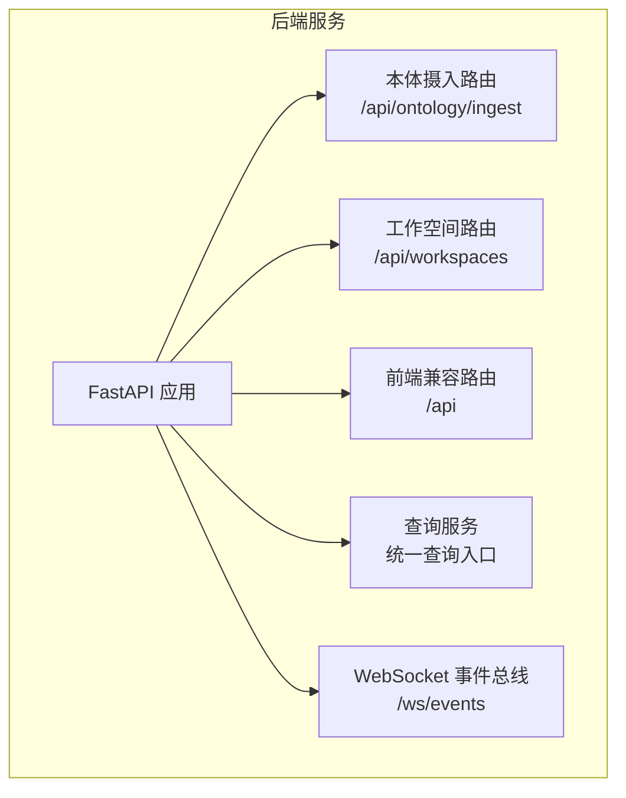
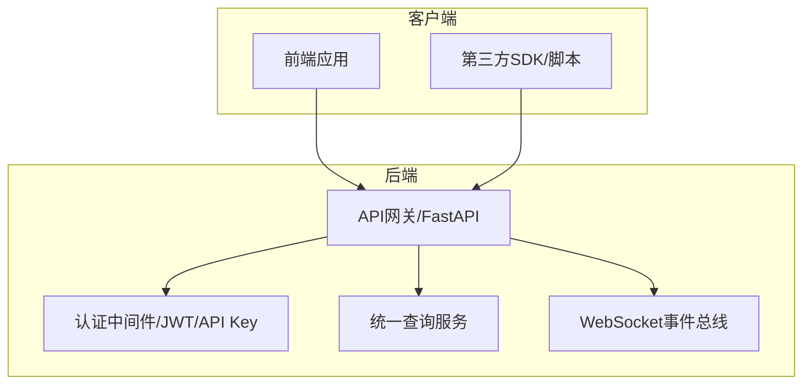
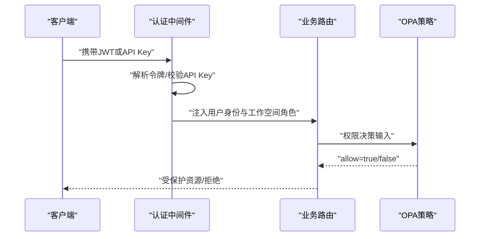
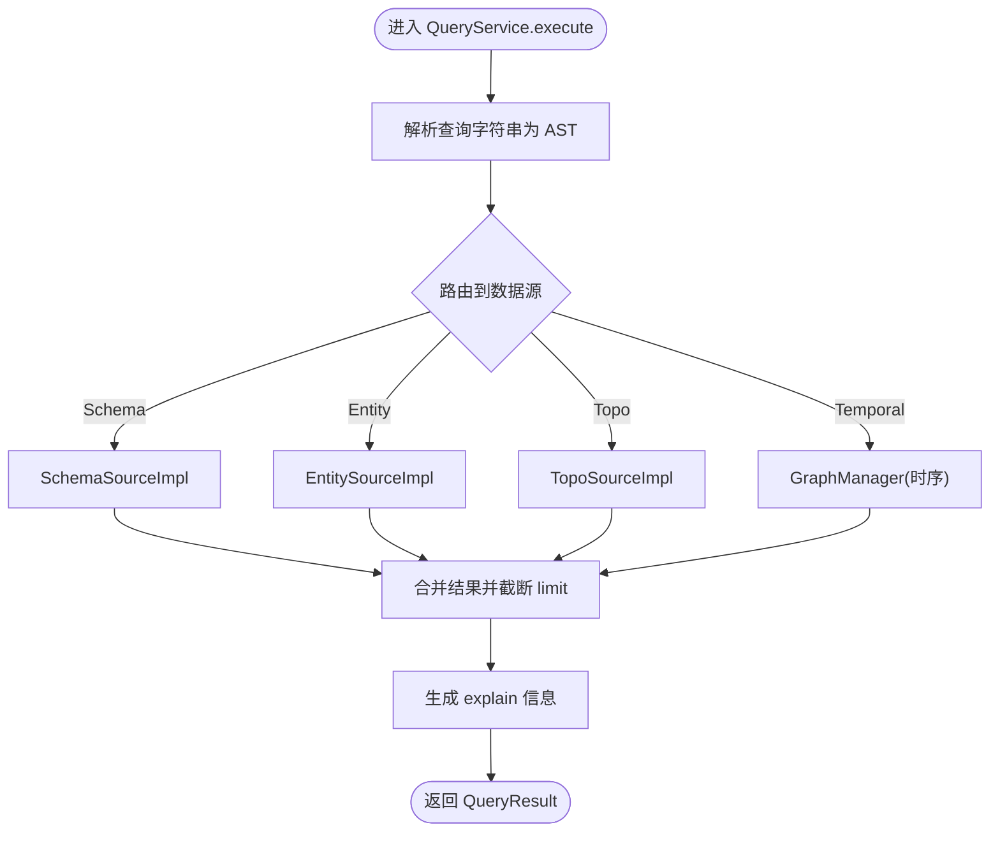
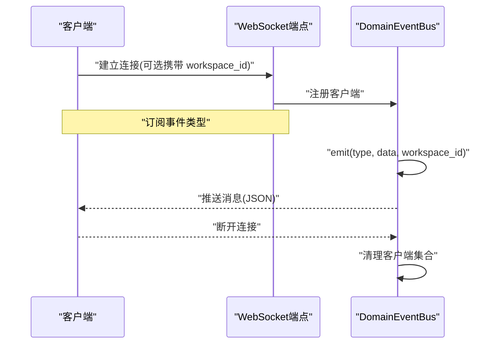

# API参考

<cite>
**本文引用的文件**
- [BACKEND_API_DESIGN.md](file://docs/10-api/BACKEND_API_DESIGN.md)
- [routes.py（本体摄入API）](file://odap/biz/core/ontology/api/routes.py)
- [routes.py（工作空间API）](file://odap/biz/platform/workspace/api/routes.py)
- [service.py（统一查询服务）](file://odap/infra/query/service.py)
- [event_bus.py（WebSocket事件总线）](file://odap/web/ws/event_bus.py)
- [DESIGN.md（认证模块设计）](file://docs/03-modules/auth/DESIGN.md)
- [BACKEND_API_DESIGN.md（数据库设计）](file://docs/10-api/DATABASE_DESIGN.md)
- [useQAI.ts（前端问答Hook）](file://frontend/src/modules/qa/hooks/useQAI.ts)
</cite>

## 目录
1. [简介](#简介)
2. [项目结构](#项目结构)
3. [核心组件](#核心组件)
4. [架构总览](#架构总览)
5. [详细组件分析](#详细组件分析)
6. [依赖分析](#依赖分析)
7. [性能考虑](#性能考虑)
8. [故障排查指南](#故障排查指南)
9. [结论](#结论)
10. [附录](#附录)

## 简介
本文件为 ODAP 平台的完整 API 参考文档，覆盖认证授权、本体管理、工作空间、智能体、查询服务、WebSocket 实时通信等核心模块。文档基于仓库内现有设计与实现进行整理，提供统一查询服务的语法与参数说明、WebSocket 消息格式、API 版本管理与错误码约定，并给出请求/响应示例与客户端集成建议。

## 项目结构
ODAP 后端基于 FastAPI 构建，采用模块化路由注册方式，主要模块包括：
- 本体摄入 API：统一摄入与版本管理
- 工作空间 API：工作空间、隔离策略、导入导出、场景与版本
- 前端兼容 API：场景、数据摄入、版本、审计、图谱、问答、用户认知引擎、策略、监控、本体 Schema
- 查询服务：统一 Schema/Entity/Topo/Temporal 查询入口
- WebSocket：事件总线，支持按工作空间广播



**章节来源**
- [BACKEND_API_DESIGN.md: 14-30:14-30](file://docs/10-api/BACKEND_API_DESIGN.md#L14-L30)

## 核心组件
- 认证授权：支持 JWT 与 API Key，中间件注入用户身份与工作空间角色，配合 OPA 进行权限决策。
- 本体摄入：支持新闻、手动、JSON、自然语言、随机事件、Tavily 等多种摄入方式，提供构建状态、版本回滚、文档查询等能力。
- 工作空间：工作空间 CRUD、成员管理、隔离策略、导入导出、场景与本体版本管理。
- 统一查询服务：统一 Schema/Entity/Topo/Temporal 查询语法，解析并路由至对应数据源。
- WebSocket：事件总线支持实体变更、情报更新、行动结果、OA DP 进度、OPA 校验、审计事件等主题广播。

**章节来源**
- [DESIGN.md: 306-343:306-343](file://docs/03-modules/auth/DESIGN.md#L306-L343)
- [BACKEND_API_DESIGN.md: 66-192:66-192](file://docs/10-api/BACKEND_API_DESIGN.md#L66-L192)
- [BACKEND_API_DESIGN.md: 195-280:195-280](file://docs/10-api/BACKEND_API_DESIGN.md#L195-L280)
- [service.py: 11-126:11-126](file://odap/infra/query/service.py#L11-L126)
- [event_bus.py: 13-147:13-147](file://odap/web/ws/event_bus.py#L13-L147)

## 架构总览
ODAP 后端通过 FastAPI 路由模块化组织，统一响应格式与错误结构，查询服务作为统一入口聚合多源数据，WebSocket 提供事件广播能力。



**图示来源**
- [BACKEND_API_DESIGN.md: 31-62:31-62](file://docs/10-api/BACKEND_API_DESIGN.md#L31-L62)
- [service.py: 33-70:33-70](file://odap/infra/query/service.py#L33-L70)
- [event_bus.py: 34-129:34-129](file://odap/web/ws/event_bus.py#L34-L129)

## 详细组件分析

### 认证授权 API
- 支持方式
  - OAuth2/OIDC：企业 SSO，回调后签发 JWT
  - 本地账号密码：PostgreSQL users 表
  - API Key：系统集成与自动化脚本
- 中间件
  - JWT：从 Authorization 或 Cookie 提取，注入 user_id、role、workspace_id、workspace_role
  - API Key：从请求头 X-ODAP-API-Key 注入
- 装饰器
  - require_auth：路由依赖，校验认证与可选角色
- 与 OPA 对接
  - 输入结构：{user: {id, role, ws_role, auth_method}, action, resource, workspace_id}
  - 包名：odap.authz



**图示来源**
- [DESIGN.md: 306-343:306-343](file://docs/03-modules/auth/DESIGN.md#L306-L343)
- [DESIGN.md: 362-382:362-382](file://docs/03-modules/auth/DESIGN.md#L362-L382)

**章节来源**
- [DESIGN.md: 45-84:45-84](file://docs/03-modules/auth/DESIGN.md#L45-L84)
- [DESIGN.md: 306-382:306-382](file://docs/03-modules/auth/DESIGN.md#L306-L382)
- [DESIGN.md: 386-396:386-396](file://docs/03-modules/auth/DESIGN.md#L386-L396)

### 本体摄入 API
- 路由前缀：/api/ontology/ingest
- 通用摄入接口
  - 方法：POST
  - 路径：/api/ontology/ingest
  - 请求体：包含 data、data_type、scenario_id
- 独立摄入端点
  - /api/ontology/ingest/news
  - /api/ontology/ingest/manual
  - /api/ontology/ingest/json
  - /api/ontology/ingest/natural-language
  - /api/ontology/ingest/random
  - /api/ontology/ingest/tavily
- 构建与版本
  - /api/ontology/ingest/builds/{build_id}
  - /api/ontology/ingest/builds
  - /api/ontology/ingest/{ingest_id}/build
  - /api/ontology/ingest/versions/rollback
  - /api/ontology/ingest/versions
- 文档与日志
  - /api/ontology/ingest/documents/list
  - /api/ontology/ingest/documents/{doc_id}
  - /api/ontology/ingest（摄入历史）
  - /api/ontology/ingest/{ingest_id}（摄入状态）
  - /api/ontology/ingest/{ingest_id}/logs（处理日志）
  - /api/ontology/ingest/{ingest_id}/build-history（构建历史）
  - /api/ontology/ingest/{ingest_id}/full（完整摄入记录）
  - /api/ontology/ingest/random/generators（生成器类型）

请求/响应示例（示意）
- 通用摄入请求体
  - data: string
  - data_type: text|news|manual|json|natural_language|random
  - scenario_id: string|null
- 统一响应 IngestResponse
  - ingest_id: string
  - status: pending|processing|completed|failed
  - source_details: object|null
  - original_content: string|null
  - extracted_data: object|null

**章节来源**
- [BACKEND_API_DESIGN.md: 66-192:66-192](file://docs/10-api/BACKEND_API_DESIGN.md#L66-L192)
- [routes.py（本体摄入API）: 74-125:74-125](file://odap/biz/core/ontology/api/routes.py#L74-L125)
- [routes.py（本体摄入API）: 294-352:294-352](file://odap/biz/core/ontology/api/routes.py#L294-L352)
- [routes.py（本体摄入API）: 354-416:354-416](file://odap/biz/core/ontology/api/routes.py#L354-L416)
- [routes.py（本体摄入API）: 419-527:419-527](file://odap/biz/core/ontology/api/routes.py#L419-L527)

### 工作空间 API
- 路由前缀：/api/workspaces
- 工作空间 CRUD
  - POST /api/workspaces
  - GET /api/workspaces
  - GET /api/workspaces/{workspace_id}
  - PUT /api/workspaces/{workspace_id}
  - DELETE /api/workspaces/{workspace_id}
- 操作
  - POST /api/workspaces/{workspace_id}/activate
  - POST /api/workspaces/{workspace_id}/deactivate
  - POST /api/workspaces/{workspace_id}/members/{user_id}
  - DELETE /api/workspaces/{workspace_id}/members/{user_id}
- 隔离策略
  - GET /api/workspaces/{workspace_id}/isolation
  - PUT /api/workspaces/{workspace_id}/isolation
- 导入导出
  - POST /api/workspaces/{workspace_id}/import
  - POST /api/workspaces/{workspace_id}/export
- 场景管理
  - GET /api/workspaces/{workspace_id}/scenarios
  - POST /api/workspaces/{workspace_id}/scenarios
  - GET /api/workspaces/{workspace_id}/scenarios/{scenario_id}
  - PUT /api/workspaces/{workspace_id}/scenarios/{scenario_id}
  - DELETE /api/workspaces/{workspace_id}/scenarios/{scenario_id}
- 版本与冲突
  - GET /api/workspaces/{workspace_id}/versions
  - POST /api/workspaces/{workspace_id}/conflicts/scan
  - POST /api/workspaces/{workspace_id}/conflicts/fix

请求/响应示例（示意）
- 创建工作空间请求 CreateWorkspaceRequest
  - name: string
  - description: string|null
  - type: default|shared|private|temporary
  - isolation_strategy: low|standard|high|strict
  - owner: string|null
  - tags: string[]
- 工作空间响应 WorkspaceResponse
  - id: string
  - name: string
  - description: string|null
  - type: string
  - status: string
  - owner: string
  - members: string[]
  - config: object
  - tags: string[]
  - created_at: string
  - updated_at: string

**章节来源**
- [BACKEND_API_DESIGN.md: 195-280:195-280](file://docs/10-api/BACKEND_API_DESIGN.md#L195-L280)
- [routes.py（工作空间API）: 32-124:32-124](file://odap/biz/platform/workspace/api/routes.py#L32-L124)
- [routes.py（工作空间API）: 182-236:182-236](file://odap/biz/platform/workspace/api/routes.py#L182-L236)
- [routes.py（工作空间API）: 238-350:238-350](file://odap/biz/platform/workspace/api/routes.py#L238-L350)
- [routes.py（工作空间API）: 352-488:352-488](file://odap/biz/platform/workspace/api/routes.py#L352-L488)
- [routes.py（工作空间API）: 551-701:551-701](file://odap/biz/platform/workspace/api/routes.py#L551-L701)
- [routes.py（工作空间API）: 703-758:703-758](file://odap/biz/platform/workspace/api/routes.py#L703-L758)

### 前端兼容 API（场景、摄入、版本、审计、图谱、问答、认知引擎、策略、监控、本体Schema）
- 路由前缀：/api
- 场景管理
  - POST /api/scenarios
  - GET /api/scenarios
  - GET /api/scenarios/{scenario_id}
  - PUT /api/scenarios/{scenario_id}
  - DELETE /api/scenarios/{scenario_id}
  - POST /api/scenarios/{scenario_id}/sync
  - GET /api/scenarios/{scenario_id}/timeline
  - GET /api/scenarios/{scenario_id}/entities
  - GET /api/scenarios/{scenario_id}/relations
  - GET /api/scenarios/{scenario_id}/export
- 数据摄入
  - POST /api/ingest/text
  - POST /api/ingest/news
  - POST /api/ingest/random
  - POST /api/ingest/manual
  - POST /api/ingest/file
  - GET /api/ingest/status/{task_id}
- 版本管理
  - GET /api/versions
  - GET /api/versions/{version_id}
  - POST /api/versions/{version_id}/rollback
  - GET /api/versions/diff
- 审计日志
  - GET /api/audit/events
  - GET /api/audit/timeline
  - GET /api/audit/stats
  - GET /api/audit/trace/{trace_id}
- 实体查询与图谱
  - GET /api/entities/{entity_id}
  - GET /api/entities/{entity_id}/history
  - GET /api/query/relations
  - POST /api/graph/generate
  - GET /api/graph/progress/{task_id}
  - POST /api/graph/cancel/{task_id}
  - GET /api/graph/history
  - GET /api/graph/detail/{task_id}
- 智能问答
  - POST /api/qa/ask
  - POST /api/qa/stream
  - GET /api/qa/sessions
  - GET /api/qa/sessions/{session_id}
  - POST /api/qa/feedback
- 用户认知引擎
  - POST /api/cognition/intent
  - POST /api/cognition/view
  - POST /api/cognition/navigate
  - POST /api/cognition/explain
- 闭环反馈
  - POST /api/feedback/action
  - POST /api/feedback/decision
- 策略管理
  - GET /api/policies
  - GET /api/policies/{policy_id}
  - POST /api/policies
  - PUT /api/policies/{policy_id}
  - DELETE /api/policies/{policy_id}
- 系统监控
  - GET /api/v1/monitoring/metrics
  - GET /health
- 本体 Schema
  - GET /api/ontology/schema

**章节来源**
- [BACKEND_API_DESIGN.md: 472-585:472-585](file://docs/10-api/BACKEND_API_DESIGN.md#L472-L585)

### 统一查询服务（Schema/Entity/Topo/Temporal）
- 统一入口：QueryService.execute(workspace_id, query, limit)
- 语法与参数
  - Schema 查询：.schema object_types|link_definitions|action_types(...)
  - Entity 查询：.entity with(...) 或 .entity search("...") 或 .entity id("...")
  - Topo 查询：.topo neighbors(id="...", depth=..., direction="both"|out|in") 或 .topo relations(id="...", type="...") 或 .topo path(from="...", to="...", max_depth=...)
  - Temporal 查询：.temporal history(id="...") 或 .temporal at(valid_time="...", type="...")



**图示来源**
- [service.py: 33-70:33-70](file://odap/infra/query/service.py#L33-L70)
- [service.py: 72-126:72-126](file://odap/infra/query/service.py#L72-L126)

**章节来源**
- [service.py: 11-126:11-126](file://odap/infra/query/service.py#L11-L126)

### WebSocket 实时通信
- 端点：/ws/events
- 连接与订阅
  - accept 连接，可按 workspace_id 分组
  - 订阅事件类型，回调执行
- 广播与历史
  - 按工作空间或全局广播
  - 维护最近 N 条事件历史
- 主题示例
  - entity:changed
  - intel:updated
  - action:result
  - oadp:progress
  - opa:check
  - audit:event

消息格式（示例）
- 字段
  - type: 事件类型
  - data: 事件负载
  - workspace_id: 工作空间ID
  - timestamp: UTC ISO 时间



**图示来源**
- [event_bus.py: 21-59:21-59](file://odap/web/ws/event_bus.py#L21-L59)
- [event_bus.py: 60-113:60-113](file://odap/web/ws/event_bus.py#L60-L113)
- [event_bus.py: 114-140:114-140](file://odap/web/ws/event_bus.py#L114-L140)

**章节来源**
- [BACKEND_API_DESIGN.md: 587-592:587-592](file://docs/10-api/BACKEND_API_DESIGN.md#L587-L592)
- [event_bus.py: 13-147:13-147](file://odap/web/ws/event_bus.py#L13-L147)

### 前端问答集成（示例）
- 端点
  - /api/qa/ask
  - /api/qa/stream
  - /api/qa/sessions
- Hook 使用
  - useQAI：封装消息发送、会话管理、流式接收、错误处理

**章节来源**
- [BACKEND_API_DESIGN.md: 536-545:536-545](file://docs/10-api/BACKEND_API_DESIGN.md#L536-L545)
- [useQAI.ts: 5-82:5-82](file://frontend/src/modules/qa/hooks/useQAI.ts#L5-L82)

## 依赖分析
- 存储架构
  - SQLite：工作空间、业务规则、角色权限、审计日志
  - MongoDB：本体文档、摄入记录、构建结果、验证结果
  - Graphiti：图谱与时序推理
  - Redis：缓存与会话状态
- 跨模块关系
  - 工作空间与场景：workspaces.id → scenarios.workspace_id
  - 本体版本与文档：versions.ontology_id → ontology_documents
  - 审计事件与工作空间：audit_events.workspace_id → workspaces.id

```mermaid
graph TB
subgraph "SQLite"
W["workspace.db"]
B["business.db"]
R["roles.db"]
A["audit.db"]
end
subgraph "MongoDB"
O["ontology.*"]
AU["audit.*"]
end
subgraph "Graphiti"
G["图谱与时序"]
end
W <- --> A
O <- --> AU
W --- G
O --- G
```

**图示来源**
- [BACKEND_API_DESIGN.md: 14-29:14-29](file://docs/10-api/DATABASE_DESIGN.md#L14-L29)
- [BACKEND_API_DESIGN.md: 747-775:747-775](file://docs/10-api/DATABASE_DESIGN.md#L747-L775)

**章节来源**
- [BACKEND_API_DESIGN.md: 8-33:8-33](file://docs/10-api/DATABASE_DESIGN.md#L8-L33)
- [BACKEND_API_DESIGN.md: 36-480:36-480](file://docs/10-api/DATABASE_DESIGN.md#L36-L480)

## 性能考虑
- 查询服务
  - 限制 limit，避免一次性返回大量数据
  - Schema/Entity/Topo/Temporal 分源查询，按需路由
- WebSocket
  - 控制历史条目上限，避免内存膨胀
  - 按工作空间分组广播，减少无关推送
- 存储
  - SQLite 事务与索引优化
  - MongoDB TTL 索引与分片策略（按需）
  - Graphiti 索引与查询计划优化

## 故障排查指南
- 通用响应与错误
  - 成功响应：{"data": {}, "message": "success"}
  - 分页响应：{"data": [], "page": 1, "page_size": 10, "total": 100, "has_more": true}
  - 错误响应：{"error": {"code": "INVALID_PARAMETER", "message": "参数验证失败", "details": []}, "request_id": "req-abc123"}
- 常见问题定位
  - 认证失败：确认 Authorization 头或 Cookie 中的 JWT 是否有效
  - 权限不足：检查用户角色与工作空间角色是否满足要求
  - 查询异常：查看 explain 字段，确认路由到的源与参数
  - WebSocket 无法接收：确认连接参数与工作空间ID是否匹配

**章节来源**
- [BACKEND_API_DESIGN.md: 31-62:31-62](file://docs/10-api/BACKEND_API_DESIGN.md#L31-L62)

## 结论
本文档提供了 ODAP 平台的核心 API 参考，涵盖认证授权、本体摄入、工作空间、统一查询服务与 WebSocket 实时通信。建议在生产环境中结合认证中间件与 OPA 策略进行权限控制，合理设置查询 limit 与 WebSocket 历史容量，并利用统一查询服务与前端 Hook 提升开发效率与用户体验。

## 附录
- API 版本管理
  - 本体版本：/api/ontology/ingest/versions、/api/ontology/ingest/versions/rollback
  - 场景版本：/api/workspaces/{workspace_id}/scenarios/{scenario_id}/versions
  - 前端兼容版本：/api/versions、/api/versions/{version_id}/rollback
- 错误码与状态码
  - 400：参数错误/无效源类型
  - 401：未认证
  - 403：权限不足
  - 404：资源不存在
  - 500：服务器内部错误
- 客户端集成建议
  - 使用 JWT 或 API Key 进行鉴权
  - 对查询结果进行分页与缓存
  - 通过 /ws/events 订阅关键事件
  - 使用前端 Hook（如 useQAI）简化问答集成