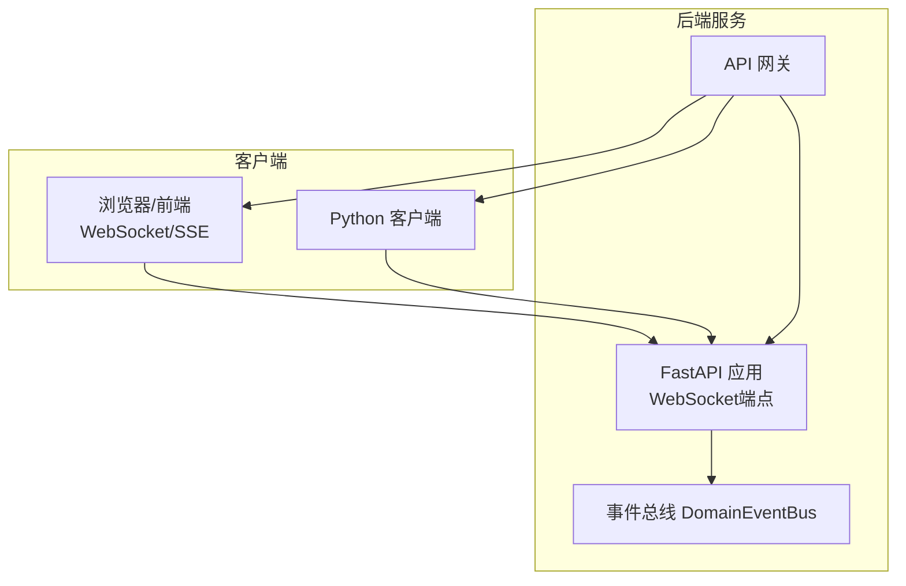
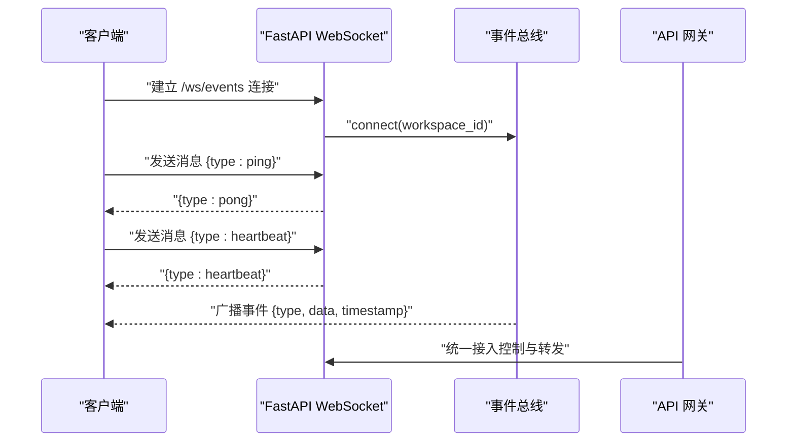
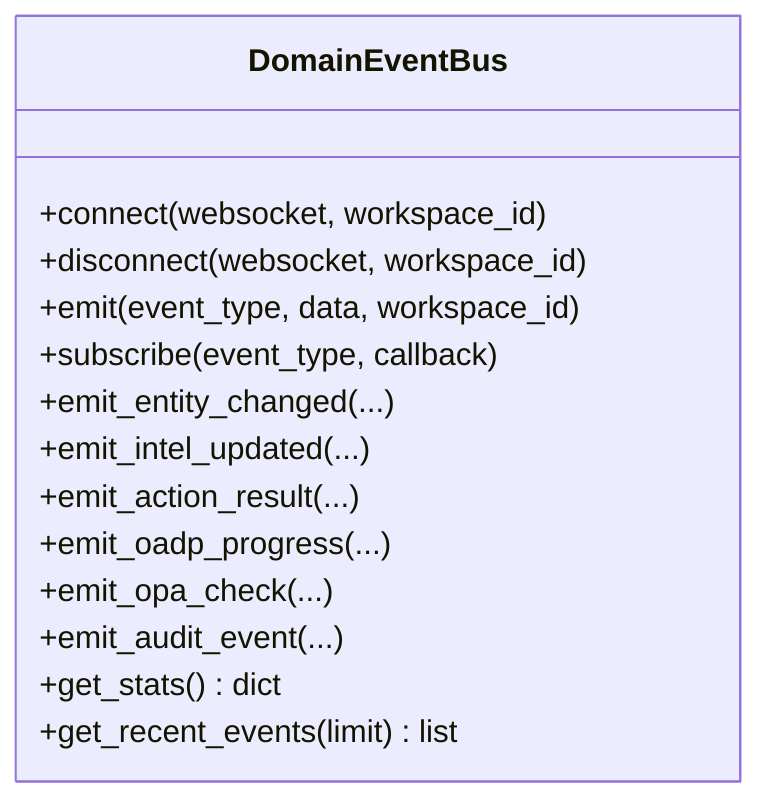
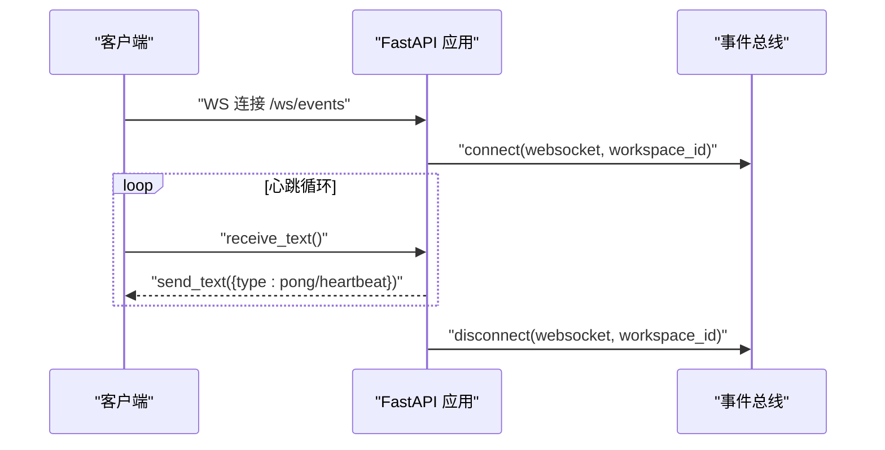
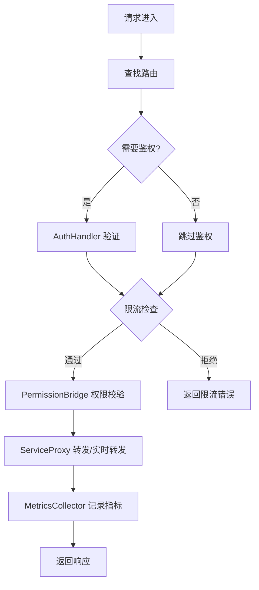
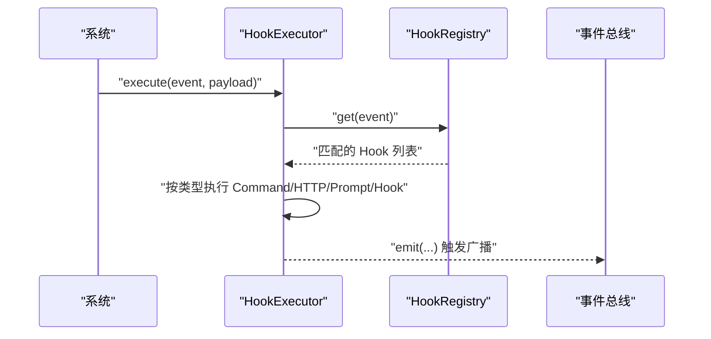
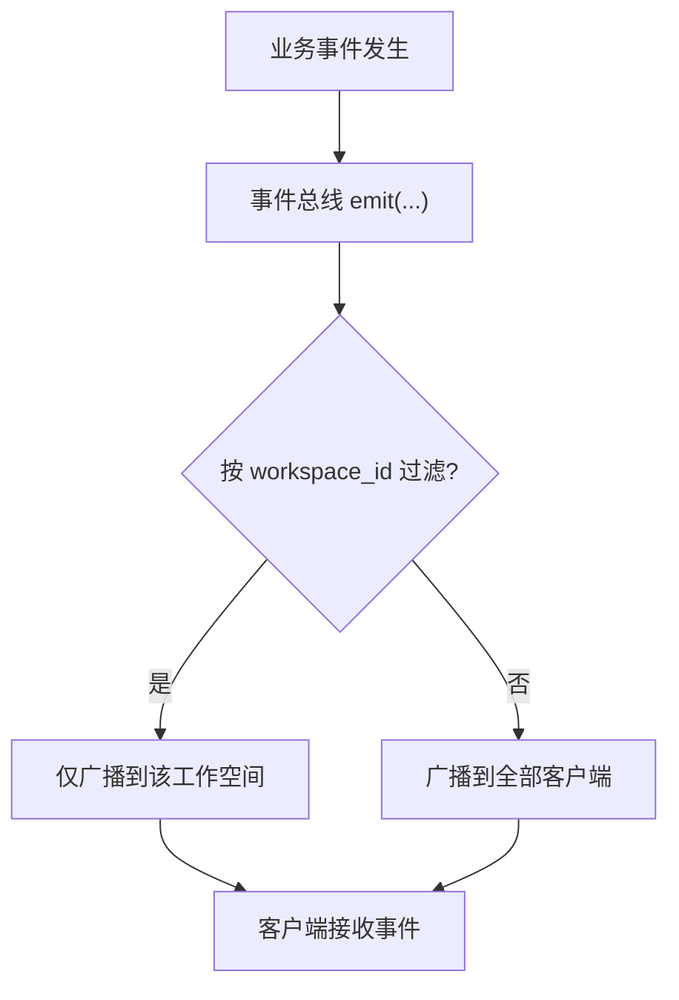
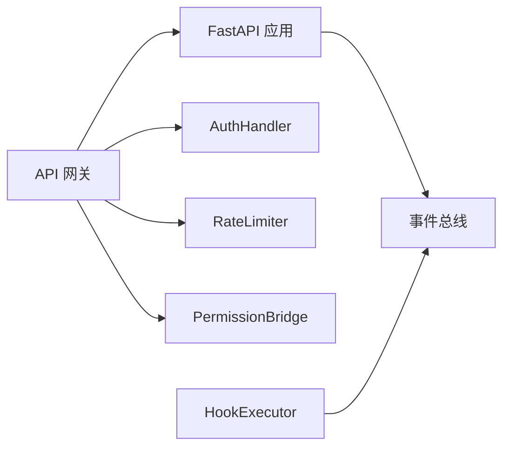

# 实时通信API

<cite>
**本文档引用的文件**
- [odap/web/ws/event_bus.py](file://odap/web/ws/event_bus.py)
- [odap/web/api/app.py](file://odap/web/api/app.py)
- [odap/web/gateway/api_gateway.py](file://odap/web/gateway/api_gateway.py)
- [docs/02-architecture/ARCHITECTURE_FULL_CHAIN_DEEP.md](file://docs/02-architecture/ARCHITECTURE_FULL_CHAIN_DEEP.md)
- [openharness/src/openharness/channels/bus/events.py](file://openharness/src/openharness/channels/bus/events.py)
- [openharness/src/openharness/channels/bus/queue.py](file://openharness/src/openharness/channels/bus/queue.py)
- [openharness/src/openharness/hooks/executor.py](file://openharness/src/openharness/hooks/executor.py)
- [docs/03-modules/event_simulator/DESIGN.md](file://docs/03-modules/event_simulator/DESIGN.md)
- [odap/biz/platform/ontology_memory/shared_workspace/routes.py](file://odap/biz/platform/ontology_memory/shared_workspace/routes.py)
</cite>

## 目录
1. [简介](#简介)
2. [项目结构](#项目结构)
3. [核心组件](#核心组件)
4. [架构总览](#架构总览)
5. [详细组件分析](#详细组件分析)
6. [依赖分析](#依赖分析)
7. [性能考虑](#性能考虑)
8. [故障排查指南](#故障排查指南)
9. [结论](#结论)
10. [附录](#附录)

## 简介
本文件为 ODAP 平台的实时通信API提供权威参考，覆盖以下主题：
- WebSocket 连接建立、消息传输与心跳保活
- 事件总线的发布/订阅/取消订阅机制与REST端点
- Hook 系统的生命周期事件接口与实时回调
- API 网关的实时转发（WebSocket/SSE）、路由、限流与指标
- 消息格式规范（事件类型、数据结构、时间戳）
- 客户端集成示例（JavaScript、Python）
- 连接管理、心跳检测、断线重连策略

## 项目结构
ODAP 的实时通信能力由后端服务、事件总线、API 网关与前端/客户端共同组成。核心模块包括：
- WebSocket 事件总线：负责事件发布、订阅、广播与统计
- FastAPI 应用：提供 WebSocket 端点与 REST API
- API 网关：统一接入、鉴权、限流、权限校验与实时转发
- Hook 系统：基于生命周期的事件监听与回调
- 文档与设计：包含 WebSocket 进度推送、SSE 流式输出等架构说明

**图表来源**
- [odap/web/api/app.py:808-836](file://odap/web/api/app.py#L808-L836)
- [odap/web/ws/event_bus.py:13-147](file://odap/web/ws/event_bus.py#L13-L147)
- [odap/web/gateway/api_gateway.py:360-494](file://odap/web/gateway/api_gateway.py#L360-L494)

**章节来源**
- [odap/web/api/app.py:808-836](file://odap/web/api/app.py#L808-L836)
- [odap/web/ws/event_bus.py:13-147](file://odap/web/ws/event_bus.py#L13-L147)
- [odap/web/gateway/api_gateway.py:360-494](file://odap/web/gateway/api_gateway.py#L360-L494)

## 核心组件
- 事件总线 DomainEventBus：维护 WebSocket 客户端集合、按工作空间分组、事件历史、订阅回调与广播逻辑
- FastAPI WebSocket 端点：提供 /ws/events，支持 ping/pong 心跳与心跳保活
- API 网关：统一鉴权、限流、权限校验与实时转发；提供 /ws/* 端点路由
- Hook 系统：通过生命周期事件触发回调，支持 HTTP/Hook/Prompt/Command 等类型
- 文档与设计：包含进度推送与 SSE 流式输出的实现与前端消费示例

**章节来源**
- [odap/web/ws/event_bus.py:13-147](file://odap/web/ws/event_bus.py#L13-L147)
- [odap/web/api/app.py:808-836](file://odap/web/api/app.py#L808-L836)
- [openharness/src/openharness/hooks/executor.py:41-75](file://openharness/src/openharness/hooks/executor.py#L41-L75)
- [docs/02-architecture/ARCHITECTURE_FULL_CHAIN_DEEP.md:1167-1236](file://docs/02-architecture/ARCHITECTURE_FULL_CHAIN_DEEP.md#L1167-L1236)

## 架构总览
ODAP 实时通信的总体流程如下：
- 客户端通过 WebSocket 连接 /ws/events
- 服务端事件总线接受事件并广播至目标工作空间或全部客户端
- API 网关对实时端点进行统一接入控制与转发
- Hook 系统在特定生命周期触发回调，驱动事件总线广播
- 文档与设计提供了进度推送与 SSE 的实现参考

**图表来源**
- [odap/web/api/app.py:808-836](file://odap/web/api/app.py#L808-L836)
- [odap/web/ws/event_bus.py:21-46](file://odap/web/ws/event_bus.py#L21-L46)
- [odap/web/gateway/api_gateway.py:435-477](file://odap/web/gateway/api_gateway.py#L435-L477)

## 详细组件分析

### WebSocket 事件总线（DomainEventBus）
- 连接管理：accept、connect、disconnect，支持按 workspace_id 分组
- 事件发布：emit 统一格式，包含 type、data、workspace_id、timestamp
- 广播策略：支持按 workspace_id 或全量广播，自动清理失效连接
- 订阅回调：支持为特定事件类型注册回调函数
- 历史记录：维护事件历史上限，便于回放与调试
- 统计接口：提供总连接数、各工作空间连接数、事件类型与历史大小

**图表来源**
- [odap/web/ws/event_bus.py:13-147](file://odap/web/ws/event_bus.py#L13-L147)

**章节来源**
- [odap/web/ws/event_bus.py:13-147](file://odap/web/ws/event_bus.py#L13-L147)

### FastAPI WebSocket 端点（/ws/events）
- 连接建立：接受 WebSocket 请求，加入事件总线
- 心跳保活：超时检测，发送 heartbeat 以维持连接
- 消息处理：支持 ping/pong 心跳与订阅占位（subscribe）
- 断开处理：捕获断开异常，清理连接

**图表来源**
- [odap/web/api/app.py:808-836](file://odap/web/api/app.py#L808-L836)

**章节来源**
- [odap/web/api/app.py:808-836](file://odap/web/api/app.py#L808-L836)

### API 网关实时转发
- 路由模型：Route 定义路径、方法、上游服务、鉴权与权限
- 鉴权与限流：AuthHandler、RateLimiter 提供 JWT 验证与令牌桶限流
- 权限桥接：PermissionBridge 通过 OPA 策略查询
- 连接管理：ConnectionManager 维护 WebSocket/SSE 连接并支持广播
- 指标采集：MetricsCollector 记录延迟与成功率
- 实时端点：默认包含 /ws/simulation/{id}、/ws/graph/updates 等

**图表来源**
- [odap/web/gateway/api_gateway.py:360-494](file://odap/web/gateway/api_gateway.py#L360-L494)

**章节来源**
- [odap/web/gateway/api_gateway.py:360-494](file://odap/web/gateway/api_gateway.py#L360-L494)

### Hook 系统与生命周期事件
- Hook 执行器：支持 Command、HTTP、Prompt、Hook 等类型，按事件匹配执行
- 生命周期事件：可在特定生命周期触发回调，驱动事件总线广播
- 通道消息总线：InboundMessage/OutboundMessage 支持跨通道通信与会话键管理

**图表来源**
- [openharness/src/openharness/hooks/executor.py:41-75](file://openharness/src/openharness/hooks/executor.py#L41-L75)
- [openharness/src/openharness/channels/bus/events.py:8-38](file://openharness/src/openharness/channels/bus/events.py#L8-L38)
- [openharness/src/openharness/channels/bus/queue.py:8-44](file://openharness/src/openharness/channels/bus/queue.py#L8-L44)

**章节来源**
- [openharness/src/openharness/hooks/executor.py:41-75](file://openharness/src/openharness/hooks/executor.py#L41-L75)
- [openharness/src/openharness/channels/bus/events.py:8-38](file://openharness/src/openharness/channels/bus/events.py#L8-L38)
- [openharness/src/openharness/channels/bus/queue.py:8-44](file://openharness/src/openharness/channels/bus/queue.py#L8-L44)

### 事件总线 REST API（事件发布/订阅/取消订阅）
- 事件发布：通过事件总线 emit 接口发布事件，支持按 workspace_id 广播
- 订阅/取消订阅：事件总线提供 subscribe 与内部广播逻辑，客户端通过 WebSocket 订阅
- REST 端点：共享工作空间上下文提供事件消费与心跳等 REST 接口

**图表来源**
- [odap/web/ws/event_bus.py:34-46](file://odap/web/ws/event_bus.py#L34-L46)
- [odap/biz/platform/ontology_memory/shared_workspace/routes.py:77-109](file://odap/biz/platform/ontology_memory/shared_workspace/routes.py#L77-L109)

**章节来源**
- [odap/web/ws/event_bus.py:34-46](file://odap/web/ws/event_bus.py#L34-L46)
- [odap/biz/platform/ontology_memory/shared_workspace/routes.py:77-109](file://odap/biz/platform/ontology_memory/shared_workspace/routes.py#L77-L109)

### 消息格式规范
- 通用事件格式
  - type：事件类型字符串
  - data：事件数据对象
  - workspace_id：工作空间标识（可选）
  - timestamp：UTC 时间戳字符串
- 典型事件类型
  - entity:changed、intel:updated、action:result、oadp:progress、opa:check、audit:event
- 心跳与保活
  - 客户端发送 {type: "ping"}，服务端返回 {type: "pong"}
  - 超时未收到消息时，服务端发送 {type: "heartbeat"}

**章节来源**
- [odap/web/ws/event_bus.py:34-46](file://odap/web/ws/event_bus.py#L34-L46)
- [odap/web/api/app.py:808-836](file://odap/web/api/app.py#L808-L836)

### 客户端集成示例

#### JavaScript（浏览器/前端）
- WebSocket 连接
  - 连接地址：ws://host:port/ws/events?workspace_id=xxx
  - 心跳：定时发送 {type: "ping"}，收到 {type: "pong"} 或 {type: "heartbeat"} 表示存活
- SSE 流式输出（参考文档中的实现）
  - 端点：/qa/chat/stream
  - 事件类型：token、tool_call、suggestion、entity_link、error、done
  - 前端解析 event/data 并渲染

**章节来源**
- [docs/02-architecture/ARCHITECTURE_FULL_CHAIN_DEEP.md:2621-2715](file://docs/02-architecture/ARCHITECTURE_FULL_CHAIN_DEEP.md#L2621-L2715)
- [docs/02-architecture/ARCHITECTURE_FULL_CHAIN_DEEP.md:2717-2832](file://docs/02-architecture/ARCHITECTURE_FULL_CHAIN_DEEP.md#L2717-L2832)

#### Python（客户端）
- WebSocket 客户端
  - 使用 websockets 库连接 /ws/events
  - 发送心跳：ws.send(json.dumps({"type": "ping"}))
  - 处理事件：解析 {type, data, timestamp}
- SSE 客户端
  - 使用 requests 或 aiohttp 访问 /qa/chat/stream
  - 解析 event/data，处理 token、entity_link、suggestion、done 等事件

**章节来源**
- [docs/02-architecture/ARCHITECTURE_FULL_CHAIN_DEEP.md:2621-2715](file://docs/02-architecture/ARCHITECTURE_FULL_CHAIN_DEEP.md#L2621-L2715)

### 连接管理、心跳检测与断线重连
- 连接管理
  - 事件总线维护全局与按工作空间的连接集合，断线自动清理
  - API 网关 ConnectionManager 统一管理实时连接
- 心跳检测
  - 客户端定期发送 ping，服务端返回 pong/heartbeat
  - 超时未收到消息，服务端主动发送 heartbeat 以维持连接
- 断线重连
  - 建议客户端在收到断开或异常时，按指数退避重连
  - 重连后可选择从最近事件历史或当前时间点继续订阅

**章节来源**
- [odap/web/ws/event_bus.py:114-129](file://odap/web/ws/event_bus.py#L114-L129)
- [odap/web/api/app.py:808-836](file://odap/web/api/app.py#L808-L836)
- [odap/web/gateway/api_gateway.py:285-324](file://odap/web/gateway/api_gateway.py#L285-L324)

## 依赖分析
- 组件耦合
  - FastAPI 应用依赖事件总线进行广播
  - API 网关依赖鉴权、限流与权限模块
  - Hook 系统通过事件总线与业务事件解耦
- 外部依赖
  - websockets、httpx、jwt 等第三方库
  - SSE 与前端消费端需注意浏览器兼容性与 Nginx 缓冲设置

**图表来源**
- [odap/web/api/app.py:282-284](file://odap/web/api/app.py#L282-L284)
- [odap/web/gateway/api_gateway.py:101-173](file://odap/web/gateway/api_gateway.py#L101-L173)
- [openharness/src/openharness/hooks/executor.py:41-75](file://openharness/src/openharness/hooks/executor.py#L41-L75)

**章节来源**
- [odap/web/api/app.py:282-284](file://odap/web/api/app.py#L282-L284)
- [odap/web/gateway/api_gateway.py:101-173](file://odap/web/gateway/api_gateway.py#L101-L173)
- [openharness/src/openharness/hooks/executor.py:41-75](file://openharness/src/openharness/hooks/executor.py#L41-L75)

## 性能考虑
- 连接池与广播
  - 事件总线按工作空间分组广播，降低全量广播压力
  - 清理失效连接，避免内存泄漏
- 心跳与保活
  - 合理的心跳间隔与超时阈值，平衡资源占用与稳定性
- SSE 与 WebSocket
  - SSE 在长连接与浏览器兼容性方面表现良好，注意 Nginx 缓冲配置
  - WebSocket 适合高吞吐与低延迟场景
- API 网关
  - 限流与熔断策略防止突发流量冲击后端
  - 指标采集用于容量规划与问题定位

## 故障排查指南
- WebSocket 连接失败
  - 检查 CORS 配置与鉴权头
  - 确认 /ws/events 路由可用且未被网关拦截
- 心跳异常
  - 客户端未发送 ping 或服务端未返回 pong/heartbeat
  - 检查网络延迟与防火墙策略
- 事件未到达
  - 确认 workspace_id 是否正确传递
  - 查看事件总线统计与历史记录
- API 网关错误
  - 鉴权失败：确认 Authorization 头与 JWT 有效性
  - 限流错误：调整限流配置或降低请求频率
  - 权限拒绝：检查 OPA 策略与用户角色

**章节来源**
- [odap/web/api/app.py:524-532](file://odap/web/api/app.py#L524-L532)
- [odap/web/gateway/api_gateway.py:435-477](file://odap/web/gateway/api_gateway.py#L435-L477)

## 结论
ODAP 平台通过事件总线、FastAPI WebSocket 与 API 网关实现了完整的实时通信能力。结合 Hook 系统与文档中的 SSE/WS 示例，开发者可快速集成并扩展实时事件推送、进度监控与流式输出等场景。

## 附录

### REST API（事件模拟器）
- 场景管理与事件注入
  - POST /api/simulations/scenarios：创建场景
  - GET /api/simulations/scenarios：列出场景
  - GET /api/simulations/scenarios/{id}：获取场景状态
  - DELETE /api/simulations/scenarios/{id}：删除场景
  - POST /api/simulations/scenarios/{id}/start：启动场景
  - POST /api/simulations/scenarios/{id}/pause：暂停场景
  - POST /api/simulations/scenarios/{id}/resume：恢复场景
  - POST /api/simulations/scenarios/{id}/stop：停止场景
  - POST /api/simulations/scenarios/{id}/inject：手动注入事件
  - PUT /api/simulations/scenarios/{id}/timescale：设置时间缩放
  - GET /api/simulations/scenarios/{id}/events：获取事件列表
  - POST /api/simulations/scenarios/{id}/advance：推进模拟时间
  - GET /api/simulations/templates：列出事件模板
  - POST /api/simulations/templates：创建事件模板

**章节来源**
- [docs/03-modules/event_simulator/DESIGN.md:463-483](file://docs/03-modules/event_simulator/DESIGN.md#L463-L483)