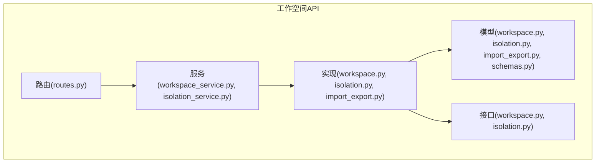
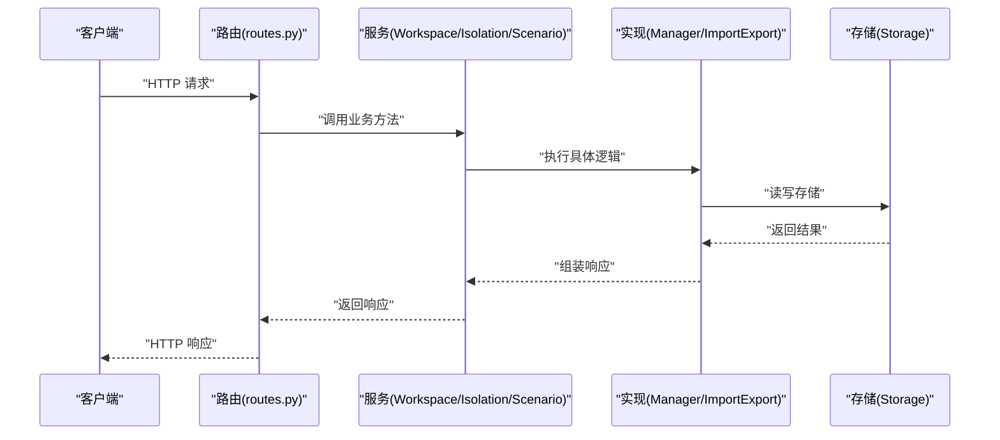
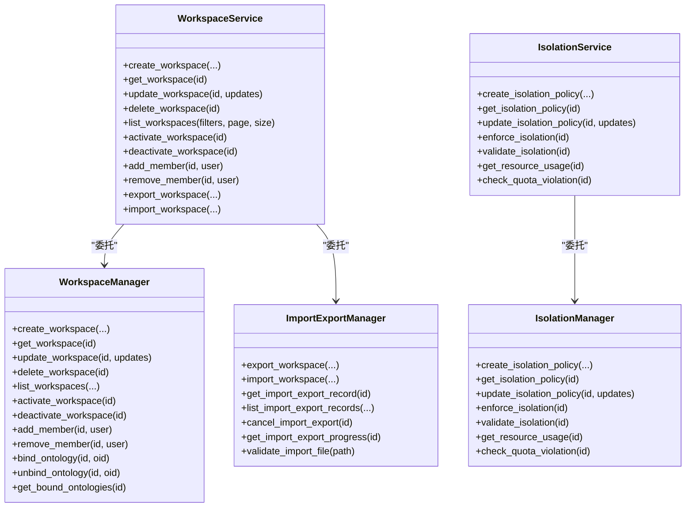
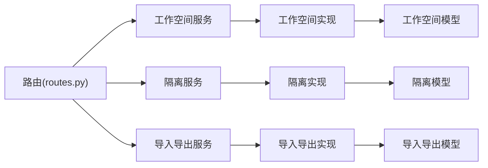

# 工作空间API

<cite>
**本文引用的文件**
- [odap/biz/platform/workspace/api/routes.py](file://odap/biz/platform/workspace/api/routes.py)
- [odap/biz/platform/workspace/api/schemas.py](file://odap/biz/platform/workspace/api/schemas.py)
- [odap/biz/platform/workspace/models/workspace.py](file://odap/biz/platform/workspace/models/workspace.py)
- [odap/biz/platform/workspace/models/isolation.py](file://odap/biz/platform/workspace/models/isolation.py)
- [odap/biz/platform/workspace/models/import_export.py](file://odap/biz/platform/workspace/models/import_export.py)
- [odap/biz/platform/workspace/services/workspace_service.py](file://odap/biz/platform/workspace/services/workspace_service.py)
- [odap/biz/platform/workspace/services/isolation_service.py](file://odap/biz/platform/workspace/services/isolation_service.py)
- [odap/biz/platform/workspace/impl/workspace.py](file://odap/biz/platform/workspace/impl/workspace.py)
- [odap/biz/platform/workspace/impl/isolation.py](file://odap/biz/platform/workspace/impl/isolation.py)
- [odap/biz/platform/workspace/impl/import_export.py](file://odap/biz/platform/workspace/impl/import_export.py)
- [odap/biz/platform/workspace/interfaces/workspace.py](file://odap/biz/platform/workspace/interfaces/workspace.py)
- [odap/biz/platform/workspace/interfaces/isolation.py](file://odap/biz/platform/workspace/interfaces/isolation.py)
- [odap/biz/integration/frontend_compat/api/routes.py](file://odap/biz/integration/frontend_compat/api/routes.py)
- [tests/unit/test_workspace.py](file://tests/unit/test_workspace.py)
</cite>

## 目录
1. [简介](#简介)
2. [项目结构](#项目结构)
3. [核心组件](#核心组件)
4. [架构总览](#架构总览)
5. [详细组件分析](#详细组件分析)
6. [依赖分析](#依赖分析)
7. [性能考虑](#性能考虑)
8. [故障排查指南](#故障排查指南)
9. [结论](#结论)
10. [附录](#附录)

## 简介
本文件为 ODAP 平台工作空间子系统的完整 RESTful API 参考文档，涵盖工作空间的创建、配置、切换、删除；工作空间隔离机制（资源配额、网络策略、权限控制、场景切换）；工作空间模板与导入导出；以及监控与统计能力。文档面向系统管理员与开发者，提供接口定义、调用流程、错误处理与最佳实践。

## 项目结构
工作空间 API 的核心代码位于 odap/biz/platform/workspace 子模块，采用“接口-实现-服务-路由”的分层设计：
- 接口层：定义抽象接口，约束实现契约
- 实现层：具体业务逻辑（工作空间、隔离、导入导出）
- 服务层：对外暴露的业务服务，封装路由与实现
- 路由层：FastAPI 路由定义，HTTP 协议入口
- 模型层：Pydantic 数据模型，请求/响应结构与枚举

**图表来源**
- [odap/biz/platform/workspace/api/routes.py:1-758](file://odap/biz/platform/workspace/api/routes.py#L1-L758)
- [odap/biz/platform/workspace/services/workspace_service.py:1-304](file://odap/biz/platform/workspace/services/workspace_service.py#L1-L304)
- [odap/biz/platform/workspace/services/isolation_service.py:1-122](file://odap/biz/platform/workspace/services/isolation_service.py#L1-L122)
- [odap/biz/platform/workspace/impl/workspace.py:1-178](file://odap/biz/platform/workspace/impl/workspace.py#L1-L178)
- [odap/biz/platform/workspace/impl/isolation.py:1-112](file://odap/biz/platform/workspace/impl/isolation.py#L1-L112)
- [odap/biz/platform/workspace/impl/import_export.py:1-164](file://odap/biz/platform/workspace/impl/import_export.py#L1-L164)
- [odap/biz/platform/workspace/models/workspace.py:1-52](file://odap/biz/platform/workspace/models/workspace.py#L1-L52)
- [odap/biz/platform/workspace/models/isolation.py:1-35](file://odap/biz/platform/workspace/models/isolation.py#L1-L35)
- [odap/biz/platform/workspace/models/import_export.py:1-34](file://odap/biz/platform/workspace/models/import_export.py#L1-L34)
- [odap/biz/platform/workspace/interfaces/workspace.py:1-131](file://odap/biz/platform/workspace/interfaces/workspace.py#L1-L131)
- [odap/biz/platform/workspace/interfaces/isolation.py:1-102](file://odap/biz/platform/workspace/interfaces/isolation.py#L1-L102)

**章节来源**
- [odap/biz/platform/workspace/api/routes.py:1-758](file://odap/biz/platform/workspace/api/routes.py#L1-L758)
- [odap/biz/platform/workspace/api/schemas.py:1-193](file://odap/biz/platform/workspace/api/schemas.py#L1-L193)

## 核心组件
- 工作空间路由与服务
  - 提供工作空间的增删改查、激活/停用、成员管理、场景与本体版本管理、数据冲突扫描与修复等接口
- 隔离服务与实现
  - 提供隔离策略创建、获取、执行、验证、资源使用统计与配额检查
- 导入导出服务与实现
  - 提供工作空间导出/导入、进度查询、记录管理、取消操作
- 数据模型与校验
  - 使用 Pydantic 定义请求/响应结构、枚举类型（状态、类型、隔离级别、导入导出状态）

**章节来源**
- [odap/biz/platform/workspace/services/workspace_service.py:1-304](file://odap/biz/platform/workspace/services/workspace_service.py#L1-L304)
- [odap/biz/platform/workspace/services/isolation_service.py:1-122](file://odap/biz/platform/workspace/services/isolation_service.py#L1-L122)
- [odap/biz/platform/workspace/impl/workspace.py:1-178](file://odap/biz/platform/workspace/impl/workspace.py#L1-L178)
- [odap/biz/platform/workspace/impl/isolation.py:1-112](file://odap/biz/platform/workspace/impl/isolation.py#L1-L112)
- [odap/biz/platform/workspace/impl/import_export.py:1-164](file://odap/biz/platform/workspace/impl/import_export.py#L1-L164)
- [odap/biz/platform/workspace/models/workspace.py:1-52](file://odap/biz/platform/workspace/models/workspace.py#L1-L52)
- [odap/biz/platform/workspace/models/isolation.py:1-35](file://odap/biz/platform/workspace/models/isolation.py#L1-L35)
- [odap/biz/platform/workspace/models/import_export.py:1-34](file://odap/biz/platform/workspace/models/import_export.py#L1-L34)

## 架构总览
工作空间 API 的调用链路如下：

**图表来源**
- [odap/biz/platform/workspace/api/routes.py:31-350](file://odap/biz/platform/workspace/api/routes.py#L31-L350)
- [odap/biz/platform/workspace/services/workspace_service.py:17-304](file://odap/biz/platform/workspace/services/workspace_service.py#L17-L304)
- [odap/biz/platform/workspace/services/isolation_service.py:14-122](file://odap/biz/platform/workspace/services/isolation_service.py#L14-L122)
- [odap/biz/platform/workspace/impl/workspace.py:16-178](file://odap/biz/platform/workspace/impl/workspace.py#L16-L178)
- [odap/biz/platform/workspace/impl/isolation.py:15-112](file://odap/biz/platform/workspace/impl/isolation.py#L15-L112)
- [odap/biz/platform/workspace/impl/import_export.py:16-164](file://odap/biz/platform/workspace/impl/import_export.py#L16-L164)

## 详细组件分析

### 工作空间管理API
- 基础CRUD
  - 创建：POST /api/workspaces
  - 获取详情：GET /api/workspaces/{workspace_id}
  - 更新：PUT /api/workspaces/{workspace_id}
  - 删除：DELETE /api/workspaces/{workspace_id}
  - 列表：GET /api/workspaces?page&page_size&type&status
- 激活/停用
  - POST /api/workspaces/{workspace_id}/activate
  - POST /api/workspaces/{workspace_id}/deactivate
- 成员管理
  - POST /api/workspaces/{workspace_id}/members/{user_id}
  - DELETE /api/workspaces/{workspace_id}/members/{user_id}

- 请求/响应模型
  - 请求：CreateWorkspaceRequest、UpdateWorkspaceRequest
  - 响应：WorkspaceResponse、WorkspaceDetailResponse、WorkspaceListResponse

- 场景与本体版本
  - 创建场景：POST /api/workspaces/{workspace_id}/scenarios
  - 获取场景列表：GET /api/workspaces/{workspace_id}/scenarios
  - 获取场景详情：GET /api/workspaces/{workspace_id}/scenarios/{scenario_id}
  - 更新场景：PUT /api/workspaces/{workspace_id}/scenarios/{scenario_id}
  - 删除场景：DELETE /api/workspaces/{workspace_id}/scenarios/{scenario_id}
  - 构建图谱：POST /api/workspaces/{workspace_id}/scenarios/{scenario_id}/build-graph
  - 绑定/解绑本体：POST/DELETE /api/workspaces/{workspace_id}/scenarios/{scenario_id}/ontologies/{ontology_id}
  - 获取场景绑定的本体列表：GET /api/workspaces/{workspace_id}/scenarios/{scenario_id}/ontologies
  - 获取场景本体版本列表：GET /api/workspaces/{workspace_id}/scenarios/{scenario_id}/versions
  - 提交新版本：POST /api/workspaces/{workspace_id}/scenarios/{scenario_id}/commit-version
  - 切换版本：POST /api/workspaces/{workspace_id}/scenarios/{scenario_id}/switch-version
  - 获取指定版本数据：GET /api/workspaces/{workspace_id}/scenarios/{scenario_id}/versions/{version_id}/data
  - 数据冲突扫描与修复：GET/POST /api/workspaces/{workspace_id}/data-conflicts

- 导入导出
  - 导出：POST /api/workspaces/import-export/export
  - 导入：POST /api/workspaces/import-export/import
  - 查询记录：GET /api/workspaces/import-export/records/{record_id}
  - 列表：GET /api/workspaces/import-export/records?page&page_size&workspace_id&operation&status
  - 取消：POST /api/workspaces/import-export/records/{record_id}/cancel

- 兼容前端
  - GET /api/workspaces
  - GET /api/workspaces/{workspace_id}

**章节来源**
- [odap/biz/platform/workspace/api/routes.py:31-758](file://odap/biz/platform/workspace/api/routes.py#L31-L758)
- [odap/biz/platform/workspace/api/schemas.py:36-193](file://odap/biz/platform/workspace/api/schemas.py#L36-L193)
- [odap/biz/integration/frontend_compat/api/routes.py:527-567](file://odap/biz/integration/frontend_compat/api/routes.py#L527-L567)

### 隔离机制API
- 创建隔离策略：POST /api/workspaces/isolation/policies
- 获取隔离策略：GET /api/workspaces/isolation/policies/{workspace_id}
- 获取资源使用：GET /api/workspaces/isolation/resource-usage/{workspace_id}
- 执行隔离：POST /api/workspaces/isolation/enforce/{workspace_id}

- 隔离策略模型
  - 隔离级别：LOW/STANDARD/HIGH/STRICT
  - 资源配额：CPU、内存、存储、最大连接数、最大进程数、限流
  - 网络策略：允许/阻断IP、端口、入站/出站规则、防火墙开关

- 资源使用与配额检查
  - 获取资源使用：返回CPU/内存/存储使用率、连接数、进程数
  - 配额检查：返回违规项列表（资源、用量、阈值、严重程度）

**章节来源**
- [odap/biz/platform/workspace/api/routes.py:182-236](file://odap/biz/platform/workspace/api/routes.py#L182-L236)
- [odap/biz/platform/workspace/api/schemas.py:77-122](file://odap/biz/platform/workspace/api/schemas.py#L77-L122)
- [odap/biz/platform/workspace/models/isolation.py:8-35](file://odap/biz/platform/workspace/models/isolation.py#L8-L35)
- [odap/biz/platform/workspace/services/isolation_service.py:14-122](file://odap/biz/platform/workspace/services/isolation_service.py#L14-L122)
- [odap/biz/platform/workspace/impl/isolation.py:15-112](file://odap/biz/platform/workspace/impl/isolation.py#L15-L112)

### 导入导出API
- 导出工作空间：POST /api/workspaces/import-export/export
  - 参数：workspace_id、export_path、include_resources、include_data、created_by
  - 返回：记录ID、工作空间ID、操作类型、状态、进度、开始时间
- 导入工作空间：POST /api/workspaces/import-export/import
  - 参数：import_path、workspace_name、overwrite、created_by
  - 返回：记录ID、工作空间ID、操作类型、状态、进度、开始时间
- 查询记录：GET /api/workspaces/import-export/records/{record_id}
  - 返回：记录详情（含结束时间、持续时间）
- 列表：GET /api/workspaces/import-export/records?page&page_size&workspace_id&operation&status
- 取消：POST /api/workspaces/import-export/records/{record_id}/cancel
  - 返回：是否取消成功

- 导入导出记录模型
  - 状态：PENDING/PROCESSING/COMPLETED/FAILED
  - 字段：id、workspace_id、operation、status、source/destination、file_path/size、progress、start/end_time、duration_seconds、errors、created_by

**章节来源**
- [odap/biz/platform/workspace/api/routes.py:238-350](file://odap/biz/platform/workspace/api/routes.py#L238-L350)
- [odap/biz/platform/workspace/api/schemas.py:124-193](file://odap/biz/platform/workspace/api/schemas.py#L124-L193)
- [odap/biz/platform/workspace/models/import_export.py:10-34](file://odap/biz/platform/workspace/models/import_export.py#L10-L34)
- [odap/biz/platform/workspace/services/workspace_service.py:240-304](file://odap/biz/platform/workspace/services/workspace_service.py#L240-L304)
- [odap/biz/platform/workspace/impl/import_export.py:16-164](file://odap/biz/platform/workspace/impl/import_export.py#L16-L164)

### 场景与本体版本API
- 场景生命周期：创建/获取/更新/删除/构建图谱
- 本体绑定与切换：绑定/解绑/查询绑定列表
- 版本管理：列出版本、提交新版本、切换版本、获取指定版本数据

**章节来源**
- [odap/biz/platform/workspace/api/routes.py:352-758](file://odap/biz/platform/workspace/api/routes.py#L352-L758)
- [odap/biz/platform/workspace/api/schemas.py:184-193](file://odap/biz/platform/workspace/api/schemas.py#L184-L193)

### 类关系图（代码级）

**图表来源**
- [odap/biz/platform/workspace/services/workspace_service.py:10-304](file://odap/biz/platform/workspace/services/workspace_service.py#L10-L304)
- [odap/biz/platform/workspace/services/isolation_service.py:8-122](file://odap/biz/platform/workspace/services/isolation_service.py#L8-L122)
- [odap/biz/platform/workspace/impl/workspace.py:10-178](file://odap/biz/platform/workspace/impl/workspace.py#L10-L178)
- [odap/biz/platform/workspace/impl/isolation.py:9-112](file://odap/biz/platform/workspace/impl/isolation.py#L9-L112)
- [odap/biz/platform/workspace/impl/import_export.py:10-164](file://odap/biz/platform/workspace/impl/import_export.py#L10-L164)

## 依赖分析
- 路由依赖服务，服务依赖实现，实现依赖存储与模型
- 隔离策略与资源使用统计在实现层预留真实监控对接点
- 导入导出记录用于异步任务追踪与状态查询

**图表来源**
- [odap/biz/platform/workspace/api/routes.py:20-28](file://odap/biz/platform/workspace/api/routes.py#L20-L28)
- [odap/biz/platform/workspace/services/workspace_service.py:10-15](file://odap/biz/platform/workspace/services/workspace_service.py#L10-L15)
- [odap/biz/platform/workspace/services/isolation_service.py:8-12](file://odap/biz/platform/workspace/services/isolation_service.py#L8-L12)
- [odap/biz/platform/workspace/impl/workspace.py:10-14](file://odap/biz/platform/workspace/impl/workspace.py#L10-L14)
- [odap/biz/platform/workspace/impl/isolation.py:9-13](file://odap/biz/platform/workspace/impl/isolation.py#L9-L13)
- [odap/biz/platform/workspace/impl/import_export.py:10-14](file://odap/biz/platform/workspace/impl/import_export.py#L10-L14)
- [odap/biz/platform/workspace/models/workspace.py:27-52](file://odap/biz/platform/workspace/models/workspace.py#L27-L52)
- [odap/biz/platform/workspace/models/isolation.py:16-35](file://odap/biz/platform/workspace/models/isolation.py#L16-L35)
- [odap/biz/platform/workspace/models/import_export.py:18-34](file://odap/biz/platform/workspace/models/import_export.py#L18-L34)

**章节来源**
- [odap/biz/platform/workspace/api/routes.py:20-28](file://odap/biz/platform/workspace/api/routes.py#L20-L28)
- [odap/biz/platform/workspace/services/workspace_service.py:10-15](file://odap/biz/platform/workspace/services/workspace_service.py#L10-L15)
- [odap/biz/platform/workspace/services/isolation_service.py:8-12](file://odap/biz/platform/workspace/services/isolation_service.py#L8-L12)
- [odap/biz/platform/workspace/impl/workspace.py:10-14](file://odap/biz/platform/workspace/impl/workspace.py#L10-L14)
- [odap/biz/platform/workspace/impl/isolation.py:9-13](file://odap/biz/platform/workspace/impl/isolation.py#L9-L13)
- [odap/biz/platform/workspace/impl/import_export.py:10-14](file://odap/biz/platform/workspace/impl/import_export.py#L10-L14)

## 性能考虑
- 导入导出采用进度记录与异步处理，避免长时间阻塞请求
- 列表接口支持分页与过滤，建议前端传入合理 page_size
- 隔离策略与资源使用统计为模拟实现，实际项目需对接监控系统以降低开销
- 成员管理与绑定本体等操作建议批量处理，减少多次存储交互

[本节为通用指导，无需特定文件来源]

## 故障排查指南
- 常见HTTP状态码
  - 200：成功
  - 400：参数错误或业务校验失败（如切换版本时未绑定本体）
  - 404：资源不存在（工作空间、场景、记录）
  - 500：服务器内部错误
- 错误响应
  - 统一使用 SuccessResponse 或 ErrorResponse 模型
  - 导入导出记录包含 errors 字段，便于定位问题
- 单元测试参考
  - 工作空间 CRUD、成员管理、隔离策略创建/获取/更新、资源使用与配额检查、导入导出流程

**章节来源**
- [odap/biz/platform/workspace/api/schemas.py:172-182](file://odap/biz/platform/workspace/api/schemas.py#L172-L182)
- [odap/biz/platform/workspace/impl/import_export.py:48-53](file://odap/biz/platform/workspace/impl/import_export.py#L48-L53)
- [tests/unit/test_workspace.py:1-255](file://tests/unit/test_workspace.py#L1-L255)

## 结论
工作空间API提供了完善的工作空间生命周期管理、隔离控制、场景与本体版本管理、导入导出与进度追踪能力。通过清晰的分层设计与模型约束，确保了接口的一致性与可维护性。建议在生产环境中对接真实监控与存储，完善权限校验与审计日志。

[本节为总结，无需特定文件来源]

## 附录

### API调用示例（路径指引）
- 创建工作空间
  - 方法：POST
  - 路径：/api/workspaces
  - 请求体：CreateWorkspaceRequest
  - 响应体：WorkspaceResponse
  - 参考：[odap/biz/platform/workspace/api/routes.py:32-47](file://odap/biz/platform/workspace/api/routes.py#L32-L47)
- 获取工作空间详情
  - 方法：GET
  - 路径：/api/workspaces/{workspace_id}
  - 响应体：WorkspaceDetailResponse
  - 参考：[odap/biz/platform/workspace/api/routes.py:50-61](file://odap/biz/platform/workspace/api/routes.py#L50-L61)
- 更新工作空间
  - 方法：PUT
  - 路径：/api/workspaces/{workspace_id}
  - 请求体：UpdateWorkspaceRequest
  - 响应体：WorkspaceResponse
  - 参考：[odap/biz/platform/workspace/api/routes.py:64-87](file://odap/biz/platform/workspace/api/routes.py#L64-L87)
- 删除工作空间
  - 方法：DELETE
  - 路径：/api/workspaces/{workspace_id}
  - 响应体：SuccessResponse
  - 参考：[odap/biz/platform/workspace/api/routes.py:90-101](file://odap/biz/platform/workspace/api/routes.py#L90-L101)
- 列出工作空间
  - 方法：GET
  - 路径：/api/workspaces
  - 查询参数：page、page_size、type、status
  - 响应体：WorkspaceListResponse
  - 参考：[odap/biz/platform/workspace/api/routes.py:104-123](file://odap/biz/platform/workspace/api/routes.py#L104-L123)
- 激活/停用工作空间
  - 方法：POST
  - 路径：/api/workspaces/{workspace_id}/activate | /api/workspaces/{workspace_id}/deactivate
  - 响应体：SuccessResponse
  - 参考：[odap/biz/platform/workspace/api/routes.py:126-151](file://odap/biz/platform/workspace/api/routes.py#L126-L151)
- 添加/移除成员
  - 方法：POST/DELETE
  - 路径：/api/workspaces/{workspace_id}/members/{user_id}
  - 响应体：SuccessResponse
  - 参考：[odap/biz/platform/workspace/api/routes.py:154-179](file://odap/biz/platform/workspace/api/routes.py#L154-L179)
- 创建隔离策略
  - 方法：POST
  - 路径：/api/workspaces/isolation/policies
  - 请求体：CreateIsolationPolicyRequest
  - 响应体：IsolationPolicyResponse
  - 参考：[odap/biz/platform/workspace/api/routes.py:183-195](file://odap/biz/platform/workspace/api/routes.py#L183-L195)
- 获取资源使用
  - 方法：GET
  - 路径：/api/workspaces/isolation/resource-usage/{workspace_id}
  - 响应体：ResourceUsageResponse
  - 参考：[odap/biz/platform/workspace/api/routes.py:212-221](file://odap/biz/platform/workspace/api/routes.py#L212-L221)
- 导出工作空间
  - 方法：POST
  - 路径：/api/workspaces/import-export/export
  - 请求体：ExportWorkspaceRequest
  - 响应体：ImportExportResponse
  - 参考：[odap/biz/platform/workspace/api/routes.py:239-254](file://odap/biz/platform/workspace/api/routes.py#L239-L254)
- 导入工作空间
  - 方法：POST
  - 路径：/api/workspaces/import-export/import
  - 请求体：ImportWorkspaceRequest
  - 响应体：ImportExportResponse
  - 参考：[odap/biz/platform/workspace/api/routes.py:257-271](file://odap/biz/platform/workspace/api/routes.py#L257-L271)
- 查询导入导出记录
  - 方法：GET
  - 路径：/api/workspaces/import-export/records/{record_id}
  - 响应体：ImportExportStatusResponse
  - 参考：[odap/biz/platform/workspace/api/routes.py:274-293](file://odap/biz/platform/workspace/api/routes.py#L274-L293)
- 列出导入导出记录
  - 方法：GET
  - 路径：/api/workspaces/import-export/records
  - 查询参数：page、page_size、workspace_id、operation、status
  - 响应体：ImportExportListResponse
  - 参考：[odap/biz/platform/workspace/api/routes.py:296-335](file://odap/biz/platform/workspace/api/routes.py#L296-L335)
- 取消导入导出
  - 方法：POST
  - 路径：/api/workspaces/import-export/records/{record_id}/cancel
  - 响应体：SuccessResponse
  - 参考：[odap/biz/platform/workspace/api/routes.py:338-349](file://odap/biz/platform/workspace/api/routes.py#L338-L349)

### 数据模型与枚举
- 工作空间状态与类型
  - WorkspaceStatus：creating/active/inactive/deleting/error
  - WorkspaceType：default/shared/private/temporary
  - 参考：[odap/biz/platform/workspace/models/workspace.py:10-25](file://odap/biz/platform/workspace/models/workspace.py#L10-L25)
- 隔离级别与策略
  - IsolationLevel：low/standard/high/strict
  - ResourceQuota：cpu/memory/storage/max_connections/max_processes/rate_limit
  - NetworkPolicy：allowed_ips/blocked_ips/allowed_ports/blocked_ports/egress_rules/ingress_rules/enable_firewall
  - 参考：[odap/biz/platform/workspace/models/isolation.py:8-35](file://odap/biz/platform/workspace/models/isolation.py#L8-L35)
- 导入导出状态
  - ImportExportStatus：pending/processing/completed/failed
  - 参考：[odap/biz/platform/workspace/models/import_export.py:10-16](file://odap/biz/platform/workspace/models/import_export.py#L10-L16)

### 错误处理与响应
- 成功/错误响应模型
  - SuccessResponse：status=message
  - ErrorResponse：status=message
  - 参考：[odap/biz/platform/workspace/api/schemas.py:172-182](file://odap/biz/platform/workspace/api/schemas.py#L172-L182)
- 导入导出记录错误
  - errors：数组，包含错误信息
  - 参考：[odap/biz/platform/workspace/impl/import_export.py:48-53](file://odap/biz/platform/workspace/impl/import_export.py#L48-L53)

### 兼容前端接口
- 列出工作空间（兼容前端）
  - GET /api/workspaces
  - 返回：兼容格式的列表
  - 参考：[odap/biz/integration/frontend_compat/api/routes.py:527-534](file://odap/biz/integration/frontend_compat/api/routes.py#L527-L534)
- 获取工作空间（兼容前端）
  - GET /api/workspaces/{workspace_id}
  - 返回：兼容格式详情
  - 参考：[odap/biz/integration/frontend_compat/api/routes.py:537-548](file://odap/biz/integration/frontend_compat/api/routes.py#L537-L548)