# 数据摄入API

<cite>
**本文档引用的文件**
- [odap/biz/core/ontology/api/routes.py](file://odap/biz/core/ontology/api/routes.py)
- [odap/web/api/app.py](file://odap/web/api/app.py)
- [odap/biz/core/ontology/services/ingest_service.py](file://odap/biz/core/ontology/services/ingest_service.py)
- [odap/infra/data_pipeline.py](file://odap/infra/data_pipeline.py)
- [odap/infra/data_pipeline/multimodal_processor.py](file://odap/infra/data_pipeline/multimodal_processor.py)
- [odap/biz/core/ontology/storage/sqlite_ingest_storage.py](file://odap/biz/core/ontology/storage/sqlite_ingest_storage.py)
- [odap/infra/data_pipeline/adapters/api_adapter.py](file://odap/infra/data_pipeline/adapters/api_adapter.py)
- [odap/biz/core/ontology/services/version_service.py](file://odap/biz/core/ontology/services/version_service.py)
- [odap/web/router_registry.py](file://odap/web/router_registry.py)
- [tests/integration/test_ingest_pipeline.py](file://tests/integration/test_ingest_pipeline.py)
</cite>

## 目录
1. [简介](#简介)
2. [项目结构](#项目结构)
3. [核心组件](#核心组件)
4. [架构概览](#架构概览)
5. [详细组件分析](#详细组件分析)
6. [依赖关系分析](#依赖关系分析)
7. [性能考量](#性能考量)
8. [故障排查指南](#故障排查指南)
9. [结论](#结论)

## 简介
本文件为 ODAP 平台数据摄入API的权威参考文档，面向数据工程师与系统集成者，系统性阐述多模态数据导入能力、数据预处理流程、批量导入与进度跟踪、实时数据流接入、数据质量检查、错误处理与重试机制，以及数据版本控制与变更追踪。文档基于实际代码实现，提供接口定义、数据流图与最佳实践，帮助快速、稳定地接入ODAP平台。

## 项目结构
ODAP平台的数据摄入能力由三层构成：
- Web API 层：提供REST接口与WebSocket事件流，负责请求接入与路由分发
- 业务服务层：封装数据摄入、预处理、构建与版本管理等核心逻辑
- 基础设施层：提供数据管道、多模态处理器、存储与适配器等基础设施

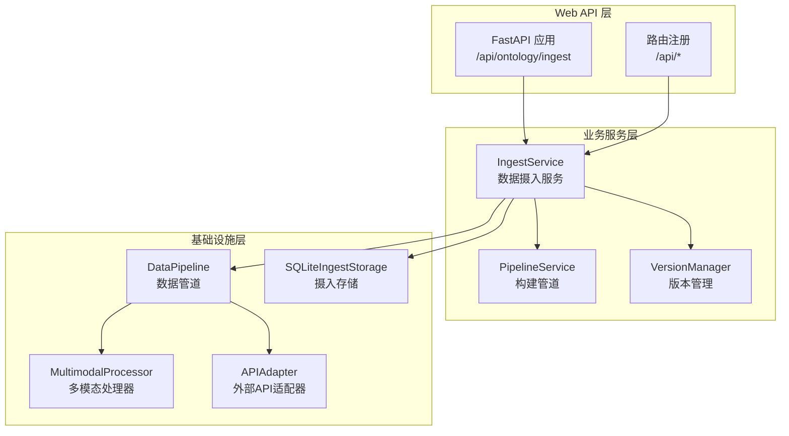

**图表来源**
- [odap/web/api/app.py:516-800](file://odap/web/api/app.py#L516-L800)
- [odap/biz/core/ontology/api/routes.py:13-527](file://odap/biz/core/ontology/api/routes.py#L13-L527)
- [odap/biz/core/ontology/services/ingest_service.py:330-800](file://odap/biz/core/ontology/services/ingest_service.py#L330-L800)

**章节来源**
- [odap/web/api/app.py:516-800](file://odap/web/api/app.py#L516-L800)
- [odap/biz/core/ontology/api/routes.py:13-527](file://odap/biz/core/ontology/api/routes.py#L13-L527)

## 核心组件
- 数据摄入服务（IngestService）：统一入口，支持新闻检索、URL抓取、手动录入、JSON导入、自然语言、随机事件生成与Tavily API等多源摄入
- 数据管道（DataPipeline）：标准化的抽取-转换-验证-加载流水线，内置阶段状态与错误聚合
- 多模态处理器（MultimodalProcessor）：图像与音频处理的优先级容错与回退机制
- 版本管理（VersionManager）：语义化版本与快照管理，支持回滚与差异比较
- 摄入存储（SQLiteIngestStorage）：摄入记录、构建历史、审计日志与场景数据的统一持久化

**章节来源**
- [odap/biz/core/ontology/services/ingest_service.py:330-800](file://odap/biz/core/ontology/services/ingest_service.py#L330-L800)
- [odap/infra/data_pipeline.py:275-426](file://odap/infra/data_pipeline.py#L275-L426)
- [odap/infra/data_pipeline/multimodal_processor.py:19-125](file://odap/infra/data_pipeline/multimodal_processor.py#L19-L125)
- [odap/biz/core/ontology/storage/sqlite_ingest_storage.py:17-266](file://odap/biz/core/ontology/storage/sqlite_ingest_storage.py#L17-L266)
- [odap/biz/core/ontology/services/version_service.py:84-200](file://odap/biz/core/ontology/services/version_service.py#L84-L200)

## 架构概览
ODAP数据摄入采用“路由-服务-管道-存储”的分层架构。Web层接收请求，路由根据source_type分派到具体摄入方法；服务层协调数据源、预处理与构建；管道层执行抽取、转换、验证与加载；存储层持久化摄入记录与版本信息。

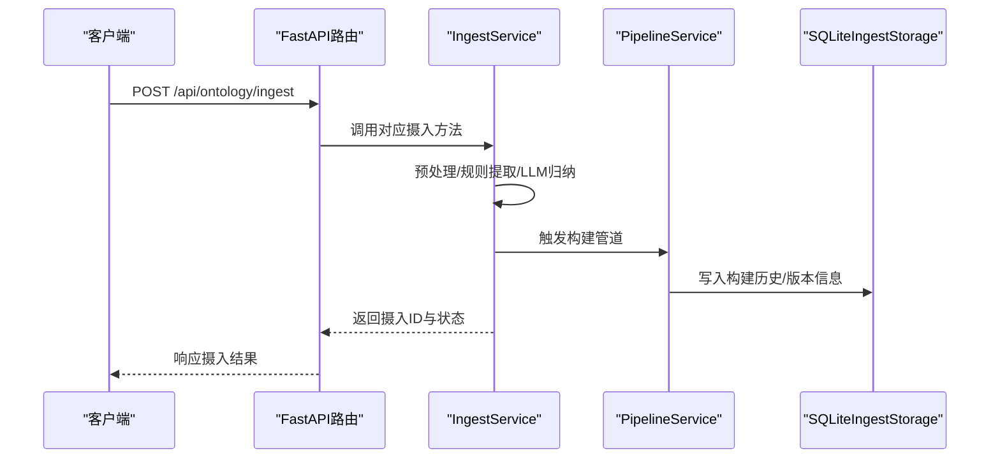

**图表来源**
- [odap/biz/core/ontology/api/routes.py:74-125](file://odap/biz/core/ontology/api/routes.py#L74-L125)
- [odap/biz/core/ontology/services/ingest_service.py:373-418](file://odap/biz/core/ontology/services/ingest_service.py#L373-L418)
- [odap/biz/core/ontology/api/routes.py:419-451](file://odap/biz/core/ontology/api/routes.py#L419-L451)

## 详细组件分析

### 数据摄入API（REST）
- 通用摄入接口：支持source_type选择，自动识别URL或关键词模式
- 专用摄入接口：新闻检索、URL抓取、手动录入、JSON导入、自然语言、随机事件生成、Tavily API
- 响应模型：包含摄入ID、状态、原始内容摘要与提取数据

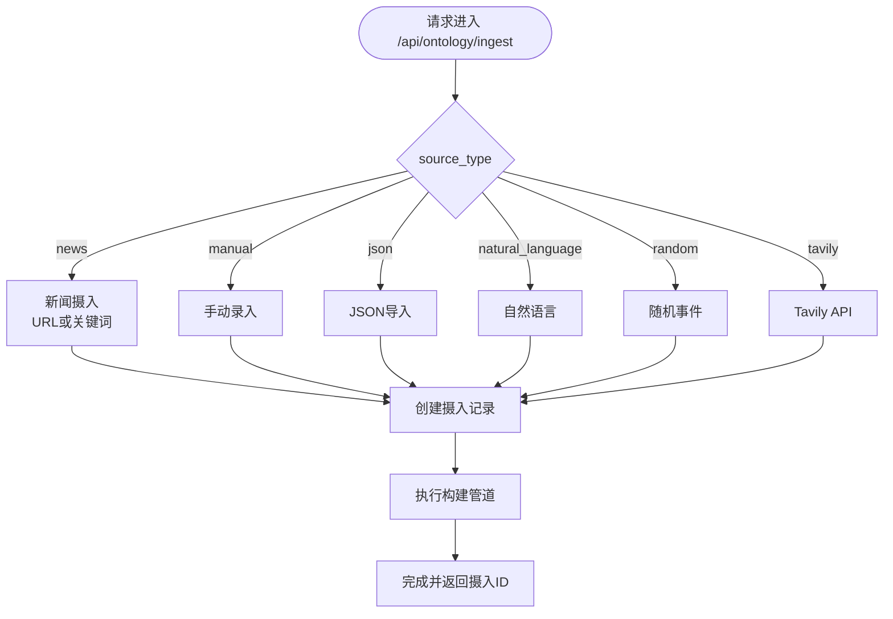

**图表来源**
- [odap/biz/core/ontology/api/routes.py:74-125](file://odap/biz/core/ontology/api/routes.py#L74-L125)
- [odap/biz/core/ontology/api/routes.py:127-292](file://odap/biz/core/ontology/api/routes.py#L127-L292)

**章节来源**
- [odap/biz/core/ontology/api/routes.py:13-527](file://odap/biz/core/ontology/api/routes.py#L13-L527)

### 数据预处理API（管道与验证）
- 数据源抽象：FileDataSource支持JSON/CSV/Parquet/PDF/TXT/MARKDOWN/XML/YAML/Raw
- 转换器：链式变换函数，异常时丢弃记录
- 验证器：规则函数返回错误信息，聚合后输出
- 加载器：可插拔写入器，支持自定义持久化

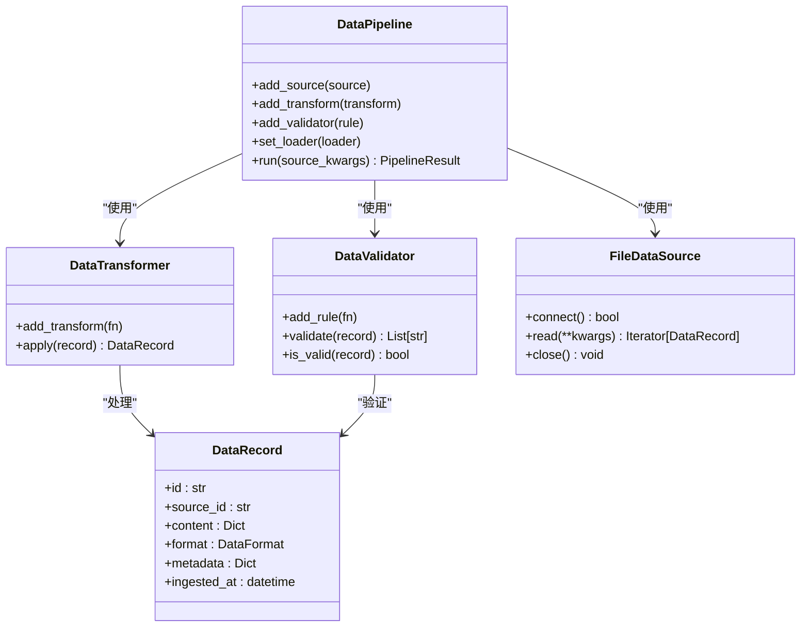

**图表来源**
- [odap/infra/data_pipeline.py:94-426](file://odap/infra/data_pipeline.py#L94-L426)

**章节来源**
- [odap/infra/data_pipeline.py:94-426](file://odap/infra/data_pipeline.py#L94-L426)

### 多模态数据处理API
- 图像处理：Claude/GPT-4V/LLaVA优先级尝试，失败回退
- 音频处理：Whisper/Deepgram优先级尝试，失败回退
- 统一返回：包含描述、对象检测、置信度与使用模型标识

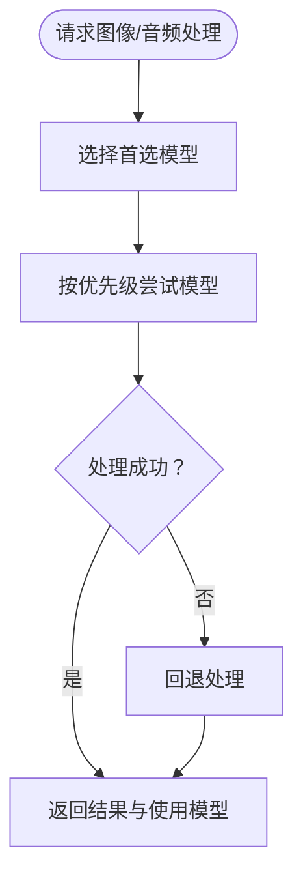

**图表来源**
- [odap/infra/data_pipeline/multimodal_processor.py:19-125](file://odap/infra/data_pipeline/multimodal_processor.py#L19-L125)

**章节来源**
- [odap/infra/data_pipeline/multimodal_processor.py:19-125](file://odap/infra/data_pipeline/multimodal_processor.py#L19-L125)

### 批量数据导入与进度跟踪
- 批量导入：支持文件上传（.json/.csv/.parquet/.pdf/.txt/.md/.xml/.yaml/.yml），自动格式识别
- 进度跟踪：摄入记录包含阶段状态、记录数、耗时与错误摘要；构建历史记录版本号、实体/关系/事件计数与状态
- 异步处理：新闻摄入与随机事件生成采用后台任务，立即返回任务ID

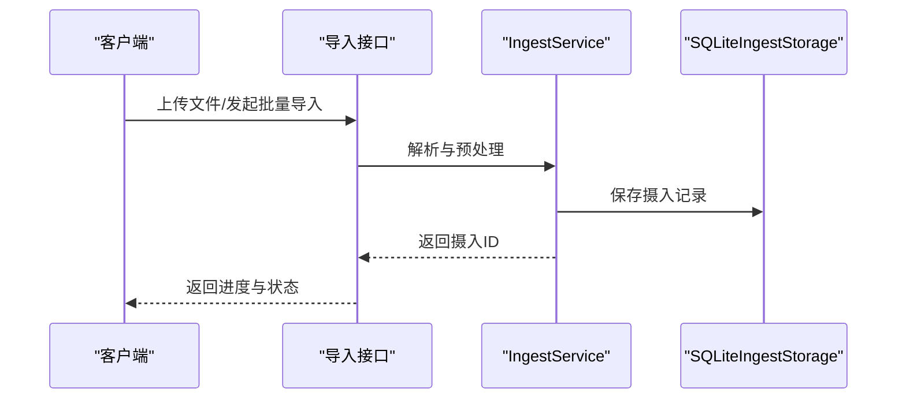

**图表来源**
- [odap/web/api/app.py:731-754](file://odap/web/api/app.py#L731-L754)
- [odap/biz/core/ontology/api/routes.py:371-400](file://odap/biz/core/ontology/api/routes.py#L371-L400)

**章节来源**
- [odap/web/api/app.py:731-754](file://odap/web/api/app.py#L731-L754)
- [odap/biz/core/ontology/api/routes.py:371-400](file://odap/biz/core/ontology/api/routes.py#L371-L400)

### 实时数据流接入API
- WebSocket事件总线：MockDataWebService提供事件总线与客户端集合，支持订阅与推送
- 实时事件流：可用于持续摄入与状态通知

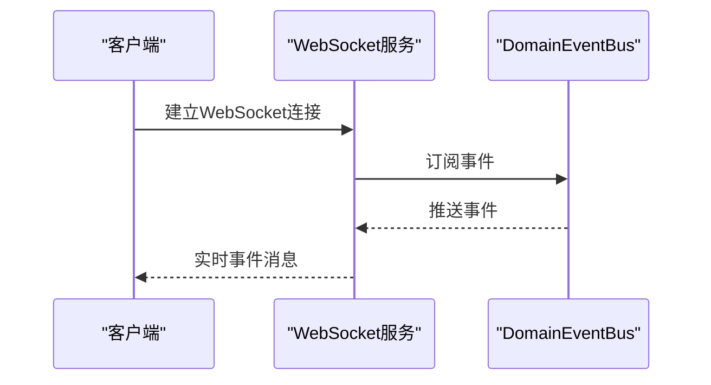

**图表来源**
- [odap/web/api/app.py:282-304](file://odap/web/api/app.py#L282-L304)

**章节来源**
- [odap/web/api/app.py:282-304](file://odap/web/api/app.py#L282-L304)

### 数据质量检查API
- 内置验证器：规则函数返回错误信息，聚合输出
- 构建历史：记录实体/关系/事件计数与状态，便于质量评估
- 审计日志：记录摄入与构建过程的关键事件

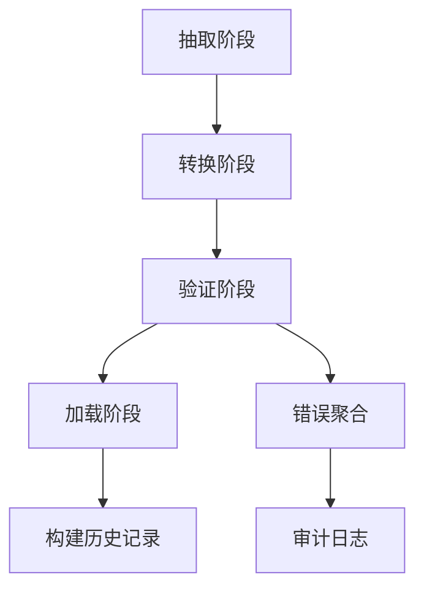

**图表来源**
- [odap/infra/data_pipeline.py:364-406](file://odap/infra/data_pipeline.py#L364-L406)
- [odap/biz/core/ontology/storage/sqlite_ingest_storage.py:210-243](file://odap/biz/core/ontology/storage/sqlite_ingest_storage.py#L210-L243)

**章节来源**
- [odap/infra/data_pipeline.py:364-406](file://odap/infra/data_pipeline.py#L364-L406)
- [odap/biz/core/ontology/storage/sqlite_ingest_storage.py:210-243](file://odap/biz/core/ontology/storage/sqlite_ingest_storage.py#L210-L243)

### 错误处理与重试机制
- 管道阶段容错：阶段失败时记录错误，聚合上限MAX_ERRORS，避免噪声
- 多模态回退：模型失败自动切换下一个优先级模型
- API适配器降级：HTTP失败或依赖缺失时使用mock数据

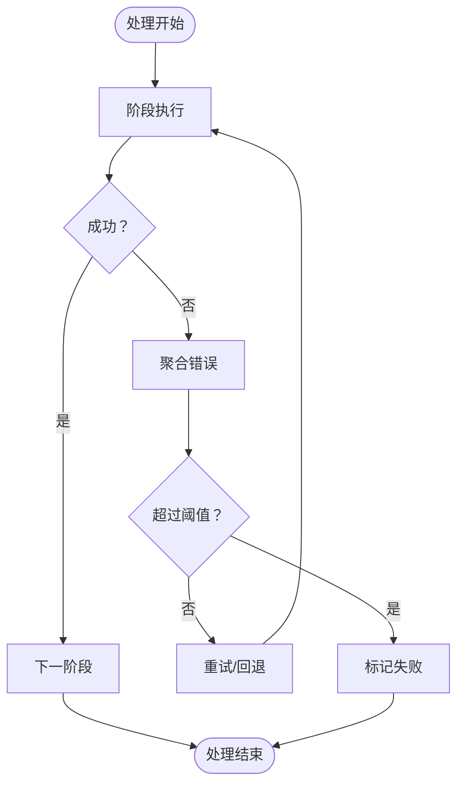

**图表来源**
- [odap/infra/data_pipeline.py:275-286](file://odap/infra/data_pipeline.py#L275-L286)
- [odap/infra/data_pipeline/multimodal_processor.py:32-54](file://odap/infra/data_pipeline/multimodal_processor.py#L32-L54)
- [odap/infra/data_pipeline/adapters/api_adapter.py:66-88](file://odap/infra/data_pipeline/adapters/api_adapter.py#L66-L88)

**章节来源**
- [odap/infra/data_pipeline.py:275-286](file://odap/infra/data_pipeline.py#L275-L286)
- [odap/infra/data_pipeline/multimodal_processor.py:32-54](file://odap/infra/data_pipeline/multimodal_processor.py#L32-L54)
- [odap/infra/data_pipeline/adapters/api_adapter.py:66-88](file://odap/infra/data_pipeline/adapters/api_adapter.py#L66-L88)

### 数据版本控制与变更追踪API
- 版本管理：语义化版本号与版本链，支持commit与append两种模式
- 回滚与差异：提供回滚到指定版本与版本差异比较
- 实体历史：记录实体在各版本的状态快照

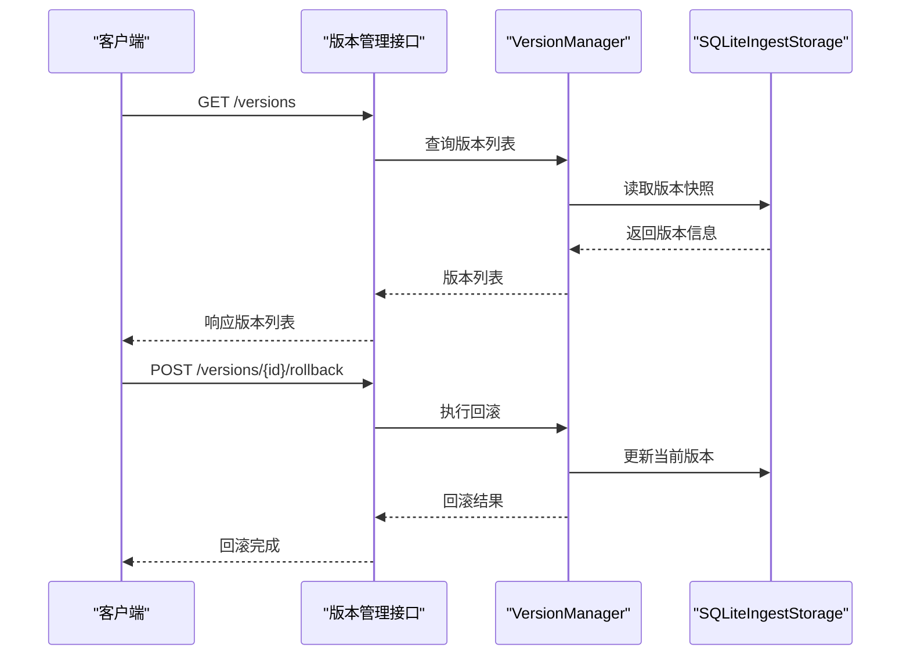

**图表来源**
- [odap/biz/core/ontology/api/routes.py:334-351](file://odap/biz/core/ontology/api/routes.py#L334-L351)
- [odap/biz/core/ontology/services/version_service.py:152-200](file://odap/biz/core/ontology/services/version_service.py#L152-L200)

**章节来源**
- [odap/biz/core/ontology/api/routes.py:334-351](file://odap/biz/core/ontology/api/routes.py#L334-L351)
- [odap/biz/core/ontology/services/version_service.py:152-200](file://odap/biz/core/ontology/services/version_service.py#L152-L200)

## 依赖关系分析
- 路由注册：统一通过router_registry集中注册，便于维护与扩展
- 服务依赖：IngestService依赖PipelineService与VersionManager，协调摄入与构建
- 存储依赖：SQLiteIngestStorage为摄入、构建与版本提供统一持久化

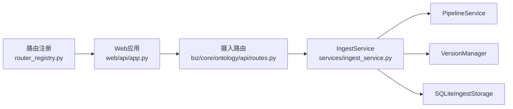

**图表来源**
- [odap/web/router_registry.py:34-98](file://odap/web/router_registry.py#L34-L98)
- [odap/web/api/app.py:303-327](file://odap/web/api/app.py#L303-L327)
- [odap/biz/core/ontology/api/routes.py:13-17](file://odap/biz/core/ontology/api/routes.py#L13-L17)

**章节来源**
- [odap/web/router_registry.py:34-98](file://odap/web/router_registry.py#L34-L98)
- [odap/web/api/app.py:303-327](file://odap/web/api/app.py#L303-L327)
- [odap/biz/core/ontology/api/routes.py:13-17](file://odap/biz/core/ontology/api/routes.py#L13-L17)

## 性能考量
- 管道并发：阶段间顺序执行，建议在transform/validate中使用轻量处理，避免阻塞
- 存储优化：SQLite WAL模式提升并发写入性能，合理索引（如实体注册表）降低查询成本
- 多模态处理：模型优先级与回退减少失败重试开销，建议预热常用模型
- 异步处理：新闻与随机事件生成采用异步任务，避免阻塞主线程

## 故障排查指南
- 常见错误
  - 无效source_type：检查请求参数，确保source_type合法
  - Tavily API Key缺失：配置TAVILY_API_KEY环境变量
  - 文件格式不支持：确认文件扩展名在支持列表内
- 日志与审计
  - 通过/get/{ingest_id}/logs获取阶段日志
  - 通过/build-history查看构建历史
- 测试参考
  - 集成测试覆盖自然语言摄入、新闻摄入与构建流程

**章节来源**
- [odap/biz/core/ontology/api/routes.py:262-292](file://odap/biz/core/ontology/api/routes.py#L262-L292)
- [tests/integration/test_ingest_pipeline.py:15-320](file://tests/integration/test_ingest_pipeline.py#L15-L320)

## 结论
ODAP平台的数据摄入API以模块化与可扩展为核心设计原则，提供从多源数据接入、预处理、质量检查到版本管理与变更追踪的完整链路。通过统一的REST接口与WebSocket事件流，满足批处理与实时数据流的多样化需求。建议在生产环境中结合异步任务与监控告警，确保高可用与可观测性。