# 多模态数据摄入系统

<cite>
**本文档引用的文件**
- [multimodal_processor.py](file://odap/infra/data_pipeline/multimodal_processor.py)
- [data_pipeline.py](file://odap/infra/data_pipeline.py)
- [pdf_processor.py](file://odap/biz/core/ontology/ingestion/impl/pdf_processor.py)
- [word_processor.py](file://odap/biz/core/ontology/ingestion/impl/word_processor.py)
- [ocr_processor.py](file://odap/biz/core/ontology/ingestion/impl/ocr_processor.py)
- [ingest_service.py](file://odap/biz/core/ontology/ingestion/services/ingest_service.py)
- [news_ingester.py](file://odap/biz/core/ontology/ingestion_split/news_ingester.py)
- [minio_client.py](file://odap/infra/storage/minio_client.py)
- [app.py](file://odap/web/api/app.py)
- [constants.py](file://odap/common/constants.py)
- [agent_config.yaml](file://config/agent_config.yaml)
</cite>

## 目录
1. [简介](#简介)
2. [项目结构](#项目结构)
3. [核心组件](#核心组件)
4. [架构概览](#架构概览)
5. [详细组件分析](#详细组件分析)
6. [依赖关系分析](#依赖关系分析)
7. [性能考虑](#性能考虑)
8. [故障排除指南](#故障排除指南)
9. [结论](#结论)

## 简介

多模态数据摄入系统是一个综合性的数据处理平台，专门设计用于处理多种格式的数据源，包括文本、图像、音频和结构化数据。该系统实现了先进的多模态处理能力，支持PDF文档解析、OCR文字识别、图像分析和音频转录等功能。

系统采用模块化架构设计，通过统一的数据管道接口处理各种数据格式，提供高可用性和可扩展性。核心功能包括：

- **多格式数据支持**：JSON、CSV、Parquet、PDF、TXT、Markdown、XML、YAML等
- **多模态处理能力**：图像识别、音频转录、OCR文字提取
- **智能数据管道**：自动化的数据提取、转换和加载流程
- **分布式存储**：基于MinIO的对象存储解决方案
- **实时处理**：异步任务处理和WebSocket事件流

## 项目结构

系统采用分层架构设计，主要分为以下几个层次：

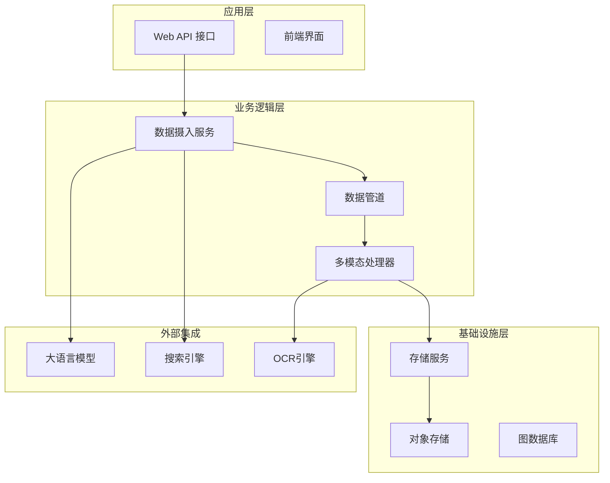

**图表来源**
- [app.py:516-800](file://odap/web/api/app.py#L516-L800)
- [ingest_service.py:15-32](file://odap/biz/core/ontology/ingestion/services/ingest_service.py#L15-L32)

**章节来源**
- [app.py:1-862](file://odap/web/api/app.py#L1-L862)
- [data_pipeline.py:1-426](file://odap/infra/data_pipeline.py#L1-L426)

## 核心组件

### 数据管道系统

数据管道是整个系统的核心，负责协调各个数据处理阶段。系统实现了完整的ETL（提取、转换、加载）流程：

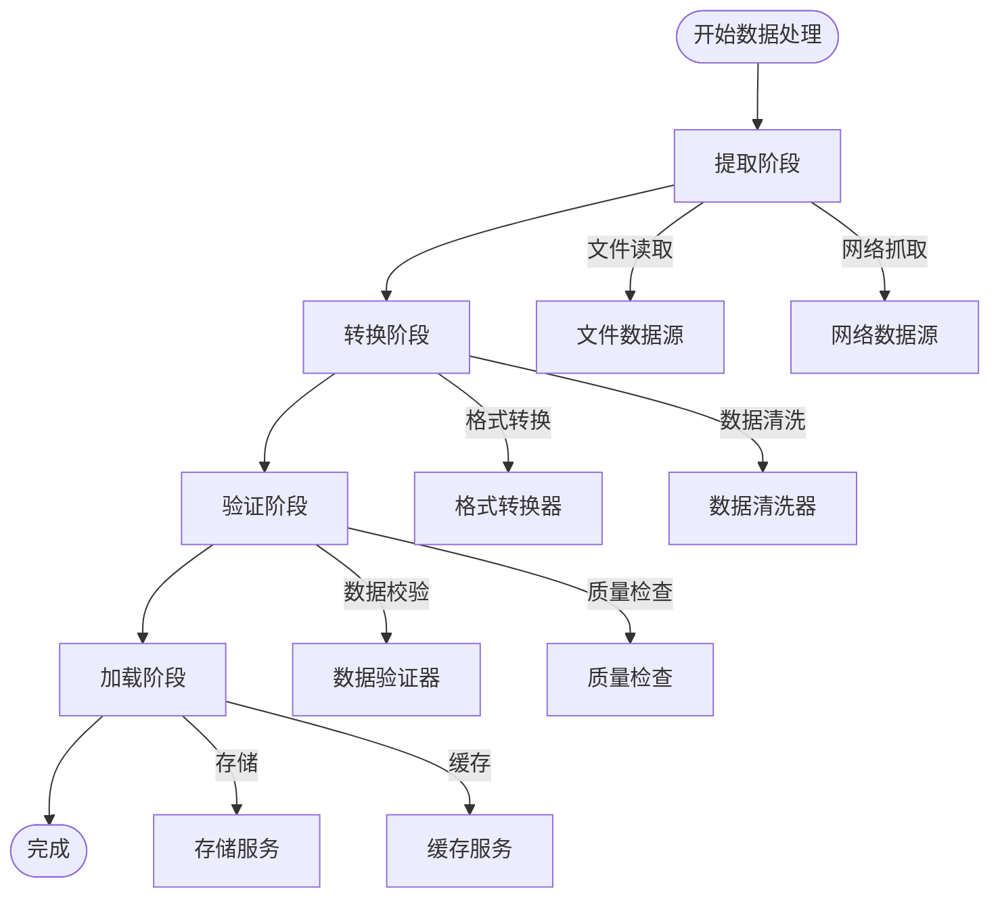

**图表来源**
- [data_pipeline.py:275-426](file://odap/infra/data_pipeline.py#L275-L426)

### 多模态处理器

系统集成了多种AI模型进行多模态数据处理：

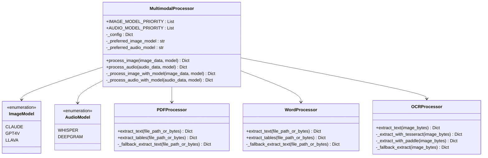

**图表来源**
- [multimodal_processor.py:19-125](file://odap/infra/data_pipeline/multimodal_processor.py#L19-L125)
- [pdf_processor.py:13-106](file://odap/biz/core/ontology/ingestion/impl/pdf_processor.py#L13-L106)
- [word_processor.py:13-109](file://odap/biz/core/ontology/ingestion/impl/word_processor.py#L13-L109)
- [ocr_processor.py:20-97](file://odap/biz/core/ontology/ingestion/impl/ocr_processor.py#L20-L97)

**章节来源**
- [multimodal_processor.py:1-125](file://odap/infra/data_pipeline/multimodal_processor.py#L1-L125)
- [pdf_processor.py:1-106](file://odap/biz/core/ontology/ingestion/impl/pdf_processor.py#L1-L106)
- [word_processor.py:1-109](file://odap/biz/core/ontology/ingestion/impl/word_processor.py#L1-L109)
- [ocr_processor.py:1-97](file://odap/biz/core/ontology/ingestion/impl/ocr_processor.py#L1-L97)

## 架构概览

系统采用微服务架构，通过清晰的模块边界实现松耦合设计：

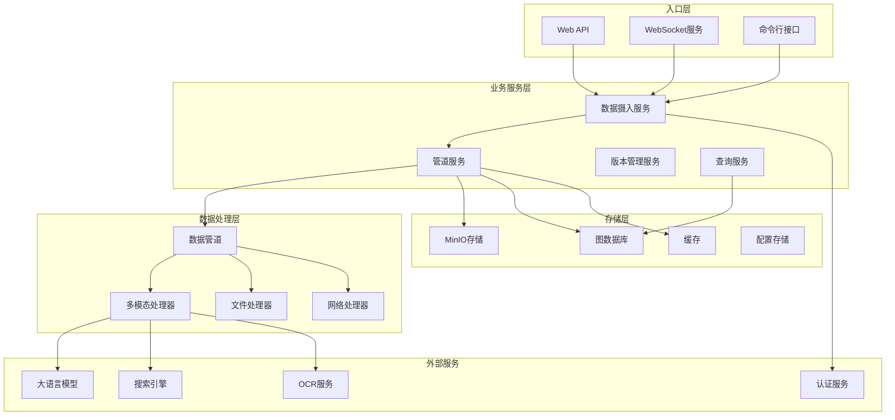

**图表来源**
- [app.py:304-515](file://odap/web/api/app.py#L304-L515)
- [ingest_service.py:15-32](file://odap/biz/core/ontology/ingestion/services/ingest_service.py#L15-L32)

## 详细组件分析

### 数据摄入服务

数据摄入服务是系统的核心组件，负责协调各种数据源的处理流程：

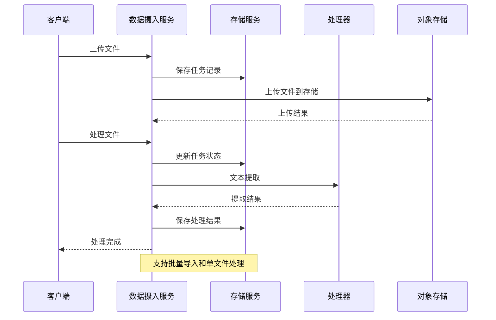

**图表来源**
- [ingest_service.py:33-148](file://odap/biz/core/ontology/ingestion/services/ingest_service.py#L33-L148)

数据摄入服务的主要职责包括：

1. **文件上传管理**：处理文件上传、存储和元数据管理
2. **格式检测**：自动识别文件类型并选择相应的处理策略
3. **多模态处理**：根据文件类型调用相应的处理器
4. **状态跟踪**：维护处理进度和错误信息
5. **批量导入**：支持大规模数据的批量处理

**章节来源**
- [ingest_service.py:1-206](file://odap/biz/core/ontology/ingestion/services/ingest_service.py#L1-L206)

### 文件处理器

系统提供了专门的文件处理器来处理不同格式的文档：

#### PDF处理器

PDF处理器支持高级的文本提取和表格识别功能：

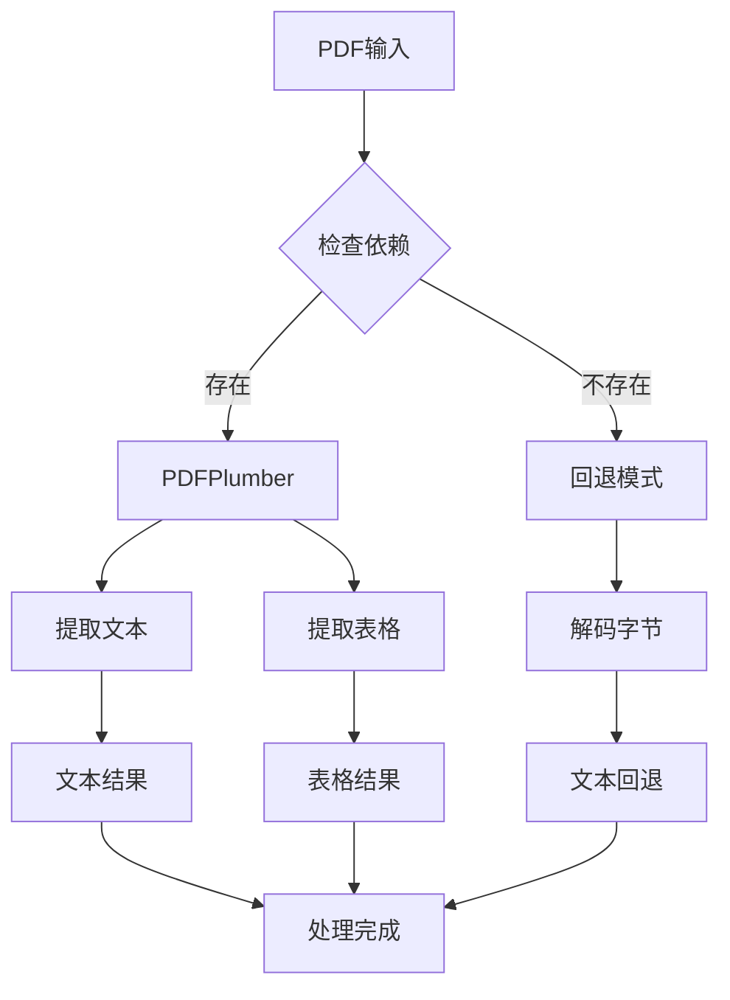

**图表来源**
- [pdf_processor.py:14-106](file://odap/biz/core/ontology/ingestion/impl/pdf_processor.py#L14-L106)

#### Word处理器

Word文档处理器提供完整的文档内容提取功能：

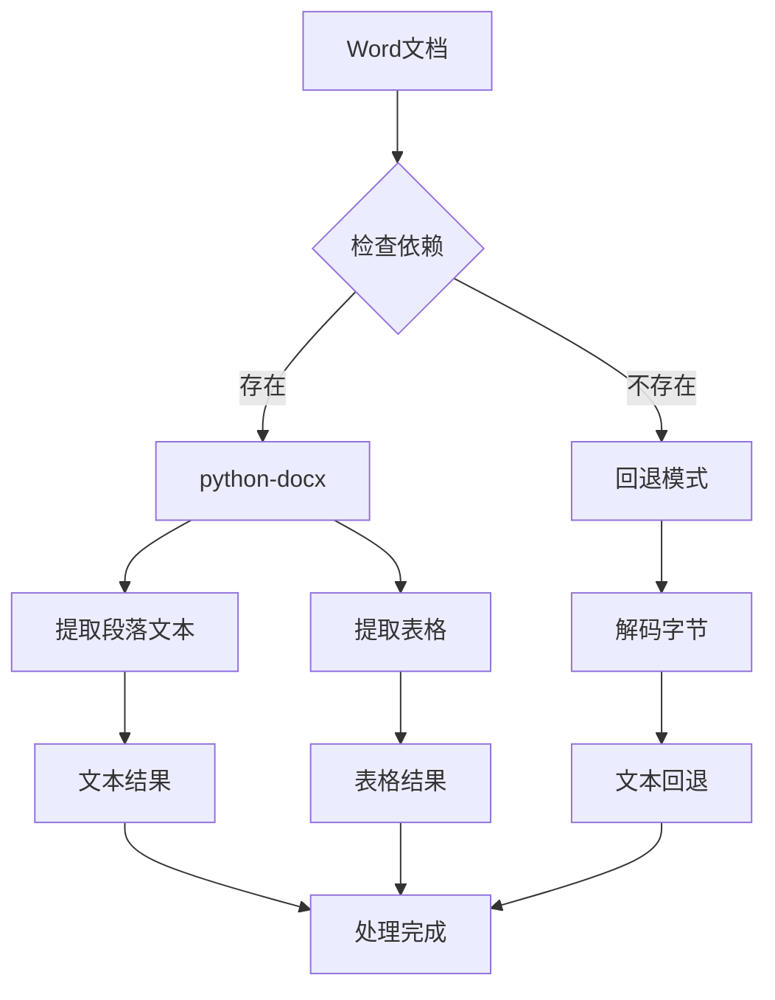

**图表来源**
- [word_processor.py:14-109](file://odap/biz/core/ontology/ingestion/impl/word_processor.py#L14-L109)

#### OCR处理器

OCR处理器支持多种光学字符识别引擎：

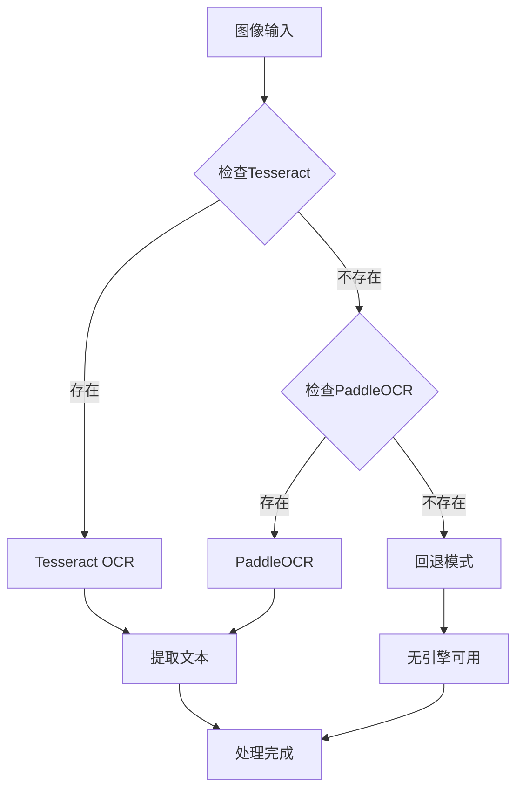

**图表来源**
- [ocr_processor.py:23-97](file://odap/biz/core/ontology/ingestion/impl/ocr_processor.py#L23-L97)

**章节来源**
- [pdf_processor.py:1-106](file://odap/biz/core/ontology/ingestion/impl/pdf_processor.py#L1-L106)
- [word_processor.py:1-109](file://odap/biz/core/ontology/ingestion/impl/word_processor.py#L1-L109)
- [ocr_processor.py:1-97](file://odap/biz/core/ontology/ingestion/impl/ocr_processor.py#L1-L97)

### 网络数据摄入

系统提供了强大的网络数据摄入能力，支持多种数据源的自动抓取和处理：

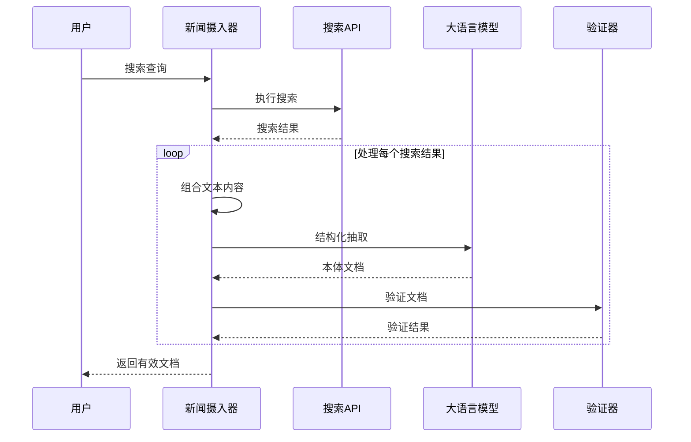

**图表来源**
- [news_ingester.py:99-151](file://odap/biz/core/ontology/ingestion_split/news_ingester.py#L99-L151)

网络摄入器支持多种搜索策略，包括本地DuckDuckGo API、Tavily API、SerpAPI和DuckDuckGo HTML解析等。

**章节来源**
- [news_ingester.py:1-416](file://odap/biz/core/ontology/ingestion_split/news_ingester.py#L1-L416)

### 存储系统

系统采用分布式存储架构，主要使用MinIO作为对象存储解决方案：

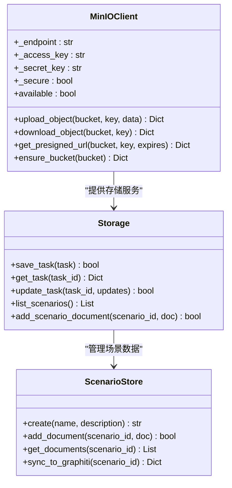

**图表来源**
- [minio_client.py:20-191](file://odap/infra/storage/minio_client.py#L20-L191)
- [app.py:41-174](file://odap/web/api/app.py#L41-L174)

**章节来源**
- [minio_client.py:1-191](file://odap/infra/storage/minio_client.py#L1-L191)
- [app.py:41-255](file://odap/web/api/app.py#L41-L255)

## 依赖关系分析

系统采用模块化设计，各组件之间的依赖关系清晰明确：

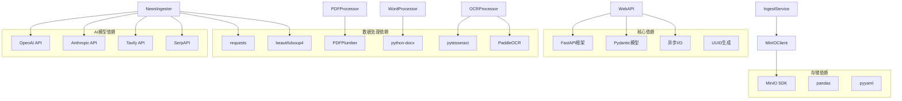

**图表来源**
- [app.py:20-31](file://odap/web/api/app.py#L20-L31)
- [pdf_processor.py:6-10](file://odap/biz/core/ontology/ingestion/impl/pdf_processor.py#L6-L10)
- [word_processor.py:6-10](file://odap/biz/core/ontology/ingestion/impl/word_processor.py#L6-L10)
- [ocr_processor.py:6-17](file://odap/biz/core/ontology/ingestion/impl/ocr_processor.py#L6-L17)

**章节来源**
- [app.py:1-862](file://odap/web/api/app.py#L1-L862)
- [pdf_processor.py:1-106](file://odap/biz/core/ontology/ingestion/impl/pdf_processor.py#L1-L106)
- [word_processor.py:1-109](file://odap/biz/core/ontology/ingestion/impl/word_processor.py#L1-L109)
- [ocr_processor.py:1-97](file://odap/biz/core/ontology/ingestion/impl/ocr_processor.py#L1-L97)

## 性能考虑

系统在设计时充分考虑了性能优化，采用了多种策略来提升处理效率：

### 并发处理

系统采用异步编程模型，支持高并发的数据处理：

- **异步I/O操作**：文件读取、网络请求和数据库操作都是异步的
- **并发任务管理**：使用asyncio和线程池处理大量并发请求
- **资源池管理**：数据库连接和外部API调用使用连接池

### 缓存策略

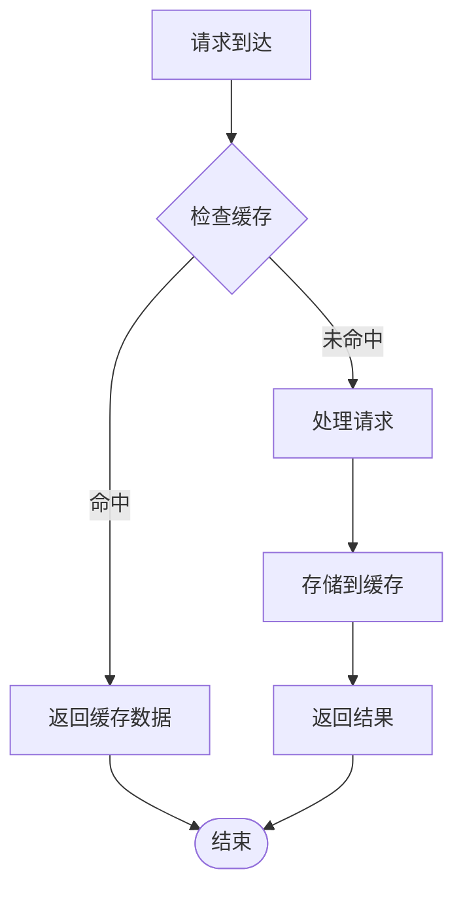

### 内存管理

- **流式处理**：大文件采用流式读取，避免内存溢出
- **分块处理**：大数据集分块处理，控制内存使用
- **垃圾回收**：及时释放不再使用的对象引用

### 网络优化

- **连接复用**：HTTP客户端连接复用，减少连接开销
- **超时控制**：合理的超时设置，避免长时间阻塞
- **重试机制**：网络异常时的自动重试和降级处理

## 故障排除指南

### 常见问题诊断

#### 数据处理失败

当数据处理过程中出现错误时，系统会记录详细的错误信息：

1. **检查日志文件**：查看应用程序日志了解具体错误原因
2. **验证文件格式**：确认输入文件格式是否受支持
3. **检查依赖库**：确保所需的第三方库已正确安装
4. **验证API密钥**：确认外部服务的API密钥配置正确

#### 存储问题

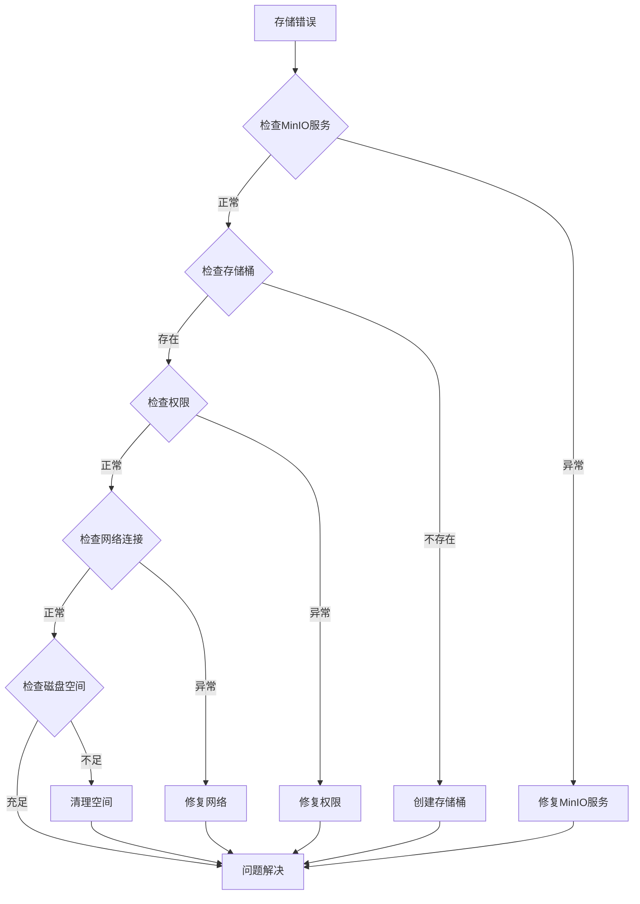

#### 性能问题

当系统响应缓慢时，可以采取以下措施：

1. **监控资源使用**：检查CPU、内存和磁盘使用情况
2. **分析慢查询**：查看数据库慢查询日志
3. **调整并发设置**：根据服务器配置调整并发参数
4. **优化索引**：为常用查询字段建立合适的索引

**章节来源**
- [ingest_service.py:140-147](file://odap/biz/core/ontology/ingestion/services/ingest_service.py#L140-L147)
- [minio_client.py:93-96](file://odap/infra/storage/minio_client.py#L93-L96)

### 配置管理

系统使用YAML配置文件管理各种设置：

**章节来源**
- [agent_config.yaml:1-23](file://config/agent_config.yaml#L1-L23)

## 结论

多模态数据摄入系统是一个功能完整、架构清晰的数据处理平台。系统通过模块化设计实现了高度的可扩展性和可维护性，支持多种数据格式和处理需求。

### 主要优势

1. **多模态支持**：全面支持文本、图像、音频等多种数据类型的处理
2. **模块化架构**：清晰的组件分离和接口定义，便于维护和扩展
3. **高可用性**：完善的错误处理和降级机制，确保系统稳定性
4. **高性能**：异步处理和缓存策略，提供高效的处理能力
5. **可扩展性**：插件化的架构设计，支持新功能的快速集成

### 发展方向

未来可以考虑的功能增强：

1. **机器学习集成**：引入更先进的AI模型提升数据处理质量
2. **实时处理**：增强流式数据处理能力
3. **分布式部署**：支持更大规模的数据处理需求
4. **监控告警**：完善系统监控和告警机制
5. **API文档**：提供更详细的API文档和示例

该系统为构建复杂的数据处理应用提供了坚实的基础，通过持续的优化和扩展，能够满足不断增长的数据处理需求。