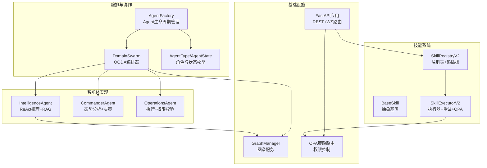
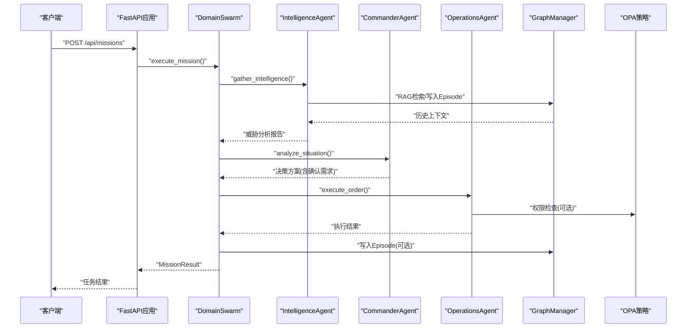
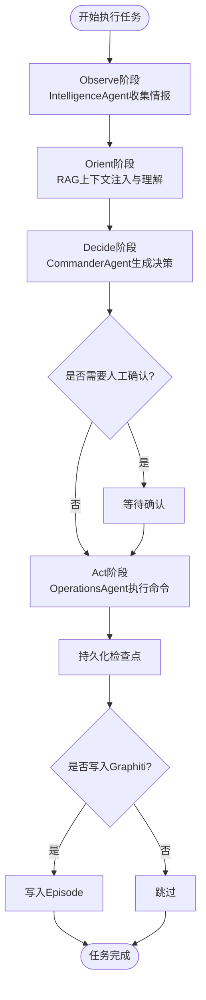
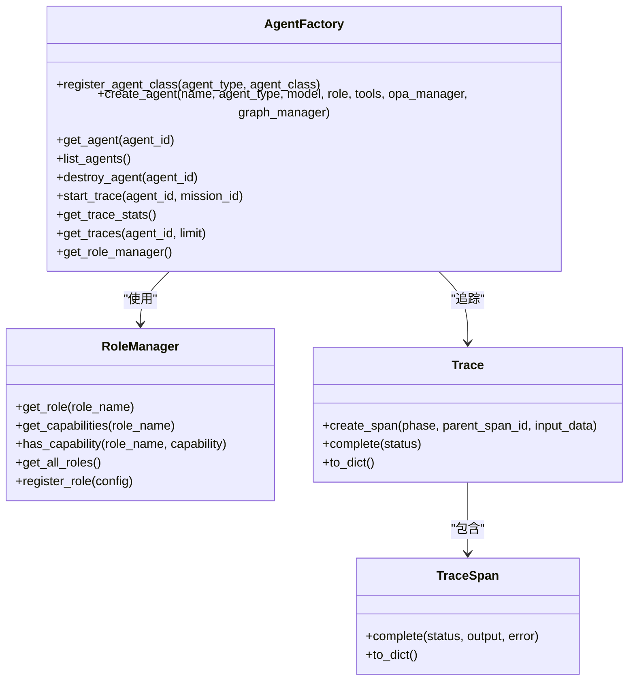
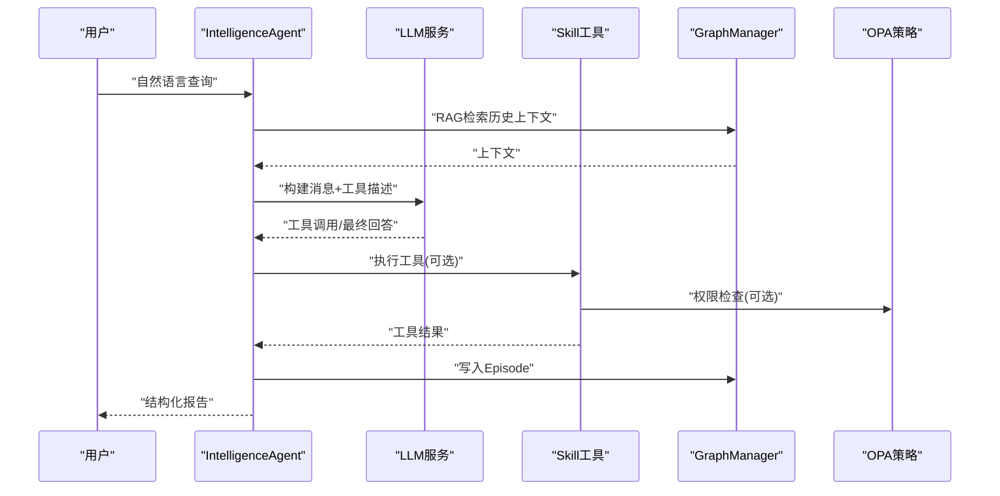
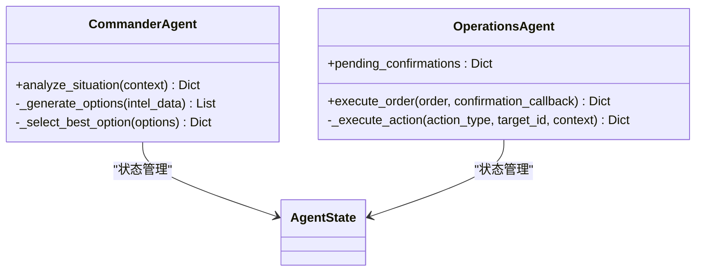
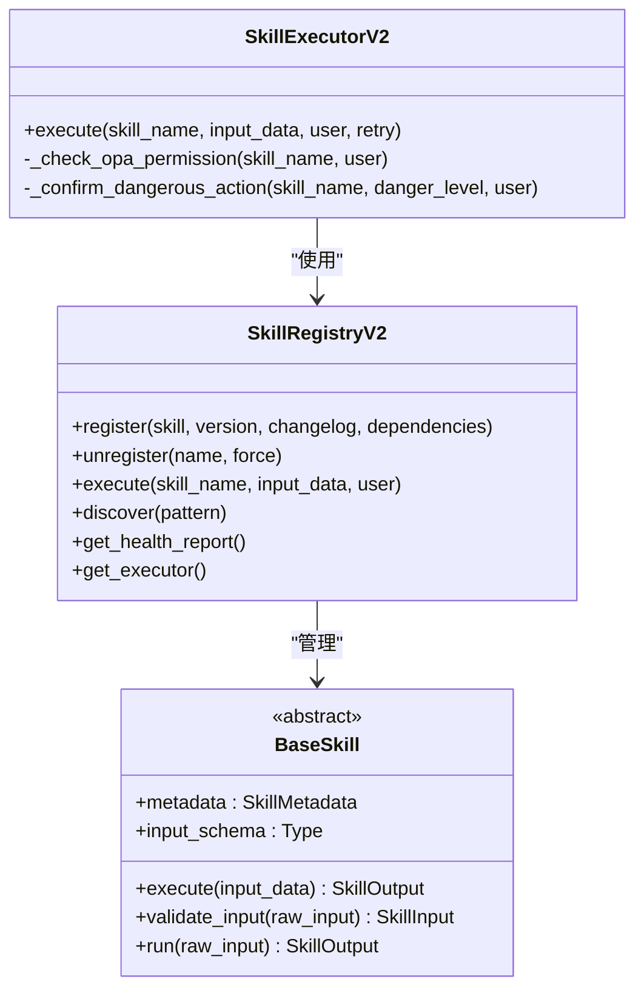
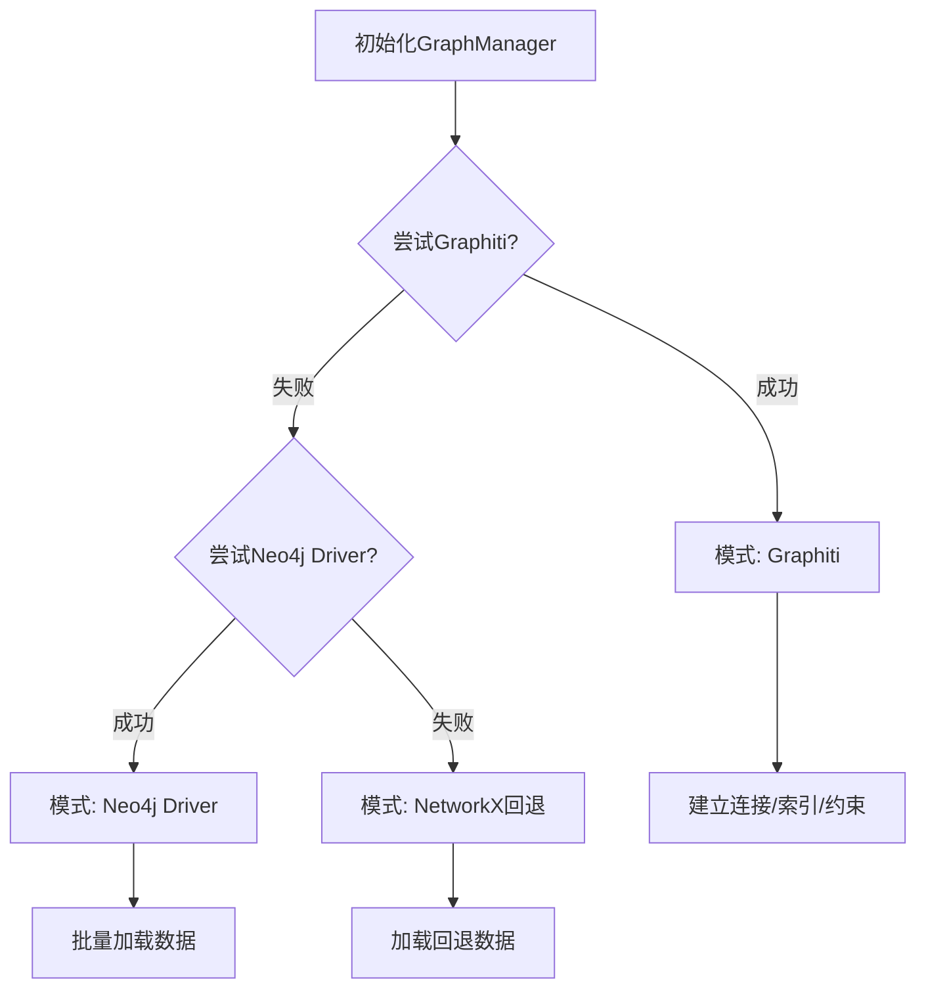
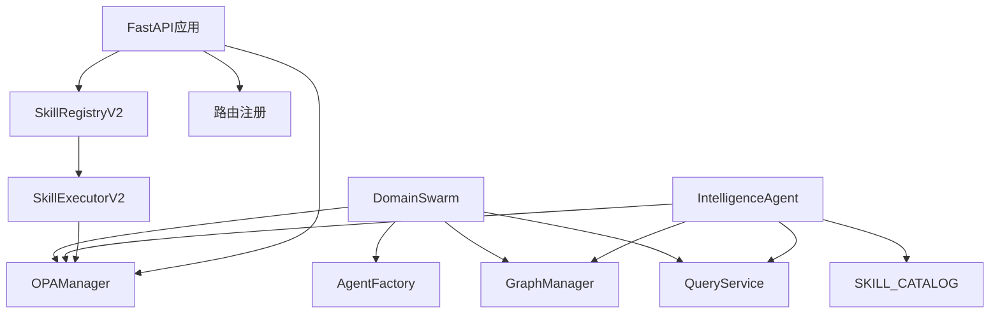

# Swarm编排API

<cite>
**本文档引用的文件**
- [swarm_orchestrator.py](file://odap/biz/core/agent/swarm_orchestrator.py)
- [agent_factory.py](file://odap/biz/core/agent/agent_factory.py)
- [intelligence_agent.py](file://odap/biz/core/agent/intelligence_agent.py)
- [orchestrator.py](file://odap/biz/core/agent/orchestrator.py)
- [base.py](file://odap/tools/base.py)
- [graph_service.py](file://odap/infra/graph/graph_service.py)
- [routes.py](file://odap/infra/opa/routes.py)
- [app.py](file://odap/web/api/app.py)
- [router_registry.py](file://odap/web/router_registry.py)
</cite>

## 目录
1. [简介](#简介)
2. [项目结构](#项目结构)
3. [核心组件](#核心组件)
4. [架构概览](#架构概览)
5. [详细组件分析](#详细组件分析)
6. [依赖分析](#依赖分析)
7. [性能考虑](#性能考虑)
8. [故障排查指南](#故障排查指南)
9. [结论](#结论)
10. [附录](#附录)

## 简介
本文件为Swarm智能体编排API的全面技术文档，面向多智能体系统开发者与平台集成者。文档围绕领域三Agent（Commander/Intelligence/Operations）的OODA循环协作展开，系统化阐述了团队创建、成员管理、任务分配、协调机制、状态监控与事件通知、并发控制、容错处理与性能优化等关键技术实现。通过统一的编排器API与技能注册表（Skill Registry）机制，实现智能体间通信、同步与冲突解决，支撑复杂任务的自动化执行与可观测性。

## 项目结构
Swarm编排API位于odap/biz/core/agent目录，配合工具注册表、图谱服务、OPA策略与Web路由，形成端到端的多智能体协作平台：
- 编排与协作：DomainSwarm、AgentFactory、AgentType/AgentState
- 智能体实现：IntelligenceAgent、CommanderAgent、OperationsAgent
- 技能系统：BaseSkill、SkillRegistryV2、SkillExecutorV2
- 基础设施：GraphManager（图谱）、OPA策略路由、Web API入口
- 集成路由：FastAPI应用与路由注册工具

**图表来源**
- [swarm_orchestrator.py:288-658](file://odap/biz/core/agent/swarm_orchestrator.py#L288-L658)
- [agent_factory.py:24-442](file://odap/biz/core/agent/agent_factory.py#L24-L442)
- [intelligence_agent.py:73-599](file://odap/biz/core/agent/intelligence_agent.py#L73-L599)
- [base.py:64-720](file://odap/tools/base.py#L64-L720)
- [graph_service.py:71-800](file://odap/infra/graph/graph_service.py#L71-L800)
- [routes.py:1-422](file://odap/infra/opa/routes.py#L1-L422)
- [app.py:300-500](file://odap/web/api/app.py#L300-L500)

**章节来源**
- [swarm_orchestrator.py:1-687](file://odap/biz/core/agent/swarm_orchestrator.py#L1-L687)
- [agent_factory.py:1-442](file://odap/biz/core/agent/agent_factory.py#L1-L442)
- [intelligence_agent.py:1-599](file://odap/biz/core/agent/intelligence_agent.py#L1-L599)
- [base.py:1-720](file://odap/tools/base.py#L1-L720)
- [graph_service.py:1-800](file://odap/infra/graph/graph_service.py#L1-L800)
- [routes.py:1-422](file://odap/infra/opa/routes.py#L1-L422)
- [app.py:1-862](file://odap/web/api/app.py#L1-L862)
- [router_registry.py:1-98](file://odap/web/router_registry.py#L1-L98)

## 核心组件
- DomainSwarm：领域多Agent编排器，实现OODA四阶段（Observe/Orient/Decide/Act），支持流式进度返回与持久化检查点。
- AgentFactory：Agent生命周期管理，提供工厂注册、实例化、追踪与角色能力管理。
- IntelligenceAgent：基于LLM ReAct的推理引擎，结合RAG上下文与工具调用，生成结构化情报报告。
- CommanderAgent/OperationsAgent：领域内决策中枢与执行中枢，分别负责威胁分析与命令执行、权限校验与确认流程。
- Skill系统：BaseSkill抽象、SkillRegistryV2注册表、SkillExecutorV2执行器，支持OPA权限桥接、健康监控、重试与热插拔。
- GraphManager：三层降级图谱服务（Graphiti/Neo4j/NetworkX），提供实体查询、更新与Episode写入。
- OPA策略路由：策略存储、转换与HTTP接口，支持策略创建、启用/禁用与Markdown到Rego转换。
- Web API：FastAPI应用，聚合多模块路由，提供场景管理、数据摄入、版本管理、查询服务等REST接口。

**章节来源**
- [swarm_orchestrator.py:288-658](file://odap/biz/core/agent/swarm_orchestrator.py#L288-L658)
- [agent_factory.py:340-442](file://odap/biz/core/agent/agent_factory.py#L340-L442)
- [intelligence_agent.py:307-527](file://odap/biz/core/agent/intelligence_agent.py#L307-L527)
- [base.py:64-720](file://odap/tools/base.py#L64-L720)
- [graph_service.py:71-800](file://odap/infra/graph/graph_service.py#L71-L800)
- [routes.py:110-240](file://odap/infra/opa/routes.py#L110-L240)
- [app.py:516-800](file://odap/web/api/app.py#L516-L800)

## 架构概览
Swarm编排API采用“编排器-智能体-技能系统-基础设施”的分层架构：
- 编排层：DomainSwarm协调三Agent执行，贯穿四个阶段并持久化状态。
- 智能体层：IntelligenceAgent负责感知与分析；CommanderAgent负责决策；OperationsAgent负责执行与权限校验。
- 技能层：统一的技能抽象与注册表，支持声明式权限与健康监控。
- 基础设施层：图谱服务、OPA策略、Web路由与中间件。

**图表来源**
- [swarm_orchestrator.py:379-456](file://odap/biz/core/agent/swarm_orchestrator.py#L379-L456)
- [intelligence_agent.py:307-527](file://odap/biz/core/agent/intelligence_agent.py#L307-L527)
- [graph_service.py:649-756](file://odap/infra/graph/graph_service.py#L649-L756)
- [routes.py:184-240](file://odap/infra/opa/routes.py#L184-L240)

**章节来源**
- [swarm_orchestrator.py:379-658](file://odap/biz/core/agent/swarm_orchestrator.py#L379-L658)
- [intelligence_agent.py:307-527](file://odap/biz/core/agent/intelligence_agent.py#L307-L527)
- [graph_service.py:649-800](file://odap/infra/graph/graph_service.py#L649-L800)
- [routes.py:110-240](file://odap/infra/opa/routes.py#L110-L240)

## 详细组件分析

### DomainSwarm编排器
- OODA阶段：Observe（情报收集）、Orient（威胁理解）、Decide（决策）、Act（执行）。支持流式进度返回与异常处理。
- 配置与初始化：Coordinator参数（并发、超时、重试）、OOOA策略（确认前置、Graphiti写入）。
- 任务生命周期：创建、执行、持久化检查点、历史记录与健康报告。
- 与基础设施集成：GraphManager写入Episode、HealthMonitor、FaultRecoveryManager、StatePersistenceManager。

**图表来源**
- [swarm_orchestrator.py:379-631](file://odap/biz/core/agent/swarm_orchestrator.py#L379-L631)

**章节来源**
- [swarm_orchestrator.py:288-658](file://odap/biz/core/agent/swarm_orchestrator.py#L288-L658)

### AgentFactory与Agent生命周期
- 工厂模式：注册Agent类、创建实例、维护配置与追踪。
- 角色与能力：RoleManager定义Commander/Intelligence/Operations的能力矩阵与优先级。
- 追踪系统：Trace/TraceSpan/TraceCollector提供链路追踪与统计。

**图表来源**
- [agent_factory.py:340-442](file://odap/biz/core/agent/agent_factory.py#L340-L442)

**章节来源**
- [agent_factory.py:24-442](file://odap/biz/core/agent/agent_factory.py#L24-L442)

### IntelligenceAgent（ReAct+RAG）
- ReAct循环：LLM推理→工具调用→综合报告→写入Graphiti。
- RAG增强：QueryService检索历史上下文，提升分析准确性。
- 权限与安全：OPA权限检查（高危操作）、输入Schema校验、错误处理与重试。
- 性能监控：链路追踪Span、执行耗时统计、性能日志。

**图表来源**
- [intelligence_agent.py:307-527](file://odap/biz/core/agent/intelligence_agent.py#L307-L527)
- [graph_service.py:649-756](file://odap/infra/graph/graph_service.py#L649-L756)
- [routes.py:567-596](file://odap/infra/opa/routes.py#L567-L596)

**章节来源**
- [intelligence_agent.py:73-599](file://odap/biz/core/agent/intelligence_agent.py#L73-L599)
- [graph_service.py:649-800](file://odap/infra/graph/graph_service.py#L649-L800)
- [routes.py:567-596](file://odap/infra/opa/routes.py#L567-L596)

### CommanderAgent与OperationsAgent
- CommanderAgent：威胁分析、生成决策选项、选择最优方案、触发确认流程。
- OperationsAgent：执行命令、目标行动、权限校验、确认回调、异常处理。

**图表来源**
- [swarm_orchestrator.py:102-237](file://odap/biz/core/agent/swarm_orchestrator.py#L102-L237)

**章节来源**
- [swarm_orchestrator.py:102-237](file://odap/biz/core/agent/swarm_orchestrator.py#L102-L237)

### 技能系统（BaseSkill/SkillRegistryV2/SkillExecutorV2）
- BaseSkill：统一输入输出模型、元数据、执行流程与校验。
- SkillRegistryV2：注册、热插拔、版本管理、健康监控、发现与报告。
- SkillExecutorV2：OPA权限桥接、危险级别确认、重试机制、性能统计。

**图表来源**
- [base.py:64-720](file://odap/tools/base.py#L64-L720)

**章节来源**
- [base.py:64-720](file://odap/tools/base.py#L64-L720)

### 图谱服务（GraphManager）
- 三层降级：Graphiti（双时态知识图谱）→Neo4j Driver直连→NetworkX回退。
- 连接池与断路器：连接池管理、超时清理、失败阈值与恢复。
- 实体查询/更新：Cypher批量加载、节点属性更新、Episode写入。

**图表来源**
- [graph_service.py:145-185](file://odap/infra/graph/graph_service.py#L145-L185)

**章节来源**
- [graph_service.py:71-800](file://odap/infra/graph/graph_service.py#L71-L800)

### OPA策略路由
- 策略存储：SQLite数据库，支持策略创建、更新、启用/禁用、版本递增。
- Markdown到Rego转换：角色映射、动作映射、条件映射与规则生成。
- 接口：分页查询、创建、获取、更新、切换状态。

**章节来源**
- [routes.py:110-240](file://odap/infra/opa/routes.py#L110-L240)

### Web API与路由注册
- FastAPI应用：统一CORS、审计中间件、静态文件服务。
- 路由聚合：本体摄入、查询、策略、Agent、管理、工作空间、角色、知识库等。
- 路由注册工具：register_routers与默认注册表，简化应用启动配置。

**章节来源**
- [app.py:516-800](file://odap/web/api/app.py#L516-L800)
- [router_registry.py:10-98](file://odap/web/router_registry.py#L10-L98)

## 依赖分析
- 组件耦合：DomainSwarm依赖AgentFactory、GraphManager、OPAManager、QueryService；IntelligenceAgent依赖SKILL_CATALOG、OPA、GraphManager、QueryService。
- 外部依赖：graphiti-core、neo4j驱动、networkx、FastAPI/uvicorn、OPA Rego策略。
- 循环依赖：未见直接循环；各模块通过接口与服务实例交互。

**图表来源**
- [swarm_orchestrator.py:294-306](file://odap/biz/core/agent/swarm_orchestrator.py#L294-L306)
- [intelligence_agent.py:32-35](file://odap/biz/core/agent/intelligence_agent.py#L32-L35)
- [base.py:599-720](file://odap/tools/base.py#L599-L720)
- [app.py:300-500](file://odap/web/api/app.py#L300-L500)

**章节来源**
- [swarm_orchestrator.py:294-306](file://odap/biz/core/agent/swarm_orchestrator.py#L294-L306)
- [intelligence_agent.py:32-35](file://odap/biz/core/agent/intelligence_agent.py#L32-L35)
- [base.py:599-720](file://odap/tools/base.py#L599-L720)
- [app.py:300-500](file://odap/web/api/app.py#L300-L500)

## 性能考虑
- 连接池与断路器：GraphManager实现连接池、超时清理与失败阈值，降低数据库抖动影响。
- 异步与线程：GraphManager内部使用线程池执行异步协程，避免阻塞主线程。
- LLM重试与指数退避：IntelligenceAgent对LLM调用进行重试与退避，提升鲁棒性。
- 批量操作：Neo4j批量加载实体，减少网络往返。
- 性能监控：装饰器监控与Span追踪，便于定位瓶颈。

**章节来源**
- [graph_service.py:24-31](file://odap/infra/graph/graph_service.py#L24-L31)
- [graph_service.py:300-405](file://odap/infra/graph/graph_service.py#L300-L405)
- [intelligence_agent.py:172-214](file://odap/biz/core/agent/intelligence_agent.py#L172-L214)

## 故障排查指南
- 编排器异常：检查DomainSwarm的异常捕获与任务历史，定位阶段与错误信息。
- 图谱连接失败：确认GraphManager三层降级顺序与重连逻辑，查看连接池与断路器状态。
- OPA权限拒绝：核对策略路由与Markdown到Rego转换，确认用户角色与动作映射。
- 技能执行失败：通过SkillExecutorV2健康报告与重试机制，定位失败原因与成功率。

**章节来源**
- [swarm_orchestrator.py:439-450](file://odap/biz/core/agent/swarm_orchestrator.py#L439-L450)
- [graph_service.py:186-213](file://odap/infra/graph/graph_service.py#L186-L213)
- [routes.py:242-422](file://odap/infra/opa/routes.py#L242-L422)
- [base.py:567-596](file://odap/tools/base.py#L567-L596)

## 结论
Swarm编排API通过DomainSwarm实现领域三Agent的OODA闭环，结合Skill系统与基础设施，提供了可扩展、可观测、可治理的多智能体协作框架。其分层架构、统一的技能抽象与权限控制、以及完善的性能与容错机制，为复杂任务的自动化执行与平台集成提供了坚实基础。

## 附录
- API参考与集成要点：
  - 编排器：通过DomainSwarm.execute_mission或execute_streaming发起任务，接收结构化结果与进度事件。
  - 智能体：使用AgentFactory创建与管理Agent实例，结合RoleManager与TraceCollector进行能力与追踪管理。
  - 技能：通过SkillRegistryV2注册与执行技能，利用OPA策略进行权限控制与危险级别确认。
  - 图谱：GraphManager提供统一的图谱访问接口，支持三层降级与性能监控。
  - Web路由：FastAPI应用聚合多模块路由，便于前后端集成与运维。

**章节来源**
- [swarm_orchestrator.py:379-658](file://odap/biz/core/agent/swarm_orchestrator.py#L379-L658)
- [agent_factory.py:340-442](file://odap/biz/core/agent/agent_factory.py#L340-L442)
- [base.py:599-720](file://odap/tools/base.py#L599-L720)
- [graph_service.py:71-800](file://odap/infra/graph/graph_service.py#L71-L800)
- [app.py:516-800](file://odap/web/api/app.py#L516-L800)