# 技能系统API

<cite>
**本文引用的文件**
- [odap/biz/platform/skill_system/api/routes.py](file://odap/biz/platform/skill_system/api/routes.py)
- [odap/biz/platform/skill_system/services/skill_service.py](file://odap/biz/platform/skill_system/services/skill_service.py)
- [odap/biz/platform/skill_system/services/hotplug_service.py](file://odap/biz/platform/skill_system/services/hotplug_service.py)
- [odap/biz/platform/skill_system/impl/skill_manager.py](file://odap/biz/platform/skill_system/impl/skill_manager.py)
- [odap/biz/platform/skill_system/impl/hotplug.py](file://odap/biz/platform/skill_system/impl/hotplug.py)
- [odap/biz/platform/skill_system/impl/orchestrator.py](file://odap/biz/platform/skill_system/impl/orchestrator.py)
- [odap/biz/platform/skill_system/models/skill.py](file://odap/biz/platform/skill_system/models/skill.py)
- [odap/biz/platform/skill_system/interfaces/registry.py](file://odap/biz/platform/skill_system/interfaces/registry.py)
- [odap/biz/platform/tool_registry/registry.py](file://odap/biz/platform/tool_registry/registry.py)
- [odap/tools/registry.py](file://odap/tools/registry.py)
</cite>

## 目录
1. [简介](#简介)
2. [项目结构](#项目结构)
3. [核心组件](#核心组件)
4. [架构总览](#架构总览)
5. [详细组件分析](#详细组件分析)
6. [依赖分析](#依赖分析)
7. [性能考虑](#性能考虑)
8. [故障排查指南](#故障排查指南)
9. [结论](#结论)
10. [附录](#附录)

## 简介
本文件为“技能系统API”的技术文档，覆盖技能的注册、发现、调用、管理的完整接口体系。内容包括：
- 技能注册API：支持新技能的动态注册、元数据定义、与技能目录的双向同步。
- 技能调用API：支持同步与异步执行、结果返回、工具链编排与依赖拓扑排序。
- 技能发现与搜索API：支持基于条件的检索、语义检索、能力过滤。
- 技能版本管理API：版本发布、变更记录、当前版本维护。
- 技能权限控制API：基于角色的访问控制（OPA集成）。
- 质量保障：性能监控、健康状态、错误处理与告警、重试与容错建议。

## 项目结构
技能系统位于 odap 平台的 skill_system 模块中，采用分层设计：
- API 层：FastAPI 路由，暴露 REST 接口。
- 服务层：SkillService、HotplugService 封装业务逻辑。
- 实现层：SkillManager、HotplugManager 提供具体实现。
- 模型层：Skill、SkillVersion 定义技能与版本的数据结构。
- 接口层：ISkillRegistry、IHotplugManager 定义抽象接口。
- 工具注册表：ToolRegistry 提供统一工具注册、发现、执行、健康监控与权限控制。

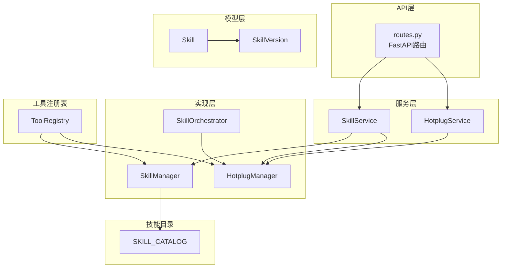

**图示来源**
- [odap/biz/platform/skill_system/api/routes.py:1-185](file://odap/biz/platform/skill_system/api/routes.py#L1-L185)
- [odap/biz/platform/skill_system/services/skill_service.py:1-184](file://odap/biz/platform/skill_system/services/skill_service.py#L1-L184)
- [odap/biz/platform/skill_system/services/hotplug_service.py:1-57](file://odap/biz/platform/skill_system/services/hotplug_service.py#L1-L57)
- [odap/biz/platform/skill_system/impl/skill_manager.py:1-244](file://odap/biz/platform/skill_system/impl/skill_manager.py#L1-L244)
- [odap/biz/platform/skill_system/impl/hotplug.py:1-109](file://odap/biz/platform/skill_system/impl/hotplug.py#L1-L109)
- [odap/biz/platform/skill_system/impl/orchestrator.py:1-74](file://odap/biz/platform/skill_system/impl/orchestrator.py#L1-L74)
- [odap/biz/platform/skill_system/models/skill.py:1-54](file://odap/biz/platform/skill_system/models/skill.py#L1-L54)
- [odap/biz/platform/tool_registry/registry.py:1-1000](file://odap/biz/platform/tool_registry/registry.py#L1-L1000)
- [odap/tools/registry.py:1-53](file://odap/tools/registry.py#L1-L53)

**章节来源**
- [odap/biz/platform/skill_system/api/routes.py:1-185](file://odap/biz/platform/skill_system/api/routes.py#L1-L185)
- [odap/biz/platform/skill_system/services/skill_service.py:1-184](file://odap/biz/platform/skill_system/services/skill_service.py#L1-L184)
- [odap/biz/platform/skill_system/services/hotplug_service.py:1-57](file://odap/biz/platform/skill_system/services/hotplug_service.py#L1-L57)
- [odap/biz/platform/skill_system/impl/skill_manager.py:1-244](file://odap/biz/platform/skill_system/impl/skill_manager.py#L1-L244)
- [odap/biz/platform/skill_system/impl/hotplug.py:1-109](file://odap/biz/platform/skill_system/impl/hotplug.py#L1-L109)
- [odap/biz/platform/skill_system/impl/orchestrator.py:1-74](file://odap/biz/platform/skill_system/impl/orchestrator.py#L1-L74)
- [odap/biz/platform/skill_system/models/skill.py:1-54](file://odap/biz/platform/skill_system/models/skill.py#L1-L54)
- [odap/biz/platform/tool_registry/registry.py:1-1000](file://odap/biz/platform/tool_registry/registry.py#L1-L1000)
- [odap/tools/registry.py:1-53](file://odap/tools/registry.py#L1-L53)

## 核心组件
- 技能模型与版本：Skill、SkillVersion 定义技能实体与版本信息。
- 技能管理器：SkillManager 负责技能注册、查询、版本管理、与 SKILL_CATALOG 的同步。
- 热插拔管理器：HotplugManager 负责技能模块的加载、卸载、重载与状态查询。
- 技能服务：SkillService、HotplugService 对外提供统一的服务接口。
- 工具注册表：ToolRegistry 提供统一的工具注册、发现、执行、健康监控与权限控制。
- API 路由：routes.py 定义 REST 接口，调用服务层完成业务操作。

**章节来源**
- [odap/biz/platform/skill_system/models/skill.py:1-54](file://odap/biz/platform/skill_system/models/skill.py#L1-L54)
- [odap/biz/platform/skill_system/impl/skill_manager.py:1-244](file://odap/biz/platform/skill_system/impl/skill_manager.py#L1-L244)
- [odap/biz/platform/skill_system/impl/hotplug.py:1-109](file://odap/biz/platform/skill_system/impl/hotplug.py#L1-L109)
- [odap/biz/platform/skill_system/services/skill_service.py:1-184](file://odap/biz/platform/skill_system/services/skill_service.py#L1-L184)
- [odap/biz/platform/skill_system/services/hotplug_service.py:1-57](file://odap/biz/platform/skill_system/services/hotplug_service.py#L1-L57)
- [odap/biz/platform/tool_registry/registry.py:1-1000](file://odap/biz/platform/tool_registry/registry.py#L1-L1000)
- [odap/biz/platform/skill_system/api/routes.py:1-185](file://odap/biz/platform/skill_system/api/routes.py#L1-L185)

## 架构总览
技能系统采用“API → 服务 → 实现”的分层架构，并与工具注册表、技能目录、OpenHarness 等模块协同工作。API 层负责请求接入与参数校验；服务层封装业务流程；实现层提供具体能力；模型层定义数据结构；工具注册表提供统一的工具生命周期管理与权限控制。

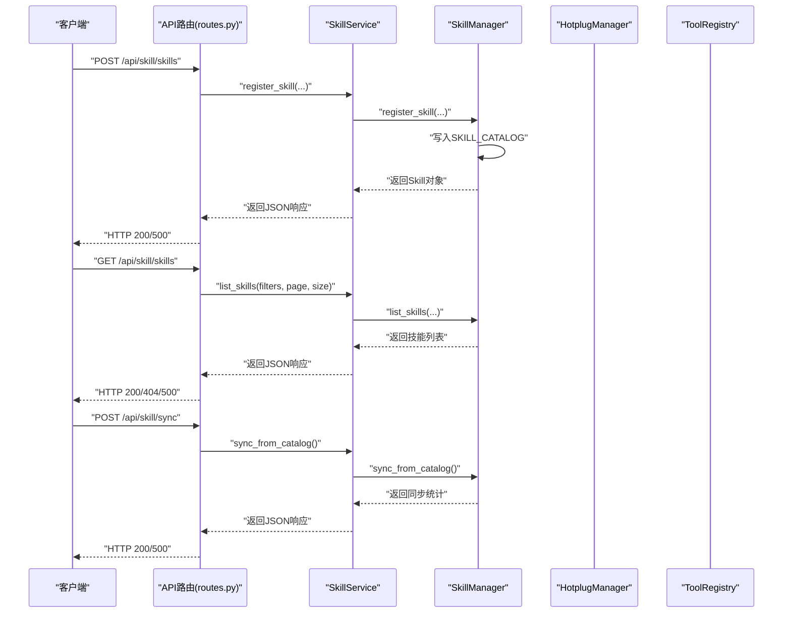

**图示来源**
- [odap/biz/platform/skill_system/api/routes.py:14-185](file://odap/biz/platform/skill_system/api/routes.py#L14-L185)
- [odap/biz/platform/skill_system/services/skill_service.py:16-184](file://odap/biz/platform/skill_system/services/skill_service.py#L16-L184)
- [odap/biz/platform/skill_system/impl/skill_manager.py:41-244](file://odap/biz/platform/skill_system/impl/skill_manager.py#L41-L244)
- [odap/biz/platform/tool_registry/registry.py:1-1000](file://odap/biz/platform/tool_registry/registry.py#L1-L1000)

## 详细组件分析

### 技能注册API
- 接口路径：POST /api/skill/skills
- 请求参数：name、skill_type、description、category、tags
- 返回值：技能ID、名称、类型、状态、创建时间
- 关键流程：
  - 服务层调用 SkillManager.register_skill 创建技能并写入 SKILL_CATALOG
  - 同步到 OpenHarness 工具适配器（通过 _sync_status_to_harness）
  - 返回标准化JSON响应

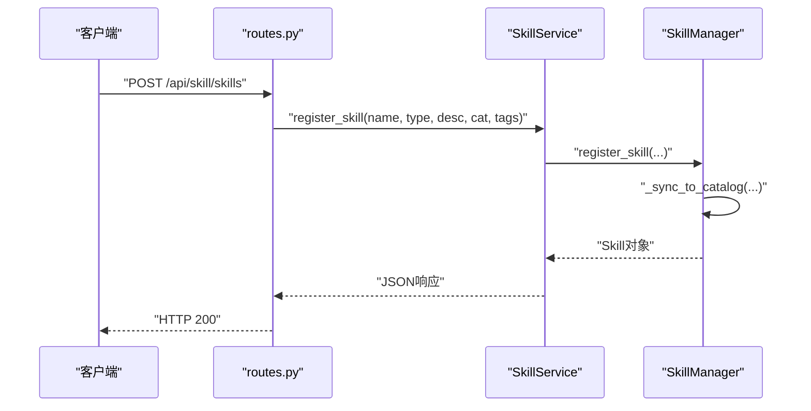

**图示来源**
- [odap/biz/platform/skill_system/api/routes.py:14-35](file://odap/biz/platform/skill_system/api/routes.py#L14-L35)
- [odap/biz/platform/skill_system/services/skill_service.py:16-28](file://odap/biz/platform/skill_system/services/skill_service.py#L16-L28)
- [odap/biz/platform/skill_system/impl/skill_manager.py:85-123](file://odap/biz/platform/skill_system/impl/skill_manager.py#L85-L123)

**章节来源**
- [odap/biz/platform/skill_system/api/routes.py:14-35](file://odap/biz/platform/skill_system/api/routes.py#L14-L35)
- [odap/biz/platform/skill_system/services/skill_service.py:16-28](file://odap/biz/platform/skill_system/services/skill_service.py#L16-L28)
- [odap/biz/platform/skill_system/impl/skill_manager.py:85-123](file://odap/biz/platform/skill_system/impl/skill_manager.py#L85-L123)

### 技能发现与搜索API
- 接口路径：GET /api/skill/skills
- 查询参数：page、page_size、skill_type、status、category、name
- 返回值：分页的技能列表（含名称、描述、类型、状态、分类、当前版本）
- 关键流程：
  - 服务层调用 SkillManager.list_skills 进行过滤与分页
  - 内部确保已从 SKILL_CATALOG 同步后再查询

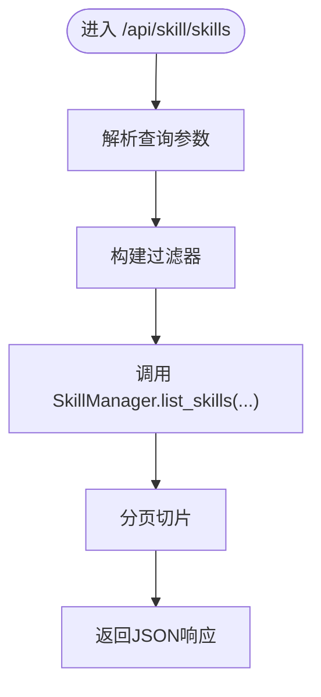

**图示来源**
- [odap/biz/platform/skill_system/api/routes.py:37-62](file://odap/biz/platform/skill_system/api/routes.py#L37-L62)
- [odap/biz/platform/skill_system/services/skill_service.py:88-112](file://odap/biz/platform/skill_system/services/skill_service.py#L88-L112)
- [odap/biz/platform/skill_system/impl/skill_manager.py:157-176](file://odap/biz/platform/skill_system/impl/skill_manager.py#L157-L176)

**章节来源**
- [odap/biz/platform/skill_system/api/routes.py:37-62](file://odap/biz/platform/skill_system/api/routes.py#L37-L62)
- [odap/biz/platform/skill_system/services/skill_service.py:88-112](file://odap/biz/platform/skill_system/services/skill_service.py#L88-L112)
- [odap/biz/platform/skill_system/impl/skill_manager.py:157-176](file://odap/biz/platform/skill_system/impl/skill_manager.py#L157-L176)

### 技能版本管理API
- 接口路径：POST /api/skill/skills/{skill_id}/versions
- 请求参数：version、implementation、schema、changelog
- 返回值：版本ID、技能ID、版本号、创建时间
- 关键流程：
  - 服务层调用 SkillManager.add_version 添加版本
  - 更新技能的 current_version

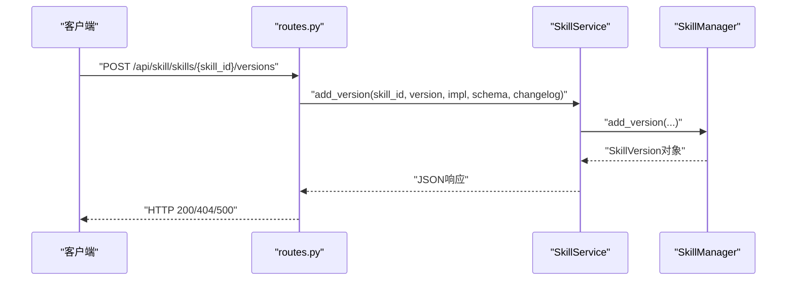

**图示来源**
- [odap/biz/platform/skill_system/api/routes.py:104-118](file://odap/biz/platform/skill_system/api/routes.py#L104-L118)
- [odap/biz/platform/skill_system/services/skill_service.py:114-126](file://odap/biz/platform/skill_system/services/skill_service.py#L114-L126)
- [odap/biz/platform/skill_system/impl/skill_manager.py:178-197](file://odap/biz/platform/skill_system/impl/skill_manager.py#L178-L197)

**章节来源**
- [odap/biz/platform/skill_system/api/routes.py:104-118](file://odap/biz/platform/skill_system/api/routes.py#L104-L118)
- [odap/biz/platform/skill_system/services/skill_service.py:114-126](file://odap/biz/platform/skill_system/services/skill_service.py#L114-L126)
- [odap/biz/platform/skill_system/impl/skill_manager.py:178-197](file://odap/biz/platform/skill_system/impl/skill_manager.py#L178-L197)

### 技能状态管理API
- 激活：POST /api/skill/skills/{skill_id}/activate
- 停用：POST /api/skill/skills/{skill_id}/deactivate
- 关键流程：
  - 服务层调用 SkillManager.activate_skill/deactivate_skill
  - 同步状态到 OpenHarness 工具适配器

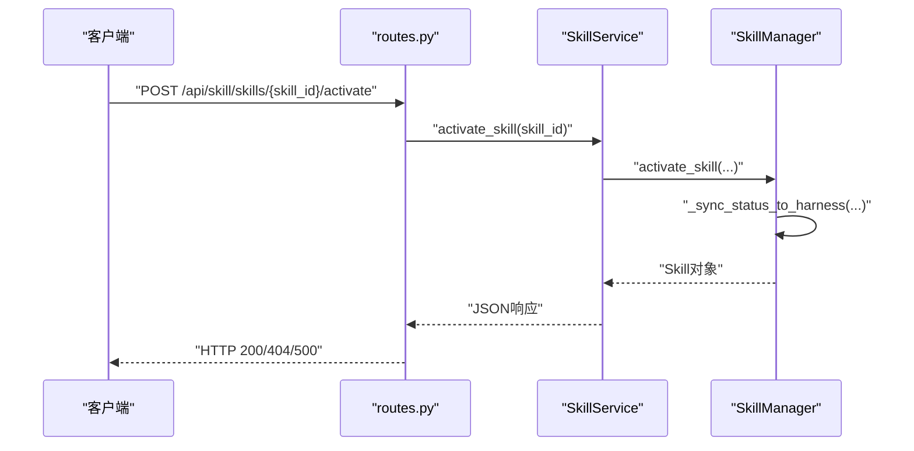

**图示来源**
- [odap/biz/platform/skill_system/api/routes.py:121-140](file://odap/biz/platform/skill_system/api/routes.py#L121-L140)
- [odap/biz/platform/skill_system/services/skill_service.py:128-138](file://odap/biz/platform/skill_system/services/skill_service.py#L128-L138)
- [odap/biz/platform/skill_system/impl/skill_manager.py:199-209](file://odap/biz/platform/skill_system/impl/skill_manager.py#L199-L209)

**章节来源**
- [odap/biz/platform/skill_system/api/routes.py:121-140](file://odap/biz/platform/skill_system/api/routes.py#L121-L140)
- [odap/biz/platform/skill_system/services/skill_service.py:128-138](file://odap/biz/platform/skill_system/services/skill_service.py#L128-L138)
- [odap/biz/platform/skill_system/impl/skill_manager.py:199-209](file://odap/biz/platform/skill_system/impl/skill_manager.py#L199-L209)

### 技能加载与卸载API
- 加载：POST /api/skill/skills/{skill_id}/load
- 卸载：POST /api/skill/skills/{skill_id}/unload
- 获取已加载技能：GET /api/skill/skills/loaded
- 关键流程：
  - 服务层调用 HotplugService.load_skill/unload_skill
  - HotplugManager 动态 import/reload 模块并维护状态

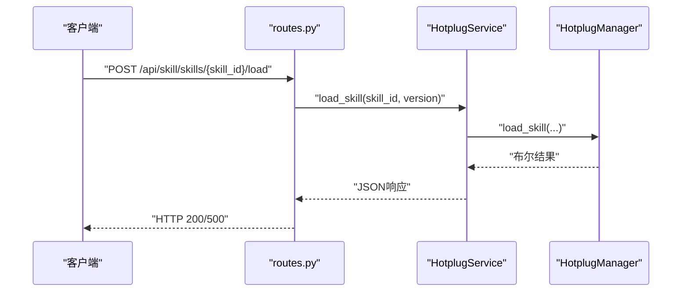

**图示来源**
- [odap/biz/platform/skill_system/api/routes.py:143-162](file://odap/biz/platform/skill_system/api/routes.py#L143-L162)
- [odap/biz/platform/skill_system/services/hotplug_service.py:13-20](file://odap/biz/platform/skill_system/services/hotplug_service.py#L13-L20)
- [odap/biz/platform/skill_system/impl/hotplug.py:19-36](file://odap/biz/platform/skill_system/impl/hotplug.py#L19-L36)

**章节来源**
- [odap/biz/platform/skill_system/api/routes.py:143-162](file://odap/biz/platform/skill_system/api/routes.py#L143-L162)
- [odap/biz/platform/skill_system/services/hotplug_service.py:13-20](file://odap/biz/platform/skill_system/services/hotplug_service.py#L13-L20)
- [odap/biz/platform/skill_system/impl/hotplug.py:19-36](file://odap/biz/platform/skill_system/impl/hotplug.py#L19-L36)

### 技能目录同步API
- 获取目录信息：GET /api/skill/catalog
- 手动同步：POST /api/skill/sync
- 关键流程：
  - 服务层调用 SkillManager.get_catalog_info/sync_from_catalog
  - 从 SKILL_CATALOG 加载或写入技能

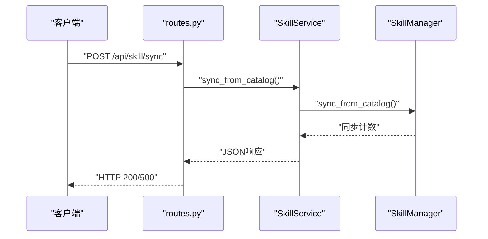

**图示来源**
- [odap/biz/platform/skill_system/api/routes.py:165-184](file://odap/biz/platform/skill_system/api/routes.py#L165-L184)
- [odap/biz/platform/skill_system/services/skill_service.py:172-183](file://odap/biz/platform/skill_system/services/skill_service.py#L172-L183)
- [odap/biz/platform/skill_system/impl/skill_manager.py:41-83](file://odap/biz/platform/skill_system/impl/skill_manager.py#L41-L83)

**章节来源**
- [odap/biz/platform/skill_system/api/routes.py:165-184](file://odap/biz/platform/skill_system/api/routes.py#L165-L184)
- [odap/biz/platform/skill_system/services/skill_service.py:172-183](file://odap/biz/platform/skill_system/services/skill_service.py#L172-L183)
- [odap/biz/platform/skill_system/impl/skill_manager.py:41-83](file://odap/biz/platform/skill_system/impl/skill_manager.py#L41-L83)

### 技能调用与编排API
- 工具统一调用：ToolRegistry.execute
- 异步执行：ToolRegistry.execute_async
- 工具链执行：ToolRegistry.execute_chain
- 依赖拓扑排序：SkillOrchestrator.topological_sort
- 关键流程：
  - ToolRegistry 根据工具类型选择执行路径（Skill、Function、MCP、REST）
  - 记录健康状态与执行历史
  - OPA 权限检查（requires_opa_check）

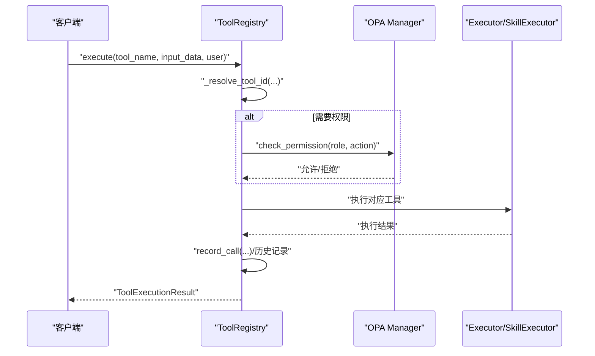

**图示来源**
- [odap/biz/platform/tool_registry/registry.py:579-668](file://odap/biz/platform/tool_registry/registry.py#L579-L668)
- [odap/biz/platform/tool_registry/registry.py:705-740](file://odap/biz/platform/tool_registry/registry.py#L705-L740)
- [odap/biz/platform/skill_system/impl/orchestrator.py:12-65](file://odap/biz/platform/skill_system/impl/orchestrator.py#L12-L65)

**章节来源**
- [odap/biz/platform/tool_registry/registry.py:579-668](file://odap/biz/platform/tool_registry/registry.py#L579-L668)
- [odap/biz/platform/tool_registry/registry.py:705-740](file://odap/biz/platform/tool_registry/registry.py#L705-L740)
- [odap/biz/platform/skill_system/impl/orchestrator.py:12-65](file://odap/biz/platform/skill_system/impl/orchestrator.py#L12-L65)

### 技能权限控制API
- OPA 集成：ToolRegistry._check_permission 使用 opa_action 与 requires_opa_check
- 角色驱动：根据用户角色与动作进行授权判断
- 工具类型与ID：默认动作格式为 "{tool_type}:{tool_name}"

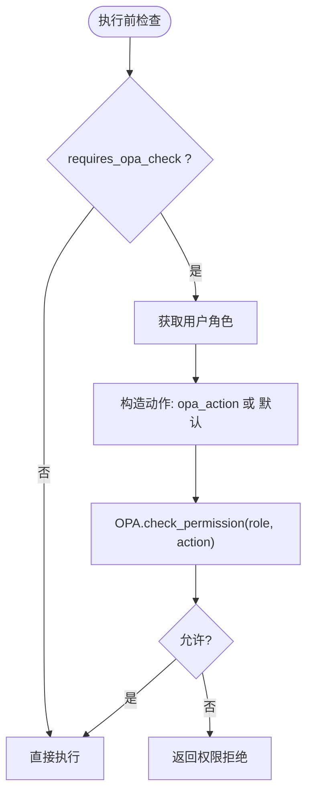

**图示来源**
- [odap/biz/platform/tool_registry/registry.py:761-771](file://odap/biz/platform/tool_registry/registry.py#L761-L771)

**章节来源**
- [odap/biz/platform/tool_registry/registry.py:761-771](file://odap/biz/platform/tool_registry/registry.py#L761-L771)

### 技能性能监控与健康状态
- 健康监控：ToolHealthMonitor 记录调用次数、成功率、平均耗时、最后错误
- 告警阈值：错误率与平均延迟分级（健康/退化/不健康）
- 健康报告：ToolRegistry.get_health_report 汇总统计与告警

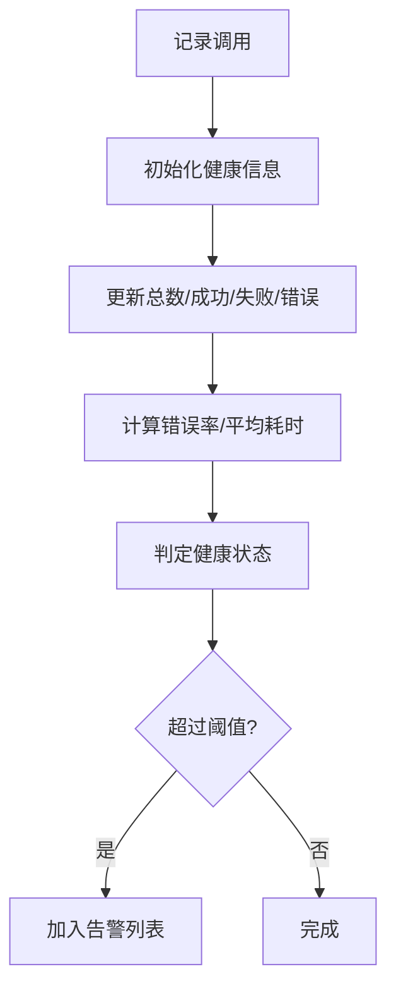

**图示来源**
- [odap/biz/platform/tool_registry/registry.py:304-401](file://odap/biz/platform/tool_registry/registry.py#L304-L401)
- [odap/biz/platform/tool_registry/registry.py:719-740](file://odap/biz/platform/tool_registry/registry.py#L719-L740)

**章节来源**
- [odap/biz/platform/tool_registry/registry.py:304-401](file://odap/biz/platform/tool_registry/registry.py#L304-L401)
- [odap/biz/platform/tool_registry/registry.py:719-740](file://odap/biz/platform/tool_registry/registry.py#L719-L740)

## 依赖分析
- 技能模型依赖枚举类型（SkillType、SkillStatus）与时间戳字段。
- SkillManager 与 SKILL_CATALOG 双向同步，保证旧模式与新模式兼容。
- HotplugManager 依赖 sys.modules 进行动态模块加载与重载。
- ToolRegistry 统一管理技能、函数、MCP、REST 四类工具，提供语义发现与健康监控。
- API 路由依赖服务层，服务层依赖实现层与工具注册表。

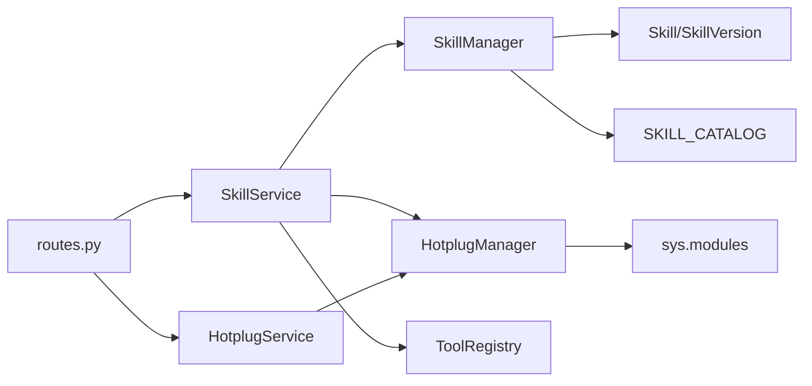

**图示来源**
- [odap/biz/platform/skill_system/api/routes.py:1-185](file://odap/biz/platform/skill_system/api/routes.py#L1-L185)
- [odap/biz/platform/skill_system/services/skill_service.py:1-184](file://odap/biz/platform/skill_system/services/skill_service.py#L1-L184)
- [odap/biz/platform/skill_system/services/hotplug_service.py:1-57](file://odap/biz/platform/skill_system/services/hotplug_service.py#L1-L57)
- [odap/biz/platform/skill_system/impl/skill_manager.py:1-244](file://odap/biz/platform/skill_system/impl/skill_manager.py#L1-L244)
- [odap/biz/platform/skill_system/impl/hotplug.py:1-109](file://odap/biz/platform/skill_system/impl/hotplug.py#L1-L109)
- [odap/biz/platform/skill_system/models/skill.py:1-54](file://odap/biz/platform/skill_system/models/skill.py#L1-L54)
- [odap/biz/platform/tool_registry/registry.py:1-1000](file://odap/biz/platform/tool_registry/registry.py#L1-L1000)
- [odap/tools/registry.py:1-53](file://odap/tools/registry.py#L1-L53)

**章节来源**
- [odap/biz/platform/skill_system/models/skill.py:1-54](file://odap/biz/platform/skill_system/models/skill.py#L1-L54)
- [odap/biz/platform/skill_system/impl/skill_manager.py:1-244](file://odap/biz/platform/skill_system/impl/skill_manager.py#L1-L244)
- [odap/biz/platform/skill_system/impl/hotplug.py:1-109](file://odap/biz/platform/skill_system/impl/hotplug.py#L1-L109)
- [odap/biz/platform/tool_registry/registry.py:1-1000](file://odap/biz/platform/tool_registry/registry.py#L1-L1000)
- [odap/tools/registry.py:1-53](file://odap/tools/registry.py#L1-L53)

## 性能考虑
- 异步执行：ToolRegistry.execute_async 使用线程池执行阻塞操作，降低主线程阻塞风险。
- 健康监控：ToolHealthMonitor 基于滑动窗口统计指标，及时发现异常。
- 语义发现：SemanticToolDiscovery 基于关键词与标签建立索引，提升检索效率。
- 缓存与索引：MCPToolBridge 缓存 MCP 工具元数据，减少重复注册成本。
- 超时与限流：ToolMetadata 中包含 timeout_ms 与 rate_limit 字段，便于统一治理。

[本节为通用性能建议，无需特定文件引用]

## 故障排查指南
- 注册失败：检查 SkillManager._sync_to_catalog 是否抛出异常；确认 SKILL_CATALOG 可写。
- 加载失败：查看 HotplugManager.load_skill 的异常日志；确认模块名映射正确。
- 权限拒绝：确认 ToolRegistry._check_permission 的 opa_action 与 requires_opa_check 设置；核对 OPA 策略。
- 健康异常：通过 ToolRegistry.get_health_report 查看工具健康状态与告警；关注错误率与平均延迟阈值。
- 同步问题：调用 /api/skill/sync 手动触发同步；检查 SKILL_CATALOG 与管理器一致性。

**章节来源**
- [odap/biz/platform/skill_system/impl/skill_manager.py:109-122](file://odap/biz/platform/skill_system/impl/skill_manager.py#L109-L122)
- [odap/biz/platform/skill_system/impl/hotplug.py:29-36](file://odap/biz/platform/skill_system/impl/hotplug.py#L29-L36)
- [odap/biz/platform/tool_registry/registry.py:761-771](file://odap/biz/platform/tool_registry/registry.py#L761-L771)
- [odap/biz/platform/tool_registry/registry.py:719-740](file://odap/biz/platform/tool_registry/registry.py#L719-L740)
- [odap/biz/platform/skill_system/api/routes.py:176-184](file://odap/biz/platform/skill_system/api/routes.py#L176-L184)

## 结论
技能系统API提供了从注册、发现、调用到管理的完整能力，具备良好的扩展性与可观测性。通过 ToolRegistry 的统一入口，系统实现了技能、函数、MCP、REST 的一体化管理；结合 OPA 权限控制与健康监控，能够满足生产环境的可靠性与安全性要求。建议在实际使用中：
- 明确技能类型与分类，合理设置版本与变更日志；
- 在高并发场景下优先使用异步执行与缓存；
- 建立完善的健康监控与告警机制；
- 严格控制权限，确保最小授权原则。

[本节为总结性内容，无需特定文件引用]

## 附录
- 技能目录（SKILL_CATALOG）：旧模式兼容，与 SkillManager 双向同步。
- 技能注册表（SkillRegistry）：新模式，面向 BaseSkill 子类注册。
- 工具注册表（ToolRegistry）：统一管理四类工具，提供发现、执行、健康与权限能力。

**章节来源**
- [odap/tools/registry.py:11-38](file://odap/tools/registry.py#L11-L38)
- [odap/biz/platform/tool_registry/registry.py:403-467](file://odap/biz/platform/tool_registry/registry.py#L403-L467)
- [odap/biz/platform/skill_system/impl/skill_manager.py:41-83](file://odap/biz/platform/skill_system/impl/skill_manager.py#L41-L83)