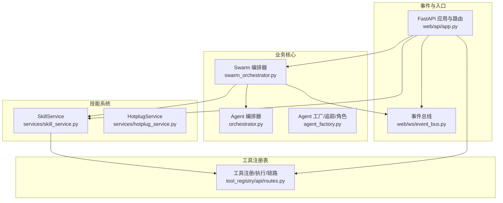
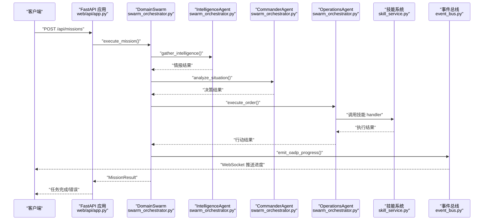
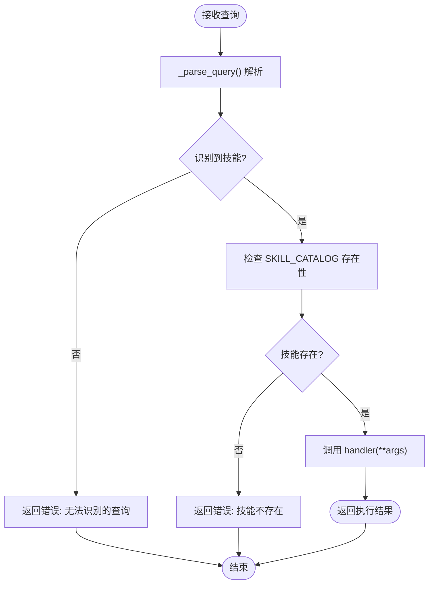
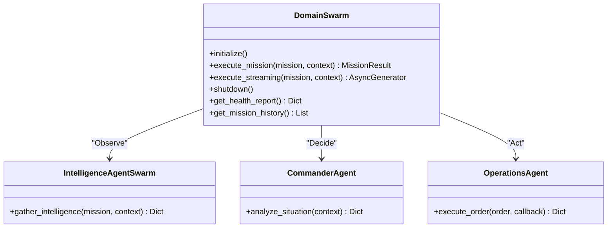
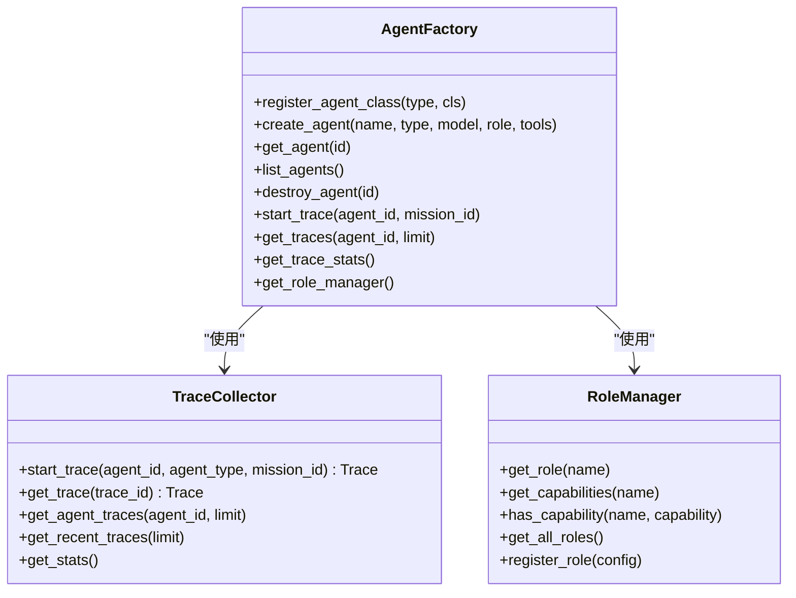
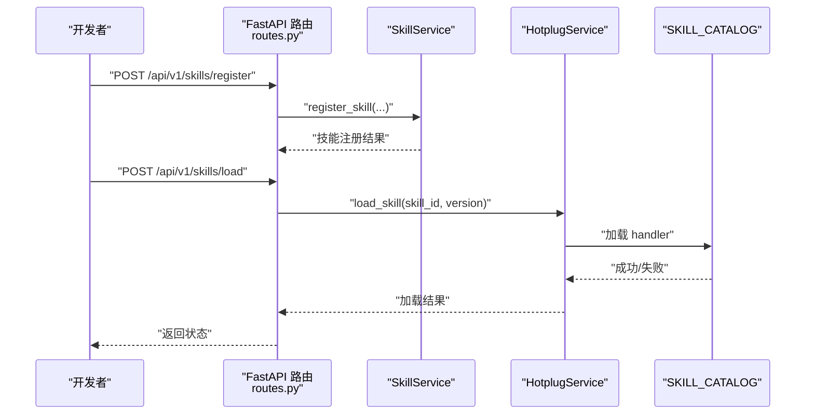
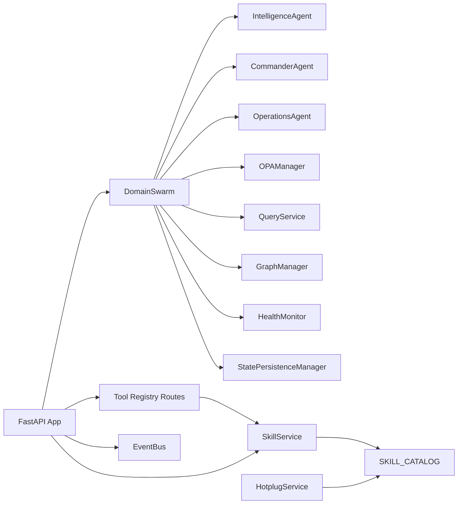

# 智能体API

<cite>
**本文引用的文件**
- [odap/biz/core/agent/orchestrator.py](file://odap/biz/core/agent/orchestrator.py)
- [odap/biz/core/agent/swarm_orchestrator.py](file://odap/biz/core/agent/swarm_orchestrator.py)
- [odap/biz/core/agent/agent_factory.py](file://odap/biz/core/agent/agent_factory.py)
- [odap/biz/platform/skill_system/services/skill_service.py](file://odap/biz/platform/skill_system/services/skill_service.py)
- [odap/biz/platform/skill_system/services/hotplug_service.py](file://odap/biz/platform/skill_system/services/hotplug_service.py)
- [odap/web/ws/event_bus.py](file://odap/web/ws/event_bus.py)
- [odap/web/api/app.py](file://odap/web/api/app.py)
- [odap/tools/__init__.py](file://odap/tools/__init__.py)
- [config/agent_config.yaml](file://config/agent_config.yaml)
- [odap/biz/platform/tool_registry/api/routes.py](file://odap/biz/platform/tool_registry/api/routes.py)
</cite>

## 目录
1. [简介](#简介)
2. [项目结构](#项目结构)
3. [核心组件](#核心组件)
4. [架构总览](#架构总览)
5. [详细组件分析](#详细组件分析)
6. [依赖分析](#依赖分析)
7. [性能考量](#性能考量)
8. [故障排查指南](#故障排查指南)
9. [结论](#结论)
10. [附录](#附录)

## 简介
本文件为 ODAP 平台的智能体API参考文档，面向智能体开发者与系统集成者，覆盖以下能力：
- 智能体创建、配置、启动、停止的完整接口
- Agent 编排器 API：支持多 Agent 协作的编排与调度
- Swarm 智能体 API：团队创建、成员管理、任务分配
- 技能系统 API：技能注册、调用、管理与热插拔
- 智能体状态监控 API：实时状态查询与事件订阅
- 智能体对话 API：与用户的自然语言交互
- 智能体执行结果的获取与处理接口

## 项目结构
ODAP 平台围绕“业务域”模块组织，智能体相关能力主要分布在如下位置：
- 业务核心：odap/biz/core/agent（编排器、工厂、类型）
- 技能系统：odap/biz/platform/skill_system（服务与热插拔）
- 工具注册表：odap/biz/platform/tool_registry（REST API）
- 事件总线：odap/web/ws（WebSocket 事件发布）
- Web 入口：odap/web/api/app.py（FastAPI 应用与路由聚合）

**图表来源**
- [odap/biz/core/agent/swarm_orchestrator.py:288-687](file://odap/biz/core/agent/swarm_orchestrator.py#L288-L687)
- [odap/biz/core/agent/orchestrator.py:16-151](file://odap/biz/core/agent/orchestrator.py#L16-L151)
- [odap/biz/core/agent/agent_factory.py:24-442](file://odap/biz/core/agent/agent_factory.py#L24-L442)
- [odap/biz/platform/skill_system/services/skill_service.py:9-184](file://odap/biz/platform/skill_system/services/skill_service.py#L9-L184)
- [odap/biz/platform/skill_system/services/hotplug_service.py:7-57](file://odap/biz/platform/skill_system/services/hotplug_service.py#L7-L57)
- [odap/biz/platform/tool_registry/api/routes.py:1-310](file://odap/biz/platform/tool_registry/api/routes.py#L1-L310)
- [odap/web/ws/event_bus.py:13-147](file://odap/web/ws/event_bus.py#L13-L147)
- [odap/web/api/app.py:304-515](file://odap/web/api/app.py#L304-L515)

**章节来源**
- [odap/biz/core/agent/swarm_orchestrator.py:288-687](file://odap/biz/core/agent/swarm_orchestrator.py#L288-L687)
- [odap/biz/core/agent/orchestrator.py:16-151](file://odap/biz/core/agent/orchestrator.py#L16-L151)
- [odap/biz/core/agent/agent_factory.py:24-442](file://odap/biz/core/agent/agent_factory.py#L24-L442)
- [odap/biz/platform/skill_system/services/skill_service.py:9-184](file://odap/biz/platform/skill_system/services/skill_service.py#L9-L184)
- [odap/biz/platform/skill_system/services/hotplug_service.py:7-57](file://odap/biz/platform/skill_system/services/hotplug_service.py#L7-L57)
- [odap/biz/platform/tool_registry/api/routes.py:1-310](file://odap/biz/platform/tool_registry/api/routes.py#L1-L310)
- [odap/web/ws/event_bus.py:13-147](file://odap/web/ws/event_bus.py#L13-L147)
- [odap/web/api/app.py:304-515](file://odap/web/api/app.py#L304-L515)

## 核心组件
- Agent 编排器：负责任务解析、技能路由与执行，支持查询解析与技能调用。
- Swarm 编排器：实现领域三 Agent（Commander/Intelligence/Operations）的 OODA 循环，支持流式进度事件与历史记录。
- Agent 工厂：管理 Agent 生命周期、追踪跨度与角色能力，提供追踪统计。
- 技能系统：提供技能注册、查询、版本管理、激活/停用、加载/卸载与目录同步。
- 工具注册表：提供工具注册、发现、执行与工具链编排的 REST API。
- 事件总线：提供 WebSocket 事件订阅、实体变更、行动结果、权限检查等事件推送。

**章节来源**
- [odap/biz/core/agent/orchestrator.py:16-151](file://odap/biz/core/agent/orchestrator.py#L16-L151)
- [odap/biz/core/agent/swarm_orchestrator.py:288-687](file://odap/biz/core/agent/swarm_orchestrator.py#L288-L687)
- [odap/biz/core/agent/agent_factory.py:340-442](file://odap/biz/core/agent/agent_factory.py#L340-L442)
- [odap/biz/platform/skill_system/services/skill_service.py:9-184](file://odap/biz/platform/skill_system/services/skill_service.py#L9-L184)
- [odap/biz/platform/tool_registry/api/routes.py:75-310](file://odap/biz/platform/tool_registry/api/routes.py#L75-L310)
- [odap/web/ws/event_bus.py:13-147](file://odap/web/ws/event_bus.py#L13-L147)

## 架构总览
ODAP 智能体API以 FastAPI 作为统一入口，聚合各子系统路由，并通过事件总线实现状态与结果的实时推送。Swarm 编排器串联 Intelligence/Commander/Operations 三类 Agent，结合技能系统与工具注册表完成端到端任务执行。

**图表来源**
- [odap/web/api/app.py:304-515](file://odap/web/api/app.py#L304-L515)
- [odap/biz/core/agent/swarm_orchestrator.py:379-657](file://odap/biz/core/agent/swarm_orchestrator.py#L379-L657)
- [odap/biz/platform/skill_system/services/skill_service.py:9-184](file://odap/biz/platform/skill_system/services/skill_service.py#L9-L184)
- [odap/web/ws/event_bus.py:88-95](file://odap/web/ws/event_bus.py#L88-L95)

## 详细组件分析

### Agent 编排器 API
- 功能概述
  - 接收用户查询，解析出所需技能与参数
  - 校验技能存在性，调用 SKILL_CATALOG 中的 handler
  - 返回执行结果或错误信息
- 关键方法
  - run(query): 执行查询并返回结果
  - _parse_query(query): 解析查询关键词，提取技能名与参数
- 典型技能
  - 雷达搜索、领域分析、打击推荐、力量对比、攻击目标、指挥命令等

**图表来源**
- [odap/biz/core/agent/orchestrator.py:33-114](file://odap/biz/core/agent/orchestrator.py#L33-L114)

**章节来源**
- [odap/biz/core/agent/orchestrator.py:16-151](file://odap/biz/core/agent/orchestrator.py#L16-L151)
- [odap/tools/__init__.py:1-35](file://odap/tools/__init__.py#L1-L35)

### Swarm 智能体 API（DomainSwarm）
- 功能概述
  - OODA 循环：Observe（感知）→ Orient（理解）→ Decide（决策）→ Act（行动）
  - 三 Agent 协同：Intelligence（情报）、Commander（决策）、Operations（执行）
  - 流式进度：execute_streaming 提供阶段进度事件
  - 历史与持久化：保存任务历史、检查点与 Graphiti Episode
- 关键类与方法
  - DomainSwarm.execute_mission()/execute_streaming()
  - IntelligenceAgentSwarm.gather_intelligence()
  - CommanderAgent.analyze_situation()
  - OperationsAgent.execute_order()
  - 事件推送：emit_oadp_progress()

**图表来源**
- [odap/biz/core/agent/swarm_orchestrator.py:288-657](file://odap/biz/core/agent/swarm_orchestrator.py#L288-L657)

**章节来源**
- [odap/biz/core/agent/swarm_orchestrator.py:288-687](file://odap/biz/core/agent/swarm_orchestrator.py#L288-L687)
- [odap/web/ws/event_bus.py:88-95](file://odap/web/ws/event_bus.py#L88-L95)

### Agent 工厂与追踪（AgentFactory/Trace/RoleManager）
- 功能概述
  - Agent 生命周期管理：注册、创建、销毁
  - 执行追踪：TraceSpan/Trace/TraceCollector，支持统计与查询
  - 角色能力：RoleManager 管理角色与能力映射
- 关键方法
  - create_agent()/destroy_agent()
  - start_trace()/get_traces()/get_trace_stats()
  - get_role_manager()

**图表来源**
- [odap/biz/core/agent/agent_factory.py:340-442](file://odap/biz/core/agent/agent_factory.py#L340-L442)

**章节来源**
- [odap/biz/core/agent/agent_factory.py:24-442](file://odap/biz/core/agent/agent_factory.py#L24-L442)

### 技能系统 API（SkillService/HotplugService）
- 功能概述
  - 技能注册、查询、更新、删除、列表、版本管理、激活/停用
  - 热插拔：加载/卸载/重载技能，查询加载状态
  - 目录同步：从 SKILL_CATALOG 同步技能信息
- 关键接口
  - register_skill()/get_skill()/update_skill()/delete_skill()
  - add_version()/activate_skill()/deactivate_skill()
  - load_skill()/unload_skill()/reload_skill()
  - get_catalog_info()/sync_from_catalog()

**图表来源**
- [odap/biz/platform/skill_system/services/skill_service.py:16-184](file://odap/biz/platform/skill_system/services/skill_service.py#L16-L184)
- [odap/biz/platform/skill_system/services/hotplug_service.py:13-57](file://odap/biz/platform/skill_system/services/hotplug_service.py#L13-L57)
- [odap/tools/__init__.py:1-35](file://odap/tools/__init__.py#L1-L35)

**章节来源**
- [odap/biz/platform/skill_system/services/skill_service.py:9-184](file://odap/biz/platform/skill_system/services/skill_service.py#L9-L184)
- [odap/biz/platform/skill_system/services/hotplug_service.py:7-57](file://odap/biz/platform/skill_system/services/hotplug_service.py#L7-L57)
- [odap/tools/__init__.py:1-35](file://odap/tools/__init__.py#L1-L35)

### 工具注册表 API（Tool Registry）
- 功能概述
  - 工具注册：支持 skill、REST、function 三种类型
  - 工具发现：按名称、类型、分类、能力、语义查询
  - 工具执行：按名称执行，返回执行结果
  - 工具链：注册与执行工具链，支持多步骤编排
  - 健康与历史：健康报告与执行历史查询
- 关键接口
  - POST /api/v1/tools/register
  - GET /api/v1/tools/discover
  - POST /api/v1/tools/execute
  - POST /api/v1/tools/chain/register
  - POST /api/v1/tools/chain/{chain_id}/execute
  - GET /api/v1/tools/chains
  - GET /api/v1/tools/{tool_name}

**章节来源**
- [odap/biz/platform/tool_registry/api/routes.py:75-310](file://odap/biz/platform/tool_registry/api/routes.py#L75-L310)

### 事件总线与状态监控 API（WebSocket）
- 功能概述
  - WebSocket 连接与订阅：connect()/disconnect()
  - 事件广播：emit()/emit_oadp_progress()/emit_action_result() 等
  - 事件历史：最近事件查询与统计
- 关键接口
  - WebSocket 路由：/ws/events（订阅事件）
  - 事件类型：entity:changed、intel:updated、action:result、oadp:progress、opa:check、audit:event
  - 统计接口：get_stats()/get_recent_events()

**章节来源**
- [odap/web/ws/event_bus.py:13-147](file://odap/web/ws/event_bus.py#L13-L147)

### 对话与任务执行 API（FastAPI 聚合）
- 功能概述
  - FastAPI 应用聚合各模块路由，提供统一入口
  - 包含场景管理、本体摄入、版本管理、查询服务、认证、角色、智能体管理、审计、工作空间、OPA 策略、QA、知识库、Hook、MCP、前端兼容、事件模拟器、决策、感知、模拟沙箱、业务管理、会话记忆、数据仓库、认知、反馈、推演、语义地图、对象服务、技能扩展等路由
- 关键点
  - 聚合技能系统与工具注册表路由
  - 提供健康检查与基础接口

**章节来源**
- [odap/web/api/app.py:304-515](file://odap/web/api/app.py#L304-L515)

## 依赖分析
- 组件耦合
  - DomainSwarm 依赖 Intelligence/Commander/Operations Agent、OPA 管理器、查询服务、图管理器、健康监控、状态持久化
  - SkillService/HotplugService 依赖 SKILL_CATALOG 与工具注册表
  - 事件总线为跨模块解耦的关键
- 外部依赖
  - FastAPI、WebSocket、uvicorn
  - Graphiti 图数据库（通过图管理器）
  - OPA 策略引擎（通过 OPAManager）

**图表来源**
- [odap/biz/core/agent/swarm_orchestrator.py:294-306](file://odap/biz/core/agent/swarm_orchestrator.py#L294-L306)
- [odap/biz/platform/skill_system/services/skill_service.py:12-14](file://odap/biz/platform/skill_system/services/skill_service.py#L12-L14)
- [odap/biz/platform/tool_registry/api/routes.py:75-134](file://odap/biz/platform/tool_registry/api/routes.py#L75-L134)
- [odap/web/api/app.py:328-333](file://odap/web/api/app.py#L328-L333)

**章节来源**
- [odap/biz/core/agent/swarm_orchestrator.py:294-306](file://odap/biz/core/agent/swarm_orchestrator.py#L294-L306)
- [odap/biz/platform/skill_system/services/skill_service.py:12-14](file://odap/biz/platform/skill_system/services/skill_service.py#L12-L14)
- [odap/biz/platform/tool_registry/api/routes.py:75-134](file://odap/biz/platform/tool_registry/api/routes.py#L75-L134)
- [odap/web/api/app.py:328-333](file://odap/web/api/app.py#L328-L333)

## 性能考量
- OODA 循环异步化：Swarm 使用异步方法与流式进度，降低阻塞
- 事件总线广播：按工作空间过滤目标客户端，减少无效推送
- 技能目录缓存：通过 SKILL_CATALOG 减少重复加载开销
- 健康监控与故障恢复：内置健康监测与故障恢复管理器，提升可用性
- 建议
  - 控制并发任务数量与超时时间
  - 合理设置事件历史上限，避免内存膨胀
  - 对外部服务（如图数据库、策略引擎）进行连接池与重试策略配置

[本节为通用建议，无需特定文件引用]

## 故障排查指南
- 常见问题
  - 技能不存在或执行失败：检查 SKILL_CATALOG 是否包含对应技能，确认 handler 正常
  - 权限拒绝：检查 OPA 策略与 opa:check 事件
  - 事件未推送：确认 WebSocket 连接与工作空间过滤
  - 任务卡死：查看 OODA 各阶段进度事件与错误日志
- 可用接口
  - 获取任务历史：DomainSwarm.get_mission_history()
  - 获取健康报告：DomainSwarm.get_health_report()
  - 获取持久化统计：DomainSwarm.get_persistence_stats()
  - 获取故障汇总：DomainSwarm.get_fault_summary()
  - 获取事件统计：DomainEventBus.get_stats()

**章节来源**
- [odap/biz/core/agent/swarm_orchestrator.py:639-657](file://odap/biz/core/agent/swarm_orchestrator.py#L639-L657)
- [odap/web/ws/event_bus.py:130-139](file://odap/web/ws/event_bus.py#L130-L139)

## 结论
ODAP 平台提供了完整的智能体API体系：从基础的 Agent 编排与 Swarm 协作，到技能系统与工具注册表，再到事件驱动的状态监控与统一的 Web 入口。该架构具备良好的扩展性与可观测性，适合在复杂业务场景中实现多 Agent 协同与自动化执行。

[本节为总结，无需特定文件引用]

## 附录

### API 一览（按模块）
- 智能体编排
  - SelfCorrectingOrchestrator.run(query)
  - SelfCorrectingOrchestrator._parse_query(query)
- Swarm 编排
  - DomainSwarm.initialize()/execute_mission()/execute_streaming()
  - IntelligenceAgent.gather_intelligence()
  - CommanderAgent.analyze_situation()
  - OperationsAgent.execute_order()
- 技能系统
  - SkillService.register_skill()/get_skill()/update_skill()/delete_skill()
  - SkillService.add_version()/activate_skill()/deactivate_skill()
  - HotplugService.load_skill()/unload_skill()/reload_skill()
- 工具注册表
  - POST /api/v1/tools/register
  - GET /api/v1/tools/discover
  - POST /api/v1/tools/execute
  - POST /api/v1/tools/chain/register
  - POST /api/v1/tools/chain/{chain_id}/execute
  - GET /api/v1/tools/chains
  - GET /api/v1/tools/{tool_name}
- 事件总线
  - WebSocket /ws/events
  - 事件类型：entity:changed、intel:updated、action:result、oadp:progress、opa:check、audit:event
- Web 入口
  - FastAPI 路由聚合与健康检查

**章节来源**
- [odap/biz/core/agent/orchestrator.py:33-114](file://odap/biz/core/agent/orchestrator.py#L33-L114)
- [odap/biz/core/agent/swarm_orchestrator.py:379-657](file://odap/biz/core/agent/swarm_orchestrator.py#L379-L657)
- [odap/biz/platform/skill_system/services/skill_service.py:16-184](file://odap/biz/platform/skill_system/services/skill_service.py#L16-L184)
- [odap/biz/platform/skill_system/services/hotplug_service.py:13-57](file://odap/biz/platform/skill_system/services/hotplug_service.py#L13-L57)
- [odap/biz/platform/tool_registry/api/routes.py:75-310](file://odap/biz/platform/tool_registry/api/routes.py#L75-L310)
- [odap/web/ws/event_bus.py:13-147](file://odap/web/ws/event_bus.py#L13-L147)
- [odap/web/api/app.py:304-515](file://odap/web/api/app.py#L304-L515)

### 配置参考
- Agent Provider 配置示例：默认提供者、模型、温度、最大 token 等
- 建议
  - 在集成前根据环境调整 base_url、模型与温度
  - 为不同角色配置合适的权限级别

**章节来源**
- [config/agent_config.yaml:1-23](file://config/agent_config.yaml#L1-L23)