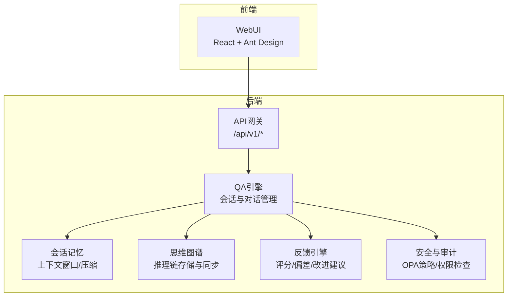
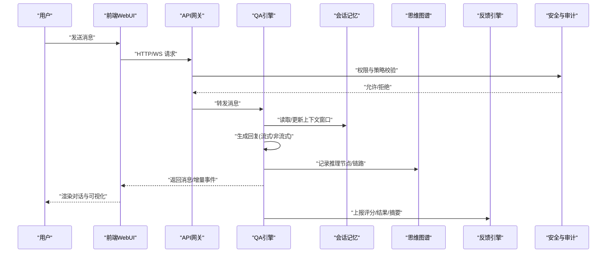
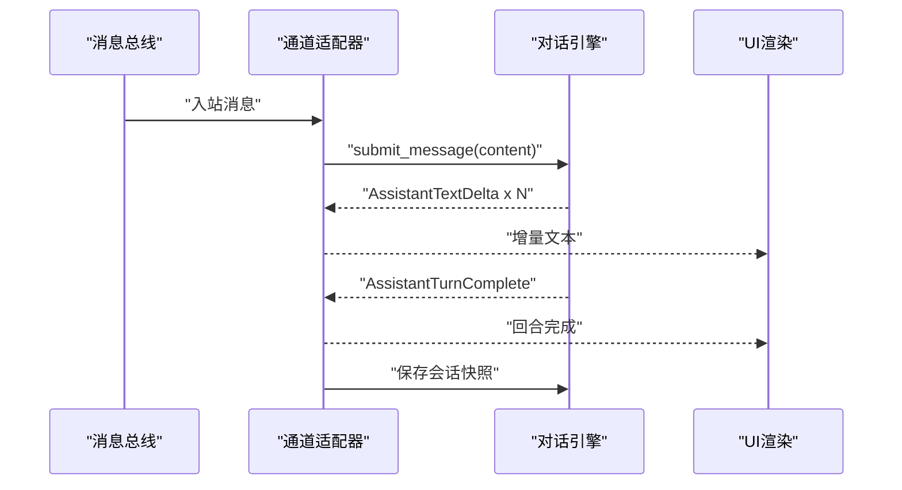
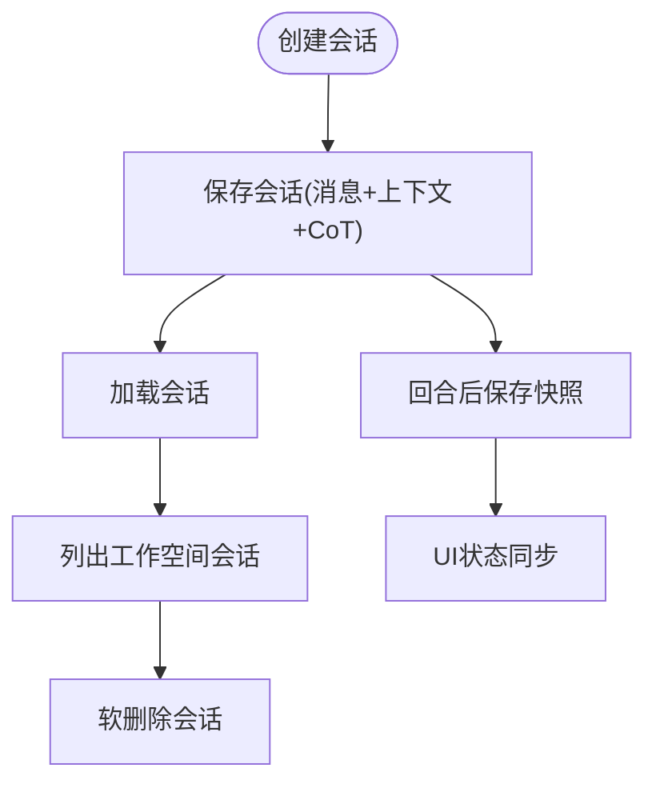
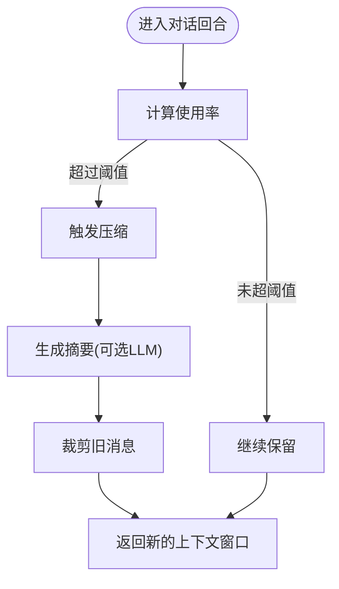
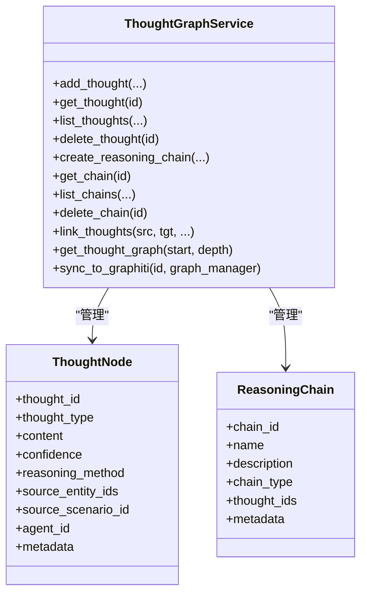
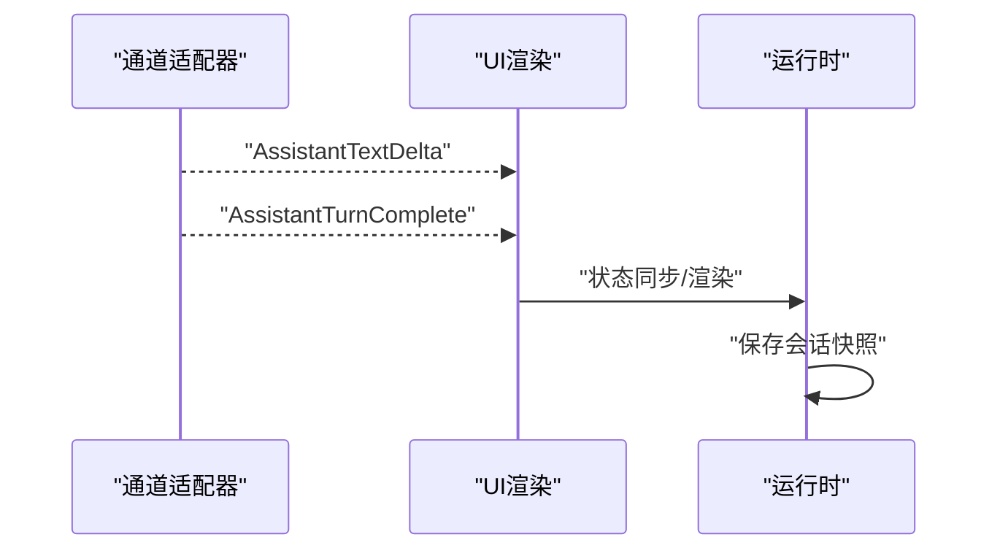
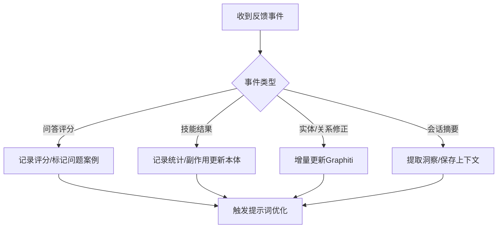
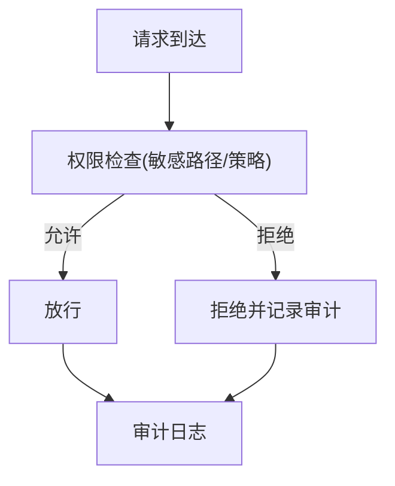
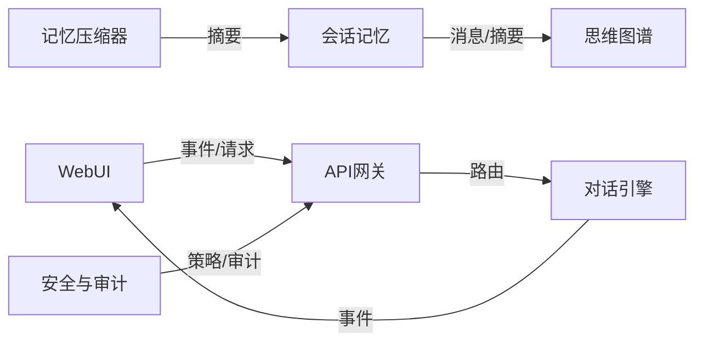

# 智能体对话API

<cite>
**本文引用的文件**
- [对话引擎与通道适配](file://openharness/src/openharness/channels/adapter.py)
- [会话记忆设计文档](file://docs/03-modules/session_memory/DESIGN.md)
- [会话记忆压缩器](file://odap/biz/platform/session_memory/memory_compactor.py)
- [QA引擎单元测试](file://tests/unit/test_qa_engine.py)
- [思维图谱服务](file://odap/biz/core/cognition/thought_graph/services/thought_graph_service.py)
- [思维图谱基础设施导出](file://odap/infra/graph/thought_graph.py)
- [反馈收集器](file://odap/biz/simulation/feedback/collector.py)
- [反馈引擎](file://docs/02-architecture/ARCHITECTURE_FULL_CHAIN_DEEP.md)
- [会话记忆API路由](file://odap/biz/platform/session_memory/api/routes.py)
- [工作空间API路由](file://odap/biz/platform/workspace/api/routes.py)
- [权限检查器测试](file://openharness/tests/test_permissions/test_checker.py)
- [OPA策略路由](file://odap/infra/opa/routes.py)
- [对话压缩与上下文折叠](file://openharness/src/openharness/services/compact/__init__.py)
- [对话UI事件渲染](file://openharness/src/openharness/ui/textual_app.py)
- [运行时会话保存](file://openharness/src/openharness/ui/runtime.py)
- [WebUI架构设计](file://docs/07-adr/ADR-052_webui_opensource_selection.md)
- [会话记忆设计文档(续)](file://docs/03-modules/session_memory/DESIGN.md)
</cite>

## 目录
1. [简介](#简介)
2. [项目结构](#项目结构)
3. [核心组件](#核心组件)
4. [架构总览](#架构总览)
5. [详细组件分析](#详细组件分析)
6. [依赖分析](#依赖分析)
7. [性能考量](#性能考量)
8. [故障排查指南](#故障排查指南)
9. [结论](#结论)
10. [附录](#附录)

## 简介
本文件面向智能体对话API的开发者与集成者，系统化阐述多轮对话的自然语言交互接口、会话生命周期管理、上下文窗口与记忆压缩、思维图谱集成、多轮上下文保持与状态同步、对话质量评估与反馈收集，以及对话安全过滤与隐私保护机制。文档以仓库现有实现为依据，结合设计文档与测试用例，提供可操作的集成指南与最佳实践。

## 项目结构
对话能力由“前端WebUI + API网关 + 业务引擎 + 认知与存储”四层构成：
- 前端WebUI：基于React与Ant Design，提供聊天界面、会话列表、思维链可视化与审计面板。
- API网关：统一入口，路由至QA引擎、技能API、本体API等。
- 业务引擎：OpenHarness运行时负责消息流转、权限校验、工具调用、会话持久化与压缩。
- 认知与存储：会话记忆、思维图谱、反馈与审计等模块协同支撑。

**章节来源**
- [WebUI架构设计:195-223](file://docs/07-adr/ADR-052_webui_opensource_selection.md#L195-L223)

## 核心组件
- 会话与消息模型：定义消息角色、上下文窗口、可用token计算、消息持久化与会话生命周期。
- 记忆压缩器：按阈值触发压缩，保留近期消息并生成摘要，保障LLM上下文预算。
- 思维图谱：将推理节点与链路结构化存储，支持图同步与可视化。
- 反馈引擎：收集问答评分、技能结果、实体/关系修正、会话摘要等，驱动提示词与策略优化。
- 安全与审计：基于OPA策略与内置敏感路径规则，实现细粒度访问控制与审计覆盖。

**章节来源**
- [会话记忆设计文档:55-92](file://docs/03-modules/session_memory/DESIGN.md#L55-L92)
- [会话记忆压缩器:9-42](file://odap/biz/platform/session_memory/memory_compactor.py#L9-L42)
- [思维图谱服务:19-38](file://odap/biz/core/cognition/thought_graph/services/thought_graph_service.py#L19-L38)
- [反馈引擎核心:4067-4200](file://docs/02-architecture/ARCHITECTURE_FULL_CHAIN_DEEP.md#L4067-L4200)

## 架构总览
对话API的端到端流程如下：
- 前端通过WebSocket或HTTP向API网关发起消息。
- 网关将请求路由到QA引擎，引擎根据权限策略与系统提示进行推理。
- 引擎维护上下文窗口，必要时触发记忆压缩与摘要生成。
- 推理过程中的思维节点写入思维图谱，并可同步至Graphiti。
- 反馈引擎收集评分与偏差，驱动持续优化。
- 安全模块对敏感路径与资源访问进行策略校验。

**图表来源**
- [对话引擎与通道适配:78-107](file://openharness/src/openharness/channels/adapter.py#L78-L107)
- [运行时会话保存:614-642](file://openharness/src/openharness/ui/runtime.py#L614-L642)
- [会话记忆设计文档:55-92](file://docs/03-modules/session_memory/DESIGN.md#L55-L92)
- [思维图谱服务:141-167](file://odap/biz/core/cognition/thought_graph/services/thought_graph_service.py#L141-L167)
- [反馈引擎核心:4067-4200](file://docs/02-architecture/ARCHITECTURE_FULL_CHAIN_DEEP.md#L4067-L4200)

## 详细组件分析

### 1) 消息发送与接收接口
- 接收入口：通道适配器内部循环消费入站消息，逐条处理并聚合回复片段，最终输出完整回合。
- 输出事件：支持文本增量(delta)与回合完成事件，便于前端流式渲染与状态同步。
- 生命周期：每回合完成后，运行时会保存会话快照，确保状态可恢复。

**图表来源**
- [对话引擎与通道适配:78-107](file://openharness/src/openharness/channels/adapter.py#L78-L107)
- [运行时会话保存:614-642](file://openharness/src/openharness/ui/runtime.py#L614-L642)

**章节来源**
- [对话引擎与通道适配:78-107](file://openharness/src/openharness/channels/adapter.py#L78-L107)
- [运行时会话保存:614-642](file://openharness/src/openharness/ui/runtime.py#L614-L642)

### 2) 会话生命周期管理API
- 创建/加载/列表/删除：会话持久化接口支持完整会话的保存、加载、历史列表与软删除。
- 工作空间隔离：工作空间维度的会话列表与导入导出，配合隔离策略实现数据边界。
- 状态同步：UI在渲染事件时同步会话状态，如压缩阶段、上下文折叠阶段等。

**图表来源**
- [会话记忆设计文档:127-155](file://docs/03-modules/session_memory/DESIGN.md#L127-L155)
- [工作空间API路由:1-30](file://odap/biz/platform/workspace/api/routes.py#L1-L30)
- [对话UI事件渲染:343-363](file://openharness/src/openharness/ui/textual_app.py#L343-L363)

**章节来源**
- [会话记忆设计文档:127-155](file://docs/03-modules/session_memory/DESIGN.md#L127-L155)
- [工作空间API路由:1-30](file://odap/biz/platform/workspace/api/routes.py#L1-L30)
- [对话UI事件渲染:343-363](file://openharness/src/openharness/ui/textual_app.py#L343-L363)

### 3) 上下文窗口管理API
- 上下文模型：包含最大token、系统提示token占用、消息列表与历史摘要字段；提供已用/可用token计算。
- 压缩策略：当使用率超过阈值时，保留最近若干条消息并生成摘要，必要时回退到抽取式摘要。
- 测试验证：单元测试覆盖最大历史长度、摘要生成与保留最近消息等行为。

**图表来源**
- [会话记忆设计文档:55-92](file://docs/03-modules/session_memory/DESIGN.md#L55-L92)
- [会话记忆压缩器:16-42](file://odap/biz/platform/session_memory/memory_compactor.py#L16-L42)
- [QA引擎单元测试:233-258](file://tests/unit/test_qa_engine.py#L233-L258)

**章节来源**
- [会话记忆设计文档:55-92](file://docs/03-modules/session_memory/DESIGN.md#L55-L92)
- [会话记忆压缩器:16-42](file://odap/biz/platform/session_memory/memory_compactor.py#L16-L42)
- [QA引擎单元测试:233-258](file://tests/unit/test_qa_engine.py#L233-L258)

### 4) 思维图谱集成API
- 思维节点与链路：支持添加节点、查询节点、列出节点与链路、删除节点/链路、建立边与权重。
- 图谱查询：按起始节点与深度遍历，返回节点与边集合，便于可视化与解释。
- 同步至Graphiti：将思维节点属性映射到Graphiti实体，实现跨系统一致存储。

**图表来源**
- [思维图谱服务:19-108](file://odap/biz/core/cognition/thought_graph/services/thought_graph_service.py#L19-L108)
- [思维图谱基础设施导出:1-9](file://odap/infra/graph/thought_graph.py#L1-L9)

**章节来源**
- [思维图谱服务:19-108](file://odap/biz/core/cognition/thought_graph/services/thought_graph_service.py#L19-L108)
- [思维图谱基础设施导出:1-9](file://odap/infra/graph/thought_graph.py#L1-L9)

### 5) 多轮对话上下文保持与状态同步
- 通道适配器在处理入站消息时，将增量文本与回合完成事件传递给UI渲染层，实现前端状态同步。
- 运行时在回合结束或达到最大轮次时保存会话快照，支持恢复与重放。

**图表来源**
- [对话引擎与通道适配:94-107](file://openharness/src/openharness/channels/adapter.py#L94-L107)
- [对话UI事件渲染:343-363](file://openharness/src/openharness/ui/textual_app.py#L343-L363)
- [运行时会话保存:614-642](file://openharness/src/openharness/ui/runtime.py#L614-L642)

**章节来源**
- [对话引擎与通道适配:94-107](file://openharness/src/openharness/channels/adapter.py#L94-L107)
- [对话UI事件渲染:343-363](file://openharness/src/openharness/ui/textual_app.py#L343-L363)
- [运行时会话保存:614-642](file://openharness/src/openharness/ui/runtime.py#L614-L642)

### 6) 对话质量评估与反馈收集接口
- 评分与偏差：支持问答评分、技能结果、实体/关系修正、会话摘要等反馈事件。
- 严重等级：根据评分阈值自动分级，低分触发问题标记与提示词优化。
- 闭环优化：将反馈转化为本体更新与策略调整信号，形成持续改进闭环。

**图表来源**
- [反馈引擎核心:4067-4200](file://docs/02-architecture/ARCHITECTURE_FULL_CHAIN_DEEP.md#L4067-L4200)
- [反馈收集器:38-75](file://odap/biz/simulation/feedback/collector.py#L38-L75)

**章节来源**
- [反馈引擎核心:4067-4200](file://docs/02-architecture/ARCHITECTURE_FULL_CHAIN_DEEP.md#L4067-L4200)
- [反馈收集器:38-75](file://odap/biz/simulation/feedback/collector.py#L38-L75)

### 7) 安全过滤、敏感信息处理与隐私保护
- 敏感路径保护：内置敏感路径模式（如SSH密钥、AWS凭据等），在多种权限模式下均阻断访问。
- OPA策略：内置数据隐私与合规策略，支持动态加载与版本化管理。
- 审计覆盖：前端审计时间线支持按关键字、严重级别、事件类型筛选，实现100%操作覆盖。

**图表来源**
- [权限检查器测试:135-160](file://openharness/tests/test_permissions/test_checker.py#L135-L160)
- [OPA策略路由:65-87](file://odap/infra/opa/routes.py#L65-L87)
- [前端审计时间线:215-247](file://frontend/src/modules/audit/pages/AuditTimeline.tsx#L215-L247)

**章节来源**
- [权限检查器测试:135-160](file://openharness/tests/test_permissions/test_checker.py#L135-L160)
- [OPA策略路由:65-87](file://odap/infra/opa/routes.py#L65-L87)
- [前端审计时间线:215-247](file://frontend/src/modules/audit/pages/AuditTimeline.tsx#L215-L247)

## 依赖分析
- 会话记忆与思维链：会话记忆模块与思维图谱服务相互解耦，通过统一的消息与节点模型进行协作。
- 压缩与上下文：记忆压缩器依赖LLM客户端进行摘要生成，失败时回退到抽取式摘要，保证稳定性。
- 前后端通信：WebUI通过API网关与OpenHarness引擎交互，事件通过WebSocket或HTTP流式传输。

**图表来源**
- [会话记忆设计文档:55-92](file://docs/03-modules/session_memory/DESIGN.md#L55-L92)
- [会话记忆压缩器:35-76](file://odap/biz/platform/session_memory/memory_compactor.py#L35-L76)
- [WebUI架构设计:195-223](file://docs/07-adr/ADR-052_webui_opensource_selection.md#L195-L223)

**章节来源**
- [会话记忆设计文档:55-92](file://docs/03-modules/session_memory/DESIGN.md#L55-L92)
- [会话记忆压缩器:35-76](file://odap/biz/platform/session_memory/memory_compactor.py#L35-L76)
- [WebUI架构设计:195-223](file://docs/07-adr/ADR-052_webui_opensource_selection.md#L195-L223)

## 性能考量
- 上下文预算：合理设置系统提示token与最大上下文，避免频繁压缩。
- 压缩阈值：默认70%阈值平衡成本与效果，可根据模型与任务调整。
- 流式输出：前端采用增量事件渲染，降低首帧延迟，提升交互体验。
- 审计与监控：结合审计时间线与性能监控，定位瓶颈与异常。

[本节为通用指导，无需具体文件引用]

## 故障排查指南
- 会话无法加载/保存：检查会话存储接口与数据库连接，确认软删除与版本兼容。
- 上下文过长导致截断：确认压缩阈值与摘要生成逻辑，必要时增加系统提示token或减少历史保留。
- 思维图谱查询为空：检查节点ID与边是否存在，确认遍历深度与访问权限。
- 权限被拒绝：核对敏感路径规则与OPA策略，确认用户角色与资源隔离策略。
- 反馈未生效：检查反馈事件类型与严重等级判定，确认优化触发条件与提示词版本切换。

**章节来源**
- [会话记忆设计文档:127-155](file://docs/03-modules/session_memory/DESIGN.md#L127-L155)
- [会话记忆压缩器:35-76](file://odap/biz/platform/session_memory/memory_compactor.py#L35-L76)
- [思维图谱服务:114-139](file://odap/biz/core/cognition/thought_graph/services/thought_graph_service.py#L114-L139)
- [权限检查器测试:135-160](file://openharness/tests/test_permissions/test_checker.py#L135-L160)
- [反馈引擎核心:4067-4200](file://docs/02-architecture/ARCHITECTURE_FULL_CHAIN_DEEP.md#L4067-L4200)

## 结论
本对话API以“会话记忆 + 思维图谱 + 反馈闭环 + 安全审计”为核心，提供从消息收发、上下文管理、推理可视化到持续优化的全链路能力。通过合理的阈值与回退策略、严格的权限与审计机制，既保障了用户体验，也满足了企业级的安全与合规要求。建议在集成时关注上下文预算、压缩策略与反馈闭环的配置，以获得稳定且可解释的对话体验。

[本节为总结性内容，无需具体文件引用]

## 附录
- API集成清单
  - 消息发送：使用通道适配器的入站消息处理流程，确保增量事件与回合完成事件正确传递。
  - 会话管理：通过会话持久化接口实现创建、加载、列表与删除，注意工作空间隔离与软删除。
  - 上下文管理：配置上下文窗口参数与压缩阈值，必要时启用摘要生成并回退抽取式摘要。
  - 思维图谱：在推理过程中记录节点与链路，定期同步至Graphiti，支持可视化与解释。
  - 反馈收集：接入评分、偏差与摘要事件，驱动提示词与策略优化。
  - 安全与审计：启用敏感路径保护与OPA策略，完善审计覆盖与日志查询。

[本节为概要性内容，无需具体文件引用]