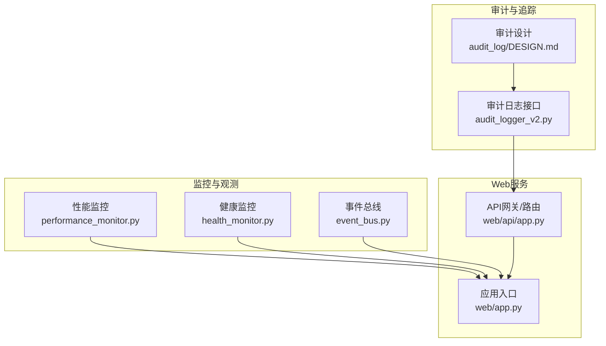
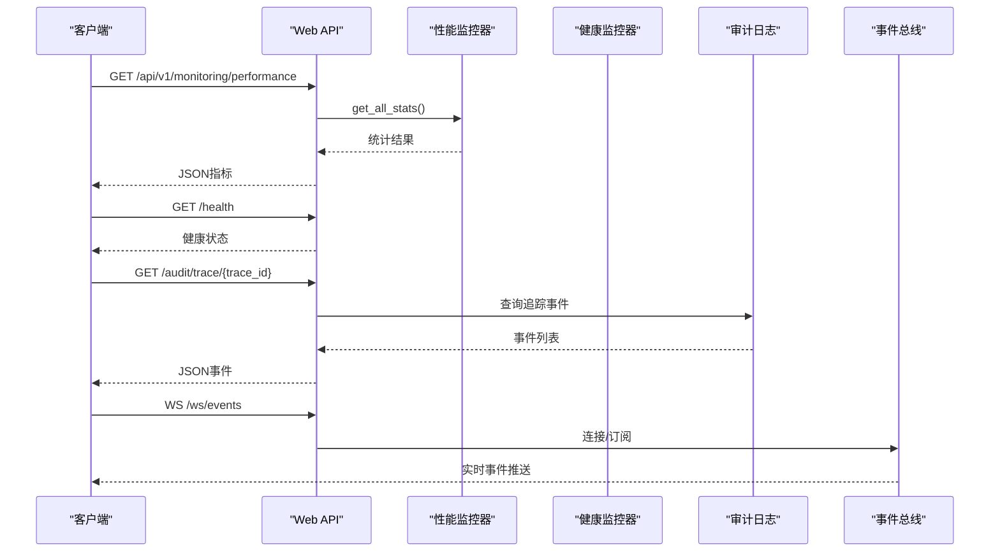
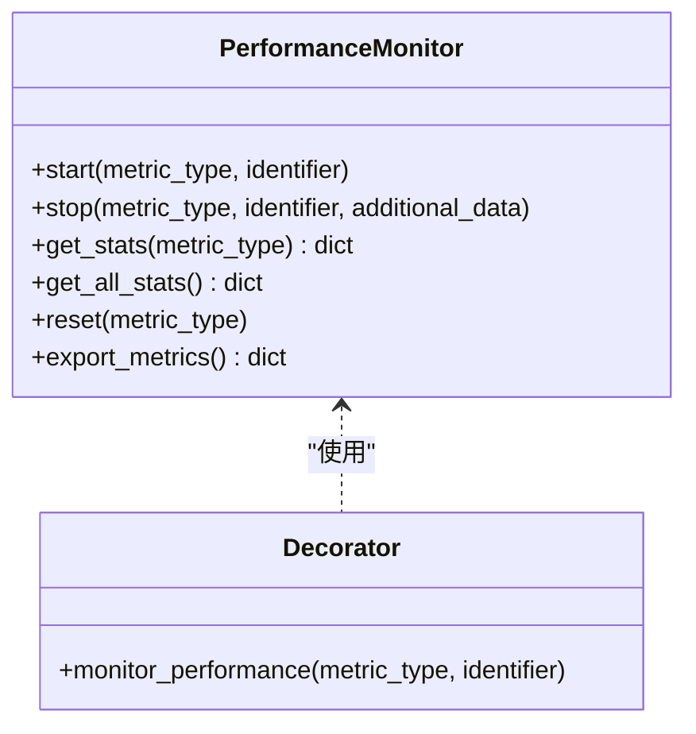
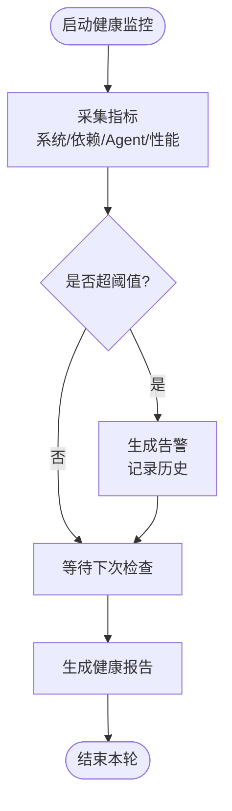
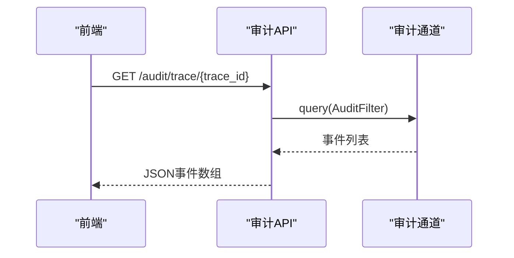
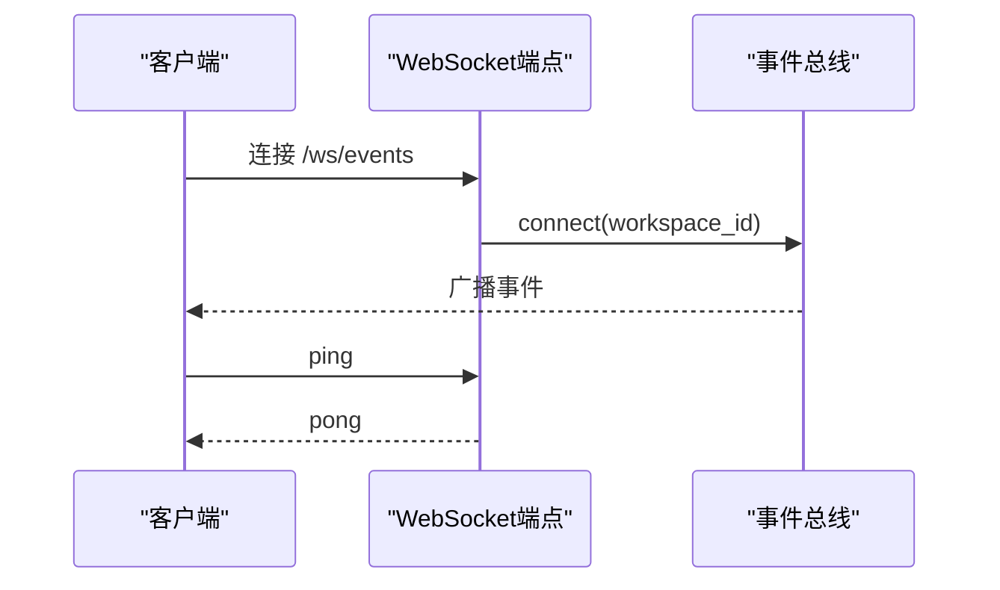
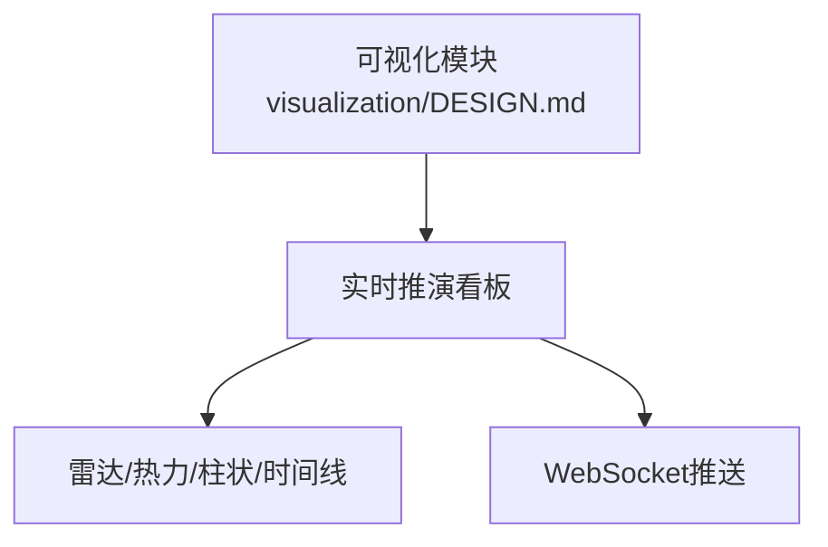
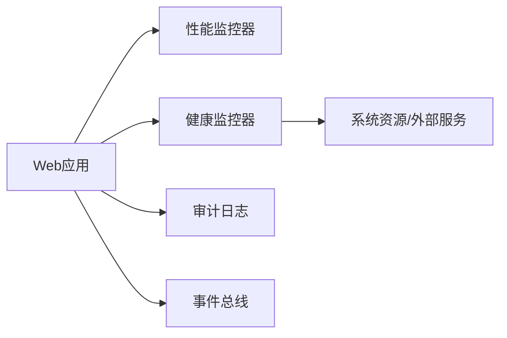

# 智能体监控API

<cite>
**本文档引用的文件**
- [odap/infra/monitoring/performance_monitor.py](file://odap/infra/monitoring/performance_monitor.py)
- [odap/infra/monitoring/__init__.py](file://odap/infra/monitoring/__init__.py)
- [odap/web/app.py](file://odap/web/app.py)
- [odap/infra/resilience/health_monitor.py](file://odap/infra/resilience/health_monitor.py)
- [docs/03-modules/swarm_orchestrator/DESIGN.md](file://docs/03-modules/swarm_orchestrator/DESIGN.md)
- [odap/web/ws/event_bus.py](file://odap/web/ws/event_bus.py)
- [odap/web/api/app.py](file://odap/web/api/app.py)
- [docs/03-modules/audit_log/DESIGN.md](file://docs/03-modules/audit_log/DESIGN.md)
- [odap/infra/security/unified_audit.py](file://odap/infra/security/unified_audit.py)
- [docs/02-architecture/ARCHITECTURE_OPS.md](file://docs/02-architecture/ARCHITECTURE_OPS.md)
- [docs/03-modules/visualization/DESIGN.md](file://docs/03-modules/visualization/DESIGN.md)
- [odap/biz/integration/frontend_compat/api/routes.py](file://odap/biz/integration/frontend_compat/api/routes.py)
- [docs/02-architecture/ARCHITECTURE_FULL_CHAIN_DEEP.md](file://docs/02-architecture/ARCHITECTURE_FULL_CHAIN_DEEP.md)
- [odap/infra/security/audit_logger_v2.py](file://odap/infra/security/audit_logger_v2.py)
- [odap/web/api/app.py](file://odap/web/api/app.py)
</cite>

## 目录
1. [简介](#简介)
2. [项目结构](#项目结构)
3. [核心组件](#核心组件)
4. [架构总览](#架构总览)
5. [详细组件分析](#详细组件分析)
6. [依赖分析](#依赖分析)
7. [性能考量](#性能考量)
8. [故障排查指南](#故障排查指南)
9. [结论](#结论)
10. [附录](#附录)

## 简介
本文件面向系统运维与监控开发者，系统化梳理智能体监控API的设计与实现，覆盖健康检查、性能指标、错误日志、状态查询、行为分析、告警通知、可视化与报表、以及监控数据的存储与查询优化策略。文档以代码为依据，结合架构设计与运维实践，提供端到端的监控能力使用指南。

## 项目结构
围绕监控主题，相关代码主要分布在以下模块：
- 性能监控：odap/infra/monitoring
- 健康监控：odap/infra/resilience
- Web API：odap/web
- 审计日志与追踪：odap/infra/security、docs/03-modules/audit_log
- 实时事件总线：odap/web/ws
- 前端兼容与可视化：docs/03-modules/visualization、odap/biz/integration/frontend_compat

**图表来源**
- [odap/infra/monitoring/performance_monitor.py:1-184](file://odap/infra/monitoring/performance_monitor.py#L1-L184)
- [odap/infra/resilience/health_monitor.py:1-216](file://odap/infra/resilience/health_monitor.py#L1-L216)
- [odap/web/ws/event_bus.py:1-147](file://odap/web/ws/event_bus.py#L1-L147)
- [odap/web/api/app.py:546-577](file://odap/web/api/app.py#L546-L577)
- [odap/web/app.py:244-261](file://odap/web/app.py#L244-L261)
- [odap/infra/security/audit_logger_v2.py:417-455](file://odap/infra/security/audit_logger_v2.py#L417-L455)
- [docs/03-modules/audit_log/DESIGN.md:274-320](file://docs/03-modules/audit_log/DESIGN.md#L274-L320)

**章节来源**
- [odap/infra/monitoring/performance_monitor.py:1-184](file://odap/infra/monitoring/performance_monitor.py#L1-L184)
- [odap/infra/resilience/health_monitor.py:1-216](file://odap/infra/resilience/health_monitor.py#L1-L216)
- [odap/web/ws/event_bus.py:1-147](file://odap/web/ws/event_bus.py#L1-L147)
- [odap/web/api/app.py:546-577](file://odap/web/api/app.py#L546-L577)
- [odap/web/app.py:244-261](file://odap/web/app.py#L244-L261)
- [odap/infra/security/audit_logger_v2.py:417-455](file://odap/infra/security/audit_logger_v2.py#L417-L455)
- [docs/03-modules/audit_log/DESIGN.md:274-320](file://docs/03-modules/audit_log/DESIGN.md#L274-L320)

## 核心组件
- 性能监控器：提供统一的性能指标采集、统计与导出能力，支持装饰器自动埋点。
- 健康监控器：周期性采集系统、Agent、外部依赖与性能指标，生成健康报告与告警。
- 事件总线：提供WebSocket事件广播与订阅，支撑实时状态与进度推送。
- 审计日志：提供统一审计通道与查询接口，支持追踪链与时序查询。
- Web API：暴露健康检查、性能指标查询、审计追踪等REST端点。

**章节来源**
- [odap/infra/monitoring/performance_monitor.py:12-184](file://odap/infra/monitoring/performance_monitor.py#L12-L184)
- [odap/infra/resilience/health_monitor.py:28-216](file://odap/infra/resilience/health_monitor.py#L28-L216)
- [odap/web/ws/event_bus.py:13-147](file://odap/web/ws/event_bus.py#L13-L147)
- [odap/infra/security/unified_audit.py:342-374](file://odap/infra/security/unified_audit.py#L342-L374)
- [odap/web/api/app.py:546-577](file://odap/web/api/app.py#L546-L577)

## 架构总览
监控API通过Web服务统一对外提供，内部以模块化组件协同工作：性能监控器负责指标采集与统计；健康监控器负责系统与组件健康评估；事件总线负责实时事件推送；审计日志提供可追溯的事件记录与查询。

**图表来源**
- [odap/web/app.py:244-261](file://odap/web/app.py#L244-L261)
- [odap/web/api/app.py:546-577](file://odap/web/api/app.py#L546-L577)
- [odap/infra/security/unified_audit.py:342-374](file://odap/infra/security/unified_audit.py#L342-L374)
- [odap/web/ws/event_bus.py:21-68](file://odap/web/ws/event_bus.py#L21-L68)

## 详细组件分析

### 性能监控API
- 端点
  - GET /api/v1/monitoring/performance：返回各类指标的统计摘要（均值、中位数、最小/最大、P95/P99）。
  - POST /api/v1/monitoring/performance/reset：重置性能指标缓存。
- 指标类型
  - LLM调用、数据库查询、API请求、工具执行等四类指标队列，支持按标识符细分。
- 统计方法
  - 基于滑动窗口（deque）维护历史记录，计算常用统计量；支持导出原始记录。
- 装饰器埋点
  - 提供 monitor_performance 装饰器，自动记录函数执行耗时与附加信息，支持同步/异步函数。

**图表来源**
- [odap/infra/monitoring/performance_monitor.py:12-184](file://odap/infra/monitoring/performance_monitor.py#L12-L184)

**章节来源**
- [odap/web/app.py:244-261](file://odap/web/app.py#L244-L261)
- [odap/infra/monitoring/performance_monitor.py:12-184](file://odap/infra/monitoring/performance_monitor.py#L12-L184)
- [odap/infra/monitoring/__init__.py:6-16](file://odap/infra/monitoring/__init__.py#L6-L16)

### 健康检查与监控API
- 健康检查端点
  - GET /health：基础健康检查。
  - GET /health/ready：就绪探针，检查依赖服务可用性。
  - GET /health/live：存活探针。
- 健康监控器
  - 周期性采集系统资源、外部依赖、Agent状态与性能指标，记录阈值与告警。
  - 提供健康报告与最近指标查询接口。
- 告警机制
  - 基于阈值触发告警，支持分级（warning/critical），并记录最近告警历史。

**图表来源**
- [docs/02-architecture/ARCHITECTURE_OPS.md:482-508](file://docs/02-architecture/ARCHITECTURE_OPS.md#L482-L508)
- [odap/infra/resilience/health_monitor.py:46-197](file://odap/infra/resilience/health_monitor.py#L46-L197)
- [docs/03-modules/swarm_orchestrator/DESIGN.md:783-1357](file://docs/03-modules/swarm_orchestrator/DESIGN.md#L783-L1357)

**章节来源**
- [odap/web/api/app.py:546-577](file://odap/web/api/app.py#L546-L577)
- [docs/02-architecture/ARCHITECTURE_OPS.md:482-508](file://docs/02-architecture/ARCHITECTURE_OPS.md#L482-L508)
- [odap/infra/resilience/health_monitor.py:28-216](file://odap/infra/resilience/health_monitor.py#L28-L216)
- [docs/03-modules/swarm_orchestrator/DESIGN.md:783-1357](file://docs/03-modules/swarm_orchestrator/DESIGN.md#L783-L1357)

### 审计日志与状态追踪API
- 追踪链查询
  - GET /audit/trace/{trace_id}：按trace_id获取事件序列，按时间升序返回。
- 审计日志接口
  - 提供统一审计记录与查询接口，支持按用户、服务、动作过滤。
- 设计与实现
  - 审计通道抽象与SQLite/文件/Graphiti适配器设计，支持防篡改链式校验与时间线查询。

**图表来源**
- [odap/biz/integration/frontend_compat/api/routes.py:492-520](file://odap/biz/integration/frontend_compat/api/routes.py#L492-L520)
- [odap/infra/security/unified_audit.py:342-374](file://odap/infra/security/unified_audit.py#L342-L374)
- [docs/03-modules/audit_log/DESIGN.md:274-320](file://docs/03-modules/audit_log/DESIGN.md#L274-L320)

**章节来源**
- [odap/biz/integration/frontend_compat/api/routes.py:492-520](file://odap/biz/integration/frontend_compat/api/routes.py#L492-L520)
- [odap/infra/security/unified_audit.py:342-374](file://odap/infra/security/unified_audit.py#L342-L374)
- [docs/03-modules/audit_log/DESIGN.md:274-320](file://docs/03-modules/audit_log/DESIGN.md#L274-L320)

### 实时事件推送与状态变更通知
- WebSocket事件总线
  - 支持按工作空间订阅，广播实体变更、情报更新、行动结果、进度、OPA检查、审计事件等。
  - 提供连接管理、心跳与历史事件缓存。
- 推送场景
  - 本体更新、摄入进度、推理过程、系统事件等。

**图表来源**
- [odap/web/ws/event_bus.py:21-68](file://odap/web/ws/event_bus.py#L21-L68)
- [odap/web/api/app.py:808-832](file://odap/web/api/app.py#L808-L832)
- [docs/02-architecture/ARCHITECTURE_FULL_CHAIN_DEEP.md:1167-1236](file://docs/02-architecture/ARCHITECTURE_FULL_CHAIN_DEEP.md#L1167-L1236)

**章节来源**
- [odap/web/ws/event_bus.py:13-147](file://odap/web/ws/event_bus.py#L13-L147)
- [odap/web/api/app.py:808-832](file://odap/web/api/app.py#L808-L832)
- [docs/02-architecture/ARCHITECTURE_FULL_CHAIN_DEEP.md:1167-1236](file://docs/02-architecture/ARCHITECTURE_FULL_CHAIN_DEEP.md#L1167-L1236)

### 可视化与报表
- 可视化模块
  - 支持领域态势、关系图谱、时间线、图表等可视化类型，提供HTML模板与交互式仪表板。
- 实时推演看板
  - 提供方案对比、参数敏感性、What-if分析、版本时间线、性能看板与实时推演面板，并通过WebSocket推送更新。

**图表来源**
- [docs/03-modules/visualization/DESIGN.md:250-851](file://docs/03-modules/visualization/DESIGN.md#L250-L851)

**章节来源**
- [docs/03-modules/visualization/DESIGN.md:1-851](file://docs/03-modules/visualization/DESIGN.md#L1-L851)

## 依赖分析
- 组件耦合
  - Web应用通过API路由聚合监控与审计能力；性能监控器与健康监控器相对独立，分别服务于不同观测维度。
  - 事件总线为实时推送提供基础设施，被多种事件类型复用。
  - 审计日志通过统一接口与通道抽象解耦存储实现。
- 外部依赖
  - 健康监控器依赖系统资源库与外部服务健康检查接口。
  - WebSocket依赖FastAPI WebSocket会话与事件总线。

**图表来源**
- [odap/web/app.py:244-261](file://odap/web/app.py#L244-L261)
- [odap/infra/resilience/health_monitor.py:78-128](file://odap/infra/resilience/health_monitor.py#L78-L128)
- [odap/web/ws/event_bus.py:13-68](file://odap/web/ws/event_bus.py#L13-L68)
- [odap/infra/security/audit_logger_v2.py:417-455](file://odap/infra/security/audit_logger_v2.py#L417-L455)

**章节来源**
- [odap/web/app.py:244-261](file://odap/web/app.py#L244-L261)
- [odap/infra/resilience/health_monitor.py:78-128](file://odap/infra/resilience/health_monitor.py#L78-L128)
- [odap/web/ws/event_bus.py:13-68](file://odap/web/ws/event_bus.py#L13-L68)
- [odap/infra/security/audit_logger_v2.py:417-455](file://odap/infra/security/audit_logger_v2.py#L417-L455)

## 性能考量
- 指标采集
  - 性能监控器使用固定大小的滑动窗口，避免内存无限增长；统计计算为O(n)，适合高频采集。
- 健康监控
  - 周期性轮询，避免阻塞主线程；异常捕获与短间隔退避，保证稳定性。
- 实时推送
  - 事件总线对断连进行清理与去重，限制历史事件数量，降低内存压力。
- 存储与查询
  - 审计日志采用异步通道+批量落盘，SQLite WAL模式提升并发；索引覆盖常用过滤字段（时间、工作空间、用户、事件类型）。

[本节为通用性能建议，无需特定文件引用]

## 故障排查指南
- 健康检查失败
  - 使用就绪探针检查依赖服务（如Neo4j、OPA、Postgres）连通性；若全部就绪返回200，否则返回503。
- 告警与阈值
  - 查看健康监控器最近告警列表与健康报告，确认指标阈值与当前状态。
- 审计追踪
  - 使用审计追踪端点按trace_id回溯事件序列；若查询异常，检查审计通道实现与数据库连接。
- 实时事件
  - 若WebSocket断连，检查心跳与重连逻辑；确认事件总线订阅与广播流程。

**章节来源**
- [docs/02-architecture/ARCHITECTURE_OPS.md:482-508](file://docs/02-architecture/ARCHITECTURE_OPS.md#L482-L508)
- [odap/infra/resilience/health_monitor.py:157-173](file://odap/infra/resilience/health_monitor.py#L157-L173)
- [odap/biz/integration/frontend_compat/api/routes.py:492-520](file://odap/biz/integration/frontend_compat/api/routes.py#L492-L520)
- [odap/web/ws/event_bus.py:114-129](file://odap/web/ws/event_bus.py#L114-L129)

## 结论
本监控API体系以模块化组件为核心，覆盖性能、健康、审计、实时事件与可视化等关键观测维度。通过统一的Web接口与事件总线，实现从指标采集到实时推送再到可追溯审计的完整闭环。运维与开发者可据此快速接入与扩展监控能力，保障智能体系统的可观测性与可运维性。

[本节为总结性内容，无需特定文件引用]

## 附录

### API清单与说明
- 性能监控
  - GET /api/v1/monitoring/performance：获取性能指标统计。
  - POST /api/v1/monitoring/performance/reset：重置性能指标。
- 健康检查
  - GET /health：基础健康。
  - GET /health/ready：就绪检查。
  - GET /health/live：存活检查。
- 审计追踪
  - GET /audit/trace/{trace_id}：按trace_id获取事件序列。
- 实时事件
  - WS /ws/events：连接事件总线，订阅实时事件。

**章节来源**
- [odap/web/app.py:244-261](file://odap/web/app.py#L244-L261)
- [odap/web/api/app.py:546-577](file://odap/web/api/app.py#L546-L577)
- [odap/biz/integration/frontend_compat/api/routes.py:492-520](file://odap/biz/integration/frontend_compat/api/routes.py#L492-L520)
- [odap/web/api/app.py:808-832](file://odap/web/api/app.py#L808-L832)