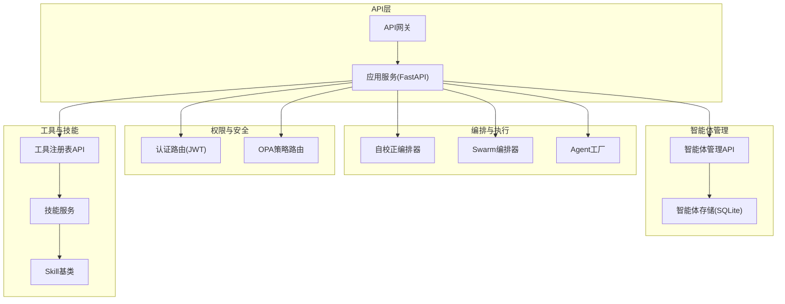
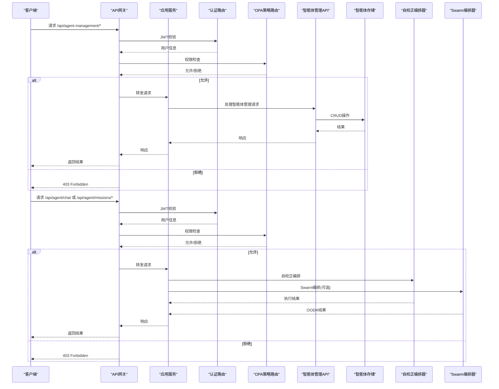
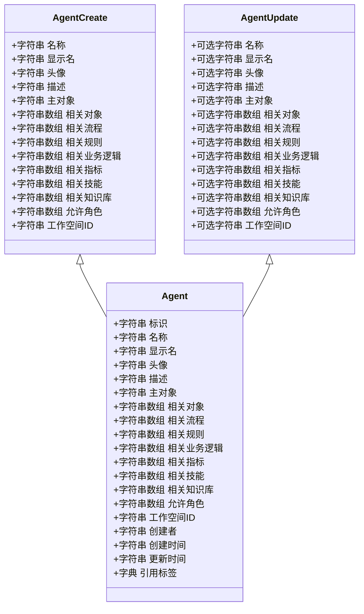
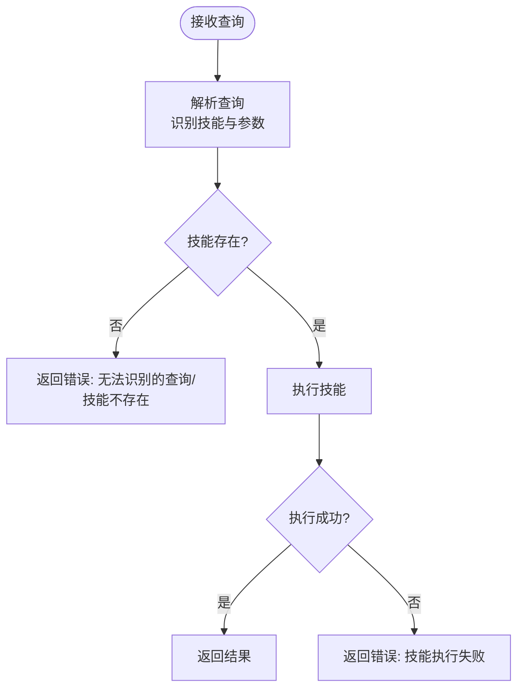
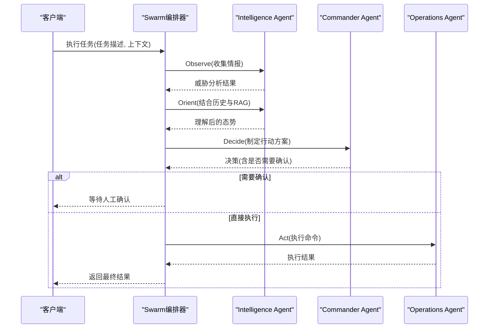
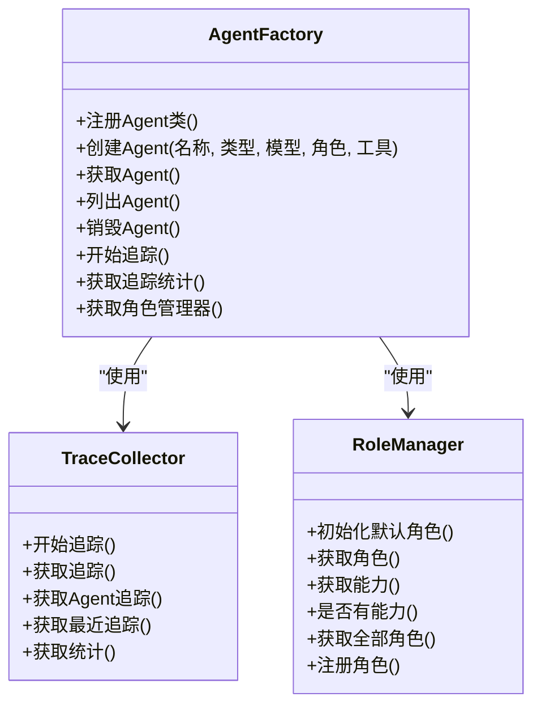
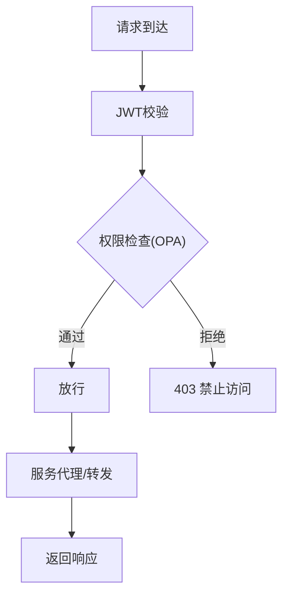
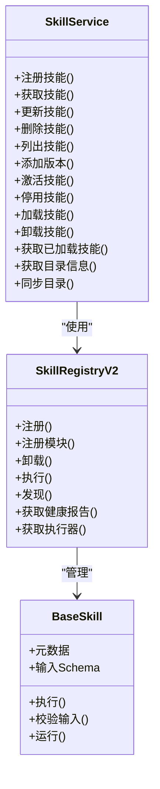
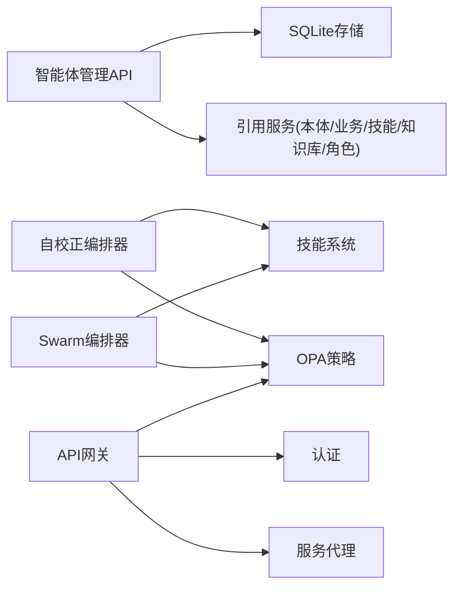

# 智能体管理API

<cite>
**本文档引用的文件**
- [odap/biz/core/agent/orchestrator.py](file://odap/biz/core/agent/orchestrator.py)
- [odap/biz/core/agent/swarm_orchestrator.py](file://odap/biz/core/agent/swarm_orchestrator.py)
- [odap/biz/core/agent/agent_factory.py](file://odap/biz/core/agent/agent_factory.py)
- [odap/biz/management/agent_management/api/routes.py](file://odap/biz/management/agent_management/api/routes.py)
- [odap/biz/management/agent_management/api/schemas.py](file://odap/biz/management/agent_management/api/schemas.py)
- [odap/biz/management/agent_management/storage/sqlite_agent_storage.py](file://odap/biz/management/agent_management/storage/sqlite_agent_storage.py)
- [odap/web/gateway/api_gateway.py](file://odap/web/gateway/api_gateway.py)
- [odap/web/api/app.py](file://odap/web/api/app.py)
- [odap/infra/security/auth_routes.py](file://odap/infra/security/auth_routes.py)
- [odap/infra/opa/routes.py](file://odap/infra/opa/routes.py)
- [odap/biz/platform/tool_registry/api/routes.py](file://odap/biz/platform/tool_registry/api/routes.py)
- [odap/tools/base.py](file://odap/tools/base.py)
- [odap/biz/platform/skill_system/services/skill_service.py](file://odap/biz/platform/skill_system/services/skill_service.py)
- [config/agent_config.yaml](file://config/agent_config.yaml)
</cite>

## 目录
1. [简介](#简介)
2. [项目结构](#项目结构)
3. [核心组件](#核心组件)
4. [架构总览](#架构总览)
5. [详细组件分析](#详细组件分析)
6. [依赖分析](#依赖分析)
7. [性能考虑](#性能考虑)
8. [故障排查指南](#故障排查指南)
9. [结论](#结论)
10. [附录](#附录)

## 简介
本文件面向智能体管理API的技术文档，覆盖智能体的全生命周期管理（创建、配置、启动、停止、删除）、Agent编排器（含自校正编排器与Swarm编排器）的API接口、智能体管理服务的REST API（CRUD、批量管理、状态查询）、配置模板与参数校验规则、以及错误处理、权限控制与并发访问等安全机制。文档同时提供面向智能体管理员与系统集成者的使用指南与最佳实践。

## 项目结构
本项目围绕“智能体管理”“编排与执行”“权限与安全”“工具与技能”“网关与路由”等模块组织，形成前后端分离、模块化清晰的架构。关键模块如下：
- 智能体管理API：提供智能体的CRUD、引用选项、批量查询等REST接口
- Agent编排器：自校正编排器与Swarm编排器，支持多Agent协作与OODA循环
- 权限与安全：基于JWT的认证、OPA策略引擎、API网关限流与鉴权
- 工具与技能：技能注册、发现、执行与链式编排
- 网关与路由：统一入口、路由转发、指标采集与连接管理

**图表来源**
- [odap/web/gateway/api_gateway.py:360-494](file://odap/web/gateway/api_gateway.py#L360-L494)
- [odap/web/api/app.py:300-800](file://odap/web/api/app.py#L300-L800)
- [odap/biz/management/agent_management/api/routes.py:1-270](file://odap/biz/management/agent_management/api/routes.py#L1-L270)
- [odap/biz/core/agent/orchestrator.py:1-151](file://odap/biz/core/agent/orchestrator.py#L1-L151)
- [odap/biz/core/agent/swarm_orchestrator.py:288-687](file://odap/biz/core/agent/swarm_orchestrator.py#L288-L687)
- [odap/biz/core/agent/agent_factory.py:340-442](file://odap/biz/core/agent/agent_factory.py#L340-L442)
- [odap/infra/security/auth_routes.py:1-143](file://odap/infra/security/auth_routes.py#L1-L143)
- [odap/infra/opa/routes.py:1-422](file://odap/infra/opa/routes.py#L1-L422)
- [odap/biz/platform/tool_registry/api/routes.py:1-310](file://odap/biz/platform/tool_registry/api/routes.py#L1-L310)
- [odap/biz/platform/skill_system/services/skill_service.py:1-184](file://odap/biz/platform/skill_system/services/skill_service.py#L1-L184)
- [odap/tools/base.py:1-720](file://odap/tools/base.py#L1-L720)

**章节来源**
- [odap/web/gateway/api_gateway.py:360-494](file://odap/web/gateway/api_gateway.py#L360-L494)
- [odap/web/api/app.py:300-800](file://odap/web/api/app.py#L300-L800)

## 核心组件
- 智能体管理API：提供智能体的创建、查询、更新、删除、引用选项查询等REST接口；支持按角色与工作空间过滤；返回智能体的引用标签映射。
- Agent编排器：
  - 自校正编排器：根据用户查询解析技能并执行，内置权限拦截与错误处理。
  - Swarm编排器：基于OODA循环的多Agent协作（Commander/Intelligence/Operations），支持流式进度返回、检查点持久化、健康监控与Graphiti写入。
- Agent工厂：统一管理Agent生命周期、追踪与角色能力，提供追踪收集器与角色管理器。
- 权限与安全：JWT认证、刷新与注销；OPA策略引擎；API网关限流与权限桥接。
- 工具与技能：技能注册、发现、执行与链式编排；技能基类提供输入输出标准化与OPA权限校验。
- 网关与路由：统一入口、路由转发、指标采集与连接管理。

**章节来源**
- [odap/biz/management/agent_management/api/routes.py:1-270](file://odap/biz/management/agent_management/api/routes.py#L1-L270)
- [odap/biz/core/agent/orchestrator.py:1-151](file://odap/biz/core/agent/orchestrator.py#L1-L151)
- [odap/biz/core/agent/swarm_orchestrator.py:288-687](file://odap/biz/core/agent/swarm_orchestrator.py#L288-L687)
- [odap/biz/core/agent/agent_factory.py:340-442](file://odap/biz/core/agent/agent_factory.py#L340-L442)
- [odap/infra/security/auth_routes.py:1-143](file://odap/infra/security/auth_routes.py#L1-L143)
- [odap/infra/opa/routes.py:1-422](file://odap/infra/opa/routes.py#L1-L422)
- [odap/biz/platform/tool_registry/api/routes.py:1-310](file://odap/biz/platform/tool_registry/api/routes.py#L1-L310)
- [odap/tools/base.py:1-720](file://odap/tools/base.py#L1-L720)

## 架构总览
下图展示智能体管理API与编排器、权限与安全、工具与技能之间的交互关系：

**图表来源**
- [odap/web/gateway/api_gateway.py:435-477](file://odap/web/gateway/api_gateway.py#L435-L477)
- [odap/infra/security/auth_routes.py:40-80](file://odap/infra/security/auth_routes.py#L40-L80)
- [odap/infra/opa/routes.py:110-182](file://odap/infra/opa/routes.py#L110-L182)
- [odap/biz/management/agent_management/api/routes.py:143-270](file://odap/biz/management/agent_management/api/routes.py#L143-L270)
- [odap/biz/core/agent/orchestrator.py:33-62](file://odap/biz/core/agent/orchestrator.py#L33-L62)
- [odap/biz/core/agent/swarm_orchestrator.py:379-456](file://odap/biz/core/agent/swarm_orchestrator.py#L379-L456)

## 详细组件分析

### 智能体管理API
- 接口概览
  - GET /api/agent-management：列出智能体，支持按角色ID与工作空间ID过滤，并返回引用标签映射
  - GET /api/agent-management/ref-options：按类型返回引用选项（实体、业务逻辑、指标、技能、知识库、角色）
  - GET /api/agent-management/{agent_id}：获取智能体详情，返回引用标签映射
  - POST /api/agent-management：创建智能体
  - PUT /api/agent-management/{agent_id}：更新智能体
  - DELETE /api/agent-management/{agent_id}：删除智能体
- 参数与校验
  - 智能体创建/更新模型包含名称、显示名、头像、描述、主对象、相关对象、相关流程、相关规则、相关业务逻辑、相关指标、相关技能、相关知识库、允许角色、工作空间ID等字段，均具备长度与类型约束
- 存储与引用标签
  - 使用SQLite存储智能体元数据，支持JSON字段存储多值引用
  - 引用标签通过聚合多个服务的列表结果生成，便于前端展示

**图表来源**
- [odap/biz/management/agent_management/api/schemas.py:5-59](file://odap/biz/management/agent_management/api/schemas.py#L5-L59)

**章节来源**
- [odap/biz/management/agent_management/api/routes.py:1-270](file://odap/biz/management/agent_management/api/routes.py#L1-L270)
- [odap/biz/management/agent_management/api/schemas.py:1-59](file://odap/biz/management/agent_management/api/schemas.py#L1-L59)
- [odap/biz/management/agent_management/storage/sqlite_agent_storage.py:1-246](file://odap/biz/management/agent_management/storage/sqlite_agent_storage.py#L1-L246)

### 自校正编排器
- 功能概述
  - 解析用户查询，识别所需技能与参数
  - 校验技能存在性与权限
  - 执行技能并返回结果，包含错误处理
- 查询解析规则
  - 基于关键词匹配（雷达、领域分析、打击、力量对比、攻击、指挥/命令等），提取区域、目标类型、目标ID、单位ID等参数
- 权限拦截
  - 不同角色对某些操作具有拦截策略（例如飞行员攻击医院、指挥官攻击医院等）

**图表来源**
- [odap/biz/core/agent/orchestrator.py:33-62](file://odap/biz/core/agent/orchestrator.py#L33-L62)

**章节来源**
- [odap/biz/core/agent/orchestrator.py:1-151](file://odap/biz/core/agent/orchestrator.py#L1-L151)

### Swarm编排器与OODA循环
- OODA阶段
  - Observe（感知）：情报收集与威胁分析
  - Orient（理解）：结合历史上下文与RAG进行态势理解
  - Decide（决策）：生成行动方案与是否需要确认
  - Act（行动）：执行命令并返回结果
- 多Agent协作
  - Intelligence Agent：收集情报与威胁分析
  - Commander Agent：制定决策方案
  - Operations Agent：执行命令并支持人工确认
- 流式进度
  - 提供流式返回每个阶段的进度与状态
- 持久化与监控
  - 检查点保存、健康报告、故障汇总、任务历史

**图表来源**
- [odap/biz/core/agent/swarm_orchestrator.py:379-613](file://odap/biz/core/agent/swarm_orchestrator.py#L379-L613)

**章节来源**
- [odap/biz/core/agent/swarm_orchestrator.py:288-687](file://odap/biz/core/agent/swarm_orchestrator.py#L288-L687)

### Agent工厂与追踪
- Agent工厂
  - 注册与创建Agent实例，维护实例与配置映射
  - 提供Agent列表、销毁与角色解析
- 追踪与统计
  - 追踪跨度与完整执行追踪，支持统计与最近追踪查询
  - 角色能力管理，支持优先级与审批需求

**图表来源**
- [odap/biz/core/agent/agent_factory.py:340-442](file://odap/biz/core/agent/agent_factory.py#L340-L442)

**章节来源**
- [odap/biz/core/agent/agent_factory.py:1-442](file://odap/biz/core/agent/agent_factory.py#L1-L442)

### 权限控制与安全
- 认证
  - 登录、刷新、注销、获取当前用户信息
  - JWT载荷包含用户ID、用户名、角色、工作空间等
- 权限
  - API网关支持基于路由的权限检查，结合OPA策略
  - 支持按用户或IP限流
- OPA策略
  - 提供策略的增删改查、启用/禁用、Markdown到Rego转换
  - 默认策略示例：访问控制、数据隐私、合规审计

**图表来源**
- [odap/web/gateway/api_gateway.py:435-477](file://odap/web/gateway/api_gateway.py#L435-L477)
- [odap/infra/security/auth_routes.py:40-80](file://odap/infra/security/auth_routes.py#L40-L80)
- [odap/infra/opa/routes.py:110-182](file://odap/infra/opa/routes.py#L110-L182)

**章节来源**
- [odap/infra/security/auth_routes.py:1-143](file://odap/infra/security/auth_routes.py#L1-L143)
- [odap/web/gateway/api_gateway.py:175-246](file://odap/web/gateway/api_gateway.py#L175-L246)
- [odap/infra/opa/routes.py:1-422](file://odap/infra/opa/routes.py#L1-L422)

### 工具与技能系统
- 工具注册表API
  - 注册工具（技能/REST/函数）、发现工具、执行工具、注册与执行工具链、健康报告、执行历史
- 技能服务
  - 技能的注册、查询、更新、删除、版本管理、激活/停用、加载/卸载、目录同步
- 技能基类
  - 标准化输入输出、元数据、OPA权限校验、热插拔与健康监控、执行器与重试机制

**图表来源**
- [odap/biz/platform/skill_system/services/skill_service.py:1-184](file://odap/biz/platform/skill_system/services/skill_service.py#L1-L184)
- [odap/tools/base.py:458-720](file://odap/tools/base.py#L458-L720)

**章节来源**
- [odap/biz/platform/tool_registry/api/routes.py:1-310](file://odap/biz/platform/tool_registry/api/routes.py#L1-L310)
- [odap/biz/platform/skill_system/services/skill_service.py:1-184](file://odap/biz/platform/skill_system/services/skill_service.py#L1-L184)
- [odap/tools/base.py:1-720](file://odap/tools/base.py#L1-L720)

## 依赖分析
- 模块耦合
  - 智能体管理API依赖SQLite存储与引用服务（本体对象、业务流程、规则、逻辑、指标、技能、知识库、角色）
  - 编排器依赖技能系统与OPA策略，支持权限拦截与危险操作确认
  - API网关贯穿认证、权限、限流与服务代理
- 外部依赖
  - FastAPI/uvicorn用于Web服务
  - httpx用于服务代理
  - jwt用于认证
  - sqlite3用于本地存储

**图表来源**
- [odap/biz/management/agent_management/api/routes.py:11-108](file://odap/biz/management/agent_management/api/routes.py#L11-L108)
- [odap/biz/core/agent/orchestrator.py:13-30](file://odap/biz/core/agent/orchestrator.py#L13-L30)
- [odap/biz/core/agent/swarm_orchestrator.py:294-306](file://odap/biz/core/agent/swarm_orchestrator.py#L294-L306)
- [odap/web/gateway/api_gateway.py:360-424](file://odap/web/gateway/api_gateway.py#L360-L424)

**章节来源**
- [odap/biz/management/agent_management/storage/sqlite_agent_storage.py:1-246](file://odap/biz/management/agent_management/storage/sqlite_agent_storage.py#L1-L246)
- [odap/biz/management/agent_management/api/routes.py:11-108](file://odap/biz/management/agent_management/api/routes.py#L11-L108)

## 性能考虑
- 并发与限流
  - API网关支持令牌桶限流，可按用户或IP维度配置
  - 连接管理器支持WebSocket广播与活跃连接统计
- 指标采集
  - 网关记录请求总量、成功率、平均延迟等指标
- 编排器优化
  - Swarm编排器支持异步执行与检查点持久化，减少中断损失
  - 技能执行器支持重试与健康监控，提升稳定性

**章节来源**
- [odap/web/gateway/api_gateway.py:175-216](file://odap/web/gateway/api_gateway.py#L175-L216)
- [odap/web/gateway/api_gateway.py:326-358](file://odap/web/gateway/api_gateway.py#L326-L358)
- [odap/biz/core/agent/swarm_orchestrator.py:458-567](file://odap/biz/core/agent/swarm_orchestrator.py#L458-L567)

## 故障排查指南
- 认证与权限
  - 登录失败：检查用户名/密码与JWT密钥配置
  - 403权限不足：检查OPA策略与用户角色
- 智能体管理
  - 创建/更新失败：检查字段长度与类型约束
  - 删除失败：确认智能体ID是否存在
- 编排器
  - 技能执行失败：检查技能是否存在、参数是否正确、权限是否满足
  - OODA循环卡住：检查Graphiti写入与健康监控状态
- 工具与技能
  - 技能未找到：检查技能注册与版本激活
  - 执行超时：调整重试次数与延迟

**章节来源**
- [odap/infra/security/auth_routes.py:40-80](file://odap/infra/security/auth_routes.py#L40-L80)
- [odap/infra/opa/routes.py:137-240](file://odap/infra/opa/routes.py#L137-L240)
- [odap/biz/management/agent_management/api/routes.py:229-270](file://odap/biz/management/agent_management/api/routes.py#L229-L270)
- [odap/biz/core/agent/orchestrator.py:55-62](file://odap/biz/core/agent/orchestrator.py#L55-L62)
- [odap/biz/core/agent/swarm_orchestrator.py:632-654](file://odap/biz/core/agent/swarm_orchestrator.py#L632-L654)
- [odap/biz/platform/tool_registry/api/routes.py:159-178](file://odap/biz/platform/tool_registry/api/routes.py#L159-L178)
- [odap/tools/base.py:458-566](file://odap/tools/base.py#L458-L566)

## 结论
本智能体管理API提供了从创建、配置到编排执行的完整能力，结合权限控制、限流与监控，能够支撑复杂场景下的智能体生命周期管理。建议在生产环境中：
- 明确角色与权限边界，启用OPA策略
- 使用Swarm编排器进行多Agent协作与可视化进度
- 通过工具与技能系统实现能力复用与扩展
- 建立完善的日志与追踪体系，配合健康监控与故障恢复

## 附录
- 配置模板
  - 智能体配置模板：包含名称、显示名、头像、描述、主对象、相关对象/流程/规则/业务逻辑/指标/技能/知识库、允许角色、工作空间ID等字段
  - Agent Provider配置：默认提供者与各提供商的模型、温度、最大token等参数
- 最佳实践
  - 使用引用选项端点动态填充相关实体与规则
  - 对高危操作启用人工确认与审批
  - 通过流式接口实时反馈编排进度
  - 定期同步技能目录，保持能力一致性

**章节来源**
- [odap/biz/management/agent_management/api/schemas.py:5-59](file://odap/biz/management/agent_management/api/schemas.py#L5-L59)
- [config/agent_config.yaml:1-23](file://config/agent_config.yaml#L1-L23)