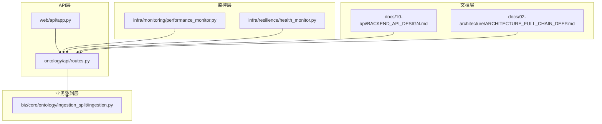
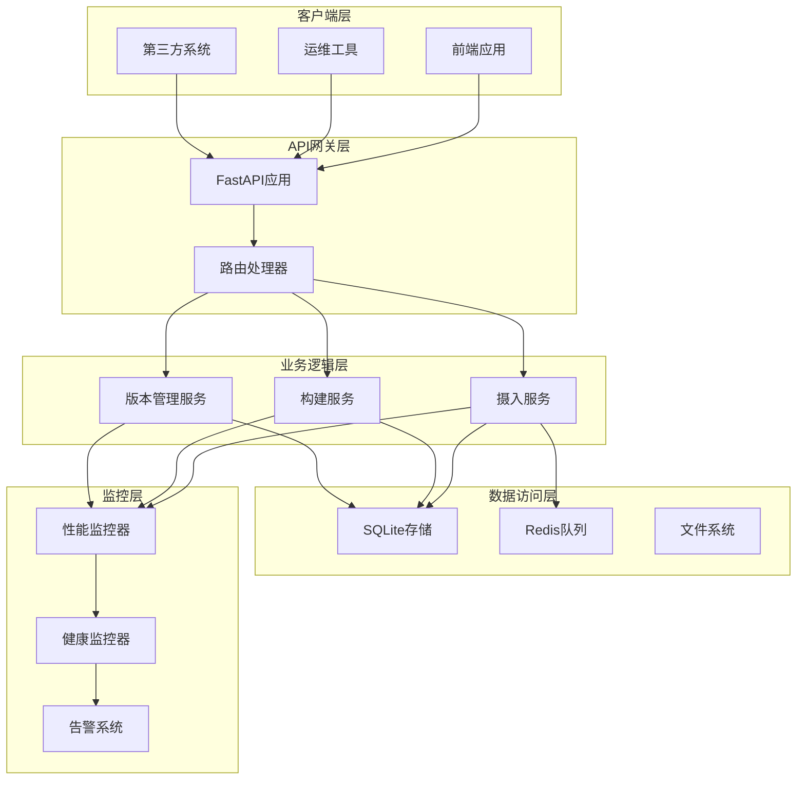
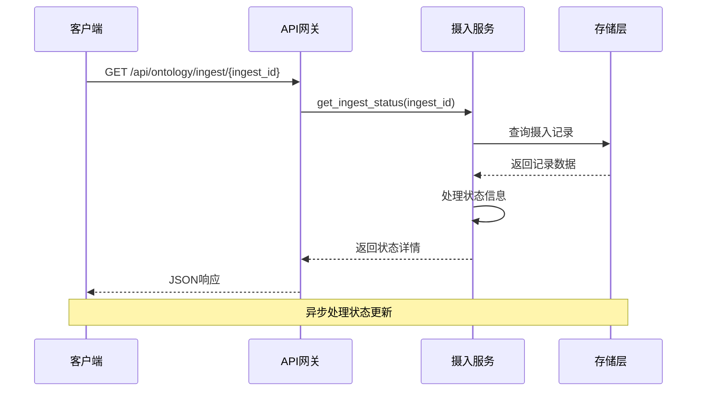
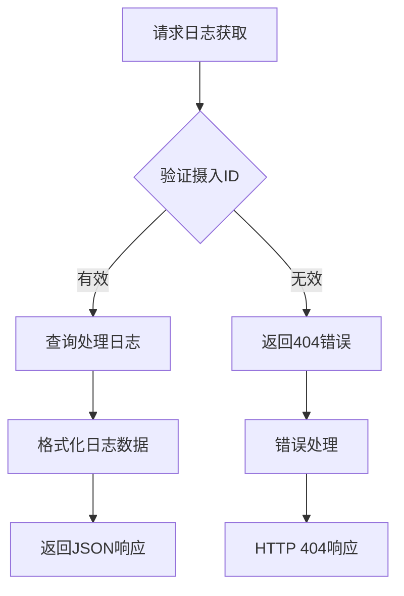
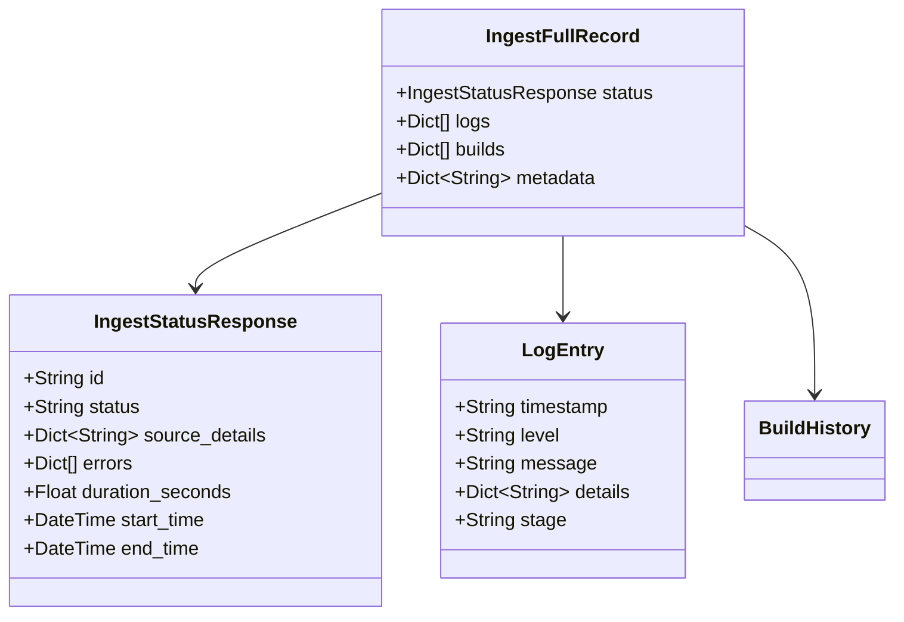
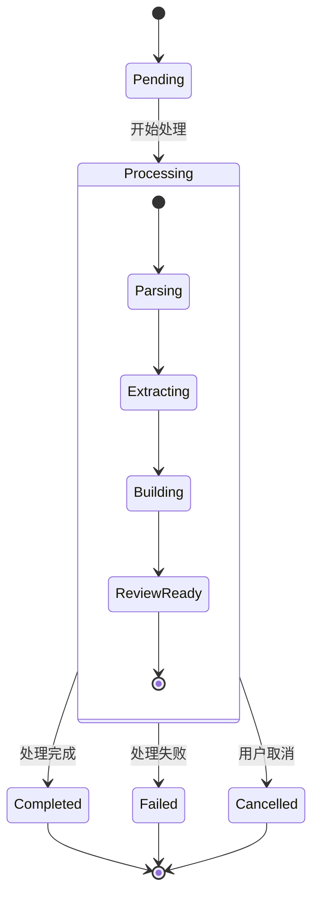
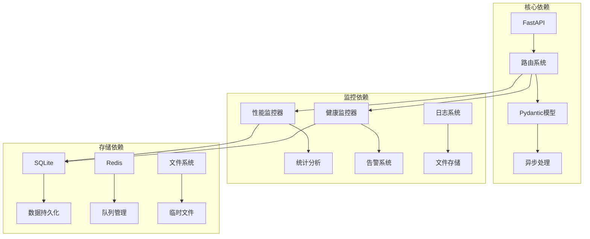
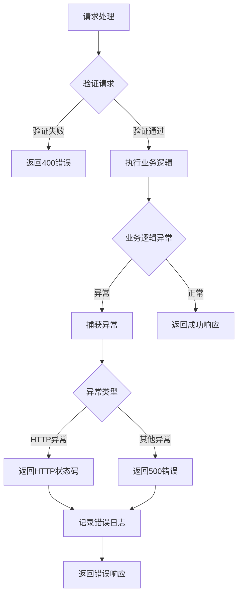

# 摄入状态监控API

<cite>
**本文档引用的文件**
- [odap/biz/core/ontology/api/routes.py](file://odap/biz/core/ontology/api/routes.py)
- [odap/web/api/app.py](file://odap/web/api/app.py)
- [odap/infra/monitoring/performance_monitor.py](file://odap/infra/monitoring/performance_monitor.py)
- [odap/infra/resilience/health_monitor.py](file://odap/infra/resilience/health_monitor.py)
- [odap/biz/core/ontology/ingestion_split/ingestion.py](file://odap/biz/core/ontology/ingestion_split/ingestion.py)
- [docs/10-api/BACKEND_API_DESIGN.md](file://docs/10-api/BACKEND_API_DESIGN.md)
- [docs/02-architecture/ARCHITECTURE_FULL_CHAIN_DEEP.md](file://docs/02-architecture/ARCHITECTURE_FULL_CHAIN_DEEP.md)
</cite>

## 目录
1. [简介](#简介)
2. [项目结构](#项目结构)
3. [核心组件](#核心组件)
4. [架构概览](#架构概览)
5. [详细组件分析](#详细组件分析)
6. [依赖关系分析](#依赖关系分析)
7. [性能考虑](#性能考虑)
8. [故障排除指南](#故障排除指南)
9. [结论](#结论)

## 简介

ODAP平台的摄入状态监控API是一套完整的数据摄入状态查询、日志获取和历史记录管理的RESTful API接口。该API为运维工程师和系统管理员提供了全面的摄入任务监控能力，包括实时状态查询、处理日志查看、完整记录查询、历史记录管理和错误处理等功能。

该API基于FastAPI框架构建，采用异步处理模式，支持高并发的摄入任务监控。系统集成了完善的监控指标收集、告警机制和性能分析功能，为平台的稳定运行提供了强有力的技术支撑。

## 项目结构

ODAP平台的摄入状态监控API主要分布在以下几个核心模块中：

**图表来源**
- [odap/biz/core/ontology/api/routes.py:1-527](file://odap/biz/core/ontology/api/routes.py#L1-L527)
- [odap/web/api/app.py:1-862](file://odap/web/api/app.py#L1-L862)

**章节来源**
- [odap/biz/core/ontology/api/routes.py:1-527](file://odap/biz/core/ontology/api/routes.py#L1-L527)
- [odap/web/api/app.py:1-862](file://odap/web/api/app.py#L1-L862)

## 核心组件

### API路由组件

系统提供了完整的摄入状态监控API，包括以下核心端点：

#### 基础摄入API
- `GET /api/ontology/ingest` - 获取摄入历史
- `GET /api/ontology/ingest/{ingest_id}` - 获取特定摄入状态
- `GET /api/ontology/ingest/{ingest_id}/logs` - 获取处理日志
- `GET /api/ontology/ingest/{ingest_id}/full` - 获取完整记录

#### 构建管理API
- `GET /api/ontology/ingest/builds` - 获取构建历史
- `GET /api/ontology/ingest/builds/{build_id}` - 获取构建状态
- `POST /api/ontology/ingest/{ingest_id}/build` - 运行构建管道

#### 版本管理API
- `GET /api/ontology/ingest/versions` - 获取版本列表
- `POST /api/ontology/ingest/versions/rollback` - 回滚到指定版本

**章节来源**
- [odap/biz/core/ontology/api/routes.py:371-420](file://odap/biz/core/ontology/api/routes.py#L371-L420)

### 性能监控组件

系统内置了高性能的性能监控器，能够实时收集和分析各类性能指标：

#### 性能监控器功能
- 支持LLM调用、数据库查询、API请求、工具执行等多维度监控
- 提供统计分析功能，包括平均值、中位数、百分位数等
- 支持异步和同步函数的性能监控装饰器
- 可配置的历史记录上限和指标导出功能

#### 健康监控组件
- 实时监控系统健康状态
- 支持组件级别的健康检查
- 提供告警机制和健康报告生成功能

**章节来源**
- [odap/infra/monitoring/performance_monitor.py:1-184](file://odap/infra/monitoring/performance_monitor.py#L1-L184)
- [odap/infra/resilience/health_monitor.py:149-190](file://odap/infra/resilience/health_monitor.py#L149-L190)

## 架构概览

ODAP平台采用分层架构设计，摄入状态监控API位于应用层，通过清晰的接口与业务逻辑层和基础设施层交互：

**图表来源**
- [odap/web/api/app.py:300-480](file://odap/web/api/app.py#L300-L480)
- [odap/biz/core/ontology/api/routes.py:15-17](file://odap/biz/core/ontology/api/routes.py#L15-L17)

## 详细组件分析

### 摄入状态查询组件

#### 状态查询接口
系统提供了灵活的状态查询接口，支持按摄入ID精确查询和批量历史查询：

**图表来源**
- [odap/biz/core/ontology/api/routes.py:377-384](file://odap/biz/core/ontology/api/routes.py#L377-L384)

#### 状态字段说明
- `id`: 摄入任务唯一标识符
- `source`: 数据源类型
- `status`: 当前处理状态
- `record_count`: 总记录数
- `processed_count`: 已处理记录数
- `failed_count`: 失败记录数
- `start_time/end_time`: 时间戳信息
- `duration_seconds`: 处理耗时
- `errors`: 错误信息列表

**章节来源**
- [odap/biz/core/ontology/api/routes.py:55-72](file://odap/biz/core/ontology/api/routes.py#L55-L72)

### 处理日志查看组件

#### 日志获取接口
系统提供了详细的处理日志获取功能，支持查看摄入任务的完整处理过程：

**图表来源**
- [odap/biz/core/ontology/api/routes.py:386-391](file://odap/biz/core/ontology/api/routes.py#L386-L391)

#### 日志数据结构
- `timestamp`: 日志时间戳
- `level`: 日志级别
- `message`: 日志消息
- `details`: 详细信息
- `stage`: 处理阶段
- `duration`: 阶段耗时

**章节来源**
- [odap/biz/core/ontology/api/routes.py:386-391](file://odap/biz/core/ontology/api/routes.py#L386-L391)

### 完整记录查询组件

#### 全量信息获取
系统支持获取摄入任务的完整信息，包括状态、日志和构建历史：

**图表来源**
- [odap/biz/core/ontology/api/routes.py:402-417](file://odap/biz/core/ontology/api/routes.py#L402-L417)

**章节来源**
- [odap/biz/core/ontology/api/routes.py:402-417](file://odap/biz/core/ontology/api/routes.py#L402-L417)

### 异步处理与进度跟踪

#### 异步任务管理
系统采用异步处理模式，支持长时间运行的摄入任务：

**图表来源**
- [odap/biz/core/ontology/ingestion_split/ingestion.py:108-176](file://odap/biz/core/ontology/ingestion_split/ingestion.py#L108-L176)

#### 进度跟踪机制
- 实时状态更新：处理过程中定期更新任务状态
- 进度回调：支持进度回调函数获取处理进度
- 超时处理：自动检测和处理超时任务
- 错误恢复：异常情况下的自动重试和恢复机制

**章节来源**
- [odap/biz/core/ontology/ingestion_split/ingestion.py:108-176](file://odap/biz/core/ontology/ingestion_split/ingestion.py#L108-L176)

### 监控指标与告警配置

#### 性能指标收集
系统内置了全面的性能监控指标收集机制：

| 指标类别 | 指标名称 | 描述 | 阈值设置 |
|---------|---------|------|----------|
| LLM调用 | llm_calls | 大语言模型调用次数 | 无限制 |
| 数据库查询 | database_queries | 数据库查询次数 | 无限制 |
| API请求 | api_requests | API请求次数 | 无限制 |
| 工具执行 | tool_executions | 工具执行次数 | 无限制 |

#### 健康监控指标
- 系统CPU使用率：超过80%触发警告，95%触发严重告警
- 系统内存使用率：超过85%触发警告，95%触发严重告警
- 磁盘使用率：超过90%触发警告，95%触发严重告警
- 任务成功率：低于90%触发警告，低于80%触发严重告警

**章节来源**
- [odap/infra/monitoring/performance_monitor.py:12-184](file://odap/infra/monitoring/performance_monitor.py#L12-L184)
- [odap/infra/resilience/health_monitor.py:149-190](file://odap/infra/resilience/health_monitor.py#L149-L190)

## 依赖关系分析

### 组件耦合度分析

**图表来源**
- [odap/biz/core/ontology/api/routes.py:1-527](file://odap/biz/core/ontology/api/routes.py#L1-L527)
- [odap/web/api/app.py:1-862](file://odap/web/api/app.py#L1-L862)

### 错误处理机制

系统采用了多层次的错误处理机制：

**图表来源**
- [odap/biz/core/ontology/api/routes.py:114-116](file://odap/biz/core/ontology/api/routes.py#L114-L116)

**章节来源**
- [odap/biz/core/ontology/api/routes.py:114-116](file://odap/biz/core/ontology/api/routes.py#L114-L116)

## 性能考虑

### 异步处理优化
- 采用async/await模式提高并发处理能力
- 使用异步数据库连接池减少连接开销
- 实现任务队列管理支持高并发处理

### 缓存策略
- 内存缓存热点数据减少数据库查询
- HTTP缓存头优化静态资源加载
- 结果缓存避免重复计算

### 资源管理
- 连接池管理数据库连接
- 资源超时控制防止资源泄漏
- 内存使用监控及时发现内存泄漏

## 故障排除指南

### 常见问题诊断

#### API响应异常
1. **检查服务状态**：确认API服务正常运行
2. **验证请求格式**：检查JSON格式和必需字段
3. **查看错误日志**：分析系统日志定位问题

#### 性能问题排查
1. **监控系统指标**：检查CPU、内存、磁盘使用率
2. **分析慢查询**：识别数据库性能瓶颈
3. **检查网络延迟**：验证外部API响应时间

#### 数据一致性问题
1. **验证数据完整性**：检查摄入数据的完整性和准确性
2. **检查事务处理**：确保数据库事务的正确性
3. **验证状态同步**：确认状态更新的一致性

**章节来源**
- [odap/infra/resilience/health_monitor.py:149-190](file://odap/infra/resilience/health_monitor.py#L149-L190)

### 告警配置建议

#### 告警阈值设置
- **系统资源告警**：CPU使用率80%触发警告，95%触发严重告警
- **内存使用告警**：内存使用率85%触发警告，95%触发严重告警
- **磁盘空间告警**：磁盘使用率90%触发警告，95%触发严重告警
- **任务成功率告警**：成功率低于90%触发警告，低于80%触发严重告警

#### 告警通知机制
- 多渠道告警通知（邮件、短信、IM）
- 告警升级机制避免重要问题被忽略
- 告警去重和抑制避免告警风暴

## 结论

ODAP平台的摄入状态监控API提供了一套完整、高效、可靠的摄入任务监控解决方案。通过异步处理、完善的监控机制和灵活的API设计，系统能够满足运维工程师和系统管理员对摄入任务状态监控的各种需求。

该API的主要优势包括：
- **全面的功能覆盖**：支持状态查询、日志获取、历史记录管理等全方位监控
- **高效的性能表现**：基于异步处理和优化的资源管理
- **完善的错误处理**：多层次的错误处理和恢复机制
- **强大的监控能力**：内置性能监控和健康检查功能
- **灵活的扩展性**：模块化的架构设计便于功能扩展

通过合理配置和使用，该API能够为ODAP平台的稳定运行提供强有力的保障，帮助运维团队及时发现和解决问题，提升系统的整体可靠性和用户体验。