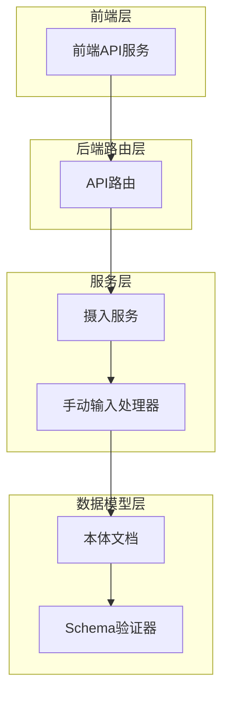
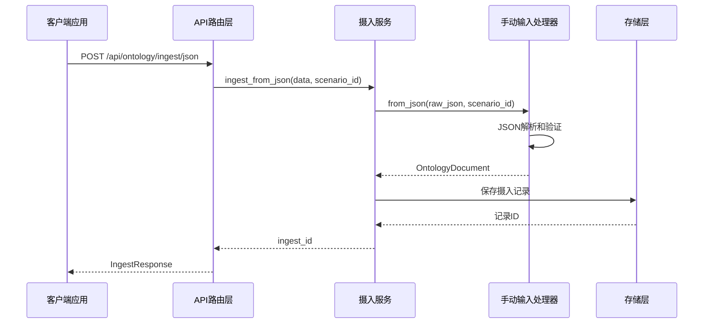
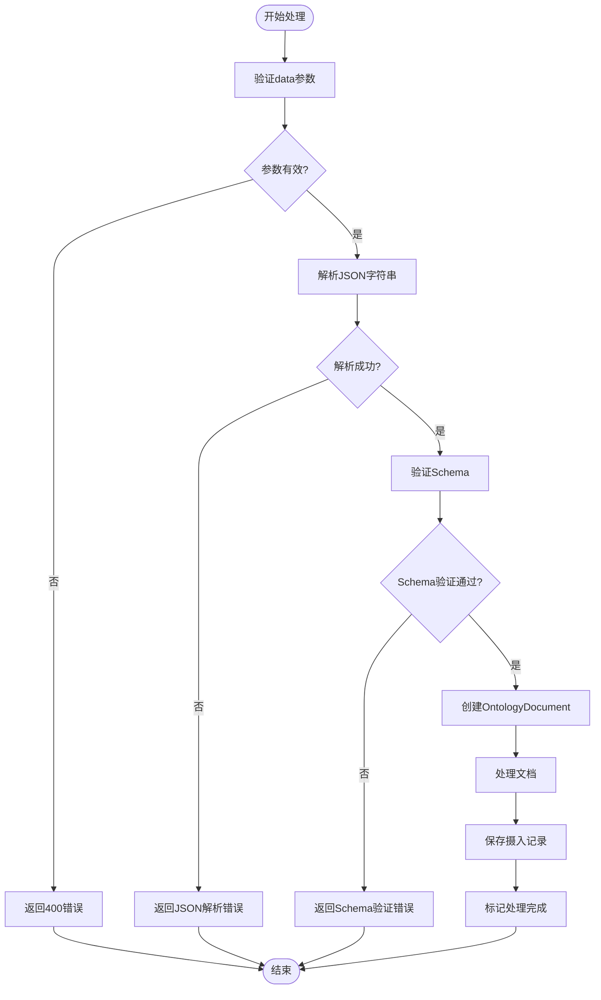
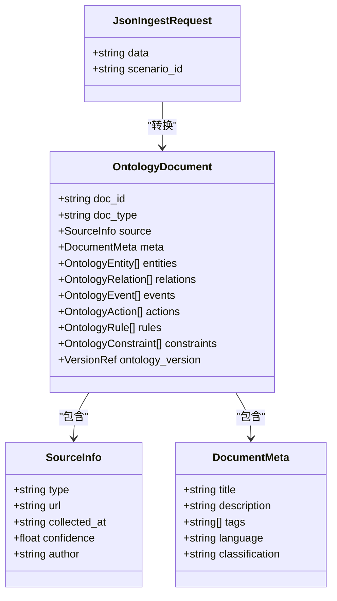
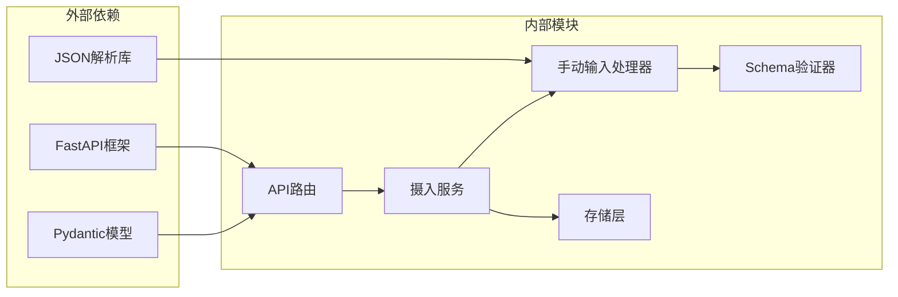

# JSON数据摄入API

<cite>
**本文档引用的文件**
- [routes.py](file://odap/biz/core/ontology/api/routes.py)
- [ingest_service.py](file://odap/biz/core/ontology/services/ingest_service.py)
- [manual_input.py](file://odap/biz/core/ontology/ingestion_split/manual_input.py)
- [document.py](file://odap/biz/core/ontology/schema/document.py)
- [api.ts](file://frontend/src/modules/shared/services/api.ts)
- [test_ingest_pipeline.py](file://tests/integration/test_ingest_pipeline.py)
</cite>

## 目录
1. [简介](#简介)
2. [项目结构](#项目结构)
3. [核心组件](#核心组件)
4. [架构概览](#架构概览)
5. [详细组件分析](#详细组件分析)
6. [依赖关系分析](#依赖关系分析)
7. [性能考虑](#性能考虑)
8. [故障排除指南](#故障排除指南)
9. [结论](#结论)

## 简介

ODAP平台的JSON数据摄入API为用户提供了一种标准化的方式来导入JSON格式的数据。该API支持将结构化的JSON数据转换为本体文档，进而构建知识图谱。本文档详细说明了JSON数据摄入API的使用方法、数据格式要求、解析验证机制以及与本体建模的映射关系。

## 项目结构

JSON数据摄入API位于ODAP平台的本体管理模块中，主要涉及以下组件：

**图表来源**
- [routes.py:181-196](file://odap/biz/core/ontology/api/routes.py#L181-L196)
- [ingest_service.py:597-638](file://odap/biz/core/ontology/services/ingest_service.py#L597-L638)
- [manual_input.py:129-145](file://odap/biz/core/ontology/ingestion_split/manual_input.py#L129-L145)

**章节来源**
- [routes.py:13-196](file://odap/biz/core/ontology/api/routes.py#L13-L196)
- [ingest_service.py:330-638](file://odap/biz/core/ontology/services/ingest_service.py#L330-L638)

## 核心组件

### API路由定义

JSON数据摄入API的核心路由定义如下：

- **端点**: `POST /api/ontology/ingest/json`
- **请求体**: JsonIngestRequest
- **响应体**: IngestResponse

### 请求参数详解

JsonIngestRequest数据模型包含以下字段：

| 字段名 | 类型 | 必填 | 描述 |
|--------|------|------|------|
| data | string | 是 | JSON字符串格式的数据 |
| scenario_id | string | 否 | 场景ID，用于关联特定的工作空间 |

### 响应参数详解

IngestResponse数据模型包含以下字段：

| 字段名 | 类型 | 描述 |
|--------|------|------|
| ingest_id | string | 摄入任务ID |
| status | string | 处理状态 |
| source_details | object | 数据源详细信息 |
| original_content | string | 原始内容 |
| extracted_data | object | 提取的数据 |

**章节来源**
- [routes.py:29-54](file://odap/biz/core/ontology/api/routes.py#L29-L54)
- [routes.py:181-196](file://odap/biz/core/ontology/api/routes.py#L181-L196)

## 架构概览

JSON数据摄入API遵循典型的三层架构模式：

**图表来源**
- [routes.py:181-196](file://odap/biz/core/ontology/api/routes.py#L181-L196)
- [ingest_service.py:597-638](file://odap/biz/core/ontology/services/ingest_service.py#L597-L638)
- [manual_input.py:129-145](file://odap/biz/core/ontology/ingestion_split/manual_input.py#L129-L145)

## 详细组件分析

### JSON数据解析流程

JSON数据摄入的核心处理流程如下：

**图表来源**
- [manual_input.py:129-145](file://odap/biz/core/ontology/ingestion_split/manual_input.py#L129-L145)
- [ingest_service.py:597-638](file://odap/biz/core/ontology/services/ingest_service.py#L597-L638)

### 数据模型映射

JSON数据到本体文档的映射关系：

**图表来源**
- [routes.py:29-31](file://odap/biz/core/ontology/api/routes.py#L29-L31)
- [document.py:104-153](file://odap/biz/core/ontology/schema/document.py#L104-L153)

### Schema验证机制

系统提供了严格的Schema验证机制：

| 验证类型 | 验证内容 | 错误处理 |
|----------|----------|----------|
| 必填字段检查 | doc_id, doc_type, source, meta, entities, relations, events | 返回400错误 |
| 数据类型验证 | 字段类型匹配 | 返回422错误 |
| 枚举值验证 | DocType, SourceType, EntityType | 返回400错误 |
| 关系完整性 | source_entity, target_entity存在性 | 返回400错误 |
| 事件完整性 | event_id, timestamp存在性 | 返回400错误 |

**章节来源**
- [manual_input.py:129-145](file://odap/biz/core/ontology/ingestion_split/manual_input.py#L129-L145)
- [document.py:418-485](file://odap/biz/core/ontology/schema/document.py#L418-L485)

## 依赖关系分析

JSON数据摄入API的依赖关系如下：

**图表来源**
- [routes.py:1-12](file://odap/biz/core/ontology/api/routes.py#L1-L12)
- [ingest_service.py:12-26](file://odap/biz/core/ontology/services/ingest_service.py#L12-L26)

**章节来源**
- [routes.py:1-12](file://odap/biz/core/ontology/api/routes.py#L1-L12)
- [ingest_service.py:12-26](file://odap/biz/core/ontology/services/ingest_service.py#L12-L26)

## 性能考虑

### 处理流程优化

1. **异步处理**: 使用async/await模式提高并发处理能力
2. **内存管理**: 对大JSON数据进行流式处理
3. **缓存策略**: 对频繁访问的Schema进行缓存
4. **错误恢复**: 实现断点续传和重试机制

### 性能监控指标

| 指标类型 | 监控内容 | 告警阈值 |
|----------|----------|----------|
| 响应时间 | API响应延迟 | >500ms |
| 错误率 | JSON解析错误率 | >5% |
| 处理吞吐量 | 每秒处理请求数 | <100req/s |
| 内存使用 | JSON数据占用内存 | >100MB |

## 故障排除指南

### 常见错误类型

| 错误代码 | 错误类型 | 可能原因 | 解决方案 |
|----------|----------|----------|----------|
| 400 | 参数错误 | data字段缺失或为空 | 确保提供有效的JSON字符串 |
| 422 | 数据验证错误 | JSON格式不符合Schema | 检查JSON结构和字段类型 |
| 500 | 服务器错误 | 内部处理异常 | 查看服务日志，重启服务 |
| 408 | 请求超时 | 处理时间过长 | 优化JSON结构，减少数据量 |

### 调试技巧

1. **启用详细日志**: 在开发环境中开启DEBUG级别日志
2. **分步验证**: 先验证JSON格式，再进行Schema验证
3. **单元测试**: 编写针对不同JSON结构的测试用例
4. **性能分析**: 使用性能分析工具识别瓶颈

**章节来源**
- [test_ingest_pipeline.py:295-319](file://tests/integration/test_ingest_pipeline.py#L295-L319)

## 结论

ODAP平台的JSON数据摄入API提供了完整的JSON数据处理解决方案。通过严格的Schema验证、灵活的数据映射和完善的错误处理机制，该API能够可靠地将各种格式的JSON数据转换为标准的本体文档。开发者可以利用该API快速构建知识图谱，实现数据的结构化管理和智能推理。

建议在使用过程中重点关注JSON数据的格式规范和Schema验证，确保数据质量和处理效率。同时，合理配置场景ID和工作空间，以便更好地组织和管理不同的数据摄入任务。