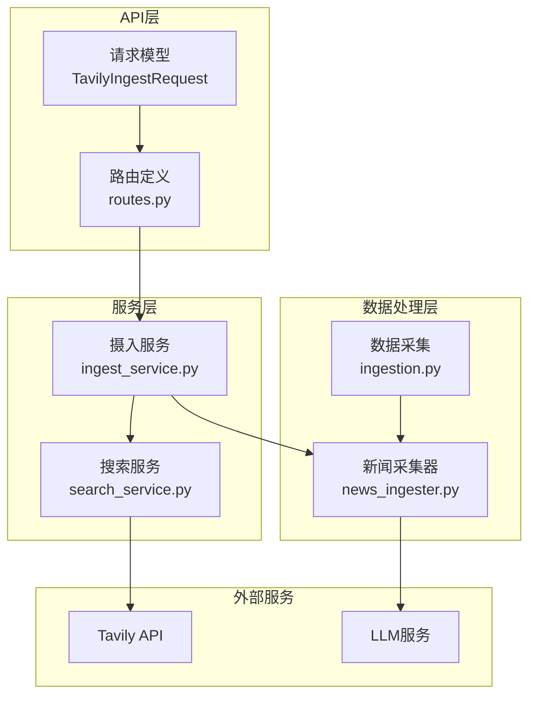
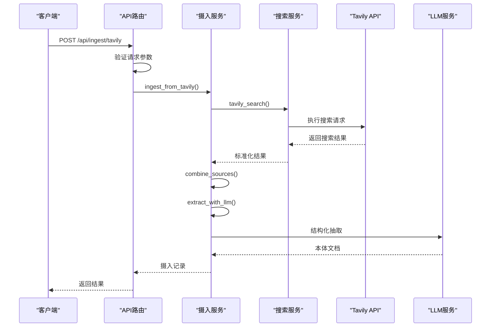
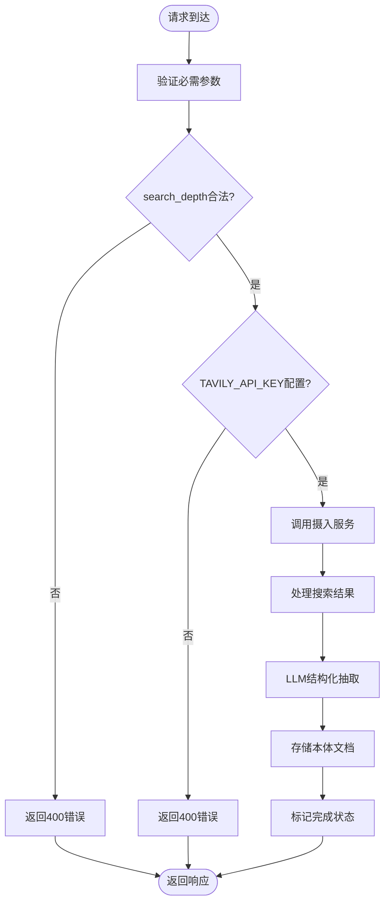
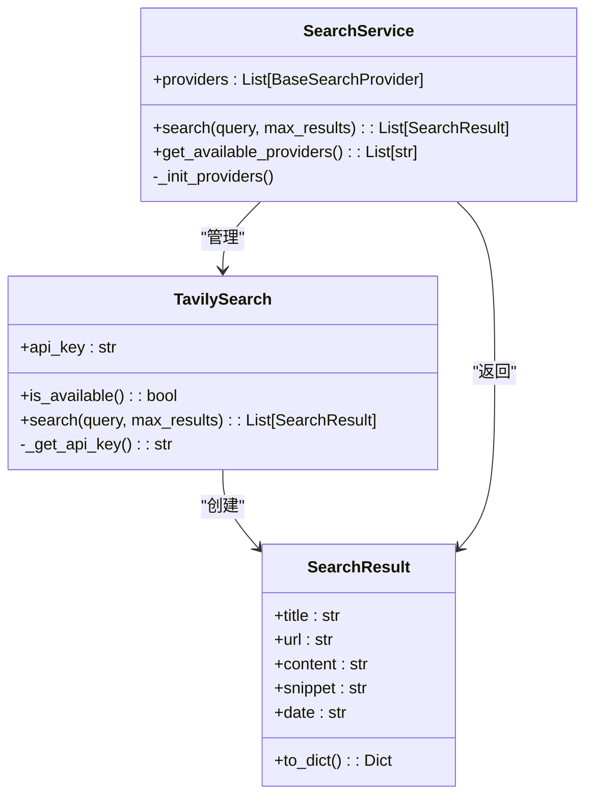
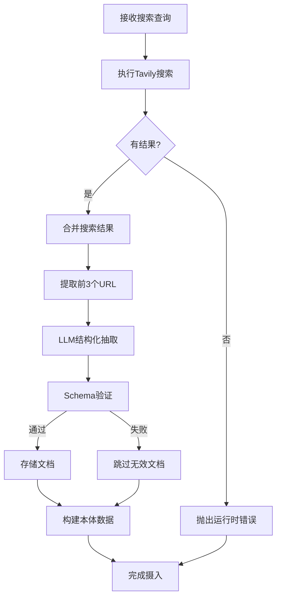
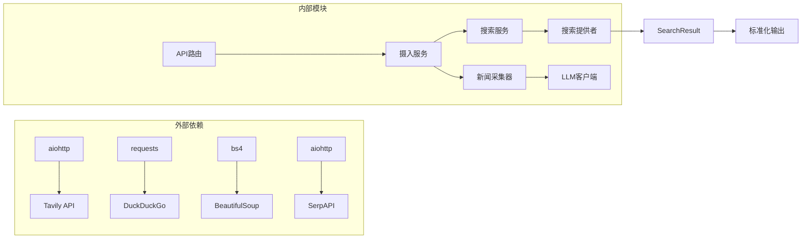

# Tavily搜索摄入API

<cite>
**本文档引用的文件**
- [odap/biz/core/ontology/api/routes.py](file://odap/biz/core/ontology/api/routes.py)
- [odap/biz/core/ontology/services/ingest_service.py](file://odap/biz/core/ontology/services/ingest_service.py)
- [odap/biz/core/ontology/services/search_service.py](file://odap/biz/core/ontology/services/search_service.py)
- [odap/biz/core/ontology/ingestion_split/news_ingester.py](file://odap/biz/core/ontology/ingestion_split/news_ingester.py)
- [odap/biz/core/ontology/ingestion_split/ingestion.py](file://odap/biz/core/ontology/ingestion_split/ingestion.py)
- [odap/web/api/app.py](file://odap/web/api/app.py)
- [docs/02-architecture/ARCHITECTURE_EVOLVE.md](file://docs/02-architecture/ARCHITECTURE_EVOLVE.md)
- [AGENTS.md](file://AGENTS.md)
</cite>

## 目录
1. [简介](#简介)
2. [项目结构](#项目结构)
3. [核心组件](#核心组件)
4. [架构概览](#架构概览)
5. [详细组件分析](#详细组件分析)
6. [依赖分析](#依赖分析)
7. [性能考虑](#性能考虑)
8. [故障排除指南](#故障排除指南)
9. [结论](#结论)
10. [附录](#附录)

## 简介
本文件为ODAP平台的Tavily搜索摄入API提供完整的技术参考文档。该API允许用户通过关键词进行网络搜索，并将搜索结果整合为结构化的本体文档，支持基础搜索(basic)与高级搜索(advanced)两种深度模式。文档涵盖请求参数定义、环境变量配置、调用示例、结果处理机制、性能优化建议以及安全最佳实践。

## 项目结构
Tavily搜索摄入API位于ODAP平台的本体管理模块中，采用分层架构设计：
- API层：FastAPI路由定义与请求模型
- 服务层：摄入流程编排与搜索服务集成
- 搜索服务层：统一搜索接口与多提供商支持
- 数据处理层：文本聚合与LLM抽取



**图表来源**
- [odap/biz/core/ontology/api/routes.py:41-47](file://odap/biz/core/ontology/api/routes.py#L41-L47)
- [odap/biz/core/ontology/services/ingest_service.py:96-120](file://odap/biz/core/ontology/services/ingest_service.py#L96-L120)
- [odap/biz/core/ontology/services/search_service.py:133-187](file://odap/biz/core/ontology/services/search_service.py#L133-L187)

**章节来源**
- [odap/biz/core/ontology/api/routes.py:41-47](file://odap/biz/core/ontology/api/routes.py#L41-L47)
- [odap/biz/core/ontology/services/ingest_service.py:96-120](file://odap/biz/core/ontology/services/ingest_service.py#L96-L120)

## 核心组件
Tavily搜索摄入API的核心组件包括：

### 请求模型定义
TavilyIngestRequest包含以下关键参数：
- data：必需，搜索关键词
- event_context：可选，事件背景描述
- max_sources：可选，默认5，最大检索来源数
- search_depth：可选，默认"basic"，搜索深度(basic/advanced)
- scenario_id：可选，场景ID

### 搜索服务实现
SearchService提供统一的搜索接口，支持多种提供商：
- TavilySearch：需要API Key的付费搜索
- SerpAPISearch：Google搜索API
- DuckDuckGoSearch：免费HTML解析搜索
- MockSearch：降级测试方案

### 摄入服务流程
IngestService协调整个搜索摄入流程，包括：
- 搜索执行与结果聚合
- 文本合并与URL提取
- LLM结构化抽取
- 本体文档验证与存储

**章节来源**
- [odap/biz/core/ontology/api/routes.py:41-47](file://odap/biz/core/ontology/api/routes.py#L41-L47)
- [odap/biz/core/ontology/services/search_service.py:133-187](file://odap/biz/core/ontology/services/search_service.py#L133-L187)
- [odap/biz/core/ontology/services/ingest_service.py:478-519](file://odap/biz/core/ontology/services/ingest_service.py#L478-L519)

## 架构概览
Tavily搜索摄入API采用分层架构，确保高内聚低耦合的设计原则：



**图表来源**
- [odap/biz/core/ontology/api/routes.py:252-292](file://odap/biz/core/ontology/api/routes.py#L252-L292)
- [odap/biz/core/ontology/services/ingest_service.py:478-519](file://odap/biz/core/ontology/services/ingest_service.py#L478-L519)

## 详细组件分析

### API路由与请求处理
API层提供RESTful接口，支持POST /api/ingest/tavily端点：



**图表来源**
- [odap/biz/core/ontology/api/routes.py:252-292](file://odap/biz/core/ontology/api/routes.py#L252-L292)

### 搜索服务实现
TavilySearch提供完整的搜索功能，包括API Key管理和结果处理：



**图表来源**
- [odap/biz/core/ontology/services/search_service.py:133-187](file://odap/biz/core/ontology/services/search_service.py#L133-L187)
- [odap/biz/core/ontology/services/search_service.py:26-41](file://odap/biz/core/ontology/services/search_service.py#L26-L41)

### 摄入服务流程
IngestService协调完整的搜索摄入流程：



**图表来源**
- [odap/biz/core/ontology/services/ingest_service.py:478-519](file://odap/biz/core/ontology/services/ingest_service.py#L478-L519)

**章节来源**
- [odap/biz/core/ontology/api/routes.py:252-292](file://odap/biz/core/ontology/api/routes.py#L252-L292)
- [odap/biz/core/ontology/services/search_service.py:133-187](file://odap/biz/core/ontology/services/search_service.py#L133-L187)
- [odap/biz/core/ontology/services/ingest_service.py:478-519](file://odap/biz/core/ontology/services/ingest_service.py#L478-L519)

## 依赖分析
Tavily搜索摄入API的依赖关系如下：



**图表来源**
- [odap/biz/core/ontology/services/search_service.py:152-181](file://odap/biz/core/ontology/services/search_service.py#L152-L181)
- [odap/biz/core/ontology/ingestion_split/news_ingester.py:212-225](file://odap/biz/core/ontology/ingestion_split/news_ingester.py#L212-L225)

**章节来源**
- [odap/biz/core/ontology/services/search_service.py:152-181](file://odap/biz/core/ontology/services/search_service.py#L152-L181)
- [odap/biz/core/ontology/ingestion_split/news_ingester.py:212-225](file://odap/biz/core/ontology/ingestion_split/news_ingester.py#L212-L225)

## 性能考虑
基于代码实现分析，Tavily搜索摄入API的性能特征如下：

### 搜索深度影响
- **basic模式**：默认使用basic深度，响应速度快，成本较低
- **advanced模式**：提供更深入的内容分析，但可能增加延迟和成本
- **max_sources参数**：直接影响API调用次数和处理时间

### 并发与超时
- Tavily API请求超时设置为15秒
- DuckDuckGo HTML解析超时设置为10秒
- SerpAPI请求超时设置为15秒

### 缓存与降级
- 支持多级降级：Tavily → SerpAPI → DuckDuckGo → Mock
- 搜索结果按可用性优先级选择

**章节来源**
- [odap/biz/core/ontology/services/search_service.py:162-181](file://odap/biz/core/ontology/services/search_service.py#L162-L181)
- [odap/biz/core/ontology/ingestion_split/news_ingester.py:222-225](file://odap/biz/core/ontology/ingestion_split/news_ingester.py#L222-L225)

## 故障排除指南

### 常见错误与解决方案

#### API Key配置问题
**症状**：返回"请先配置 TAVILY_API_KEY 环境变量"
**原因**：环境变量未正确设置
**解决方案**：
1. 检查环境变量是否存在于系统中
2. 确认.env文件配置正确
3. 验证API Key格式和有效期

#### 搜索无结果
**症状**：返回"未返回结果"
**原因**：搜索关键词过于具体或搜索服务不可用
**解决方案**：
1. 尝试简化搜索关键词
2. 检查网络连接
3. 验证其他搜索提供商是否可用

#### LLM抽取失败
**症状**：文档验证失败或LLM响应异常
**原因**：LLM服务不可用或响应格式错误
**解决方案**：
1. 检查LLM服务连接
2. 验证提示词格式
3. 查看日志获取详细错误信息

**章节来源**
- [odap/biz/core/ontology/api/routes.py:268-275](file://odap/biz/core/ontology/api/routes.py#L268-L275)
- [odap/biz/core/ontology/services/ingest_service.py:504-505](file://odap/biz/core/ontology/services/ingest_service.py#L504-L505)

## 结论
Tavily搜索摄入API为ODAP平台提供了强大的网络搜索能力，通过统一的接口支持多种搜索深度和提供商。其设计充分考虑了性能、可靠性和安全性，为搜索工程师和数据分析师提供了灵活而高效的集成方案。建议在生产环境中合理配置API Key，监控搜索质量，并根据业务需求调整搜索深度和结果数量。

## 附录

### API调用示例
以下为不同场景的API调用示例（基于请求模型定义）：

#### 基础搜索示例
```json
{
  "source_type": "tavily",
  "data": "人工智能技术发展",
  "event_context": "科技趋势分析",
  "max_sources": 5,
  "search_depth": "basic"
}
```

#### 高级搜索示例
```json
{
  "source_type": "tavily", 
  "data": "量子计算应用研究",
  "event_context": "前沿科技分析",
  "max_sources": 8,
  "search_depth": "advanced",
  "scenario_id": "scenario_001"
}
```

### 环境变量配置
需要配置的环境变量：
- `TAVILY_API_KEY`：Tavily API密钥
- `SERPAPI_KEY`：SerpAPI密钥（可选）
- `OPENAI_API_KEY`：LLM服务密钥（可选）

### 最佳实践建议
1. **搜索深度选择**：根据准确性需求选择basic或advanced模式
2. **结果数量控制**：合理设置max_sources避免过度调用
3. **错误处理**：实现重试机制和降级策略
4. **监控告警**：建立API调用和成功率监控
5. **成本控制**：定期审查API使用量和费用

**章节来源**
- [docs/02-architecture/ARCHITECTURE_EVOLVE.md](file://docs/02-architecture/ARCHITECTURE_EVOLVE.md#L796)
- [AGENTS.md](file://AGENTS.md#L87)