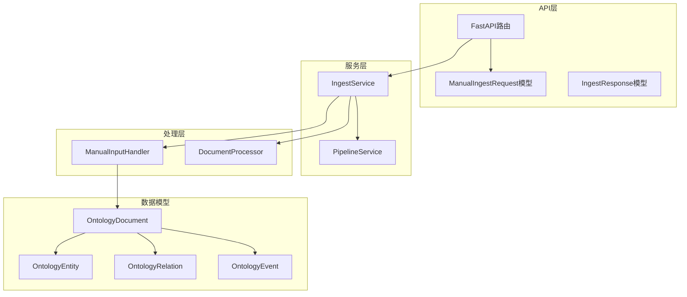
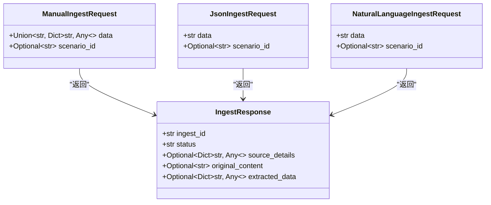
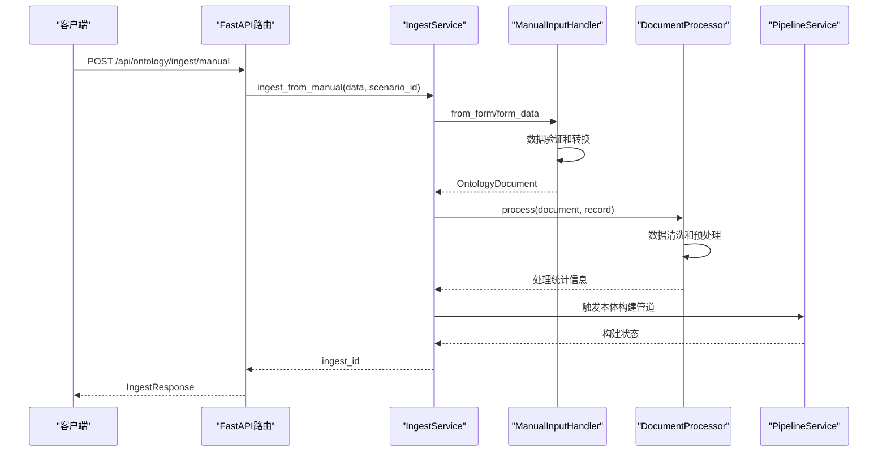
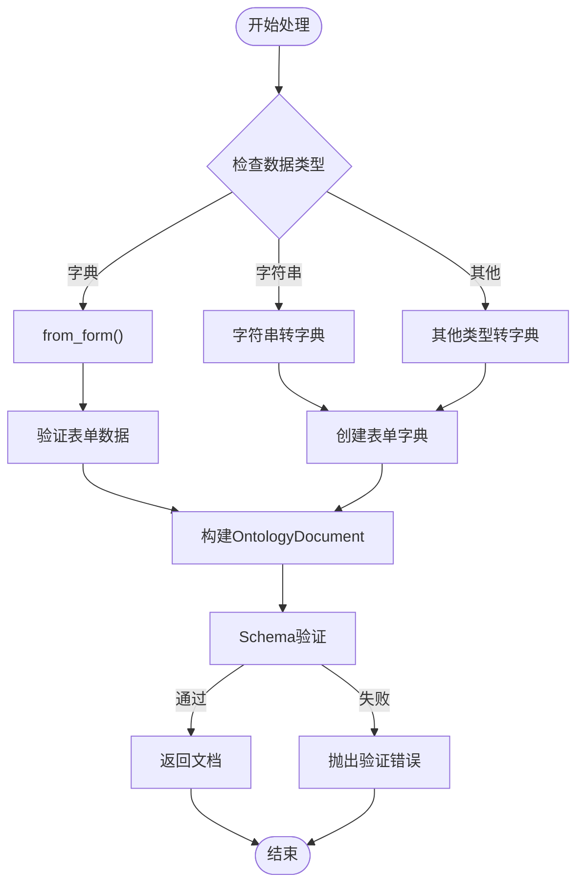
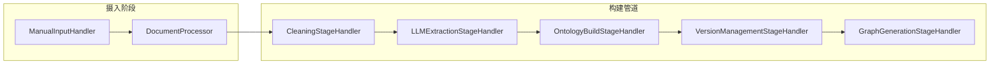
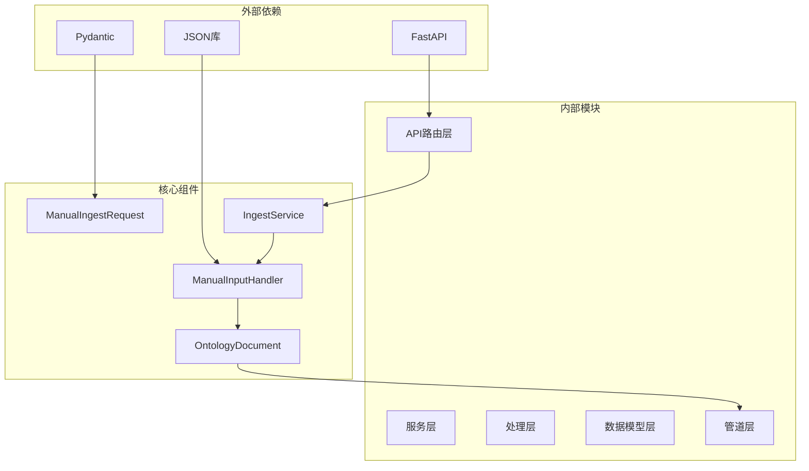
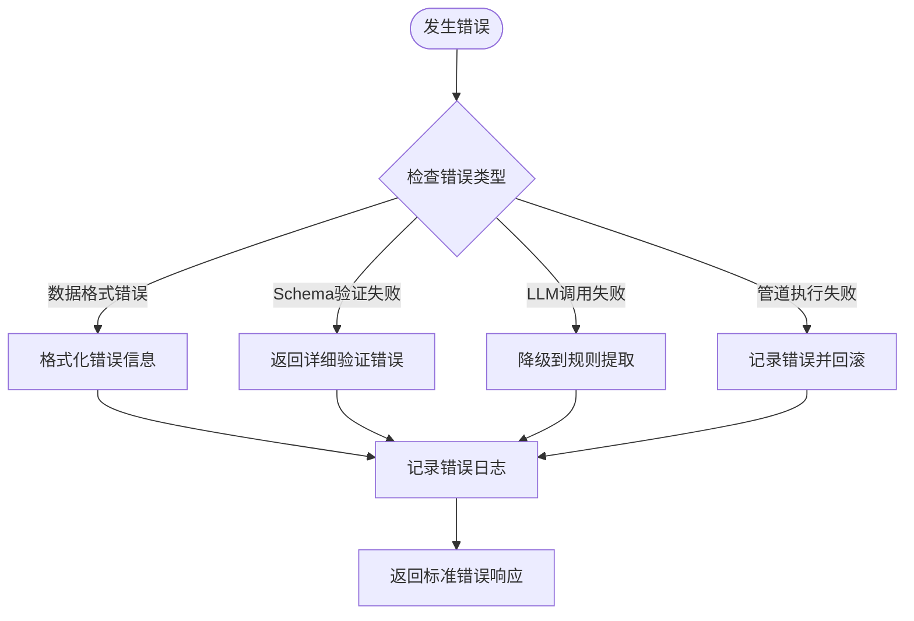

# 手动输入摄入API

<cite>
**本文档引用的文件**
- [routes.py](file://odap/biz/core/ontology/api/routes.py)
- [manual_input.py](file://odap/biz/core/ontology/ingestion_split/manual_input.py)
- [ingest_service.py](file://odap/biz/core/ontology/services/ingest_service.py)
- [pipeline_service.py](file://odap/biz/core/ontology/services/pipeline_service.py)
- [document.py](file://odap/biz/core/ontology/schema/document.py)
- [app.py](file://odap/web/api/app.py)
- [test_api_integration.py](file://tests/integration/test_api_integration.py)
</cite>

## 目录
1. [简介](#简介)
2. [项目结构](#项目结构)
3. [核心组件](#核心组件)
4. [架构概览](#架构概览)
5. [详细组件分析](#详细组件分析)
6. [依赖关系分析](#依赖关系分析)
7. [性能考虑](#性能考虑)
8. [故障排除指南](#故障排除指南)
9. [结论](#结论)
10. [附录](#附录)

## 简介

ODAP平台的手动输入摄入API为本体设计师和数据管理员提供了灵活的数据摄入解决方案。该API支持多种数据格式，包括纯文本、结构化表单数据和JSON字符串，能够将手动输入的数据转换为标准的本体文档格式，为后续的本体构建和知识图谱生成奠定基础。

本API的核心特性包括：
- 支持多种数据格式输入（字符串、字典、JSON）
- 自动数据验证和预处理
- 与本体构建管道的无缝集成
- 完整的错误处理和响应格式
- 支持场景ID隔离和版本管理

## 项目结构

手动输入摄入API位于ODAP平台的本体处理模块中，主要涉及以下关键组件：



**图表来源**
- [routes.py:25-54](file://odap/biz/core/ontology/api/routes.py#L25-L54)
- [ingest_service.py:538-595](file://odap/biz/core/ontology/services/ingest_service.py#L538-L595)
- [manual_input.py:65-127](file://odap/biz/core/ontology/ingestion_split/manual_input.py#L65-L127)

**章节来源**
- [routes.py:1-527](file://odap/biz/core/ontology/api/routes.py#L1-L527)
- [ingest_service.py:1-972](file://odap/biz/core/ontology/services/ingest_service.py#L1-L972)

## 核心组件

### ManualIngestRequest数据模型

ManualIngestRequest是手动输入摄入API的核心数据模型，定义了请求参数的结构和验证规则：



**图表来源**
- [routes.py:25-54](file://odap/biz/core/ontology/api/routes.py#L25-L54)

### 数据格式支持

手动输入API支持三种主要的数据格式：

1. **字符串格式**：纯文本输入，系统会自动包装为字典格式
2. **字典格式**：结构化的表单数据，包含实体、关系、事件等本体元素
3. **JSON格式**：完整的本体文档JSON字符串

**章节来源**
- [routes.py:25-35](file://odap/biz/core/ontology/api/routes.py#L25-L35)
- [manual_input.py:78-145](file://odap/biz/core/ontology/ingestion_split/manual_input.py#L78-L145)

## 架构概览

手动输入摄入API采用分层架构设计，确保了良好的可维护性和扩展性：



**图表来源**
- [routes.py:164-179](file://odap/biz/core/ontology/api/routes.py#L164-L179)
- [ingest_service.py:538-595](file://odap/biz/core/ontology/services/ingest_service.py#L538-L595)
- [pipeline_service.py:331-342](file://odap/biz/core/ontology/services/pipeline_service.py#L331-L342)

## 详细组件分析

### ManualInputHandler处理流程

ManualInputHandler是手动输入数据处理的核心组件，负责将不同格式的输入转换为标准的本体文档：



**图表来源**
- [manual_input.py:78-127](file://odap/biz/core/ontology/ingestion_split/manual_input.py#L78-L127)

### 数据验证和预处理机制

系统实现了多层次的数据验证和预处理机制：

1. **类型验证**：确保输入数据符合预期格式
2. **Schema验证**：使用严格的Schema定义验证数据结构
3. **内容清洗**：自动清理和标准化输入内容
4. **实体识别**：从文本中提取实体、关系和事件

**章节来源**
- [manual_input.py:129-145](file://odap/biz/core/ontology/ingestion_split/manual_input.py#L129-L145)
- [ingest_service.py:538-595](file://odap/biz/core/ontology/services/ingest_service.py#L538-L595)

### 与本体构建管道的集成

手动输入的数据会自动触发本体构建管道的执行：



**图表来源**
- [pipeline_service.py:331-524](file://odap/biz/core/ontology/services/pipeline_service.py#L331-L524)

**章节来源**
- [pipeline_service.py:331-342](file://odap/biz/core/ontology/services/pipeline_service.py#L331-L342)

## 依赖关系分析

手动输入摄入API的依赖关系体现了清晰的分层架构：



**图表来源**
- [routes.py:1-16](file://odap/biz/core/ontology/api/routes.py#L1-L16)
- [ingest_service.py:1-20](file://odap/biz/core/ontology/services/ingest_service.py#L1-L20)

**章节来源**
- [document.py:1-200](file://odap/biz/core/ontology/schema/document.py#L1-L200)

## 性能考虑

手动输入摄入API在设计时充分考虑了性能优化：

1. **异步处理**：所有核心处理都是异步执行，避免阻塞
2. **内存管理**：合理使用内存，避免大数据量时的内存泄漏
3. **缓存策略**：对频繁访问的数据进行缓存
4. **并发控制**：限制同时处理的任务数量

## 故障排除指南

### 常见错误类型

1. **数据格式错误**：输入数据不符合预期格式
2. **Schema验证失败**：数据结构不符合本体文档要求
3. **LLM调用失败**：当使用自然语言处理时可能出现的错误
4. **管道执行失败**：本体构建过程中的各种异常

### 错误处理策略



**图表来源**
- [manual_input.py:133-139](file://odap/biz/core/ontology/ingestion_split/manual_input.py#L133-L139)
- [ingest_service.py:592-594](file://odap/biz/core/ontology/services/ingest_service.py#L592-L594)

**章节来源**
- [routes.py:135-136](file://odap/biz/core/ontology/api/routes.py#L135-L136)
- [manual_input.py:168-170](file://odap/biz/core/ontology/ingestion_split/manual_input.py#L168-L170)

## 结论

ODAP平台的手动输入摄入API为本体设计师和数据管理员提供了强大而灵活的数据摄入解决方案。通过支持多种数据格式、完善的验证机制和与本体构建管道的无缝集成，该API能够满足各种手动数据摄入需求。

关键优势包括：
- **灵活性**：支持纯文本、结构化数据和JSON等多种格式
- **可靠性**：多层次的数据验证和错误处理机制
- **可扩展性**：清晰的分层架构便于功能扩展
- **易用性**：简洁的API设计和详细的文档支持

## 附录

### API调用示例

#### 纯文本格式示例
```json
{
  "data": "伊朗在霍尔木兹海峡部署了新型导弹系统，威胁过往油轮的安全。",
  "scenario_id": "default"
}
```

#### 结构化表单数据示例
```json
{
  "data": {
    "title": "军事演习",
    "description": "在南海举行的联合军演",
    "entities": [
      {
        "name": "南海",
        "type": "Location",
        "attributes": {}
      }
    ],
    "relationships": [],
    "events": []
  },
  "scenario_id": "default"
}
```

#### JSON格式示例
```json
{
  "data": "{\"doc_type\":\"event\",\"entities\":[{\"entity_id\":\"location-001\",\"entity_type\":\"Location\",\"name\":\"南海\"}]}",  
  "scenario_id": "default"
}
```

### 响应格式说明

API返回的标准响应格式包含以下字段：
- `ingest_id`: 唯一的摄入任务ID
- `status`: 当前处理状态
- `source_details`: 数据源详细信息
- `original_content`: 原始内容
- `extracted_data`: 提取的数据

**章节来源**
- [routes.py:48-71](file://odap/biz/core/ontology/api/routes.py#L48-L71)
- [test_api_integration.py:174-186](file://tests/integration/test_api_integration.py#L174-L186)