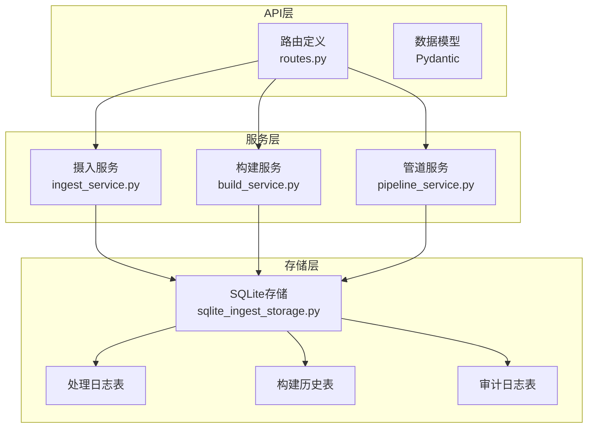
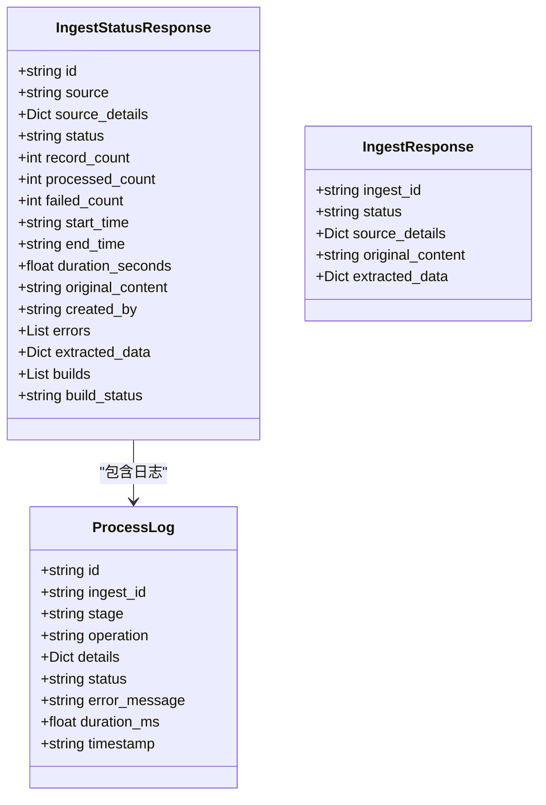
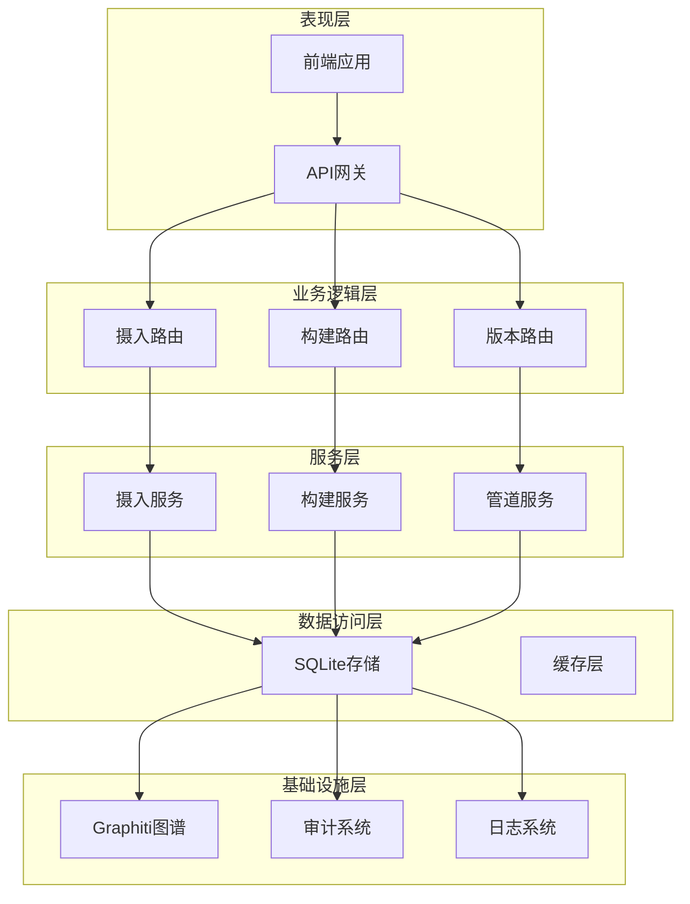
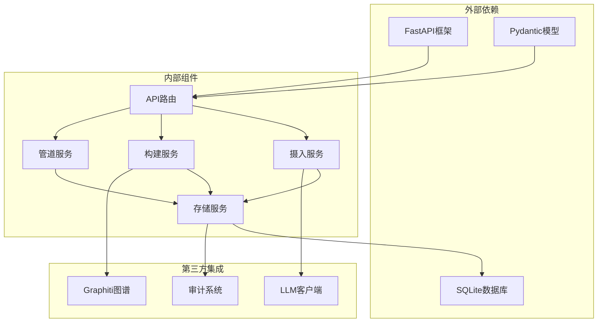
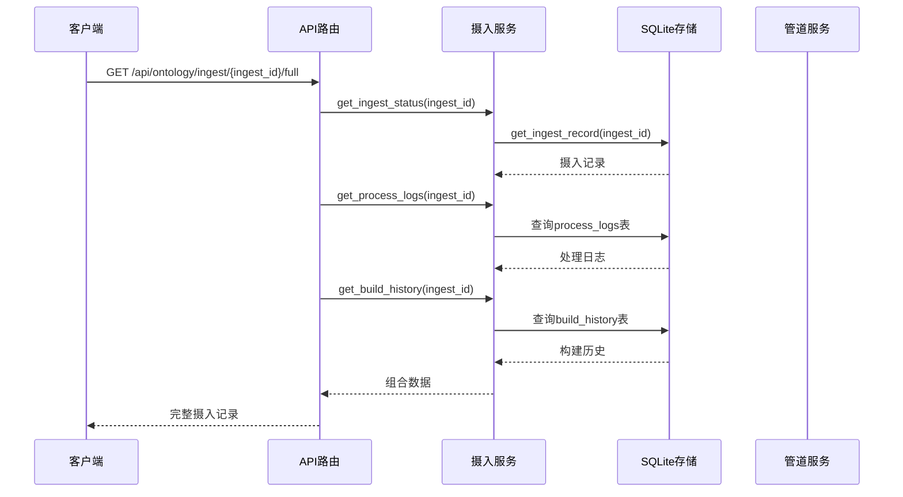

# 摄入状态管理API

<cite>
**本文档引用的文件**
- [odap/biz/core/ontology/api/routes.py](file://odap/biz/core/ontology/api/routes.py)
- [odap/biz/core/ontology/services/ingest_service.py](file://odap/biz/core/ontology/services/ingest_service.py)
- [odap/biz/core/ontology/storage/sqlite_ingest_storage.py](file://odap/biz/core/ontology/storage/sqlite_ingest_storage.py)
- [odap/biz/core/ontology/services/build_service.py](file://odap/biz/core/ontology/services/build_service.py)
- [odap/biz/core/ontology/services/pipeline_service.py](file://odap/biz/core/ontology/services/pipeline_service.py)
- [docs/10-api/BACKEND_API_DESIGN.md](file://docs/10-api/BACKEND_API_DESIGN.md)
- [tests/integration/test_api_endpoints.py](file://tests/integration/test_api_endpoints.py)
</cite>

## 目录
1. [简介](#简介)
2. [项目结构](#项目结构)
3. [核心组件](#核心组件)
4. [架构概览](#架构概览)
5. [详细组件分析](#详细组件分析)
6. [依赖关系分析](#依赖关系分析)
7. [性能考虑](#性能考虑)
8. [故障排查指南](#故障排查指南)
9. [结论](#结论)

## 简介

ODAP平台的摄入状态管理API提供了完整的本体摄入生命周期管理能力。该API允许用户查询摄入历史、获取特定摄入状态、查看处理日志、获取完整摄入记录，以及管理构建历史和版本控制。

本API的核心功能包括：
- **摄入历史查询**：获取所有摄入记录的历史列表
- **状态获取**：查询特定摄入任务的实时状态
- **日志查看**：获取处理过程中的详细日志信息
- **构建历史**：管理本体构建的完整历史记录
- **版本管理**：支持版本回滚和版本列表查询

## 项目结构

ODAP平台采用模块化架构设计，摄入状态管理API位于`odap/biz/core/ontology/api/routes.py`文件中，通过FastAPI框架提供RESTful接口服务。



**图表来源**
- [odap/biz/core/ontology/api/routes.py:13-527](file://odap/biz/core/ontology/api/routes.py#L13-L527)
- [odap/biz/core/ontology/services/ingest_service.py:330-972](file://odap/biz/core/ontology/services/ingest_service.py#L330-L972)
- [odap/biz/core/ontology/storage/sqlite_ingest_storage.py:17-266](file://odap/biz/core/ontology/storage/sqlite_ingest_storage.py#L17-L266)

**章节来源**
- [odap/biz/core/ontology/api/routes.py:1-527](file://odap/biz/core/ontology/api/routes.py#L1-L527)
- [docs/10-api/BACKEND_API_DESIGN.md:66-198](file://docs/10-api/BACKEND_API_DESIGN.md#L66-L198)

## 核心组件

### API路由定义

API路由定义在`odap/biz/core/ontology/api/routes.py`文件中，使用FastAPI框架提供RESTful接口。所有路由都以`/api/ontology/ingest`为前缀，确保了清晰的命名空间隔离。

主要路由包括：
- **GET /api/ontology/ingest**：获取摄入历史
- **GET /api/ontology/ingest/{ingest_id}**：获取特定摄入状态
- **GET /api/ontology/ingest/{ingest_id}/logs**：获取处理日志
- **GET /api/ontology/ingest/{ingest_id}/full**：获取完整摄入记录
- **GET /api/ontology/ingest/builds**：获取构建历史
- **GET /api/ontology/ingest/versions**：获取版本列表

### 数据模型

API使用Pydantic模型进行数据验证和序列化：



**图表来源**
- [odap/biz/core/ontology/api/routes.py:48-72](file://odap/biz/core/ontology/api/routes.py#L48-L72)
- [odap/biz/core/ontology/services/pipeline_service.py:50-140](file://odap/biz/core/ontology/services/pipeline_service.py#L50-L140)

**章节来源**
- [odap/biz/core/ontology/api/routes.py:18-72](file://odap/biz/core/ontology/api/routes.py#L18-L72)

## 架构概览

ODAP平台采用分层架构设计，确保了良好的可维护性和扩展性：



**图表来源**
- [odap/biz/core/ontology/api/routes.py:13-16](file://odap/biz/core/ontology/api/routes.py#L13-L16)
- [odap/biz/core/ontology/services/ingest_service.py:330-353](file://odap/biz/core/ontology/services/ingest_service.py#L330-L353)
- [odap/biz/core/ontology/storage/sqlite_ingest_storage.py:17-36](file://odap/biz/core/ontology/storage/sqlite_ingest_storage.py#L17-L36)

## 详细组件分析

### 摄入状态管理API

#### GET /api/ontology/ingest

此端点用于获取摄入历史记录，支持按场景ID过滤和限制返回数量。

**请求参数：**
- `limit` (可选): 返回记录数量限制，默认50
- `scenario_id` (可选): 场景ID过滤器

**响应格式：**
```json
[
  {
    "id": "string",
    "source": "string",
    "source_details": {},
    "status": "pending|processing|completed|failed",
    "record_count": 0,
    "processed_count": 0,
    "failed_count": 0,
    "start_time": "string",
    "end_time": "string",
    "duration_seconds": 0.0,
    "original_content": "string",
    "created_by": "string",
    "errors": [],
    "extracted_data": {},
    "builds": [],
    "build_status": "none|pending|completed|failed|partial"
  }
]
```

**章节来源**
- [odap/biz/core/ontology/api/routes.py:371-374](file://odap/biz/core/ontology/api/routes.py#L371-L374)
- [odap/biz/core/ontology/storage/sqlite_ingest_storage.py:746-785](file://odap/biz/core/ontology/storage/sqlite_ingest_storage.py#L746-L785)

#### GET /api/ontology/ingest/{ingest_id}

获取特定摄入任务的详细状态信息。

**路径参数：**
- `ingest_id`: 摄入任务唯一标识符

**响应格式：**
```json
{
  "id": "string",
  "source": "string",
  "source_details": {},
  "status": "pending|processing|completed|failed",
  "record_count": 0,
  "processed_count": 0,
  "failed_count": 0,
  "start_time": "string",
  "end_time": "string",
  "duration_seconds": 0.0,
  "original_content": "string",
  "created_by": "string",
  "errors": [],
  "extracted_data": {},
  "builds": [],
  "build_status": "none|pending|completed|failed|partial"
}
```

**章节来源**
- [odap/biz/core/ontology/api/routes.py:377-383](file://odap/biz/core/ontology/api/routes.py#L377-L383)

#### GET /api/ontology/ingest/{ingest_id}/logs

获取摄入任务的处理日志，包含管道各阶段的详细执行信息。

**响应格式：**
```json
[
  {
    "id": "string",
    "ingest_id": "string",
    "stage": "collection|cleaning|llm_extraction|ontology_build|version_manage|graph_build",
    "operation": "string",
    "details": {},
    "status": "pending|processing|completed|failed",
    "error_message": "string",
    "duration_ms": 0.0,
    "timestamp": "string"
  }
]
```

**章节来源**
- [odap/biz/core/ontology/api/routes.py:386-390](file://odap/biz/core/ontology/api/routes.py#L386-L390)
- [odap/biz/core/ontology/services/pipeline_service.py:69-136](file://odap/biz/core/ontology/services/pipeline_service.py#L69-L136)

#### GET /api/ontology/ingest/{ingest_id}/full

获取完整的摄入记录，包含状态、日志和构建历史的综合信息。

**响应格式：**
```json
{
  "id": "string",
  "source": "string",
  "source_details": {},
  "status": "pending|processing|completed|failed",
  "record_count": 0,
  "processed_count": 0,
  "failed_count": 0,
  "start_time": "string",
  "end_time": "string",
  "duration_seconds": 0.0,
  "original_content": "string",
  "created_by": "string",
  "errors": [],
  "extracted_data": {},
  "builds": [],
  "build_status": "none|pending|completed|failed|partial",
  "logs": [],
  "builds": []
}
```

**章节来源**
- [odap/biz/core/ontology/api/routes.py:402-416](file://odap/biz/core/ontology/api/routes.py#L402-L416)

### 构建历史管理API

#### GET /api/ontology/ingest/builds/{build_id}

获取特定构建任务的详细状态。

**响应格式：**
```json
{
  "build_id": "string",
  "status": "string",
  "document_id": "string",
  "version_info": {},
  "ingest_id": "string"
}
```

**章节来源**
- [odap/biz/core/ontology/api/routes.py:295-311](file://odap/biz/core/ontology/api/routes.py#L295-L311)

#### GET /api/ontology/ingest/builds

获取构建历史列表，支持分页和过滤。

**查询参数：**
- `limit` (可选): 返回记录数量限制，默认50

**响应格式：**
```json
[
  {
    "build_id": "string",
    "status": "string",
    "document_id": "string",
    "version_info": {},
    "ingest_id": "string",
    "ingest_source": "string",
    "ingest_time": "string"
  }
]
```

**章节来源**
- [odap/biz/core/ontology/api/routes.py:314-331](file://odap/biz/core/ontology/api/routes.py#L314-L331)

#### POST /api/ontology/ingest/{ingest_id}/build

启动本体构建管道，包含6个阶段的完整处理流程。

**响应格式：**
```json
{
  "build_id": "string",
  "status": "pending",
  "message": "Build started, check status via /api/ontology/ingest/{id}/full"
}
```

**构建管道阶段：**
1. **数据采集 (Collection)**: 从摄入记录获取原始数据
2. **数据清洗 (Cleaning)**: 去重、标准化、缺失值处理
3. **LLM归纳 (LLM Extraction)**: 实体、关系、事件提取
4. **本体构建 (Ontology Build)**: 生成OntologyDocument
5. **版本管理 (Version Manage)**: 创建版本记录
6. **图谱生成 (Graph Build)**: 构建Neo4j图谱

**章节来源**
- [odap/biz/core/ontology/api/routes.py:419-527](file://odap/biz/core/ontology/api/routes.py#L419-L527)
- [odap/biz/core/ontology/services/pipeline_service.py:1021-1284](file://odap/biz/core/ontology/services/pipeline_service.py#L1021-L1284)

### 版本管理API

#### GET /api/ontology/ingest/versions

获取版本列表。

**查询参数：**
- `scenario_id` (可选): 场景ID
- `limit` (可选): 返回数量限制，默认50

**响应格式：**
```json
[
  {
    "version_id": "string",
    "version_number": "string",
    "ontology_id": "string",
    "document_id": "string",
    "status": "string",
    "is_current": true,
    "created_at": "string",
    "entity_count": 0,
    "relation_count": 0,
    "event_count": 0
  }
]
```

**章节来源**
- [odap/biz/core/ontology/api/routes.py:342-351](file://odap/biz/core/ontology/api/routes.py#L342-L351)

#### POST /api/ontology/ingest/versions/rollback

回滚到指定版本。

**响应格式：**
```json
{
  "status": "string",
  "version_id": "string",
  "message": "string"
}
```

**章节来源**
- [odap/biz/core/ontology/api/routes.py:334-339](file://odap/biz/core/ontology/api/routes.py#L334-L339)

## 依赖关系分析

### 组件耦合关系



**图表来源**
- [odap/biz/core/ontology/api/routes.py:1-16](file://odap/biz/core/ontology/api/routes.py#L1-L16)
- [odap/biz/core/ontology/services/ingest_service.py:333-353](file://odap/biz/core/ontology/services/ingest_service.py#L333-L353)

### 数据流分析



**图表来源**
- [odap/biz/core/ontology/api/routes.py:402-416](file://odap/biz/core/ontology/api/routes.py#L402-L416)
- [odap/biz/core/ontology/storage/sqlite_ingest_storage.py:615-654](file://odap/biz/core/ontology/storage/sqlite_ingest_storage.py#L615-L654)

**章节来源**
- [odap/biz/core/ontology/api/routes.py:371-416](file://odap/biz/core/ontology/api/routes.py#L371-L416)
- [odap/biz/core/ontology/storage/sqlite_ingest_storage.py:580-785](file://odap/biz/core/ontology/storage/sqlite_ingest_storage.py#L580-L785)

## 性能考虑

### 存储优化

系统采用SQLite作为主要存储引擎，通过以下机制优化性能：

1. **WAL模式**：启用Write-Ahead Logging模式提升并发性能
2. **索引优化**：为常用查询字段建立索引
3. **批量操作**：支持批量插入和查询操作
4. **连接池**：复用数据库连接减少开销

### 缓存策略

- **内存缓存**：热点数据缓存在内存中
- **查询缓存**：频繁查询结果缓存
- **构建缓存**：避免重复构建相同内容

### 异步处理

- **后台任务**：构建管道异步执行
- **队列系统**：任务排队处理
- **进度回调**：实时状态更新

## 故障排查指南

### 常见问题诊断

#### 1. API响应超时

**可能原因：**
- 数据库连接池耗尽
- 查询过于复杂
- 网络延迟过高

**解决方案：**
- 增加数据库连接池大小
- 优化查询条件
- 添加适当的索引

#### 2. 构建失败

**可能原因：**
- LLM API不可用
- 数据格式不正确
- 内存不足

**解决方案：**
- 检查LLM API配置
- 验证输入数据格式
- 增加系统资源

#### 3. 日志查询异常

**可能原因：**
- 日志表过大
- 查询条件不当
- 存储空间不足

**解决方案：**
- 清理历史日志
- 优化查询条件
- 扩展存储空间

### 监控指标

系统提供以下监控指标：

- **吞吐量**：每秒处理的摄入请求数
- **延迟**：API响应时间和数据库查询延迟
- **错误率**：失败请求的比例
- **资源使用**：CPU、内存、磁盘使用情况

**章节来源**
- [odap/biz/core/ontology/storage/sqlite_ingest_storage.py:27-51](file://odap/biz/core/ontology/storage/sqlite_ingest_storage.py#L27-L51)
- [odap/biz/core/ontology/services/pipeline_service.py:118-134](file://odap/biz/core/ontology/services/pipeline_service.py#L118-L134)

## 结论

ODAP平台的摄入状态管理API提供了完整、可靠的本体摄入生命周期管理能力。通过模块化设计和分层架构，系统实现了高可用性、可扩展性和易维护性。

**主要优势：**
1. **完整的生命周期管理**：从摄入到构建的全流程支持
2. **实时状态监控**：提供详细的处理进度和状态信息
3. **强大的查询能力**：支持复杂的过滤和排序选项
4. **完善的日志系统**：完整的审计和调试支持
5. **灵活的扩展性**：模块化设计便于功能扩展

**推荐使用场景：**
- 企业知识管理平台
- 智能搜索系统
- 本体驱动的应用程序
- 数据治理和合规系统

通过本文档提供的详细API参考和最佳实践指导，开发者可以高效地集成和使用ODAP平台的摄入状态管理功能，构建强大的本体应用系统。