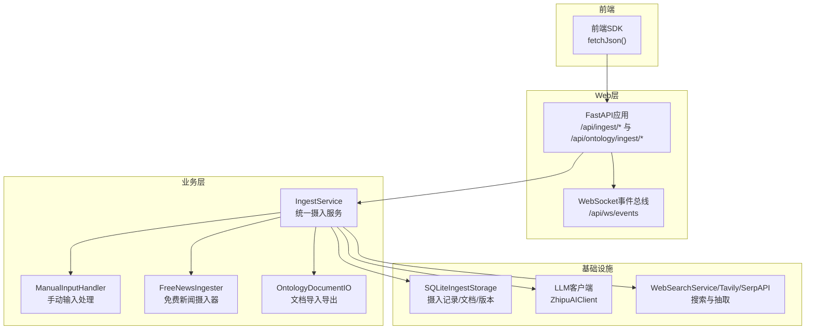
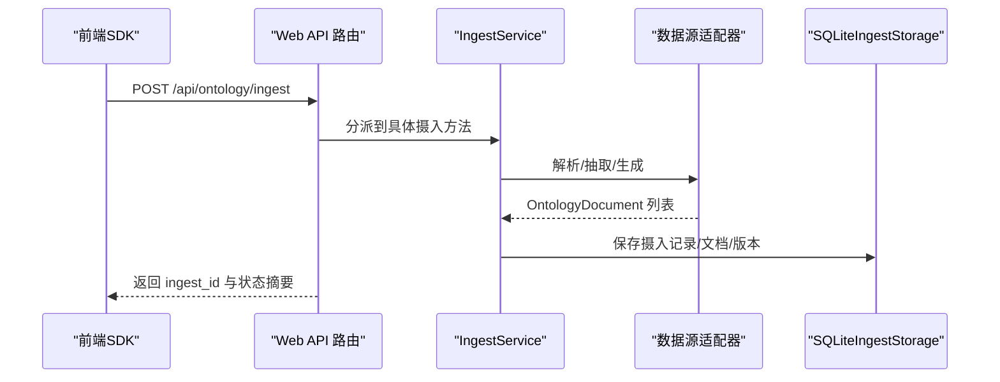
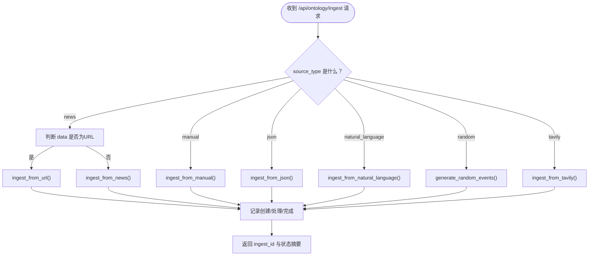
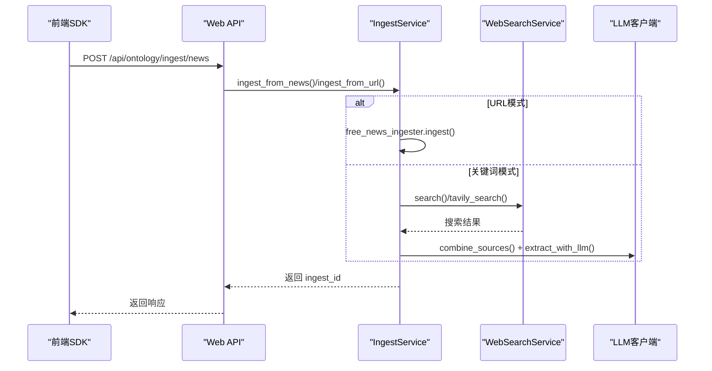
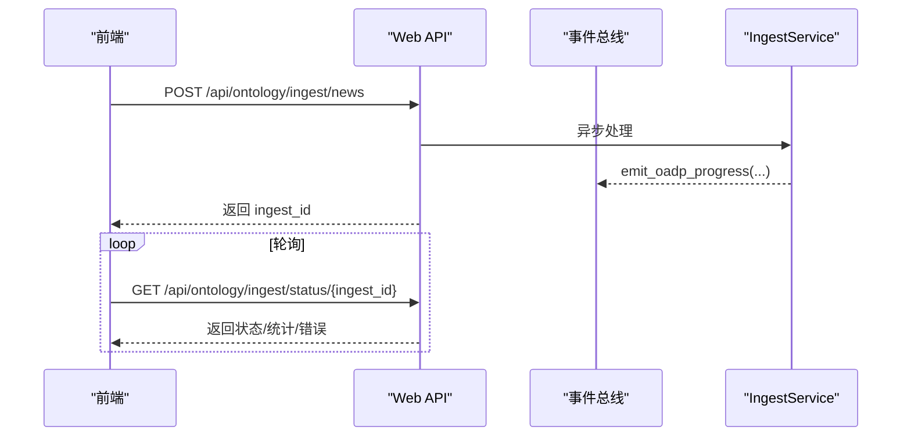
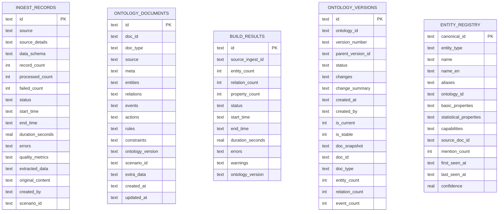
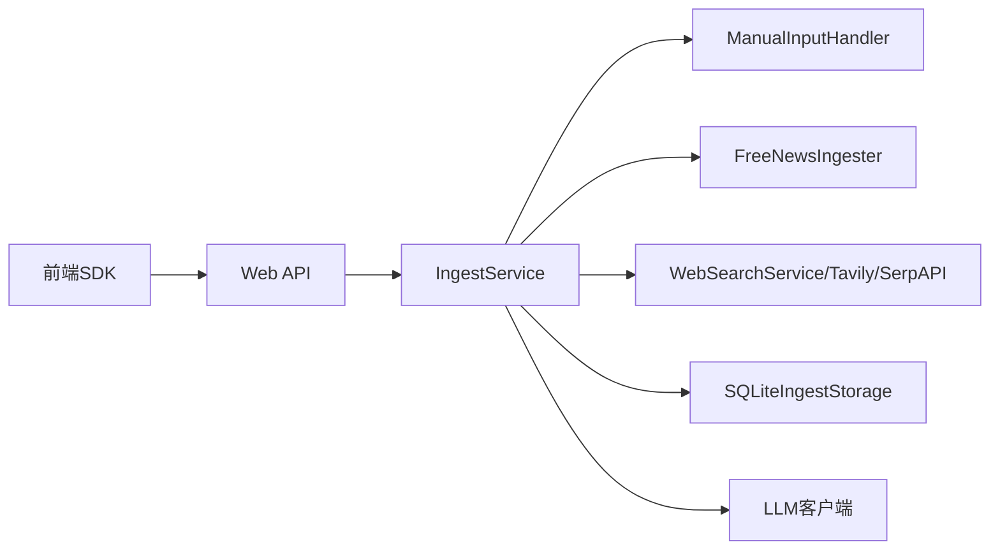

# 数据摄入API

<cite>
**本文引用的文件**
- [odap/web/api/app.py](file://odap/web/api/app.py)
- [odap/biz/core/ontology/api/routes.py](file://odap/biz/core/ontology/api/routes.py)
- [odap/biz/core/ontology/services/ingest_service.py](file://odap/biz/core/ontology/services/ingest_service.py)
- [odap/biz/core/ontology/ingestion_split/__init__.py](file://odap/biz/core/ontology/ingestion_split/__init__.py)
- [odap/biz/core/ontology/ingestion_split/free_news_ingester.py](file://odap/biz/core/ontology/ingestion_split/free_news_ingester.py)
- [odap/biz/core/ontology/ingestion_split/manual_input.py](file://odap/biz/core/ontology/ingestion_split/manual_input.py)
- [odap/biz/core/ontology/storage/sqlite_ingest_storage.py](file://odap/biz/core/ontology/storage/sqlite_ingest_storage.py)
- [odap/biz/core/ontology/schema/document.py](file://odap/biz/core/ontology/schema/document.py)
- [odap/web/ws/event_bus.py](file://odap/web/ws/event_bus.py)
- [frontend/src/modules/shared/services/api.ts](file://frontend/src/modules/shared/services/api.ts)
- [tests/integration/test_ingest_pipeline.py](file://tests/integration/test_ingest_pipeline.py)
- [docs/02-architecture/ARCHITECTURE_EVOLVE.md](file://docs/02-architecture/ARCHITECTURE_EVOLVE.md)
- [docs/07-adr/ADR-031_simulator_web_visualization_realtime_ontology.md](file://docs/07-adr/ADR-031_simulator_web_visualization_realtime_ontology.md)
</cite>

## 目录
1. [简介](#简介)
2. [项目结构](#项目结构)
3. [核心组件](#核心组件)
4. [架构总览](#架构总览)
5. [详细组件分析](#详细组件分析)
6. [依赖分析](#依赖分析)
7. [性能考虑](#性能考虑)
8. [故障排查指南](#故障排查指南)
9. [结论](#结论)
10. [附录](#附录)

## 简介
本文件为 ODAP 平台“数据摄入API”的权威参考文档，覆盖新闻摄入、手动输入、JSON数据、自然语言文本、随机事件生成、Tavily搜索等多种数据源的使用方法。文档详细说明请求参数、响应格式、使用场景与最佳实践，并提供完整的API调用示例（包含 curl 命令与前端调用方式）。同时解释数据摄入的异步处理机制与状态查询方法，明确不同数据源的配置要求与限制条件，为数据工程师与本体设计师提供准确的技术参考。

## 项目结构
ODAP 的数据摄入能力由三层组成：
- Web 层：提供 REST API 与 WebSocket 事件推送，负责接收请求、调度处理与状态反馈。
- 业务层：统一的摄入服务与数据源适配器，负责解析、抽取、标准化与持久化。
- 基础设施层：SQLite 存储、LLM 客户端、搜索服务、事件总线等基础设施。

**图示来源**
- [odap/web/api/app.py:1-862](file://odap/web/api/app.py#L1-L862)
- [odap/biz/core/ontology/api/routes.py:1-200](file://odap/biz/core/ontology/api/routes.py#L1-L200)
- [odap/biz/core/ontology/services/ingest_service.py:1-972](file://odap/biz/core/ontology/services/ingest_service.py#L1-L972)
- [odap/biz/core/ontology/storage/sqlite_ingest_storage.py:1-200](file://odap/biz/core/ontology/storage/sqlite_ingest_storage.py#L1-L200)

**章节来源**
- [odap/web/api/app.py:1-862](file://odap/web/api/app.py#L1-L862)
- [odap/biz/core/ontology/api/routes.py:1-200](file://odap/biz/core/ontology/api/routes.py#L1-L200)

## 核心组件
- Web API 路由与控制器
  - 提供统一的摄入入口与各数据源专用接口，支持同步响应与异步后台处理。
  - 示例：/api/ingest/text、/api/ingest/news、/api/ingest/random；以及 /api/ontology/ingest/* 通用接口。
- 摄入服务 IngestService
  - 统一编排各类数据源（URL/新闻/Tavily/手动/JSON/自然语言/随机事件），负责记录创建、处理与完成。
- 数据源适配器
  - 手动输入 ManualInputHandler：表单/JSON/自然语言 → OntologyDocument。
  - 免费新闻 FreeNewsIngester：本地网页抓取 + LLM 规则抽取。
  - 随机事件 RandomEventGenerator：按涉事方与上下文生成事件。
- 存储与审计
  - SQLiteIngestStorage：摄入记录、文档、版本、实体注册表、审计日志等。
- 文档模型
  - OntologyDocument：统一的本体文档结构，包含实体、关系、事件、动作、规则、约束等。

**章节来源**
- [odap/biz/core/ontology/services/ingest_service.py:330-793](file://odap/biz/core/ontology/services/ingest_service.py#L330-L793)
- [odap/biz/core/ontology/ingestion_split/manual_input.py:65-200](file://odap/biz/core/ontology/ingestion_split/manual_input.py#L65-L200)
- [odap/biz/core/ontology/ingestion_split/free_news_ingester.py:24-46](file://odap/biz/core/ontology/ingestion_split/free_news_ingester.py#L24-L46)
- [odap/biz/core/ontology/storage/sqlite_ingest_storage.py:17-200](file://odap/biz/core/ontology/storage/sqlite_ingest_storage.py#L17-L200)
- [odap/biz/core/ontology/schema/document.py:1-200](file://odap/biz/core/ontology/schema/document.py#L1-L200)

## 架构总览
ODAP 的数据摄入采用“Web 控制器 → 业务服务 → 数据源适配器 → 存储/LLM”的分层架构。前端通过 REST API 发起摄入请求，Web 层根据数据源类型调用相应适配器；对于耗时任务（如联网检索、LLM 抽取），采用异步后台处理与状态查询机制；最终将标准化的 OntologyDocument 写入存储并触发本体版本化。

**图示来源**
- [odap/biz/core/ontology/api/routes.py:74-125](file://odap/biz/core/ontology/api/routes.py#L74-L125)
- [odap/biz/core/ontology/services/ingest_service.py:330-793](file://odap/biz/core/ontology/services/ingest_service.py#L330-L793)
- [odap/biz/core/ontology/storage/sqlite_ingest_storage.py:62-118](file://odap/biz/core/ontology/storage/sqlite_ingest_storage.py#L62-L118)

## 详细组件分析

### 通用摄入接口 /api/ontology/ingest
- 功能：统一入口，根据 source_type 调度到不同摄入方法。
- 请求参数
  - source_type: news | manual | json | natural_language | random | tavily
  - data: 根据 source_type 传入不同数据
  - event_context: 事件背景（新闻/搜索场景）
  - max_sources: 最大来源数（新闻/搜索）
  - search_depth: 搜索深度（tavily）
  - parties / scenario_context / count: 随机事件参数
  - scenario_id: 场景ID（可选）
- 响应
  - ingest_id: 摄入记录ID
  - status: 当前状态
  - source_details / original_content / extracted_data: 摄入详情

**图示来源**
- [odap/biz/core/ontology/api/routes.py:74-125](file://odap/biz/core/ontology/api/routes.py#L74-L125)
- [odap/biz/core/ontology/services/ingest_service.py:373-536](file://odap/biz/core/ontology/services/ingest_service.py#L373-L536)

**章节来源**
- [odap/biz/core/ontology/api/routes.py:74-125](file://odap/biz/core/ontology/api/routes.py#L74-L125)

### 新闻摄入 /api/ontology/ingest/news
- 功能：支持 URL 直取与关键词检索两种模式。URL 模式使用免费网页抓取；关键词模式使用搜索引擎检索（优先 Tavily，其次 SerpAPI，最后 DuckDuckGo）。
- 请求参数
  - data: URL 或关键词
  - event_context: 事件背景
  - max_sources: 最大来源数
  - scenario_id: 场景ID
- 响应
  - ingest_id: 摄入记录ID
  - status: 状态
  - source_details / original_content / extracted_data: 源信息、原始内容、抽取结果

**图示来源**
- [odap/biz/core/ontology/api/routes.py:127-162](file://odap/biz/core/ontology/api/routes.py#L127-L162)
- [odap/biz/core/ontology/services/ingest_service.py:420-476](file://odap/biz/core/ontology/services/ingest_service.py#L420-L476)
- [odap/biz/core/ontology/services/search_service.py:162-232](file://odap/biz/core/ontology/services/search_service.py#L162-L232)

**章节来源**
- [odap/biz/core/ontology/api/routes.py:127-162](file://odap/biz/core/ontology/api/routes.py#L127-L162)
- [odap/biz/core/ontology/services/ingest_service.py:420-476](file://odap/biz/core/ontology/services/ingest_service.py#L420-L476)

### 手动输入 /api/ontology/ingest/manual
- 功能：支持表单数据、JSON 字符串与自然语言三种输入，统一转换为 OntologyDocument。
- 请求参数
  - data: 字符串或对象
  - scenario_id: 场景ID
- 响应
  - ingest_id: 摄入记录ID
  - status: 状态
  - source_details / original_content / extracted_data: 溯源信息

**章节来源**
- [odap/biz/core/ontology/api/routes.py:164-179](file://odap/biz/core/ontology/api/routes.py#L164-L179)
- [odap/biz/core/ontology/services/ingest_service.py:538-595](file://odap/biz/core/ontology/services/ingest_service.py#L538-L595)
- [odap/biz/core/ontology/ingestion_split/manual_input.py:78-145](file://odap/biz/core/ontology/ingestion_split/manual_input.py#L78-L145)

### JSON 数据 /api/ontology/ingest/json
- 功能：校验 JSON 符合 OntologyDocument Schema 后转换为文档。
- 请求参数
  - data: JSON 字符串
  - scenario_id: 场景ID
- 响应
  - ingest_id: 摄入记录ID
  - status: 状态
  - source_details / original_content / extracted_data: 溯源信息

**章节来源**
- [odap/biz/core/ontology/api/routes.py:181-196](file://odap/biz/core/ontology/api/routes.py#L181-L196)
- [odap/biz/core/ontology/services/ingest_service.py:597-638](file://odap/biz/core/ontology/services/ingest_service.py#L597-L638)

### 自然语言文本 /api/ontology/ingest/natural-language
- 功能：将自然语言通过 LLM 抽取为结构化实体/关系/事件，或降级为规则提取。
- 请求参数
  - data: 文本
  - scenario_id: 场景ID
- 响应
  - ingest_id: 摄入记录ID
  - status: 状态
  - source_details / original_content / extracted_data: 溯源信息

**章节来源**
- [odap/biz/core/ontology/api/routes.py:198-200](file://odap/biz/core/ontology/api/routes.py#L198-L200)
- [odap/biz/core/ontology/services/ingest_service.py:640-681](file://odap/biz/core/ontology/services/ingest_service.py#L640-L681)
- [odap/biz/core/ontology/ingestion_split/manual_input.py:147-200](file://odap/biz/core/ontology/ingestion_split/manual_input.py#L147-L200)

### 随机事件生成 /api/ontology/ingest/random
- 功能：按指定涉事方与上下文生成随机事件，支持多种生成器类型。
- 请求参数
  - data.parties: 涉事方数组
  - data.count: 事件数量（上限 20）
  - data.scenario_context: 场景上下文
  - scenario_id: 场景ID
- 响应
  - ingest_id: 摄入记录ID
  - status: 状态
  - source_details / original_content / extracted_data: 溯源信息

**章节来源**
- [odap/biz/core/ontology/api/routes.py:37-46](file://odap/biz/core/ontology/api/routes.py#L37-L46)
- [odap/biz/core/ontology/services/ingest_service.py:683-793](file://odap/biz/core/ontology/services/ingest_service.py#L683-L793)

### Tavily 搜索摄入 /api/ontology/ingest?tavily
- 功能：使用 Tavily API 进行搜索与抽取，需配置 TAVILY_API_KEY。
- 请求参数
  - data: 关键词
  - event_context: 事件背景
  - max_sources: 最大来源数
  - search_depth: basic/advanced
  - scenario_id: 场景ID
- 响应
  - ingest_id: 摄入记录ID
  - status: 状态
  - source_details / original_content / extracted_data: 溯源信息

**章节来源**
- [odap/biz/core/ontology/api/routes.py:41-46](file://odap/biz/core/ontology/api/routes.py#L41-L46)
- [odap/biz/core/ontology/services/ingest_service.py:478-536](file://odap/biz/core/ontology/services/ingest_service.py#L478-L536)

### 异步处理与状态查询
- Web 层对部分长耗时操作采用异步后台任务（如新闻摄入），立即返回任务标识，后续通过状态查询接口获取进度与结果。
- 前端可通过轮询 /api/ontology/ingest/status/{ingest_id} 获取状态，或订阅 WebSocket 事件流。

**图示来源**
- [odap/web/api/app.py:655-701](file://odap/web/api/app.py#L655-L701)
- [odap/web/ws/event_bus.py:88-124](file://odap/web/ws/event_bus.py#L88-L124)
- [odap/biz/core/ontology/api/routes.py:74-125](file://odap/biz/core/ontology/api/routes.py#L74-L125)

**章节来源**
- [odap/web/api/app.py:655-701](file://odap/web/api/app.py#L655-L701)
- [odap/web/ws/event_bus.py:88-124](file://odap/web/ws/event_bus.py#L88-L124)

### 数据模型与存储
- OntologyDocument：统一的本体文档结构，包含实体、关系、事件、动作、规则、约束等字段。
- SQLiteIngestStorage：持久化摄入记录、文档、版本、实体注册表与审计日志，支持 WAL 模式提升并发性能。

**图示来源**
- [odap/biz/core/ontology/storage/sqlite_ingest_storage.py:62-200](file://odap/biz/core/ontology/storage/sqlite_ingest_storage.py#L62-L200)
- [odap/biz/core/ontology/schema/document.py:103-200](file://odap/biz/core/ontology/schema/document.py#L103-L200)

**章节来源**
- [odap/biz/core/ontology/storage/sqlite_ingest_storage.py:17-200](file://odap/biz/core/ontology/storage/sqlite_ingest_storage.py#L17-L200)
- [odap/biz/core/ontology/schema/document.py:1-200](file://odap/biz/core/ontology/schema/document.py#L1-L200)

## 依赖分析
- Web 层依赖业务层的 IngestService 与各数据源适配器。
- 业务层依赖 LLM 客户端与搜索服务，搜索服务支持 Tavily、SerpAPI、DuckDuckGo 等。
- 存储层提供摄入记录、文档、版本与实体注册表的持久化能力。
- 前端通过统一的 SDK 封装调用 Web API。

**图示来源**
- [odap/biz/core/ontology/api/routes.py:1-200](file://odap/biz/core/ontology/api/routes.py#L1-L200)
- [odap/biz/core/ontology/services/ingest_service.py:330-793](file://odap/biz/core/ontology/services/ingest_service.py#L330-L793)
- [odap/biz/core/ontology/ingestion_split/__init__.py:8-18](file://odap/biz/core/ontology/ingestion_split/__init__.py#L8-L18)

**章节来源**
- [odap/biz/core/ontology/ingestion_split/__init__.py:8-18](file://odap/biz/core/ontology/ingestion_split/__init__.py#L8-L18)

## 性能考虑
- 异步处理：对网络检索与 LLM 抽取等耗时操作采用异步后台任务，避免阻塞请求。
- 并发控制：建议在上游网关或负载均衡层限制并发，避免 LLM 与外部搜索服务过载。
- 存储优化：SQLite 使用 WAL 模式与索引，适合中小规模摄入；高并发场景建议评估迁移至关系型数据库。
- LLM 降级：当未配置 OPENAI_API_KEY 时，自然语言摄入将降级为规则提取，保证可用性但可能降低抽取质量。

[本节为通用指导，不涉及特定文件分析]

## 故障排查指南
- 常见错误
  - 400/422：请求参数缺失或格式错误（如 source_type 无效、data 为空）。
  - 500：内部异常，检查日志与 LLM/搜索服务可用性。
- 建议排查步骤
  - 确认请求体字段完整且符合模型定义。
  - 检查环境变量是否正确（OPENAI_API_KEY、TAVILY_API_KEY 等）。
  - 对于新闻摄入，确认 URL 可访问或关键词有效。
  - 通过 /api/ontology/ingest/status/{ingest_id} 查看详细错误与统计信息。
- 前端调用
  - 使用 SDK 的 ingestFrom* 方法封装请求，自动处理 scenario_id 与响应解析。

**章节来源**
- [tests/integration/test_ingest_pipeline.py:93-130](file://tests/integration/test_ingest_pipeline.py#L93-L130)
- [tests/integration/test_ingest_pipeline.py:300-319](file://tests/integration/test_ingest_pipeline.py#L300-L319)
- [frontend/src/modules/shared/services/api.ts:291-583](file://frontend/src/modules/shared/services/api.ts#L291-L583)

## 结论
ODAP 的数据摄入API提供了统一、可扩展的多数据源摄入能力，结合异步处理与完善的审计存储，能够满足从新闻、手动输入、JSON、自然语言到随机事件生成的多样化需求。通过合理的参数配置与最佳实践，数据工程师与本体设计师可以高效地将外部数据转化为标准化的本体文档，并纳入版本化管理与可视化展示。

[本节为总结性内容，不涉及特定文件分析]

## 附录

### 环境变量与配置
- OPENAI_API_KEY：LLM 客户端初始化与自然语言抽取。
- OPENAI_API_BASE / OPENAI_MODEL：LLM 基地址与模型名称。
- TAVILY_API_KEY：启用 Tavily 搜索摄入。
- NEO4J_*：图数据库连接（与本体存储相关）。
- OPA_URL：策略引擎地址（与权限控制相关）。
- REDIS_URL：缓存服务（与任务队列相关）。

**章节来源**
- [docs/02-architecture/ARCHITECTURE_EVOLVE.md:774-797](file://docs/02-architecture/ARCHITECTURE_EVOLVE.md#L774-L797)

### 数据源与限制
- URL 模式：免费网页抓取，无需 API Key，适合公开网页。
- 搜索模式：优先 Tavily（需 API Key），其次 SerpAPI（需 API Key），最后 DuckDuckGo（无需 API Key）。
- 随机事件：默认最多 20 条，支持多种生成器类型。
- 自然语言：可降级为规则提取，未配置 LLM 时仍可使用。

**章节来源**
- [docs/07-adr/ADR-031_simulator_web_visualization_realtime_ontology.md:71-91](file://docs/07-adr/ADR-031_simulator_web_visualization_realtime_ontology.md#L71-L91)
- [odap/biz/core/ontology/services/ingest_service.py:478-536](file://odap/biz/core/ontology/services/ingest_service.py#L478-L536)