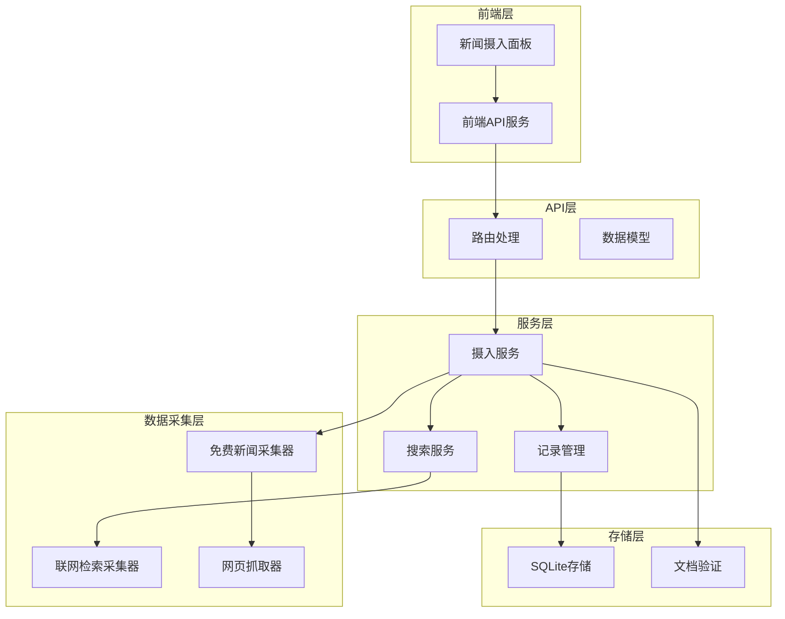
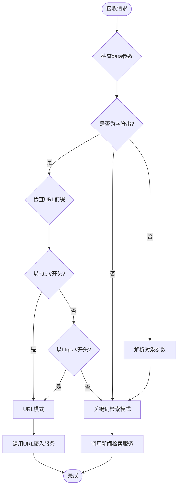
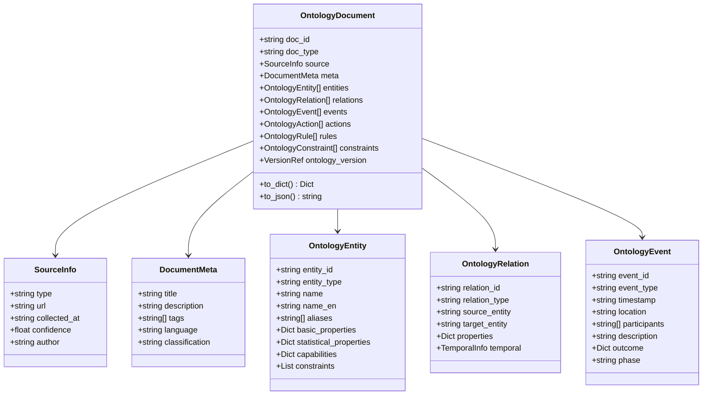
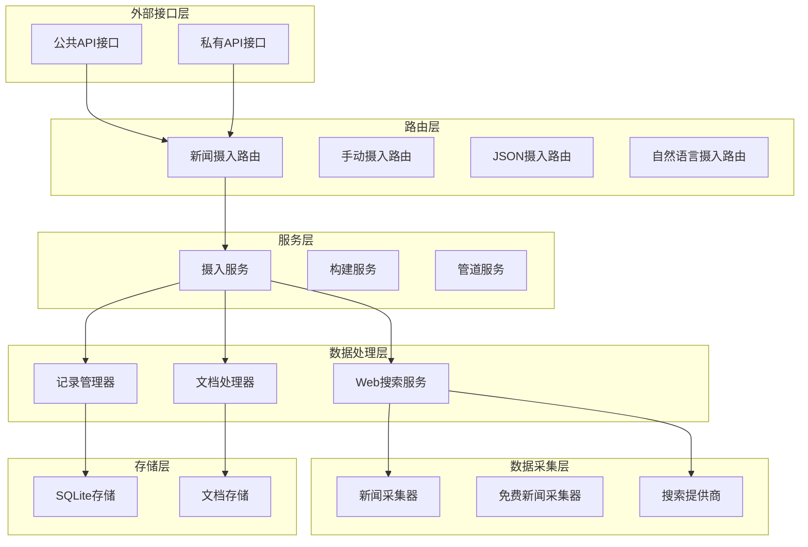
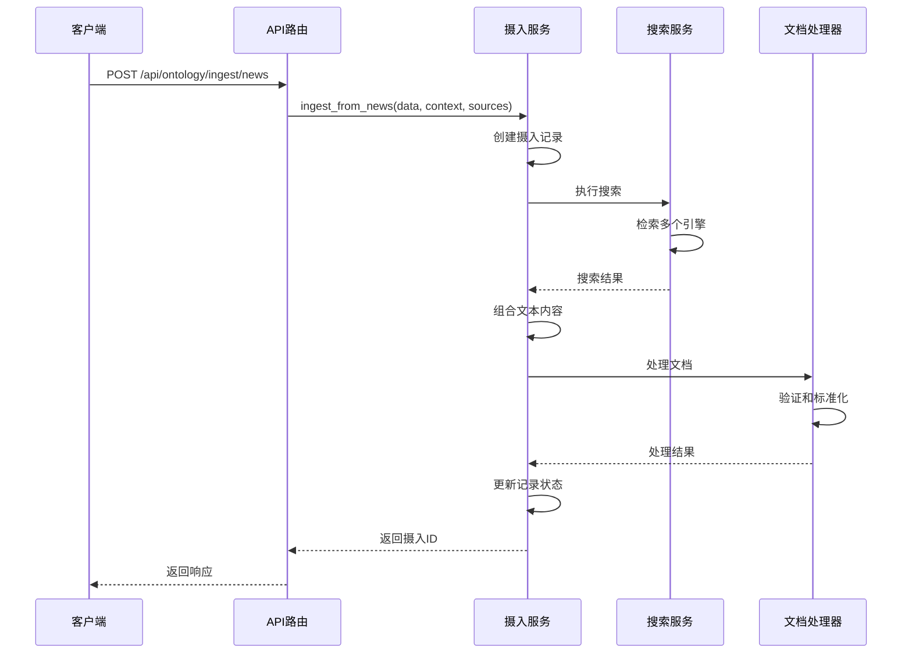
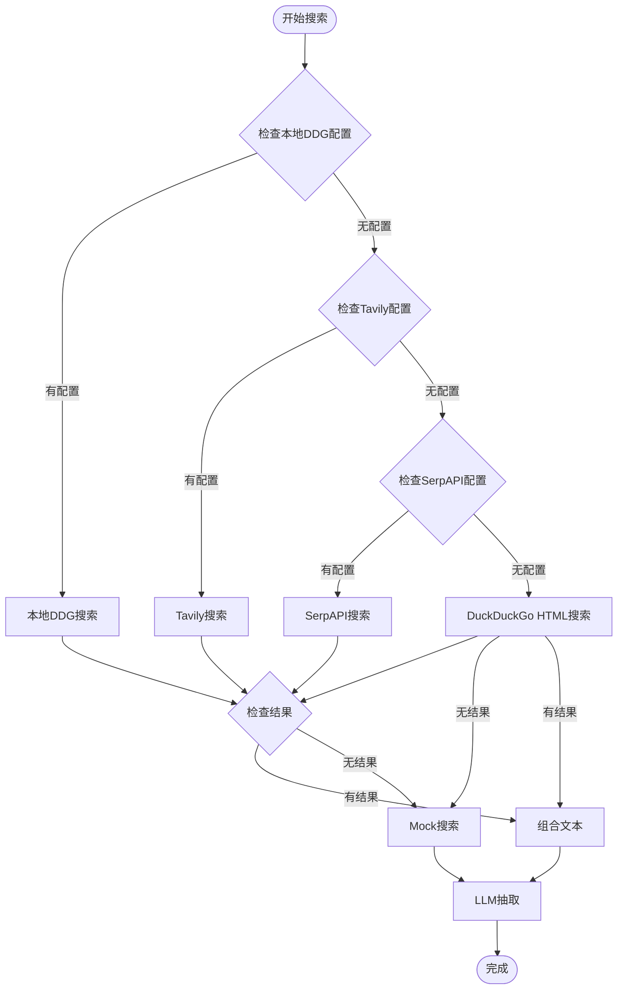
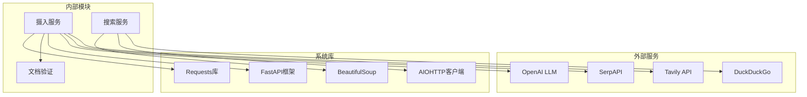

# 新闻摄入API

<cite>
**本文引用的文件**
- [odap/biz/core/ontology/api/routes.py](file://odap/biz/core/ontology/api/routes.py)
- [odap/biz/core/ontology/services/ingest_service.py](file://odap/biz/core/ontology/services/ingest_service.py)
- [odap/biz/core/ontology/ingestion_split/news_ingester.py](file://odap/biz/core/ontology/ingestion_split/news_ingester.py)
- [odap/biz/core/ontology/ingestion_split/free_news_ingester.py](file://odap/biz/core/ontology/ingestion_split/free_news_ingester.py)
- [odap/biz/core/ontology/schema/document.py](file://odap/biz/core/ontology/schema/document.py)
- [odap/biz/core/ontology/services/search_service.py](file://odap/biz/core/ontology/services/search_service.py)
- [frontend/src/modules/shared/services/api.ts](file://frontend/src/modules/shared/services/api.ts)
- [tests/integration/test_ingest_pipeline.py](file://tests/integration/test_ingest_pipeline.py)
- [frontend/src/modules/ingest/pages/IngestPanel.tsx](file://frontend/src/modules/ingest/pages/IngestPanel.tsx)
</cite>

## 目录
1. [简介](#简介)
2. [项目结构](#项目结构)
3. [核心组件](#核心组件)
4. [架构概览](#架构概览)
5. [详细组件分析](#详细组件分析)
6. [依赖关系分析](#依赖关系分析)
7. [性能考虑](#性能考虑)
8. [故障排除指南](#故障排除指南)
9. [结论](#结论)
10. [附录](#附录)

## 简介

ODAP平台的新闻摄入API为数据工程师提供了强大的新闻数据摄入能力，支持从新闻网站URL和关键词检索两种模式。该API实现了自动URL检测机制，能够智能区分URL模式和检索模式，并根据不同的模式选择相应的数据采集策略。

新闻摄入API的核心优势包括：
- **双模式支持**：同时支持URL直接抓取和关键词检索两种数据摄入模式
- **智能路由**：自动检测输入类型并选择最优的数据采集路径
- **多引擎检索**：集成多种搜索引擎，包括本地DuckDuckGo、Tavily、SerpAPI等
- **结构化输出**：将非结构化的新闻内容转换为标准化的本体文档格式
- **场景化集成**：支持场景ID关联，便于后续的本体构建和知识图谱应用

## 项目结构

ODAP平台的新闻摄入功能采用分层架构设计，主要涉及以下核心模块：



**图表来源**
- [odap/biz/core/ontology/api/routes.py:13-16](file://odap/biz/core/ontology/api/routes.py#L13-L16)
- [odap/biz/core/ontology/services/ingest_service.py:330-353](file://odap/biz/core/ontology/services/ingest_service.py#L330-L353)

**章节来源**
- [odap/biz/core/ontology/api/routes.py:1-527](file://odap/biz/core/ontology/api/routes.py#L1-L527)
- [odap/biz/core/ontology/services/ingest_service.py:1-972](file://odap/biz/core/ontology/services/ingest_service.py#L1-L972)

## 核心组件

### 新闻摄入请求模型

NewsIngestRequest是新闻摄入API的核心请求模型，定义了完整的参数结构：

| 参数名称 | 类型 | 必填 | 默认值 | 描述 |
|---------|------|------|--------|------|
| data | string \| object | 是 | - | 新闻数据，可以是URL字符串或包含查询参数的对象 |
| event_context | string | 否 | "" | 事件背景描述，用于指导LLM理解上下文 |
| max_sources | integer | 否 | 5 | 最大检索来源数量 |
| scenario_id | string | 否 | null | 场景ID，用于关联特定的业务场景 |

### 自动URL检测机制

系统实现了智能的URL检测机制，能够自动识别输入是URL还是关键词：



**图表来源**
- [odap/biz/core/ontology/api/routes.py:138-152](file://odap/biz/core/ontology/api/routes.py#L138-L152)

### 数据模型标准化

系统使用标准化的OntologyDocument格式来表示结构化数据：



**图表来源**
- [odap/biz/core/ontology/schema/document.py:212-275](file://odap/biz/core/ontology/schema/document.py#L212-L275)

**章节来源**
- [odap/biz/core/ontology/api/routes.py:19-24](file://odap/biz/core/ontology/api/routes.py#L19-L24)
- [odap/biz/core/ontology/schema/document.py:1-575](file://odap/biz/core/ontology/schema/document.py#L1-L575)

## 架构概览

ODAP平台的新闻摄入API采用分层架构设计，实现了高内聚、低耦合的系统结构：



**图表来源**
- [odap/biz/core/ontology/api/routes.py:13-16](file://odap/biz/core/ontology/api/routes.py#L13-L16)
- [odap/biz/core/ontology/services/ingest_service.py:330-353](file://odap/biz/core/ontology/services/ingest_service.py#L330-L353)

## 详细组件分析

### 新闻摄入服务

IngestService是新闻摄入功能的核心服务类，负责协调整个数据摄入流程：

#### 主要功能特性

1. **多模式摄入支持**
   - URL模式：直接抓取网页内容
   - 检索模式：通过关键词搜索获取相关内容
   - 手动模式：人工输入的数据处理
   - JSON模式：结构化数据的解析
   - 自然语言模式：文本内容的结构化提取

2. **智能路由机制**
   - 自动检测输入类型
   - 动态选择最优的数据采集策略
   - 错误处理和降级机制

3. **数据验证和标准化**
   - 使用OntologyDocumentSchema进行数据验证
   - 确保输出数据的结构一致性
   - 提供详细的错误信息

#### 核心方法分析



**图表来源**
- [odap/biz/core/ontology/api/routes.py:127-162](file://odap/biz/core/ontology/api/routes.py#L127-L162)
- [odap/biz/core/ontology/services/ingest_service.py:420-476](file://odap/biz/core/ontology/services/ingest_service.py#L420-L476)

**章节来源**
- [odap/biz/core/ontology/services/ingest_service.py:330-793](file://odap/biz/core/ontology/services/ingest_service.py#L330-L793)

### 搜索服务架构

WebSearchService提供了统一的搜索接口，支持多种搜索提供商：

#### 搜索引擎集成

| 引擎名称 | 用途 | 配置要求 | 优先级 |
|---------|------|----------|--------|
| 本地DuckDuckGo | 首选搜索 | DDG_API_URL | 1 |
| Tavily | 高质量搜索 | TAVILY_API_KEY | 2 |
| SerpAPI | Google搜索 | SERPAPI_KEY | 3 |
| DuckDuckGo HTML | 免费替代 | 无 | 4 |
| Mock | 降级备用 | 无 | 5 |

#### 搜索流程



**图表来源**
- [odap/biz/core/ontology/ingestion_split/news_ingester.py:152-185](file://odap/biz/core/ontology/ingestion_split/news_ingester.py#L152-L185)

**章节来源**
- [odap/biz/core/ontology/ingestion_split/news_ingester.py:75-120](file://odap/biz/core/ontology/ingestion_split/news_ingester.py#L75-L120)

### 前端API集成

前端提供了完整的API集成示例，支持多种编程语言：

#### curl命令示例

**URL模式摄入**
```bash
curl -X POST "http://localhost:8000/api/ontology/ingest/news" \
  -H "Content-Type: application/json" \
  -d '{
    "data": "https://www.example-news.com/military/conflict-2026",
    "event_context": "军事冲突",
    "scenario_id": "scenario-001"
  }'
```

**关键词检索模式**
```bash
curl -X POST "http://localhost:8000/api/ontology/ingest/news" \
  -H "Content-Type: application/json" \
  -d '{
    "data": "乌克兰东部前线战况",
    "event_context": "俄乌冲突",
    "max_sources": 5,
    "scenario_id": "scenario-001"
  }'
```

#### Python代码示例

**使用requests库**
```python
import requests
import json

def ingest_news_from_url(url, scenario_id=None):
    """从URL摄入新闻数据"""
    api_url = "http://localhost:8000/api/ontology/ingest/news"
    
    payload = {
        "data": url,
        "event_context": "军事冲突",
        "scenario_id": scenario_id
    }
    
    response = requests.post(api_url, json=payload)
    return response.json()

def ingest_news_from_keyword(keyword, scenario_id=None):
    """从关键词检索新闻数据"""
    api_url = "http://localhost:8000/api/ontology/ingest/news"
    
    payload = {
        "data": keyword,
        "event_context": "军事冲突",
        "max_sources": 5,
        "scenario_id": scenario_id
    }
    
    response = requests.post(api_url, json=payload)
    return response.json()
```

**使用JavaScript/TypeScript**
```typescript
// 前端API服务调用
const response = await api.ingestFromNews({
  data: "乌克兰东部前线战况",
  event_context: "俄乌冲突",
  max_sources: 5,
  scenario_id: "scenario-001"
});

console.log("摄入ID:", response.ingest_id);
console.log("状态:", response.status);
```

**章节来源**
- [frontend/src/modules/shared/services/api.ts:298-312](file://frontend/src/modules/shared/services/api.ts#L298-L312)
- [frontend/src/modules/ingest/pages/IngestPanel.tsx:443-460](file://frontend/src/modules/ingest/pages/IngestPanel.tsx#L443-L460)

## 依赖关系分析

### 外部依赖

ODAP平台的新闻摄入API依赖于多个外部服务和库：



**图表来源**
- [odap/biz/core/ontology/ingestion_split/news_ingester.py:92-97](file://odap/biz/core/ontology/ingestion_split/news_ingester.py#L92-L97)
- [odap/biz/core/ontology/services/search_service.py:183-232](file://odap/biz/core/ontology/services/search_service.py#L183-L232)

### 环境变量配置

系统支持多种环境变量配置：

| 环境变量 | 用途 | 示例值 |
|---------|------|--------|
| TAVILY_API_KEY | Tavily API密钥 | sk-tavily-xxxxxxxx |
| SERPAPI_KEY | SerpAPI密钥 | xxxxxxxxxxxxxxxxxxxxxxxxxxxxxxxx |
| DDG_API_URL | 本地DuckDuckGo API地址 | http://localhost:3000 |
| OPENAI_API_KEY | OpenAI API密钥 | sk-xxxxxxxxxxxxxxxxxxxxxxxxxxxxxxxx |
| OPENAI_API_BASE | OpenAI API基础URL | https://api.openai.com/v1 |
| OPENAI_MODEL | OpenAI模型名称 | gpt-4-turbo |

**章节来源**
- [odap/biz/core/ontology/ingestion_split/news_ingester.py:92-97](file://odap/biz/core/ontology/ingestion_split/news_ingester.py#L92-L97)
- [odap/biz/core/ontology/services/ingest_service.py:354-371](file://odap/biz/core/ontology/services/ingest_service.py#L354-L371)

## 性能考虑

### 搜索性能优化

1. **并发搜索**：系统支持多引擎并发搜索，提高响应速度
2. **结果缓存**：对热门关键词进行结果缓存，减少重复搜索
3. **超时控制**：为每个搜索引擎设置合理的超时时间
4. **负载均衡**：自动分配搜索请求到可用的引擎

### 数据处理优化

1. **异步处理**：采用异步I/O操作，避免阻塞主线程
2. **批量处理**：支持批量文档处理，提高吞吐量
3. **内存管理**：合理控制内存使用，避免内存泄漏
4. **错误重试**：对临时性错误进行自动重试

### 存储优化

1. **SQLite优化**：使用SQLite进行高效的数据存储
2. **索引策略**：为常用查询字段建立索引
3. **事务管理**：使用数据库事务保证数据一致性
4. **清理策略**：定期清理过期数据，保持数据库性能

## 故障排除指南

### 常见错误及解决方案

#### 1. API密钥配置错误

**错误现象**：Tavily搜索失败，返回API密钥错误

**解决方案**：
```bash
# 设置正确的API密钥
export TAVILY_API_KEY="sk-tavily-your-actual-key-here"

# 验证配置
curl -X POST "http://localhost:8000/api/ontology/ingest/tavily" \
  -H "Content-Type: application/json" \
  -d '{
    "data": "test query",
    "max_sources": 3
  }'
```

#### 2. URL抓取失败

**错误现象**：URL模式摄入失败，返回网页抓取错误

**解决方案**：
- 检查URL是否可访问
- 验证目标网站的robots.txt规则
- 确认网络连接正常
- 查看服务器日志获取详细错误信息

#### 3. LLM提取失败

**错误现象**：LLM抽取失败，返回空结果

**解决方案**：
```bash
# 检查OpenAI API配置
export OPENAI_API_KEY="your-actual-key-here"
export OPENAI_API_BASE="https://api.openai.com/v1"

# 测试LLM连接
python -c "
from odap.infra.llm.llm_service import ZhipuAIClient
from graphiti_core.llm_client.config import LLMConfig
config = LLMConfig(model='gpt-4-turbo', api_key='your-key')
client = ZhipuAIClient(config)
print('LLM连接成功')
"
```

#### 4. 数据验证失败

**错误现象**：摄入的数据无法通过Schema验证

**解决方案**：
- 检查数据格式是否符合OntologyDocument规范
- 验证必需字段是否完整
- 确认数据类型是否正确
- 查看详细的验证错误信息

### 调试工具

#### 1. API状态检查

```bash
# 检查API健康状态
curl http://localhost:8000/api/ontology/ingest

# 获取摄入历史
curl "http://localhost:8000/api/ontology/ingest?limit=10"

# 获取特定摄入记录
curl http://localhost:8000/api/ontology/ingest/{ingest_id}
```

#### 2. 日志监控

系统提供了详细的日志记录功能，可以通过以下方式查看：

```bash
# 查看API日志
tail -f /var/log/odap/api.log

# 查看摄入服务日志
tail -f /var/log/odap/ingest_service.log

# 查看搜索服务日志
tail -f /var/log/odap/search_service.log
```

**章节来源**
- [odap/biz/core/ontology/api/routes.py:252-292](file://odap/biz/core/ontology/api/routes.py#L252-L292)
- [odap/biz/core/ontology/services/ingest_service.py:354-371](file://odap/biz/core/ontology/services/ingest_service.py#L354-L371)

## 结论

ODAP平台的新闻摄入API为数据工程师提供了一个强大而灵活的新闻数据处理解决方案。通过智能的URL检测机制、多引擎搜索集成和标准化的数据处理流程，该API能够高效地将非结构化的新闻内容转换为结构化的本体数据。

### 主要优势

1. **智能化路由**：自动识别URL和关键词输入，选择最优的数据采集策略
2. **多引擎集成**：支持多种搜索提供商，确保数据获取的可靠性
3. **标准化输出**：使用OntologyDocument格式，保证数据的一致性和可扩展性
4. **场景化支持**：通过scenario_id实现数据的场景化管理和关联
5. **完善的错误处理**：提供详细的错误信息和降级机制

### 应用场景

- **实时新闻监控**：自动抓取和分析新闻内容
- **事件情报分析**：从新闻中提取结构化事件信息
- **知识图谱构建**：为本体构建提供高质量的数据源
- **业务场景集成**：支持特定业务场景的数据摄入需求

### 未来发展

随着AI技术的不断发展，ODAP平台的新闻摄入API将继续优化和扩展，包括：
- 更智能的内容理解和抽取
- 更丰富的数据预处理功能
- 更高效的批量处理能力
- 更完善的质量评估机制

## 附录

### API使用最佳实践

#### 1. URL模式使用建议

- 确保URL可访问且内容丰富
- 合理设置event_context以提高抽取准确性
- 使用合适的scenario_id进行数据分类

#### 2. 关键词检索建议

- 选择精确的关键词组合
- 合理设置max_sources参数
- 提供清晰的event_context描述

#### 3. 错误处理策略

- 实现重试机制处理临时性错误
- 记录详细的错误日志
- 提供用户友好的错误提示

#### 4. 性能优化建议

- 合理设置超时时间
- 使用异步处理提高吞吐量
- 实现结果缓存减少重复请求

### 相关文档链接

- [FastAPI官方文档](https://fastapi.tiangolo.com/)
- [OpenAI API文档](https://platform.openai.com/docs/introduction)
- [Tavily API文档](https://tavily.com/docs)
- [SerpAPI文档](https://serpapi.com/)