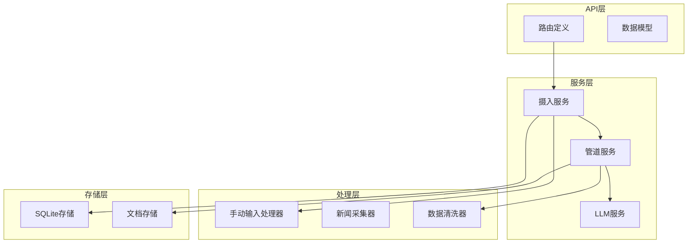
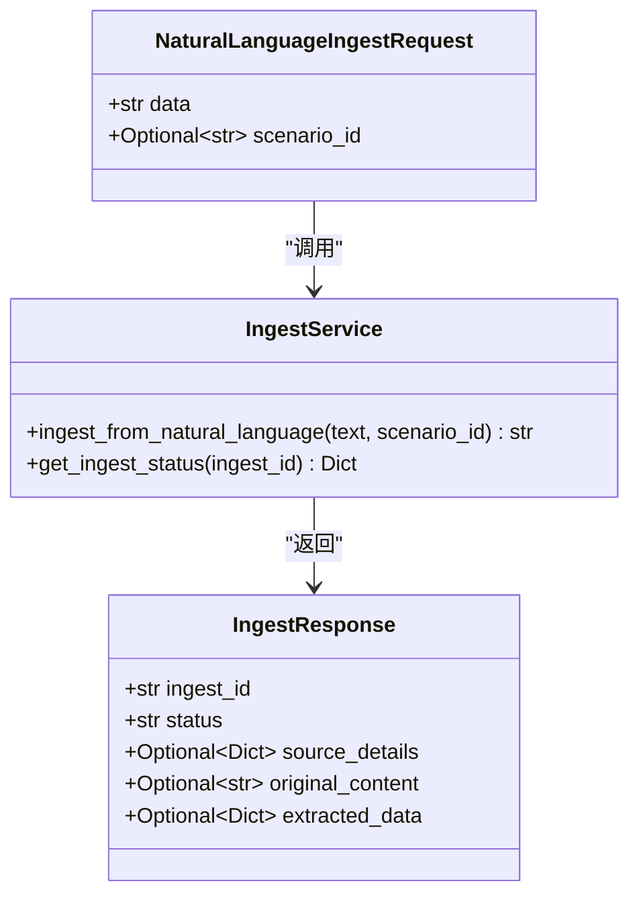
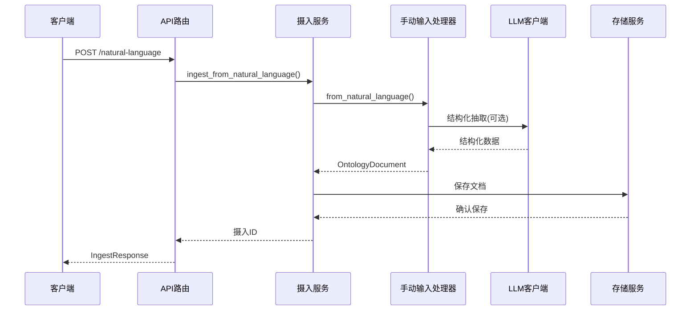
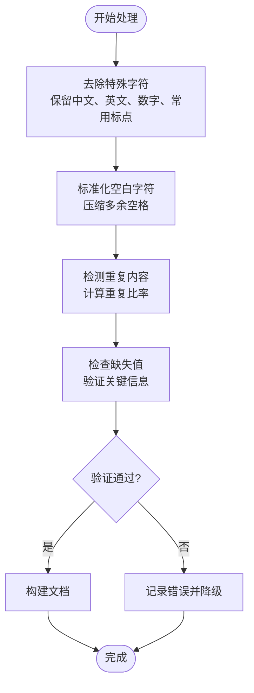
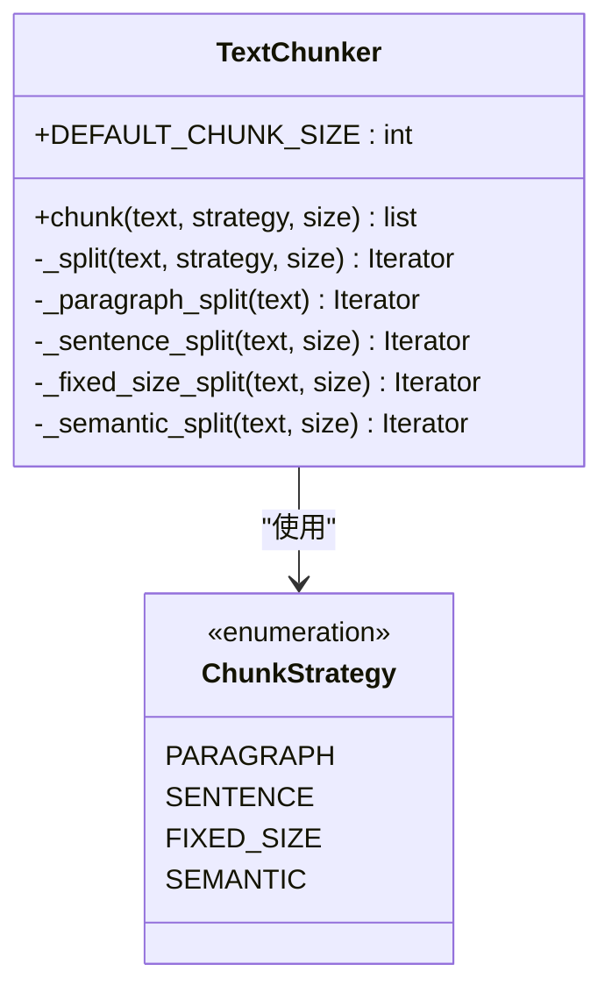
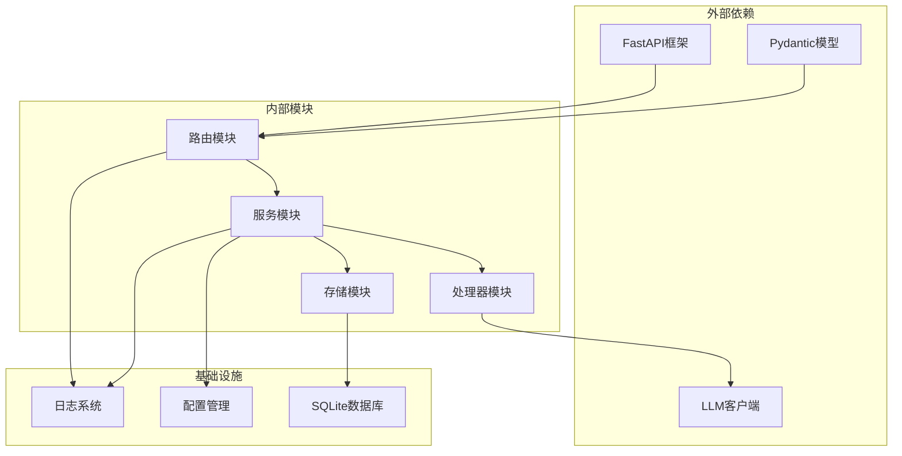

# 自然语言摄入API

<cite>
**本文档引用的文件**
- [routes.py](file://odap/biz/core/ontology/api/routes.py)
- [ingest_service.py](file://odap/biz/core/ontology/services/ingest_service.py)
- [ingestion.py](file://odap/biz/core/ontology/ingestion_split/ingestion.py)
- [llm_service.py](file://odap/infra/llm/llm_service.py)
- [pipeline_service.py](file://odap/biz/core/ontology/services/pipeline_service.py)
- [test_ingest_pipeline.py](file://tests/integration/test_ingest_pipeline.py)
- [ARCHITECTURE_FULL_CHAIN_DEEP.md](file://docs/02-architecture/ARCHITECTURE_FULL_CHAIN_DEEP.md)
</cite>

## 目录
1. [简介](#简介)
2. [项目结构](#项目结构)
3. [核心组件](#核心组件)
4. [架构概览](#架构概览)
5. [详细组件分析](#详细组件分析)
6. [依赖关系分析](#依赖关系分析)
7. [性能考虑](#性能考虑)
8. [故障排除指南](#故障排除指南)
9. [结论](#结论)

## 简介

ODAP平台的自然语言摄入API是一个强大的文本处理系统，专为军事冲突场景设计。该API能够接收任意长度的自然语言文本，通过多阶段处理流程将其转换为结构化的本体文档，支持实体识别、关系抽取和事件建模。

该系统的核心优势在于其灵活的文本处理能力，支持从简单的自然语言描述到复杂的多实体交互场景。系统内置了智能的LLM集成机制，能够在有API密钥时提供高质量的结构化抽取，无API密钥时则提供降级的规则提取方案。

## 项目结构

自然语言摄入API位于ODAP平台的核心业务模块中，采用分层架构设计：

**图表来源**
- [routes.py:13-213](file://odap/biz/core/ontology/api/routes.py#L13-L213)
- [ingest_service.py:330-793](file://odap/biz/core/ontology/services/ingest_service.py#L330-L793)

**章节来源**
- [routes.py:1-527](file://odap/biz/core/ontology/api/routes.py#L1-L527)
- [ingest_service.py:1-972](file://odap/biz/core/ontology/services/ingest_service.py#L1-L972)

## 核心组件

### API路由定义

自然语言摄入API提供了两个主要的HTTP端点：

1. **通用摄入接口** (`POST /api/ontology/ingest`)
2. **专用自然语言接口** (`POST /api/ontology/ingest/natural-language`)

两个接口都支持相同的请求参数，但专用接口更加直观和明确。

### 数据模型定义

**图表来源**
- [routes.py:33-53](file://odap/biz/core/ontology/api/routes.py#L33-L53)
- [ingest_service.py:640-681](file://odap/biz/core/ontology/services/ingest_service.py#L640-L681)

**章节来源**
- [routes.py:33-213](file://odap/biz/core/ontology/api/routes.py#L33-L213)
- [ingest_service.py:640-681](file://odap/biz/core/ontology/services/ingest_service.py#L640-L681)

## 架构概览

自然语言摄入API采用流水线式处理架构，包含六个主要阶段：

**图表来源**
- [routes.py:198-213](file://odap/biz/core/ontology/api/routes.py#L198-L213)
- [ingest_service.py:640-681](file://odap/biz/core/ontology/services/ingest_service.py#L640-L681)
- [ingestion.py:645-722](file://odap/biz/core/ontology/ingestion_split/ingestion.py#L645-L722)

## 详细组件分析

### 自然语言处理流程

系统采用多阶段处理策略，确保从任意长度的自然语言文本中提取高质量的结构化信息：

#### 阶段一：文本预处理
- 去除特殊字符和噪声
- 标准化空白字符
- 检测重复内容
- 缺失值检测

#### 阶段二：LLM结构化抽取
- 实体识别：单位、位置、装备、事件等
- 关系抽取：实体间的关联关系
- 事件建模：冲突场景中的具体事件
- 动作分析：可执行的业务动作

#### 阶段三：文档构建
- 验证结构化数据的完整性
- 构建OntologyDocument对象
- 保存到数据库

### 文本清洗机制

系统实现了多层次的文本清洗策略：

**图表来源**
- [pipeline_service.py:357-446](file://odap/biz/core/ontology/services/pipeline_service.py#L357-L446)

**章节来源**
- [pipeline_service.py:350-549](file://odap/biz/core/ontology/services/pipeline_service.py#L350-L549)

### LLM集成机制

系统提供了灵活的LLM集成方案：

#### LLM客户端适配器
- 支持多种LLM提供商
- 统一的API接口
- 错误处理和降级机制

#### 结构化抽取流程
- 基于规则的简单提取
- LLM驱动的高级抽取
- 字段规范化和类型转换

**章节来源**
- [llm_service.py:22-439](file://odap/infra/llm/llm_service.py#L22-L439)
- [ingestion.py:493-550](file://odap/biz/core/ontology/ingestion_split/ingestion.py#L493-L550)

### 文本分段和关键信息提取

系统支持多种文本分段策略：

**图表来源**
- [ARCHITECTURE_FULL_CHAIN_DEEP.md:264-340](file://docs/02-architecture/ARCHITECTURE_FULL_CHAIN_DEEP.md#L264-L340)

**章节来源**
- [ARCHITECTURE_FULL_CHAIN_DEEP.md:256-340](file://docs/02-architecture/ARCHITECTURE_FULL_CHAIN_DEEP.md#L256-L340)

## 依赖关系分析

自然语言摄入API的依赖关系呈现清晰的分层结构：

**图表来源**
- [routes.py:1-16](file://odap/biz/core/ontology/api/routes.py#L1-L16)
- [ingest_service.py:1-29](file://odap/biz/core/ontology/services/ingest_service.py#L1-L29)

**章节来源**
- [routes.py:1-527](file://odap/biz/core/ontology/api/routes.py#L1-L527)
- [ingest_service.py:1-972](file://odap/biz/core/ontology/services/ingest_service.py#L1-L972)

## 性能考虑

### 处理性能优化

1. **异步处理**：所有LLM调用和数据库操作都采用异步模式
2. **缓存策略**：对频繁访问的数据进行缓存
3. **批量处理**：支持批量摄入多个文本
4. **内存管理**：及时释放不再使用的资源

### LLM调用优化

- **请求合并**：将多个小请求合并为较大的批次
- **超时控制**：设置合理的超时时间
- **重试机制**：网络异常时自动重试
- **成本控制**：监控和限制LLM调用次数

## 故障排除指南

### 常见问题及解决方案

#### API调用失败
- **症状**：HTTP 400或422错误
- **原因**：缺少必需参数或参数格式错误
- **解决方案**：检查请求参数的完整性和正确性

#### LLM功能不可用
- **症状**：系统降级为规则提取
- **原因**：未配置OPENAI_API_KEY
- **解决方案**：设置正确的API密钥或使用降级模式

#### 处理超时
- **症状**：长时间无响应
- **原因**：文本过长或LLM服务繁忙
- **解决方案**：分段处理文本或等待服务恢复

**章节来源**
- [test_ingest_pipeline.py:90-101](file://tests/integration/test_ingest_pipeline.py#L90-L101)

### 调试技巧

1. **查看摄入历史**：使用`GET /api/ontology/ingest/{ingest_id}`获取详细信息
2. **检查日志**：关注数据清洗和LLM处理阶段的日志
3. **验证数据**：确认输入文本的编码和格式正确
4. **测试LLM连接**：验证API密钥的有效性

## 结论

ODAP平台的自然语言摄入API为军事冲突场景提供了强大而灵活的文本处理能力。通过多阶段处理流程、智能的LLM集成和完善的错误处理机制，系统能够有效处理从简单描述到复杂交互的各种自然语言输入。

该API的主要优势包括：
- 支持任意长度的自然语言文本
- 智能的文本清洗和预处理
- 灵活的LLM集成和降级机制
- 完善的错误处理和监控
- 可扩展的架构设计

对于内容分析师和数据科学家而言，该API提供了可靠的技术基础，可以专注于更高层次的分析和决策制定。