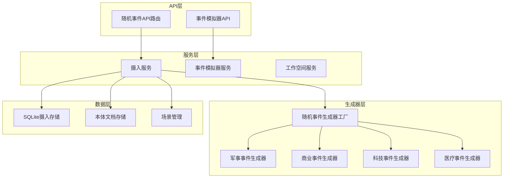
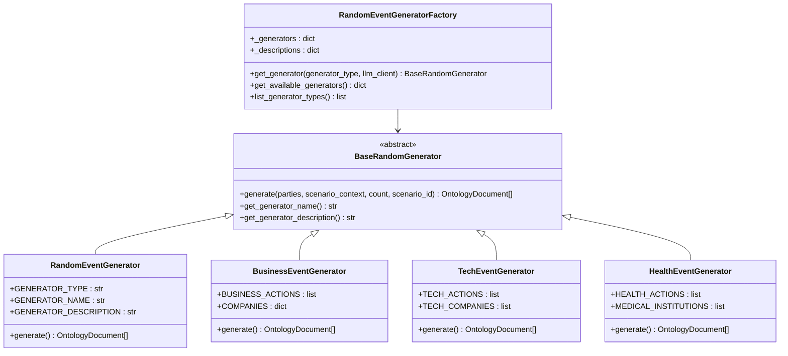
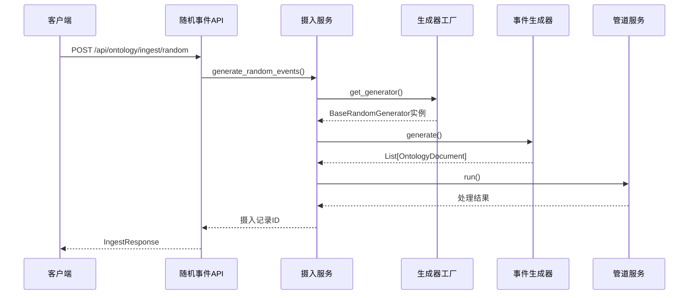
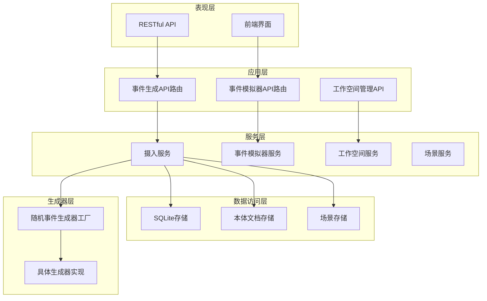
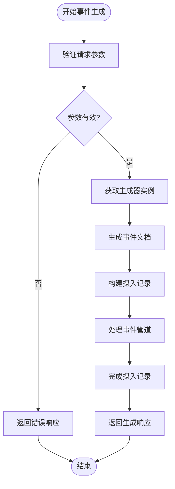
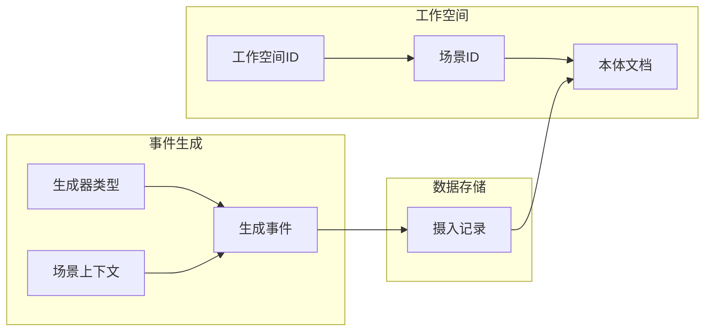
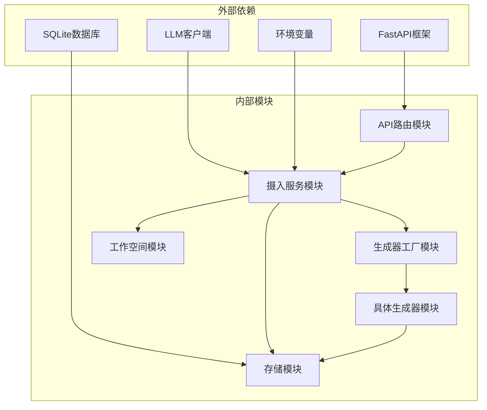

# 随机事件生成API

<cite>
**本文档引用的文件**
- [routes.py](file://odap/biz/core/ontology/api/routes.py)
- [ingest_service.py](file://odap/biz/core/ontology/services/ingest_service.py)
- [ingestion.py](file://odap/biz/core/ontology/ingestion_split/ingestion.py)
- [base_generator.py](file://odap/biz/core/ontology/ingestion_split/base_generator.py)
- [health_generator.py](file://odap/biz/core/ontology/ingestion_split/health_generator.py)
- [generator_factory.py](file://odap/biz/core/ontology/ingestion_split/generator_factory.py)
- [routes.py](file://odap/biz/simulation/event_simulator/api/routes.py)
- [simulator_service.py](file://odap/biz/simulation/event_simulator/services/simulator_service.py)
- [event.py](file://odap/biz/simulation/event_simulator/models/event.py)
- [routes.py](file://odap/biz/platform/workspace/api/routes.py)
- [app.py](file://odap/web/app.py)
</cite>

## 目录
1. [简介](#简介)
2. [项目结构](#项目结构)
3. [核心组件](#核心组件)
4. [架构概览](#架构概览)
5. [详细组件分析](#详细组件分析)
6. [依赖关系分析](#依赖关系分析)
7. [性能考虑](#性能考虑)
8. [故障排除指南](#故障排除指南)
9. [结论](#结论)

## 简介

ODAP平台的随机事件生成API是一个强大的工具，能够为仿真分析师和系统测试人员提供多样化的事件生成能力。该API支持四种主要的事件生成器类型：军事战争事件、商业事件、科技事件和医疗健康事件。

该API的核心功能包括：
- 支持多种事件生成器类型，满足不同领域的仿真需求
- 提供灵活的参数配置，包括参与方、场景上下文和事件数量
- 集成工作空间和场景管理系统，确保事件生成的上下文一致性
- 自动生成符合本体文档格式的结构化事件数据
- 提供完整的事件生成流水线，包括摄入、处理和存储

## 项目结构

随机事件生成API位于ODAP平台的本体数据采集层，与整个系统的架构紧密集成：

**图表来源**
- [routes.py:215-243](file://odap/biz/core/ontology/api/routes.py#L215-L243)
- [ingest_service.py:330-352](file://odap/biz/core/ontology/services/ingest_service.py#L330-L352)
- [ingestion.py:1909-1948](file://odap/biz/core/ontology/ingestion_split/ingestion.py#L1909-L1948)

## 核心组件

### API路由组件

随机事件生成API的主要入口点位于本体数据采集模块中，提供了RESTful接口来处理事件生成请求。

**核心API端点**：
- `POST /api/ontology/ingest/random` - 主要的随机事件生成端点
- `GET /api/ontology/ingest/random/generators` - 获取可用的生成器类型列表

### 事件生成器工厂

事件生成器工厂是整个系统的核心组件，负责管理和创建不同类型的事件生成器：

**图表来源**
- [ingestion.py:1909-1948](file://odap/biz/core/ontology/ingestion_split/ingestion.py#L1909-L1948)
- [base_generator.py:14-47](file://odap/biz/core/ontology/ingestion_split/base_generator.py#L14-L47)
- [health_generator.py:24-47](file://odap/biz/core/ontology/ingestion_split/health_generator.py#L24-L47)

### 摄入服务组件

摄入服务负责协调整个事件生成流程，包括参数验证、生成器调用和结果处理：

**图表来源**
- [routes.py:215-243](file://odap/biz/core/ontology/api/routes.py#L215-L243)
- [ingest_service.py:683-793](file://odap/biz/core/ontology/services/ingest_service.py#L683-L793)

**章节来源**
- [routes.py:215-250](file://odap/biz/core/ontology/api/routes.py#L215-L250)
- [ingest_service.py:330-352](file://odap/biz/core/ontology/services/ingest_service.py#L330-L352)
- [ingestion.py:1909-1948](file://odap/biz/core/ontology/ingestion_split/ingestion.py#L1909-L1948)

## 架构概览

随机事件生成API采用分层架构设计，确保了良好的可维护性和扩展性：

**图表来源**
- [routes.py:13-16](file://odap/biz/core/ontology/api/routes.py#L13-L16)
- [simulator_service.py:9-16](file://odap/biz/simulation/event_simulator/services/simulator_service.py#L9-L16)
- [routes.py:423-454](file://odap/biz/platform/workspace/api/routes.py#L423-L454)

## 详细组件分析

### 随机事件生成器类型

系统支持四种主要的事件生成器类型，每种都有其特定的应用场景和特征：

#### 军事战争事件生成器
- **适用场景**：军事冲突、战争模拟、国防分析
- **事件类型**：进攻、巡逻、增援、撤退、侦察等
- **参与方**：军事单位、武器装备、地理位置
- **特点**：基于NetLogo多智能体行为模型的概率算法

#### 商业事件生成器
- **适用场景**：商业竞争、市场分析、企业战略
- **事件类型**：投资、并购、产品发布、市场变化等
- **参与方**：公司、金融机构、监管机构
- **特点**：涵盖科技、金融、制造业等多个行业

#### 科技事件生成器
- **适用场景**：技术创新、研发评估、技术趋势分析
- **事件类型**：技术突破、产品发布、研究合作等
- **参与方**：科技公司、研究机构、政府部门
- **特点**：关注前沿技术和创新成果

#### 医疗健康事件生成器
- **适用场景**：医疗研究、公共卫生、药物开发
- **事件类型**：新药审批、临床试验、医疗突破等
- **参与方**：医疗机构、制药公司、研究机构
- **特点**：涉及疾病治疗、疫苗研发、医疗设备

### 事件生成参数详解

#### RandomEventsRequest请求参数

| 参数名 | 类型 | 必填 | 描述 | 默认值 |
|--------|------|------|------|--------|
| data | Dict[str, Any] | 是 | 随机事件参数容器 | - |
| scenario_id | str | 否 | 场景ID，用于关联到特定场景 | None |

#### data对象参数

| 参数名 | 类型 | 必填 | 描述 | 默认值 |
|--------|------|------|------|--------|
| generator_type | str | 否 | 生成器类型：military/business/tech/healthcare | "military" |
| parties | List[str] | 否 | 参与方列表，用于事件生成 | None |
| scenario_context | Dict[str, Any] | 否 | 场景上下文，提供生成环境信息 | None |
| count | int | 否 | 生成事件数量 | 1 |
| workspace_id | str | 否 | 工作空间ID | "default" |

### 事件生成业务逻辑

事件生成过程遵循严格的业务逻辑和规则约束：

**图表来源**
- [ingest_service.py:683-793](file://odap/biz/core/ontology/services/ingest_service.py#L683-L793)
- [routes.py:215-243](file://odap/biz/core/ontology/api/routes.py#L215-L243)

### 事件格式规范

生成的事件遵循统一的本体文档格式，确保数据的一致性和可处理性：

#### 事件文档结构

| 字段 | 类型 | 描述 |
|------|------|------|
| doc_id | str | 文档唯一标识符 |
| doc_type | str | 文档类型（固定为"event"） |
| source | SourceInfo | 数据来源信息 |
| meta | DocumentMeta | 文档元数据 |
| entities | List[OntologyEntity] | 实体列表 |
| relations | List[OntologyRelation] | 关系列表 |
| events | List[OntologyEvent] | 事件列表 |
| actions | List[OntologyAction] | 行动列表 |
| rules | List[OntologyRule] | 规则列表 |
| constraints | List[OntologyConstraint] | 约束列表 |
| ontology_version | VersionRef | 本体版本信息 |

#### 事件属性结构

每个事件包含以下核心属性：

| 属性名 | 类型 | 描述 |
|--------|------|------|
| event_id | str | 事件唯一标识符 |
| event_type | str | 事件类型（如"attack"、"investment"等） |
| timestamp | str | 事件发生时间戳 |
| location | str | 事件发生地点 |
| participants | List[str] | 参与方实体ID列表 |
| description | str | 事件详细描述 |
| outcome | Dict[str, Any] | 事件结果信息 |
| phase | str | 事件阶段信息 |

### 工作空间和场景关联机制

系统通过工作空间和场景机制确保事件生成的上下文一致性：

**图表来源**
- [ingest_service.py:247-259](file://odap/biz/core/ontology/services/ingest_service.py#L247-L259)
- [routes.py:423-454](file://odap/biz/platform/workspace/api/routes.py#L423-L454)

**章节来源**
- [routes.py:37-39](file://odap/biz/core/ontology/api/routes.py#L37-L39)
- [ingest_service.py:683-793](file://odap/biz/core/ontology/services/ingest_service.py#L683-L793)
- [ingestion.py:1909-1948](file://odap/biz/core/ontology/ingestion_split/ingestion.py#L1909-L1948)

## 依赖关系分析

随机事件生成API的依赖关系体现了清晰的分层架构：

**图表来源**
- [routes.py:1-8](file://odap/biz/core/ontology/api/routes.py#L1-L8)
- [ingest_service.py:12-26](file://odap/biz/core/ontology/services/ingest_service.py#L12-L26)

### 核心依赖关系

1. **API框架依赖**：使用FastAPI提供RESTful API服务
2. **数据库依赖**：通过SQLite存储摄入记录和生成的事件
3. **LLM依赖**：可选的大型语言模型集成，用于增强事件描述
4. **环境配置依赖**：通过环境变量配置API密钥和模型参数

### 循环依赖检查

经过分析，系统中不存在循环依赖关系：
- API层不依赖服务层的具体实现
- 服务层依赖抽象接口而非具体实现
- 生成器工厂提供松耦合的组件创建机制

**章节来源**
- [routes.py:1-8](file://odap/biz/core/ontology/api/routes.py#L1-L8)
- [ingest_service.py:12-26](file://odap/biz/core/ontology/services/ingest_service.py#L12-L26)

## 性能考虑

随机事件生成API在设计时充分考虑了性能优化：

### 并发处理
- 异步事件生成支持高并发请求处理
- 事件生成器采用异步I/O操作
- 数据库操作使用连接池管理

### 缓存策略
- 生成器实例缓存，避免重复创建
- 场景上下文信息缓存
- LLM响应结果缓存（可选）

### 资源管理
- 自动资源清理和释放
- 内存使用监控和限制
- 数据库连接池大小优化

## 故障排除指南

### 常见错误及解决方案

#### 1. 生成器类型错误
**错误信息**：`未知的生成器类型: {type}`
**解决方案**：检查生成器类型是否在支持列表中

#### 2. 参数验证失败
**错误信息**：`参数验证失败`
**解决方案**：检查请求参数格式和必填字段

#### 3. LLM配置问题
**错误信息**：`LLM客户端初始化失败`
**解决方案**：检查OPENAI_API_KEY环境变量配置

#### 4. 数据库连接问题
**错误信息**：`数据库连接失败`
**解决方案**：检查数据库文件权限和连接配置

### 调试建议

1. **启用详细日志**：设置日志级别为DEBUG以获取详细信息
2. **参数验证**：在调用API前验证所有必需参数
3. **资源监控**：监控内存和CPU使用情况
4. **错误重试**：实现适当的错误重试机制

**章节来源**
- [routes.py:262-275](file://odap/biz/core/ontology/api/routes.py#L262-L275)
- [ingest_service.py:354-371](file://odap/biz/core/ontology/services/ingest_service.py#L354-L371)

## 结论

ODAP平台的随机事件生成API为仿真分析师和系统测试人员提供了强大而灵活的事件生成能力。通过支持多种事件生成器类型、完善的参数配置和严格的质量保证，该API能够满足各种仿真场景的需求。

### 主要优势

1. **多领域支持**：涵盖军事、商业、科技、医疗等多个领域
2. **灵活配置**：支持丰富的参数配置选项
3. **标准化输出**：生成符合本体文档格式的结构化数据
4. **可扩展性**：模块化设计便于功能扩展
5. **集成性**：与工作空间和场景管理系统无缝集成

### 应用场景

- **军事仿真**：战争模拟、战术分析、国防评估
- **商业分析**：市场预测、竞争分析、风险评估
- **技术评估**：创新趋势分析、技术路线图制定
- **医疗研究**：药物研发模拟、公共卫生规划

该API为ODAP平台的仿真分析能力奠定了坚实的基础，为用户提供了一个强大而可靠的事件生成工具。