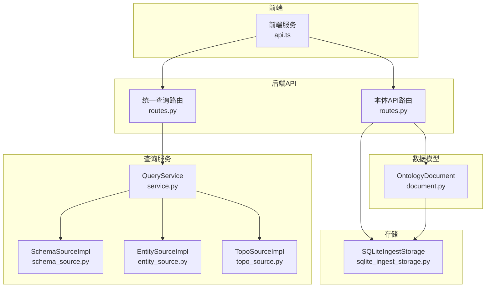
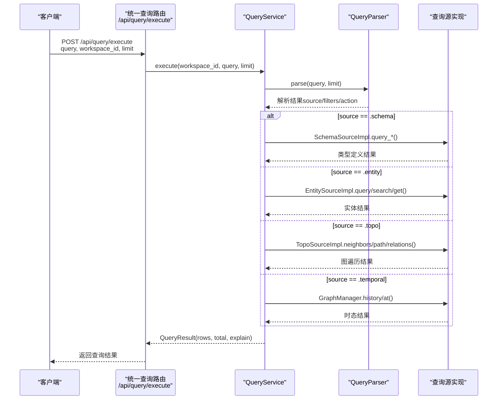
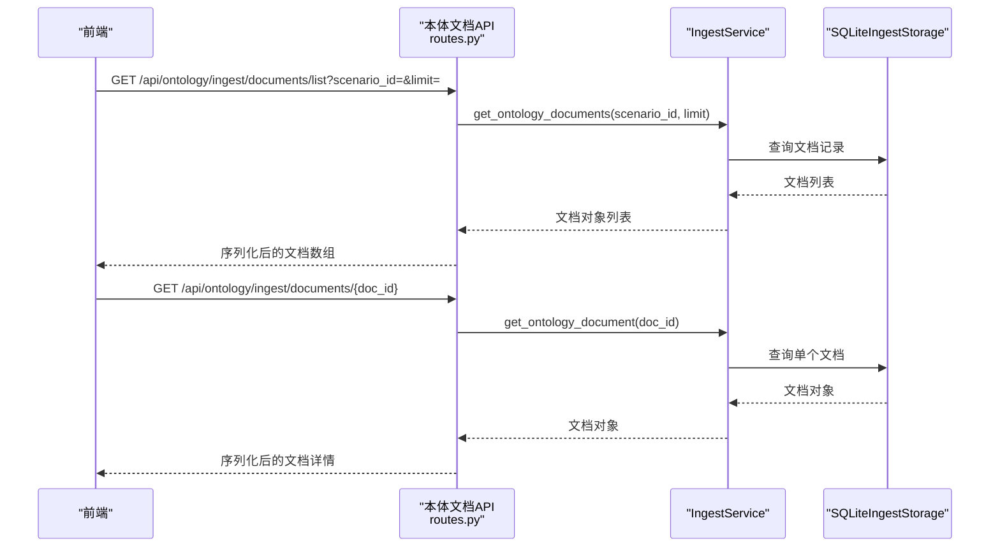
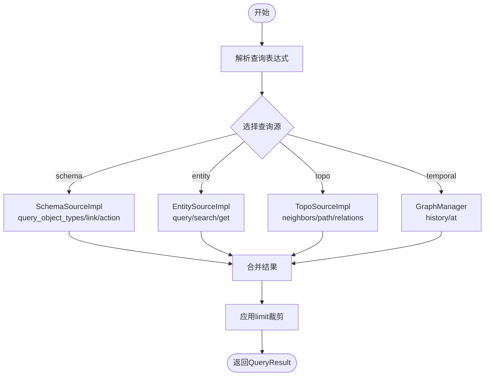
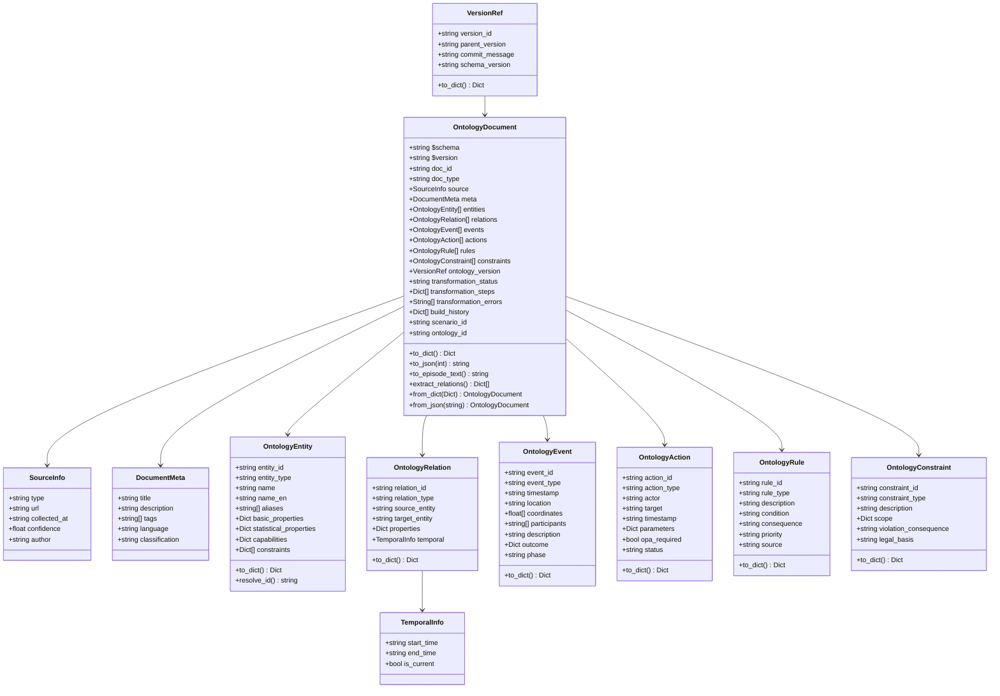
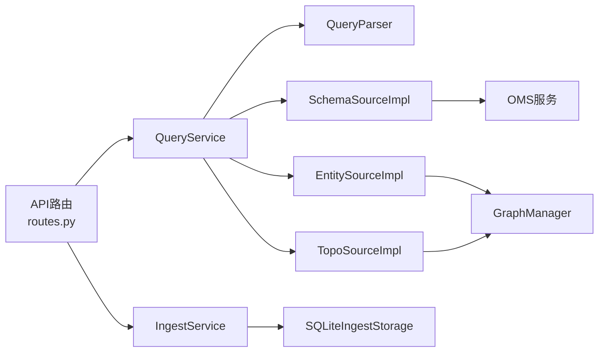

# 文档查询API

<cite>
**本文档引用的文件**
- [odap/biz/core/ontology/api/routes.py](file://odap/biz/core/ontology/api/routes.py)
- [odap/biz/core/ontology/api/schemas.py](file://odap/biz/core/ontology/api/schemas.py)
- [odap/infra/query/routes.py](file://odap/infra/query/routes.py)
- [odap/infra/query/service.py](file://odap/infra/query/service.py)
- [odap/infra/query/sources/entity_source.py](file://odap/infra/query/sources/entity_source.py)
- [odap/infra/query/sources/schema_source.py](file://odap/infra/query/sources/schema_source.py)
- [odap/infra/query/sources/topo_source.py](file://odap/infra/query/sources/topo_source.py)
- [odap/biz/core/ontology/schema/document.py](file://odap/biz/core/ontology/schema/document.py)
- [odap/biz/core/ontology/services/ingest_service.py](file://odap/biz/core/ontology/services/ingest_service.py)
- [odap/biz/core/ontology/storage/sqlite_ingest_storage.py](file://odap/biz/core/ontology/storage/sqlite_ingest_storage.py)
- [frontend/src/modules/shared/services/api.ts](file://frontend/src/modules/shared/services/api.ts)
- [docs/10-api/DATABASE_DESIGN.md](file://docs/10-api/DATABASE_DESIGN.md)
</cite>

## 目录
1. [简介](#简介)
2. [项目结构](#项目结构)
3. [核心组件](#核心组件)
4. [架构总览](#架构总览)
5. [详细组件分析](#详细组件分析)
6. [依赖分析](#依赖分析)
7. [性能考虑](#性能考虑)
8. [故障排除指南](#故障排除指南)
9. [结论](#结论)

## 简介
本文件为 ODAP 平台的本体文档查询 API 提供全面的技术参考，覆盖文档列表查询、文档详情获取、文档搜索、统一查询执行、查询解释、查询源枚举等能力。面向搜索工程师与数据分析师，提供参数说明、使用示例与性能优化建议，并解释文档状态管理与文档关联关系查询的实现方式。

## 项目结构
围绕本体文档查询与统一查询，后端主要由以下模块构成：
- 本体摄入与文档 API：提供文档列表、详情、摄入历史、构建状态等接口
- 统一查询服务：支持 schema、entity、topo、temporal 四类查询源
- 查询源实现：分别对接本体类型定义、运行时实体、图拓扑与时间维度
- 数据模型：标准化的 OntologyDocument 结构与各子结构定义
- 存储层：SQLiteIngestStorage 提供摄入记录、文档、版本、实体注册等持久化

**图表来源**
- [odap/biz/core/ontology/api/routes.py:354-416](file://odap/biz/core/ontology/api/routes.py#L354-L416)
- [odap/infra/query/routes.py:18-50](file://odap/infra/query/routes.py#L18-L50)
- [odap/infra/query/service.py:33-70](file://odap/infra/query/service.py#L33-L70)
- [odap/biz/core/ontology/schema/document.py:212-275](file://odap/biz/core/ontology/schema/document.py#L212-L275)
- [odap/biz/core/ontology/storage/sqlite_ingest_storage.py:98-159](file://odap/biz/core/ontology/storage/sqlite_ingest_storage.py#L98-L159)

**章节来源**
- [odap/biz/core/ontology/api/routes.py:354-416](file://odap/biz/core/ontology/api/routes.py#L354-L416)
- [odap/infra/query/routes.py:18-50](file://odap/infra/query/routes.py#L18-L50)

## 核心组件
- 本体文档查询接口
  - 文档列表查询：GET /api/ontology/ingest/documents/list
  - 文档详情获取：GET /api/ontology/ingest/documents/{doc_id}
- 统一查询接口
  - 执行查询：POST /api/query/execute
  - 解释查询：POST /api/query/explain
  - 列出查询源：GET /api/query/sources
- 数据模型
  - OntologyDocument：标准化的本体文档结构，包含实体、关系、事件、行动、规则、约束等
- 存储与状态
  - SQLiteIngestStorage：持久化摄入记录、文档、版本、实体注册等
  - 文档状态：transformation_status、build_history、ontology_version 等

**章节来源**
- [odap/biz/core/ontology/api/routes.py:354-416](file://odap/biz/core/ontology/api/routes.py#L354-L416)
- [odap/infra/query/routes.py:18-50](file://odap/infra/query/routes.py#L18-L50)
- [odap/biz/core/ontology/schema/document.py:212-275](file://odap/biz/core/ontology/schema/document.py#L212-L275)
- [odap/biz/core/ontology/storage/sqlite_ingest_storage.py:98-159](file://odap/biz/core/ontology/storage/sqlite_ingest_storage.py#L98-L159)

## 架构总览
统一查询服务根据查询表达式的前缀选择对应查询源：
- .schema：查询本体类型定义（对象类型、链接定义、动作类型）
- .entity：查询运行时实体（支持按类型、区域过滤，或全文搜索）
- .topo：查询拓扑关系（邻居、路径、关系过滤）
- .temporal：查询时态数据（历史版本、某时刻快照）

**图表来源**
- [odap/infra/query/routes.py:18-50](file://odap/infra/query/routes.py#L18-L50)
- [odap/infra/query/service.py:33-70](file://odap/infra/query/service.py#L33-L70)
- [odap/infra/query/sources/schema_source.py:14-30](file://odap/infra/query/sources/schema_source.py#L14-L30)
- [odap/infra/query/sources/entity_source.py:14-33](file://odap/infra/query/sources/entity_source.py#L14-L33)
- [odap/infra/query/sources/topo_source.py:14-27](file://odap/infra/query/sources/topo_source.py#L14-L27)

## 详细组件分析

### 本体文档查询API
- 文档列表查询
  - 方法与路径：GET /api/ontology/ingest/documents/list
  - 查询参数：
    - scenario_id：可选，按场景过滤
    - limit：可选，默认 100，最大 100
  - 返回：本体文档数组（序列化为字典）
  - 实现要点：调用摄入服务获取文档列表并转换为字典
- 文档详情获取
  - 方法与路径：GET /api/ontology/ingest/documents/{doc_id}
  - 路径参数：doc_id（文档ID）
  - 返回：指定文档的完整内容
  - 错误：未找到返回 404
- 前端调用示例
  - 列表查询：携带 scenario_id 和 limit
  - 详情查询：传入具体 doc_id

**图表来源**
- [odap/biz/core/ontology/api/routes.py:354-367](file://odap/biz/core/ontology/api/routes.py#L354-L367)
- [odap/biz/core/ontology/services/ingest_service.py:1-200](file://odap/biz/core/ontology/services/ingest_service.py#L1-L200)
- [odap/biz/core/ontology/storage/sqlite_ingest_storage.py:98-159](file://odap/biz/core/ontology/storage/sqlite_ingest_storage.py#L98-L159)

**章节来源**
- [odap/biz/core/ontology/api/routes.py:354-367](file://odap/biz/core/ontology/api/routes.py#L354-L367)
- [frontend/src/modules/shared/services/api.ts:557-566](file://frontend/src/modules/shared/services/api.ts#L557-L566)

### 统一查询API
- 执行查询
  - 方法与路径：POST /api/query/execute
  - 查询参数：
    - query：查询表达式（如 .entity with(type='...')）
    - workspace_id：工作空间ID，默认 "default"
    - limit：返回数量限制，默认 20，范围 [1, 100]
  - 返回：QueryResult（包含 source、rows、total、explain）
- 解释查询
  - 方法与路径：POST /api/query/explain
  - 功能：解析查询表达式但不执行，返回解析结果
- 列出查询源
  - 方法与路径：GET /api/query/sources
  - 返回：可用查询源清单（schema、entity、topo、temporal），含示例

**图表来源**
- [odap/infra/query/routes.py:18-50](file://odap/infra/query/routes.py#L18-L50)
- [odap/infra/query/service.py:33-70](file://odap/infra/query/service.py#L33-L70)
- [odap/infra/query/sources/schema_source.py:14-68](file://odap/infra/query/sources/schema_source.py#L14-L68)
- [odap/infra/query/sources/entity_source.py:14-33](file://odap/infra/query/sources/entity_source.py#L14-L33)
- [odap/infra/query/sources/topo_source.py:14-27](file://odap/infra/query/sources/topo_source.py#L14-L27)

**章节来源**
- [odap/infra/query/routes.py:18-100](file://odap/infra/query/routes.py#L18-L100)
- [odap/infra/query/service.py:33-125](file://odap/infra/query/service.py#L33-L125)

### 数据模型：OntologyDocument
- 核心字段
  - $schema、$version：文档模式与版本
  - doc_id、doc_type：文档标识与类型（event/entity/scenario/batch）
  - source、meta：来源信息与元数据
  - entities、relations、events、actions、rules、constraints：本体内容体
  - ontology_version：版本引用
  - transformation_status、transformation_steps、transformation_errors：转换过程
  - build_history：构建历史
  - scenario_id、ontology_id：场景与本体归属
- 序列化与反序列化
  - to_dict()/to_json()：序列化为字典/JSON
  - from_dict()/from_json()：从字典/JSON反序列化
- 验证器
  - OntologyDocumentSchema.validate()：校验必填字段、实体ID唯一性、关系目标存在性、事件时间戳等

**图表来源**
- [odap/biz/core/ontology/schema/document.py:66-399](file://odap/biz/core/ontology/schema/document.py#L66-L399)

**章节来源**
- [odap/biz/core/ontology/schema/document.py:212-404](file://odap/biz/core/ontology/schema/document.py#L212-L404)

### 查询源实现
- SchemaSourceImpl
  - 查询对象类型：query_object_types()
  - 查询链接定义：query_link_definitions()
  - 查询动作类型：query_action_types()
  - 类型与属性校验：validate_entity_type()、validate_properties()、validate_cardinality()
- EntitySourceImpl
  - 查询实体：query_entities(filters, workspace_id)
  - 获取单实体：get_entity(entity_id, workspace_id)
  - 实体搜索：search_entities(query, top_k, workspace_id)
- TopoSourceImpl
  - 邻居查询：get_neighbors(entity_id, direction, depth, workspace_id)
  - 关系查询：get_relations(entity_id, relation_type, workspace_id)
  - 图遍历：traverse(start_id, max_depth, workspace_id)

**章节来源**
- [odap/infra/query/sources/schema_source.py:14-171](file://odap/infra/query/sources/schema_source.py#L14-L171)
- [odap/infra/query/sources/entity_source.py:14-33](file://odap/infra/query/sources/entity_source.py#L14-L33)
- [odap/infra/query/sources/topo_source.py:14-27](file://odap/infra/query/sources/topo_source.py#L14-L27)

### 存储与状态管理
- SQLiteIngestStorage
  - 表结构：ingest_records、audit_logs、ontology_documents、build_results、ontology_versions、entity_registry
  - 索引：entity_registry 上的类型+名称索引、本体ID索引
  - 用途：持久化摄入记录、文档、版本、实体注册与审计日志
- 文档状态字段
  - transformation_status：pending/processing/completed/failed
  - build_history：构建阶段结果与统计
  - ontology_version：版本链与父版本指针

**章节来源**
- [odap/biz/core/ontology/storage/sqlite_ingest_storage.py:98-200](file://odap/biz/core/ontology/storage/sqlite_ingest_storage.py#L98-L200)
- [odap/biz/core/ontology/schema/document.py:241-251](file://odap/biz/core/ontology/schema/document.py#L241-L251)

## 依赖分析
- API 路由依赖
  - 本体文档 API 依赖 IngestService 与 SQLiteIngestStorage
  - 统一查询 API 依赖 QueryService 与多个查询源实现
- 查询服务依赖
  - QueryService 依赖 QueryParser 与各查询源实现
  - 查询源实现依赖 GraphManager（实体/拓扑/时态）或 OMS 服务（类型定义）
- 数据模型依赖
  - OntologyDocument 作为核心数据单元，被 API 与存储广泛使用

**图表来源**
- [odap/biz/core/ontology/api/routes.py:354-416](file://odap/biz/core/ontology/api/routes.py#L354-L416)
- [odap/infra/query/routes.py:18-50](file://odap/infra/query/routes.py#L18-L50)
- [odap/infra/query/service.py:33-70](file://odap/infra/query/service.py#L33-L70)
- [odap/infra/query/sources/schema_source.py:8-12](file://odap/infra/query/sources/schema_source.py#L8-L12)
- [odap/infra/query/sources/entity_source.py:8-12](file://odap/infra/query/sources/entity_source.py#L8-L12)
- [odap/infra/query/sources/topo_source.py:8-12](file://odap/infra/query/sources/topo_source.py#L8-L12)

**章节来源**
- [odap/biz/core/ontology/api/routes.py:354-416](file://odap/biz/core/ontology/api/routes.py#L354-L416)
- [odap/infra/query/service.py:33-70](file://odap/infra/query/service.py#L33-L70)

## 性能考虑
- 查询限制
  - 统一查询的 limit 默认 20，最大 100，避免一次性返回过多数据
- 索引建议
  - entity_registry 表已建立类型+名称索引与本体ID索引，建议在高频过滤字段上增加复合索引以提升查询性能
- 存储模式
  - 使用 WAL 模式提升并发读写性能；对大表进行分页查询与必要字段投影
- 查询优化
  - 对 .entity 的搜索优先使用混合搜索（当图管理器可用时），否则回退到普通搜索
  - .topo 的遍历应控制 depth 与 max_depth，避免过深遍历导致结果爆炸
- 前端缓存
  - 对常用查询结果进行短期缓存，减少重复请求

**章节来源**
- [odap/infra/query/routes.py:20-22](file://odap/infra/query/routes.py#L20-L22)
- [odap/infra/query/sources/entity_source.py:28-33](file://odap/infra/query/sources/entity_source.py#L28-L33)
- [odap/biz/core/ontology/storage/sqlite_ingest_storage.py:43-50](file://odap/biz/core/ontology/storage/sqlite_ingest_storage.py#L43-L50)

## 故障排除指南
- 统一查询执行错误
  - 现象：POST /api/query/execute 返回 500
  - 排查：查看日志中的 QueryService execute error；确认查询表达式语法正确
- 查询解释失败
  - 现象：POST /api/query/explain 抛出异常
  - 排查：确认 QueryParser 能正常解析 query；检查 workspace_id
- 文档查询 404
  - 现象：GET /api/ontology/ingest/documents/{doc_id} 返回 404
  - 排查：确认 doc_id 是否正确；检查 SQLiteIngestStorage 中是否存在该文档
- Tavily API Key 未配置
  - 现象：POST /api/ontology/ingest/tavily 返回 400
  - 排查：检查环境变量 TAVILY_API_KEY 是否设置且非默认值

**章节来源**
- [odap/infra/query/routes.py:34-38](file://odap/infra/query/routes.py#L34-L38)
- [odap/biz/core/ontology/api/routes.py:268-275](file://odap/biz/core/ontology/api/routes.py#L268-L275)
- [odap/biz/core/ontology/api/routes.py:364-367](file://odap/biz/core/ontology/api/routes.py#L364-L367)

## 结论
本文档梳理了 ODAP 平台的本体文档查询与统一查询能力，明确了接口定义、数据模型、查询源实现与存储结构之间的关系。通过合理使用查询参数、遵循性能优化建议与故障排除流程，搜索工程师与数据分析师可以高效地进行本体文档的检索、过滤与关联分析。