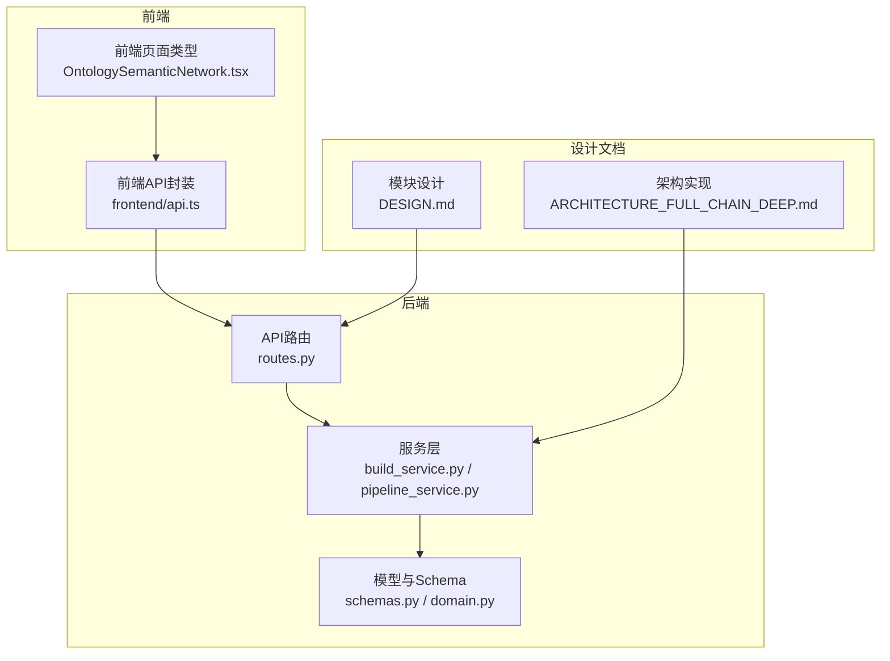
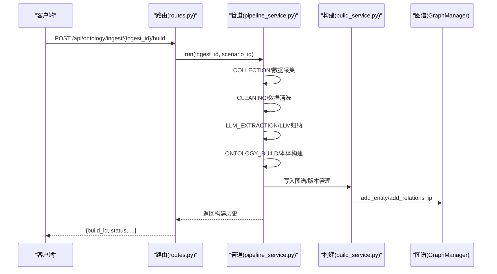
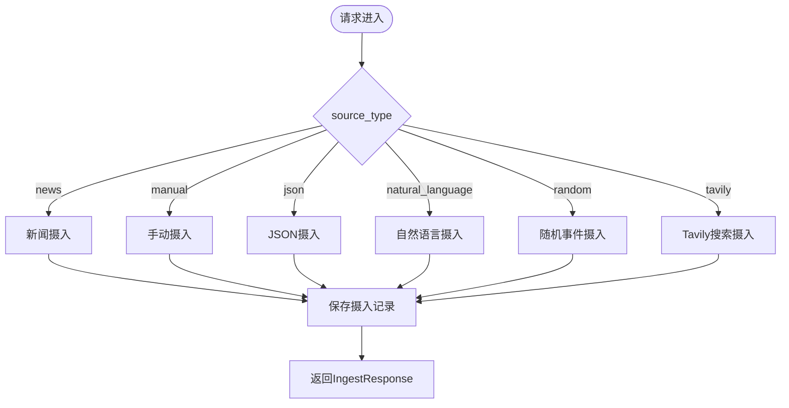
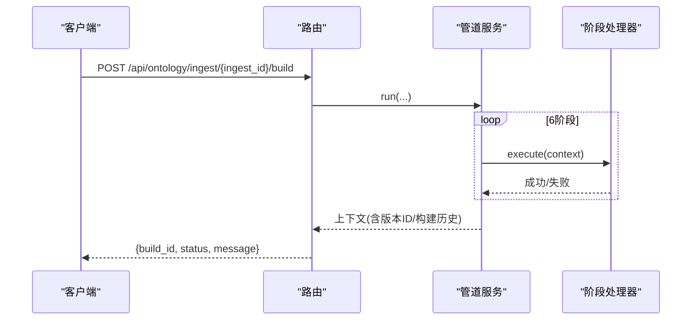
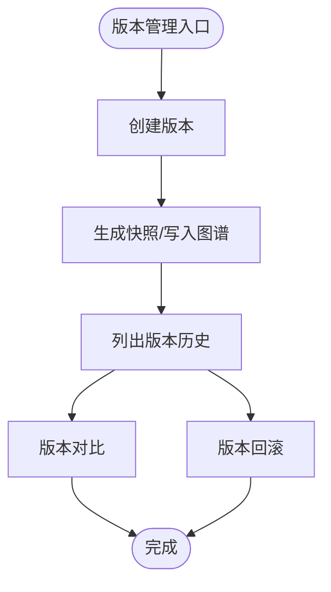
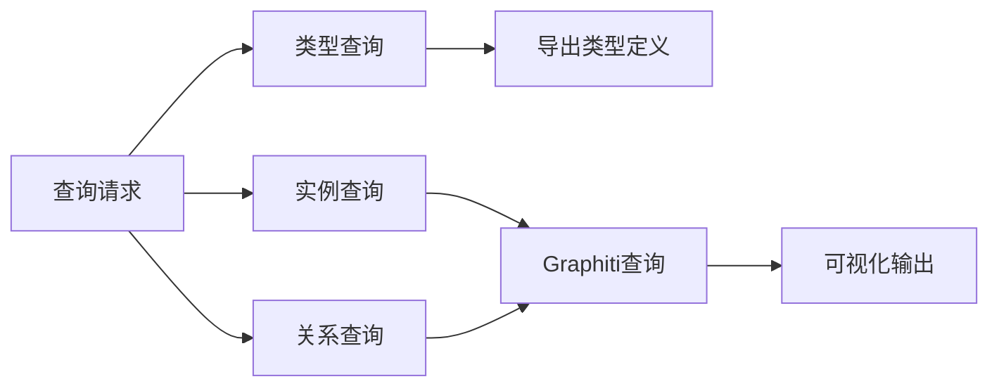
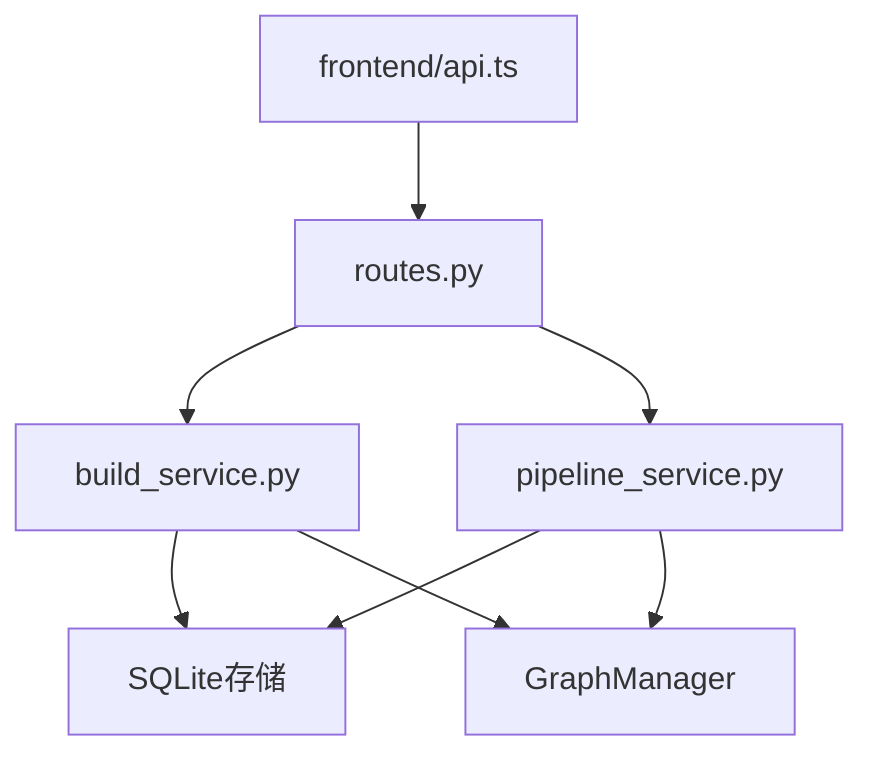
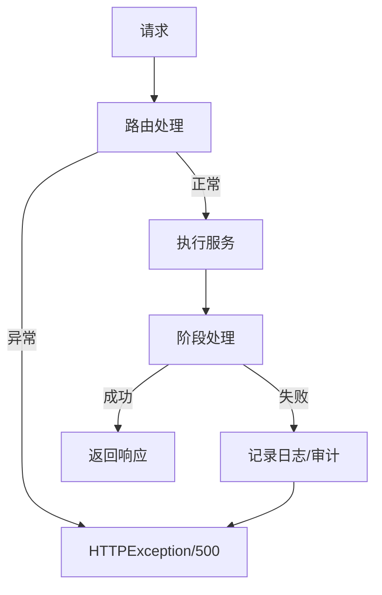

# 本体管理API

<cite>
**本文档引用的文件**
- [odap/biz/core/ontology/api/routes.py](file://odap/biz/core/ontology/api/routes.py)
- [odap/biz/core/ontology/api/schemas.py](file://odap/biz/core/ontology/api/schemas.py)
- [odap/biz/core/ontology/services/build_service.py](file://odap/biz/core/ontology/services/build_service.py)
- [odap/biz/core/ontology/services/pipeline_service.py](file://odap/biz/core/ontology/services/pipeline_service.py)
- [odap/biz/core/ontology/schema/domain.py](file://odap/biz/core/ontology/schema/domain.py)
- [odap/biz/core/ontology/models/__init__.py](file://odap/biz/core/ontology/models/__init__.py)
- [odap/biz/core/ontology/team_agent/api/routes.py](file://odap/biz/core/ontology/team_agent/api/routes.py)
- [frontend/src/modules/shared/services/api.ts](file://frontend/src/modules/shared/services/api.ts)
- [frontend/src/modules/ontology/pages/OntologySemanticNetwork.tsx](file://frontend/src/modules/ontology/pages/OntologySemanticNetwork.tsx)
- [docs/03-modules/ontology/DESIGN.md](file://docs/03-modules/ontology/DESIGN.md)
- [docs/02-architecture/ARCHITECTURE_FULL_CHAIN_DEEP.md](file://docs/02-architecture/ARCHITECTURE_FULL_CHAIN_DEEP.md)
</cite>

## 目录
1. [简介](#简介)
2. [项目结构](#项目结构)
3. [核心组件](#核心组件)
4. [架构总览](#架构总览)
5. [详细组件分析](#详细组件分析)
6. [依赖关系分析](#依赖关系分析)
7. [性能考虑](#性能考虑)
8. [故障排除指南](#故障排除指南)
9. [结论](#结论)

## 简介
本文件为 ODAP 平台“本体管理API”的权威参考文档，覆盖本体设计、构建、验证、版本管理、数据摄入与查询的完整能力。文档面向本体设计师与开发者，提供清晰的接口定义、数据模型、错误处理与状态码说明，并通过图示展示关键流程。

## 项目结构
本体管理API主要分布在后端Python模块与前端TypeScript模块中：
- 后端FastAPI路由与服务：负责数据摄入、构建管道、版本管理与图谱写入
- 前端API封装：提供统一的HTTP调用封装与类型定义
- 设计文档：提供本体类型、关系、验证规则与版本管理的高层设计

**图表来源**
- [odap/biz/core/ontology/api/routes.py:1-527](file://odap/biz/core/ontology/api/routes.py#L1-L527)
- [odap/biz/core/ontology/services/build_service.py:1-447](file://odap/biz/core/ontology/services/build_service.py#L1-L447)
- [odap/biz/core/ontology/services/pipeline_service.py:1-1284](file://odap/biz/core/ontology/services/pipeline_service.py#L1-L1284)
- [odap/biz/core/ontology/api/schemas.py:1-239](file://odap/biz/core/ontology/api/schemas.py#L1-L239)
- [odap/biz/core/ontology/schema/domain.py:386-428](file://odap/biz/core/ontology/schema/domain.py#L386-L428)
- [frontend/src/modules/shared/services/api.ts:252-294](file://frontend/src/modules/shared/services/api.ts#L252-L294)
- [frontend/src/modules/ontology/pages/OntologySemanticNetwork.tsx:45-80](file://frontend/src/modules/ontology/pages/OntologySemanticNetwork.tsx#L45-L80)
- [docs/03-modules/ontology/DESIGN.md:1-1254](file://docs/03-modules/ontology/DESIGN.md#L1-L1254)
- [docs/02-architecture/ARCHITECTURE_FULL_CHAIN_DEEP.md:1517-2239](file://docs/02-architecture/ARCHITECTURE_FULL_CHAIN_DEEP.md#L1517-L2239)

**章节来源**
- [odap/biz/core/ontology/api/routes.py:1-527](file://odap/biz/core/ontology/api/routes.py#L1-L527)
- [frontend/src/modules/shared/services/api.ts:252-294](file://frontend/src/modules/shared/services/api.ts#L252-L294)

## 核心组件
- 数据摄入API：支持新闻、手动录入、JSON、自然语言、随机事件、Tavily等多种数据源
- 本体构建管道：包含采集、清洗、LLM归纳、本体构建、版本管理、图谱生成六个阶段
- 版本管理API：版本创建、回滚、对比与历史查询
- 查询与可视化：类型定义查询、实例查询、关系查询与前端可视化
- 错误处理与状态码：统一的HTTP状态码与错误消息

**章节来源**
- [odap/biz/core/ontology/api/routes.py:19-527](file://odap/biz/core/ontology/api/routes.py#L19-L527)
- [odap/biz/core/ontology/services/pipeline_service.py:1-1284](file://odap/biz/core/ontology/services/pipeline_service.py#L1-L1284)
- [odap/biz/core/ontology/services/build_service.py:36-447](file://odap/biz/core/ontology/services/build_service.py#L36-L447)

## 架构总览
本体管理API采用“路由-服务-存储-图谱”分层架构：
- 路由层：FastAPI定义REST接口，接收请求并返回标准响应
- 服务层：构建服务与管道服务协调数据处理、版本控制与图谱写入
- 存储层：SQLite存储摄入记录、处理日志、构建历史与本体文档
- 图谱层：Graphiti写入节点与边，支持版本化与回滚

**图表来源**
- [odap/biz/core/ontology/api/routes.py:419-527](file://odap/biz/core/ontology/api/routes.py#L419-L527)
- [odap/biz/core/ontology/services/pipeline_service.py:1021-1284](file://odap/biz/core/ontology/services/pipeline_service.py#L1021-L1284)
- [odap/biz/core/ontology/services/build_service.py:256-302](file://odap/biz/core/ontology/services/build_service.py#L256-L302)

## 详细组件分析

### 数据摄入API
- 通用摄入接口：根据source_type自动路由到不同摄入器
- 支持的数据源：
  - news：URL直取或关键词检索
  - manual：表单/文本
  - json：JSON字符串
  - natural_language：自然语言文本
  - random：随机事件生成
  - tavily：外部搜索API
- 响应包含摄入ID、状态、原始内容与抽取数据

**图表来源**
- [odap/biz/core/ontology/api/routes.py:74-125](file://odap/biz/core/ontology/api/routes.py#L74-L125)

**章节来源**
- [odap/biz/core/ontology/api/routes.py:19-125](file://odap/biz/core/ontology/api/routes.py#L19-L125)
- [frontend/src/modules/shared/services/api.ts:252-294](file://frontend/src/modules/shared/services/api.ts#L252-L294)

### 本体构建管道API
- 阶段划分：采集、清洗、LLM归纳、本体构建、版本管理、图谱生成
- 异步执行：立即返回“pending”，后台异步推进
- 日志与审计：每个阶段记录处理日志并写入审计通道
- 构建历史：保存构建ID、版本ID、实体/关系/事件数量与耗时

**图表来源**
- [odap/biz/core/ontology/services/pipeline_service.py:1021-1284](file://odap/biz/core/ontology/services/pipeline_service.py#L1021-L1284)
- [odap/biz/core/ontology/api/routes.py:419-527](file://odap/biz/core/ontology/api/routes.py#L419-L527)

**章节来源**
- [odap/biz/core/ontology/services/pipeline_service.py:1-1284](file://odap/biz/core/ontology/services/pipeline_service.py#L1-L1284)
- [odap/biz/core/ontology/api/routes.py:294-527](file://odap/biz/core/ontology/api/routes.py#L294-L527)

### 版本管理API
- 版本创建：基于本体构建结果创建新版本
- 版本回滚：支持精确回滚到任意历史版本
- 版本对比：比较两个版本的实体/关系差异
- 版本历史：按工作空间/场景列出版本链

**图表来源**
- [docs/02-architecture/ARCHITECTURE_FULL_CHAIN_DEEP.md:1942-2239](file://docs/02-architecture/ARCHITECTURE_FULL_CHAIN_DEEP.md#L1942-L2239)
- [odap/biz/core/ontology/api/routes.py:334-351](file://odap/biz/core/ontology/api/routes.py#L334-L351)

**章节来源**
- [docs/02-architecture/ARCHITECTURE_FULL_CHAIN_DEEP.md:1942-2239](file://docs/02-architecture/ARCHITECTURE_FULL_CHAIN_DEEP.md#L1942-L2239)
- [odap/biz/core/ontology/api/routes.py:334-351](file://odap/biz/core/ontology/api/routes.py#L334-L351)

### 查询与可视化API
- 类型定义查询：导出实体类型与关系约束
- 实例查询：按类型与过滤条件查询实体
- 关系查询：按关系类型与方向查询
- 可视化：前端表格与HTML输出展示查询结果

**图表来源**
- [docs/03-modules/ontology/DESIGN.md:426-456](file://docs/03-modules/ontology/DESIGN.md#L426-L456)
- [odap/tools/visualization/plotting.py:297-355](file://odap/tools/visualization/plotting.py#L297-L355)

**章节来源**
- [docs/03-modules/ontology/DESIGN.md:426-456](file://docs/03-modules/ontology/DESIGN.md#L426-L456)
- [odap/tools/visualization/plotting.py:297-355](file://odap/tools/visualization/plotting.py#L297-L355)

### 本体验证与规则
- 实体/关系验证：基于约束规则进行合法性校验
- 模拟推演验证：针对场景、版本、执行、结果的验证规则
- 验证结果：错误计数、警告计数、综合评分与耗时

**章节来源**
- [docs/03-modules/ontology/DESIGN.md:305-953](file://docs/03-modules/ontology/DESIGN.md#L305-L953)

## 依赖关系分析
- 路由依赖服务：routes.py依赖build_service与pipeline_service
- 服务依赖存储：pipeline_service与build_service依赖SQLite存储
- 图谱依赖：build_service与pipeline_service依赖GraphManager写入图谱
- 前端依赖：frontend/api.ts封装后端接口，类型定义与后端保持一致

**图表来源**
- [odap/biz/core/ontology/api/routes.py:10-16](file://odap/biz/core/ontology/api/routes.py#L10-L16)
- [odap/biz/core/ontology/services/build_service.py:265-302](file://odap/biz/core/ontology/services/build_service.py#L265-L302)
- [odap/biz/core/ontology/services/pipeline_service.py:806-828](file://odap/biz/core/ontology/services/pipeline_service.py#L806-L828)
- [frontend/src/modules/shared/services/api.ts:252-294](file://frontend/src/modules/shared/services/api.ts#L252-L294)

**章节来源**
- [odap/biz/core/ontology/api/routes.py:10-16](file://odap/biz/core/ontology/api/routes.py#L10-L16)
- [odap/biz/core/ontology/services/build_service.py:265-302](file://odap/biz/core/ontology/services/build_service.py#L265-L302)
- [odap/biz/core/ontology/services/pipeline_service.py:806-828](file://odap/biz/core/ontology/services/pipeline_service.py#L806-L828)
- [frontend/src/modules/shared/services/api.ts:252-294](file://frontend/src/modules/shared/services/api.ts#L252-L294)

## 性能考虑
- 异步执行：构建管道异步推进，避免阻塞请求线程
- 阶段化日志：每个阶段记录耗时，便于性能分析与瓶颈定位
- 图谱写入：批量写入节点与边，减少事务开销
- 缓存与复用：版本管理使用快照与差异计算，降低重复写入成本

[本节为通用指导，无需特定文件引用]

## 故障排除指南
- 常见HTTP状态码
  - 200：成功
  - 400：请求参数错误或无效数据源类型
  - 404：资源不存在（摄入记录、版本、文档）
  - 500：服务器内部错误
- 错误处理流程
  - 路由层捕获异常并返回标准HTTP错误
  - 管道阶段记录详细日志，包含阶段、操作、耗时与错误信息
  - 审计通道记录构建完成/失败事件，便于追踪

**图表来源**
- [odap/biz/core/ontology/api/routes.py:66-91](file://odap/biz/core/ontology/api/routes.py#L66-L91)
- [odap/biz/core/ontology/services/pipeline_service.py:92-135](file://odap/biz/core/ontology/services/pipeline_service.py#L92-L135)

**章节来源**
- [odap/biz/core/ontology/api/routes.py:66-91](file://odap/biz/core/ontology/api/routes.py#L66-L91)
- [odap/biz/core/ontology/services/pipeline_service.py:92-135](file://odap/biz/core/ontology/services/pipeline_service.py#L92-L135)

## 结论
本体管理API提供了从数据摄入到本体构建、版本管理与图谱可视化的完整链路。通过清晰的接口设计、完善的错误处理与审计日志，开发者可以快速集成并稳定运行本体管理功能。建议在生产环境中结合前端可视化与监控工具，持续优化性能与用户体验。