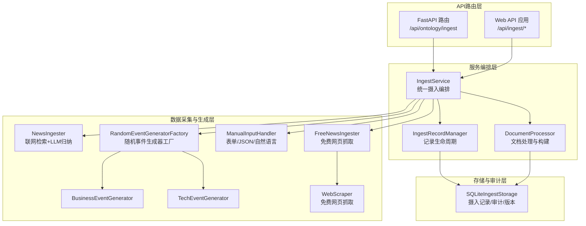
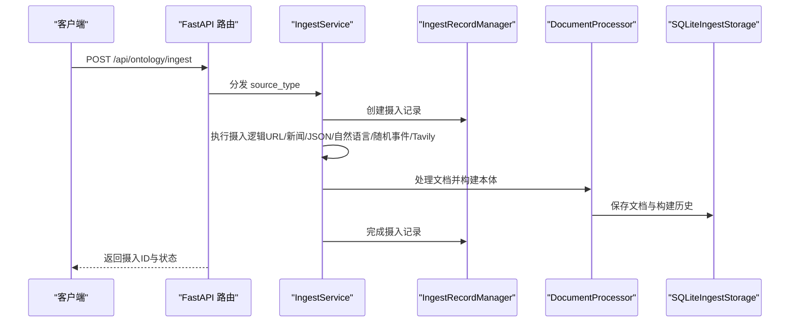
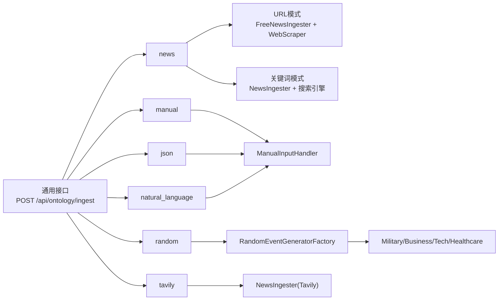

# 数据摄入API

<cite>
**本文引用的文件**
- [odap/biz/core/ontology/api/routes.py](file://odap/biz/core/ontology/api/routes.py)
- [odap/biz/core/ontology/services/ingest_service.py](file://odap/biz/core/ontology/services/ingest_service.py)
- [odap/biz/core/ontology/ingestion_split/ingestion.py](file://odap/biz/core/ontology/ingestion_split/ingestion.py)
- [odap/biz/core/ontology/ingestion_split/free_news_ingester.py](file://odap/biz/core/ontology/ingestion_split/free_news_ingester.py)
- [odap/biz/core/ontology/ingestion_split/manual_input.py](file://odap/biz/core/ontology/ingestion_split/manual_input.py)
- [odap/biz/core/ontology/ingestion_split/generator_factory.py](file://odap/biz/core/ontology/ingestion_split/generator_factory.py)
- [odap/biz/core/ontology/ingestion_split/business_generator.py](file://odap/biz/core/ontology/ingestion_split/business_generator.py)
- [odap/biz/core/ontology/ingestion_split/tech_generator.py](file://odap/biz/core/ontology/ingestion_split/tech_generator.py)
- [odap/biz/core/ontology/ingestion_split/web_scraper.py](file://odap/biz/core/ontology/ingestion_split/web_scraper.py)
- [odap/biz/core/ontology/schema/document.py](file://odap/biz/core/ontology/schema/document.py)
- [odap/biz/core/ontology/storage/sqlite_ingest_storage.py](file://odap/biz/core/ontology/storage/sqlite_ingest_storage.py)
- [odap/web/api/app.py](file://odap/web/api/app.py)
- [docs/02-architecture/ARCHITECTURE_FULL_CHAIN.md](file://docs/02-architecture/ARCHITECTURE_FULL_CHAIN.md)
- [docs/02-architecture/ARCHITECTURE_FULL_CHAIN_DEEP.md](file://docs/02-architecture/ARCHITECTURE_FULL_CHAIN_DEEP.md)
- [docs/02-architecture/ARCHITECTURE_BIZ.md](file://docs/02-architecture/ARCHITECTURE_BIZ.md)
</cite>

## 目录
1. [简介](#简介)
2. [项目结构](#项目结构)
3. [核心组件](#核心组件)
4. [架构总览](#架构总览)
5. [详细组件分析](#详细组件分析)
6. [依赖分析](#依赖分析)
7. [性能考虑](#性能考虑)
8. [故障排查指南](#故障排查指南)
9. [结论](#结论)
10. [附录](#附录)

## 简介
本文件为 ODAP 平台“数据摄入API”的权威参考文档，覆盖新闻摄入（URL与关键词两种模式）、手动输入摄入、JSON数据摄入、自然语言摄入、随机事件生成、Tavily搜索引擎摄入等全部摄入方式。文档详细说明请求参数、响应格式、使用示例与最佳实践；解释数据摄入的预处理流程、数据验证规则与错误处理机制；提供不同数据源的配置选项与性能优化建议；为开发者提供完整的技术参考与集成指南。

## 项目结构
ODAP 平台的数据摄入能力由“API路由层”“服务编排层”“数据采集与生成层”“存储与审计层”组成，形成端到端的摄入流水线。

**图表来源**
- [odap/biz/core/ontology/api/routes.py](file://odap/biz/core/ontology/api/routes.py)
- [odap/biz/core/ontology/services/ingest_service.py](file://odap/biz/core/ontology/services/ingest_service.py)
- [odap/biz/core/ontology/ingestion_split/ingestion.py](file://odap/biz/core/ontology/ingestion_split/ingestion.py)
- [odap/biz/core/ontology/ingestion_split/free_news_ingester.py](file://odap/biz/core/ontology/ingestion_split/free_news_ingester.py)
- [odap/biz/core/ontology/ingestion_split/manual_input.py](file://odap/biz/core/ontology/ingestion_split/manual_input.py)
- [odap/biz/core/ontology/ingestion_split/generator_factory.py](file://odap/biz/core/ontology/ingestion_split/generator_factory.py)
- [odap/biz/core/ontology/ingestion_split/business_generator.py](file://odap/biz/core/ontology/ingestion_split/business_generator.py)
- [odap/biz/core/ontology/ingestion_split/tech_generator.py](file://odap/biz/core/ontology/ingestion_split/tech_generator.py)
- [odap/biz/core/ontology/ingestion_split/web_scraper.py](file://odap/biz/core/ontology/ingestion_split/web_scraper.py)
- [odap/biz/core/ontology/storage/sqlite_ingest_storage.py](file://odap/biz/core/ontology/storage/sqlite_ingest_storage.py)

**章节来源**
- [odap/biz/core/ontology/api/routes.py](file://odap/biz/core/ontology/api/routes.py)
- [odap/biz/core/ontology/services/ingest_service.py](file://odap/biz/core/ontology/services/ingest_service.py)
- [odap/biz/core/ontology/storage/sqlite_ingest_storage.py](file://odap/biz/core/ontology/storage/sqlite_ingest_storage.py)

## 核心组件
- API 路由层：提供统一的摄入入口，支持通用接口与专用接口，自动识别摄入类型并转发到对应服务。
- 服务编排层：IngestService 统一编排各类摄入流程；IngestRecordManager 管理摄入记录生命周期；DocumentProcessor 负责文档持久化与本体构建。
- 数据采集与生成层：NewsIngester 负责联网检索与 LLM 归纳；FreeNewsIngester 提供免费网页抓取；ManualInputHandler 处理表单/JSON/自然语言；RandomEventGeneratorFactory 提供多类型随机事件生成器。
- 存储与审计层：SQLiteIngestStorage 负责摄入记录、审计日志、本体文档、构建历史与版本管理的持久化。

**章节来源**
- [odap/biz/core/ontology/api/routes.py](file://odap/biz/core/ontology/api/routes.py)
- [odap/biz/core/ontology/services/ingest_service.py](file://odap/biz/core/ontology/services/ingest_service.py)
- [odap/biz/core/ontology/storage/sqlite_ingest_storage.py](file://odap/biz/core/ontology/storage/sqlite_ingest_storage.py)

## 架构总览
ODAP 数据摄入API采用“路由分发 + 服务编排 + 多采集器 + 统一存储”的分层架构。请求首先到达 FastAPI 路由，随后由 IngestService 根据 source_type 分派到具体摄入器；摄入器完成数据采集/生成后，写入摄入记录并通过 DocumentProcessor 完成本体构建与持久化；最终通过统一的查询接口返回摄入状态与结果。

**图表来源**
- [odap/biz/core/ontology/api/routes.py](file://odap/biz/core/ontology/api/routes.py)
- [odap/biz/core/ontology/services/ingest_service.py](file://odap/biz/core/ontology/services/ingest_service.py)
- [odap/biz/core/ontology/storage/sqlite_ingest_storage.py](file://odap/biz/core/ontology/storage/sqlite_ingest_storage.py)

## 详细组件分析

### 通用摄入接口
- 路径：POST /api/ontology/ingest
- 请求体字段：
  - source_type: 摄入类型（news、manual、json、natural_language、random、tavily）
  - data: 通用数据载体（根据 source_type 解释）
  - 其他类型专属字段（见后续各小节）
- 响应体字段：
  - ingest_id: 摄入任务ID
  - status: 当前状态
  - source_details: 数据源详情
  - original_content: 原始内容
  - extracted_data: 提取的数据

最佳实践：
- 优先使用专用接口（如 /news、/manual 等）以获得更强的参数校验与默认值。
- 对外部来源（URL/关键词）建议先做合法性校验与去重。

**章节来源**
- [odap/biz/core/ontology/api/routes.py](file://odap/biz/core/ontology/api/routes.py)

### 新闻摄入（URL模式）
- 路径：POST /api/ontology/ingest/news
- 请求体字段：
  - data: 新闻URL（以 http/https 开头）
  - event_context: 事件背景（可选）
  - max_sources: 最大检索来源数（仅关键词模式有效）
  - scenario_id: 场景ID（可选）
- 行为说明：
  - 若 data 以 http/https 开头，则走“URL模式”，使用免费网页抓取与规则提取。
  - 否则走“关键词模式”，使用联网检索与 LLM 归纳。
- 响应体字段：同通用接口。

注意事项：
- URL模式无需 API Key，但网页抓取依赖未安装时会返回 Mock 数据。
- 关键词模式需要可用的搜索引擎或 Tavily Key。

**章节来源**
- [odap/biz/core/ontology/api/routes.py](file://odap/biz/core/ontology/api/routes.py)
- [odap/biz/core/ontology/ingestion_split/free_news_ingester.py](file://odap/biz/core/ontology/ingestion_split/free_news_ingester.py)
- [odap/biz/core/ontology/ingestion_split/ingestion.py](file://odap/biz/core/ontology/ingestion_split/ingestion.py)

### 新闻摄入（关键词模式）
- 路径：POST /api/ontology/ingest/news
- 请求体字段：
  - data: 搜索关键词
  - event_context: 事件背景（可选）
  - max_sources: 最大检索来源数（默认5）
  - scenario_id: 场景ID（可选）
- 行为说明：
  - 自动选择可用的搜索引擎（本地DDG API → Tavily → SerpAPI → DDG HTML → Mock）。
  - 将多源内容汇总后，使用 LLM 抽取为 OntologyDocument。
- 响应体字段：同通用接口。

配置要点：
- 本地 DDG API：通过 DDG_API_URL 环境变量启用。
- Tavily：需配置 TAVILY_API_KEY。
- SerpAPI：需配置 SERPAPI_KEY。

**章节来源**
- [odap/biz/core/ontology/ingestion_split/ingestion.py](file://odap/biz/core/ontology/ingestion_split/ingestion.py)

### 手动输入摄入
- 路径：POST /api/ontology/ingest/manual
- 请求体字段：
  - data: 可为字符串或结构化表单数据
  - scenario_id: 场景ID（可选）
- 行为说明：
  - 支持表单结构、JSON 字符串、自然语言三种输入。
  - 自然语言模式可选使用 LLM 转换，否则使用规则提取降级方案。
- 响应体字段：同通用接口。

最佳实践：
- 表单模式建议提供 entities、relations、events 字段以获得更丰富的本体结构。
- JSON 模式需满足 OntologyDocument Schema 校验。

**章节来源**
- [odap/biz/core/ontology/api/routes.py](file://odap/biz/core/ontology/api/routes.py)
- [odap/biz/core/ontology/ingestion_split/manual_input.py](file://odap/biz/core/ontology/ingestion_split/manual_input.py)

### JSON数据摄入
- 路径：POST /api/ontology/ingest/json
- 请求体字段：
  - data: JSON 字符串
  - scenario_id: 场景ID（可选）
- 行为说明：
  - 解析 JSON 并进行 Schema 校验，生成 OntologyDocument。
- 响应体字段：同通用接口。

最佳实践：
- JSON 必须符合 OntologyDocument Schema，否则抛出校验错误。
- 建议在前端进行基本格式校验后再提交。

**章节来源**
- [odap/biz/core/ontology/api/routes.py](file://odap/biz/core/ontology/api/routes.py)
- [odap/biz/core/ontology/ingestion_split/manual_input.py](file://odap/biz/core/ontology/ingestion_split/manual_input.py)

### 自然语言摄入
- 路径：POST /api/ontology/ingest/natural-language
- 请求体字段：
  - data: 自然语言文本
  - scenario_id: 场景ID（可选）
- 行为说明：
  - 可选使用 LLM 将文本转换为结构化本体；若无 LLM，则使用规则提取降级方案。
- 响应体字段：同通用接口。

最佳实践：
- 文本长度建议控制在 LLM 上下文范围内，避免截断。
- 复杂语义建议配合 event_context 提升抽取质量。

**章节来源**
- [odap/biz/core/ontology/api/routes.py](file://odap/biz/core/ontology/api/routes.py)
- [odap/biz/core/ontology/ingestion_split/manual_input.py](file://odap/biz/core/ontology/ingestion_split/manual_input.py)

### 随机事件生成
- 路径：POST /api/ontology/ingest/random
- 请求体字段：
  - data: 包含以下键的字典
    - parties: 参与方列表（可选）
    - scenario_context: 场景上下文（可选）
    - count: 生成数量（默认1）
    - generator_type: 生成器类型（默认 military）
    - workspace_id: 工作空间ID（默认 default）
  - scenario_id: 场景ID（可选）
- 可用生成器类型：
  - military（军事）
  - business（商业）
  - tech（科技）
  - healthcare（医疗健康）

最佳实践：
- generator_type 与 parties 需匹配场景语义。
- count 建议分批生成，避免一次性生成过多导致性能问题。

**章节来源**
- [odap/biz/core/ontology/api/routes.py](file://odap/biz/core/ontology/api/routes.py)
- [odap/biz/core/ontology/ingestion_split/generator_factory.py](file://odap/biz/core/ontology/ingestion_split/generator_factory.py)
- [odap/biz/core/ontology/ingestion_split/business_generator.py](file://odap/biz/core/ontology/ingestion_split/business_generator.py)
- [odap/biz/core/ontology/ingestion_split/tech_generator.py](file://odap/biz/core/ontology/ingestion_split/tech_generator.py)

### Tavily搜索引擎摄入
- 路径：POST /api/ontology/ingest/tavily
- 请求体字段：
  - data: 搜索关键词
  - event_context: 事件背景（可选）
  - max_sources: 最大检索来源数（默认5）
  - search_depth: 搜索深度（basic 或 advanced，默认 basic）
  - scenario_id: 场景ID（可选）
- 行为说明：
  - 需配置 TAVILY_API_KEY，否则返回错误。
  - 使用 Tavily API 检索并结合 LLM 归纳为 OntologyDocument。
- 响应体字段：同通用接口。

配置要点：
- 环境变量：TAVILY_API_KEY
- search_depth 会影响检索深度与成本

**章节来源**
- [odap/biz/core/ontology/api/routes.py](file://odap/biz/core/ontology/api/routes.py)
- [odap/biz/core/ontology/ingestion_split/ingestion.py](file://odap/biz/core/ontology/ingestion_split/ingestion.py)

### Web API 文本摄入（兼容旧版）
- 路径：POST /api/ingest/text
- 请求体字段：
  - text: 自然语言文本
  - scenario_id: 场景ID（可选）
- 行为说明：
  - 调用自然语言摄入逻辑，返回任务ID与版本号。

**章节来源**
- [odap/web/api/app.py](file://odap/web/api/app.py)

### Web API 新闻摄入（兼容旧版）
- 路径：POST /api/ingest/news
- 请求体字段：
  - url: 新闻URL
  - scenario_id: 场景ID（可选）
- 行为说明：
  - 调用 URL 模式新闻摄入逻辑。

**章节来源**
- [odap/web/api/app.py](file://odap/web/api/app.py)

## 依赖分析
- 摄入类型与处理组件映射：
  - news → URL模式（FreeNewsIngester + WebScraper）或关键词模式（NewsIngester + 搜索引擎）
  - manual → ManualInputHandler
  - json → ManualInputHandler（JSON解析）
  - natural_language → ManualInputHandler（LLM/规则提取）
  - random → RandomEventGeneratorFactory + 具体生成器
  - tavily → NewsIngester（Tavily API）
- 存储与审计：
  - SQLiteIngestStorage 统一存储摄入记录、审计日志、本体文档、构建历史与版本信息。
- LLM 与搜索引擎：
  - LLM 客户端按环境变量自动初始化；搜索引擎按可用性顺序降级。

**图表来源**
- [odap/biz/core/ontology/api/routes.py](file://odap/biz/core/ontology/api/routes.py)
- [odap/biz/core/ontology/ingestion_split/ingestion.py](file://odap/biz/core/ontology/ingestion_split/ingestion.py)
- [odap/biz/core/ontology/ingestion_split/free_news_ingester.py](file://odap/biz/core/ontology/ingestion_split/free_news_ingester.py)
- [odap/biz/core/ontology/ingestion_split/manual_input.py](file://odap/biz/core/ontology/ingestion_split/manual_input.py)
- [odap/biz/core/ontology/ingestion_split/generator_factory.py](file://odap/biz/core/ontology/ingestion_split/generator_factory.py)

**章节来源**
- [odap/biz/core/ontology/api/routes.py](file://odap/biz/core/ontology/api/routes.py)
- [odap/biz/core/ontology/services/ingest_service.py](file://odap/biz/core/ontology/services/ingest_service.py)

## 性能考虑
- 摄入并发与限流：建议在网关层对 /api/ontology/ingest 设置速率限制，避免搜索引擎与LLM调用过载。
- LLM 调用超时：规则提取作为降级方案，可显著降低失败率与等待时间。
- 搜索引擎降级：本地 DDG API 优先，其次 Tavily，再其次 SerpAPI，最后 DDG HTML 与 Mock，减少对外部依赖的耦合。
- 存储优化：SQLite WAL 模式与索引（实体注册表）提升并发与查询性能。
- 分批生成：random 事件建议分批生成，避免一次性大量写入。

[本节为通用指导，无需特定文件引用]

## 故障排查指南
常见错误与处理：
- Tavily API Key 未配置：检查环境变量 TAVILY_API_KEY，或使用 URL 模式替代。
- 摄入记录不存在：查询 /api/ontology/ingest/{ingest_id} 时返回 404，确认 ingest_id 正确。
- LLM 调用超时：检查网络与模型服务，必要时切换到规则提取降级。
- 搜索引擎失败：查看日志中“本地 DuckDuckGo API 检索失败/降级 Mock”等提示，逐步启用可用引擎。
- Schema 校验失败：检查 JSON 是否符合 OntologyDocument Schema，修正后重试。

审计与日志：
- 使用 GET /api/ontology/ingest/{ingest_id}/logs 查看摄入阶段日志。
- 使用 GET /api/ontology/ingest/{ingest_id}/full 获取完整摄入记录（状态、日志、构建历史）。

**章节来源**
- [odap/biz/core/ontology/api/routes.py](file://odap/biz/core/ontology/api/routes.py)
- [odap/biz/core/ontology/storage/sqlite_ingest_storage.py](file://odap/biz/core/ontology/storage/sqlite_ingest_storage.py)

## 结论
ODAP 平台的数据摄入API提供了统一、可扩展且具备强健降级能力的多源摄入体系。通过明确的路由分发、完善的记录生命周期管理与统一的存储审计，开发者可以快速集成新闻、手动输入、JSON、自然语言、随机事件与搜索引擎等多种摄入方式，并在不同环境下灵活配置与优化。

[本节为总结，无需特定文件引用]

## 附录

### 数据模型与Schema
- OntologyDocument 标准化数据模型，包含实体、关系、事件、行动、规则、约束与版本信息。
- SourceInfo、DocumentMeta、TemporalInfo 等子模型定义了来源、元数据与时序信息。
- Schema 校验确保摄入数据的一致性与完整性。

**章节来源**
- [odap/biz/core/ontology/schema/document.py](file://odap/biz/core/ontology/schema/document.py)

### 支持的输入源与处理组件
- 文档上传：PDF/DOCX/Markdown/TXT/XLSX（多模态文档处理流水线）
- 文本粘贴：纯文本/富文本（前端直接处理）
- 数据库连接：PostgreSQL/MySQL/SQLite（MCP数据源连接器）
- API数据源：REST/GraphQL（MCP协议集成）

**章节来源**
- [docs/02-architecture/ARCHITECTURE_FULL_CHAIN.md](file://docs/02-architecture/ARCHITECTURE_FULL_CHAIN.md)

### 构建与版本管理
- 通过 /api/ontology/ingest/{ingest_id}/build 触发本体构建管道。
- 支持版本回滚与版本列表查询，便于审计与追溯。

**章节来源**
- [odap/biz/core/ontology/api/routes.py](file://odap/biz/core/ontology/api/routes.py)