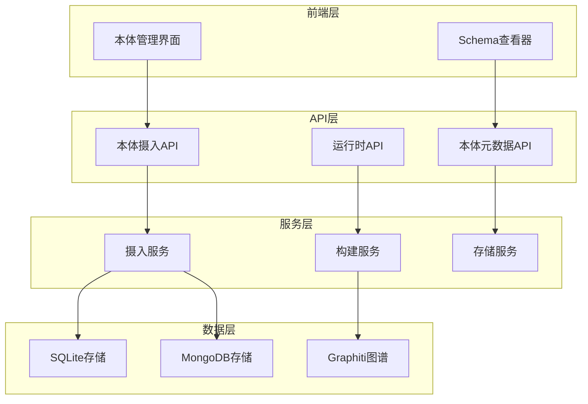
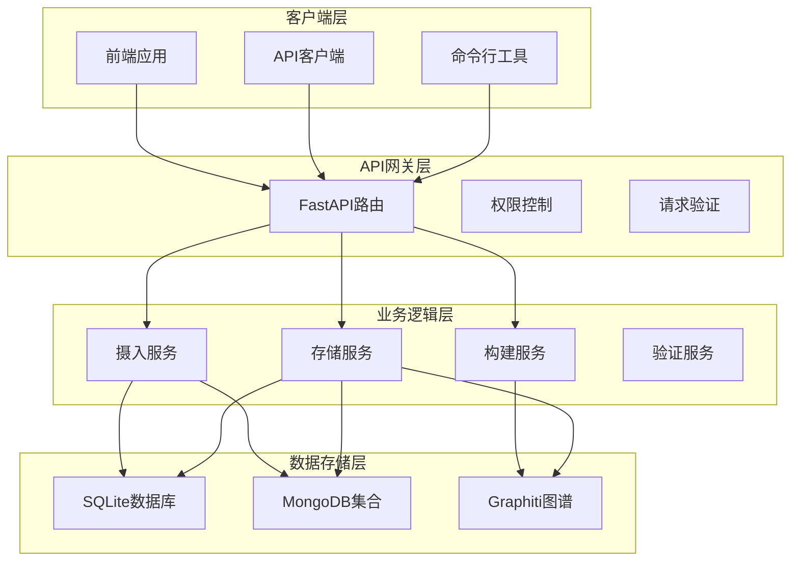
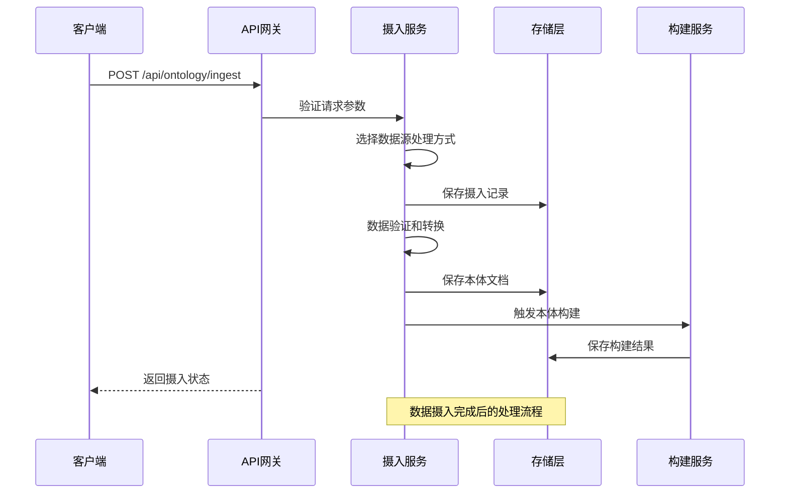
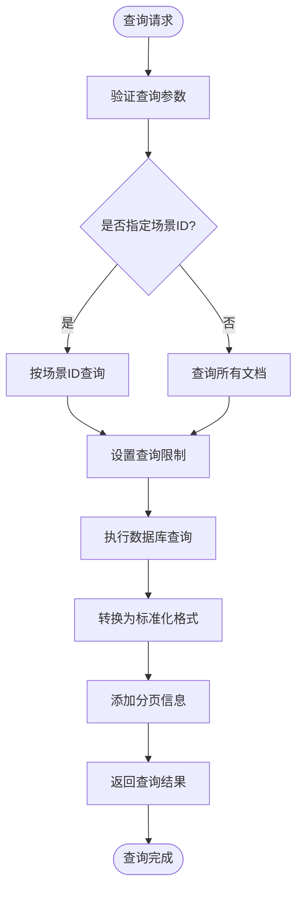
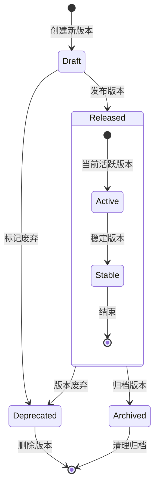
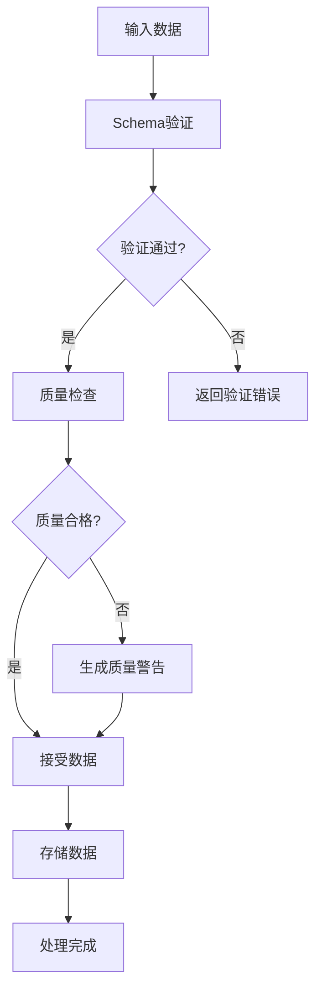
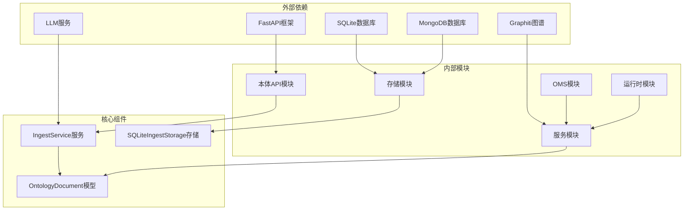
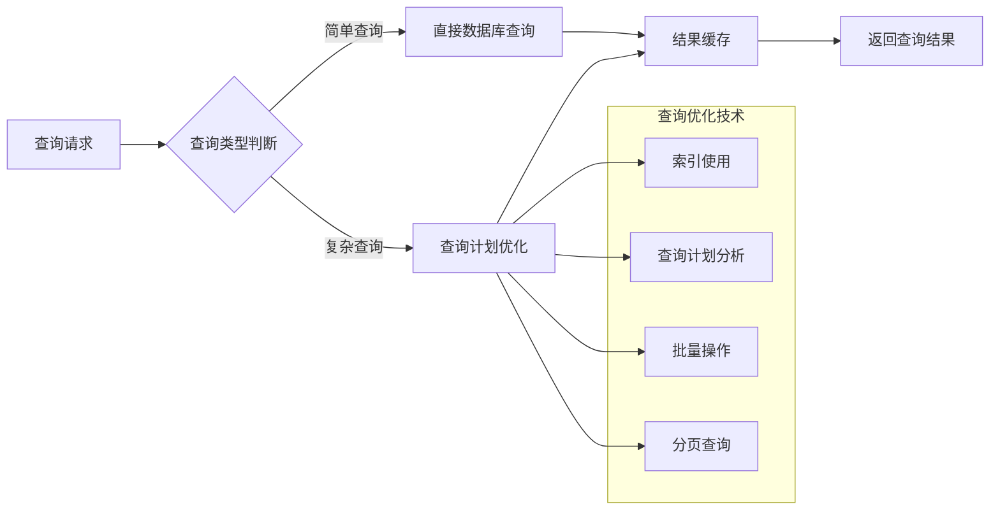
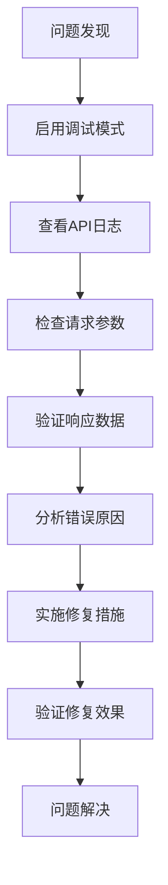

# 本体文档API

<cite>
**本文档引用的文件**
- [routes.py](file://odap/biz/core/ontology/api/routes.py)
- [routes.py](file://odap/biz/core/ontology/oms/routes.py)
- [routes.py](file://odap/web/gateway/api_gateway.py)
- [document.py](file://odap/biz/core/ontology/schema/document.py)
- [ingest_service.py](file://odap/biz/core/ontology/services/ingest_service.py)
- [sqlite_ingest_storage.py](file://odap/biz/core/ontology/storage/sqlite_ingest_storage.py)
- [DATABASE_DESIGN.md](file://docs/10-api/DATABASE_DESIGN.md)
- [ADR-032_standard_ontology_document_format.md](file://docs/07-adr/ADR-032_standard_ontology_document_format.md)
- [api.ts](file://frontend/src/modules/shared/services/api.ts)
- [routes.py](file://odap/biz/core/ontology/runtime/api/routes.py)
</cite>

## 目录
1. [简介](#简介)
2. [项目结构](#项目结构)
3. [核心组件](#核心组件)
4. [架构概览](#架构概览)
5. [详细组件分析](#详细组件分析)
6. [依赖关系分析](#依赖关系分析)
7. [性能考虑](#性能考虑)
8. [故障排除指南](#故障排除指南)
9. [结论](#结论)

## 简介

ODAP平台的本体文档API是一套完整的本体数据管理解决方案，为本体设计师和系统管理员提供了全面的本体文档查询、获取和管理功能。该API基于标准化的OntologyDocument格式，支持多种数据来源的统一处理，包括新闻采集、手动输入、随机事件生成等。

本体文档API的核心价值在于：
- **标准化数据格式**：统一的OntologyDocument JSON格式，确保数据的一致性和可扩展性
- **多源数据整合**：支持新闻、手动、随机等多种数据来源的统一处理
- **完整的生命周期管理**：从数据摄入到版本控制的全流程管理
- **强大的查询能力**：支持按场景ID过滤、分页查询等灵活的查询方式
- **完善的版本控制**：基于Git-like的版本管理系统，支持版本回溯和审计

## 项目结构

ODAP平台采用模块化架构设计，本体文档API主要分布在以下几个关键模块中：

**图表来源**
- [routes.py:13-527](file://odap/biz/core/ontology/api/routes.py#L13-L527)
- [routes.py:10-99](file://odap/biz/core/ontology/oms/routes.py#L10-L99)

**章节来源**
- [routes.py:1-527](file://odap/biz/core/ontology/api/routes.py#L1-L527)
- [routes.py:1-99](file://odap/biz/core/ontology/oms/routes.py#L1-L99)

## 核心组件

### 本体文档标准化格式

本体文档API基于标准化的OntologyDocument格式，该格式经过ADR-032正式确立，确保了数据的一致性和可扩展性。

#### 核心数据结构

| 组件 | 字段 | 类型 | 必填 | 说明 |
|------|------|------|------|------|
| 文档标识 | $schema | string | ✅ | Schema URL，版本化 |
| | doc_id | string | ✅ | 全局唯一ID，建议前缀：evt-, unit-, scenario- |
| | doc_type | enum | ✅ | event/entity/scenario/batch |
| 元数据 | source | object | ✅ | 数据来源信息 |
| | meta | object | ✅ | 标题、描述、标签、分类级别 |
| 内容体 | entities | array | ✅ | 实体列表 |
| | relations | array | ✅ | 关系列表 |
| | events | array | ✅ | 事件序列 |
| | actions | array | ⬜ | 行动列表 |
| | rules | array | ⬜ | 规则集合 |
| | constraints | array | ⬜ | 约束集合 |
| 版本信息 | ontology_version | object | ✅ | 版本控制信息 |

#### 数据来源类型

| 类型 | 说明 | 使用场景 |
|------|------|----------|
| news_ingest | 新闻采集 | 自动从新闻源提取结构化数据 |
| manual | 手动输入 | 用户手动录入数据 |
| random_gen | 随机生成 | 自动生成模拟事件数据 |
| import | 系统导入 | 从外部系统导入历史数据 |
| simulation | 模拟推演 | 从模拟推演生成的数据 |

**章节来源**
- [document.py:212-404](file://odap/biz/core/ontology/schema/document.py#L212-L404)
- [ADR-032_standard_ontology_document_format.md:199-224](file://docs/07-adr/ADR-032_standard_ontology_document_format.md#L199-L224)

### 数据摄入服务

数据摄入服务是本体文档API的核心组件，负责处理来自不同数据源的数据，并将其转换为标准化的OntologyDocument格式。

#### 支持的数据摄入方式

| 方式 | 描述 | 特点 |
|------|------|------|
| URL摄入 | 从网页URL提取内容 | 免费网页抓取，支持多种搜索引擎 |
| 新闻搜索 | 基于关键词的新闻检索 | 支持Tavily、DuckDuckGo、SerpAPI等引擎 |
| 手动输入 | 用户表单或JSON数据 | 支持结构化和非结构化数据 |
| JSON导入 | 直接导入JSON格式数据 | 快速批量处理 |
| 自然语言 | 从自然语言描述提取 | LLM辅助理解 |
| 随机事件 | 自动生成模拟事件 | 支持多种事件类型 |

**章节来源**
- [ingest_service.py:330-800](file://odap/biz/core/ontology/services/ingest_service.py#L330-L800)

### 存储架构

本体文档API采用多存储引擎混合架构，根据不同数据特性和访问模式选择最优的存储方案。

#### 存储策略

| 存储引擎 | 用途 | 数据类型 | 特点 |
|----------|------|----------|------|
| SQLite | 结构化业务数据 | 摄入记录、审计日志 | 轻量、零配置、事务支持 |
| MongoDB | 文档型数据 | 本体文档、摄入记录 | 文档模型、Schema-less |
| Graphiti | 知识图谱 | 实体关系、事件序列 | 原生图查询、双时态支持 |
| Redis | 缓存数据 | 会话状态、临时数据 | 内存级性能、TTL支持 |

**章节来源**
- [DATABASE_DESIGN.md:10-28](file://docs/10-api/DATABASE_DESIGN.md#L10-L28)

## 架构概览

本体文档API采用分层架构设计，确保了系统的可扩展性和可维护性。

**图表来源**
- [routes.py:1-527](file://odap/biz/core/ontology/api/routes.py#L1-L527)
- [routes.py:1-99](file://odap/biz/core/ontology/oms/routes.py#L1-L99)

### API路由设计

本体文档API采用RESTful设计原则，提供了清晰的资源层次结构。

#### 主要API端点

| 端点 | 方法 | 功能 | 权限要求 |
|------|------|------|----------|
| `/api/ontology/ingest` | POST | 通用数据摄入接口 | ontology:create |
| `/api/ontology/ingest/news` | POST | 新闻数据摄入 | ontology:create |
| `/api/ontology/ingest/manual` | POST | 手动数据摄入 | ontology:create |
| `/api/ontology/ingest/json` | POST | JSON数据摄入 | ontology:create |
| `/api/ontology/ingest/documents/list` | GET | 获取文档列表 | ontology:read |
| `/api/ontology/ingest/documents/{doc_id}` | GET | 获取文档详情 | ontology:read |
| `/api/ontology/oms/object-types` | GET | 获取对象类型列表 | ontology:read |
| `/api/ontology/oms/action-types` | GET | 获取动作类型列表 | ontology:read |

**章节来源**
- [routes.py:13-527](file://odap/biz/core/ontology/api/routes.py#L13-L527)
- [routes.py:10-99](file://odap/biz/core/ontology/oms/routes.py#L10-L99)

## 详细组件分析

### 数据摄入流程

数据摄入是本体文档API的核心流程，涉及多个处理阶段和验证步骤。

**图表来源**
- [ingest_service.py:330-800](file://odap/biz/core/ontology/services/ingest_service.py#L330-L800)
- [routes.py:74-125](file://odap/biz/core/ontology/api/routes.py#L74-L125)

#### 数据摄入阶段

1. **请求接收**：API网关接收客户端请求，进行基本的参数验证
2. **数据源选择**：根据source_type选择相应的数据处理方式
3. **数据处理**：调用相应处理器（NewsIngester、ManualInputHandler等）
4. **验证检查**：使用OntologyDocumentSchema进行格式验证
5. **存储持久化**：将处理后的数据保存到数据库
6. **构建触发**：自动触发本体构建流程
7. **状态更新**：更新摄入记录的状态和统计数据

**章节来源**
- [ingest_service.py:373-793](file://odap/biz/core/ontology/services/ingest_service.py#L373-L793)

### 本体文档查询接口

本体文档查询接口提供了灵活的查询能力，支持按场景ID过滤和分页查询。

**图表来源**
- [routes.py:354-367](file://odap/biz/core/ontology/api/routes.py#L354-L367)
- [sqlite_ingest_storage.py:904-949](file://odap/biz/core/ontology/storage/sqlite_ingest_storage.py#L904-L949)

#### 查询参数说明

| 参数 | 类型 | 必填 | 默认值 | 说明 |
|------|------|------|--------|------|
| scenario_id | string | 否 | null | 场景ID，用于过滤特定场景的文档 |
| limit | integer | 否 | 100 | 返回记录的最大数量 |
| offset | integer | 否 | 0 | 查询偏移量 |

**章节来源**
- [routes.py:354-367](file://odap/biz/core/ontology/api/routes.py#L354-L367)
- [sqlite_ingest_storage.py:904-949](file://odap/biz/core/ontology/storage/sqlite_ingest_storage.py#L904-L949)

### 版本控制系统

本体文档API实现了基于Git-like的版本控制系统，支持版本创建、回溯和审计功能。

#### 版本管理流程

**图表来源**
- [DATABASE_DESIGN.md:616-637](file://docs/10-api/DATABASE_DESIGN.md#L616-L637)

#### 版本控制特性

| 特性 | 描述 | 用途 |
|------|------|------|
| 版本链 | 支持父版本指针，形成版本树 | 版本回溯和差异比较 |
| 不可变存储 | 写入后数据不可修改 | 数据完整性保证 |
| 版本审计 | 完整的版本变更记录 | 合规性和追溯性 |
| 回滚机制 | 支持版本回滚操作 | 错误恢复和数据修复 |

**章节来源**
- [DATABASE_DESIGN.md:616-637](file://docs/10-api/DATABASE_DESIGN.md#L616-L637)

### 数据验证和质量控制

本体文档API实现了多层次的数据验证和质量控制机制，确保数据的准确性和一致性。

#### 验证流程

**图表来源**
- [document.py:418-486](file://odap/biz/core/ontology/schema/document.py#L418-L486)

#### 验证规则

| 验证类型 | 规则描述 | 错误级别 |
|----------|----------|----------|
| 必填字段验证 | 检查doc_id、doc_type等必需字段 | 错误 |
| 数据类型验证 | 验证字段数据类型正确性 | 错误 |
| 业务规则验证 | 检查实体ID唯一性、关系有效性 | 错误 |
| 质量警告 | 建议性检查，如缺少描述信息 | 警告 |

**章节来源**
- [document.py:418-486](file://odap/biz/core/ontology/schema/document.py#L418-L486)

## 依赖关系分析

本体文档API的依赖关系体现了清晰的分层架构和模块化设计。

**图表来源**
- [routes.py:1-527](file://odap/biz/core/ontology/api/routes.py#L1-L527)
- [ingest_service.py:330-353](file://odap/biz/core/ontology/services/ingest_service.py#L330-L353)

### 模块间依赖

| 模块 | 依赖模块 | 依赖类型 | 说明 |
|------|----------|----------|------|
| 本体API模块 | FastAPI | 外部框架 | Web框架支持 |
| 本体API模块 | IngestService | 内部服务 | 数据处理逻辑 |
| 本体API模块 | SQLiteIngestStorage | 内部存储 | 数据持久化 |
| OMS模块 | FastAPI | 外部框架 | Web框架支持 |
| 运行时模块 | Graphiti | 外部图谱 | 知识图谱支持 |
| 存储模块 | SQLite | 外部数据库 | 结构化数据存储 |
| 存储模块 | MongoDB | 外部数据库 | 文档数据存储 |

**章节来源**
- [routes.py:1-527](file://odap/biz/core/ontology/api/routes.py#L1-L527)
- [ingest_service.py:330-353](file://odap/biz/core/ontology/services/ingest_service.py#L330-L353)

## 性能考虑

本体文档API在设计时充分考虑了性能优化，采用了多种技术和策略来提升系统性能。

### 存储优化策略

| 优化技术 | 实现方式 | 性能收益 |
|----------|----------|----------|
| WAL模式 | SQLite启用WAL模式 | 提高并发写入性能 |
| 索引优化 | 为常用查询字段建立索引 | 加速查询响应时间 |
| 连接池 | 数据库连接池管理 | 减少连接开销 |
| 缓存策略 | Redis缓存热点数据 | 降低数据库压力 |

### 查询优化

### 并发处理

| 并发技术 | 实现方式 | 效果 |
|----------|----------|------|
| 异步处理 | asyncio异步任务 | 提升吞吐量 |
| 任务队列 | 后台任务处理 | 平滑处理高峰 |
| 连接池 | 数据库连接池 | 减少连接开销 |
| 缓存层 | 多级缓存策略 | 降低响应时间 |

## 故障排除指南

本体文档API提供了完善的错误处理和故障排除机制，帮助用户快速定位和解决问题。

### 常见错误类型

| 错误类型 | 错误代码 | 描述 | 解决方案 |
|----------|----------|------|----------|
| 验证错误 | 400 | 数据格式不符合Schema要求 | 检查数据格式和必填字段 |
| 权限错误 | 403 | 无权访问特定功能 | 检查用户权限配置 |
| 资源不存在 | 404 | 请求的资源不存在 | 确认资源ID的正确性 |
| 系统错误 | 500 | 服务器内部错误 | 查看系统日志和错误堆栈 |
| 超时错误 | 504 | 请求处理超时 | 优化查询或增加超时时间 |

### 调试工具和方法

#### API调试

#### 数据验证

| 验证工具 | 使用场景 | 功能描述 |
|----------|----------|----------|
| Schema验证器 | 数据入库前 | 检查数据格式正确性 |
| 日志分析器 | 系统故障排查 | 分析系统运行日志 |
| 性能监控器 | 性能问题诊断 | 监控系统性能指标 |
| 数据库检查器 | 数据一致性检查 | 验证数据库数据完整性 |

**章节来源**
- [routes.py:1-527](file://odap/biz/core/ontology/api/routes.py#L1-L527)

### 最佳实践建议

#### 开发最佳实践

1. **数据格式标准化**：始终使用标准化的OntologyDocument格式
2. **错误处理**：实现完善的错误捕获和处理机制
3. **性能优化**：合理使用缓存和索引，避免N+1查询问题
4. **安全考虑**：实施适当的权限控制和数据验证

#### 运维最佳实践

1. **监控告警**：建立完善的系统监控和告警机制
2. **备份策略**：制定定期的数据备份和恢复计划
3. **容量规划**：根据业务增长预测合理的资源规划
4. **性能调优**：定期进行性能分析和优化

## 结论

ODAP平台的本体文档API提供了一套完整、标准化的本体数据管理解决方案。通过采用模块化架构设计、标准化数据格式和完善的版本控制系统，该API能够有效支持本体设计师和系统管理员的各种需求。

### 主要优势

1. **标准化程度高**：基于OntologyDocument的统一数据格式，确保了数据的一致性和可扩展性
2. **功能完整性**：涵盖了从数据摄入到版本控制的完整生命周期管理
3. **性能优异**：采用多存储引擎混合架构和多种优化技术，确保了系统的高性能
4. **易于使用**：提供直观的API接口和丰富的前端工具，降低了使用门槛

### 未来发展方向

1. **智能化增强**：进一步利用AI技术提升数据处理和分析能力
2. **生态集成**：加强与其他系统的集成能力，扩大应用场景
3. **性能优化**：持续优化系统性能，支持更大规模的数据处理
4. **安全性提升**：加强数据安全和隐私保护机制

本体文档API为ODAP平台的核心组件之一，为构建高质量的知识图谱和智能应用奠定了坚实的基础。通过持续的优化和完善，该API将继续为用户提供更加优质的服务体验。