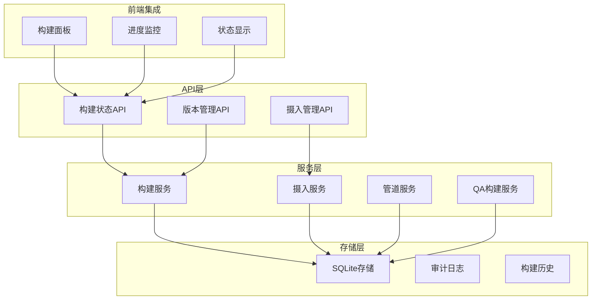
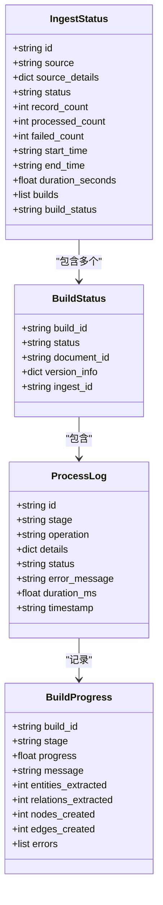
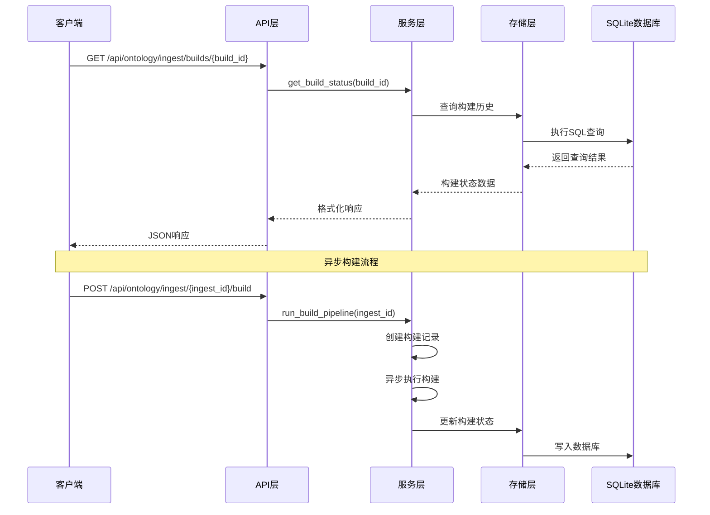
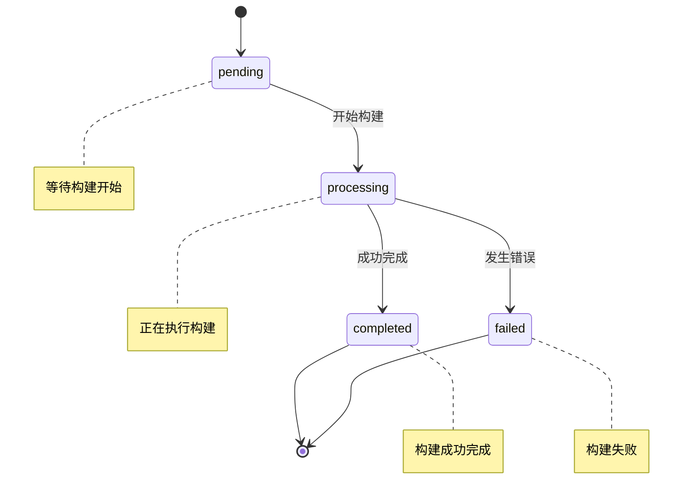
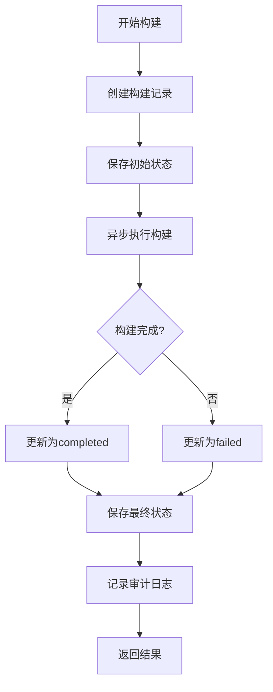
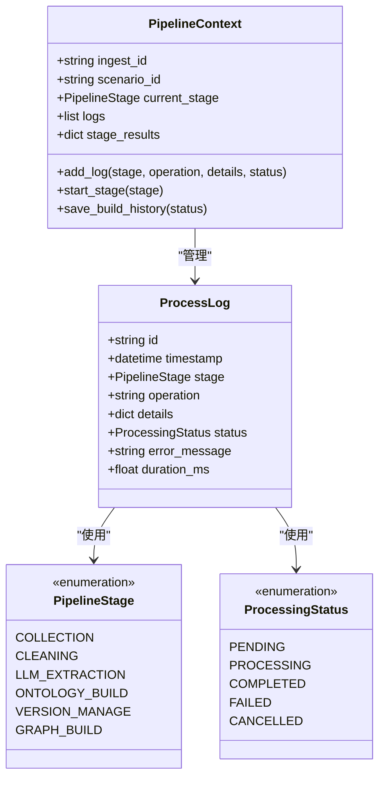
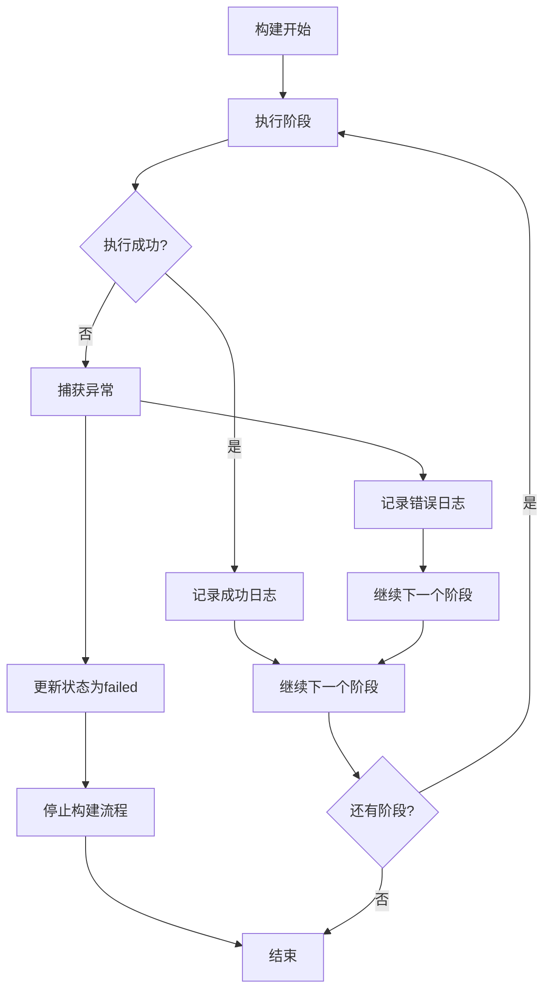
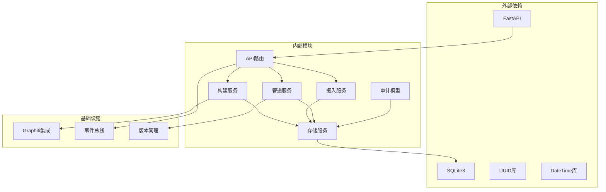
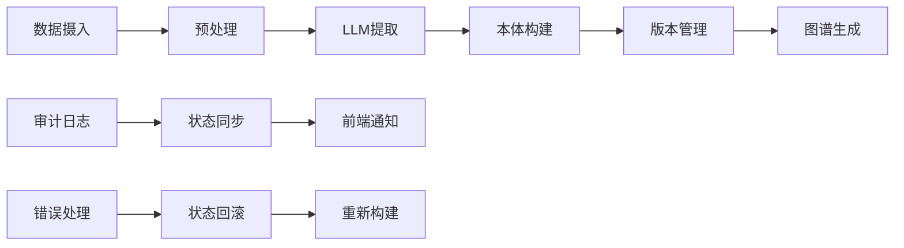

# 构建状态查询API

<cite>
**本文档引用的文件**
- [routes.py](file://odap/biz/core/ontology/api/routes.py)
- [sqlite_ingest_storage.py](file://odap/biz/core/ontology/storage/sqlite_ingest_storage.py)
- [build_service.py](file://odap/biz/core/ontology/services/build_service.py)
- [pipeline_service.py](file://odap/biz/core/ontology/services/pipeline_service.py)
- [audit.py](file://odap/biz/core/ontology/models/audit.py)
- [IngestPanel.tsx](file://frontend/src/modules/ingest/pages/IngestPanel.tsx)
- [qa_ontology_builder.py](file://odap/biz/core/ontology/services/qa_ontology_builder.py)
</cite>

## 目录
1. [简介](#简介)
2. [项目结构](#项目结构)
3. [核心组件](#核心组件)
4. [架构概览](#架构概览)
5. [详细组件分析](#详细组件分析)
6. [依赖关系分析](#依赖关系分析)
7. [性能考虑](#性能考虑)
8. [故障排除指南](#故障排除指南)
9. [结论](#结论)

## 简介

ODAP平台的构建状态查询API提供了完整的本体构建生命周期管理功能。该API允许用户查询特定构建的状态和详细信息，获取构建历史列表，以及获取完整的摄入记录（包含状态、日志、构建历史）。系统支持多种构建状态，包括pending、running、completed、failed等，并提供了完整的进度监控、错误诊断和性能分析能力。

## 项目结构

ODAP平台采用模块化的架构设计，构建状态查询API主要分布在以下模块中：

**图表来源**
- [routes.py:13-527](file://odap/biz/core/ontology/api/routes.py#L13-L527)
- [sqlite_ingest_storage.py:17-35](file://odap/biz/core/ontology/storage/sqlite_ingest_storage.py#L17-L35)

**章节来源**
- [routes.py:1-527](file://odap/biz/core/ontology/api/routes.py#L1-L527)
- [sqlite_ingest_storage.py:1-200](file://odap/biz/core/ontology/storage/sqlite_ingest_storage.py#L1-L200)

## 核心组件

### API路由系统

构建状态查询API基于FastAPI框架构建，提供了RESTful接口来管理本体构建的整个生命周期。

#### 主要API端点

| 端点 | 方法 | 描述 | 请求参数 | 响应 |
|------|------|------|----------|------|
| `/api/ontology/ingest/builds/{build_id}` | GET | 获取特定构建的状态 | build_id | 构建详情 |
| `/api/ontology/ingest/builds` | GET | 获取构建历史列表 | limit | 构建历史数组 |
| `/api/ontology/ingest/{ingest_id}` | GET | 获取摄入状态 | ingest_id | 摄入状态详情 |
| `/api/ontology/ingest/{ingest_id}/full` | GET | 获取完整摄入记录 | ingest_id | 完整记录 |
| `/api/ontology/ingest/{ingest_id}/logs` | GET | 获取处理日志 | ingest_id | 日志数组 |
| `/api/ontology/ingest/{ingest_id}/build-history` | GET | 获取构建历史 | ingest_id | 构建历史 |

### 数据模型

系统定义了完整的数据模型来描述构建状态和相关数据：

**图表来源**
- [routes.py:48-72](file://odap/biz/core/ontology/api/routes.py#L48-L72)
- [audit.py:42-84](file://odap/biz/core/ontology/models/audit.py#L42-L84)

**章节来源**
- [routes.py:295-428](file://odap/biz/core/ontology/api/routes.py#L295-L428)
- [audit.py:1-84](file://odap/biz/core/ontology/models/audit.py#L1-L84)

## 架构概览

ODAP平台的构建状态查询API采用了分层架构设计，确保了系统的可维护性和扩展性：

**图表来源**
- [routes.py:419-527](file://odap/biz/core/ontology/api/routes.py#L419-L527)
- [sqlite_ingest_storage.py:1590-1673](file://odap/biz/core/ontology/storage/sqlite_ingest_storage.py#L1590-L1673)

## 详细组件分析

### 构建状态管理

#### 状态定义和转换

系统定义了完整的构建状态生命周期，支持从pending到completed或failed的完整转换过程：

**图表来源**
- [routes.py:453-527](file://odap/biz/core/ontology/api/routes.py#L453-L527)
- [sqlite_ingest_storage.py:680-709](file://odap/biz/core/ontology/storage/sqlite_ingest_storage.py#L680-L709)

#### 构建历史管理

系统提供了完整的构建历史管理功能，包括历史记录的存储、查询和版本控制：

**图表来源**
- [routes.py:453-527](file://odap/biz/core/ontology/api/routes.py#L453-L527)
- [pipeline_service.py:141-187](file://odap/biz/core/ontology/services/pipeline_service.py#L141-L187)

**章节来源**
- [routes.py:295-428](file://odap/biz/core/ontology/api/routes.py#L295-L428)
- [sqlite_ingest_storage.py:656-709](file://odap/biz/core/ontology/storage/sqlite_ingest_storage.py#L656-L709)

### 进度监控和日志管理

#### 处理日志系统

系统实现了完整的处理日志记录机制，支持每个阶段的详细日志追踪：

**图表来源**
- [pipeline_service.py:50-187](file://odap/biz/core/ontology/services/pipeline_service.py#L50-L187)
- [audit.py:32-52](file://odap/biz/core/ontology/models/audit.py#L32-L52)

#### 前端进度监控

前端实现了实时的构建进度监控功能，支持构建状态的可视化展示：

**章节来源**
- [pipeline_service.py:1-200](file://odap/biz/core/ontology/services/pipeline_service.py#L1-L200)
- [IngestPanel.tsx:166-295](file://frontend/src/modules/ingest/pages/IngestPanel.tsx#L166-L295)

### 错误诊断和性能分析

#### 错误处理机制

系统提供了完善的错误处理和诊断功能：

**图表来源**
- [build_service.py:126-135](file://odap/biz/core/ontology/services/build_service.py#L126-L135)
- [routes.py:502-521](file://odap/biz/core/ontology/api/routes.py#L502-L521)

#### 性能监控指标

系统收集和记录了关键的性能指标：

| 指标类型 | 描述 | 单位 | 存储位置 |
|----------|------|------|----------|
| 构建时长 | 整个构建过程的持续时间 | 秒 | build_history.duration_seconds |
| 实体数量 | 提取的实体总数 | 个 | build_history.entity_count |
| 关系数量 | 识别的关系总数 | 个 | build_history.relation_count |
| 事件数量 | 检测到的事件数量 | 个 | build_history.event_count |
| 阶段时长 | 各阶段的执行时间 | 毫秒 | process_logs.duration_ms |
| 错误率 | 构建失败的比例 | 百分比 | audit_logs.error_rate |

**章节来源**
- [sqlite_ingest_storage.py:1590-1673](file://odap/biz/core/ontology/storage/sqlite_ingest_storage.py#L1590-L1673)
- [pipeline_service.py:69-135](file://odap/biz/core/ontology/services/pipeline_service.py#L69-L135)

## 依赖关系分析

### 组件依赖图

**图表来源**
- [routes.py:1-12](file://odap/biz/core/ontology/api/routes.py#L1-L12)
- [build_service.py:1-20](file://odap/biz/core/ontology/services/build_service.py#L1-L20)

### 数据流分析

系统采用事件驱动的数据流架构，确保了数据的一致性和可追溯性：

**图表来源**
- [pipeline_service.py:1-13](file://odap/biz/core/ontology/services/pipeline_service.py#L1-L13)
- [build_service.py:51-135](file://odap/biz/core/ontology/services/build_service.py#L51-L135)

**章节来源**
- [routes.py:1-527](file://odap/biz/core/ontology/api/routes.py#L1-L527)
- [build_service.py:1-447](file://odap/biz/core/ontology/services/build_service.py#L1-L447)

## 性能考虑

### 存储优化

系统采用了SQLite WAL模式和适当的索引策略来优化查询性能：

- **WAL模式**: 提高并发读写的性能
- **索引优化**: 对常用查询字段建立索引
- **连接池**: 合理管理数据库连接
- **批量操作**: 减少数据库往返次数

### 缓存策略

系统实现了多层次的缓存机制：

- **内存缓存**: 缓存热点数据
- **查询缓存**: 缓存频繁查询的结果
- **构建状态缓存**: 缓存构建状态以减少数据库访问

### 异步处理

构建过程采用异步非阻塞的方式执行：

- **异步任务**: 使用asyncio处理长时间运行的任务
- **队列管理**: 使用消息队列管理构建任务
- **资源隔离**: 确保构建任务不会影响其他服务

## 故障排除指南

### 常见问题诊断

#### 构建状态查询失败

**症状**: 查询构建状态返回404错误

**可能原因**:
1. 构建ID不存在或已过期
2. 数据库连接异常
3. 缓存数据不同步

**解决方法**:
1. 验证构建ID的有效性
2. 检查数据库连接状态
3. 清除缓存并重新查询

#### 构建进度停滞

**症状**: 构建进度长时间不变

**可能原因**:
1. LLM服务响应超时
2. 数据库写入阻塞
3. 资源不足

**解决方法**:
1. 检查LLM服务状态
2. 分析数据库性能
3. 监控系统资源使用情况

#### 日志记录异常

**症状**: 处理日志缺失或不完整

**可能原因**:
1. 审计日志服务故障
2. 磁盘空间不足
3. 权限问题

**解决方法**:
1. 检查审计日志服务状态
2. 清理磁盘空间
3. 检查文件权限

**章节来源**
- [routes.py:295-428](file://odap/biz/core/ontology/api/routes.py#L295-L428)
- [sqlite_ingest_storage.py:787-808](file://odap/biz/core/ontology/storage/sqlite_ingest_storage.py#L787-L808)

## 结论

ODAP平台的构建状态查询API提供了完整的本体构建生命周期管理功能。通过模块化的架构设计、完善的错误处理机制和实时的进度监控，系统能够满足复杂本体构建场景的需求。

### 主要优势

1. **完整的生命周期管理**: 支持从数据摄入到图谱生成的完整流程
2. **实时状态监控**: 提供详细的构建进度和状态信息
3. **强大的错误处理**: 完善的异常捕获和恢复机制
4. **高性能设计**: 优化的存储和查询机制
5. **可扩展架构**: 模块化设计便于功能扩展

### 技术特点

- 基于FastAPI的现代化API设计
- SQLite轻量级存储解决方案
- 异步非阻塞的处理机制
- 完整的审计和日志系统
- 前后端分离的架构设计

该API为系统管理员和开发者提供了强大而灵活的构建状态管理工具，能够有效支持各种本体构建应用场景。