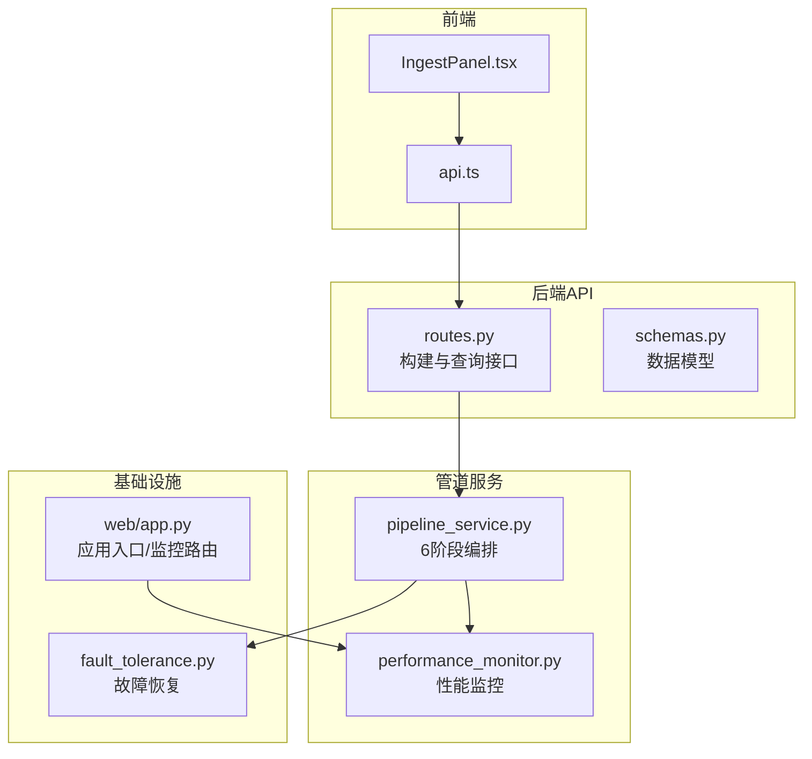
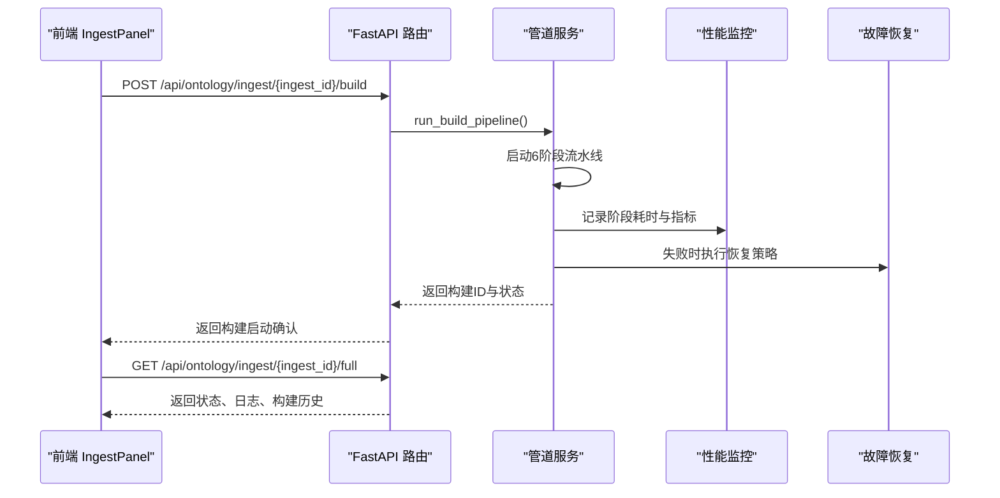
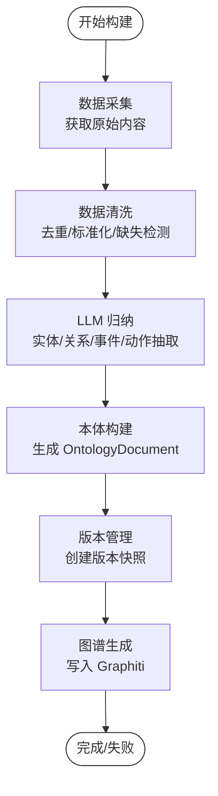
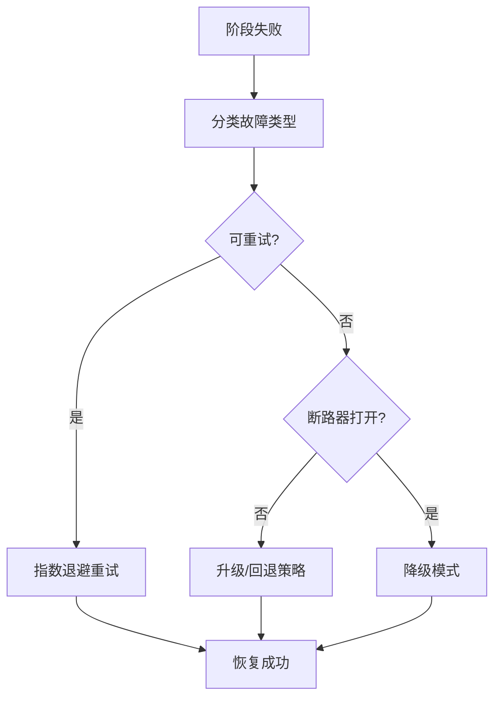
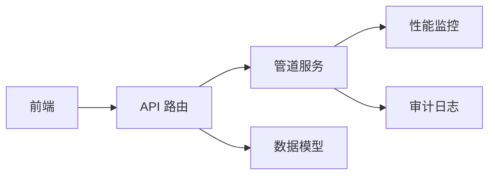

# 构建管道API

<cite>
**本文档引用的文件**
- [odap/biz/core/ontology/api/routes.py](file://odap/biz/core/ontology/api/routes.py)
- [odap/biz/core/ontology/services/pipeline_service.py](file://odap/biz/core/ontology/services/pipeline_service.py)
- [odap/biz/core/ontology/api/schemas.py](file://odap/biz/core/ontology/api/schemas.py)
- [odap/infra/monitoring/performance_monitor.py](file://odap/infra/monitoring/performance_monitor.py)
- [odap/web/app.py](file://odap/web/app.py)
- [frontend/src/modules/shared/services/api.ts](file://frontend/src/modules/shared/services/api.ts)
- [frontend/src/modules/ingest/pages/IngestPanel.tsx](file://frontend/src/modules/ingest/pages/IngestPanel.tsx)
- [docs/02-architecture/ARCHITECTURE_FULL_CHAIN_DEEP.md](file://docs/02-architecture/ARCHITECTURE_FULL_CHAIN_DEEP.md)
- [docs/03-modules/swarm_orchestrator/DESIGN.md](file://docs/03-modules/swarm_orchestrator/DESIGN.md)
- [odap/infra/resilience/fault_tolerance.py](file://odap/infra/resilience/fault_tolerance.py)
</cite>

## 目录
1. [简介](#简介)
2. [项目结构](#项目结构)
3. [核心组件](#核心组件)
4. [架构总览](#架构总览)
5. [详细组件分析](#详细组件分析)
6. [依赖分析](#依赖分析)
7. [性能考虑](#性能考虑)
8. [故障排查指南](#故障排查指南)
9. [结论](#结论)
10. [附录](#附录)

## 简介
本文件为 ODAP 平台“本体构建管道API”的全面技术参考，覆盖从数据采集、数据清洗、LLM 归纳、本体构建、版本管理到图谱生成的完整6阶段流程；同时涵盖构建状态查询、构建历史管理、结果获取、配置参数、错误处理与重试机制、进度监控与性能优化等运维与开发要点。面向系统管理员与开发者，提供可操作的接口说明、流程图示与最佳实践。

## 项目结构
ODAP 的本体构建管道围绕 FastAPI 路由、管道服务与前端交互展开，核心文件分布如下：
- API 层：负责对外暴露构建与查询接口，接收请求并返回标准响应模型
- 管道服务层：编排6个阶段，记录审计日志，持久化构建历史
- 监控与健康：提供性能监控端点与健康检查
- 前端集成：提供构建状态轮询、日志展示与构建详情面板

**图表来源**
- [odap/biz/core/ontology/api/routes.py:13-527](file://odap/biz/core/ontology/api/routes.py#L13-L527)
- [odap/biz/core/ontology/services/pipeline_service.py:1-800](file://odap/biz/core/ontology/services/pipeline_service.py#L1-L800)
- [odap/infra/monitoring/performance_monitor.py:1-184](file://odap/infra/monitoring/performance_monitor.py#L1-L184)
- [odap/web/app.py:244-261](file://odap/web/app.py#L244-L261)
- [frontend/src/modules/ingest/pages/IngestPanel.tsx:200-295](file://frontend/src/modules/ingest/pages/IngestPanel.tsx#L200-L295)
- [frontend/src/modules/shared/services/api.ts:414-465](file://frontend/src/modules/shared/services/api.ts#L414-L465)

**章节来源**
- [odap/biz/core/ontology/api/routes.py:13-527](file://odap/biz/core/ontology/api/routes.py#L13-L527)
- [odap/biz/core/ontology/services/pipeline_service.py:1-800](file://odap/biz/core/ontology/services/pipeline_service.py#L1-L800)
- [odap/infra/monitoring/performance_monitor.py:1-184](file://odap/infra/monitoring/performance_monitor.py#L1-L184)
- [odap/web/app.py:244-261](file://odap/web/app.py#L244-L261)
- [frontend/src/modules/ingest/pages/IngestPanel.tsx:200-295](file://frontend/src/modules/ingest/pages/IngestPanel.tsx#L200-L295)
- [frontend/src/modules/shared/services/api.ts:414-465](file://frontend/src/modules/shared/services/api.ts#L414-L465)

## 核心组件
- 构建管道服务：实现6阶段流水线，记录阶段日志与审计，持久化构建历史
- API 路由：提供构建启动、状态查询、历史查询、版本回滚等接口
- 性能监控：提供性能指标采集、统计与导出能力
- 前端集成：轮询构建状态、展示日志与构建详情

**章节来源**
- [odap/biz/core/ontology/services/pipeline_service.py:50-188](file://odap/biz/core/ontology/services/pipeline_service.py#L50-L188)
- [odap/biz/core/ontology/api/routes.py:294-527](file://odap/biz/core/ontology/api/routes.py#L294-L527)
- [odap/infra/monitoring/performance_monitor.py:12-184](file://odap/infra/monitoring/performance_monitor.py#L12-L184)

## 架构总览
下图展示了从前端到后端API、管道服务与监控的整体交互：

**图表来源**
- [odap/biz/core/ontology/api/routes.py:419-527](file://odap/biz/core/ontology/api/routes.py#L419-L527)
- [odap/biz/core/ontology/services/pipeline_service.py:50-188](file://odap/biz/core/ontology/services/pipeline_service.py#L50-L188)
- [odap/infra/monitoring/performance_monitor.py:12-184](file://odap/infra/monitoring/performance_monitor.py#L12-L184)
- [frontend/src/modules/ingest/pages/IngestPanel.tsx:200-295](file://frontend/src/modules/ingest/pages/IngestPanel.tsx#L200-L295)

## 详细组件分析

### API 接口与数据模型
- 构建相关接口
  - POST /api/ontology/ingest/{ingest_id}/build：启动本体构建管道
  - GET /api/ontology/ingest/builds/{build_id}：查询构建状态
  - GET /api/ontology/ingest/builds：查询构建历史
  - POST /api/ontology/versions/rollback：回滚到指定版本
  - GET /api/ontology/ingest/{ingest_id}/full：获取摄入记录的完整信息（含日志与构建历史）

- 数据模型
  - IngestStatusResponse：摄入状态响应
  - BuildFromIngestResponse：从摄入构建响应
  - 版本管理相关模型：创建版本、版本列表、回滚版本、对比版本等

**章节来源**
- [odap/biz/core/ontology/api/routes.py:294-527](file://odap/biz/core/ontology/api/routes.py#L294-L527)
- [odap/biz/core/ontology/api/schemas.py:1-239](file://odap/biz/core/ontology/api/schemas.py#L1-L239)

### 管道服务与6阶段流程
- 阶段划分
  - 数据采集（Collection）：从摄入记录获取原始内容
  - 数据清洗（Cleaning）：去重、标准化、缺失值检测
  - LLM 归纳（LLM Extraction）：实体、关系、事件与动作抽取
  - 本体构建（Ontology Build）：生成 OntologyDocument
  - 版本管理（Version）：创建版本快照与变更摘要
  - 图谱生成（Graph）：写入 Graphiti 并触发审计

- 日志与审计
  - 每阶段记录 ProcessLog，包含开始/结束时间、耗时、状态与错误信息
  - 统一审计日志记录构建完成/失败事件

- 异步执行
  - 启动构建后立即返回，后台异步执行并更新构建历史

**图表来源**
- [odap/biz/core/ontology/services/pipeline_service.py:1-800](file://odap/biz/core/ontology/services/pipeline_service.py#L1-L800)

**章节来源**
- [odap/biz/core/ontology/services/pipeline_service.py:50-188](file://odap/biz/core/ontology/services/pipeline_service.py#L50-L188)

### 前端集成与进度展示
- 前端通过轮询获取摄入记录的完整信息，重建构建详情
- 基于日志阶段状态判断当前阶段与完成情况
- 展示构建版本号、实体/关系/事件数量、完成状态

**章节来源**
- [frontend/src/modules/ingest/pages/IngestPanel.tsx:200-295](file://frontend/src/modules/ingest/pages/IngestPanel.tsx#L200-L295)
- [frontend/src/modules/shared/services/api.ts:414-465](file://frontend/src/modules/shared/services/api.ts#L414-L465)

### 错误处理与重试机制
- 管道阶段异常会记录到 ProcessLog 并标记失败
- 故障恢复管理器支持指数退避重试、断路器、降级模式等策略
- 重试装饰器与指数退避策略可用于关键调用

**图表来源**
- [odap/infra/resilience/fault_tolerance.py:49-137](file://odap/infra/resilience/fault_tolerance.py#L49-L137)
- [docs/03-modules/swarm_orchestrator/DESIGN.md:278-634](file://docs/03-modules/swarm_orchestrator/DESIGN.md#L278-L634)
- [docs/02-architecture/ARCHITECTURE_FULL_CHAIN_DEEP.md:929-983](file://docs/02-architecture/ARCHITECTURE_FULL_CHAIN_DEEP.md#L929-L983)

**章节来源**
- [odap/infra/resilience/fault_tolerance.py:49-137](file://odap/infra/resilience/fault_tolerance.py#L49-L137)
- [docs/03-modules/swarm_orchestrator/DESIGN.md:278-634](file://docs/03-modules/swarm_orchestrator/DESIGN.md#L278-L634)
- [docs/02-architecture/ARCHITECTURE_FULL_CHAIN_DEEP.md:929-983](file://docs/02-architecture/ARCHITECTURE_FULL_CHAIN_DEEP.md#L929-L983)

### 性能监控与健康检查
- 性能监控器提供指标采集、统计与导出，支持 LLM 调用、数据库查询、API 请求、工具执行等
- 应用入口提供性能监控端点与重置接口
- 健康监控器评估 Agent 健康、系统资源、外部依赖与性能指标

**章节来源**
- [odap/infra/monitoring/performance_monitor.py:1-184](file://odap/infra/monitoring/performance_monitor.py#L1-L184)
- [odap/web/app.py:244-261](file://odap/web/app.py#L244-L261)
- [docs/03-modules/swarm_orchestrator/DESIGN.md:783-1357](file://docs/03-modules/swarm_orchestrator/DESIGN.md#L783-L1357)

## 依赖分析
- API 路由依赖管道服务与版本服务，返回统一数据模型
- 管道服务依赖审计日志、存储与 LLM 客户端
- 前端通过 API 服务访问后端接口，轮询构建状态

**图表来源**
- [odap/biz/core/ontology/api/routes.py:13-527](file://odap/biz/core/ontology/api/routes.py#L13-L527)
- [odap/biz/core/ontology/services/pipeline_service.py:1-800](file://odap/biz/core/ontology/services/pipeline_service.py#L1-L800)
- [odap/infra/monitoring/performance_monitor.py:1-184](file://odap/infra/monitoring/performance_monitor.py#L1-L184)

**章节来源**
- [odap/biz/core/ontology/api/routes.py:13-527](file://odap/biz/core/ontology/api/routes.py#L13-L527)
- [odap/biz/core/ontology/services/pipeline_service.py:1-800](file://odap/biz/core/ontology/services/pipeline_service.py#L1-L800)
- [odap/infra/monitoring/performance_monitor.py:1-184](file://odap/infra/monitoring/performance_monitor.py#L1-L184)

## 性能考虑
- 指标采集：使用性能监控器记录 LLM 调用、数据库查询、API 请求与工具执行的耗时
- 统计输出：支持均值、中位数、P95/P99 等指标，便于定位瓶颈
- 导出与重置：提供指标导出与重置接口，便于运维观测与归零对比
- 建议
  - 对 LLM 调用实施指数退避与断路器策略
  - 控制并发与批大小，避免系统资源过载
  - 使用健康监控器持续评估外部依赖与系统资源

**章节来源**
- [odap/infra/monitoring/performance_monitor.py:1-184](file://odap/infra/monitoring/performance_monitor.py#L1-L184)
- [odap/web/app.py:244-261](file://odap/web/app.py#L244-L261)
- [docs/03-modules/swarm_orchestrator/DESIGN.md:783-1357](file://docs/03-modules/swarm_orchestrator/DESIGN.md#L783-L1357)

## 故障排查指南
- 构建失败定位
  - 通过 GET /api/ontology/ingest/{ingest_id}/full 获取日志与构建历史，定位失败阶段
  - 查看 ProcessLog 的错误信息与耗时，结合审计日志定位问题
- 重试与降级
  - 检查断路器状态与重试次数，必要时触发降级模式
  - 对外部依赖（如 LLM、Graphiti、OPA）进行健康检查
- 前端状态轮询
  - 前端按固定周期轮询，重建构建详情，展示阶段状态与日志

**章节来源**
- [odap/biz/core/ontology/api/routes.py:370-416](file://odap/biz/core/ontology/api/routes.py#L370-L416)
- [frontend/src/modules/ingest/pages/IngestPanel.tsx:200-295](file://frontend/src/modules/ingest/pages/IngestPanel.tsx#L200-L295)
- [odap/infra/resilience/fault_tolerance.py:49-137](file://odap/infra/resilience/fault_tolerance.py#L49-L137)

## 结论
本体构建管道API提供了从数据采集到图谱生成的完整链路，配合完善的日志、审计与监控能力，能够满足生产环境的可观测性与可靠性需求。通过统一的接口与数据模型，系统管理员与开发者可以高效地启动构建、查询状态、管理版本并进行故障排查。

## 附录

### API 参考概览
- 启动构建
  - 方法：POST
  - 路径：/api/ontology/ingest/{ingest_id}/build
  - 描述：异步启动构建，返回构建ID与状态
- 查询构建状态
  - 方法：GET
  - 路径：/api/ontology/ingest/builds/{build_id}
  - 描述：获取指定构建的状态与版本信息
- 查询构建历史
  - 方法：GET
  - 路径：/api/ontology/ingest/builds
  - 描述：获取构建历史列表
- 回滚版本
  - 方法：POST
  - 路径：/api/ontology/versions/rollback
  - 描述：回滚到指定版本
- 获取摄入记录完整信息
  - 方法：GET
  - 路径：/api/ontology/ingest/{ingest_id}/full
  - 描述：返回状态、日志与构建历史

**章节来源**
- [odap/biz/core/ontology/api/routes.py:294-527](file://odap/biz/core/ontology/api/routes.py#L294-L527)