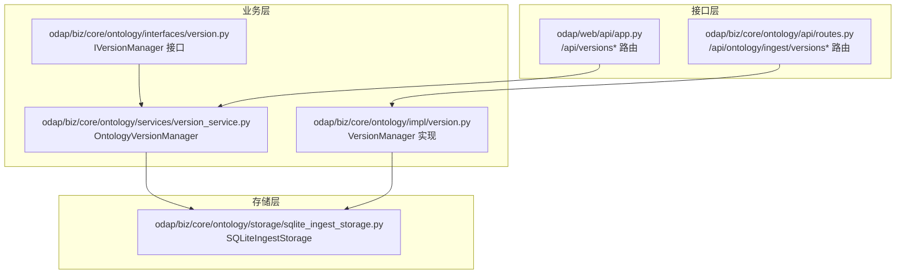
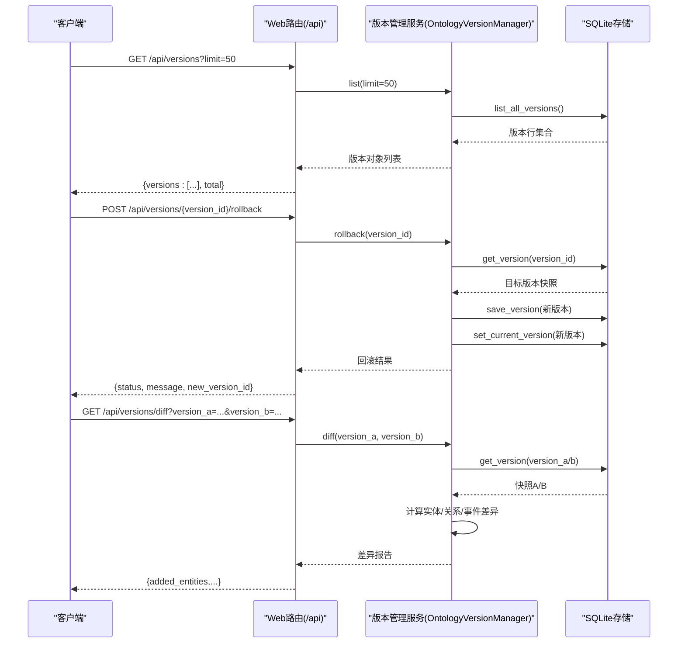
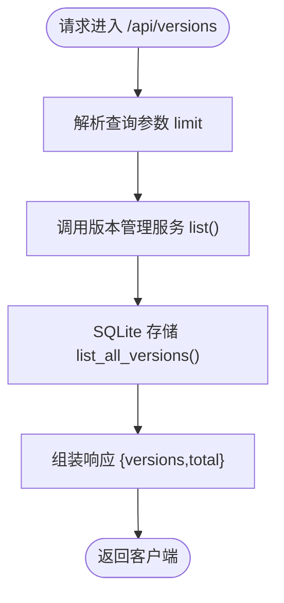
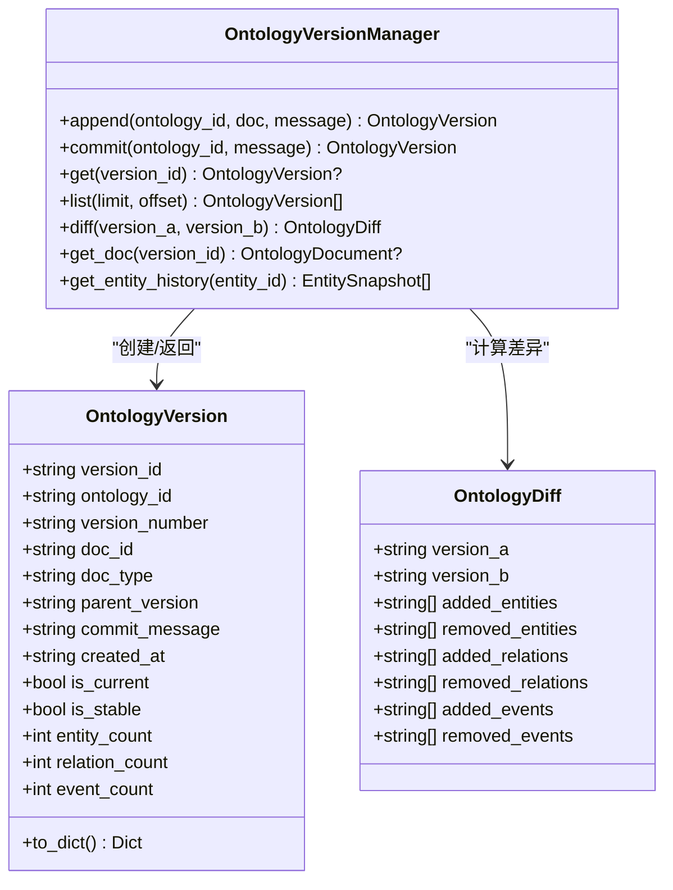
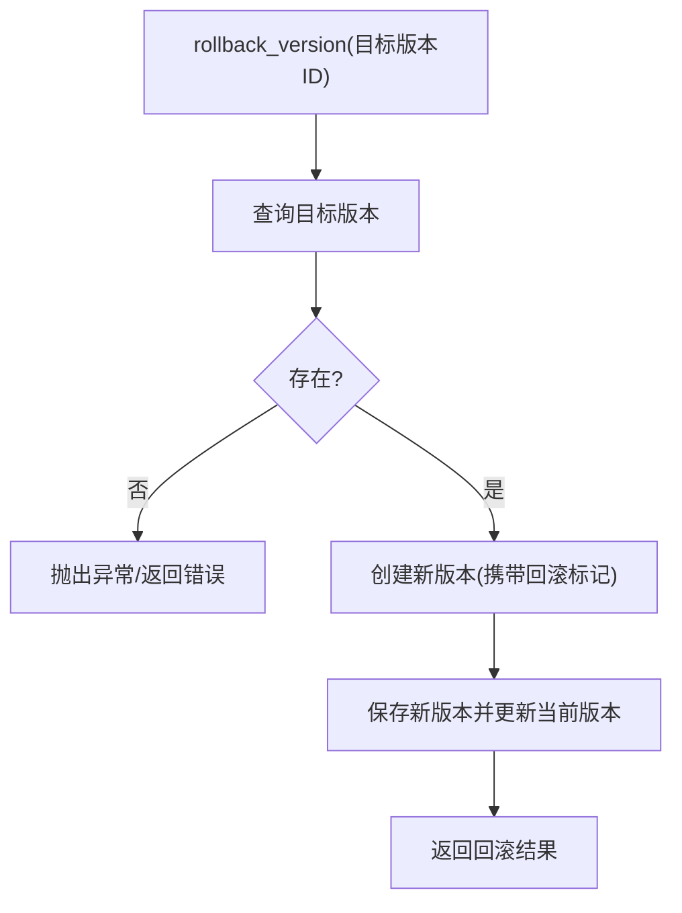
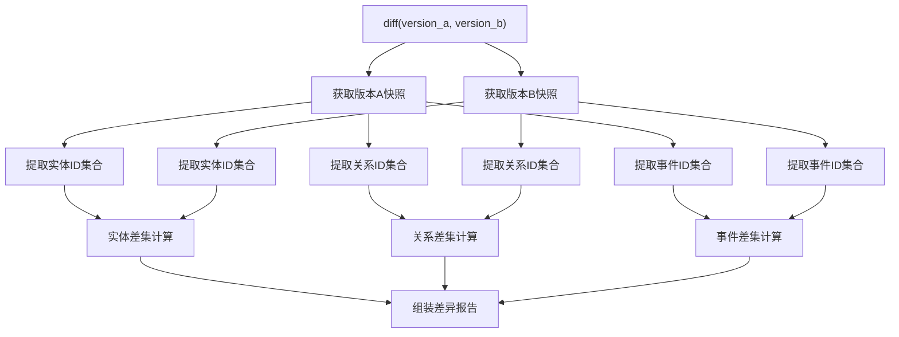
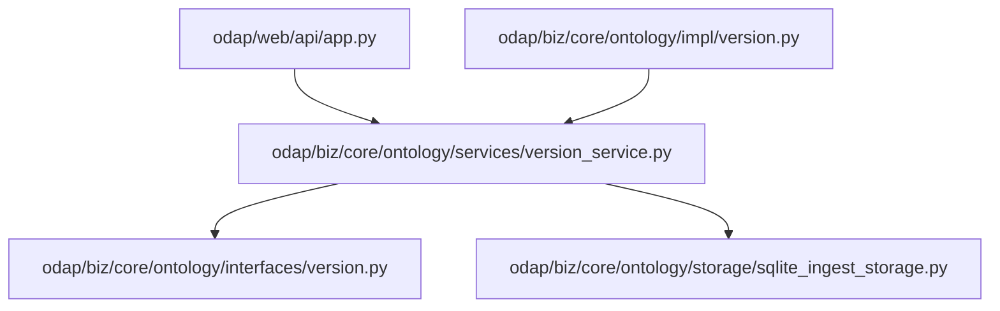

# 版本管理API

<cite>
**本文引用的文件**
- [odap/web/api/app.py](file://odap/web/api/app.py)
- [odap/biz/core/ontology/api/routes.py](file://odap/biz/core/ontology/api/routes.py)
- [odap/biz/core/ontology/services/version_service.py](file://odap/biz/core/ontology/services/version_service.py)
- [odap/biz/core/ontology/impl/version.py](file://odap/biz/core/ontology/impl/version.py)
- [odap/biz/core/ontology/interfaces/version.py](file://odap/biz/core/ontology/interfaces/version.py)
- [odap/biz/core/ontology/storage/sqlite_ingest_storage.py](file://odap/biz/core/ontology/storage/sqlite_ingest_storage.py)
- [odap/web/static/index.html](file://odap/web/static/index.html)
- [frontend/src/test/api_integration.test.ts](file://frontend/src/test/api_integration.test.ts)
- [docs/02-architecture/reports/ARCHITECTURE_REVIEW_20260423.md](file://docs/02-architecture/reports/ARCHITECTURE_REVIEW_20260423.md)
- [docs/02-architecture/ARCHITECTURE_FULL_CHAIN_DEEP.md](file://docs/02-architecture/ARCHITECTURE_FULL_CHAIN_DEEP.md)
- [odap/biz/core/ontology/services/build_service.py](file://odap/biz/core/ontology/services/build_service.py)
</cite>

## 目录
1. [简介](#简介)
2. [项目结构](#项目结构)
3. [核心组件](#核心组件)
4. [架构总览](#架构总览)
5. [详细组件分析](#详细组件分析)
6. [依赖分析](#依赖分析)
7. [性能考量](#性能考量)
8. [故障排查指南](#故障排查指南)
9. [结论](#结论)
10. [附录](#附录)

## 简介
本文件为 ODAP 平台“版本管理API”的权威参考文档，覆盖以下能力与职责：
- 版本列表查询：支持分页、排序与过滤，返回版本基础信息与统计指标。
- 版本回滚：安全地将当前状态切换到指定历史版本，保留变更可追溯性。
- 版本比较：对比两个版本的实体、关系与事件差异，输出结构化差异报告。
- 版本链维护：通过父子指针形成单向版本链，支持版本演进可视化与审计。
- 最佳实践：版本命名规范、发布策略、回滚安全措施、冲突处理与备份恢复策略。

本API面向系统管理员与开发者，提供清晰的接口定义、调用流程与运维指南。

## 项目结构
版本管理API由三层组成：
- 接口层：Web路由与HTTP端点，负责请求解析、参数校验与异常处理。
- 业务层：版本管理服务与实现类，封装版本创建、回滚、比较与历史查询等核心逻辑。
- 存储层：SQLite存储，持久化版本元数据、快照与变更摘要。

**图表来源**
- [odap/web/api/app.py:758-785](file://odap/web/api/app.py#L758-L785)
- [odap/biz/core/ontology/api/routes.py:334-351](file://odap/biz/core/ontology/api/routes.py#L334-L351)
- [odap/biz/core/ontology/services/version_service.py:84-112](file://odap/biz/core/ontology/services/version_service.py#L84-L112)
- [odap/biz/core/ontology/impl/version.py:13-16](file://odap/biz/core/ontology/impl/version.py#L13-L16)
- [odap/biz/core/ontology/interfaces/version.py:11-12](file://odap/biz/core/ontology/interfaces/version.py#L11-L12)
- [odap/biz/core/ontology/storage/sqlite_ingest_storage.py:17-45](file://odap/biz/core/ontology/storage/sqlite_ingest_storage.py#L17-L45)

**章节来源**
- [odap/web/api/app.py:758-785](file://odap/web/api/app.py#L758-L785)
- [odap/biz/core/ontology/api/routes.py:334-351](file://odap/biz/core/ontology/api/routes.py#L334-L351)
- [odap/biz/core/ontology/services/version_service.py:84-112](file://odap/biz/core/ontology/services/version_service.py#L84-L112)
- [odap/biz/core/ontology/impl/version.py:13-16](file://odap/biz/core/ontology/impl/version.py#L13-L16)
- [odap/biz/core/ontology/interfaces/version.py:11-12](file://odap/biz/core/ontology/interfaces/version.py#L11-L12)
- [odap/biz/core/ontology/storage/sqlite_ingest_storage.py:17-45](file://odap/biz/core/ontology/storage/sqlite_ingest_storage.py#L17-L45)

## 核心组件
- Web API 路由
  - GET /api/versions：列出版本列表，支持 limit 参数；返回版本数组与总数。
  - GET /api/versions/{version_id}：获取指定版本详情。
  - POST /api/versions/{version_id}/rollback：回滚到指定版本。
  - GET /api/versions/diff：对比两个版本差异。
- 版本管理服务
  - OntologyVersionManager：提供 append/commit、get/list/diff、历史查询与实体历史追踪。
  - VersionManager（impl）：基于SQLite的版本管理实现，支持回滚、合并与版本历史。
  - IVersionManager：版本管理接口，定义统一能力契约。
- 存储
  - SQLiteIngestStorage：提供版本的保存、查询、当前版本锁定与快照合并等能力。

**章节来源**
- [odap/web/api/app.py:758-785](file://odap/web/api/app.py#L758-L785)
- [odap/biz/core/ontology/services/version_service.py:84-112](file://odap/biz/core/ontology/services/version_service.py#L84-L112)
- [odap/biz/core/ontology/impl/version.py:13-16](file://odap/biz/core/ontology/impl/version.py#L13-L16)
- [odap/biz/core/ontology/interfaces/version.py:11-12](file://odap/biz/core/ontology/interfaces/version.py#L11-L12)
- [odap/biz/core/ontology/storage/sqlite_ingest_storage.py:17-45](file://odap/biz/core/ontology/storage/sqlite_ingest_storage.py#L17-L45)

## 架构总览
版本管理API采用“路由-服务-存储”分层架构，接口层负责REST交互，业务层封装领域逻辑，存储层负责持久化与事务控制。版本链通过 parent_version_id 维护，支持快照式版本对比与回滚。

**图表来源**
- [odap/web/api/app.py:758-785](file://odap/web/api/app.py#L758-L785)
- [odap/biz/core/ontology/services/version_service.py:382-425](file://odap/biz/core/ontology/services/version_service.py#L382-L425)
- [odap/biz/core/ontology/storage/sqlite_ingest_storage.py:17-45](file://odap/biz/core/ontology/storage/sqlite_ingest_storage.py#L17-L45)

## 详细组件分析

### Web API 路由与端点
- 版本列表
  - 方法与路径：GET /api/versions
  - 查询参数：limit（默认100）
  - 响应：versions 数组与 total 计数
- 版本详情
  - 方法与路径：GET /api/versions/{version_id}
  - 响应：版本对象（含版本ID、版本号、统计信息、提交信息等）
- 版本回滚
  - 方法与路径：POST /api/versions/{version_id}/rollback
  - 请求体：无（或由前端传参）
  - 响应：回滚结果（状态、消息、新版本ID等）
- 版本比较
  - 方法与路径：GET /api/versions/diff
  - 查询参数：version_a、version_b
  - 响应：差异报告（新增/删除的实体、关系、事件）

**图表来源**
- [odap/web/api/app.py:758-762](file://odap/web/api/app.py#L758-L762)
- [odap/biz/core/ontology/services/version_service.py:382-386](file://odap/biz/core/ontology/services/version_service.py#L382-L386)

**章节来源**
- [odap/web/api/app.py:758-785](file://odap/web/api/app.py#L758-L785)

### 版本管理服务（OntologyVersionManager）
- 能力概览
  - append：将新文档合并到当前版本快照，不改变版本号，适合热写入。
  - commit：锁定当前版本并创建新版本，版本号递增（语义化版本 minor 递增）。
  - get/list：获取指定版本或列出版本。
  - diff：对比两个版本的实体、关系与事件差异。
  - get_doc：获取版本对应的 OntologyDocument。
  - get_entity_history：获取实体跨版本历史变化。
- 版本ID与版本号
  - 版本ID：v{YYYYMMDD}-NNN（按日期序列生成），全局唯一。
  - 版本号：语义化版本，初始为 1.0.0，每次 commit minor 递增。
- 版本链
  - 通过 parent_version_id 形成单向链表，支持版本演进与可视化。

**图表来源**
- [odap/biz/core/ontology/services/version_service.py:27-62](file://odap/biz/core/ontology/services/version_service.py#L27-L62)
- [odap/biz/core/ontology/services/version_service.py:84-112](file://odap/biz/core/ontology/services/version_service.py#L84-L112)
- [odap/biz/core/ontology/services/version_service.py:152-277](file://odap/biz/core/ontology/services/version_service.py#L152-L277)
- [odap/biz/core/ontology/services/version_service.py:402-425](file://odap/biz/core/ontology/services/version_service.py#L402-L425)

**章节来源**
- [odap/biz/core/ontology/services/version_service.py:84-112](file://odap/biz/core/ontology/services/version_service.py#L84-L112)
- [odap/biz/core/ontology/services/version_service.py:152-277](file://odap/biz/core/ontology/services/version_service.py#L152-L277)
- [odap/biz/core/ontology/services/version_service.py:402-425](file://odap/biz/core/ontology/services/version_service.py#L402-L425)

### 版本管理实现（VersionManager）
- 能力概览
  - create_version：创建新版本，设置 is_current=true，status=draft。
  - rollback_version：回滚到目标版本，生成新版本并更新当前版本。
  - merge_versions：合并两个版本，生成新版本。
  - get_version/list_versions/get_version_history：查询版本与历史。
- 版本链维护
  - 通过 parent_version_id 指针维护父子关系，支持历史遍历与可视化。

**图表来源**
- [odap/biz/core/ontology/impl/version.py:55-84](file://odap/biz/core/ontology/impl/version.py#L55-L84)

**章节来源**
- [odap/biz/core/ontology/impl/version.py:13-16](file://odap/biz/core/ontology/impl/version.py#L13-L16)
- [odap/biz/core/ontology/impl/version.py:55-84](file://odap/biz/core/ontology/impl/version.py#L55-L84)

### 版本比较与差异计算
- 对比维度
  - 实体：新增、删除、修改（基于实体ID集合差集与属性变化）。
  - 关系：新增、删除计数。
  - 事件：新增、删除计数。
- 输出结构
  - added_entities、removed_entities、added_relations、removed_relations、added_events、removed_events。

**图表来源**
- [odap/biz/core/ontology/services/version_service.py:402-425](file://odap/biz/core/ontology/services/version_service.py#L402-L425)

**章节来源**
- [odap/biz/core/ontology/services/version_service.py:402-425](file://odap/biz/core/ontology/services/version_service.py#L402-L425)

### 版本链与可视化
- 版本链
  - 通过 parent_version_id 形成单向链表，支持从旧到新的顺序展示。
- 可视化
  - 提供版本链数据结构，便于前端展示版本演进趋势与统计信息。

**图表来源**
- [odap/biz/core/ontology/services/version_service.py:434-438](file://odap/biz/core/ontology/services/version_service.py#L434-L438)
- [docs/02-architecture/ARCHITECTURE_FULL_CHAIN_DEEP.md:2041-2055](file://docs/02-architecture/ARCHITECTURE_FULL_CHAIN_DEEP.md#L2041-L2055)

**章节来源**
- [odap/biz/core/ontology/services/version_service.py:434-438](file://odap/biz/core/ontology/services/version_service.py#L434-L438)
- [docs/02-architecture/ARCHITECTURE_FULL_CHAIN_DEEP.md:2041-2055](file://docs/02-architecture/ARCHITECTURE_FULL_CHAIN_DEEP.md#L2041-L2055)

### 前端集成与示例
- 前端页面
  - 加载版本列表：调用 /api/versions?limit=50。
  - 回滚操作：调用 /api/versions/{version_id}/rollback，确认后刷新列表。
- 单元测试
  - 验证回滚接口调用路径与方法（POST）。

**章节来源**
- [odap/web/static/index.html:928-955](file://odap/web/static/index.html#L928-L955)
- [frontend/src/test/api_integration.test.ts:173-182](file://frontend/src/test/api_integration.test.ts#L173-L182)

## 依赖分析
- 组件耦合
  - Web路由依赖版本管理服务；版本管理服务依赖存储层；实现类遵循接口契约。
- 外部依赖
  - SQLite 数据库存储版本元数据与快照。
- 循环依赖
  - 未发现循环导入；接口-实现-服务-存储层次清晰。

**图表来源**
- [odap/web/api/app.py:758-785](file://odap/web/api/app.py#L758-L785)
- [odap/biz/core/ontology/services/version_service.py:84-112](file://odap/biz/core/ontology/services/version_service.py#L84-L112)
- [odap/biz/core/ontology/impl/version.py:13-16](file://odap/biz/core/ontology/impl/version.py#L13-L16)
- [odap/biz/core/ontology/interfaces/version.py:11-12](file://odap/biz/core/ontology/interfaces/version.py#L11-L12)
- [odap/biz/core/ontology/storage/sqlite_ingest_storage.py:17-45](file://odap/biz/core/ontology/storage/sqlite_ingest_storage.py#L17-L45)

**章节来源**
- [odap/web/api/app.py:758-785](file://odap/web/api/app.py#L758-L785)
- [odap/biz/core/ontology/services/version_service.py:84-112](file://odap/biz/core/ontology/services/version_service.py#L84-L112)
- [odap/biz/core/ontology/impl/version.py:13-16](file://odap/biz/core/ontology/impl/version.py#L13-L16)
- [odap/biz/core/ontology/interfaces/version.py:11-12](file://odap/biz/core/ontology/interfaces/version.py#L11-L12)
- [odap/biz/core/ontology/storage/sqlite_ingest_storage.py:17-45](file://odap/biz/core/ontology/storage/sqlite_ingest_storage.py#L17-L45)

## 性能考量
- 列表查询
  - 限制返回条数（默认100），避免大结果集导致延迟。
- 快照合并
  - 追加写入采用增量合并策略，减少全量快照重建开销。
- 版本号递增
  - commit 时 minor 递增，避免频繁 patch 导致版本碎片化。
- 存储优化
  - SQLite WAL 模式提升并发读写性能；超时与忙等待配置保障稳定性。

[本节为通用性能建议，无需特定文件引用]

## 故障排查指南
- 常见错误
  - 版本不存在：接口层返回 404 或 400，提示版本ID无效。
  - 回滚失败：检查目标版本是否存在、存储是否可用、权限是否足够。
  - 比较异常：确保两个版本均存在且快照可解析。
- 排查步骤
  - 确认版本ID正确性与存在性。
  - 查看服务日志（logger）定位异常堆栈。
  - 检查存储连接与数据库状态。
- 前端验证
  - 使用 /api/versions?limit=50 验证列表接口可用性。
  - 使用 /api/versions/{version_id}/rollback 验证回滚流程。

**章节来源**
- [odap/web/api/app.py:767-777](file://odap/web/api/app.py#L767-L777)
- [odap/biz/core/ontology/services/version_service.py:152-204](file://odap/biz/core/ontology/services/version_service.py#L152-L204)

## 结论
ODAP 平台的版本管理API以清晰的分层架构实现了版本列表、回滚与比较等核心能力。通过语义化版本号、版本链与快照机制，系统在可追溯性与性能之间取得平衡。建议在生产环境中结合最佳实践与备份策略，确保版本变更的可控与安全。

[本节为总结性内容，无需特定文件引用]

## 附录

### API 定义与调用示例
- 获取版本列表
  - 方法：GET
  - 路径：/api/versions
  - 查询参数：limit（可选，默认100）
  - 响应字段：versions（数组）、total（整数）
- 获取版本详情
  - 方法：GET
  - 路径：/api/versions/{version_id}
  - 响应字段：版本对象（包含版本ID、版本号、统计信息、提交信息等）
- 回滚到指定版本
  - 方法：POST
  - 路径：/api/versions/{version_id}/rollback
  - 响应字段：状态、消息、新版本ID
- 比较两个版本
  - 方法：GET
  - 路径：/api/versions/diff
  - 查询参数：version_a、version_b
  - 响应字段：added_entities、removed_entities、added_relations、removed_relations、added_events、removed_events

**章节来源**
- [odap/web/api/app.py:758-785](file://odap/web/api/app.py#L758-L785)

### 版本命名规范与发布策略
- 版本号
  - 语义化版本：初始 1.0.0，每次 commit minor 递增。
- 版本ID
  - v{YYYYMMDD}-NNN，按日期序列生成，保证全局唯一。
- 发布策略
  - 采用“追加-提交”模式：先 append 热写入，再 commit 生成稳定版本。
  - 在关键节点（如需求发布、重大变更）进行 commit，形成里程碑版本。

**章节来源**
- [odap/biz/core/ontology/services/version_service.py:73-96](file://odap/biz/core/ontology/services/version_service.py#L73-L96)
- [odap/biz/core/ontology/services/version_service.py:114-127](file://odap/biz/core/ontology/services/version_service.py#L114-L127)

### 版本回滚的安全措施
- 不删除历史数据：回滚通过创建新版本的方式实现，保留所有变更可追溯。
- 当前版本更新：回滚后将新版本标记为当前版本，确保后续写入基于新状态。
- 权限与审计：结合权限系统与审计日志，记录回滚操作与操作者。

**章节来源**
- [docs/02-architecture/reports/ARCHITECTURE_REVIEW_20260423.md:347-356](file://docs/02-architecture/reports/ARCHITECTURE_REVIEW_20260423.md#L347-L356)
- [odap/biz/core/ontology/services/build_service.py:391-435](file://odap/biz/core/ontology/services/build_service.py#L391-L435)

### 版本冲突处理与备份恢复
- 冲突处理
  - 合并策略：实体按ID去重合并，关系与事件按ID去重插入。
  - 属性合并：同名实体属性进行字典合并，避免覆盖。
- 备份与恢复
  - 数据库备份：定期备份 SQLite 文件，确保可快速恢复。
  - 快照备份：版本快照包含完整实体、关系与事件，便于离线分析与恢复。

**章节来源**
- [odap/biz/core/ontology/services/version_service.py:330-373](file://odap/biz/core/ontology/services/version_service.py#L330-L373)
- [odap/biz/core/ontology/storage/sqlite_ingest_storage.py:17-45](file://odap/biz/core/ontology/storage/sqlite_ingest_storage.py#L17-L45)