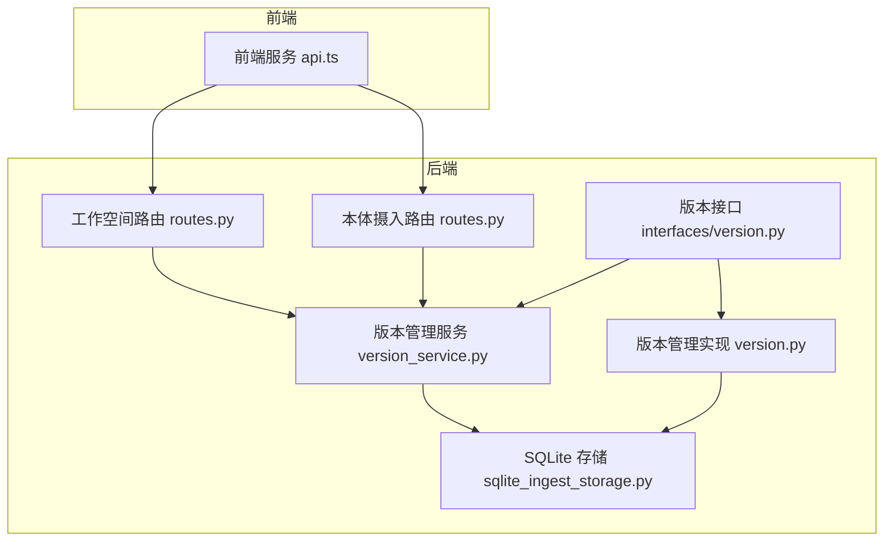
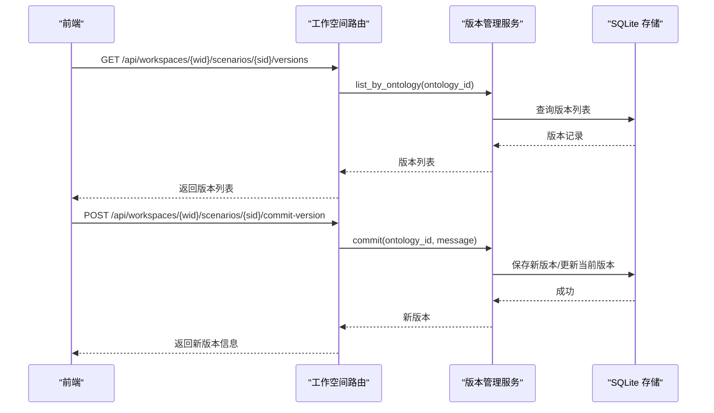
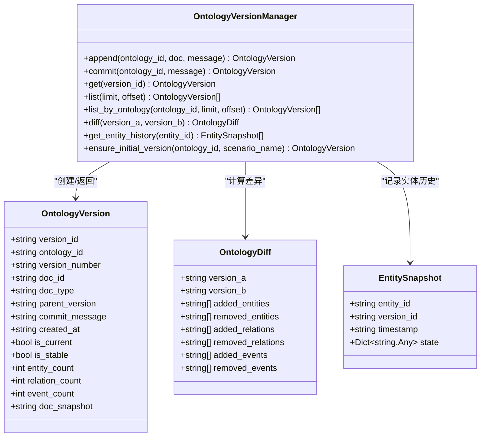
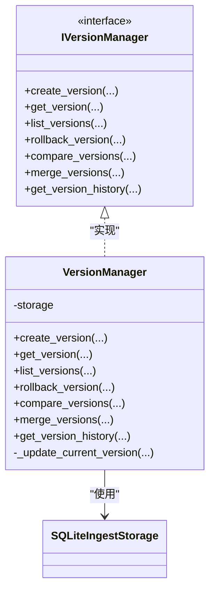
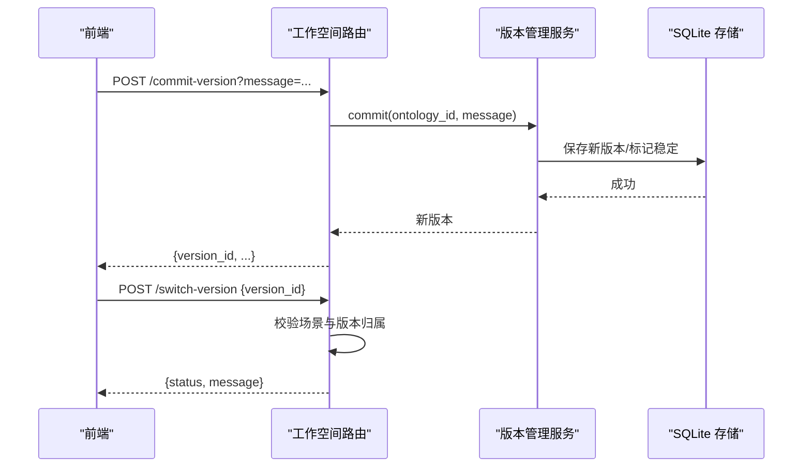
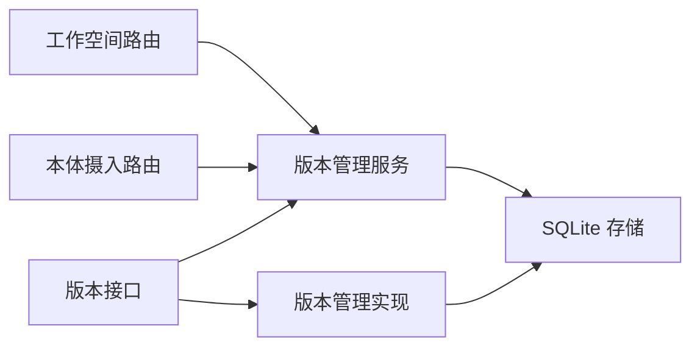

# 版本管理API

<cite>
**本文引用的文件**
- [version_service.py](file://odap/biz/core/ontology/services/version_service.py)
- [version.py](file://odap/biz/core/ontology/impl/version.py)
- [version.py](file://odap/biz/core/ontology/interfaces/version.py)
- [routes.py](file://odap/biz/platform/workspace/api/routes.py)
- [routes.py](file://odap/biz/core/ontology/api/routes.py)
- [sqlite_ingest_storage.py](file://odap/biz/core/ontology/storage/sqlite_ingest_storage.py)
- [api.ts](file://frontend/src/modules/shared/services/api.ts)
- [ARCHITECTURE_FULL_CHAIN_DEEP.md](file://docs/02-architecture/ARCHITECTURE_FULL_CHAIN_DEEP.md)
- [BACKEND_API_DESIGN.md](file://docs/10-api/BACKEND_API_DESIGN.md)
- [DATABASE_DESIGN.md](file://docs/10-api/DATABASE_DESIGN.md)
</cite>

## 目录
1. [简介](#简介)
2. [项目结构](#项目结构)
3. [核心组件](#核心组件)
4. [架构总览](#架构总览)
5. [详细组件分析](#详细组件分析)
6. [依赖分析](#依赖分析)
7. [性能考虑](#性能考虑)
8. [故障排查指南](#故障排查指南)
9. [结论](#结论)
10. [附录](#附录)

## 简介
本文件为 ODAP 平台“本体版本管理API”的权威技术参考，覆盖版本创建、查询、回滚、合并、差异分析、版本历史追踪、版本号生成规则、版本切换与锁定、并发控制策略、以及与前端交互的完整流程。面向版本控制专家与系统管理员，提供可操作的最佳实践与安全建议。

## 项目结构
围绕本体版本管理的关键模块分布如下：
- 服务层：版本管理器与差异计算
- 接口层：抽象接口定义
- 实现层：SQLite 存储与版本持久化
- API 层：工作空间与本体版本相关路由
- 前端层：版本列表、提交、切换、数据获取等调用

**图表来源**
- [routes.py:551-701](file://odap/biz/platform/workspace/api/routes.py#L551-L701)
- [routes.py:334-340](file://odap/biz/core/ontology/api/routes.py#L334-L340)
- [version_service.py:84-502](file://odap/biz/core/ontology/services/version_service.py#L84-L502)
- [version.py:13-167](file://odap/biz/core/ontology/impl/version.py#L13-L167)
- [version.py:11-112](file://odap/biz/core/ontology/interfaces/version.py#L11-L112)
- [sqlite_ingest_storage.py:138-159](file://odap/biz/core/ontology/storage/sqlite_ingest_storage.py#L138-L159)

**章节来源**
- [routes.py:551-701](file://odap/biz/platform/workspace/api/routes.py#L551-L701)
- [routes.py:334-340](file://odap/biz/core/ontology/api/routes.py#L334-L340)
- [version_service.py:1-503](file://odap/biz/core/ontology/services/version_service.py#L1-L503)
- [version.py:1-167](file://odap/biz/core/ontology/impl/version.py#L1-L167)
- [version.py:1-112](file://odap/biz/core/ontology/interfaces/version.py#L1-L112)
- [sqlite_ingest_storage.py:1-800](file://odap/biz/core/ontology/storage/sqlite_ingest_storage.py#L1-L800)

## 核心组件
- 版本管理服务：负责版本创建、提交、追加、差异计算、历史查询、实体历史追踪等
- 版本管理实现：基于 SQLite 的具体实现，提供版本持久化与当前版本更新
- 版本接口：定义版本管理的标准能力集合
- API 路由：提供前端调用的工作空间与本体版本相关接口
- SQLite 存储：统一存储本体版本元数据、文档快照与场景关联

**章节来源**
- [version_service.py:84-502](file://odap/biz/core/ontology/services/version_service.py#L84-L502)
- [version.py:13-167](file://odap/biz/core/ontology/impl/version.py#L13-L167)
- [version.py:11-112](file://odap/biz/core/ontology/interfaces/version.py#L11-L112)
- [routes.py:551-701](file://odap/biz/platform/workspace/api/routes.py#L551-L701)
- [sqlite_ingest_storage.py:138-159](file://odap/biz/core/ontology/storage/sqlite_ingest_storage.py#L138-L159)

## 架构总览
版本管理贯穿“摄入→构建→版本提交/追加→持久化→API 提供→前端展示”的全链路。

**图表来源**
- [routes.py:551-701](file://odap/biz/platform/workspace/api/routes.py#L551-L701)
- [version_service.py:206-277](file://odap/biz/core/ontology/services/version_service.py#L206-L277)
- [sqlite_ingest_storage.py:138-159](file://odap/biz/core/ontology/storage/sqlite_ingest_storage.py#L138-L159)

## 详细组件分析

### 版本管理服务（OntologyVersionManager）
- 能力概览
  - 追加（append）：将新摄入数据合并到当前版本快照，不改变版本号与ID
  - 提交（commit）：锁定当前版本并创建新版本，版本号递增
  - 获取（get）、列表（list）、按本体列表（list_by_ontology）
  - 差异计算（diff）：基于 OntologyDocument 的实体/关系/事件集合差集
  - 实体历史（get_entity_history）：按实体ID追踪跨版本状态
  - 辅助：生成版本ID、获取最新版本ID、确保初始版本

- 版本号与版本ID规则
  - 版本号：语义化版本，每次提交 minor 递增；追加不改变版本号
  - 版本ID：v{YYYYMMDD}-{seq:03d}，按日期+序列号生成，保证同日唯一

- 差异计算
  - 对比两个版本的 OntologyDocument，统计实体/关系/事件的新增、删除
  - 返回结构包含 added_entities、removed_entities、added_relations、removed_relations、added_events、removed_events

- 实体历史
  - 追踪每个实体在当前版本下的状态快照，便于审计与溯源

**图表来源**
- [version_service.py:27-71](file://odap/biz/core/ontology/services/version_service.py#L27-L71)
- [version_service.py:84-502](file://odap/biz/core/ontology/services/version_service.py#L84-L502)

**章节来源**
- [version_service.py:114-127](file://odap/biz/core/ontology/services/version_service.py#L114-L127)
- [version_service.py:152-204](file://odap/biz/core/ontology/services/version_service.py#L152-L204)
- [version_service.py:206-277](file://odap/biz/core/ontology/services/version_service.py#L206-L277)
- [version_service.py:402-425](file://odap/biz/core/ontology/services/version_service.py#L402-L425)
- [version_service.py:427-429](file://odap/biz/core/ontology/services/version_service.py#L427-L429)

### 版本管理实现（VersionManager）
- 基于接口 IVersionManager 的具体实现
- 提供 create_version、get_version、list_versions、rollback_version、compare_versions、merge_versions、get_version_history 等方法
- 当前版本更新逻辑：根据传入的当前版本ID更新存储中的 is_current 标记

**图表来源**
- [version.py:11-112](file://odap/biz/core/ontology/interfaces/version.py#L11-L112)
- [version.py:13-167](file://odap/biz/core/ontology/impl/version.py#L13-L167)

**章节来源**
- [version.py:18-132](file://odap/biz/core/ontology/impl/version.py#L18-L132)
- [version.py:159-167](file://odap/biz/core/ontology/impl/version.py#L159-L167)

### API 路由与前端交互
- 工作空间路由
  - 获取场景绑定本体的版本列表
  - 提交版本（commit）
  - 切换场景使用的本体版本（switch-version）
  - 获取指定版本的本体数据

- 本体摄入路由
  - 回滚版本
  - 获取版本列表

- 前端调用
  - 获取版本列表
  - 提交版本
  - 切换版本
  - 获取版本数据

**图表来源**
- [routes.py:590-701](file://odap/biz/platform/workspace/api/routes.py#L590-L701)
- [version_service.py:206-277](file://odap/biz/core/ontology/services/version_service.py#L206-L277)

**章节来源**
- [routes.py:551-701](file://odap/biz/platform/workspace/api/routes.py#L551-L701)
- [routes.py:334-340](file://odap/biz/core/ontology/api/routes.py#L334-L340)
- [api.ts:880-923](file://frontend/src/modules/shared/services/api.ts#L880-L923)

### 版本号生成规则与版本历史追踪
- 版本号规则
  - 初始版本：1.0.0
  - 追加（append）：不改变版本号与版本ID
  - 提交（commit）：minor 递增（1.0.0 → 1.1.0 → 1.2.0...）

- 版本ID规则
  - v{YYYYMMDD}-{seq:03d}，按日期+序列号生成，同日自增

- 版本历史
  - 通过 parent_version_id 形成单向链表
  - 支持按本体 ID 查询历史并倒序排列

**章节来源**
- [version_service.py:73-82](file://odap/biz/core/ontology/services/version_service.py#L73-L82)
- [version_service.py:114-127](file://odap/biz/core/ontology/services/version_service.py#L114-L127)
- [version_service.py:434-452](file://odap/biz/core/ontology/services/version_service.py#L434-L452)

### 版本比较与差异分析
- 比较维度
  - 实体：基于 entity_id 的差集
  - 关系：基于 relation_id 的差集
  - 事件：基于 event_id 的差集

- 输出结构
  - added_entities、removed_entities
  - added_relations、removed_relations
  - added_events、removed_events

**章节来源**
- [version_service.py:402-425](file://odap/biz/core/ontology/services/version_service.py#L402-L425)

### 版本回滚与安全机制
- 回滚流程
  - 提交版本后，当前版本被标记为稳定（is_stable=True）
  - 回滚通过创建新版本实现，新版本携带回滚标识与父版本指针
  - 前端提供回滚入口，建议在确认备份与影响评估后再执行

- 安全与风险控制
  - 回滚前建议进行差异预览与影响评估
  - 建议保留至少一个稳定版本，避免完全不可逆
  - 回滚后通知场景绑定的下游系统刷新视图

**章节来源**
- [version.py:55-84](file://odap/biz/core/ontology/impl/version.py#L55-L84)
- [routes.py:655-701](file://odap/biz/platform/workspace/api/routes.py#L655-L701)

### 版本标签管理与分支管理
- 标签管理
  - 当前实现未见专用标签模型；可通过版本注释（commit_message）与版本号语义化表达进行“软标签”管理
  - 建议约定：里程碑版本使用语义化版本号，hotfix 使用补丁号递增

- 分支管理
  - 未发现显式的分支模型；当前通过 parent_version_id 维护版本链
  - 若需分支演进，可在业务层面约定分支命名与合并策略，并结合差异分析进行人工审阅

**章节来源**
- [version_service.py:23-42](file://odap/biz/core/ontology/services/version_service.py#L23-L42)
- [DATABASE_DESIGN.md:616-637](file://docs/10-api/DATABASE_DESIGN.md#L616-L637)

### 并发控制与锁定策略
- 版本锁定
  - commit 时将当前版本标记为 is_stable=True，防止后续追加写入
  - 新版本创建时设置 is_current=True，确保场景使用的是最新稳定版本

- 并发建议
  - 在高并发场景下，建议在业务层引入“乐观锁”或“排他写入”策略
  - 对于回滚与合并等高风险操作，建议增加“只允许管理员执行”的权限控制

**章节来源**
- [version_service.py:229-230](file://odap/biz/core/ontology/services/version_service.py#L229-L230)
- [version_service.py:256-257](file://odap/biz/core/ontology/services/version_service.py#L256-L257)

### 存储与持久化
- SQLite 表结构要点
  - 版本表：包含版本ID、本体ID、版本号、父版本ID、状态、变更摘要、计数、文档快照等
  - 支持按本体ID与时间倒序查询版本历史
  - 支持场景表与版本表的关联

**章节来源**
- [sqlite_ingest_storage.py:138-159](file://odap/biz/core/ontology/storage/sqlite_ingest_storage.py#L138-L159)
- [sqlite_ingest_storage.py:296-352](file://odap/biz/core/ontology/storage/sqlite_ingest_storage.py#L296-L352)

## 依赖分析
- 组件耦合
  - 路由依赖版本管理服务
  - 版本管理服务依赖 SQLite 存储
  - 实现层与接口层解耦，便于替换存储或算法

- 外部依赖
  - FastAPI 路由框架
  - SQLite 数据库（WAL 模式）
  - 前端 fetch 调用

**图表来源**
- [routes.py:27-28](file://odap/biz/platform/workspace/api/routes.py#L27-L28)
- [routes.py:10-11](file://odap/biz/core/ontology/api/routes.py#L10-L11)
- [version_service.py:100-106](file://odap/biz/core/ontology/services/version_service.py#L100-L106)
- [version.py:15-16](file://odap/biz/core/ontology/impl/version.py#L15-L16)
- [version.py:7-8](file://odap/biz/core/ontology/interfaces/version.py#L7-L8)

**章节来源**
- [routes.py:27-28](file://odap/biz/platform/workspace/api/routes.py#L27-L28)
- [routes.py:10-11](file://odap/biz/core/ontology/api/routes.py#L10-L11)
- [version_service.py:100-106](file://odap/biz/core/ontology/services/version_service.py#L100-L106)

## 性能考虑
- 查询性能
  - 版本历史按时间倒序查询，建议在本体ID与时间字段建立索引
  - SQLite WAL 模式提升并发读写性能

- 写入性能
  - 追加写入不涉及版本号与ID变更，减少写放大
  - 提交写入涉及新版本创建与当前版本标记，建议批量提交

- 存储容量
  - 版本快照包含完整文档，建议定期归档旧版本或清理冗余快照

[本节为通用指导，无需特定文件引用]

## 故障排查指南
- 常见错误与定位
  - 版本不存在：检查版本ID是否正确，确认 belongs_to 本体
  - 场景未绑定本体：提交版本或切换版本前需确保场景已绑定本体
  - 提交失败：检查当前版本是否已被锁定（is_stable=True）

- 建议排查步骤
  - 查看版本历史与当前版本状态
  - 对比前后版本的差异，确认变更范围
  - 检查存储表结构与索引是否完整

**章节来源**
- [routes.py:684-690](file://odap/biz/platform/workspace/api/routes.py#L684-L690)
- [version_service.py:229-230](file://odap/biz/core/ontology/services/version_service.py#L229-L230)

## 结论
本体版本管理API以“追加不改号、提交改版本号”的策略实现了稳定的演进链路，配合差异分析与实体历史追踪，满足版本审计与溯源需求。通过明确的锁定与提交流程，保障了并发场景下的数据一致性。建议在生产环境中结合权限控制、差异预览与备份策略，进一步提升安全性与可运维性。

[本节为总结性内容，无需特定文件引用]

## 附录

### API 参考速览
- 获取场景版本列表
  - 方法：GET
  - 路径：/api/workspaces/{workspace_id}/scenarios/{scenario_id}/versions
  - 返回：版本列表（包含版本ID、版本号、计数、提交信息等）

- 提交版本
  - 方法：POST
  - 路径：/api/workspaces/{workspace_id}/scenarios/{scenario_id}/commit-version
  - 查询参数：message（可选）
  - 返回：新版本信息

- 切换场景版本
  - 方法：POST
  - 路径：/api/workspaces/{workspace_id}/scenarios/{scenario_id}/switch-version
  - 请求体：{ version_id: "latest" | "{version_id}" }
  - 返回：操作结果

- 获取版本数据
  - 方法：GET
  - 路径：/api/workspaces/{workspace_id}/scenarios/{scenario_id}/versions/{version_id}/data
  - 返回：版本对应的实体、关系、事件数据

- 回滚版本（摄入侧）
  - 方法：POST
  - 路径：/api/ontology/ingest/versions/rollback
  - 查询参数：scenario_id（可选）
  - 返回：回滚结果

**章节来源**
- [routes.py:551-701](file://odap/biz/platform/workspace/api/routes.py#L551-L701)
- [routes.py:334-340](file://odap/biz/core/ontology/api/routes.py#L334-L340)
- [BACKEND_API_DESIGN.md:272-279](file://docs/10-api/BACKEND_API_DESIGN.md#L272-L279)
- [api.ts:880-923](file://frontend/src/modules/shared/services/api.ts#L880-L923)

### 数据模型要点
- 版本表字段
  - version_id、ontology_id、version_number、parent_version_id、status、change_summary、is_current、is_stable、entity_count、relation_count、event_count、doc_snapshot、doc_id、doc_type
- 索引
  - version_id、ontology_id

**章节来源**
- [DATABASE_DESIGN.md:616-637](file://docs/10-api/DATABASE_DESIGN.md#L616-L637)