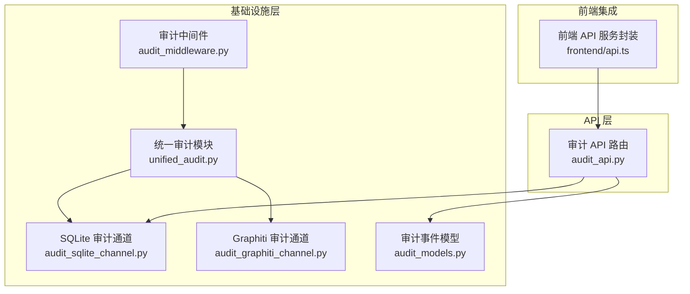
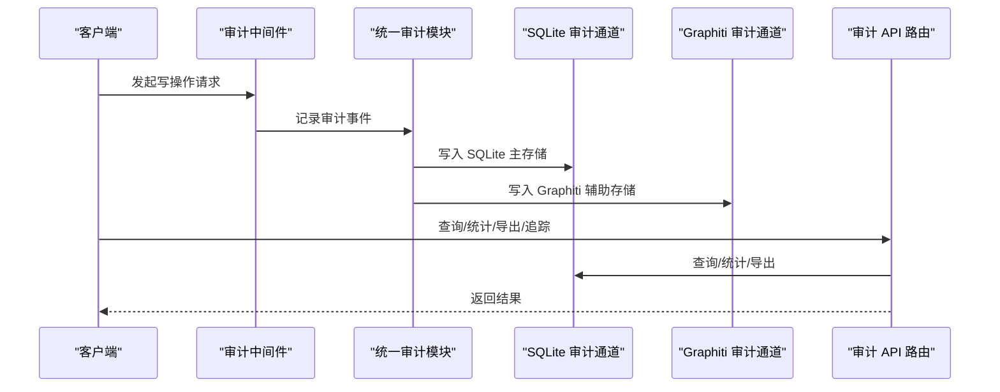
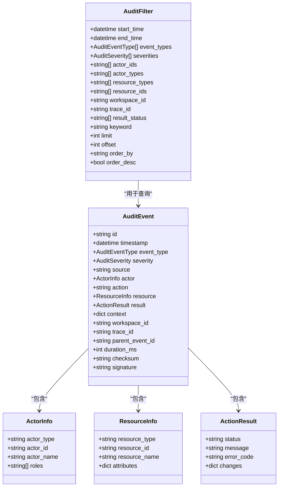
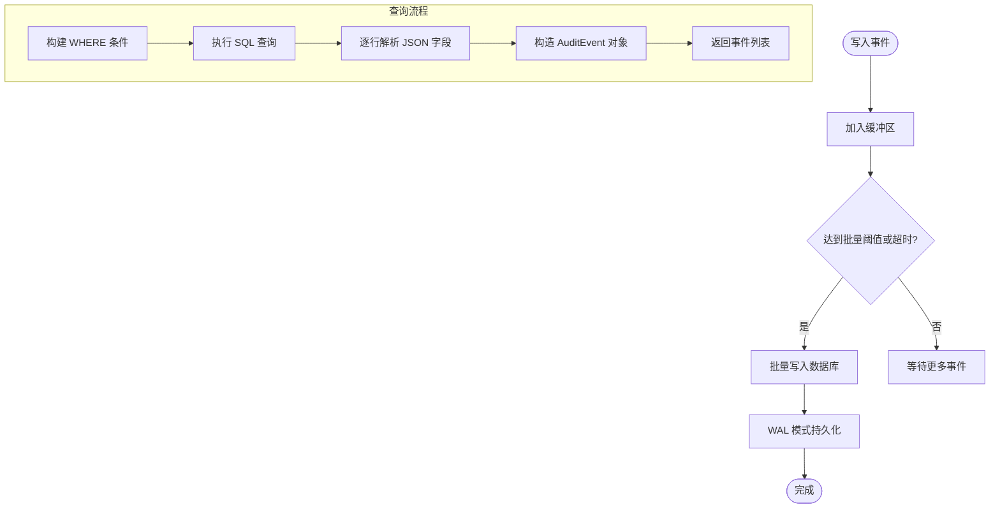
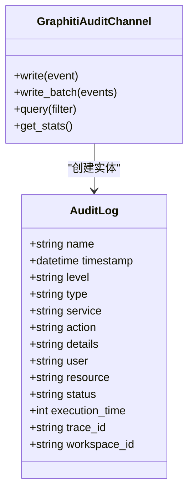
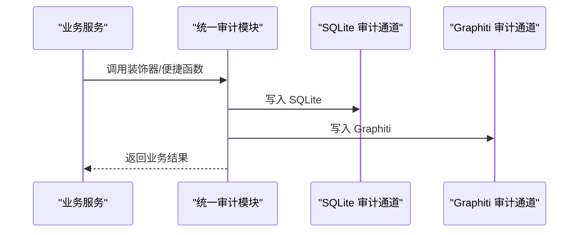
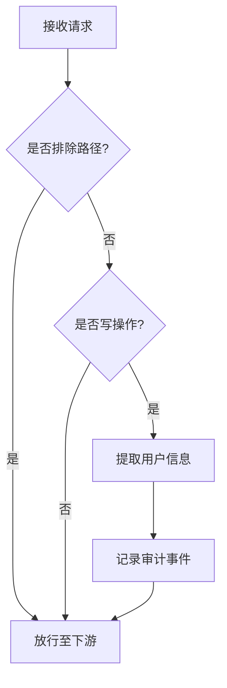
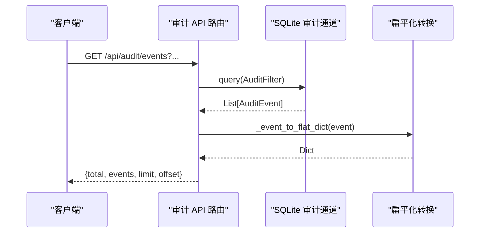
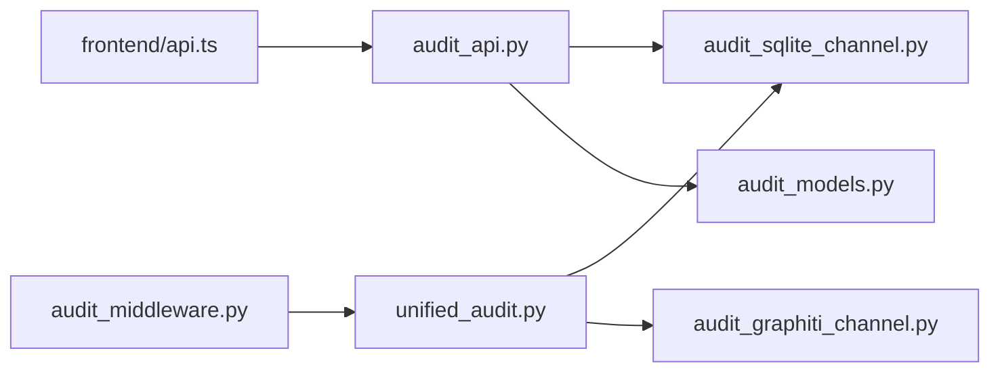

# 审计日志API

<cite>
**本文引用的文件**
- [audit_api.py](file://odap/infra/security/audit_api.py)
- [audit_models.py](file://odap/infra/security/audit_models.py)
- [audit_sqlite_channel.py](file://odap/infra/security/audit_sqlite_channel.py)
- [audit_graphiti_channel.py](file://odap/infra/security/audit_graphiti_channel.py)
- [unified_audit.py](file://odap/infra/security/unified_audit.py)
- [audit_middleware.py](file://odap/infra/middleware/audit_middleware.py)
- [DESIGN.md](file://docs/03-modules/audit_log/DESIGN.md)
- [GRAPHITI_INTEGRATION.md](file://docs/03-modules/audit_log/GRAPHITI_INTEGRATION.md)
- [test_audit_system.py](file://tests/unit/test_audit_system.py)
- [api.ts](file://frontend/src/modules/shared/services/api.ts)
</cite>

## 目录
1. [简介](#简介)
2. [项目结构](#项目结构)
3. [核心组件](#核心组件)
4. [架构总览](#架构总览)
5. [详细组件分析](#详细组件分析)
6. [依赖关系分析](#依赖关系分析)
7. [性能考虑](#性能考虑)
8. [故障排查指南](#故障排查指南)
9. [结论](#结论)
10. [附录](#附录)

## 简介
本文件为 ODAP 平台审计日志 API 的权威参考文档，面向系统管理员与开发人员，全面覆盖以下能力：
- 审计事件查询 API：支持按时间范围、事件类型、严重级别、用户ID、工作空间、结果状态、关键字等条件过滤查询，并支持分页与排序。
- 审计时间线 API：按工作空间与时间顺序获取审计事件，便于可视化与回溯。
- 审计追踪 API：通过 trace_id 获取完整的操作链路，支持因果链分析。
- 审计统计 API：提供按严重级别、事件类型、结果状态的统计分析。
- 审计导出 API：支持 JSON 格式的日志导出。
- 统一审计 API：提供手动创建审计日志记录的能力，便于业务侧自定义审计。

## 项目结构
审计日志模块位于基础设施层，围绕“事件模型 + 通道 + API路由 + 中间件”的架构组织，既保证了高性能写入与查询，又提供了灵活的扩展能力（如 Graphiti 集成）。

**图表来源**
- [audit_middleware.py:51-111](file://odap/infra/middleware/audit_middleware.py#L51-L111)
- [unified_audit.py:58-71](file://odap/infra/security/unified_audit.py#L58-L71)
- [audit_sqlite_channel.py:36-449](file://odap/infra/security/audit_sqlite_channel.py#L36-L449)
- [audit_graphiti_channel.py:15-314](file://odap/infra/security/audit_graphiti_channel.py#L15-L314)
- [audit_models.py:110-167](file://odap/infra/security/audit_models.py#L110-L167)
- [audit_api.py:16-487](file://odap/infra/security/audit_api.py#L16-L487)
- [api.ts:688-760](file://frontend/src/modules/shared/services/api.ts#L688-L760)

**章节来源**
- [audit_api.py:16-487](file://odap/infra/security/audit_api.py#L16-L487)
- [audit_models.py:110-167](file://odap/infra/security/audit_models.py#L110-L167)
- [audit_sqlite_channel.py:36-449](file://odap/infra/security/audit_sqlite_channel.py#L36-L449)
- [audit_graphiti_channel.py:15-314](file://odap/infra/security/audit_graphiti_channel.py#L15-L314)
- [unified_audit.py:58-71](file://odap/infra/security/unified_audit.py#L58-L71)
- [audit_middleware.py:51-111](file://odap/infra/middleware/audit_middleware.py#L51-L111)
- [DESIGN.md:403-440](file://docs/03-modules/audit_log/DESIGN.md#L403-L440)
- [GRAPHITI_INTEGRATION.md:27-112](file://docs/03-modules/audit_log/GRAPHITI_INTEGRATION.md#L27-L112)
- [api.ts:688-760](file://frontend/src/modules/shared/services/api.ts#L688-L760)

## 核心组件
- 审计事件模型：定义事件类型、严重级别、操作者、资源、结果、上下文等字段，支持序列化与反序列化。
- SQLite 审计通道：默认主存储，支持批量写入、WAL 模式、索引优化、防篡改校验。
- Graphiti 审计通道：可选增强存储，将审计日志映射为知识图谱实体与关系，支持图遍历与时态分析。
- 统一审计模块：提供简化接口（装饰器、便捷函数），统一写入 SQLite 主存储与 Graphiti 辅助存储。
- 审计中间件：自动拦截写操作请求，生成审计事件，避免对读操作产生冗余日志。
- 审计 API 路由：提供事件查询、时间线、追踪链、统计、导出、手动记录等 REST 接口。

**章节来源**
- [audit_models.py:110-167](file://odap/infra/security/audit_models.py#L110-L167)
- [audit_sqlite_channel.py:36-449](file://odap/infra/security/audit_sqlite_channel.py#L36-L449)
- [audit_graphiti_channel.py:15-314](file://odap/infra/security/audit_graphiti_channel.py#L15-L314)
- [unified_audit.py:292-340](file://odap/infra/security/unified_audit.py#L292-L340)
- [audit_middleware.py:51-111](file://odap/infra/middleware/audit_middleware.py#L51-L111)
- [audit_api.py:120-487](file://odap/infra/security/audit_api.py#L120-L487)

## 架构总览
审计日志系统采用“事件模型 + 通道 + API 路由 + 中间件”的分层设计，确保：
- 写入性能：异步缓冲、批量落盘、WAL 模式、索引优化。
- 查询能力：SQL 查询、全文检索、多维过滤、分页排序。
- 可扩展性：Graphiti 集成，支持图分析与时态查询。
- 合规性：防篡改校验链，支持完整性验证。

**图表来源**
- [audit_middleware.py:51-111](file://odap/infra/middleware/audit_middleware.py#L51-L111)
- [unified_audit.py:292-340](file://odap/infra/security/unified_audit.py#L292-L340)
- [audit_sqlite_channel.py:108-143](file://odap/infra/security/audit_sqlite_channel.py#L108-L143)
- [audit_graphiti_channel.py:45-97](file://odap/infra/security/audit_graphiti_channel.py#L45-L97)
- [audit_api.py:120-487](file://odap/infra/security/audit_api.py#L120-L487)

## 详细组件分析

### 审计事件模型与过滤器
- 审计事件模型包含：事件类型枚举、严重级别枚举、操作者信息、资源信息、结果信息、上下文、工作空间ID、追踪ID、父事件ID、耗时、校验与签名等字段。
- 过滤器支持：时间范围、事件类型集合、严重级别集合、操作者ID集合、资源类型/ID集合、工作空间ID、追踪ID、结果状态集合、关键字全文检索、分页与排序。

**图表来源**
- [audit_models.py:110-167](file://odap/infra/security/audit_models.py#L110-L167)

**章节来源**
- [audit_models.py:110-167](file://odap/infra/security/audit_models.py#L110-L167)

### SQLite 审计通道
- 表结构：包含事件主键、时间戳、事件类型、严重级别、操作者信息、动作、资源信息、结果信息、工作空间ID、追踪ID、父事件ID、耗时、上下文JSON、变更JSON、校验和等字段。
- 索引：针对时间戳、事件类型、操作者ID、工作空间ID、资源类型+ID、追踪ID建立索引，提升查询性能。
- 写入：异步缓冲、批量落盘、WAL 模式；支持 JSON 字段序列化与校验和计算。
- 查询：支持多维过滤、全文检索、分页排序；返回模型化事件对象。
- 统计：提供按严重级别与事件类型的统计信息。

**图表来源**
- [audit_sqlite_channel.py:108-143](file://odap/infra/security/audit_sqlite_channel.py#L108-L143)
- [audit_sqlite_channel.py:195-320](file://odap/infra/security/audit_sqlite_channel.py#L195-L320)

**章节来源**
- [audit_sqlite_channel.py:36-449](file://odap/infra/security/audit_sqlite_channel.py#L36-L449)

### Graphiti 审计通道
- 存储：将审计事件映射为 AuditLog 实体，并创建用户、资源、服务实体与其关系（EXECUTED、AFFECTED、GENERATED）。
- 查询：优先使用 Neo4j 查询，回退到 GraphManager 搜索；支持按工作空间ID、追踪ID等过滤。
- 统计：返回通道类型与基础统计信息。

**图表来源**
- [audit_graphiti_channel.py:15-314](file://odap/infra/security/audit_graphiti_channel.py#L15-L314)

**章节来源**
- [audit_graphiti_channel.py:15-314](file://odap/infra/security/audit_graphiti_channel.py#L15-L314)
- [GRAPHITI_INTEGRATION.md:27-112](file://docs/03-modules/audit_log/GRAPHITI_INTEGRATION.md#L27-L112)

### 统一审计模块
- 提供装饰器与便捷函数，自动记录成功/失败的业务操作，同时写入 SQLite 主存储与 Graphiti 辅助存储。
- 支持根据 action 与 service 推断事件类型，自动填充操作者、资源、上下文等信息。
- 提供简化查询接口，便于业务侧快速获取审计日志。

**图表来源**
- [unified_audit.py:89-166](file://odap/infra/security/unified_audit.py#L89-L166)
- [unified_audit.py:292-340](file://odap/infra/security/unified_audit.py#L292-L340)

**章节来源**
- [unified_audit.py:89-166](file://odap/infra/security/unified_audit.py#L89-L166)
- [unified_audit.py:292-340](file://odap/infra/security/unified_audit.py#L292-L340)

### 审计中间件
- 自动拦截写操作（POST/PUT/DELETE/PATCH），排除静态资源与审计 API 自身。
- 从 Authorization 头提取用户信息，计算耗时，生成审计事件并写入统一审计模块。

**图表来源**
- [audit_middleware.py:51-111](file://odap/infra/middleware/audit_middleware.py#L51-L111)

**章节来源**
- [audit_middleware.py:51-111](file://odap/infra/middleware/audit_middleware.py#L51-L111)

### 审计 API 路由
- 事件查询：支持时间范围、事件类型、严重级别、操作者ID、资源类型/ID、工作空间ID、追踪ID、结果状态、关键字、分页与排序。
- 事件详情：按事件ID查询。
- 时间线：按时间顺序返回事件，支持工作空间过滤。
- 追踪链：按 trace_id 返回事件链，按时间升序排列。
- 统计：按时间范围统计总数、按严重级别、事件类型、结果状态分布。
- 导出：按时间范围与事件类型/严重级别导出 JSON。
- 手动记录：提供统一入口创建审计日志。

**图表来源**
- [audit_api.py:120-209](file://odap/infra/security/audit_api.py#L120-L209)
- [audit_api.py:55-73](file://odap/infra/security/audit_api.py#L55-L73)

**章节来源**
- [audit_api.py:120-487](file://odap/infra/security/audit_api.py#L120-L487)

## 依赖关系分析
- 组件耦合：API 路由依赖 SQLite 通道与模型；统一审计模块同时依赖 SQLite 与 Graphiti 通道；中间件依赖统一审计模块。
- 外部依赖：SQLite（本地存储）、Graphiti/Neo4j（可选图存储）、FastAPI（API 框架）、Pydantic（数据模型）。
- 循环依赖：未发现循环依赖，模块职责清晰。

**图表来源**
- [audit_api.py:16-487](file://odap/infra/security/audit_api.py#L16-L487)
- [audit_sqlite_channel.py:36-449](file://odap/infra/security/audit_sqlite_channel.py#L36-L449)
- [audit_graphiti_channel.py:15-314](file://odap/infra/security/audit_graphiti_channel.py#L15-L314)
- [unified_audit.py:58-71](file://odap/infra/security/unified_audit.py#L58-L71)
- [audit_middleware.py:51-111](file://odap/infra/middleware/audit_middleware.py#L51-L111)
- [api.ts:688-760](file://frontend/src/modules/shared/services/api.ts#L688-L760)

**章节来源**
- [audit_api.py:16-487](file://odap/infra/security/audit_api.py#L16-L487)
- [audit_sqlite_channel.py:36-449](file://odap/infra/security/audit_sqlite_channel.py#L36-L449)
- [audit_graphiti_channel.py:15-314](file://odap/infra/security/audit_graphiti_channel.py#L15-L314)
- [unified_audit.py:58-71](file://odap/infra/security/unified_audit.py#L58-L71)
- [audit_middleware.py:51-111](file://odap/infra/middleware/audit_middleware.py#L51-L111)
- [api.ts:688-760](file://frontend/src/modules/shared/services/api.ts#L688-L760)

## 性能考虑
- 写入延迟：< 5ms（异步 + 批量落盘）
- 查询延迟：P95 < 200ms（索引 + 时间范围剪枝）
- 吞吐量：> 10K events/s（批量写入 + WAL 模式）
- 存储效率：JSON 列压缩 + 冷数据归档
- 可靠性：WAL + 同步写入（CRITICAL 级别）

[本节为通用性能讨论，不直接分析具体文件]

## 故障排查指南
- 写入失败：检查 SQLite 数据库路径权限、磁盘空间、WAL 模式是否启用。
- 查询异常：确认过滤参数类型与枚举值是否匹配，注意严重级别别名与事件类型别名的规范化。
- 中间件未记录：确认请求方法为写操作，路径不在排除列表内，且 Authorization 头有效。
- 导出格式：当前仅支持 JSON 格式导出，其他格式会返回错误。

**章节来源**
- [audit_api.py:205-208](file://odap/infra/security/audit_api.py#L205-L208)
- [audit_api.py:394-397](file://odap/infra/security/audit_api.py#L394-L397)
- [audit_middleware.py:51-111](file://odap/infra/middleware/audit_middleware.py#L51-L111)
- [test_audit_system.py:351-413](file://tests/unit/test_audit_system.py#L351-L413)

## 结论
ODAP 平台的审计日志 API 在保证高性能与高可靠性的前提下，提供了完善的查询、追踪、统计与导出能力，并通过中间件与统一审计模块实现了对业务操作的自动化审计。SQLite 主存储满足合规与审计需求，Graphiti 集成则为高级分析与可视化提供了强大支撑。建议系统管理员结合实际业务场景选择合适的存储与查询策略，并充分利用统计与导出能力进行合规与安全运营。

[本节为总结性内容，不直接分析具体文件]

## 附录

### API 参考

- 查询审计事件
  - 方法：GET
  - 路径：/api/audit/events
  - 查询参数：
    - start_time: ISO8601 时间字符串
    - end_time: ISO8601 时间字符串
    - event_types: 事件类型数组（支持别名映射）
    - severities: 严重级别数组（支持别名映射）
    - actor_ids: 操作者ID数组
    - actor_types: 操作者类型数组
    - resource_types: 资源类型数组
    - resource_ids: 资源ID数组
    - workspace_id: 工作空间ID
    - trace_id: 追踪ID
    - result_status: 结果状态数组
    - keyword: 全文搜索关键字
    - limit: 分页大小（默认 50，最大 100）
    - offset: 偏移量（默认 0）
    - order_by: 排序字段（默认 timestamp）
    - order_desc: 是否降序（默认 True）
  - 响应：包含 total、events、limit、offset 的对象，events 中的嵌套对象将被扁平化为顶层字段。

- 获取事件详情
  - 方法：GET
  - 路径：/api/audit/events/{event_id}

- 审计时间线
  - 方法：GET
  - 路径：/api/audit/timeline
  - 查询参数：
    - start_time: ISO8601 时间字符串
    - end_time: ISO8601 时间字符串
    - workspace_id: 工作空间ID
    - limit: 限制数量（默认 100，最大 500）

- 追踪链查询
  - 方法：GET
  - 路径：/api/audit/trace/{trace_id}
  - 查询参数：
    - 无（内部按 trace_id 查询并按时间升序返回）

- 审计统计
  - 方法：GET
  - 路径：/api/audit/stats
  - 查询参数：
    - start_time: ISO8601 时间字符串
    - end_time: ISO8601 时间字符串
  - 响应：包含 total、by_severity、by_type、by_status、time_range 的对象。

- 导出审计日志
  - 方法：POST
  - 路径：/api/audit/export
  - 查询参数：
    - start_time: ISO8601 时间字符串
    - end_time: ISO8601 时间字符串
    - event_types: 事件类型数组（支持别名映射）
    - severities: 严重级别数组（支持别名映射）
    - format: 输出格式（当前仅支持 json）
  - 响应：包含 format、data、count 的对象。

- 手动创建审计日志
  - 方法：POST
  - 路径：/api/audit/logs
  - 请求体字段：
    - level: 严重级别
    - log_type: 日志类型
    - service: 服务名
    - action: 动作
    - details: 详情字典
    - user: 用户ID
    - resource: 资源ID
  - 响应：包含状态与消息的对象。

- 查询日志（兼容前端）
  - 方法：GET
  - 路径：/api/audit/logs
  - 查询参数：
    - page: 页码（默认 1）
    - page_size: 每页数量（默认 10，最大 100）
    - level: 严重级别
    - log_type: 日志类型
    - service: 服务名
    - user: 用户ID

**章节来源**
- [audit_api.py:120-487](file://odap/infra/security/audit_api.py#L120-L487)
- [DESIGN.md:403-440](file://docs/03-modules/audit_log/DESIGN.md#L403-L440)
- [api.ts:688-760](file://frontend/src/modules/shared/services/api.ts#L688-L760)

### 事件类型与严重级别
- 事件类型涵盖用户操作、工作空间、本体、Agent、Skill、策略、推演、系统事件、数据摄入、查询、问答、反馈等。
- 严重级别：DEBUG、INFO、WARN、ERROR、CRITICAL。
- 别名映射：部分事件类型与严重级别支持别名，API 层会进行规范化处理。

**章节来源**
- [audit_models.py:24-84](file://odap/infra/security/audit_models.py#L24-L84)
- [audit_models.py:15-22](file://odap/infra/security/audit_models.py#L15-L22)
- [audit_api.py:20-37](file://odap/infra/security/audit_api.py#L20-L37)

### 前端集成要点
- 前端通过统一 API 服务封装调用审计相关接口，支持时间线、统计、事件列表等。
- 注意严重级别的别名转换（如 warning -> warn）与事件类型的别名映射。

**章节来源**
- [api.ts:688-760](file://frontend/src/modules/shared/services/api.ts#L688-L760)