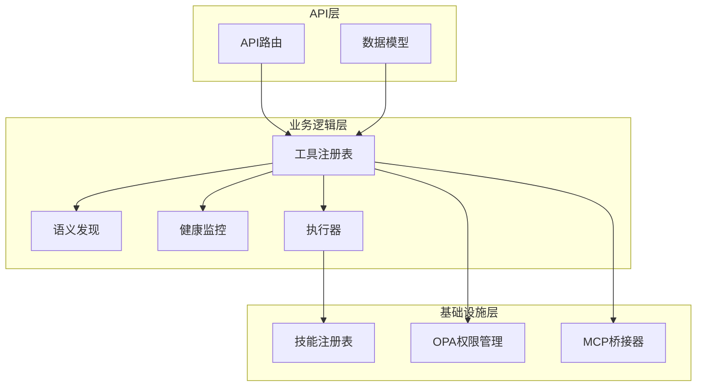
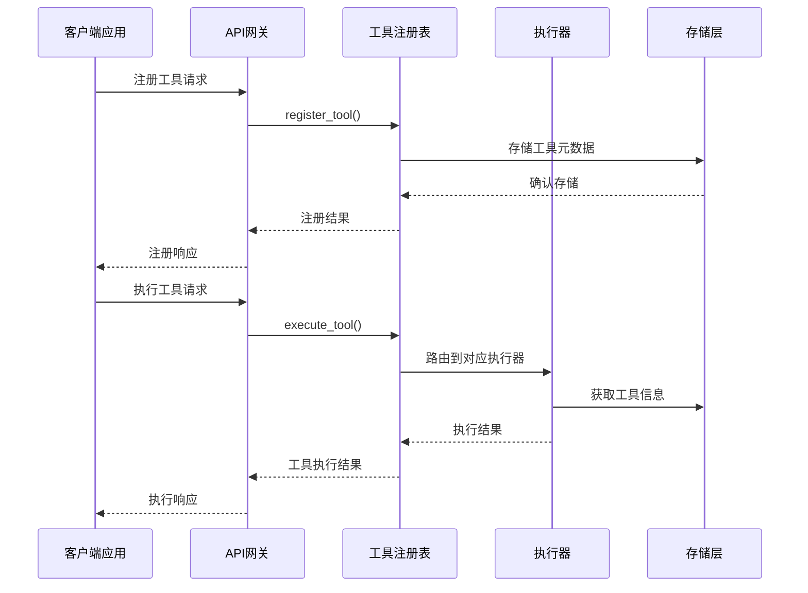
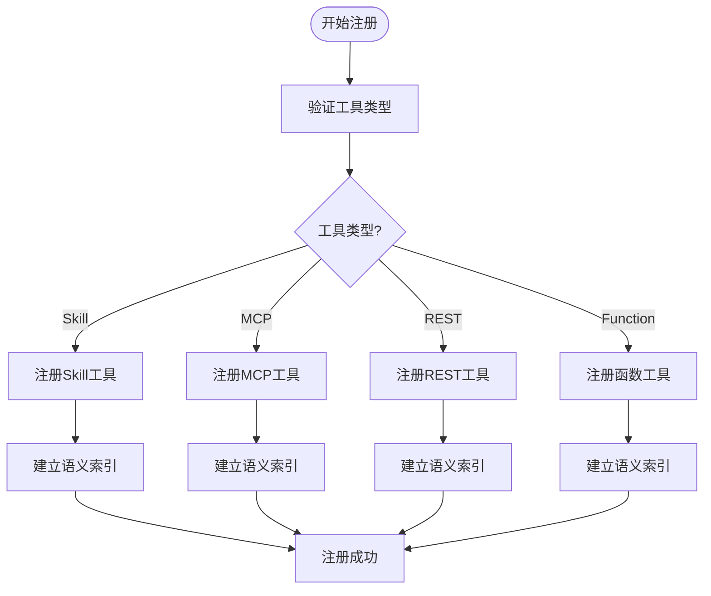
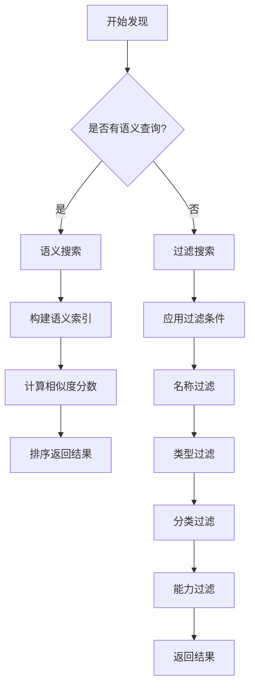
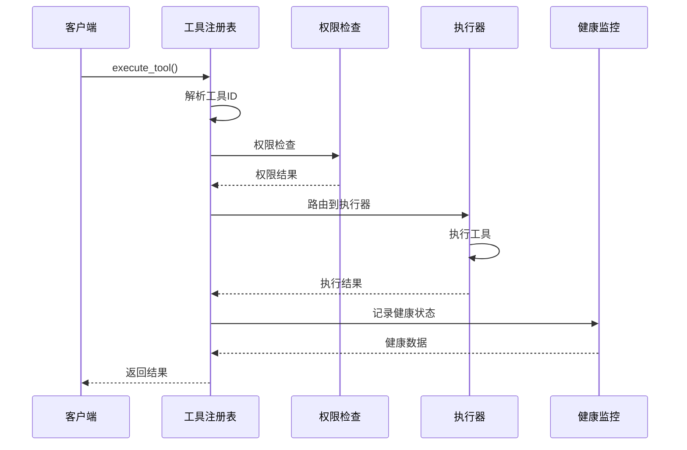
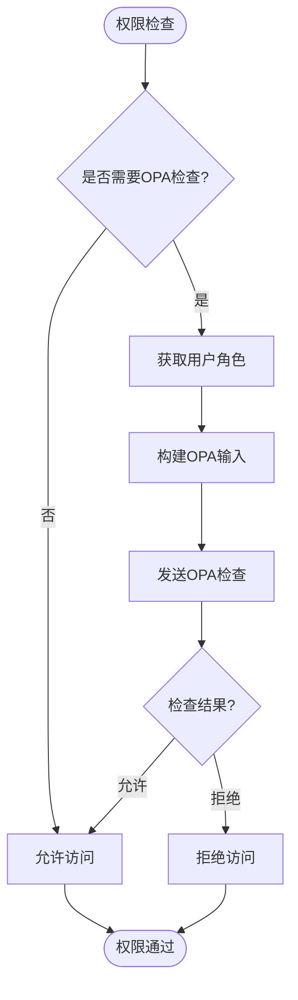
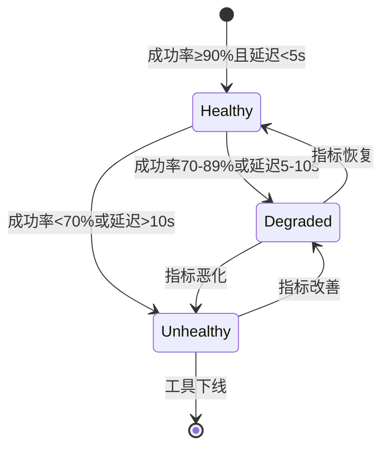
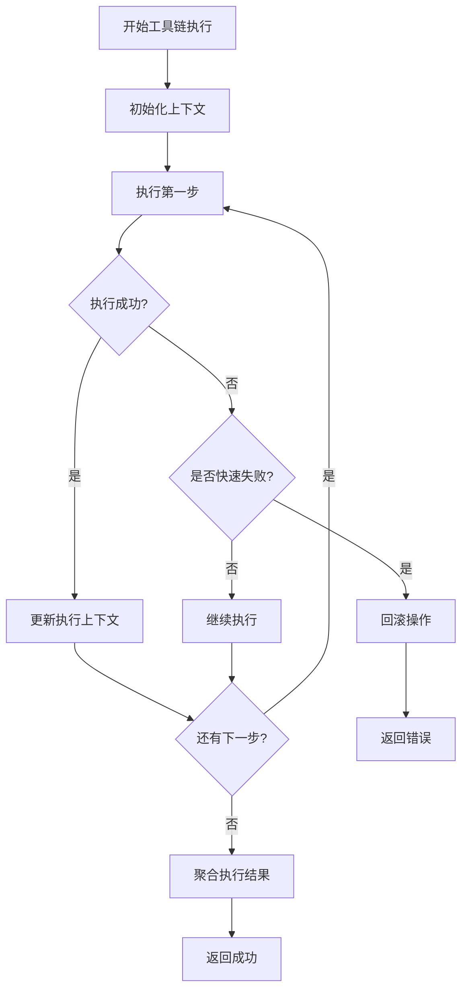
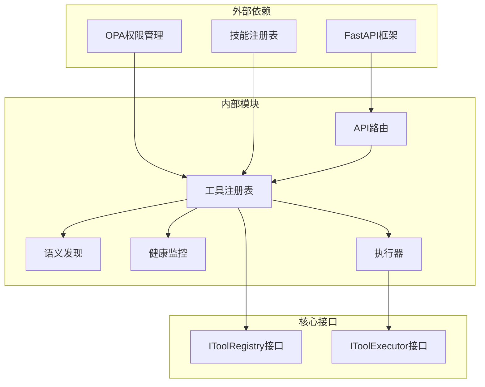

# 工具注册表API

<cite>
**本文档引用的文件**
- [registry.py](file://odap/biz/platform/tool_registry/registry.py)
- [routes.py](file://odap/biz/platform/tool_registry/api/routes.py)
- [__init__.py](file://odap/biz/platform/tool_registry/__init__.py)
- [composite_executor.py](file://odap/biz/platform/tool_registry/composite_executor.py)
- [semantic_discovery.py](file://odap/biz/platform/tool_registry/semantic_discovery.py)
- [DESIGN.md](file://docs/03-modules/tool_registry/DESIGN.md)
- [ADR-047_tool_registry_p0_phased_implementation.md](file://docs/07-adr/ADR-047_tool_registry_p0_phased_implementation.md)
</cite>

## 目录
1. [简介](#简介)
2. [项目结构](#项目结构)
3. [核心组件](#核心组件)
4. [架构概览](#架构概览)
5. [详细组件分析](#详细组件分析)
6. [依赖关系分析](#依赖关系分析)
7. [性能考虑](#性能考虑)
8. [故障排除指南](#故障排除指南)
9. [结论](#结论)

## 简介

ODAP平台的工具注册表API是一个统一的工具管理中枢，为智能体系统提供完整的工具生命周期管理能力。该API支持工具的动态注册、更新、注销等生命周期管理，提供工具发现、调用、权限控制、状态监控和复合执行等核心功能。

工具注册表API的设计遵循以下核心原则：
- 统一管理所有类型的工具（Skill、MCP、REST、Function）
- 支持运行时动态发现和健康监控
- 集成OPA权限控制和使用限制
- 提供工具链组合执行和结果聚合
- 支持语义化工具发现和分类筛选

## 项目结构

工具注册表模块采用分层架构设计，主要包含以下核心组件：

**图表来源**
- [registry.py:403-425](file://odap/biz/platform/tool_registry/registry.py#L403-L425)
- [routes.py:11-11](file://odap/biz/platform/tool_registry/api/routes.py#L11-L11)

**章节来源**
- [registry.py:1-1000](file://odap/biz/platform/tool_registry/registry.py#L1-L1000)
- [routes.py:1-310](file://odap/biz/platform/tool_registry/api/routes.py#L1-L310)

## 核心组件

工具注册表API由多个核心组件构成，每个组件都有明确的职责和接口定义：

### 工具类型定义
系统支持四种工具类型：
- **Skill**: 基于技能框架的工具
- **MCP**: MCP协议工具服务器
- **REST**: 外部REST API封装
- **Function**: 原生Python函数工具

### 工具元数据模型
工具元数据包含完整的工具描述信息，包括基础信息、接口定义、运行时配置和元数据扩展。

### 工具注册表
统一的工具管理中枢，负责工具的注册、发现、执行和状态管理。

### 语义发现引擎
基于自然语言处理的工具发现机制，支持语义匹配和关键词检索。

### 健康监控系统
实时监控工具的运行状态、性能指标和错误统计。

**章节来源**
- [registry.py:49-82](file://odap/biz/platform/tool_registry/registry.py#L49-L82)
- [registry.py:64-147](file://odap/biz/platform/tool_registry/registry.py#L64-L147)
- [registry.py:403-425](file://odap/biz/platform/tool_registry/registry.py#L403-L425)

## 架构概览

工具注册表API采用模块化设计，各组件之间通过清晰的接口进行交互：

**图表来源**
- [routes.py:75-134](file://odap/biz/platform/tool_registry/api/routes.py#L75-L134)
- [routes.py:159-178](file://odap/biz/platform/tool_registry/api/routes.py#L159-L178)

## 详细组件分析

### 工具注册API

工具注册API提供完整的工具注册、更新、注销功能，支持多种工具类型的动态注册。

#### 注册流程

**图表来源**
- [registry.py:426-537](file://odap/biz/platform/tool_registry/registry.py#L426-L537)
- [routes.py:75-134](file://odap/biz/platform/tool_registry/api/routes.py#L75-L134)

#### 支持的注册方式

1. **Skill工具注册**: 通过动态技能类注册，自动提取技能元数据
2. **MCP工具注册**: 从MCP服务器批量注册工具，支持缓存管理
3. **REST API注册**: 注册外部REST API为工具，支持端点和方法配置
4. **函数工具注册**: 注册原生Python函数为工具，支持参数映射

**章节来源**
- [registry.py:426-537](file://odap/biz/platform/tool_registry/registry.py#L426-L537)
- [routes.py:75-134](file://odap/biz/platform/tool_registry/api/routes.py#L75-L134)

### 工具发现API

工具发现API提供多种发现方式，满足不同场景下的工具查找需求。

#### 发现算法

**图表来源**
- [registry.py:539-577](file://odap/biz/platform/tool_registry/registry.py#L539-L577)
- [semantic_discovery.py:18-39](file://odap/biz/platform/tool_registry/semantic_discovery.py#L18-L39)

#### 支持的发现方式

1. **精确匹配**: 基于名称、类型、分类、能力的精确过滤
2. **语义搜索**: 基于自然语言描述的语义匹配，支持相似度评分
3. **关键词搜索**: 支持多关键词组合搜索，提高查找效率

**章节来源**
- [registry.py:539-577](file://odap/biz/platform/tool_registry/registry.py#L539-L577)
- [semantic_discovery.py:18-92](file://odap/biz/platform/tool_registry/semantic_discovery.py#L18-L92)

### 工具调用API

工具调用API提供统一的工具执行接口，支持同步和异步执行模式。

#### 执行流程

**图表来源**
- [registry.py:579-662](file://odap/biz/platform/tool_registry/registry.py#L579-L662)

#### 支持的执行模式

1. **同步执行**: 直接返回执行结果，适用于快速工具
2. **异步执行**: 返回执行任务，支持轮询获取结果
3. **工具链执行**: 执行多个工具的组合序列，支持条件分支

**章节来源**
- [registry.py:579-703](file://odap/biz/platform/tool_registry/registry.py#L579-L703)
- [routes.py:159-178](file://odap/biz/platform/tool_registry/api/routes.py#L159-L178)

### 工具权限API

工具权限API集成了OPA（Open Policy Agent）权限控制系统，提供细粒度的工具访问控制。

#### 权限检查流程

**图表来源**
- [registry.py:761-771](file://odap/biz/platform/tool_registry/registry.py#L761-L771)

#### 权限控制特性

1. **角色基础访问控制**: 基于用户角色的权限分配
2. **动作级权限**: 精细化到具体工具操作的权限控制
3. **动态权限检查**: 运行时动态验证工具访问权限
4. **审计日志**: 完整的权限访问记录

**章节来源**
- [registry.py:761-771](file://odap/biz/platform/tool_registry/registry.py#L761-L771)

### 工具状态API

工具状态API提供全面的工具健康监控和性能统计功能。

#### 健康监控指标

| 指标类型 | 描述 | 阈值设置 |
|---------|------|----------|
| 成功率 | 工具执行成功率 | 健康: ≥90%, 警告: 70-89%, 危险: <70% |
| 平均响应时间 | 工具平均执行时间 | 健康: <5s, 警告: 5-10s, 危险: >10s |
| 错误率 | 工具错误发生频率 | 健康: 0%, 警告: ≤5%, 危险: >10% |
| 调用频率 | 工具调用次数统计 | 动态阈值 |

#### 健康状态评估

**图表来源**
- [registry.py:304-401](file://odap/biz/platform/tool_registry/registry.py#L304-L401)

**章节来源**
- [registry.py:304-401](file://odap/biz/platform/tool_registry/registry.py#L304-L401)

### 复合执行API

复合执行API支持多个工具的组合执行和结果聚合，提供强大的工具编排能力。

#### 工具链执行流程

**图表来源**
- [registry.py:670-703](file://odap/biz/platform/tool_registry/registry.py#L670-L703)
- [composite_executor.py:12-68](file://odap/biz/platform/tool_registry/composite_executor.py#L12-L68)

#### 工具链特性

1. **条件执行**: 支持基于条件表达式的工具链步骤执行
2. **参数映射**: 支持工具间参数传递和数据映射
3. **错误处理**: 完善的错误处理和回滚机制
4. **并发执行**: 支持工具链内的并行执行能力

**章节来源**
- [registry.py:670-703](file://odap/biz/platform/tool_registry/registry.py#L670-L703)
- [composite_executor.py:12-93](file://odap/biz/platform/tool_registry/composite_executor.py#L12-L93)

## 依赖关系分析

工具注册表API的依赖关系呈现清晰的分层结构：

**图表来源**
- [__init__.py:6-34](file://odap/biz/platform/tool_registry/__init__.py#L6-L34)
- [registry.py:414-425](file://odap/biz/platform/tool_registry/registry.py#L414-L425)

**章节来源**
- [__init__.py:6-34](file://odap/biz/platform/tool_registry/__init__.py#L6-L34)
- [registry.py:414-425](file://odap/biz/platform/tool_registry/registry.py#L414-L425)

## 性能考虑

工具注册表API在设计时充分考虑了性能优化：

### 缓存策略
- **工具元数据缓存**: 内存中缓存工具元数据，减少重复查询
- **语义索引缓存**: 缓存语义索引和关键词索引，提升搜索性能
- **健康状态缓存**: 缓存健康监控数据，降低监控开销

### 并发处理
- **线程安全**: 使用锁机制保证并发访问的安全性
- **异步执行**: 支持异步工具执行，提高系统吞吐量
- **连接池**: 工具执行器使用连接池管理外部连接

### 性能监控
- **执行时间统计**: 精确记录工具执行时间和错误信息
- **健康指标**: 实时监控工具成功率和响应时间
- **告警机制**: 基于阈值的自动告警和通知

## 故障排除指南

### 常见问题及解决方案

#### 工具注册失败
**问题**: 工具注册返回失败
**可能原因**:
- 工具ID已存在
- 工具类型不支持
- 参数验证失败

**解决方案**:
1. 检查工具ID的唯一性
2. 验证工具类型的有效性
3. 确认工具参数的完整性

#### 工具执行超时
**问题**: 工具执行超过设定超时时间
**可能原因**:
- 工具本身执行缓慢
- 网络连接问题
- 资源不足

**解决方案**:
1. 增加工具超时时间
2. 检查网络连接状态
3. 优化工具执行逻辑

#### 权限拒绝
**问题**: 工具调用被权限系统拒绝
**可能原因**:
- 用户角色权限不足
- 工具访问策略配置错误
- OPA服务不可用

**解决方案**:
1. 检查用户角色和权限配置
2. 验证工具访问策略
3. 确认OPA服务状态

**章节来源**
- [registry.py:649-662](file://odap/biz/platform/tool_registry/registry.py#L649-L662)
- [routes.py:230-232](file://odap/biz/platform/tool_registry/api/routes.py#L230-L232)

## 结论

ODAP平台的工具注册表API提供了一个完整、灵活且高性能的工具管理解决方案。通过统一的API接口，开发者和系统管理员可以轻松管理各种类型的外部工具，实现智能体系统的灵活扩展。

该API的主要优势包括：

1. **统一管理**: 支持多种工具类型的统一注册和管理
2. **灵活发现**: 提供精确匹配和语义搜索等多种发现方式
3. **强权限控制**: 集成OPA权限系统，提供细粒度的访问控制
4. **可观测性**: 完善的健康监控和性能统计功能
5. **可扩展性**: 模块化设计，易于扩展新的工具类型和功能

随着ODAP平台的不断发展，工具注册表API将继续演进，为智能体系统提供更加强大和灵活的工具管理能力。