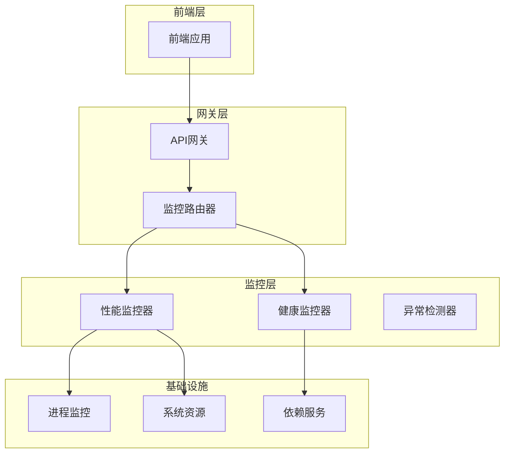
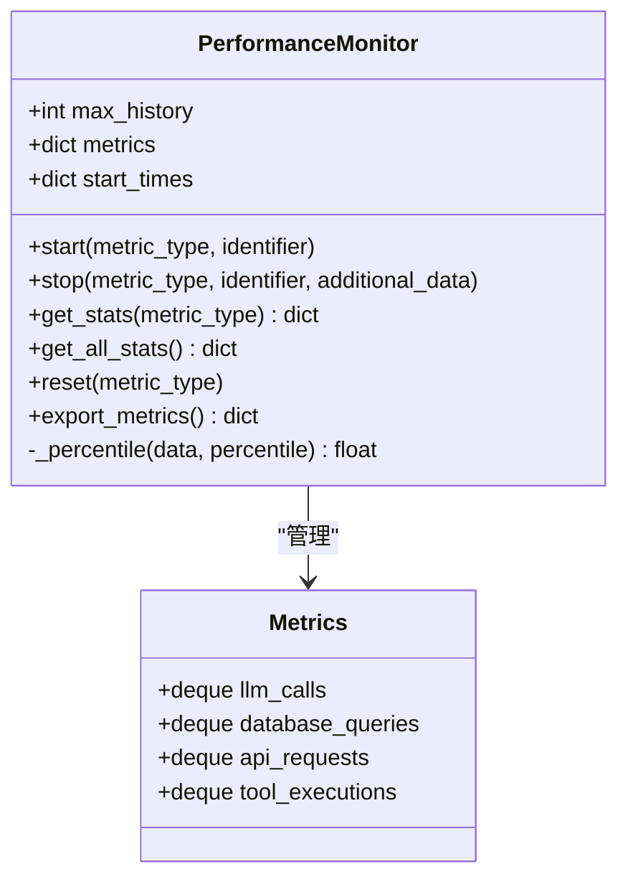
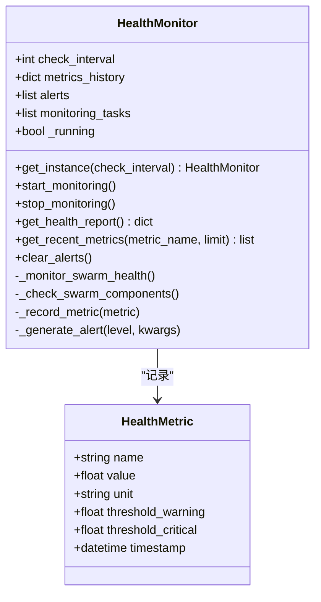
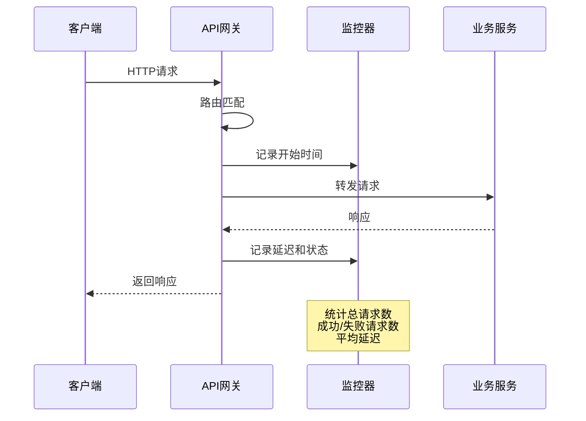
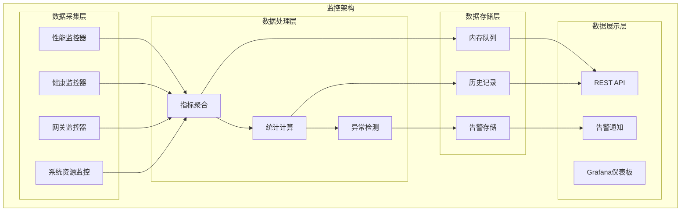
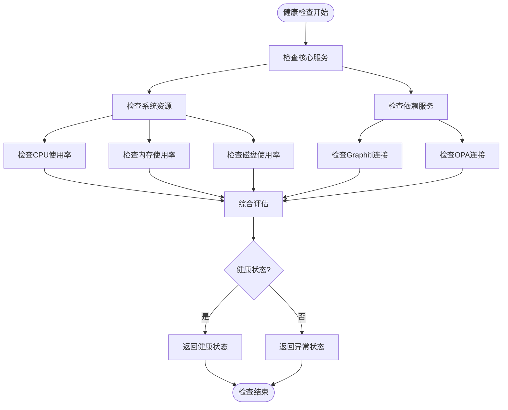
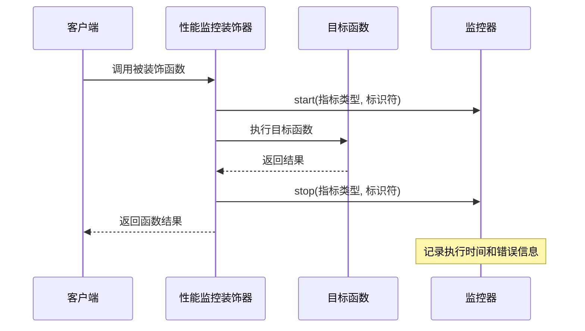
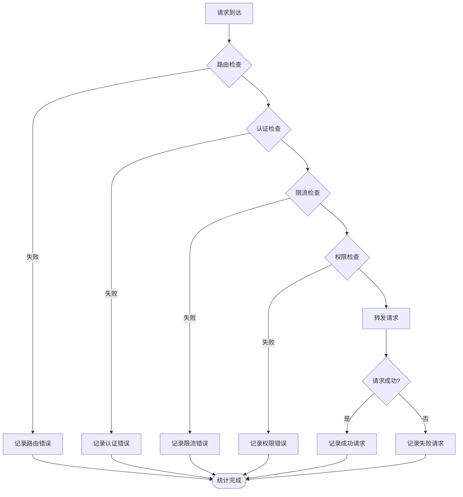
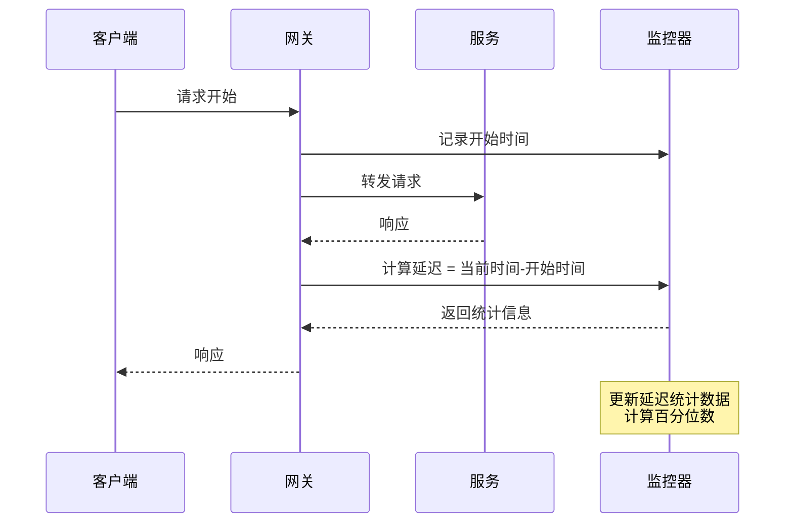
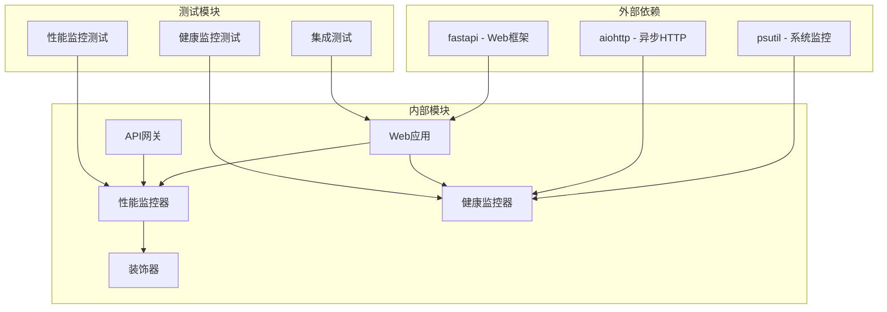

# 性能监控API

<cite>
**本文档引用的文件**
- [odap/web/app.py](file://odap/web/app.py)
- [odap/infra/monitoring/performance_monitor.py](file://odap/infra/monitoring/performance_monitor.py)
- [odap/web/gateway/api_gateway.py](file://odap/web/gateway/api_gateway.py)
- [odap/infra/resilience/health_monitor.py](file://odap/infra/resilience/health_monitor.py)
- [frontend/src/modules/shared/services/api.ts](file://frontend/src/modules/shared/services/api.ts)
- [tests/unit/test_performance_monitor.py](file://tests/unit/test_performance_monitor.py)
- [docs/06-dfx/DFX_DESIGN.md](file://docs/06-dfx/DFX_DESIGN.md)
- [docs/03-modules/swarm_orchestrator/DESIGN.md](file://docs/03-modules/swarm_orchestrator/DESIGN.md)
</cite>

## 目录
1. [简介](#简介)
2. [项目结构](#项目结构)
3. [核心组件](#核心组件)
4. [架构概览](#架构概览)
5. [详细组件分析](#详细组件分析)
6. [依赖关系分析](#依赖关系分析)
7. [性能考量](#性能考量)
8. [故障排查指南](#故障排查指南)
9. [结论](#结论)

## 简介

本文档为ODAP平台的性能监控API提供完整的参考文档。系统包含三层监控能力：

- **系统健康检查API**：服务可用性检测、依赖服务状态检查、系统负载监控
- **性能指标查询API**：CPU使用率、内存占用、磁盘IO、网络流量等关键指标的实时查询
- **资源使用统计API**：数据库连接数、缓存命中率、并发请求数等性能数据

这些API为运维人员提供系统性能监控和故障排查的完整解决方案，帮助及时发现和解决性能问题。

## 项目结构

ODAP平台的性能监控系统采用分层架构设计，主要分布在以下模块：



**图表来源**
- [odap/web/app.py:244-261](file://odap/web/app.py#L244-L261)
- [odap/web/gateway/api_gateway.py:329-494](file://odap/web/gateway/api_gateway.py#L329-L494)

**章节来源**
- [odap/web/app.py:244-261](file://odap/web/app.py#L244-L261)
- [odap/web/gateway/api_gateway.py:329-494](file://odap/web/gateway/api_gateway.py#L329-L494)

## 核心组件

### 性能监控器 (PerformanceMonitor)

性能监控器是系统的核心组件，负责收集和统计各类性能指标：



**图表来源**
- [odap/infra/monitoring/performance_monitor.py:12-144](file://odap/infra/monitoring/performance_monitor.py#L12-L144)

性能监控器支持四种主要指标类型：
- **LLM调用**：语言模型API调用统计
- **数据库查询**：数据库操作性能监控
- **API请求**：HTTP API调用性能
- **工具执行**：业务工具调用性能

**章节来源**
- [odap/infra/monitoring/performance_monitor.py:12-144](file://odap/infra/monitoring/performance_monitor.py#L12-L144)

### 健康监控器 (HealthMonitor)

健康监控器负责系统整体健康状态的监控和告警：



**图表来源**
- [odap/infra/resilience/health_monitor.py:28-216](file://odap/infra/resilience/health_monitor.py#L28-L216)

**章节来源**
- [odap/infra/resilience/health_monitor.py:28-216](file://odap/infra/resilience/health_monitor.py#L28-L216)

### API网关监控

API网关提供统一的请求监控和统计功能：



**图表来源**
- [odap/web/gateway/api_gateway.py:333-357](file://odap/web/gateway/api_gateway.py#L333-L357)

**章节来源**
- [odap/web/gateway/api_gateway.py:333-357](file://odap/web/gateway/api_gateway.py#L333-L357)

## 架构概览

ODAP平台的性能监控架构采用多层次设计，确保全面覆盖系统各个层面的性能指标：



**图表来源**
- [odap/infra/monitoring/performance_monitor.py:12-144](file://odap/infra/monitoring/performance_monitor.py#L12-L144)
- [odap/infra/resilience/health_monitor.py:28-216](file://odap/infra/resilience/health_monitor.py#L28-L216)

## 详细组件分析

### 系统健康检查API

系统健康检查API提供服务可用性和依赖状态的综合监控：

#### 健康检查端点

| 端点 | 方法 | 描述 | 响应示例 |
|------|------|------|----------|
| `/health` | GET | 获取系统整体健康状态 | `{status: "healthy", version: "2.0.0"}` |
| `/api/v1/monitoring/performance` | GET | 获取性能监控指标 | `{llm_calls: {...}, database_queries: {...}}` |
| `/api/v1/monitoring/performance/reset` | POST | 重置性能监控指标 | `{"message": "Performance metrics reset successfully"}` |

#### 健康状态评估

系统健康状态通过多个维度进行评估：



**图表来源**
- [odap/web/app.py:234-242](file://odap/web/app.py#L234-L242)
- [odap/infra/resilience/health_monitor.py:90-128](file://odap/infra/resilience/health_monitor.py#L90-L128)

**章节来源**
- [odap/web/app.py:234-242](file://odap/web/app.py#L234-L242)
- [odap/infra/resilience/health_monitor.py:90-128](file://odap/infra/resilience/health_monitor.py#L90-L128)

### 性能指标查询API

性能指标查询API提供实时的系统性能数据：

#### 指标类型和统计信息

| 指标类型 | 描述 | 统计字段 | 单位 |
|----------|------|----------|------|
| `llm_calls` | LLM调用性能 | count, mean, median, min, max, p95, p99 | 次数, 秒 |
| `database_queries` | 数据库查询性能 | count, mean, median, min, max, p95, p99 | 次数, 秒 |
| `api_requests` | API请求性能 | count, mean, median, min, max, p95, p99 | 次数, 秒 |
| `tool_executions` | 工具执行性能 | count, mean, median, min, max, p95, p99 | 次数, 秒 |

#### 性能监控装饰器

系统提供装饰器模式的性能监控：



**图表来源**
- [odap/infra/monitoring/performance_monitor.py:147-183](file://odap/infra/monitoring/performance_monitor.py#L147-L183)

**章节来源**
- [odap/infra/monitoring/performance_monitor.py:147-183](file://odap/infra/monitoring/performance_monitor.py#L147-L183)

### 资源使用统计API

资源使用统计API提供系统资源的详细使用情况：

#### 系统资源监控

| 资源类型 | 监控指标 | 阈值设置 | 告警级别 |
|----------|----------|----------|----------|
| CPU使用率 | `system_cpu_usage` | 警告: 80%, 严重: 95% | WARNING, CRITICAL |
| 内存使用率 | `system_memory_usage` | 警告: 85%, 严重: 95% | WARNING, CRITICAL |
| 磁盘使用率 | `system_disk_usage` | 警告: 90%, 严重: 95% | WARNING, CRITICAL |
| 任务执行时间 | `average_task_execution_time` | 警告: 30秒, 严重: 60秒 | WARNING, CRITICAL |
| 任务成功率 | `task_success_rate` | 警告: 90%, 严重: 80% | WARNING, CRITICAL |

#### 网关性能统计

API网关提供详细的请求统计信息：

| 统计指标 | 描述 | 计算方式 |
|----------|------|----------|
| `total_requests` | 总请求数 | 所有请求计数 |
| `success_requests` | 成功请求数 | 状态码2xx计数 |
| `failed_requests` | 失败请求数 | 状态码非2xx计数 |
| `avg_latency_ms` | 平均延迟 | 所有请求延迟的平均值 |

**章节来源**
- [odap/web/gateway/api_gateway.py:345-357](file://odap/web/gateway/api_gateway.py#L345-L357)
- [odap/infra/resilience/health_monitor.py:120-128](file://odap/infra/resilience/health_monitor.py#L120-L128)

### 错误率监控API

错误率监控API提供异常请求的统计和分析：

#### 错误监控机制



**图表来源**
- [odap/web/gateway/api_gateway.py:435-476](file://odap/web/gateway/api_gateway.py#L435-L476)

**章节来源**
- [odap/web/gateway/api_gateway.py:435-476](file://odap/web/gateway/api_gateway.py#L435-L476)

### 响应时间监控API

响应时间监控API提供详细的延迟分析：

#### 延迟指标计算

| 指标名称 | 描述 | 计算公式 | 用途 |
|----------|------|----------|------|
| `avg_latency_ms` | 平均延迟 | 所有请求延迟的算术平均值 | 性能基线 |
| `p95_latency_ms` | P95延迟 | 95百分位延迟 | 性能上限 |
| `p99_latency_ms` | P99延迟 | 99百分位延迟 | 性能上限 |
| `max_latency_ms` | 最大延迟 | 所有请求延迟的最大值 | 异常检测 |
| `min_latency_ms` | 最小延迟 | 所有请求延迟的最小值 | 性能下限 |

#### 延迟监控流程



**图表来源**
- [odap/web/gateway/api_gateway.py:333-335](file://odap/web/gateway/api_gateway.py#L333-L335)
- [odap/infra/monitoring/performance_monitor.py:90-105](file://odap/infra/monitoring/performance_monitor.py#L90-L105)

**章节来源**
- [odap/web/gateway/api_gateway.py:333-335](file://odap/web/gateway/api_gateway.py#L333-L335)
- [odap/infra/monitoring/performance_monitor.py:90-105](file://odap/infra/monitoring/performance_monitor.py#L90-L105)

## 依赖关系分析

性能监控系统的依赖关系如下：



**图表来源**
- [odap/infra/resilience/health_monitor.py:8-14](file://odap/infra/resilience/health_monitor.py#L8-L14)
- [odap/web/app.py:245-246](file://odap/web/app.py#L245-L246)

**章节来源**
- [odap/infra/resilience/health_monitor.py:8-14](file://odap/infra/resilience/health_monitor.py#L8-L14)
- [odap/web/app.py:245-246](file://odap/web/app.py#L245-L246)

## 性能考量

### 性能监控开销

系统在设计时充分考虑了性能监控对系统的影响：

- **内存使用**：监控数据使用固定大小的双端队列，限制最大历史记录数
- **CPU开销**：异步监控任务，避免阻塞主线程
- **存储效率**：只保存必要的统计信息，不存储原始数据

### 监控精度和延迟

- **采样频率**：健康监控默认60秒检查间隔
- **数据精度**：使用高精度时间戳记录
- **延迟测量**：微秒级精度的时间测量

### 扩展性设计

系统支持水平扩展和垂直扩展：

- **分布式部署**：监控数据可集中存储
- **缓存机制**：常用统计结果缓存
- **异步处理**：监控数据异步处理，不影响业务请求

## 故障排查指南

### 常见问题诊断

#### 性能监控API无法访问

1. **检查服务状态**
   ```bash
   curl -I http://localhost:8000/health
   ```

2. **验证API端点**
   ```bash
   curl http://localhost:8000/api/v1/monitoring/performance
   ```

3. **检查依赖服务**
   - Graphiti服务状态
   - OPA策略服务状态
   - 数据库连接状态

#### 性能数据异常

1. **检查监控器状态**
   - 确认监控器是否正常启动
   - 检查监控任务是否在运行

2. **验证指标类型**
   - 确认请求的指标类型是否存在
   - 检查指标数据是否为空

3. **分析历史数据**
   - 查看最近的监控记录
   - 比较不同时间段的数据趋势

#### 健康检查失败

1. **系统资源检查**
   - CPU使用率是否过高
   - 内存使用率是否异常
   - 磁盘空间是否充足

2. **依赖服务检查**
   - Graphiti连接状态
   - OPA服务可用性
   - 数据库连接池状态

3. **网络连接检查**
   - 服务间通信是否正常
   - 网络延迟是否异常

### 监控告警处理

系统提供多级别的告警机制：

| 告警级别 | 触发条件 | 处理建议 |
|----------|----------|----------|
| INFO | 正常状态 | 监控观察 |
| WARNING | 轻微异常 | 检查系统状态 |
| ERROR | 严重异常 | 立即处理 |
| CRITICAL | 系统故障 | 紧急响应 |

**章节来源**
- [tests/unit/test_performance_monitor.py:17-281](file://tests/unit/test_performance_monitor.py#L17-L281)
- [docs/06-dfx/DFX_DESIGN.md:294-345](file://docs/06-dfx/DFX_DESIGN.md#L294-L345)

## 结论

ODAP平台的性能监控API提供了全面、实时的系统性能监控能力。通过三层监控架构（系统健康检查、性能指标查询、资源使用统计），运维人员可以：

- **实时监控**：获取系统各项性能指标的实时数据
- **快速定位**：通过多维度监控快速定位性能瓶颈
- **预防性维护**：基于阈值告警进行预防性维护
- **故障排查**：提供完整的故障排查工具和流程

系统的设计充分考虑了性能开销、扩展性和可靠性，能够满足生产环境的监控需求。通过合理的监控策略和告警机制，可以有效提升系统的稳定性和可用性。