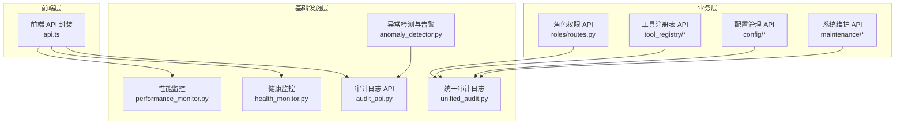
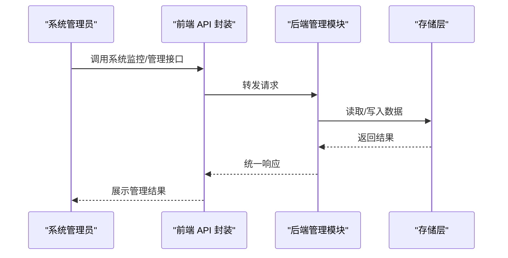
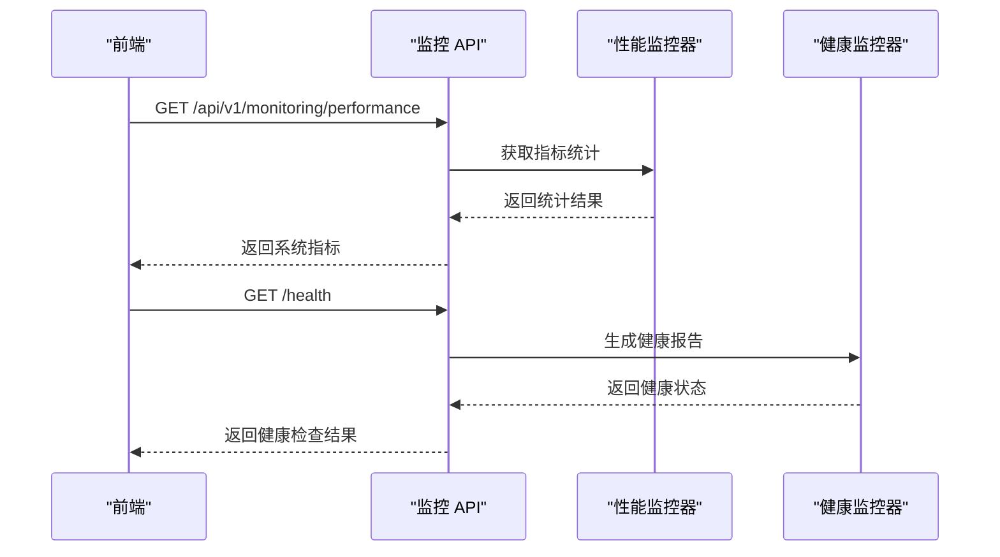
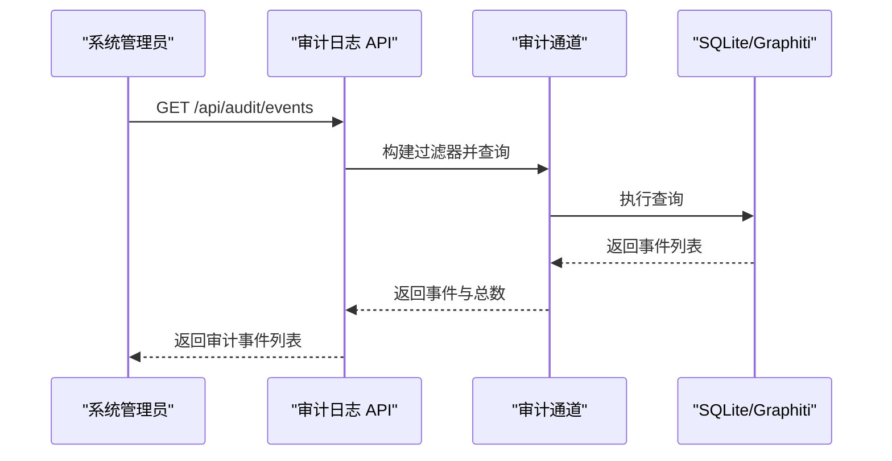
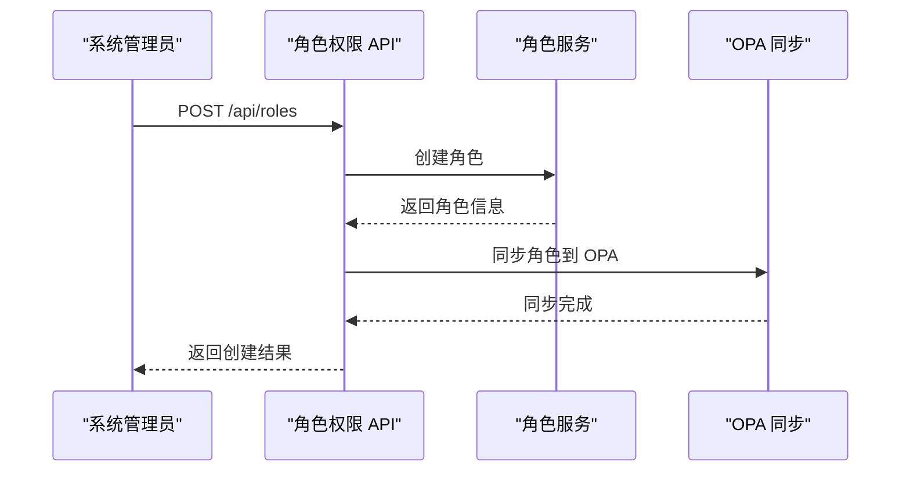
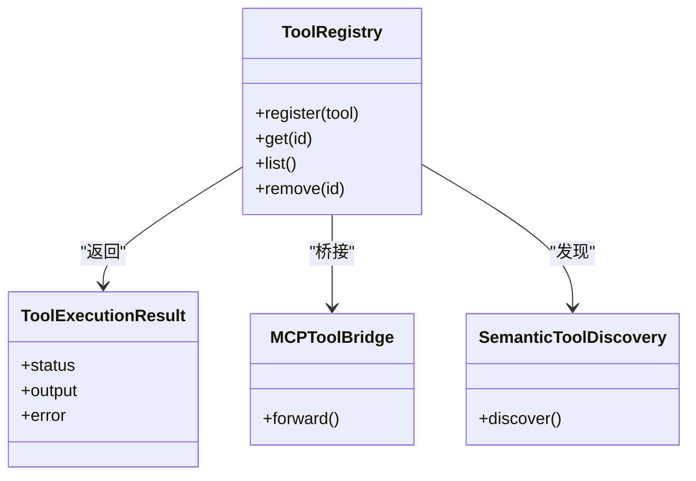
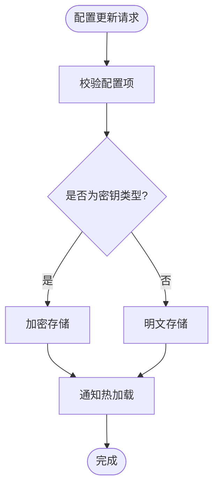
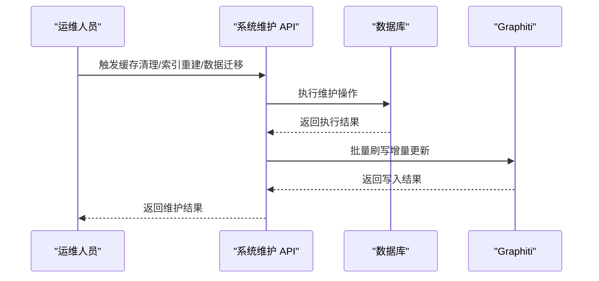
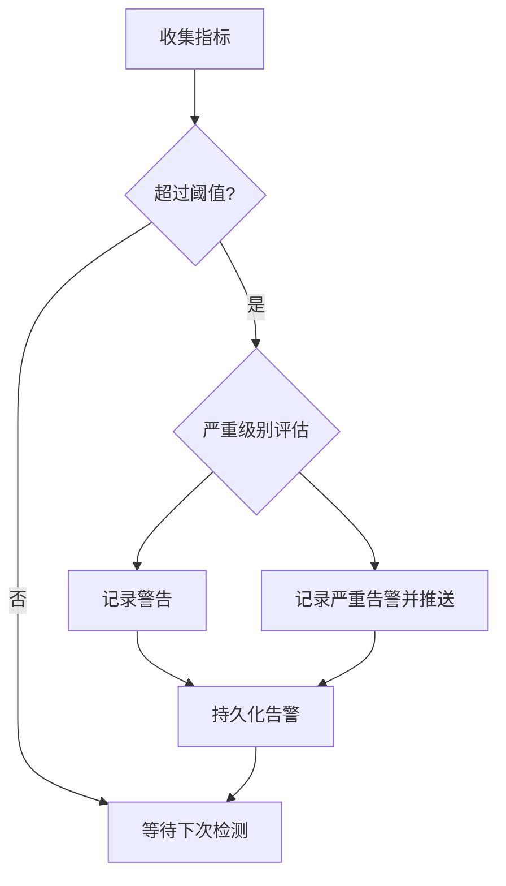
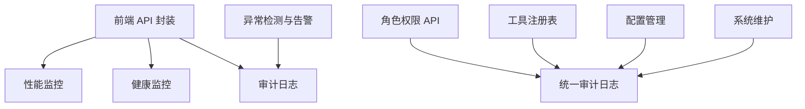

# 系统管理API

<cite>
**本文档引用的文件**
- [performance_monitor.py](file://odap/infra/monitoring/performance_monitor.py)
- [health_monitor.py](file://odap/infra/resilience/health_monitor.py)
- [audit_api.py](file://odap/infra/security/audit_api.py)
- [routes.py](file://odap/biz/platform/roles/api/routes.py)
- [api.ts](file://frontend/src/modules/shared/services/api.ts)
- [test_api_integration.py](file://tests/integration/test_api_integration.py)
- [ARCHITECTURE_OPS.md](file://docs/02-architecture/ARCHITECTURE_OPS.md)
- [DESIGN.md](file://docs/03-modules/swarm_orchestrator/DESIGN.md)
- [unified_audit.py](file://odap/infra/security/unified_audit.py)
- [audit_graphiti_channel.py](file://odap/infra/security/audit_graphiti_channel.py)
- [GRAPHITI_INTEGRATION.md](file://docs/03-modules/audit_log/GRAPHITI_INTEGRATION.md)
- [ARCHITECTURE_BIZ.md](file://docs/02-architecture/ARCHITECTURE_BIZ.md)
- [ARCHITECTURE_FULL_CHAIN_DEEP.md](file://docs/02-architecture/ARCHITECTURE_FULL_CHAIN_DEEP.md)
- [ARCHITECTURE_EVOLVE.md](file://docs/02-architecture/ARCHITECTURE_EVOLVE.md)
- [CODE_CLEANUP_LIST.md](file://docs/CODE_CLEANUP_LIST.md)
</cite>

## 目录
1. [简介](#简介)
2. [项目结构](#项目结构)
3. [核心组件](#核心组件)
4. [架构概览](#架构概览)
5. [详细组件分析](#详细组件分析)
6. [依赖分析](#依赖分析)
7. [性能考虑](#性能考虑)
8. [故障排查指南](#故障排查指南)
9. [结论](#结论)

## 简介
本文件为 ODAP 平台的系统管理 API 参考文档，面向系统管理员与运维人员，涵盖以下管理域：
- 系统监控 API：性能指标查询、健康检查、资源使用统计
- 审计日志 API：操作记录的查询、过滤、导出
- 角色权限 API：用户管理、权限分配、角色继承
- 工具注册表 API：工具的注册、发现、调用管理
- 配置管理 API：系统参数设置、动态配置更新、配置版本管理
- 系统维护 API：缓存清理、索引重建、数据迁移
- 告警通知 API：异常情况的自动通知与处理

文档基于仓库现有实现与设计文档进行整理，确保接口定义、参数与行为的准确性。

## 项目结构
ODAP 平台采用分层与模块化架构，系统管理相关能力分布在基础设施层、业务层与前端交互层：
- 基础设施层：监控、健康检查、审计日志、异常检测等
- 业务层：角色权限、工具注册表、配置管理、系统维护等
- 前端层：统一 API 服务封装，提供系统监控与管理功能的前端调用

**图表来源**
- [api.ts:1442-1488](file://frontend/src/modules/shared/services/api.ts#L1442-L1488)
- [routes.py:1-258](file://odap/biz/platform/roles/api/routes.py#L1-L258)
- [performance_monitor.py:1-184](file://odap/infra/monitoring/performance_monitor.py#L1-L184)
- [health_monitor.py:1-216](file://odap/infra/resilience/health_monitor.py#L1-L216)
- [audit_api.py:1-487](file://odap/infra/security/audit_api.py#L1-L487)
- [unified_audit.py:292-374](file://odap/infra/security/unified_audit.py#L292-L374)

**章节来源**
- [api.ts:1442-1488](file://frontend/src/modules/shared/services/api.ts#L1442-L1488)
- [ARCHITECTURE_OPS.md:478-528](file://docs/02-architecture/ARCHITECTURE_OPS.md#L478-L528)

## 核心组件
本节概述系统管理 API 的核心组件与职责边界：
- 性能监控：采集与统计 LLM 调用、数据库查询、API 请求、工具执行等关键指标
- 健康监控：监控 Swarm 系统与 Agent 状态、组件健康度与阈值告警
- 审计日志：统一记录系统与业务操作，支持查询、过滤、导出与追踪
- 角色权限：提供角色 CRUD、权限分配、策略绑定、用户角色管理
- 工具注册表：工具注册、发现、调用管理与健康监控
- 配置管理：系统参数设置、动态配置更新、配置版本管理
- 系统维护：缓存清理、索引重建、数据迁移等运维操作
- 告警通知：异常检测与自动通知处理

**章节来源**
- [performance_monitor.py:12-184](file://odap/infra/monitoring/performance_monitor.py#L12-L184)
- [health_monitor.py:28-216](file://odap/infra/resilience/health_monitor.py#L28-L216)
- [audit_api.py:16-487](file://odap/infra/security/audit_api.py#L16-L487)
- [routes.py:1-258](file://odap/biz/platform/roles/api/routes.py#L1-L258)

## 架构概览
系统管理 API 的整体架构围绕“基础设施监控 + 业务管理 + 统一审计”的设计展开，前端通过统一 API 封装调用后端管理能力，后端模块负责具体的业务逻辑与数据持久化。

**图表来源**
- [api.ts:1442-1488](file://frontend/src/modules/shared/services/api.ts#L1442-L1488)
- [audit_api.py:120-208](file://odap/infra/security/audit_api.py#L120-L208)
- [routes.py:26-101](file://odap/biz/platform/roles/api/routes.py#L26-L101)

## 详细组件分析

### 系统监控 API
系统监控 API 提供性能指标查询与健康检查能力，前端封装了系统指标与健康状态的查询方法。

- 系统指标查询
  - 接口：GET /api/v1/monitoring/performance
  - 返回：CPU 使用率、内存使用率、磁盘使用率、运行时长、活动连接数、请求总数、错误总数
  - 前端封装：getSystemMetrics()

- 健康检查
  - 接口：GET /health
  - 返回：状态、版本、依赖服务健康状态
  - 前端封装：getSystemHealth()

- 性能监控器
  - 支持指标类型：LLM 调用、数据库查询、API 请求、工具执行
  - 提供统计：均值、中位数、最小/最大、P95/P99
  - 支持装饰器与手动监控

**图表来源**
- [api.ts:1442-1462](file://frontend/src/modules/shared/services/api.ts#L1442-L1462)
- [performance_monitor.py:63-116](file://odap/infra/monitoring/performance_monitor.py#L63-L116)
- [health_monitor.py:175-197](file://odap/infra/resilience/health_monitor.py#L175-L197)

**章节来源**
- [api.ts:1442-1462](file://frontend/src/modules/shared/services/api.ts#L1442-L1462)
- [test_api_integration.py:569-576](file://tests/integration/test_api_integration.py#L569-L576)
- [performance_monitor.py:12-184](file://odap/infra/monitoring/performance_monitor.py#L12-L184)
- [health_monitor.py:28-216](file://odap/infra/resilience/health_monitor.py#L28-L216)

### 审计日志 API
审计日志 API 提供统一的操作记录查询、过滤、导出与追踪能力，支持按时间范围、事件类型、严重级别、资源、结果状态等条件过滤，并支持全文关键词检索。

- 查询审计事件
  - 接口：GET /api/audit/events
  - 支持参数：起止时间、事件类型数组、严重级别数组、操作者 ID 数组、资源类型/ID、工作空间 ID、追踪 ID、结果状态数组、关键词、分页与排序
  - 返回：事件列表、总数、分页信息

- 获取事件详情
  - 接口：GET /api/audit/events/{event_id}

- 时间线视图
  - 接口：GET /api/audit/timeline
  - 支持参数：起止时间、工作空间 ID、数量限制

- 追踪链查询
  - 接口：GET /api/audit/trace/{trace_id}

- 审计统计
  - 接口：GET /api/audit/stats
  - 支持参数：起止时间
  - 返回：总事件数、按严重级别、事件类型、结果状态的分布

- 导出审计日志
  - 接口：POST /api/audit/export
  - 支持参数：起止时间、事件类型数组、严重级别数组、格式（当前仅支持 JSON）

- 创建审计日志
  - 接口：POST /api/audit/logs
  - 支持参数：级别、类型、服务、动作、详情、用户、资源

- 查询日志
  - 接口：GET /api/audit/logs
  - 支持参数：页码、页大小、级别、类型、服务、用户

- 统一审计日志
  - 统一写入 SQLite 主存储与 Graphiti 辅助存储
  - 支持简化查询与过滤

- Graphiti 集成
  - 存储适配器：将审计日志保存到 Graphiti，支持 Cypher 查询与搜索
  - 查询适配器：支持基于关键字的搜索与过滤

**图表来源**
- [audit_api.py:120-208](file://odap/infra/security/audit_api.py#L120-L208)
- [unified_audit.py:292-374](file://odap/infra/security/unified_audit.py#L292-L374)
- [audit_graphiti_channel.py:213-248](file://odap/infra/security/audit_graphiti_channel.py#L213-L248)
- [GRAPHITI_INTEGRATION.md:27-112](file://docs/03-modules/audit_log/GRAPHITI_INTEGRATION.md#L27-L112)

**章节来源**
- [audit_api.py:120-487](file://odap/infra/security/audit_api.py#L120-L487)
- [unified_audit.py:292-374](file://odap/infra/security/unified_audit.py#L292-L374)
- [audit_graphiti_channel.py:213-248](file://odap/infra/security/audit_graphiti_channel.py#L213-L248)
- [GRAPHITI_INTEGRATION.md:27-112](file://docs/03-modules/audit_log/GRAPHITI_INTEGRATION.md#L27-L112)

### 角色权限 API
角色权限 API 提供角色的全生命周期管理与权限分配，支持角色 CRUD、权限列表、用户角色分配、技能与策略绑定等。

- 角色管理
  - 列表角色：GET /api/roles?page&page_size
  - 获取角色详情：GET /api/roles/{role_id}
  - 创建角色：POST /api/roles
  - 更新角色：PUT /api/roles/{role_id}
  - 删除角色：DELETE /api/roles/{role_id}

- 权限管理
  - 获取所有权限：GET /api/roles/permissions/all

- 用户角色管理
  - 分配角色给用户：POST /api/roles/{role_id}/users
  - 从用户移除角色：DELETE /api/roles/{role_id}/users/{user_id}
  - 获取用户角色：GET /api/roles/users/{user_id}/roles
  - 获取用户在工作空间的角色：GET /api/roles/users/{user_id}/workspaces/{workspace_id}/roles

- 技能与策略绑定
  - 绑定技能：POST /api/roles/{role_id}/skills
  - 解绑技能：DELETE /api/roles/{role_id}/skills/{skill_id}
  - 获取角色技能：GET /api/roles/{role_id}/skills
  - 绑定策略：POST /api/roles/{role_id}/policies
  - 解绑策略：DELETE /api/roles/{role_id}/policies/{policy_id}
  - 获取角色策略：GET /api/roles/{role_id}/policies

- 角色热生效机制
  - 新增/修改角色：立即生效
  - 修改策略：自动热加载
  - 禁用角色：立即生效

**图表来源**
- [routes.py:26-101](file://odap/biz/platform/roles/api/routes.py#L26-L101)
- [ARCHITECTURE_BIZ.md:1511-1539](file://docs/02-architecture/ARCHITECTURE_BIZ.md#L1511-L1539)

**章节来源**
- [routes.py:1-258](file://odap/biz/platform/roles/api/routes.py#L1-L258)
- [ARCHITECTURE_BIZ.md:1511-1539](file://docs/02-architecture/ARCHITECTURE_BIZ.md#L1511-L1539)

### 工具注册表 API
工具注册表 API 支持工具的注册、发现与调用管理，具备健康监控与语义发现能力。

- 工具注册与发现
  - 工具注册：支持注册不同类型的工具（如 Bash、文件读写、MCP 等）
  - 工具发现：支持语义工具发现与桥接
  - 工具链：支持工具链编排与步骤管理

- 健康监控
  - 工具健康监控：监控工具可用性与执行状态
  - 断路器与故障恢复：防止工具异常导致系统级影响

- OpenHarness 集成
  - 工具适配器：与 OpenHarness 工具系统集成
  - 任务与计划：支持 Cron 任务与计划管理

**图表来源**
- [ARCHITECTURE_FULL_CHAIN_DEEP.md:4202-4262](file://docs/02-architecture/ARCHITECTURE_FULL_CHAIN_DEEP.md#L4202-L4262)
- [openharness\src\openharness\tools\__init__.py:1-25](file://openharness/src/openharness/tools/__init__.py#L1-L25)

**章节来源**
- [ARCHITECTURE_FULL_CHAIN_DEEP.md:4202-4262](file://docs/02-architecture/ARCHITECTURE_FULL_CHAIN_DEEP.md#L4202-L4262)
- [openharness\src\openharness\tools\__init__.py:1-25](file://openharness/src/openharness/tools/__init__.py#L1-L25)

### 配置管理 API
配置管理 API 提供系统参数设置、动态配置更新与版本管理能力，支持分组配置与密钥加密存储。

- 配置模型
  - 配置分组：包含图标、描述、配置项集合
  - 配置项：键、名称、描述、类型（字符串/数字/布尔/选择/JSON/密钥）、默认值、选项、校验规则、是否加密

- 配置分组与项
  - 示例分组：大模型配置、多模态配置
  - 支持选择型配置、布尔型配置、密钥型配置（加密存储）

- 热生效机制
  - 策略热加载：OPA 策略自动热加载
  - 技能热重载：文件系统监听，变更后自动热重载

**图表来源**
- [ARCHITECTURE_BIZ.md:1719-1822](file://docs/02-architecture/ARCHITECTURE_BIZ.md#L1719-L1822)
- [ARCHITECTURE_FULL_CHAIN_DEEP.md:3624-3722](file://docs/02-architecture/ARCHITECTURE_FULL_CHAIN_DEEP.md#L3624-L3722)

**章节来源**
- [ARCHITECTURE_BIZ.md:1719-1822](file://docs/02-architecture/ARCHITECTURE_BIZ.md#L1719-L1822)
- [ARCHITECTURE_FULL_CHAIN_DEEP.md:3624-3722](file://docs/02-architecture/ARCHITECTURE_FULL_CHAIN_DEEP.md#L3624-L3722)

### 系统维护 API
系统维护 API 提供缓存清理、索引重建、数据迁移等运维能力，确保系统稳定与性能。

- 缓存清理
  - 支持清理各类缓存，释放内存与磁盘空间

- 索引重建
  - 支持对关键索引进行重建，提升查询性能

- 数据迁移
  - 支持版本化数据迁移，确保数据一致性与可回滚

- 本体增量更新
  - 采用小步快跑策略，批量刷写到 Graphiti，避免全量重建

**图表来源**
- [ARCHITECTURE_FULL_CHAIN_DEEP.md:4202-4262](file://docs/02-architecture/ARCHITECTURE_FULL_CHAIN_DEEP.md#L4202-L4262)

**章节来源**
- [ARCHITECTURE_FULL_CHAIN_DEEP.md:4202-4262](file://docs/02-architecture/ARCHITECTURE_FULL_CHAIN_DEEP.md#L4202-L4262)

### 告警通知 API
告警通知 API 基于异常检测系统，自动监测关键指标并触发告警，支持严重级别与实时推送。

- 异常检测
  - 指标阈值：QA 差评率、Skill 失败率、响应延迟、积压更新、用户流失率
  - 严重级别：警告/严重
  - 定时检测：每小时运行一次

- 告警存储与推送
  - 严重告警实时推送
  - 告警持久化存储

**图表来源**
- [ARCHITECTURE_FULL_CHAIN_DEEP.md:4763-4883](file://docs/02-architecture/ARCHITECTURE_FULL_CHAIN_DEEP.md#L4763-L4883)

**章节来源**
- [ARCHITECTURE_FULL_CHAIN_DEEP.md:4763-4883](file://docs/02-architecture/ARCHITECTURE_FULL_CHAIN_DEEP.md#L4763-L4883)

## 依赖分析
系统管理 API 的依赖关系体现了模块间的耦合与协作：

**图表来源**
- [api.ts:1442-1488](file://frontend/src/modules/shared/services/api.ts#L1442-L1488)
- [audit_api.py:120-208](file://odap/infra/security/audit_api.py#L120-L208)
- [routes.py:26-101](file://odap/biz/platform/roles/api/routes.py#L26-L101)
- [unified_audit.py:292-374](file://odap/infra/security/unified_audit.py#L292-L374)

**章节来源**
- [api.ts:1442-1488](file://frontend/src/modules/shared/services/api.ts#L1442-L1488)
- [audit_api.py:120-208](file://odap/infra/security/audit_api.py#L120-L208)
- [routes.py:26-101](file://odap/biz/platform/roles/api/routes.py#L26-L101)
- [unified_audit.py:292-374](file://odap/infra/security/unified_audit.py#L292-L374)

## 性能考虑
- 性能监控器采用滑动窗口与统计聚合，支持高并发场景下的指标采集与导出
- 健康监控器采用异步任务与阈值告警，避免阻塞主业务流程
- 审计日志采用 SQLite 主存储与 Graphiti 辅助存储，兼顾查询效率与图谱能力
- 角色权限与配置管理支持热生效，减少停机时间
- 工具注册表采用桥接与语义发现，降低调用复杂度

[本节为通用指导，无需特定文件引用]

## 故障排查指南
- 健康检查失败
  - 使用 /health/ready 与 /health/live 探针检查依赖服务与进程状态
  - 查看健康监控器生成的健康报告与最近告警

- 审计日志查询异常
  - 检查过滤参数与时间范围
  - 确认 SQLite 与 Graphiti 存储通道可用性

- 角色权限同步问题
  - 确认 OPA 同步状态
  - 检查角色策略热加载是否生效

- 工具调用失败
  - 检查工具健康监控与断路器状态
  - 查看工具链执行结果与错误信息

**章节来源**
- [ARCHITECTURE_OPS.md:478-528](file://docs/02-architecture/ARCHITECTURE_OPS.md#L478-L528)
- [health_monitor.py:175-197](file://odap/infra/resilience/health_monitor.py#L175-L197)
- [audit_api.py:120-208](file://odap/infra/security/audit_api.py#L120-L208)
- [routes.py:58-83](file://odap/biz/platform/roles/api/routes.py#L58-L83)

## 结论
本文档系统性地梳理了 ODAP 平台的系统管理 API，覆盖监控、审计、角色权限、工具注册表、配置管理、系统维护与告警通知等关键领域。通过统一的前端封装与模块化后端设计，系统管理 API 为系统管理员与运维人员提供了高效、可靠的管理手段。建议在生产环境中结合健康检查与异常检测机制，持续监控系统状态，确保平台稳定运行。