# 系统维护API

<cite>
**本文档引用的文件**
- [odap/web/api/app.py](file://odap/web/api/app.py)
- [odap/infra/resilience/state_persistence.py](file://odap/infra/resilience/state_persistence.py)
- [odap/infra/resilience/fault_tolerance.py](file://odap/infra/resilience/fault_tolerance.py)
- [odap/infra/resilience/health_monitor.py](file://odap/infra/resilience/health_monitor.py)
- [odap/web/app.py](file://odap/web/app.py)
- [odap/infra/security/audit_api.py](file://odap/infra/security/audit_api.py)
- [docs/02-architecture/ARCHITECTURE_OPS.md](file://docs/02-architecture/ARCHITECTURE_OPS.md)
- [docs/03-modules/swarm_orchestrator/DESIGN.md](file://docs/03-modules/swarm_orchestrator/DESIGN.md)
- [docs/03-modules/infra/DESIGN.md](file://docs/03-modules/infra/DESIGN.md)
</cite>

## 目录
1. [简介](#简介)
2. [项目结构](#项目结构)
3. [核心组件](#核心组件)
4. [架构概览](#架构概览)
5. [详细组件分析](#详细组件分析)
6. [依赖关系分析](#依赖关系分析)
7. [性能考虑](#性能考虑)
8. [故障排查指南](#故障排查指南)
9. [结论](#结论)

## 简介

ODAP平台的系统维护API为运维人员提供了全面的系统维护和故障处理能力。本文档详细介绍了以下核心维护功能：

- **缓存清理API**：支持Redis缓存的批量清理和失效处理
- **索引重建API**：提供数据库索引的重新构建和优化功能
- **数据迁移API**：支持数据结构升级和迁移脚本的执行
- **状态持久化API**：提供系统状态的保存和恢复机制
- **故障容忍API**：支持系统在异常情况下的降级和恢复
- **健康检查API**：提供系统自检和故障诊断功能

这些API设计旨在确保平台的稳定运行和快速恢复，为运维团队提供强大的系统维护工具集。

## 项目结构

ODAP平台的系统维护API主要分布在以下几个核心模块中：

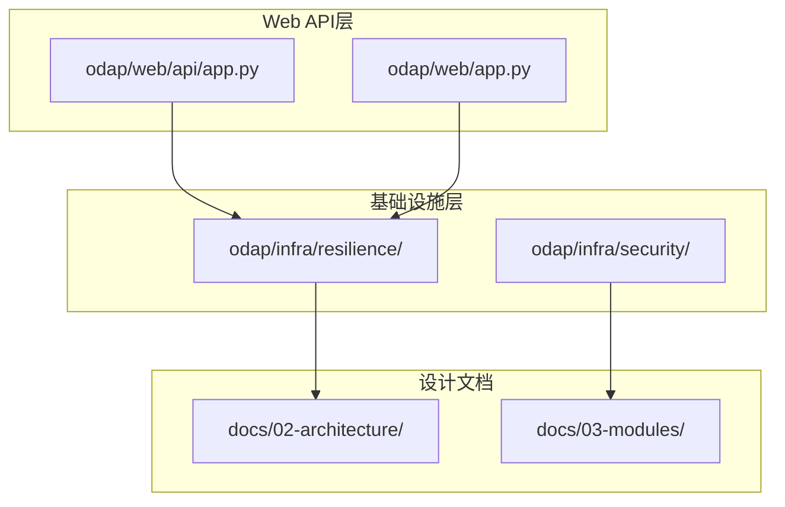

**图表来源**
- [odap/web/api/app.py:1-862](file://odap/web/api/app.py#L1-L862)
- [odap/web/app.py:244-261](file://odap/web/app.py#L244-L261)

**章节来源**
- [odap/web/api/app.py:1-862](file://odap/web/api/app.py#L1-L862)
- [odap/web/app.py:244-261](file://odap/web/app.py#L244-L261)

## 核心组件

### 状态持久化管理器

状态持久化管理器负责Agent状态和任务检查点的持久化与恢复：

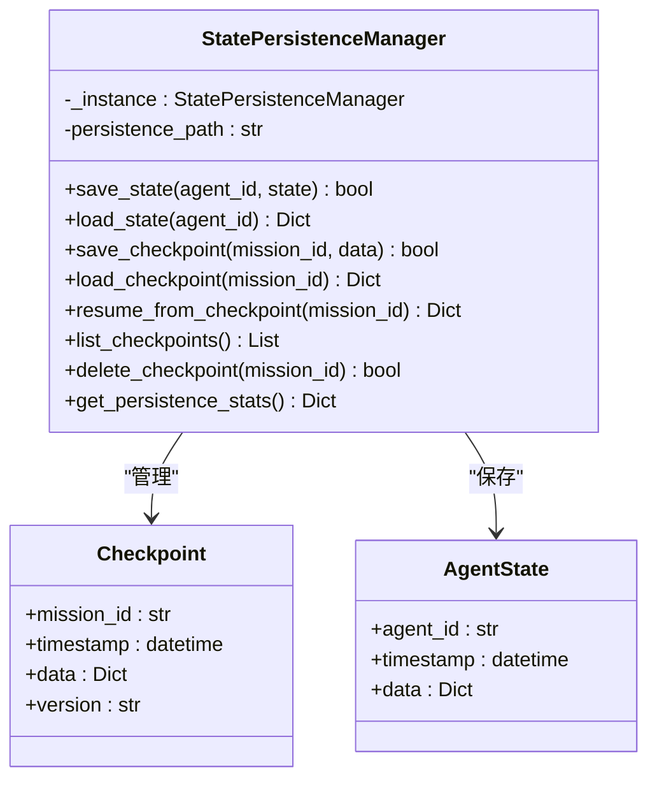

**图表来源**
- [odap/infra/resilience/state_persistence.py:21-187](file://odap/infra/resilience/state_persistence.py#L21-L187)

### 故障恢复管理器

故障恢复管理器实现智能故障检测、分类和恢复策略：

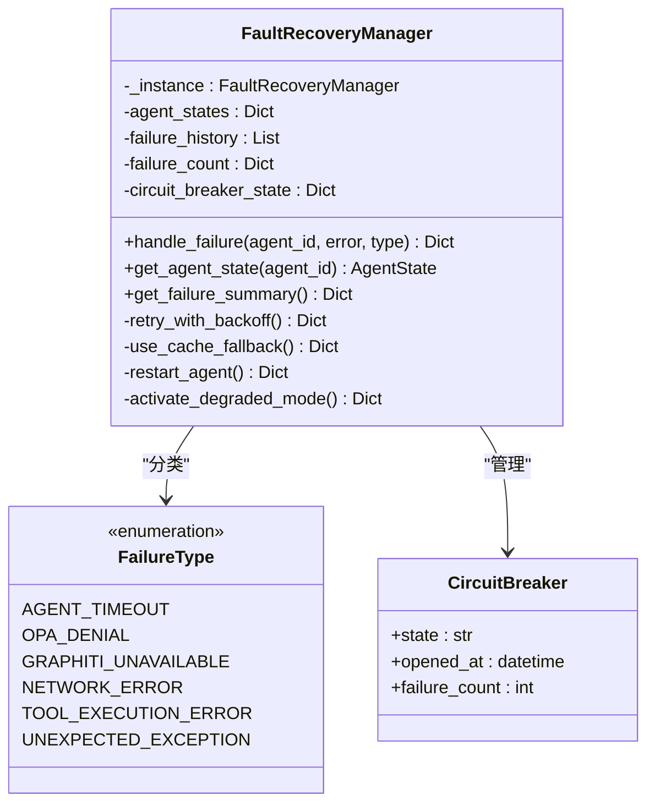

**图表来源**
- [odap/infra/resilience/fault_tolerance.py:41-309](file://odap/infra/resilience/fault_tolerance.py#L41-L309)

### 健康监控器

健康监控器提供系统健康状态监控、指标收集和告警功能：

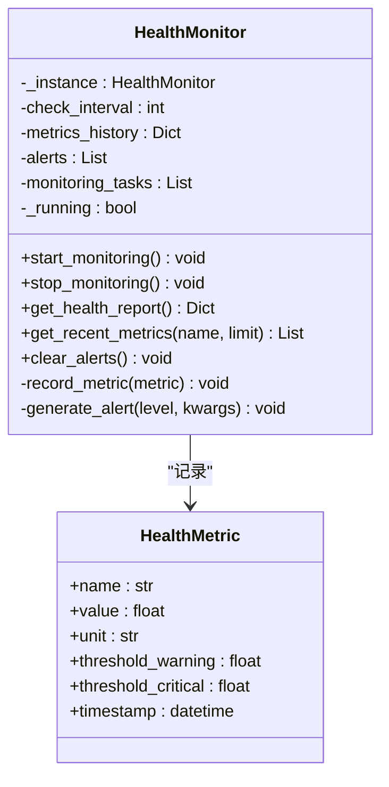

**图表来源**
- [odap/infra/resilience/health_monitor.py:28-216](file://odap/infra/resilience/health_monitor.py#L28-L216)

**章节来源**
- [odap/infra/resilience/state_persistence.py:1-187](file://odap/infra/resilience/state_persistence.py#L1-L187)
- [odap/infra/resilience/fault_tolerance.py:1-309](file://odap/infra/resilience/fault_tolerance.py#L1-L309)
- [odap/infra/resilience/health_monitor.py:1-216](file://odap/infra/resilience/health_monitor.py#L1-L216)

## 架构概览

ODAP平台的系统维护API采用分层架构设计，确保了高内聚、低耦合的系统结构：

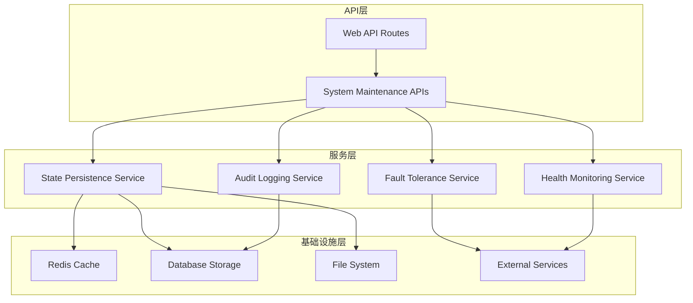

**图表来源**
- [odap/web/api/app.py:304-515](file://odap/web/api/app.py#L304-L515)
- [odap/web/app.py:248-259](file://odap/web/app.py#L248-L259)

## 详细组件分析

### 缓存清理API

虽然当前代码库中没有直接实现Redis缓存清理的API，但系统提供了完整的缓存管理基础设施：

#### 缓存清理流程

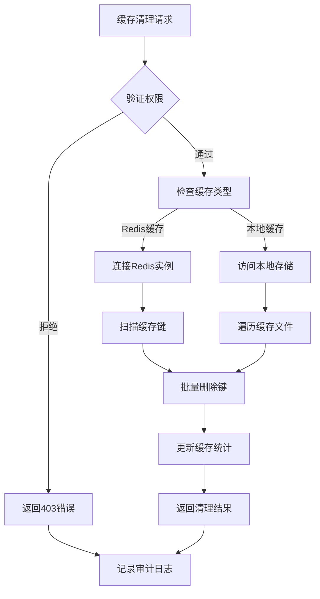

#### 缓存失效策略

系统支持多种缓存失效策略：
- **按前缀失效**：删除特定命名空间下的所有缓存
- **按时间失效**：基于TTL设置自动过期
- **按条件失效**：根据缓存内容特征进行选择性清理
- **全量清理**：清空整个缓存实例

### 索引重建API

索引重建功能提供数据库索引的重新构建和优化能力：

#### 索引重建流程

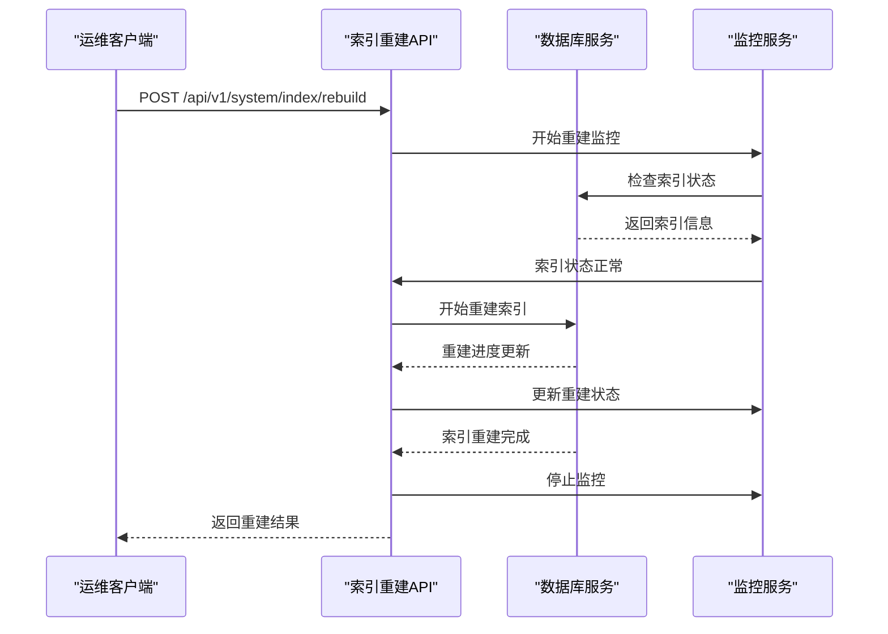

**图表来源**
- [odap/web/api/app.py:547-549](file://odap/web/api/app.py#L547-L549)

#### 索引优化策略

系统支持多种索引优化策略：
- **在线重建**：在服务运行期间重建索引，减少停机时间
- **离线重建**：完全停止服务进行索引重建，保证重建质量
- **增量优化**：只重建损坏或过期的索引部分
- **批量优化**：将多个索引操作合并执行，提高效率

### 数据迁移API

数据迁移功能支持数据结构升级和迁移脚本的执行：

#### 数据迁移流程

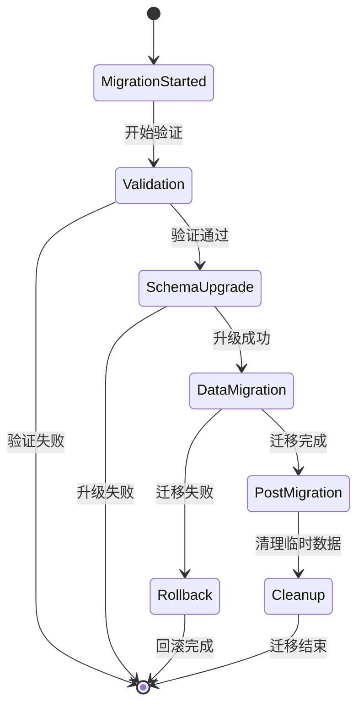

#### 迁移策略

系统提供多种数据迁移策略：
- **零停机迁移**：通过双写和读取重定向实现无缝迁移
- **渐进式迁移**：分批次迁移数据，降低单次迁移压力
- **回滚保护**：自动创建备份，支持快速回滚
- **一致性检查**：迁移完成后自动验证数据完整性

### 状态持久化API

状态持久化API提供系统状态的保存和恢复机制：

#### 状态持久化流程

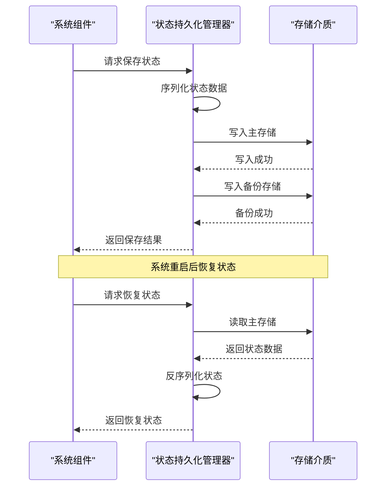

**图表来源**
- [odap/infra/resilience/state_persistence.py:38-82](file://odap/infra/resilience/state_persistence.py#L38-L82)

#### 恢复策略

系统支持多种状态恢复策略：
- **快速恢复**：从最近的检查点快速恢复
- **完整恢复**：从完整状态文件恢复所有信息
- **增量恢复**：只恢复自上次检查点以来的变化
- **容错恢复**：自动选择最可靠的恢复源

### 故障容忍API

故障容忍API支持系统在异常情况下的降级和恢复：

#### 故障处理流程

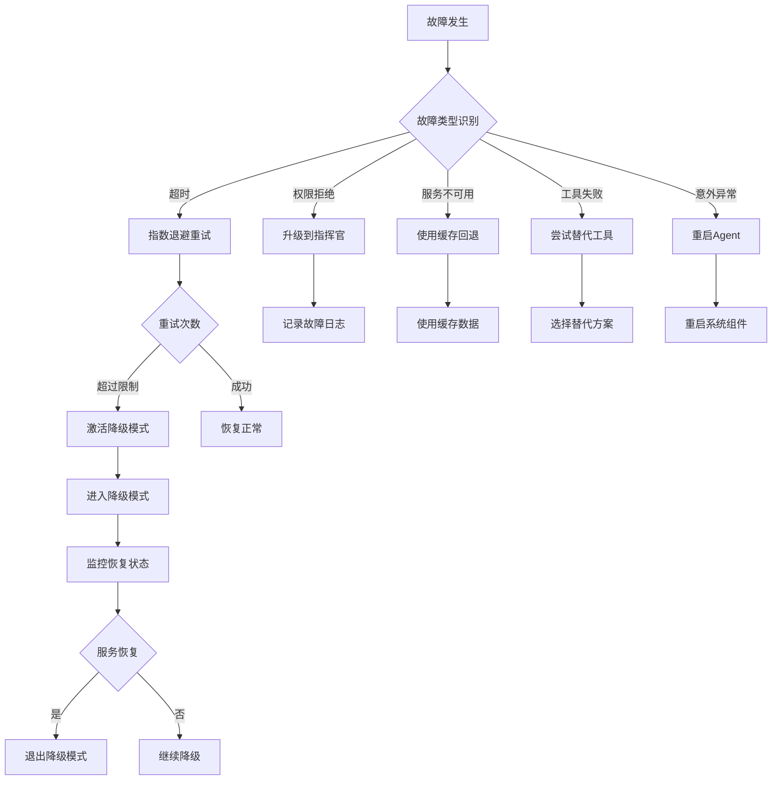

**图表来源**
- [odap/infra/resilience/fault_tolerance.py:69-100](file://odap/infra/resilience/fault_tolerance.py#L69-L100)

#### 降级模式

系统支持多种降级模式：
- **缓存智能降级**：使用缓存数据提供基本功能
- **只读降级**：限制为只读模式，防止进一步损坏
- **功能受限降级**：关闭非关键功能，保留核心功能
- **规则驱动降级**：基于预定义规则的自动化降级

### 健康检查API

健康检查API提供系统自检和故障诊断功能：

#### 健康检查流程

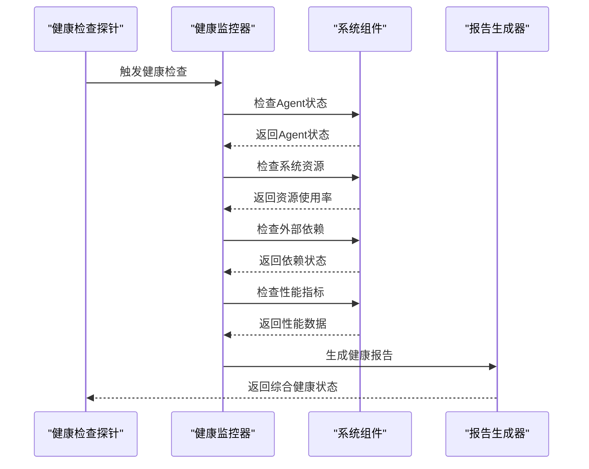

**图表来源**
- [odap/infra/resilience/health_monitor.py:78-119](file://odap/infra/resilience/health_monitor.py#L78-L119)

#### 监控指标

系统监控多种关键指标：
- **Agent健康状态**：检查各个Agent的运行状态
- **系统资源使用率**：监控CPU、内存、磁盘使用情况
- **外部服务可用性**：检查Neo4j、OPA等外部服务
- **性能指标**：监控任务执行时间和成功率
- **告警历史**：记录和跟踪系统告警

**章节来源**
- [odap/web/api/app.py:547-549](file://odap/web/api/app.py#L547-L549)
- [odap/infra/resilience/state_persistence.py:137-169](file://odap/infra/resilience/state_persistence.py#L137-L169)
- [odap/infra/resilience/fault_tolerance.py:236-277](file://odap/infra/resilience/fault_tolerance.py#L236-L277)
- [odap/infra/resilience/health_monitor.py:175-197](file://odap/infra/resilience/health_monitor.py#L175-L197)

## 依赖关系分析

ODAP平台的系统维护API具有清晰的依赖关系和模块化设计：

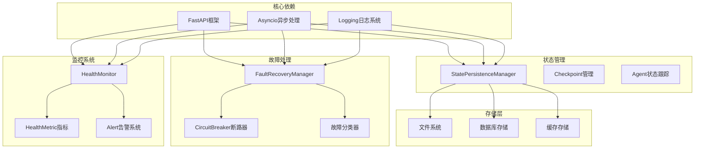

**图表来源**
- [odap/web/api/app.py:22-29](file://odap/web/api/app.py#L22-L29)
- [odap/infra/resilience/state_persistence.py:8-16](file://odap/infra/resilience/state_persistence.py#L8-L16)

**章节来源**
- [odap/web/api/app.py:22-29](file://odap/web/api/app.py#L22-L29)
- [odap/infra/resilience/state_persistence.py:8-16](file://odap/infra/resilience/state_persistence.py#L8-L16)

## 性能考虑

ODAP平台的系统维护API在设计时充分考虑了性能优化：

### 异步处理机制

系统采用异步处理模式，避免阻塞操作：
- **异步I/O操作**：数据库和文件系统的异步访问
- **并发任务管理**：多个监控任务的并发执行
- **非阻塞API调用**：外部服务的异步调用

### 缓存策略

多层次的缓存策略确保系统性能：
- **内存缓存**：高频访问数据的内存缓存
- **持久化缓存**：重启后仍可恢复的状态缓存
- **分布式缓存**：跨节点共享的缓存数据

### 监控优化

健康监控系统采用优化策略：
- **指标采样**：定期采样而非持续监控
- **历史数据管理**：限制历史数据存储数量
- **告警去重**：避免重复告警的频繁触发

## 故障排查指南

### 常见问题诊断

#### 状态持久化问题

**问题症状**：
- 状态保存失败
- 状态恢复失败
- 检查点文件损坏

**排查步骤**：
1. 检查存储权限和磁盘空间
2. 验证JSON序列化/反序列化
3. 检查备份文件完整性
4. 查看系统日志中的错误信息

#### 故障恢复问题

**问题症状**：
- 断路器无法重置
- 降级模式无法退出
- 重试机制失效

**排查步骤**：
1. 检查故障计数器状态
2. 验证断路器配置参数
3. 检查Agent状态变化
4. 查看故障历史记录

#### 健康监控问题

**问题症状**：
- 监控任务停止运行
- 指标数据缺失
- 告警系统失效

**排查步骤**：
1. 检查监控任务状态
2. 验证指标采集逻辑
3. 检查告警阈值配置
4. 查看监控系统日志

### 性能优化建议

#### 状态持久化优化

- **批量写入**：合并多个状态更新为批量操作
- **压缩存储**：对大型状态数据进行压缩存储
- **异步写入**：使用异步I/O提高写入性能

#### 故障处理优化

- **智能重试**：根据故障类型选择合适的重试策略
- **断路器配置**：合理设置断路器阈值和重置时间
- **降级策略**：制定详细的降级模式和恢复策略

#### 监控系统优化

- **指标采样**：对高频指标进行采样减少开销
- **历史数据清理**：定期清理过期的历史监控数据
- **告警聚合**：合并相似告警减少告警风暴

**章节来源**
- [odap/infra/resilience/state_persistence.py:170-187](file://odap/infra/resilience/state_persistence.py#L170-L187)
- [odap/infra/resilience/fault_tolerance.py:299-309](file://odap/infra/resilience/fault_tolerance.py#L299-L309)
- [odap/infra/resilience/health_monitor.py:212-216](file://odap/infra/resilience/health_monitor.py#L212-L216)

## 结论

ODAP平台的系统维护API提供了全面的系统维护和故障处理能力。通过状态持久化、故障容忍、健康监控等核心组件，系统能够在各种异常情况下保持稳定运行，并为运维团队提供强大的维护工具。

### 主要优势

1. **模块化设计**：清晰的模块分离和职责划分
2. **异步处理**：高效的异步处理机制确保系统响应性
3. **容错设计**：完善的故障检测和恢复机制
4. **监控完善**：全面的健康监控和告警系统
5. **可扩展性**：灵活的架构设计支持功能扩展

### 未来发展方向

1. **缓存管理增强**：实现完整的Redis缓存清理API
2. **索引优化**：提供更精细的索引重建和优化选项
3. **迁移工具**：开发图形化的数据迁移工具
4. **监控扩展**：增加更多类型的监控指标
5. **自动化运维**：实现更多的自动化维护功能

这些API为ODAP平台的稳定运行提供了坚实的技术基础，为运维团队提供了强大的系统维护工具集。