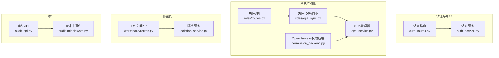
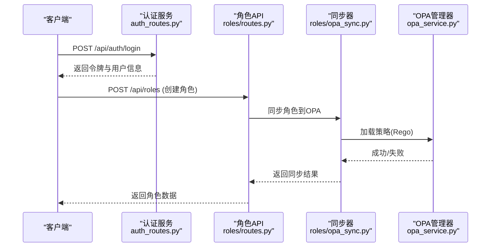
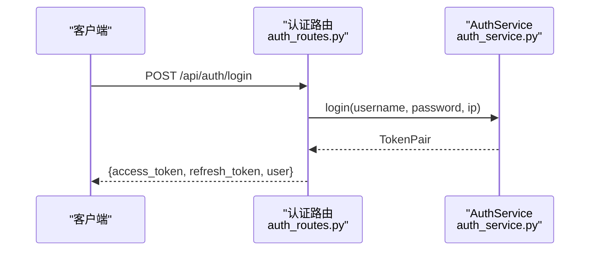
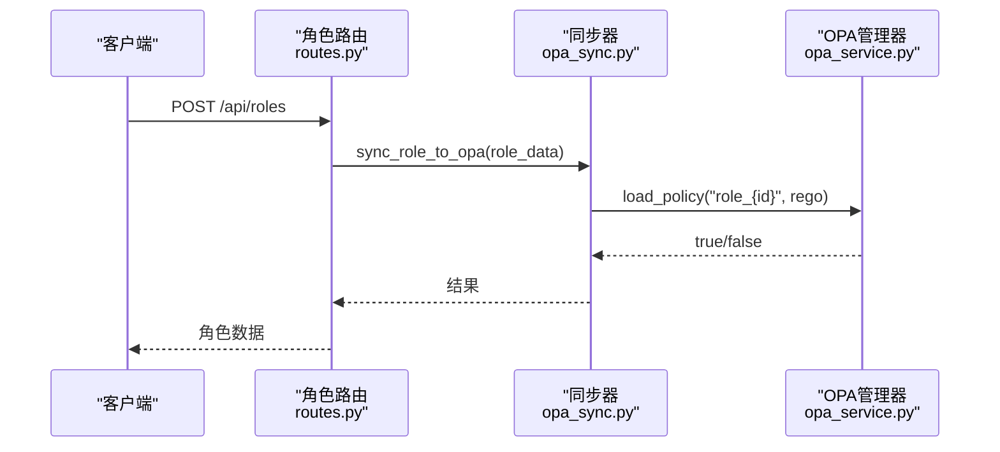
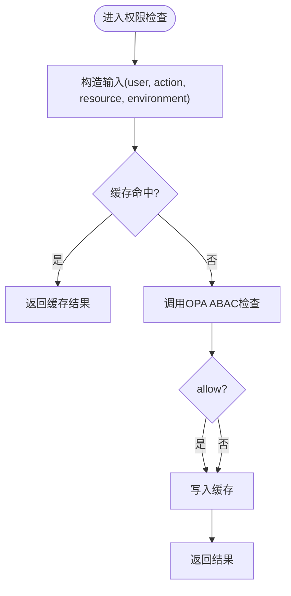
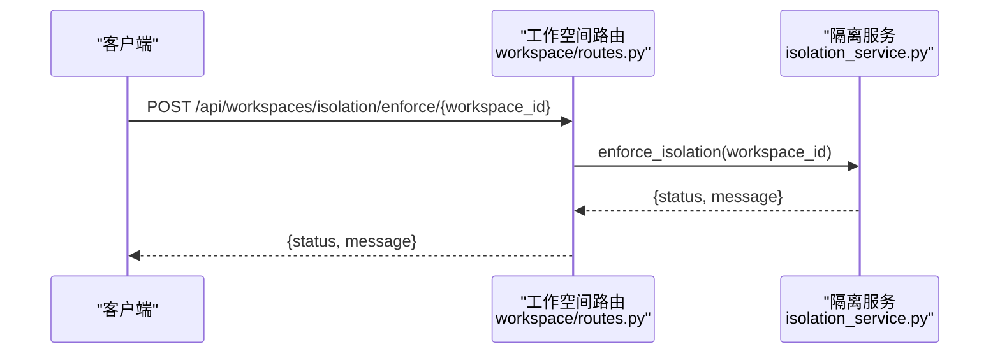
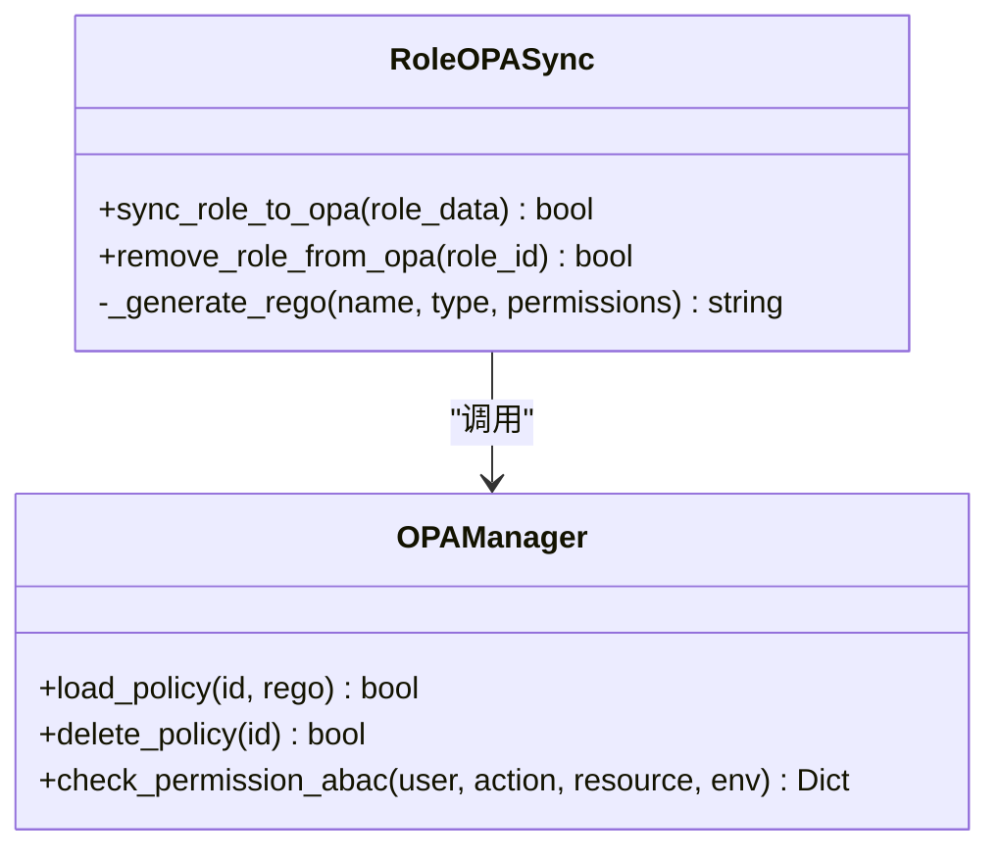
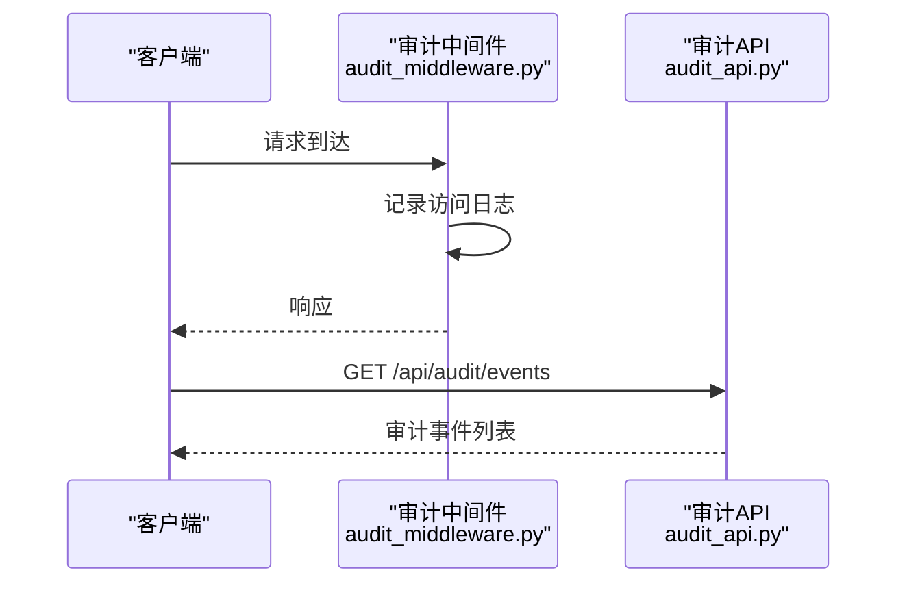
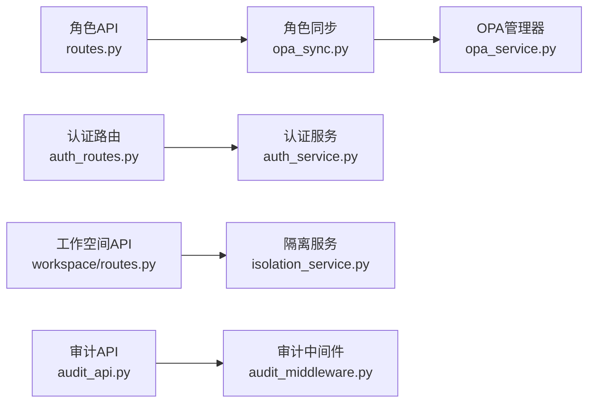

# 角色权限API

<cite>
**本文档引用的文件**
- [odap/biz/platform/roles/api/routes.py](file://odap/biz/platform/roles/api/routes.py)
- [odap/biz/platform/roles/opa_sync.py](file://odap/biz/platform/roles/opa_sync.py)
- [odap/infra/security/auth_routes.py](file://odap/infra/security/auth_routes.py)
- [odap/infra/security/auth_service.py](file://odap/infra/security/auth_service.py)
- [odap/infra/opa/opa_service.py](file://odap/infra/opa/opa_service.py)
- [odap/infra/security/audit_api.py](file://odap/infra/security/audit_api.py)
- [odap/biz/platform/workspace/api/routes.py](file://odap/biz/platform/workspace/api/routes.py)
- [odap/biz/platform/workspace/services/isolation_service.py](file://odap/biz/platform/workspace/services/isolation_service.py)
- [odap/infra/opan/permission_backend.py](file://odap/infra/openharness/permission_backend.py)
- [odap/infra/middleware/audit_middleware.py](file://odap/infra/middleware/audit_middleware.py)
- [tests/unit/test_role_opa_sync.py](file://tests/unit/test_role_opa_sync.py)
- [tests/e2e/test_e2e_flows.py](file://tests/e2e/test_e2e_flows.py)
- [docs/03-modules/audit_log/DESIGN.md](file://docs/03-modules/audit_log/DESIGN.md)
- [docs/03-modules/audit_log/GRAPHITI_INTEGRATION.md](file://docs/03-modules/audit_log/GRAPHITI_INTEGRATION.md)
- [docs/03-modules/opa_policy/DESIGN.md](file://docs/03-modules/opa_policy/DESIGN.md)
- [docs/07-adr/ADR-041_workspace_resource_isolation.md](file://docs/07-adr/ADR-041_workspace_resource_isolation.md)
</cite>

## 目录
1. [简介](#简介)
2. [项目结构](#项目结构)
3. [核心组件](#核心组件)
4. [架构总览](#架构总览)
5. [详细组件分析](#详细组件分析)
6. [依赖关系分析](#依赖关系分析)
7. [性能考虑](#性能考虑)
8. [故障排查指南](#故障排查指南)
9. [结论](#结论)
10. [附录](#附录)

## 简介
本文件为 ODAP 平台的角色权限 API 参考文档，面向系统管理员与开发者，提供用户管理、角色管理、权限验证、工作空间权限隔离、角色与 OPA 策略同步、以及权限审计的完整 API 参考。文档以“可操作”为目标，既包含接口定义与调用流程，也涵盖架构设计与最佳实践，帮助读者快速理解并正确集成权限体系。

## 项目结构
围绕角色权限的关键模块分布如下：
- 用户与认证：odap/infra/security/auth_routes.py、odap/infra/security/auth_service.py
- 角色与权限：odap/biz/platform/roles/api/routes.py、odap/biz/platform/roles/opa_sync.py
- 权限验证（OPA）：odap/infra/opa/opa_service.py、odap/infra/openharness/permission_backend.py
- 工作空间权限隔离：odap/biz/platform/workspace/api/routes.py、odap/biz/platform/workspace/services/isolation_service.py
- 权限审计：odap/infra/security/audit_api.py、odap/infra/middleware/audit_middleware.py
- 设计文档与ADR：docs/03-modules/audit_log/DESIGN.md、docs/03-modules/audit_log/GRAPHITI_INTEGRATION.md、docs/03-modules/opa_policy/DESIGN.md、docs/07-adr/ADR-041_workspace_resource_isolation.md

**图表来源**
- [odap/infra/security/auth_routes.py:1-143](file://odap/infra/security/auth_routes.py#L1-L143)
- [odap/infra/security/auth_service.py:1-439](file://odap/infra/security/auth_service.py#L1-L439)
- [odap/biz/platform/roles/api/routes.py:1-258](file://odap/biz/platform/roles/api/routes.py#L1-L258)
- [odap/biz/platform/roles/opa_sync.py:1-54](file://odap/biz/platform/roles/opa_sync.py#L1-L54)
- [odap/infra/opa/opa_service.py:1-750](file://odap/infra/opa/opa_service.py#L1-L750)
- [odap/infra/openharness/permission_backend.py:1-41](file://odap/infra/openharness/permission_backend.py#L1-L41)
- [odap/biz/platform/workspace/api/routes.py:1-758](file://odap/biz/platform/workspace/api/routes.py#L1-L758)
- [odap/biz/platform/workspace/services/isolation_service.py:79-121](file://odap/biz/platform/workspace/services/isolation_service.py#L79-L121)
- [odap/infra/security/audit_api.py:1-487](file://odap/infra/security/audit_api.py#L1-L487)
- [odap/infra/middleware/audit_middleware.py:91-111](file://odap/infra/middleware/audit_middleware.py#L91-L111)

**章节来源**
- [odap/biz/platform/roles/api/routes.py:1-258](file://odap/biz/platform/roles/api/routes.py#L1-L258)
- [odap/infra/security/auth_routes.py:1-143](file://odap/infra/security/auth_routes.py#L1-L143)
- [odap/infra/opa/opa_service.py:1-750](file://odap/infra/opa/opa_service.py#L1-L750)
- [odap/biz/platform/workspace/api/routes.py:1-758](file://odap/biz/platform/workspace/api/routes.py#L1-L758)
- [odap/infra/security/audit_api.py:1-487](file://odap/infra/security/audit_api.py#L1-L487)

## 核心组件
- 用户与认证
  - 提供登录、刷新、用户列表、创建/更新/删除用户等接口，支持全局角色映射与令牌管理。
- 角色与权限
  - 提供角色的增删改查、用户角色分配/撤销、角色与技能/策略绑定/解绑、权限列表查询。
  - 自动将角色权限同步至 OPA，生成 Rego 策略并加载。
- 权限验证（OPA）
  - 支持 ABAC 权限检查、批量检查、策略热更新、策略沙箱、缓存与历史记录。
  - OpenHarness 权限后端将工具名称映射到策略包，统一调用 OPA。
- 工作空间权限隔离
  - 提供工作空间生命周期管理、成员管理、隔离策略创建/执行、资源使用与配额检查。
- 权限审计
  - 提供审计事件查询、时间线、追踪链、统计与导出；中间件自动记录API访问日志。

**章节来源**
- [odap/infra/security/auth_routes.py:1-143](file://odap/infra/security/auth_routes.py#L1-L143)
- [odap/biz/platform/roles/api/routes.py:1-258](file://odap/biz/platform/roles/api/routes.py#L1-L258)
- [odap/biz/platform/roles/opa_sync.py:1-54](file://odap/biz/platform/roles/opa_sync.py#L1-L54)
- [odap/infra/opa/opa_service.py:1-750](file://odap/infra/opa/opa_service.py#L1-L750)
- [odap/infra/openharness/permission_backend.py:1-41](file://odap/infra/openharness/permission_backend.py#L1-L41)
- [odap/biz/platform/workspace/api/routes.py:1-758](file://odap/biz/platform/workspace/api/routes.py#L1-L758)
- [odap/biz/platform/workspace/services/isolation_service.py:79-121](file://odap/biz/platform/workspace/services/isolation_service.py#L79-L121)
- [odap/infra/security/audit_api.py:1-487](file://odap/infra/security/audit_api.py#L1-L487)
- [odap/infra/middleware/audit_middleware.py:91-111](file://odap/infra/middleware/audit_middleware.py#L91-L111)

## 架构总览
ODAP 的权限体系由“用户认证—角色—权限策略—工作空间隔离—审计”构成闭环。用户通过认证获取令牌，角色与权限在系统内集中管理并通过 OPA 实施强制访问控制；工作空间提供资源与策略隔离；审计贯穿全链路，保障可追溯。

**图表来源**
- [odap/infra/security/auth_routes.py:40-72](file://odap/infra/security/auth_routes.py#L40-L72)
- [odap/biz/platform/roles/api/routes.py:49-63](file://odap/biz/platform/roles/api/routes.py#L49-L63)
- [odap/biz/platform/roles/opa_sync.py:15-27](file://odap/biz/platform/roles/opa_sync.py#L15-L27)
- [odap/infra/opa/opa_service.py:684-695](file://odap/infra/opa/opa_service.py#L684-L695)

## 详细组件分析

### 用户管理API
- 登录
  - 方法与路径：POST /api/auth/login
  - 输入：用户名、密码
  - 输出：访问令牌、刷新令牌、用户基本信息（含全局角色映射）
- 我的资料
  - 方法与路径：GET /api/auth/me
  - 输出：当前用户ID、用户名、全局角色、工作空间ID与角色
- 刷新令牌
  - 方法与路径：POST /api/auth/refresh
  - 输入：刷新令牌
  - 输出：新的访问令牌与刷新令牌
- 管理员用户管理
  - 列表：GET /api/auth/users
  - 创建：POST /api/auth/users（需管理员权限）
  - 更新：PUT /api/auth/users/{user_id}（需管理员权限）
  - 删除：DELETE /api/auth/users/{user_id}（需管理员权限，不允许删除自己）

**图表来源**
- [odap/infra/security/auth_routes.py:40-72](file://odap/infra/security/auth_routes.py#L40-L72)
- [odap/infra/security/auth_service.py:118-156](file://odap/infra/security/auth_service.py#L118-L156)

**章节来源**
- [odap/infra/security/auth_routes.py:1-143](file://odap/infra/security/auth_routes.py#L1-L143)
- [odap/infra/security/auth_service.py:1-439](file://odap/infra/security/auth_service.py#L1-L439)

### 角色管理API
- 角色基础操作
  - 列表：GET /api/roles?page&page_size
  - 详情：GET /api/roles/{role_id}
  - 创建：POST /api/roles（创建后自动同步到 OPA）
  - 更新：PUT /api/roles/{role_id}（更新后自动同步到 OPA）
  - 删除：DELETE /api/roles/{role_id}（删除后从 OPA 移除策略）
- 用户与角色
  - 分配：POST /api/roles/{role_id}/users（支持指定工作空间）
  - 撤销：DELETE /api/roles/{role_id}/users/{user_id}
  - 查询用户角色：GET /api/roles/users/{user_id}/roles
  - 查询用户在某工作空间的角色：GET /api/roles/users/{user_id}/workspaces/{workspace_id}/roles
- 技能与策略绑定
  - 绑定技能：POST /api/roles/{role_id}/skills
  - 解绑技能：DELETE /api/roles/{role_id}/skills/{skill_id}
  - 查询技能：GET /api/roles/{role_id}/skills
  - 绑定策略：POST /api/roles/{role_id}/policies
  - 解绑策略：DELETE /api/roles/{role_id}/policies/{policy_id}
  - 查询策略：GET /api/roles/{role_id}/policies
- 权限清单
  - GET /api/roles/permissions/all

**图表来源**
- [odap/biz/platform/roles/api/routes.py:49-83](file://odap/biz/platform/roles/api/routes.py#L49-L83)
- [odap/biz/platform/roles/opa_sync.py:15-27](file://odap/biz/platform/roles/opa_sync.py#L15-L27)
- [odap/infra/opa/opa_service.py:684-695](file://odap/infra/opa/opa_service.py#L684-L695)

**章节来源**
- [odap/biz/platform/roles/api/routes.py:1-258](file://odap/biz/platform/roles/api/routes.py#L1-L258)
- [odap/biz/platform/roles/opa_sync.py:1-54](file://odap/biz/platform/roles/opa_sync.py#L1-L54)

### 权限验证API（基于 OPA）
- ABAC 权限检查
  - POST /v1/data/domain/abac_allow
  - 输入：用户、动作、资源、环境
  - 输出：允许/拒绝及原因
- 批量权限检查
  - POST /v1/data/domain/batch_allow
  - 输入：请求数组
  - 输出：每条请求的结果
- 策略热更新与回滚
  - PUT /v1/policies/{policy_path}
  - DELETE /v1/policies/{policy_path}
  - Bundle 管理与版本记录
- 缓存与历史
  - 缓存命中/未命中统计
  - 策略历史记录与性能指标

**图表来源**
- [odap/infra/opa/opa_service.py:559-583](file://odap/infra/opa/opa_service.py#L559-L583)
- [odap/infra/opa/opa_service.py:511-536](file://odap/infra/opa/opa_service.py#L511-L536)

**章节来源**
- [odap/infra/opa/opa_service.py:1-750](file://odap/infra/opa/opa_service.py#L1-L750)

### 工作空间权限API
- 工作空间生命周期
  - 创建：POST /api/workspaces
  - 详情：GET /api/workspaces/{workspace_id}
  - 更新：PUT /api/workspaces/{workspace_id}
  - 删除：DELETE /api/workspaces/{workspace_id}
  - 激活/停用：POST /api/workspaces/{workspace_id}/activate, /deactivate
- 成员管理
  - 添加成员：POST /api/workspaces/{workspace_id}/members/{user_id}
  - 移除成员：DELETE /api/workspaces/{workspace_id}/members/{user_id}
- 隔离策略
  - 创建：POST /api/workspaces/isolation/policies
  - 查询：GET /api/workspaces/isolation/policies/{workspace_id}
  - 执行隔离：POST /api/workspaces/isolation/enforce/{workspace_id}
  - 资源使用：GET /api/workspaces/isolation/resource-usage/{workspace_id}
  - 配额检查：内部服务方法返回违规列表
- 场景与本体版本
  - 场景 CRUD、构建图谱、绑定/解绑本体、版本切换、版本数据查询

**图表来源**
- [odap/biz/platform/workspace/api/routes.py:224-235](file://odap/biz/platform/workspace/api/routes.py#L224-L235)
- [odap/biz/platform/workspace/services/isolation_service.py:79-83](file://odap/biz/platform/workspace/services/isolation_service.py#L79-L83)

**章节来源**
- [odap/biz/platform/workspace/api/routes.py:1-758](file://odap/biz/platform/workspace/api/routes.py#L1-L758)
- [odap/biz/platform/workspace/services/isolation_service.py:79-121](file://odap/biz/platform/workspace/services/isolation_service.py#L79-L121)

### 角色同步API（与 OPA 策略引擎）
- 同步流程
  - 角色创建/更新：自动生成 Rego 策略并加载到 OPA
  - 角色删除：从 OPA 删除对应策略
  - 支持字符串权限与对象权限两种格式
- 测试覆盖
  - 单元测试验证 Rego 生成、OPA 加载/删除、异常处理

**图表来源**
- [odap/biz/platform/roles/opa_sync.py:1-54](file://odap/biz/platform/roles/opa_sync.py#L1-L54)
- [odap/infra/opa/opa_service.py:684-705](file://odap/infra/opa/opa_service.py#L684-L705)

**章节来源**
- [odap/biz/platform/roles/opa_sync.py:1-54](file://odap/biz/platform/roles/opa_sync.py#L1-L54)
- [tests/unit/test_role_opa_sync.py:1-143](file://tests/unit/test_role_opa_sync.py#L1-L143)

### 权限审计API
- 审计事件查询
  - GET /api/audit/events（支持时间范围、事件类型、严重级别、资源/用户过滤、关键字、分页排序）
  - GET /api/audit/events/{event_id}
  - GET /api/audit/timeline（工作空间时间线）
  - GET /api/audit/trace/{trace_id}（按trace_id串联事件）
  - GET /api/audit/stats（统计）
  - POST /api/audit/export（导出JSON）
  - POST /api/audit/logs（创建日志）
  - GET /api/audit/logs（查询日志）
- 中间件审计
  - 自动记录API访问行为（方法、路径、状态码、耗时、客户端IP、trace_id等）

**图表来源**
- [odap/infra/middleware/audit_middleware.py:91-111](file://odap/infra/middleware/audit_middleware.py#L91-L111)
- [odap/infra/security/audit_api.py:120-208](file://odap/infra/security/audit_api.py#L120-L208)

**章节来源**
- [odap/infra/security/audit_api.py:1-487](file://odap/infra/security/audit_api.py#L1-L487)
- [odap/infra/middleware/audit_middleware.py:91-111](file://odap/infra/middleware/audit_middleware.py#L91-L111)
- [docs/03-modules/audit_log/DESIGN.md:225-272](file://docs/03-modules/audit_log/DESIGN.md#L225-L272)
- [docs/03-modules/audit_log/GRAPHITI_INTEGRATION.md:27-112](file://docs/03-modules/audit_log/GRAPHITI_INTEGRATION.md#L27-L112)

## 依赖关系分析
- 组件耦合
  - 角色API依赖角色同步器；角色同步器依赖 OPA 管理器；认证路由依赖认证服务。
  - 工作空间API依赖隔离服务；隔离服务依赖隔离策略管理器。
  - 审计API依赖审计通道；审计中间件贯穿所有API。
- 外部依赖
  - OPA REST API（策略加载/删除/检查）、SQLite（审计存储）、FastAPI（路由框架）。

**图表来源**
- [odap/biz/platform/roles/api/routes.py:1-258](file://odap/biz/platform/roles/api/routes.py#L1-L258)
- [odap/biz/platform/roles/opa_sync.py:1-54](file://odap/biz/platform/roles/opa_sync.py#L1-L54)
- [odap/infra/opa/opa_service.py:1-750](file://odap/infra/opa/opa_service.py#L1-L750)
- [odap/infra/security/auth_routes.py:1-143](file://odap/infra/security/auth_routes.py#L1-L143)
- [odap/infra/security/auth_service.py:1-439](file://odap/infra/security/auth_service.py#L1-L439)
- [odap/biz/platform/workspace/api/routes.py:1-758](file://odap/biz/platform/workspace/api/routes.py#L1-L758)
- [odap/biz/platform/workspace/services/isolation_service.py:79-121](file://odap/biz/platform/workspace/services/isolation_service.py#L79-L121)
- [odap/infra/security/audit_api.py:1-487](file://odap/infra/security/audit_api.py#L1-L487)
- [odap/infra/middleware/audit_middleware.py:91-111](file://odap/infra/middleware/audit_middleware.py#L91-L111)

**章节来源**
- [odap/biz/platform/roles/api/routes.py:1-258](file://odap/biz/platform/roles/api/routes.py#L1-L258)
- [odap/biz/platform/roles/opa_sync.py:1-54](file://odap/biz/platform/roles/opa_sync.py#L1-L54)
- [odap/infra/opa/opa_service.py:1-750](file://odap/infra/opa/opa_service.py#L1-L750)
- [odap/infra/security/auth_routes.py:1-143](file://odap/infra/security/auth_routes.py#L1-L143)
- [odap/infra/security/auth_service.py:1-439](file://odap/infra/security/auth_service.py#L1-L439)
- [odap/biz/platform/workspace/api/routes.py:1-758](file://odap/biz/platform/workspace/api/routes.py#L1-L758)
- [odap/biz/platform/workspace/services/isolation_service.py:79-121](file://odap/biz/platform/workspace/services/isolation_service.py#L79-L121)
- [odap/infra/security/audit_api.py:1-487](file://odap/infra/security/audit_api.py#L1-L487)
- [odap/infra/middleware/audit_middleware.py:91-111](file://odap/infra/middleware/audit_middleware.py#L91-L111)

## 性能考虑
- OPA 缓存
  - 管理器内置缓存，支持命中率统计与TTL控制，建议合理设置缓存大小与过期时间。
- 批量检查
  - 提供批量权限检查接口，减少网络往返，提升吞吐。
- 策略沙箱
  - 支持 What-If 分析与策略模拟，便于上线前验证，避免生产风险。
- 审计性能
  - 审计中间件仅记录必要字段，避免重负载下的IO瓶颈；审计查询支持分页与索引字段过滤。

[本节为通用指导，不涉及具体文件分析]

## 故障排查指南
- OPA 连接失败
  - 现象：权限检查抛出异常或回退到本地评估
  - 排查：确认 OPA URL 可达、健康检查通过、策略上传成功
  - 参考：OPA 客户端健康检查与异常处理
- 角色同步失败
  - 现象：创建/更新角色后 OPA 未生效
  - 排查：检查同步器是否获取到 OPA 管理器、Rego 生成是否包含期望动作、OPA 加载/删除返回值
  - 参考：单元测试覆盖的异常分支
- 审计日志缺失
  - 现象：查询不到审计事件
  - 排查：确认审计中间件已启用、SQLite 通道可用、查询参数正确
  - 参考：审计API查询逻辑与通道实现

**章节来源**
- [odap/infra/opa/opa_service.py:444-449](file://odap/infra/opa/opa_service.py#L444-L449)
- [odap/biz/platform/roles/opa_sync.py:26-27](file://odap/biz/platform/roles/opa_sync.py#L26-L27)
- [tests/unit/test_role_opa_sync.py:118-143](file://tests/unit/test_role_opa_sync.py#L118-L143)
- [odap/infra/security/audit_api.py:120-208](file://odap/infra/security/audit_api.py#L120-L208)

## 结论
ODAP 的角色权限体系以“认证—角色—OPA—工作空间—审计”为主线，实现了从用户身份到资源访问的全链路控制。通过自动化的角色-OPA同步、灵活的 ABAC 权限检查、严格的资源隔离与完善的审计能力，系统能够满足多场景、多租户的安全访问控制需求。建议在生产环境中结合缓存策略、批量检查与审计策略，持续优化性能与可观测性。

[本节为总结性内容，不涉及具体文件分析]

## 附录
- 设计文档与ADR
  - OPA 策略模块设计：模块职责、接口设计、Fail-Close 与审计
  - 审计日志模块设计：事件模型、审计跨度、存储适配器
  - 工作空间资源隔离：隔离维度、策略对比、实现与切换
- E2E 示例
  - 角色与策略绑定、工作空间隔离测试流程

**章节来源**
- [docs/03-modules/opa_policy/DESIGN.md:1-65](file://docs/03-modules/opa_policy/DESIGN.md#L1-L65)
- [docs/03-modules/audit_log/DESIGN.md:225-272](file://docs/03-modules/audit_log/DESIGN.md#L225-L272)
- [docs/03-modules/audit_log/GRAPHITI_INTEGRATION.md:27-112](file://docs/03-modules/audit_log/GRAPHITI_INTEGRATION.md#L27-L112)
- [docs/07-adr/ADR-041_workspace_resource_isolation.md:1-80](file://docs/07-adr/ADR-041_workspace_resource_isolation.md#L1-L80)
- [tests/e2e/test_e2e_flows.py:405-429](file://tests/e2e/test_e2e_flows.py#L405-L429)
- [tests/e2e/test_e2e_flows.py:272-310](file://tests/e2e/test_e2e_flows.py#L272-L310)