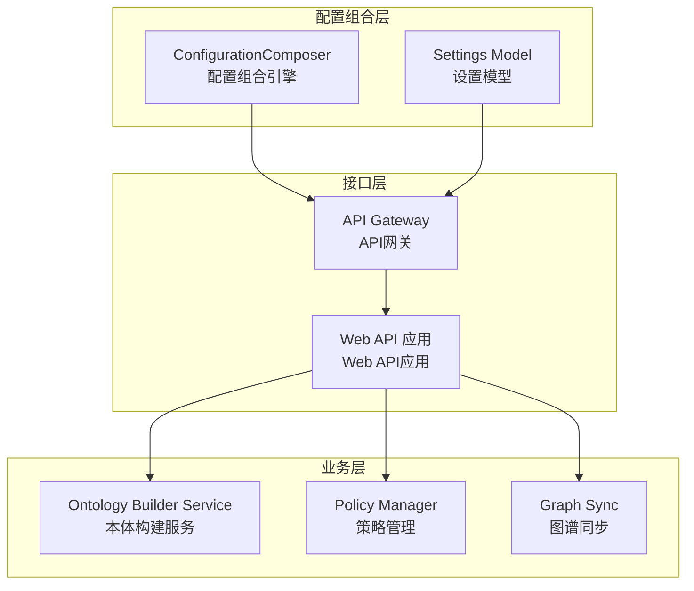
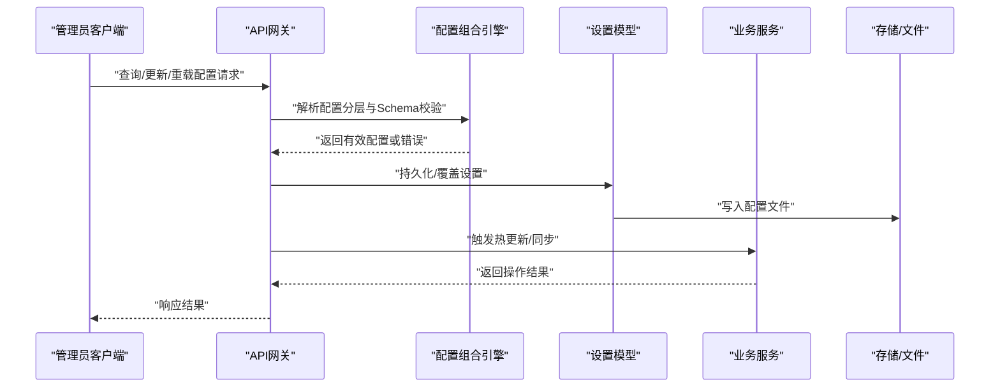
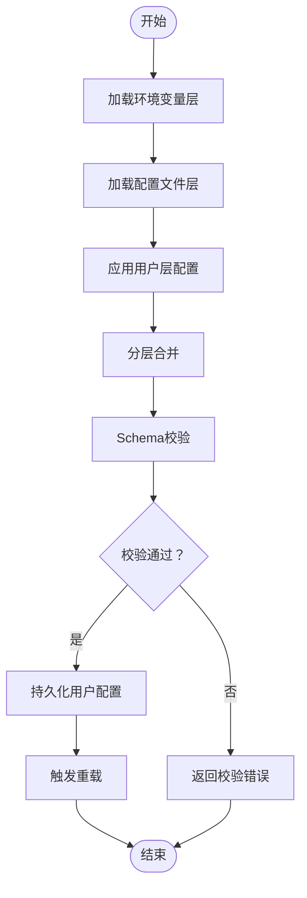
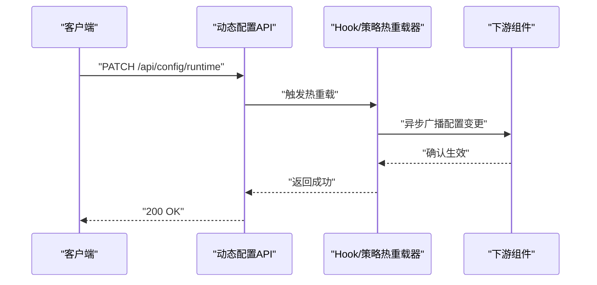
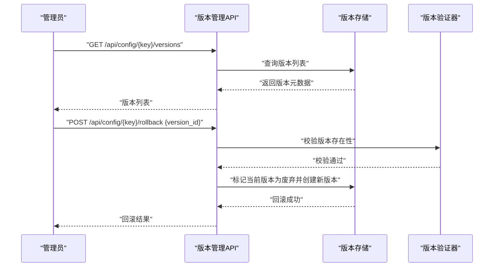
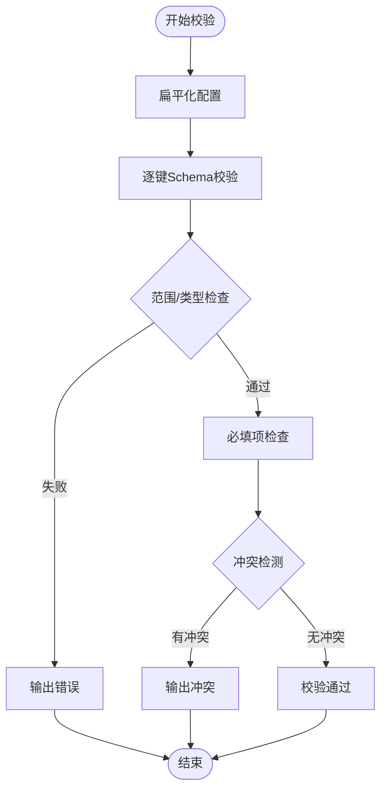
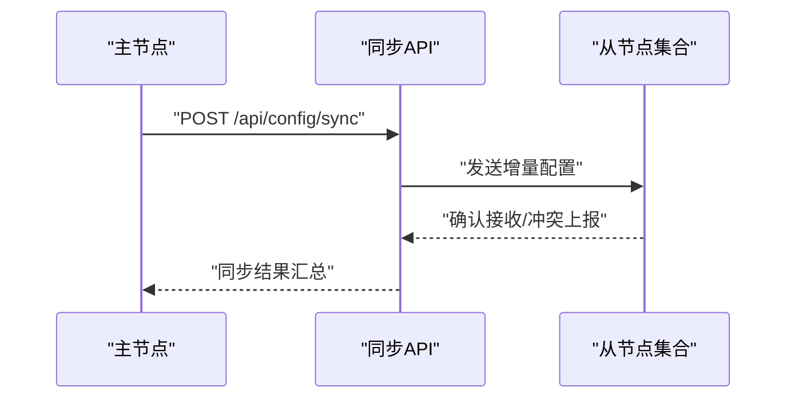
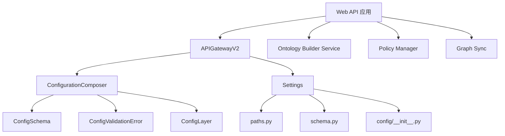

# 配置管理API

<cite>
**本文档引用的文件**
- [odap/infra/config_composer.py](file://odap/infra/config_composer.py)
- [openharness/src/openharness/config/settings.py](file://openharness/src/openharness/config/settings.py)
- [openharness/src/openharness/config/paths.py](file://openharness/src/openharness/config/paths.py)
- [openharness/src/openharness/config/schema.py](file://openharness/src/openharness/config/schema.py)
- [openharness/src/openharness/config/__init__.py](file://openharness/src/openharness/config/__init__.py)
- [openharness/src/openharness/cli.py](file://openharness/src/openharness/cli.py)
- [odap/web/gateway/api_gateway.py](file://odap/web/gateway/api_gateway.py)
- [odap/biz/core/ontology/services/build_service.py](file://odap/biz/core/ontology/services/build_service.py)
- [odap/tools/policy/policy.py](file://odap/tools/policy/policy.py)
- [odap/web/api/app.py](file://odap/web/api/app.py)
- [docs/07-adr/ADR-011_角色配置热生效.md](file://docs/07-adr/ADR-011_角色配置热生效.md)
- [docs/02-architecture/ARCHITECTURE_FULL_CHAIN_DEEP.md](file://docs/02-architecture/ARCHITECTURE_FULL_CHAIN_DEEP.md)
- [config/agent_config.yaml](file://config/agent_config.yaml)
</cite>

## 目录
1. [简介](#简介)
2. [项目结构](#项目结构)
3. [核心组件](#核心组件)
4. [架构总览](#架构总览)
5. [详细组件分析](#详细组件分析)
6. [依赖关系分析](#依赖关系分析)
7. [性能考虑](#性能考虑)
8. [故障排除指南](#故障排除指南)
9. [结论](#结论)
10. [附录](#附录)

## 简介
本文件为 ODAP 平台的配置管理API提供完整参考文档，涵盖以下能力：
- 系统配置API：支持全局配置的查询、更新、重载
- 动态配置API：支持运行时配置修改与热更新机制
- 配置版本管理API：支持配置的历史版本追踪与回滚
- 配置验证API：提供配置项的有效性检查与冲突检测
- 配置导出API：支持配置的批量导出与备份
- 配置同步API：确保多节点环境下的配置一致性

目标读者为系统管理员与平台运维人员，帮助其完成灵活配置与动态调整。

## 项目结构
ODAP 平台的配置管理涉及多个层次与模块：
- 系统配置组合引擎：负责配置分层合并与校验
- OpenHarness 设置模型：提供设置解析、持久化与覆盖
- API 网关：承载配置相关的HTTP接口与路由
- 业务服务：如本体构建、策略管理等对配置的使用与回滚
- 文档与架构：热生效、版本化与同步的设计原则

**图表来源**
- [odap/infra/config_composer.py:74-260](file://odap/infra/config_composer.py#L74-L260)
- [openharness/src/openharness/config/settings.py:448-908](file://openharness/src/openharness/config/settings.py#L448-L908)
- [odap/web/gateway/api_gateway.py:360-380](file://odap/web/gateway/api_gateway.py#L360-L380)
- [odap/web/api/app.py:234-271](file://odap/web/api/app.py#L234-L271)

**章节来源**
- [odap/infra/config_composer.py:1-260](file://odap/infra/config_composer.py#L1-L260)
- [openharness/src/openharness/config/settings.py:1-908](file://openharness/src/openharness/config/settings.py#L1-L908)
- [odap/web/gateway/api_gateway.py:1-380](file://odap/web/gateway/api_gateway.py#L1-L380)
- [odap/web/api/app.py:234-271](file://odap/web/api/app.py#L234-L271)

## 核心组件
本节概述配置管理API的核心组成与职责边界。

- 配置组合引擎（ConfigurationComposer）
  - 职责：定义配置分层、合并策略、类型校验与差异比较
  - 关键能力：分层加载（系统默认、环境变量、文件、工作空间、用户）、Schema 校验、获取有效配置、差异展示
  - 适用场景：全局配置查询、配置有效性检查、配置差异诊断

- 设置模型（Settings）
  - 职责：定义设置结构、解析优先级、持久化与覆盖
  - 关键能力：多层优先级解析、配置文件保存、环境变量覆盖、配置合并与材料化
  - 适用场景：运行时配置更新、配置热生效、配置导出

- API 网关（APIGatewayV2）
  - 职责：路由模型、认证、限流、权限桥接、服务代理、指标采集
  - 关键能力：统一入口、安全控制、可观测性
  - 适用场景：对外暴露配置管理接口

- 业务服务
  - 本体构建服务：版本回滚、版本追踪
  - 策略管理：策略版本回滚、历史记录
  - 图谱同步：多节点一致性同步

**章节来源**
- [odap/infra/config_composer.py:74-260](file://odap/infra/config_composer.py#L74-L260)
- [openharness/src/openharness/config/settings.py:448-908](file://openharness/src/openharness/config/settings.py#L448-L908)
- [odap/web/gateway/api_gateway.py:360-380](file://odap/web/gateway/api_gateway.py#L360-L380)
- [odap/biz/core/ontology/services/build_service.py:391-436](file://odap/biz/core/ontology/services/build_service.py#L391-L436)
- [odap/tools/policy/policy.py:186-240](file://odap/tools/policy/policy.py#L186-L240)
- [odap/web/api/app.py:234-271](file://odap/web/api/app.py#L234-L271)

## 架构总览
配置管理API在系统中的交互关系如下：

**图表来源**
- [odap/infra/config_composer.py:135-206](file://odap/infra/config_composer.py#L135-L206)
- [openharness/src/openharness/config/settings.py:889-907](file://openharness/src/openharness/config/settings.py#L889-L907)
- [odap/web/gateway/api_gateway.py:360-380](file://odap/web/gateway/api_gateway.py#L360-L380)

## 详细组件分析

### 系统配置API
- 查询全局配置
  - 接口路径：/api/config/global
  - 方法：GET
  - 功能：返回系统默认配置、环境变量覆盖、文件配置、工作空间配置、用户配置的合并结果
  - 返回字段：配置键值对、Schema 描述、敏感信息标记
  - 复杂度：O(K)，K为Schema数量
- 更新全局配置
  - 接口路径：/api/config/global
  - 方法：PUT
  - 功能：接收用户配置，进行Schema校验后写入用户层
  - 返回字段：状态码、错误信息（如有）
- 重载全局配置
  - 接口路径：/api/config/reload
  - 方法：POST
  - 功能：重新加载环境变量与配置文件，刷新有效配置
  - 返回字段：状态码、重载后的配置摘要

**图表来源**
- [odap/infra/config_composer.py:135-206](file://odap/infra/config_composer.py#L135-L206)
- [odap/infra/config_composer.py:163-170](file://odap/infra/config_composer.py#L163-L170)

**章节来源**
- [odap/infra/config_composer.py:135-206](file://odap/infra/config_composer.py#L135-L206)
- [odap/infra/config_composer.py:163-170](file://odap/infra/config_composer.py#L163-L170)

### 动态配置API
- 运行时配置修改
  - 接口路径：/api/config/runtime
  - 方法：PATCH
  - 功能：接收增量配置，进行Schema校验与类型转换，更新内存配置
  - 适用场景：无需重启的服务热更新
- 热更新机制
  - 设计依据：基于 OPA 策略引擎与 Hook 系统实现热生效
  - 流程：配置变更 → 触发 Hook → 下游组件感知并更新
  - 参考文档：角色配置热生效、技能热重载机制

**图表来源**
- [docs/07-adr/ADR-011_角色配置热生效.md:32-37](file://docs/07-adr/ADR-011_角色配置热生效.md#L32-L37)
- [docs/02-architecture/ARCHITECTURE_FULL_CHAIN_DEEP.md:3627-3722](file://docs/02-architecture/ARCHITECTURE_FULL_CHAIN_DEEP.md#L3627-L3722)

**章节来源**
- [docs/07-adr/ADR-011_角色配置热生效.md:18-47](file://docs/07-adr/ADR-011_角色配置热生效.md#L18-L47)
- [docs/02-architecture/ARCHITECTURE_FULL_CHAIN_DEEP.md:3624-3722](file://docs/02-architecture/ARCHITECTURE_FULL_CHAIN_DEEP.md#L3624-L3722)

### 配置版本管理API
- 版本追踪
  - 接口路径：/api/config/{key}/versions
  - 方法：GET
  - 功能：返回指定配置键的历史版本列表与元信息
- 回滚配置
  - 接口路径：/api/config/{key}/rollback
  - 方法：POST
  - 参数：version_id
  - 功能：将配置回滚到指定版本，返回回滚结果

**图表来源**
- [odap/biz/core/ontology/services/build_service.py:391-436](file://odap/biz/core/ontology/services/build_service.py#L391-L436)

**章节来源**
- [odap/biz/core/ontology/services/build_service.py:391-436](file://odap/biz/core/ontology/services/build_service.py#L391-L436)

### 配置验证API
- 验证配置项
  - 接口路径：/api/config/validate
  - 方法：POST
  - 功能：对传入配置进行Schema校验、范围检查、必填项检查
  - 返回字段：通过/失败、错误详情、建议修复
- 冲突检测
  - 功能：检测配置间的互斥关系与冲突项
  - 返回字段：冲突项列表、影响范围

**图表来源**
- [odap/infra/config_composer.py:44-54](file://odap/infra/config_composer.py#L44-L54)
- [odap/infra/config_composer.py:197-205](file://odap/infra/config_composer.py#L197-L205)

**章节来源**
- [odap/infra/config_composer.py:44-54](file://odap/infra/config_composer.py#L44-L54)
- [odap/infra/config_composer.py:197-205](file://odap/infra/config_composer.py#L197-L205)

### 配置导出API
- 导出配置
  - 接口路径：/api/config/export
  - 方法：GET
  - 功能：导出当前有效配置（可选过滤键）、敏感信息脱敏
  - 返回：压缩包/JSON文件
- 批量导出
  - 接口路径：/api/config/export/batch
  - 方法：POST
  - 功能：按条件批量导出多个配置集
- 备份策略
  - 建议：定期导出并存储至安全位置，保留最近N次版本

**章节来源**
- [openharness/src/openharness/config/settings.py:889-907](file://openharness/src/openharness/config/settings.py#L889-L907)

### 配置同步API
- 多节点同步
  - 接口路径：/api/config/sync
  - 方法：POST
  - 功能：将中心节点配置同步到其他节点，支持冲突解决策略
- 一致性保障
  - 机制：基于版本号与哈希值的增量同步，避免重复与丢失
  - 参考：本体热写入管道的版本化与Hook广播

**图表来源**
- [odap/web/api/app.py:234-271](file://odap/web/api/app.py#L234-L271)
- [docs/02-architecture/ARCHITECTURE_FULL_CHAIN_DEEP.md:96-122](file://docs/02-architecture/ARCHITECTURE_FULL_CHAIN_DEEP.md#L96-L122)

**章节来源**
- [odap/web/api/app.py:234-271](file://odap/web/api/app.py#L234-L271)
- [docs/02-architecture/ARCHITECTURE_FULL_CHAIN_DEEP.md:92-137](file://docs/02-architecture/ARCHITECTURE_FULL_CHAIN_DEEP.md#L92-L137)

## 依赖关系分析
配置管理API的内部依赖关系如下：

**图表来源**
- [odap/infra/config_composer.py:23-62](file://odap/infra/config_composer.py#L23-L62)
- [openharness/src/openharness/config/settings.py:19-26](file://openharness/src/openharness/config/settings.py#L19-L26)
- [odap/web/gateway/api_gateway.py:360-380](file://odap/web/gateway/api_gateway.py#L360-L380)

**章节来源**
- [odap/infra/config_composer.py:23-62](file://odap/infra/config_composer.py#L23-L62)
- [openharness/src/openharness/config/settings.py:19-26](file://openharness/src/openharness/config/settings.py#L19-L26)
- [odap/web/gateway/api_gateway.py:360-380](file://odap/web/gateway/api_gateway.py#L360-L380)

## 性能考虑
- 配置合并复杂度：O(K + M)，K为Schema数量，M为配置项数量
- 热更新延迟：Hook异步广播，通常在毫秒级内完成
- 文件写入：原子写入与锁保护，避免并发写入冲突
- 缓存策略：对只读配置可引入轻量缓存，减少频繁磁盘访问

## 故障排除指南
- 配置校验失败
  - 现象：返回字段包含错误详情
  - 处理：根据错误提示修正配置值或类型
- 热更新未生效
  - 现象：配置变更后未立即生效
  - 处理：检查Hook是否正确注册、OPA策略是否重新加载
- 版本回滚异常
  - 现象：回滚失败或版本不存在
  - 处理：确认版本ID正确、版本存储可用
- 同步失败
  - 现象：多节点配置不一致
  - 处理：检查网络连通性、版本号与哈希一致性

**章节来源**
- [odap/infra/config_composer.py:197-205](file://odap/infra/config_composer.py#L197-L205)
- [odap/biz/core/ontology/services/build_service.py:412-435](file://odap/biz/core/ontology/services/build_service.py#L412-L435)
- [odap/tools/policy/policy.py:186-206](file://odap/tools/policy/policy.py#L186-L206)

## 结论
ODAP 平台的配置管理API通过“分层配置 + Schema 校验 + 热更新 + 版本化 + 同步”的整体设计，实现了灵活、安全、可追溯的配置管理体系。管理员可在不重启服务的前提下完成配置的动态调整与版本回滚，并通过导出与同步机制确保多节点环境的一致性与可审计性。

## 附录
- 配置示例文件：agent_config.yaml
- 设置模型与路径：settings.py、paths.py、schema.py、__init__.py
- CLI 集成：oh 命令行工具用于配置验证与概览

**章节来源**
- [config/agent_config.yaml:1-23](file://config/agent_config.yaml#L1-L23)
- [openharness/src/openharness/config/settings.py:1-908](file://openharness/src/openharness/config/settings.py#L1-L908)
- [openharness/src/openharness/config/paths.py:1-200](file://openharness/src/openharness/config/paths.py#L1-L200)
- [openharness/src/openharness/config/schema.py:1-200](file://openharness/src/openharness/config/schema.py#L1-L200)
- [openharness/src/openharness/config/__init__.py:1-21](file://openharness/src/openharness/config/__init__.py#L1-L21)
- [openharness/src/openharness/cli.py:454-586](file://openharness/src/openharness/cli.py#L454-L586)