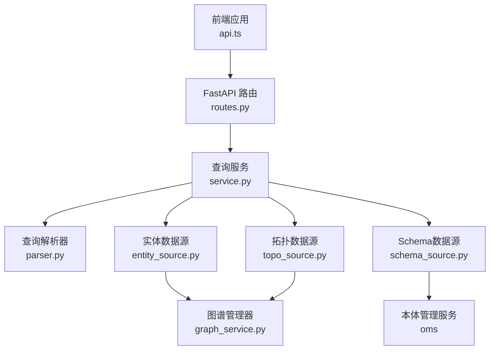
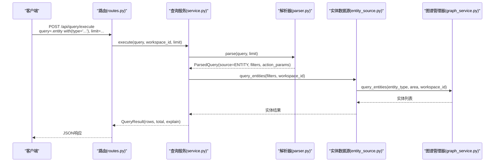
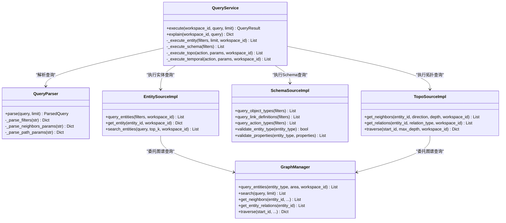
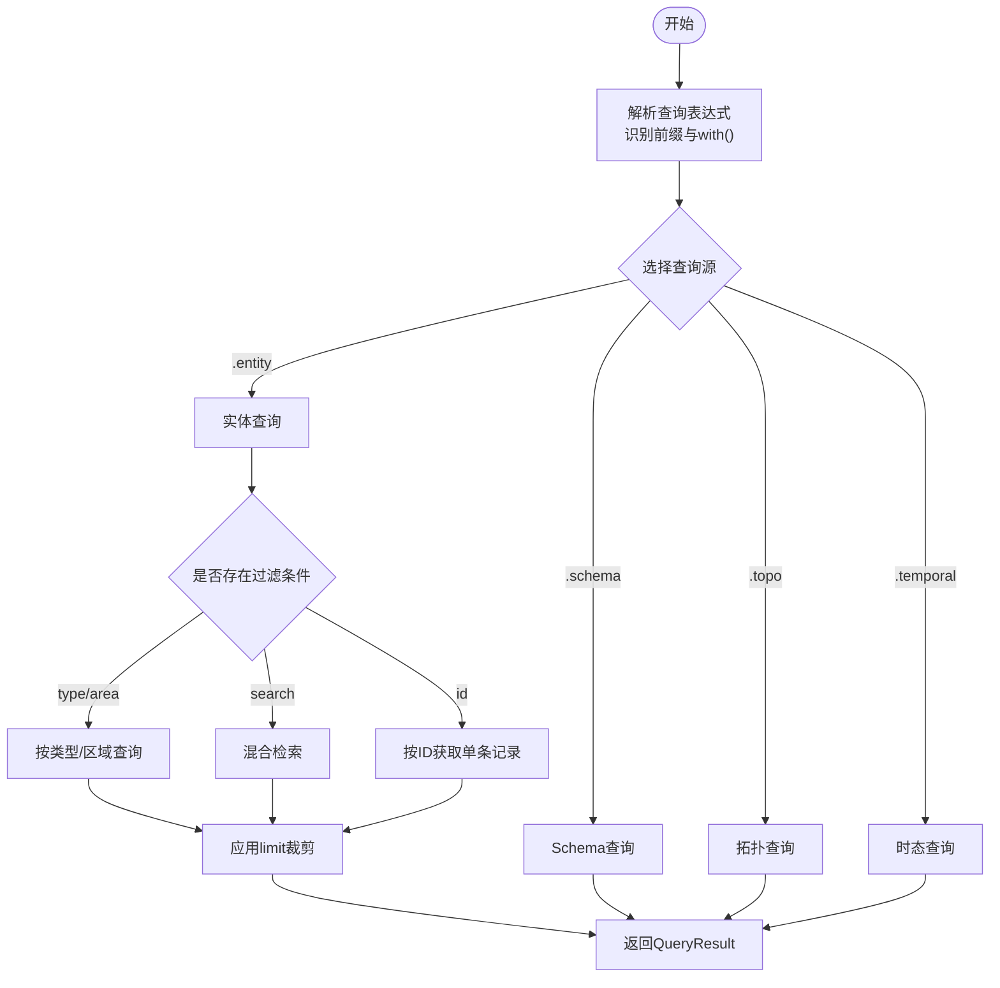

# Entity查询API

<cite>
**本文档引用的文件**
- [odap/infra/query/routes.py](file://odap/infra/query/routes.py)
- [odap/infra/query/service.py](file://odap/infra/query/service.py)
- [odap/infra/query/parser.py](file://odap/infra/query/parser.py)
- [odap/infra/query/protocols.py](file://odap/infra/query/protocols.py)
- [odap/infra/query/sources/entity_source.py](file://odap/infra/query/sources/entity_source.py)
- [odap/infra/query/sources/schema_source.py](file://odap/infra/query/sources/schema_source.py)
- [odap/infra/query/sources/topo_source.py](file://odap/infra/query/sources/topo_source.py)
- [odap/infra/graph/graph_service.py](file://odap/infra/graph/graph_service.py)
- [odap/infra/openharness/query_guard_hook.py](file://odap/infra/openharness/query_guard_hook.py)
- [frontend/src/modules/shared/services/api.ts](file://frontend/src/modules/shared/services/api.ts)
</cite>

## 目录
1. [简介](#简介)
2. [项目结构](#项目结构)
3. [核心组件](#核心组件)
4. [架构总览](#架构总览)
5. [详细组件分析](#详细组件分析)
6. [依赖关系分析](#依赖关系分析)
7. [性能考虑](#性能考虑)
8. [故障排除指南](#故障排除指南)
9. [结论](#结论)
10. [附录](#附录)

## 简介
本文件为Entity查询API的权威参考文档，面向数据分析师与业务用户，系统阐述运行时实体数据的查询能力，包括实体基本属性、类型信息、关联关系等。重点覆盖以下内容：
- .entity前缀的使用方法与语法规范
- with()条件表达式参数选项（type、search、id等）
- 查询示例：按类型查询、按名称搜索、按ID精确查询等
- 查询结果的数据结构与字段含义
- 在数据分析与实体发现中的应用场景

## 项目结构
Entity查询API位于后端基础设施层，采用“路由-服务-解析器-数据源”的分层架构，并通过图谱管理器(GraphManager)访问底层存储（Neo4j/回退模式）。前端通过HTTP接口调用查询服务。

**图表来源**
- [odap/infra/query/routes.py:11-101](file://odap/infra/query/routes.py#L11-L101)
- [odap/infra/query/service.py:11-126](file://odap/infra/query/service.py#L11-L126)
- [odap/infra/query/parser.py:23-113](file://odap/infra/query/parser.py#L23-L113)
- [odap/infra/query/sources/entity_source.py:4-34](file://odap/infra/query/sources/entity_source.py#L4-L34)
- [odap/infra/query/sources/schema_source.py:4-172](file://odap/infra/query/sources/schema_source.py#L4-L172)
- [odap/infra/query/sources/topo_source.py:4-28](file://odap/infra/query/sources/topo_source.py#L4-L28)
- [odap/infra/graph/graph_service.py:71-120](file://odap/infra/graph/graph_service.py#L71-L120)

**章节来源**
- [odap/infra/query/routes.py:11-101](file://odap/infra/query/routes.py#L11-L101)
- [odap/infra/query/service.py:11-126](file://odap/infra/query/service.py#L11-L126)

## 核心组件
- 路由层：提供统一的查询入口，支持解析查询表达式、限制返回数量、列举查询源等。
- 查询服务：负责解析、调度与执行，根据查询源选择对应数据源实现。
- 解析器：识别查询前缀(.entity/.schema/.topo/.temporal)，解析with()过滤条件与动作参数。
- 数据源层：
  - 实体数据源：支持按类型、区域、工作空间过滤，支持ID精确查询与全文搜索。
  - Schema数据源：查询本体类型定义（对象类型、链接定义、动作类型）。
  - 拓扑数据源：查询邻居、关系、子图遍历等。
- 图谱管理器：封装Neo4j/回退模式的实体查询、搜索、统计等能力。

**章节来源**
- [odap/infra/query/protocols.py:7-40](file://odap/infra/query/protocols.py#L7-L40)
- [odap/infra/query/sources/entity_source.py:14-34](file://odap/infra/query/sources/entity_source.py#L14-L34)
- [odap/infra/query/sources/schema_source.py:14-172](file://odap/infra/query/sources/schema_source.py#L14-L172)
- [odap/infra/query/sources/topo_source.py:14-28](file://odap/infra/query/sources/topo_source.py#L14-L28)
- [odap/infra/graph/graph_service.py:649-730](file://odap/infra/graph/graph_service.py#L649-L730)

## 架构总览
统一查询接口支持四种查询源，其中.Entity查询用于运行时实体数据检索。查询流程如下：

**图表来源**
- [odap/infra/query/routes.py:18-51](file://odap/infra/query/routes.py#L18-L51)
- [odap/infra/query/service.py:33-59](file://odap/infra/query/service.py#L33-L59)
- [odap/infra/query/parser.py:31-81](file://odap/infra/query/parser.py#L31-L81)
- [odap/infra/query/sources/entity_source.py:14-20](file://odap/infra/query/sources/entity_source.py#L14-L20)
- [odap/infra/graph/graph_service.py:649-730](file://odap/infra/graph/graph_service.py#L649-L730)

## 详细组件分析

### .entity前缀与语法规范
- 前缀识别：解析器通过前缀映射识别查询源，.entity对应实体查询。
- 过滤条件with()：解析器从with()括号内提取键值对，支持多个逗号分隔的条件。
- 语法要点：
  - 键值对格式：key=value，值可带引号；逗号前后允许空白。
  - 支持的关键字：type、entity_type、area、id、search等（具体以数据源实现为准）。
  - 动作参数：.topo/.temporal等查询源的动作参数通过独立解析函数处理。

**章节来源**
- [odap/infra/query/parser.py:24-92](file://odap/infra/query/parser.py#L24-L92)

### with()条件表达式参数详解
- type/entity_type：按实体类型过滤（若两者同时出现，实体数据源优先使用type）。
- area：按区域过滤。
- id：按实体ID精确查询，返回单条记录。
- search：全文搜索关键词，支持混合检索（在特定图模式下）。
- limit：查询结果数量限制（路由层参数），默认20，范围1-100。

注意：不同查询源支持的过滤条件不同。例如.schema支持kind/type/name/is_active等；.topo支持neighbors/path/relations的动作参数；.temporal支持at/history的动作参数。

**章节来源**
- [odap/infra/query/service.py:81-89](file://odap/infra/query/service.py#L81-L89)
- [odap/infra/query/sources/entity_source.py:14-20](file://odap/infra/query/sources/entity_source.py#L14-L20)
- [odap/infra/query/routes.py:18-32](file://odap/infra/query/routes.py#L18-L32)

### 查询示例与最佳实践
- 按类型查询实体
  - 表达式：`.entity with(type='MilitaryUnit')`
  - 说明：查询指定类型的实体，可结合workspace_id进行多租户过滤。
- 按名称搜索实体
  - 表达式：`.entity with(search='装甲部队')`
  - 说明：支持关键词检索，返回匹配度较高的实体列表。
- 按ID精确查询
  - 表达式：`.entity with(id='entity-mil-abc123')`
  - 说明：返回单条实体记录。
- 结合工作空间过滤
  - 表达式：`.entity with(type='Location', area='North')`
  - 说明：在多租户环境中限定工作空间ID，可配合area等字段使用。
- 复杂条件组合
  - 表达式：`.entity with(type='Unit', area='East', search='Tank')`
  - 说明：多条件组合时，解析器将键值对合并为filters字典交由数据源处理。

**章节来源**
- [odap/infra/query/routes.py:74-78](file://odap/infra/query/routes.py#L74-L78)
- [odap/infra/query/service.py:81-89](file://odap/infra/query/service.py#L81-L89)
- [odap/infra/query/sources/entity_source.py:14-20](file://odap/infra/query/sources/entity_source.py#L14-L20)

### 查询结果数据结构
- 响应模型：QueryResult包含source、rows、total、explain四个字段。
- rows：实体列表，每条记录通常包含id、type、properties等字段。
- total：满足条件的实体总数（未裁剪limit前）。
- explain：解析后的解释信息，包含source、filters、action等。
- 前端调用示例：queryEntities(query, workspaceId)返回包含entities与total的对象。

字段含义（以图谱管理器返回为例）：
- id：实体唯一标识符
- type：实体类型（标签）
- properties：实体属性字典（包含基础属性、统计属性、能力属性等）

**章节来源**
- [odap/infra/query/protocols.py:14-18](file://odap/infra/query/protocols.py#L14-L18)
- [odap/infra/graph/graph_service.py:698-705](file://odap/infra/graph/graph_service.py#L698-L705)
- [frontend/src/modules/shared/services/api.ts:769-774](file://frontend/src/modules/shared/services/api.ts#L769-L774)

### 在数据分析与实体发现中的应用
- 实体发现：通过search关键词快速定位相关实体，辅助业务人员探索未知领域。
- 类型筛选：按type/entity_type过滤，聚焦特定业务对象（如单位、设施、武器系统）。
- 关联分析：结合拓扑查询（.topo）获取邻居、关系与子图，支撑网络分析与影响链推演。
- 多租户隔离：通过workspace_id与area等字段实现数据隔离与分区查询。
- 时态洞察：结合.temporal查询历史版本或有效时间点快照，支持回溯分析。

**章节来源**
- [odap/infra/query/routes.py:84-98](file://odap/infra/query/routes.py#L84-L98)
- [odap/infra/query/service.py:91-125](file://odap/infra/query/service.py#L91-L125)

## 依赖关系分析

**图表来源**
- [odap/infra/query/service.py:11-126](file://odap/infra/query/service.py#L11-L126)
- [odap/infra/query/parser.py:23-113](file://odap/infra/query/parser.py#L23-L113)
- [odap/infra/query/sources/entity_source.py:4-34](file://odap/infra/query/sources/entity_source.py#L4-L34)
- [odap/infra/query/sources/schema_source.py:4-172](file://odap/infra/query/sources/schema_source.py#L4-L172)
- [odap/infra/query/sources/topo_source.py:4-28](file://odap/infra/query/sources/topo_source.py#L4-L28)
- [odap/infra/graph/graph_service.py:649-730](file://odap/infra/graph/graph_service.py#L649-L730)

**章节来源**
- [odap/infra/query/service.py:11-126](file://odap/infra/query/service.py#L11-L126)
- [odap/infra/query/parser.py:23-113](file://odap/infra/query/parser.py#L23-L113)

## 性能考虑
- 连接池与断路器：图谱管理器实现Neo4j连接池与断路器，避免频繁重连与雪崩效应。
- 模式降级：支持Graphiti、Neo4j Driver、NetworkX三种模式，自动降级保证可用性。
- 搜索优化：在支持的图模式下优先使用混合检索，回退模式采用关键词匹配。
- 结果限制：通过limit控制返回数量，默认20，避免大结果集带来的性能问题。
- 缓存命中：监控缓存命中率，合理设置缓存策略以提升重复查询性能。

**章节来源**
- [odap/infra/graph/graph_service.py:145-213](file://odap/infra/graph/graph_service.py#L145-L213)
- [odap/infra/graph/graph_service.py:406-443](file://odap/infra/graph/graph_service.py#L406-L443)

## 故障排除指南
- 查询异常：服务层捕获异常并返回解释信息，可通过/explain接口查看解析详情。
- 连接失败：图谱管理器具备重连与降级逻辑，若Neo4j不可用则自动切换回退模式。
- 参数错误：检查with()条件格式（键值对、引号、逗号分隔），确保关键字合法。
- 权限问题：OpenHarness工具注册表区分只读与写操作，写操作需经OPA策略校验。

**章节来源**
- [odap/infra/query/service.py:52-59](file://odap/infra/query/service.py#L52-L59)
- [odap/infra/openharness/query_guard_hook.py:40-82](file://odap/infra/openharness/query_guard_hook.py#L40-L82)

## 结论
Entity查询API提供了统一、灵活且高性能的运行时实体检索能力。通过.前缀与with()条件表达式，用户可以快速实现按类型、区域、关键词与ID的多维查询，并结合拓扑与时态查询进行深入分析。建议在生产环境中合理设置limit、利用工作空间隔离与多租户过滤，并关注图模式的可用性与性能指标。

## 附录

### API定义与示例
- 统一执行接口
  - 方法：POST
  - 路径：/api/query/execute
  - 参数：
    - query：查询表达式，如 .entity with(type='MilitaryUnit')
    - workspace_id：工作空间ID，默认"default"
    - limit：返回数量限制，默认20，范围1-100
  - 响应：QueryResult对象
- 解释接口
  - 方法：GET
  - 路径：/api/query/explain
  - 参数：同上
  - 响应：解析后的解释信息
- 查询源列表
  - 方法：GET
  - 路径：/api/query/sources
  - 响应：包含schema/entity/topo/temporal的示例与说明

**章节来源**
- [odap/infra/query/routes.py:18-101](file://odap/infra/query/routes.py#L18-L101)

### 查询流程算法

**图表来源**
- [odap/infra/query/service.py:33-59](file://odap/infra/query/service.py#L33-L59)
- [odap/infra/query/parser.py:31-81](file://odap/infra/query/parser.py#L31-L81)
- [odap/infra/query/sources/entity_source.py:14-34](file://odap/infra/query/sources/entity_source.py#L14-L34)