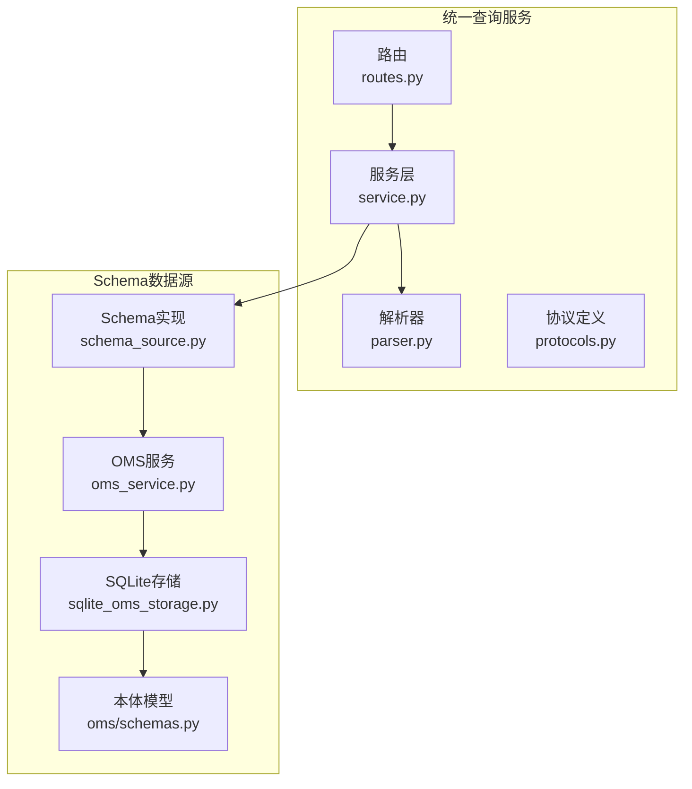
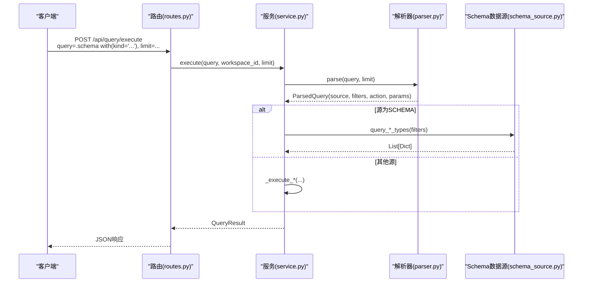
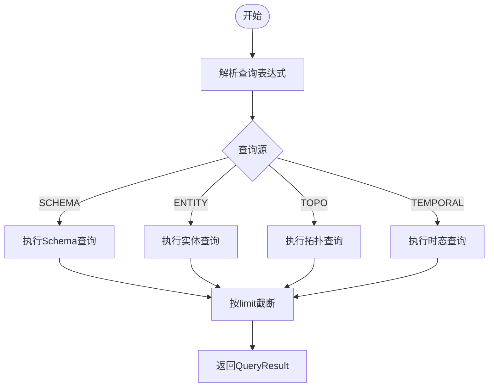
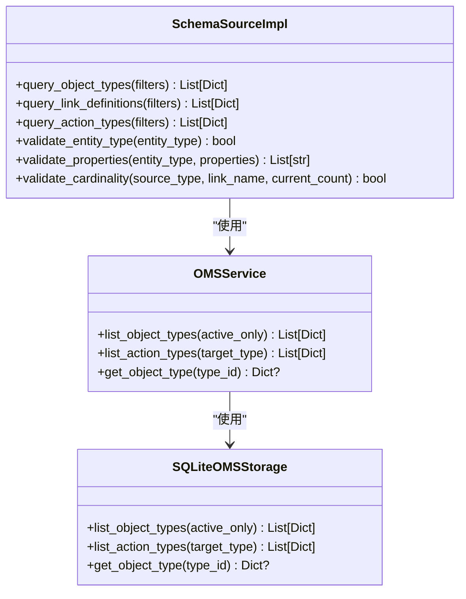
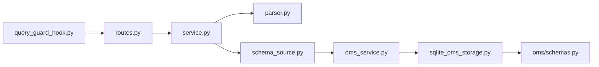

# Schema查询API

<cite>
**本文档引用的文件**
- [odap/infra/query/routes.py](file://odap/infra/query/routes.py)
- [odap/infra/query/service.py](file://odap/infra/query/service.py)
- [odap/infra/query/parser.py](file://odap/infra/query/parser.py)
- [odap/infra/query/protocols.py](file://odap/infra/query/protocols.py)
- [odap/infra/query/sources/schema_source.py](file://odap/infra/query/sources/schema_source.py)
- [odap/biz/core/ontology/oms/schemas.py](file://odap/biz/core/ontology/oms/schemas.py)
- [odap/biz/core/ontology/oms/storage/sqlite_oms_storage.py](file://odap/biz/core/ontology/oms/storage/sqlite_oms_storage.py)
- [odap/biz/core/ontology/oms/services/oms_service.py](file://odap/biz/core/ontology/oms/services/oms_service.py)
- [odap/infra/openharness/query_guard_hook.py](file://odap/infra/openharness/query_guard_hook.py)
</cite>

## 目录
1. [简介](#简介)
2. [项目结构](#项目结构)
3. [核心组件](#核心组件)
4. [架构总览](#架构总览)
5. [详细组件分析](#详细组件分析)
6. [依赖关系分析](#依赖关系分析)
7. [性能考虑](#性能考虑)
8. [故障排除指南](#故障排除指南)
9. [结论](#结论)
10. [附录：查询语法与示例](#附录查询语法与示例)

## 简介
本文件为Schema查询API的权威参考文档，面向本体设计师与系统管理员，系统性说明如何通过统一查询服务检索本体类型定义，包括实体类型、关系类型、动作类型等元数据信息。文档重点涵盖：
- .schema前缀的使用方法与语法规范
- with()条件表达式的参数选项（如type、kind等）
- 查询结果的数据结构与字段含义
- 在本体设计与验证中的应用场景
- 丰富的查询示例与最佳实践

## 项目结构
Schema查询API位于统一查询子系统中，采用“路由-服务-解析器-数据源”的分层架构，并通过OMS（Ontology Metadata Store）持久化存储本体元数据。

**图表来源**
- [odap/infra/query/routes.py:11-101](file://odap/infra/query/routes.py#L11-L101)
- [odap/infra/query/service.py:11-126](file://odap/infra/query/service.py#L11-L126)
- [odap/infra/query/parser.py:23-113](file://odap/infra/query/parser.py#L23-L113)
- [odap/infra/query/protocols.py:7-40](file://odap/infra/query/protocols.py#L7-L40)
- [odap/infra/query/sources/schema_source.py:4-172](file://odap/infra/query/sources/schema_source.py#L4-L172)
- [odap/biz/core/ontology/oms/services/oms_service.py:6-37](file://odap/biz/core/ontology/oms/services/oms_service.py#L6-L37)
- [odap/biz/core/ontology/oms/storage/sqlite_oms_storage.py:18-370](file://odap/biz/core/ontology/oms/storage/sqlite_oms_storage.py#L18-L370)
- [odap/biz/core/ontology/oms/schemas.py:7-136](file://odap/biz/core/ontology/oms/schemas.py#L7-L136)

**章节来源**
- [odap/infra/query/routes.py:11-101](file://odap/infra/query/routes.py#L11-L101)
- [odap/infra/query/service.py:11-126](file://odap/infra/query/service.py#L11-L126)
- [odap/infra/query/parser.py:23-113](file://odap/infra/query/parser.py#L23-L113)
- [odap/infra/query/protocols.py:7-40](file://odap/infra/query/protocols.py#L7-L40)
- [odap/infra/query/sources/schema_source.py:4-172](file://odap/infra/query/sources/schema_source.py#L4-L172)
- [odap/biz/core/ontology/oms/schemas.py:7-136](file://odap/biz/core/ontology/oms/schemas.py#L7-L136)
- [odap/biz/core/ontology/oms/storage/sqlite_oms_storage.py:18-370](file://odap/biz/core/ontology/oms/storage/sqlite_oms_storage.py#L18-L370)
- [odap/biz/core/ontology/oms/services/oms_service.py:6-37](file://odap/biz/core/ontology/oms/services/oms_service.py#L6-L37)

## 核心组件
- 路由层：提供统一查询入口与示例列举，支持GET列出查询源、POST执行查询、POST解释查询。
- 服务层：负责解析查询表达式、路由到对应数据源、聚合结果并返回标准化响应。
- 解析器：识别查询前缀（.schema/.entity/.topo/.temporal）、提取with()过滤条件与动作参数。
- 协议层：定义查询源枚举、结果模型与数据源协议接口。
- Schema数据源：封装OMS访问，提供对象类型、链接定义、动作类型查询与校验能力。
- OMS存储：基于SQLite的本体元数据持久化，包含对象类型与动作类型表。

**章节来源**
- [odap/infra/query/routes.py:18-101](file://odap/infra/query/routes.py#L18-L101)
- [odap/infra/query/service.py:11-126](file://odap/infra/query/service.py#L11-L126)
- [odap/infra/query/parser.py:23-113](file://odap/infra/query/parser.py#L23-L113)
- [odap/infra/query/protocols.py:7-40](file://odap/infra/query/protocols.py#L7-L40)
- [odap/infra/query/sources/schema_source.py:4-172](file://odap/infra/query/sources/schema_source.py#L4-L172)
- [odap/biz/core/ontology/oms/storage/sqlite_oms_storage.py:18-370](file://odap/biz/core/ontology/oms/storage/sqlite_oms_storage.py#L18-L370)

## 架构总览
统一查询服务通过FastAPI路由接收请求，调用QueryService进行解析与执行，根据查询源选择相应数据源实现类，最终返回标准化结果。

**图表来源**
- [odap/infra/query/routes.py:18-51](file://odap/infra/query/routes.py#L18-L51)
- [odap/infra/query/service.py:33-70](file://odap/infra/query/service.py#L33-L70)
- [odap/infra/query/parser.py:31-81](file://odap/infra/query/parser.py#L31-L81)
- [odap/infra/query/sources/schema_source.py:14-68](file://odap/infra/query/sources/schema_source.py#L14-L68)

## 详细组件分析

### 组件A：查询路由与示例
- 提供统一查询端点与解释端点，支持四种查询源的示例与说明。
- .schema查询示例包括kind过滤（object_types/link_definitions/action_types）。

**章节来源**
- [odap/infra/query/routes.py:18-101](file://odap/infra/query/routes.py#L18-L101)

### 组件B：查询服务与执行逻辑
- 解析阶段：调用解析器生成ParsedQuery。
- 执行阶段：按QuerySource分支，调用对应数据源实现。
- 结果阶段：截断至limit，封装QueryResult并返回explain信息。

**图表来源**
- [odap/infra/query/service.py:33-70](file://odap/infra/query/service.py#L33-L70)

**章节来源**
- [odap/infra/query/service.py:33-126](file://odap/infra/query/service.py#L33-L126)

### 组件C：查询解析器
- 识别前缀：.schema/.entity/.topo/.temporal映射到QuerySource。
- 提取with()过滤条件：键值对形式，自动去除引号。
- 提取动作参数：针对拓扑与时态查询的动作参数解析。

**章节来源**
- [odap/infra/query/parser.py:23-113](file://odap/infra/query/parser.py#L23-L113)

### 组件D：Schema数据源实现
- 对象类型查询：支持type_id/name/is_active过滤。
- 链接定义查询：支持source_type/target_type/name过滤。
- 动作类型查询：支持action_type_id/target_object_type/name过滤。
- 校验能力：实体类型存在性校验、属性类型校验、关系基数校验。

**图表来源**
- [odap/infra/query/sources/schema_source.py:4-172](file://odap/infra/query/sources/schema_source.py#L4-L172)
- [odap/biz/core/ontology/oms/services/oms_service.py:15-37](file://odap/biz/core/ontology/oms/services/oms_service.py#L15-L37)
- [odap/biz/core/ontology/oms/storage/sqlite_oms_storage.py:168-267](file://odap/biz/core/ontology/oms/storage/sqlite_oms_storage.py#L168-L267)

**章节来源**
- [odap/infra/query/sources/schema_source.py:14-172](file://odap/infra/query/sources/schema_source.py#L14-L172)
- [odap/biz/core/ontology/oms/services/oms_service.py:15-37](file://odap/biz/core/ontology/oms/services/oms_service.py#L15-L37)
- [odap/biz/core/ontology/oms/storage/sqlite_oms_storage.py:168-267](file://odap/biz/core/ontology/oms/storage/sqlite_oms_storage.py#L168-L267)

### 组件E：本体模型与存储
- ObjectTypeDefinition：实体类型定义，包含type_id/name/properties/links/actions等。
- LinkDefinition：关系定义，包含source_type/target_type/cardinality等。
- ActionTypeDefinition：动作类型定义，包含target_object_type/parameters等。
- SQLiteOMSStorage：对象类型与动作类型表的CRUD与序列化。

**章节来源**
- [odap/biz/core/ontology/oms/schemas.py:72-136](file://odap/biz/core/ontology/oms/schemas.py#L72-L136)
- [odap/biz/core/ontology/oms/storage/sqlite_oms_storage.py:32-167](file://odap/biz/core/ontology/oms/storage/sqlite_oms_storage.py#L32-L167)

## 依赖关系分析
- 路由依赖服务层；服务层依赖解析器与数据源协议；Schema数据源依赖OMS服务；OMS服务依赖SQLite存储；存储依赖本体模型。
- 查询安全：OpenHarness侧将query_schema列为只读工具，参数包含query与workspace_id。

**图表来源**
- [odap/infra/query/routes.py:14-15](file://odap/infra/query/routes.py#L14-L15)
- [odap/infra/query/service.py:27-31](file://odap/infra/query/service.py#L27-L31)
- [odap/infra/query/parser.py:4-5](file://odap/infra/query/parser.py#L4-L5)
- [odap/infra/query/sources/schema_source.py:8-12](file://odap/infra/query/sources/schema_source.py#L8-L12)
- [odap/biz/core/ontology/oms/services/oms_service.py:9-16](file://odap/biz/core/ontology/oms/services/oms_service.py#L9-L16)
- [odap/biz/core/ontology/oms/storage/sqlite_oms_storage.py:18-25](file://odap/biz/core/ontology/oms/storage/sqlite_oms_storage.py#L18-L25)
- [odap/biz/core/ontology/oms/schemas.py:7-136](file://odap/biz/core/ontology/oms/schemas.py#L7-L136)
- [odap/infra/openharness/query_guard_hook.py:95-103](file://odap/infra/openharness/query_guard_hook.py#L95-L103)

**章节来源**
- [odap/infra/openharness/query_guard_hook.py:95-103](file://odap/infra/openharness/query_guard_hook.py#L95-L103)

## 性能考虑
- 查询限制：默认limit=20，最大100，避免一次性返回过多数据。
- 过滤优化：Schema查询在内存中逐条匹配过滤条件，建议优先使用高选择性的过滤键（如type_id）。
- 数据源缓存：SchemaSourceImpl延迟初始化OMS服务实例，减少重复初始化开销。
- 存储索引：SQLite存储未见显式索引，建议在高频查询字段上评估建立索引以提升性能。

[本节为通用性能指导，无需具体文件分析]

## 故障排除指南
- 查询执行错误：服务层捕获异常并返回包含错误信息的解释结果，便于定位问题。
- 参数缺失：确保提供必要参数（如query），并遵循with()语法格式。
- 工作空间ID：默认"default"，若使用自定义工作空间，请在请求中指定workspace_id。

**章节来源**
- [odap/infra/query/service.py:52-59](file://odap/infra/query/service.py#L52-L59)
- [odap/infra/query/routes.py:19-38](file://odap/infra/query/routes.py#L19-L38)

## 结论
Schema查询API提供了统一、可扩展的本体元数据查询能力，结合with()过滤与kind参数，能够灵活检索实体类型、关系定义与动作类型。配合OMS存储与校验能力，可支撑本体设计、验证与运行时决策的多种场景。

[本节为总结性内容，无需具体文件分析]

## 附录：查询语法与示例

### .schema前缀与语法规范
- 基本语法：.schema with(...)，其中with()内为逗号分隔的键值对。
- 支持的kind过滤：
  - object_types（默认）：查询实体类型定义
  - link_definitions：查询关系定义
  - action_types：查询动作类型定义

**章节来源**
- [odap/infra/query/routes.py:28-31](file://odap/infra/query/routes.py#L28-L31)
- [odap/infra/query/service.py:72-79](file://odap/infra/query/service.py#L72-L79)

### with()条件表达式参数选项
- 通用过滤键（依据数据源实现）：
  - type_id：精确匹配类型标识
  - name：模糊匹配名称（大小写不敏感）
  - is_active：布尔激活状态
  - source_type/target_type：关系定义的源/目标类型
  - action_type_id/target_object_type：动作类型的标识与目标类型
- 示例（基于路由中的示例）：
  - .schema with(kind='object_types', type_id='Unit')
  - .schema with(kind='link_definitions', source_type='Unit', name='located_at')
  - .schema with(kind='action_types', target_object_type='Unit')

**章节来源**
- [odap/infra/query/sources/schema_source.py:14-68](file://odap/infra/query/sources/schema_source.py#L14-L68)
- [odap/infra/query/routes.py:64-67](file://odap/infra/query/routes.py#L64-L67)

### 查询结果数据结构
- QueryResult字段：
  - source：查询源（schema/entity/topo/temporal）
  - rows：查询结果数组
  - total：结果总数
  - explain：解析后的解释信息（包含source/filters/action等）

**章节来源**
- [odap/infra/query/protocols.py:14-18](file://odap/infra/query/protocols.py#L14-L18)
- [odap/infra/query/service.py:46-51](file://odap/infra/query/service.py#L46-L51)

### 应用场景
- 本体设计：查看实体类型、关系与动作的完整定义，辅助设计与评审。
- 本体验证：校验实体属性类型、关系基数，确保本体一致性。
- 运行时决策：根据动作类型与参数定义，驱动系统行为。

**章节来源**
- [odap/infra/query/sources/schema_source.py:84-150](file://odap/infra/query/sources/schema_source.py#L84-L150)

### OpenHarness集成
- 工具声明：query_schema被声明为只读工具，参数包含query与workspace_id。
- 使用建议：在OpenHarness环境中，通过该工具安全地执行Schema查询。

**章节来源**
- [odap/infra/openharness/query_guard_hook.py:95-103](file://odap/infra/openharness/query_guard_hook.py#L95-L103)