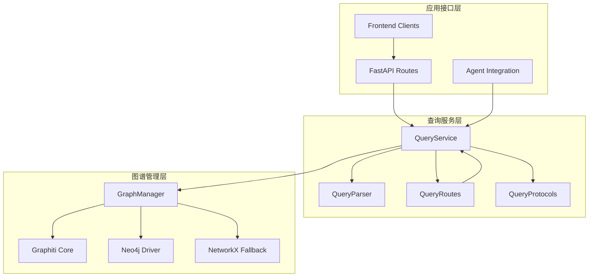
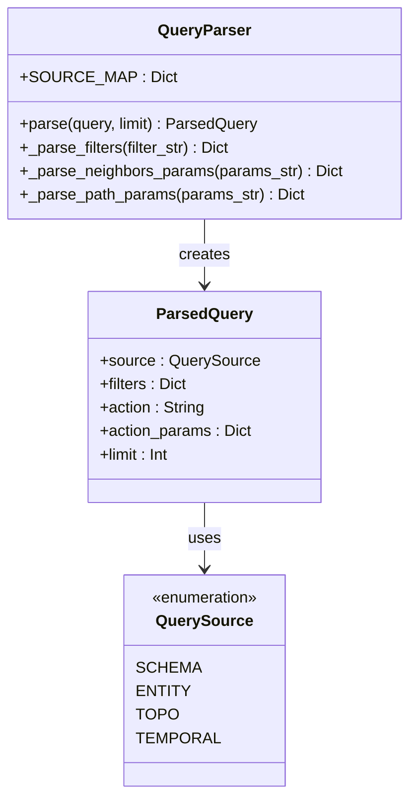
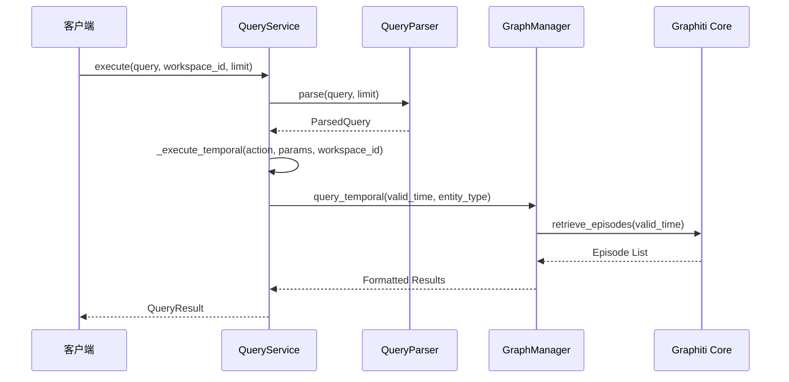
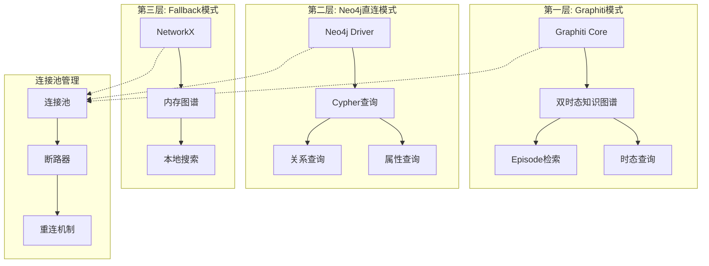
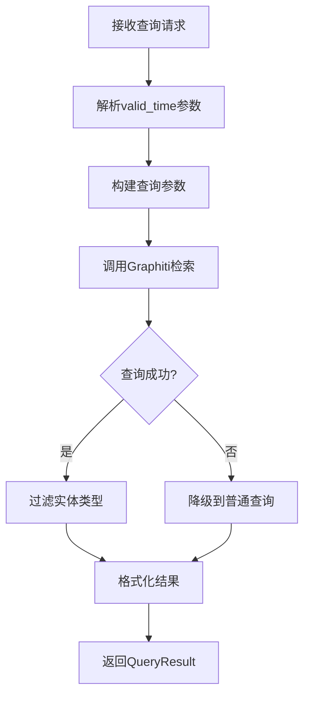
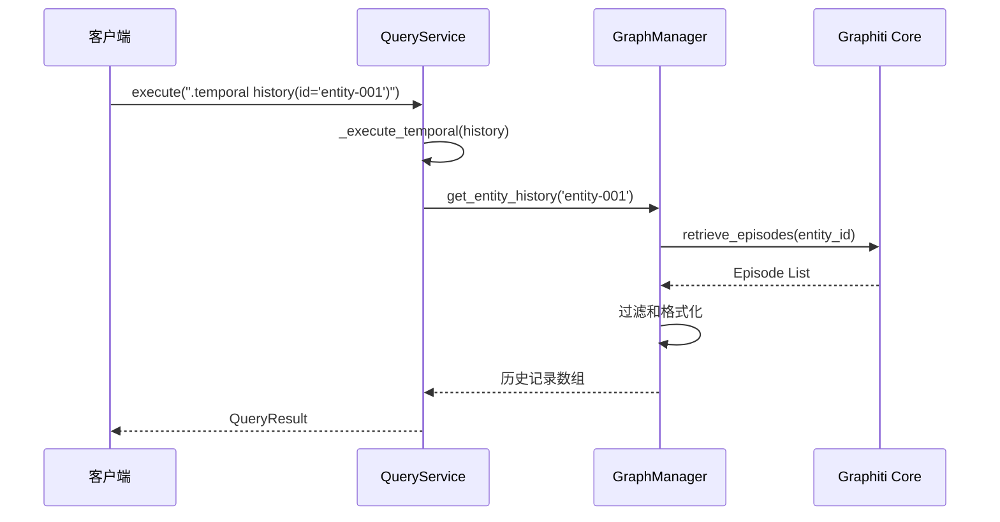
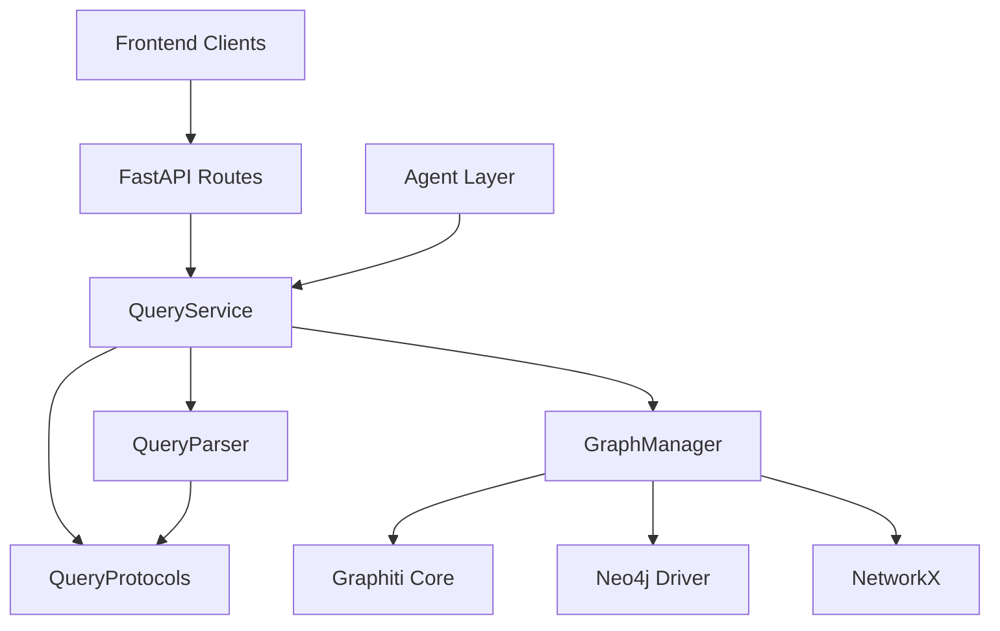

# Temporal查询API

<cite>
**本文档引用的文件**
- [odap/infra/query/parser.py](file://odap/infra/query/parser.py)
- [odap/infra/query/service.py](file://odap/infra/query/service.py)
- [odap/infra/query/routes.py](file://odap/infra/query/routes.py)
- [odap/infra/query/protocols.py](file://odap/infra/query/protocols.py)
- [odap/infra/graph/graph_service.py](file://odap/infra/graph/graph_service.py)
- [docs/02-architecture/ARCHITECTURE.md](file://docs/02-architecture/ARCHITECTURE.md)
- [docs/03-modules/qa_engine/DESIGN.md](file://docs/03-modules/qa_engine/DESIGN.md)
- [README.md](file://README.md)
</cite>

## 目录
1. [简介](#简介)
2. [项目结构](#项目结构)
3. [核心组件](#核心组件)
4. [架构概览](#架构概览)
5. [详细组件分析](#详细组件分析)
6. [依赖关系分析](#依赖关系分析)
7. [性能考虑](#性能考虑)
8. [故障排除指南](#故障排除指南)
9. [结论](#结论)
10. [附录](#附录)

## 简介

Temporal查询API是基于Graphiti时序知识图谱的双时态查询系统，专为数据溯源和历史分析场景设计。该API支持历史版本查询和双时态查询功能，为数据治理专家和合规分析师提供精确的时态数据访问能力。

### 主要特性

- **双时态查询**：支持有效时间(valid_time)和事务时间(transaction_time)双重维度
- **历史版本追踪**：完整的历史变更记录查询和时间线分析
- **数据溯源**：精确的历史状态还原和变更轨迹追踪
- **合规分析**：满足监管要求的数据可追溯性和审计需求
- **多模式降级**：三层连接策略确保系统稳定性

## 项目结构

Temporal查询API位于ODAP平台的基础设施层，采用模块化设计：



**图表来源**
- [odap/infra/query/service.py:11-126](file://odap/infra/query/service.py#L11-L126)
- [odap/infra/graph/graph_service.py:71-2255](file://odap/infra/graph/graph_service.py#L71-L2255)

**章节来源**
- [odap/infra/query/service.py:1-126](file://odap/infra/query/service.py#L1-L126)
- [odap/infra/query/routes.py:1-101](file://odap/infra/query/routes.py#L1-L101)

## 核心组件

### 查询解析器(QueryParser)

负责将自然语言查询转换为结构化查询参数，支持.temporal前缀的语法解析。



**图表来源**
- [odap/infra/query/parser.py:23-113](file://odap/infra/query/parser.py#L23-L113)
- [odap/infra/query/protocols.py:7-12](file://odap/infra/query/protocols.py#L7-L12)

### 查询服务(QueryService)

统一的查询入口，协调不同查询源的执行。



**图表来源**
- [odap/infra/query/service.py:33-126](file://odap/infra/query/service.py#L33-L126)
- [odap/infra/graph/graph_service.py:1405-1457](file://odap/infra/graph/graph_service.py#L1405-L1457)

**章节来源**
- [odap/infra/query/parser.py:1-113](file://odap/infra/query/parser.py#L1-L113)
- [odap/infra/query/service.py:11-126](file://odap/infra/query/service.py#L11-L126)

## 架构概览

Temporal查询API采用三层降级策略，确保系统的高可用性和稳定性：



**图表来源**
- [odap/infra/graph/graph_service.py:145-184](file://odap/infra/graph/graph_service.py#L145-L184)
- [odap/infra/graph/graph_service.py:299-443](file://odap/infra/graph/graph_service.py#L299-L443)

### .temporal前缀语法规范

Temporal查询使用统一的语法前缀和参数格式：

| 组件 | 语法格式 | 参数说明 | 示例 |
|------|----------|----------|------|
| 查询前缀 | `.temporal` | 时态查询标识符 | `.temporal` |
| at()函数 | `at('YYYY-MM-DD')` | 指定时间点查询 | `at('2025-01-01')` |
| history()函数 | `history(id='entity-id')` | 查询实体历史记录 | `history(id='unit-001')` |
| with()过滤器 | `with(key='value')` | 查询条件过滤 | `with(type='MilitaryUnit')` |

**章节来源**
- [odap/infra/query/parser.py:65-73](file://odap/infra/query/parser.py#L65-L73)
- [odap/infra/query/routes.py:90-98](file://odap/infra/query/routes.py#L90-L98)

## 详细组件分析

### at()函数详解

at()函数用于查询指定时间点的数据快照，支持单时间点和时间范围查询。

#### 语法结构
```
.temporal at('YYYY-MM-DD')
```

#### 参数选项
- **valid_time**：必填，ISO 8601格式的日期字符串
- **entity_type**：可选，实体类型过滤器

#### 查询流程



**图表来源**
- [odap/infra/query/service.py:121-124](file://odap/infra/query/service.py#L121-L124)
- [odap/infra/graph/graph_service.py:1423-1457](file://odap/infra/graph/graph_service.py#L1423-L1457)

### history()函数详解

history()函数用于查询实体的历史变更记录，提供完整的变更轨迹。

#### 语法结构
```
.temporal history(id='entity-id')
```

#### 参数选项
- **id**：必填，目标实体的唯一标识符

#### 查询流程



**图表来源**
- [odap/infra/query/service.py:118-120](file://odap/infra/query/service.py#L118-L120)
- [odap/infra/graph/graph_service.py:1390-1403](file://odap/infra/graph/graph_service.py#L1390-L1403)

### 双时态查询

双时态查询同时考虑有效时间和事务时间两个维度：

#### 有效时间(valid_time)
- 实体状态实际有效的时刻
- 支持范围查询：`valid_time >= start AND valid_time <= end`

#### 事务时间(transaction_time)
- 数据被记录到系统的时间
- 用于追踪数据的记录和变更历史

#### 查询参数

| 参数 | 类型 | 必填 | 说明 |
|------|------|------|------|
| valid_time | 字符串/字典 | 否 | 有效时间点或时间范围 |
| transaction_time | 字符串/字典 | 否 | 事务时间点或时间范围 |
| entity_type | 字符串 | 否 | 实体类型过滤器 |

**章节来源**
- [odap/infra/graph/graph_service.py:1405-1457](file://odap/infra/graph/graph_service.py#L1405-L1457)
- [docs/03-modules/qa_engine/DESIGN.md:555-612](file://docs/03-modules/qa_engine/DESIGN.md#L555-L612)

## 依赖关系分析

### 组件耦合度



**图表来源**
- [odap/infra/query/service.py:27-31](file://odap/infra/query/service.py#L27-L31)
- [odap/infra/graph/graph_service.py:105-111](file://odap/infra/graph/graph_service.py#L105-L111)

### 外部依赖

| 依赖项 | 版本要求 | 用途 | 可选性 |
|--------|----------|------|-------|
| graphiti-core | ≥ 1.0.0 | 双时态知识图谱 | 可选 |
| neo4j-driver | ≥ 4.0.0 | 直连查询 | 可选 |
| networkx | ≥ 2.8.0 | 回退模式 | 必需 |
| fastapi | ≥ 0.95.0 | Web框架 | 必需 |

**章节来源**
- [odap/infra/graph/graph_service.py:51-69](file://odap/infra/graph/graph_service.py#L51-L69)
- [odap/infra/query/service.py:19-31](file://odap/infra/query/service.py#L19-L31)

## 性能考虑

### 查询性能优化

1. **连接池管理**
   - 最大连接数：20个
   - 连接超时：30秒
   - 空闲超时：300秒

2. **断路器机制**
   - 失败阈值：5次
   - 恢复时间：60秒
   - 自动重试：最多3次

3. **缓存策略**
   - 查询时间统计：最近100次查询
   - 缓存命中率：实时监控
   - 结果集限制：默认20条，最大100条

### 性能监控指标

| 指标类别 | 监控项 | 阈值 | 说明 |
|----------|--------|------|------|
| 查询性能 | 平均查询时间 | < 500ms | P95标准 |
| 缓存效率 | 缓存命中率 | > 80% | 降低数据库压力 |
| 连接健康 | 连接池利用率 | < 80% | 避免过载 |
| 系统稳定性 | 断路器状态 | 关闭 | 正常运行 |

## 故障排除指南

### 常见错误及解决方案

#### 1. Graphiti连接失败
**症状**：时态查询返回普通查询结果
**原因**：graphiti-core未安装或Neo4j连接不可用
**解决方案**：
- 检查graphiti-core安装状态
- 验证Neo4j服务可用性
- 查看连接日志信息

#### 2. 查询超时
**症状**：查询响应时间过长
**原因**：数据库连接池耗尽或网络延迟
**解决方案**：
- 增加连接池大小
- 优化查询条件
- 检查网络连接质量

#### 3. 语法解析错误
**症状**：查询解析失败
**原因**：.temporal语法不正确
**解决方案**：
- 检查at()和history()函数语法
- 验证with()过滤器格式
- 确认日期格式符合ISO 8601标准

### 调试工具

1. **查询解释器**：使用/explain端点获取解析详情
2. **性能监控**：查看查询时间统计和缓存命中率
3. **连接状态**：监控连接池使用情况和断路器状态

**章节来源**
- [odap/infra/graph/graph_service.py:370-443](file://odap/infra/graph/graph_service.py#L370-L443)
- [odap/infra/query/routes.py:41-50](file://odap/infra/query/routes.py#L41-L50)

## 结论

Temporal查询API为ODAP平台提供了强大的时态数据查询能力，通过双时态查询和历史版本追踪功能，满足了数据治理和合规分析的严格要求。该系统采用模块化设计和三层降级策略，确保了高可用性和可维护性。

### 核心优势

1. **完整的时态支持**：双时态查询满足复杂的业务场景需求
2. **灵活的查询语法**：直观的.at()和.history()函数简化了查询操作
3. **高可用架构**：三层降级策略确保系统稳定性
4. **完善的监控**：实时性能监控和故障诊断能力
5. **合规友好**：完整的数据溯源和审计支持

## 附录

### API参考

#### 基础端点
- **执行查询**：`POST /api/query/execute`
- **查询解释**：`GET /api/query/explain`
- **查询源列表**：`GET /api/query/sources`

#### 查询示例

**指定时间点查询**
```
POST /api/query/execute
{
  "query": ".temporal at('2025-01-01')",
  "workspace_id": "default",
  "limit": 20
}
```

**实体历史查询**
```
POST /api/query/execute
{
  "query": ".temporal history(id='unit-001')",
  "workspace_id": "default",
  "limit": 50
}
```

**带过滤条件的查询**
```
POST /api/query/execute
{
  "query": ".temporal at('2025-01-01') with(type='MilitaryUnit')",
  "workspace_id": "default",
  "limit": 20
}
```

### 数据结构说明

#### 查询结果结构
```json
{
  "source": "temporal",
  "rows": [
    {
      "id": "entity-id",
      "type": "Entity",
      "properties": {
        "body": "实体内容"
      },
      "valid_time": "2025-01-01T00:00:00Z",
      "transaction_time": "2025-01-01T00:00:00Z"
    }
  ],
  "total": 1,
  "explain": {
    "source": "temporal",
    "filters": {},
    "action": "at"
  }
}
```

#### 时间戳字段含义
- **valid_time**：实体状态实际有效的时刻
- **transaction_time**：数据被记录到系统的时间
- **created_at**：Episode创建时间戳

**章节来源**
- [odap/infra/query/routes.py:18-50](file://odap/infra/query/routes.py#L18-L50)
- [odap/infra/query/protocols.py:14-19](file://odap/infra/query/protocols.py#L14-L19)
- [odap/infra/graph/graph_service.py:1444-1450](file://odap/infra/graph/graph_service.py#L1444-L1450)