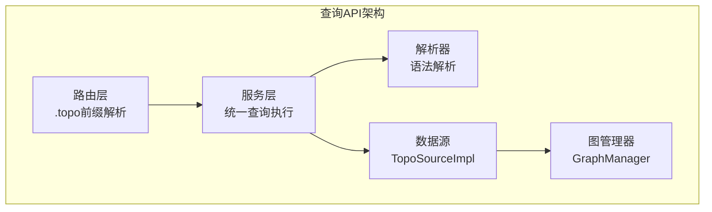
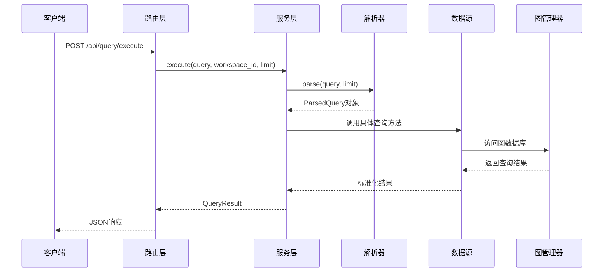
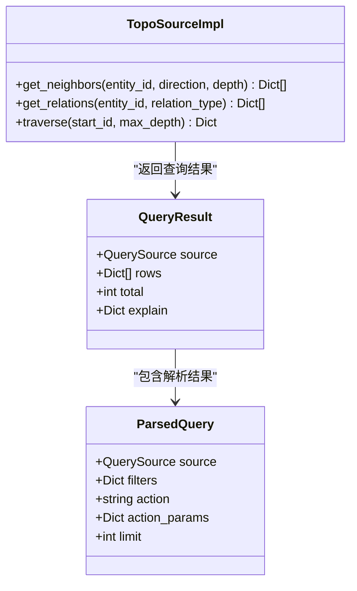
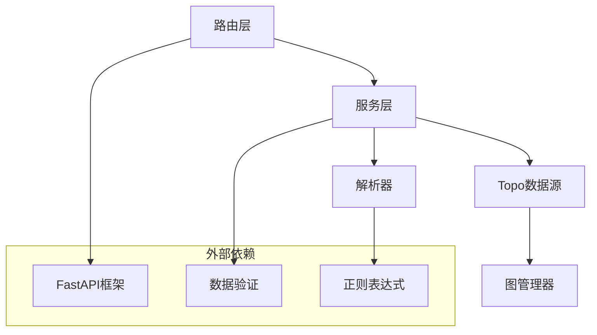

# Topo查询API

<cite>
**本文档引用的文件**
- [odap/infra/query/routes.py](file://odap/infra/query/routes.py)
- [odap/infra/query/service.py](file://odap/infra/query/service.py)
- [odap/infra/query/parser.py](file://odap/infra/query/parser.py)
- [odap/infra/query/protocols.py](file://odap/infra/query/protocols.py)
- [odap/infra/query/sources/topo_source.py](file://odap/infra/query/sources/topo_source.py)
- [odap/biz/core/cognition/user_cognition_engine.py](file://odap/biz/core/cognition/user_cognition_engine.py)
</cite>

## 目录
1. [简介](#简介)
2. [项目结构](#项目结构)
3. [核心组件](#核心组件)
4. [架构概览](#架构概览)
5. [详细组件分析](#详细组件分析)
6. [依赖分析](#依赖分析)
7. [性能考虑](#性能考虑)
8. [故障排除指南](#故障排除指南)
9. [结论](#结论)
10. [附录](#附录)

## 简介
Topo查询API用于查询拓扑关系并进行图遍历，支持邻居查询、关系查询、路径查询等功能。该API通过统一查询服务对外提供能力，支持以".topo"前缀的查询表达式，能够高效地探索实体之间的连接关系，适用于网络分析、关系探索、知识发现等场景。

## 项目结构
Topo查询API位于查询模块的基础设施层，主要包含以下关键组件：



**图表来源**
- [odap/infra/query/routes.py:1-101](file://odap/infra/query/routes.py#L1-L101)
- [odap/infra/query/service.py:1-126](file://odap/infra/query/service.py#L1-L126)
- [odap/infra/query/parser.py:1-113](file://odap/infra/query/parser.py#L1-L113)
- [odap/infra/query/sources/topo_source.py:1-28](file://odap/infra/query/sources/topo_source.py#L1-L28)

**章节来源**
- [odap/infra/query/routes.py:1-101](file://odap/infra/query/routes.py#L1-L101)
- [odap/infra/query/service.py:1-126](file://odap/infra/query/service.py#L1-L126)
- [odap/infra/query/parser.py:1-113](file://odap/infra/query/parser.py#L1-L113)
- [odap/infra/query/sources/topo_source.py:1-28](file://odap/infra/query/sources/topo_source.py#L1-L28)

## 核心组件
Topo查询API由四个核心组件构成，每个组件都有明确的职责分工：

### 1. 路由层 (Routes)
提供RESTful API接口，支持POST请求执行查询，包含查询解释和源列表功能。

### 2. 服务层 (QueryService)
统一的查询执行引擎，负责解析查询表达式、调用相应的数据源实现，并返回标准化的结果。

### 3. 解析器 (QueryParser)
负责将自然语言风格的查询表达式转换为结构化的查询对象，支持多种查询源和参数解析。

### 4. 数据源实现 (TopoSourceImpl)
具体的拓扑查询实现，封装对GraphManager的调用，提供邻居查询、关系查询和图遍历功能。

**章节来源**
- [odap/infra/query/routes.py:18-51](file://odap/infra/query/routes.py#L18-L51)
- [odap/infra/query/service.py:11-71](file://odap/infra/query/service.py#L11-L71)
- [odap/infra/query/parser.py:23-81](file://odap/infra/query/parser.py#L23-L81)
- [odap/infra/query/sources/topo_source.py:4-28](file://odap/infra/query/sources/topo_source.py#L4-L28)

## 架构概览
Topo查询API采用分层架构设计，确保了良好的可扩展性和维护性：



**图表来源**
- [odap/infra/query/routes.py:18-39](file://odap/infra/query/routes.py#L18-L39)
- [odap/infra/query/service.py:33-59](file://odap/infra/query/service.py#L33-L59)
- [odap/infra/query/parser.py:31-81](file://odap/infra/query/parser.py#L31-L81)
- [odap/infra/query/sources/topo_source.py:8-12](file://odap/infra/query/sources/topo_source.py#L8-L12)

## 详细组件分析

### 查询语法规范
Topo查询支持以".topo"为前缀的查询表达式，语法规范如下：

#### 基本语法结构
```
.topo 函数名(参数列表) with(过滤条件)
```

#### 支持的查询函数
1. **neighbors()** - 邻居查询
2. **relations()** - 关系查询  
3. **path()** - 路径查询

#### 参数规范
- 所有参数使用键值对形式：`key=value`
- 多个参数使用逗号分隔
- 字符串值需要使用引号包围
- 数值参数自动转换为整数类型

**章节来源**
- [odap/infra/query/parser.py:23-81](file://odap/infra/query/parser.py#L23-L81)
- [odap/infra/query/parser.py:94-113](file://odap/infra/query/parser.py#L94-L113)

### neighbors() 邻居查询
用于查询指定实体的邻居节点，支持方向控制和深度限制。

#### 参数选项
| 参数名 | 类型 | 默认值 | 必填 | 描述 |
|--------|------|--------|------|------|
| id | string | - | 是 | 目标实体的唯一标识符 |
| direction | string | "both" | 否 | 边的方向控制，可选值：inbound/outbound/both |
| depth | int | 1 | 否 | 查询深度，控制遍历的层级范围 |

#### 使用场景
- 查找实体的直接关联实体
- 探索实体在网络中的位置关系
- 分析实体的影响力范围

#### 查询示例
```
.topo neighbors(id='entity-mil-abc123', depth=2)
.topo neighbors(id='unit-001', direction='outbound', depth=3)
```

**章节来源**
- [odap/infra/query/service.py:91-97](file://odap/infra/query/service.py#L91-L97)
- [odap/infra/query/sources/topo_source.py:14-16](file://odap/infra/query/sources/topo_source.py#L14-L16)

### relations() 关系查询
用于查询实体的所有关系，支持按关系类型过滤。

#### 参数选项
| 参数名 | 类型 | 默认值 | 必填 | 描述 |
|--------|------|--------|------|------|
| id | string | - | 是 | 目标实体的唯一标识符 |
| type | string | - | 否 | 关系类型过滤器，为空则返回所有关系 |

#### 使用场景
- 查看实体的完整关系网络
- 分析特定类型的关系分布
- 关系分类统计和分析

#### 查询示例
```
.topo relations(id='entity-mil-abc123')
.topo relations(id='person-001', type='located_at')
```

**章节来源**
- [odap/infra/query/service.py:106-109](file://odap/infra/query/service.py#L106-L109)
- [odap/infra/query/sources/topo_source.py:18-23](file://odap/infra/query/sources/topo_source.py#L18-L23)

### path() 路径查询
用于查找两个实体之间的可达性，基于图遍历实现。

#### 参数选项
| 参数名 | 类型 | 默认值 | 必填 | 描述 |
|--------|------|--------|------|------|
| from | string | - | 是 | 起始实体标识符 |
| to | string | - | 是 | 目标实体标识符 |
| max_hops | int | 5 | 否 | 最大跳数限制，等价于max_depth |

#### 使用场景
- 查找实体间的最短路径
- 分析实体间的可达性
- 网络连通性分析

#### 查询示例
```
.topo path(from='id1', to='id2', max_hops=5)
```

**注意**：当前实现基于图遍历检查可达性，实际最短路径计算可能需要进一步优化。

**章节来源**
- [odap/infra/query/service.py:97-105](file://odap/infra/query/service.py#L97-L105)
- [odap/infra/query/parser.py:108-113](file://odap/infra/query/parser.py#L108-L113)
- [odap/infra/query/sources/topo_source.py:25-27](file://odap/infra/query/sources/topo_source.py#L25-L27)

### 查询结果数据结构
Topo查询返回的标准结果格式如下：



**图表来源**
- [odap/infra/query/protocols.py:14-19](file://odap/infra/query/protocols.py#L14-L19)
- [odap/infra/query/parser.py:7-21](file://odap/infra/query/parser.py#L7-L21)
- [odap/infra/query/sources/topo_source.py:4-28](file://odap/infra/query/sources/topo_source.py#L4-L28)

**章节来源**
- [odap/infra/query/protocols.py:14-19](file://odap/infra/query/protocols.py#L14-L19)
- [odap/infra/query/parser.py:7-21](file://odap/infra/query/parser.py#L7-L21)

## 依赖分析
Topo查询API的依赖关系清晰，遵循单一职责原则：



**图表来源**
- [odap/infra/query/routes.py:4-7](file://odap/infra/query/routes.py#L4-L7)
- [odap/infra/query/service.py:4-6](file://odap/infra/query/service.py#L4-L6)
- [odap/infra/query/parser.py:1-2](file://odap/infra/query/parser.py#L1-L2)
- [odap/infra/query/sources/topo_source.py:10](file://odap/infra/query/sources/topo_source.py#L10)

**章节来源**
- [odap/infra/query/routes.py:1-101](file://odap/infra/query/routes.py#L1-L101)
- [odap/infra/query/service.py:1-126](file://odap/infra/query/service.py#L1-L126)
- [odap/infra/query/parser.py:1-113](file://odap/infra/query/parser.py#L1-L113)
- [odap/infra/query/sources/topo_source.py:1-28](file://odap/infra/query/sources/topo_source.py#L1-L28)

## 性能考虑
Topo查询API在设计时充分考虑了性能优化：

### 1. 查询限制
- 默认返回20条记录，可通过limit参数调整
- 支持最大100条记录限制，防止资源滥用

### 2. 图遍历优化
- depth/max_depth参数控制遍历范围
- 路径查询使用可达性检查而非完整最短路径计算

### 3. 缓存策略
- GraphManager内部实现缓存机制
- 重复查询相同实体时利用缓存提高性能

### 4. 错误处理
- 统一的异常捕获和错误日志记录
- 查询失败时返回空结果而非抛出异常

**章节来源**
- [odap/infra/query/routes.py:20-23](file://odap/infra/query/routes.py#L20-L23)
- [odap/infra/query/service.py:52-59](file://odap/infra/query/service.py#L52-L59)

## 故障排除指南

### 常见问题及解决方案

#### 1. 查询语法错误
**问题**：查询表达式格式不正确
**解决方案**：
- 确保使用正确的".topo"前缀
- 检查括号匹配和引号使用
- 验证参数键值对格式

#### 2. 实体ID不存在
**问题**：指定的实体ID在图中不存在
**解决方案**：
- 使用实体查询确认实体存在性
- 检查实体ID的拼写和格式

#### 3. 性能问题
**问题**：查询响应时间过长
**解决方案**：
- 减少depth/max_depth参数值
- 添加适当的过滤条件
- 检查图的规模和复杂度

#### 4. API调用失败
**问题**：HTTP 500错误
**解决方案**：
- 查看服务器日志获取详细错误信息
- 验证查询参数的有效性
- 检查图数据库连接状态

**章节来源**
- [odap/infra/query/routes.py:34-39](file://odap/infra/query/routes.py#L34-L39)
- [odap/infra/query/service.py:52-59](file://odap/infra/query/service.py#L52-L59)

## 结论
Topo查询API提供了强大而灵活的图查询能力，通过简洁的语法和标准化的接口，使得开发者能够轻松地进行拓扑关系查询和图遍历。其分层架构设计确保了良好的可扩展性和维护性，适用于各种复杂的图数据分析场景。

## 附录

### API使用示例

#### 基础查询示例
```http
POST /api/query/execute
Content-Type: application/x-www-form-urlencoded

query=.topo neighbors(id='entity-mil-abc123', depth=2)&workspace_id=default&limit=20
```

#### 高级查询示例
```http
POST /api/query/explain
Content-Type: application/x-www-form-urlencoded

query=.topo relations(id='person-001', type='located_at')
```

### 应用场景
- **网络分析**：分析社交网络、组织架构等复杂网络结构
- **关系探索**：发现实体间隐藏的关联关系
- **知识图谱**：构建和查询语义知识网络
- **推荐系统**：基于图的协同过滤和内容推荐
- **风险评估**：分析金融交易网络中的风险传播路径

### 最佳实践
1. 合理设置查询深度，避免过度遍历
2. 使用适当的过滤条件提高查询效率
3. 缓存频繁查询的结果
4. 监控查询性能和资源使用情况
5. 在生产环境中启用适当的访问控制