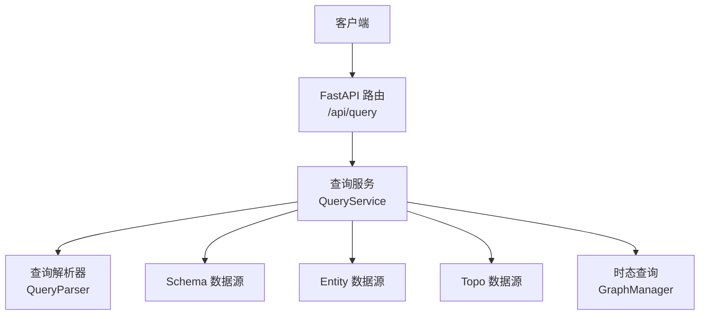
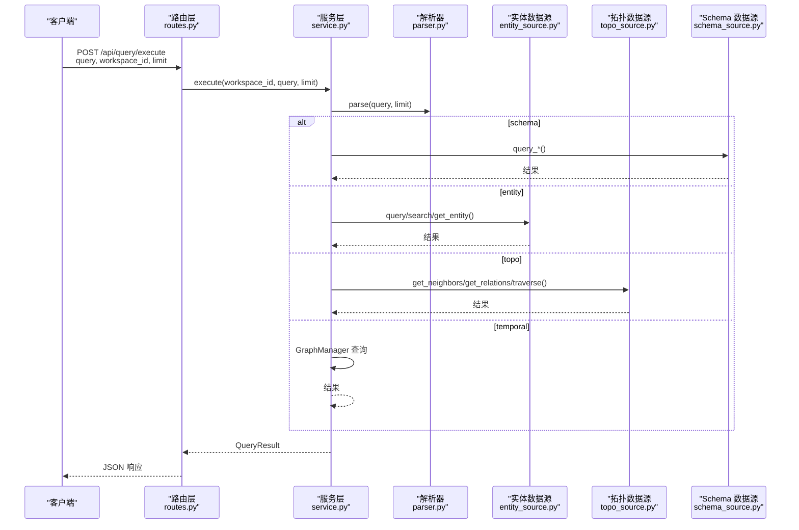
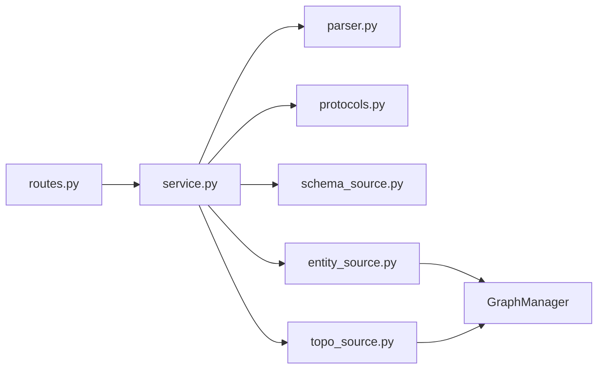

# 查询执行API

<cite>
**本文档引用的文件**
- [odap/infra/query/routes.py](file://odap/infra/query/routes.py)
- [odap/infra/query/service.py](file://odap/infra/query/service.py)
- [odap/infra/query/parser.py](file://odap/infra/query/parser.py)
- [odap/infra/query/protocols.py](file://odap/infra/query/protocols.py)
- [odap/infra/query/sources/schema_source.py](file://odap/infra/query/sources/schema_source.py)
- [odap/infra/query/sources/entity_source.py](file://odap/infra/query/sources/entity_source.py)
- [odap/infra/query/sources/topo_source.py](file://odap/infra/query/sources/topo_source.py)
- [odap/infra/resilience/fault_tolerance.py](file://odap/infra/resilience/fault_tolerance.py)
- [odap/infra/monitoring/performance_monitor.py](file://odap/infra/monitoring/performance_monitor.py)
</cite>

## 目录
1. [简介](#简介)
2. [项目结构](#项目结构)
3. [核心组件](#核心组件)
4. [架构总览](#架构总览)
5. [详细组件分析](#详细组件分析)
6. [依赖关系分析](#依赖关系分析)
7. [性能考虑](#性能考虑)
8. [故障排查指南](#故障排查指南)
9. [结论](#结论)
10. [附录](#附录)

## 简介
本文件为统一查询执行API的权威参考文档，覆盖以下内容：
- execute端点：接收查询表达式、工作空间标识与数量限制，执行查询并返回结构化结果
- explain端点：解析查询表达式但不执行，返回解析后的结构化信息
- 参数定义与约束：query、workspace_id、limit等
- 错误处理机制与异常情况说明
- 查询性能优化建议与最佳实践
- 查询缓存策略与重用机制
- 面向开发者与系统集成人员的完整接口参考

## 项目结构
查询执行API位于基础设施层的查询子系统，采用“路由-服务-解析器-数据源”的分层架构，支持四种查询源：
- .schema：本体类型定义查询
- .entity：运行时实体查询
- .topo：拓扑关系与图遍历
- .temporal：时态数据查询

**图表来源**
- [odap/infra/query/routes.py:11-50](file://odap/infra/query/routes.py#L11-L50)
- [odap/infra/query/service.py:33-126](file://odap/infra/query/service.py#L33-L126)
- [odap/infra/query/parser.py:31-81](file://odap/infra/query/parser.py#L31-L81)
- [odap/infra/query/sources/schema_source.py:4-12](file://odap/infra/query/sources/schema_source.py#L4-L12)
- [odap/infra/query/sources/entity_source.py:4-33](file://odap/infra/query/sources/entity_source.py#L4-L33)
- [odap/infra/query/sources/topo_source.py:4-27](file://odap/infra/query/sources/topo_source.py#L4-L27)

**章节来源**
- [odap/infra/query/routes.py:11-101](file://odap/infra/query/routes.py#L11-L101)
- [odap/infra/query/service.py:11-126](file://odap/infra/query/service.py#L11-L126)

## 核心组件
- 路由层：定义execute与explain两个端点，负责参数校验、异常转换与响应模型
- 服务层：QueryService封装执行逻辑，按查询源分派到不同数据源，并提供explain解析
- 解析层：QueryParser将自然语言风格的查询表达式解析为结构化对象
- 数据源层：SchemaSourceImpl、EntitySourceImpl、TopoSourceImpl分别对接本体、实体、拓扑与图管理器
- 协议层：QueryResult、QuerySource等类型定义统一的数据契约

**章节来源**
- [odap/infra/query/routes.py:18-50](file://odap/infra/query/routes.py#L18-L50)
- [odap/infra/query/service.py:11-70](file://odap/infra/query/service.py#L11-L70)
- [odap/infra/query/parser.py:23-81](file://odap/infra/query/parser.py#L23-L81)
- [odap/infra/query/protocols.py:7-39](file://odap/infra/query/protocols.py#L7-L39)

## 架构总览
统一查询执行API的端到端调用序列如下：

**图表来源**
- [odap/infra/query/routes.py:18-38](file://odap/infra/query/routes.py#L18-L38)
- [odap/infra/query/service.py:33-126](file://odap/infra/query/service.py#L33-L126)
- [odap/infra/query/parser.py:31-81](file://odap/infra/query/parser.py#L31-L81)
- [odap/infra/query/sources/entity_source.py:14-33](file://odap/infra/query/sources/entity_source.py#L14-L33)
- [odap/infra/query/sources/topo_source.py:14-27](file://odap/infra/query/sources/topo_source.py#L14-L27)
- [odap/infra/query/sources/schema_source.py:14-68](file://odap/infra/query/sources/schema_source.py#L14-L68)

## 详细组件分析

### execute 端点
- 功能：执行统一查询表达式，支持四种查询源
- 请求参数
  - query: 字符串，必填；查询表达式，如 .entity with(type='...')、.topo neighbors(...) 等
  - workspace_id: 字符串，可选，默认"default"
  - limit: 整数，可选，默认20，范围[1,100]
- 响应模型：QueryResult
  - source: 查询源枚举（schema/entity/topo/temporal）
  - rows: 查询结果列表
  - total: 原始结果总数
  - explain: 解析后的解释信息（包含source、filters、action等）
- 错误处理：内部异常会被捕获并返回空结果集，同时在explain中携带错误信息；路由层将未捕获异常转换为HTTP 500

**章节来源**
- [odap/infra/query/routes.py:18-38](file://odap/infra/query/routes.py#L18-L38)
- [odap/infra/query/service.py:33-59](file://odap/infra/query/service.py#L33-L59)
- [odap/infra/query/protocols.py:14-18](file://odap/infra/query/protocols.py#L14-L18)

### explain 端点
- 功能：解析查询表达式但不执行，返回解析后的结构
- 请求参数
  - query: 字符串，必填
  - workspace_id: 字符串，可选，默认"default"
- 返回结构
  - source: 查询源字符串
  - filters: 过滤条件字典
  - action: 动作名（如neighbors/path/relations/at/history）
  - action_params: 动作参数字典
  - limit: 解析得到的数量限制
  - workspace_id: 传入的工作空间标识

**章节来源**
- [odap/infra/query/routes.py:41-50](file://odap/infra/query/routes.py#L41-L50)
- [odap/infra/query/service.py:61-70](file://odap/infra/query/service.py#L61-L70)

### 查询解析器（QueryParser）
- 职责：将自然语言风格的查询表达式解析为ParsedQuery对象
- 支持语法要点
  - 源前缀识别：.schema/.entity/.topo/.temporal
  - with(...) 过滤条件解析
  - topo动作解析：neighbors(path)/path(from,to,max_hops)/relations(...)
  - temporal动作解析：at('YYYY-MM-DD')/history(id=...)
- 限制与容错：对参数进行基本类型推断（数字/字符串），过滤非法或缺失部分

**章节来源**
- [odap/infra/query/parser.py:23-113](file://odap/infra/query/parser.py#L23-L113)

### 数据源层
- Schema 数据源
  - 提供对象类型、链接定义、动作类型的查询与校验
  - 支持属性类型校验、基数校验等
- Entity 数据源
  - 支持按类型/区域查询、按ID获取、全文搜索
  - 搜索支持混合检索（优先图数据库驱动）
- Topo 数据源
  - 支持邻居查询、关系查询、路径遍历、子图遍历

**章节来源**
- [odap/infra/query/sources/schema_source.py:4-172](file://odap/infra/query/sources/schema_source.py#L4-L172)
- [odap/infra/query/sources/entity_source.py:4-33](file://odap/infra/query/sources/entity_source.py#L4-L33)
- [odap/infra/query/sources/topo_source.py:4-27](file://odap/infra/query/sources/topo_source.py#L4-L27)

### 查询服务（QueryService）
- 单例模式：确保全局唯一实例
- 执行流程
  - 解析查询表达式
  - 根据source分派到对应执行函数
  - 截取limit条结果，返回QueryResult
- explain流程
  - 仅解析并返回解析信息

**章节来源**
- [odap/infra/query/service.py:11-70](file://odap/infra/query/service.py#L11-L70)

## 依赖关系分析
- 路由依赖服务层；服务层依赖解析器与数据源层
- 数据源层最终依赖图管理器（GraphManager）与本体管理服务（OMS）
- 协议层提供类型与枚举定义，保证跨模块一致性

**图表来源**
- [odap/infra/query/routes.py:6-7](file://odap/infra/query/routes.py#L6-L7)
- [odap/infra/query/service.py:4-6](file://odap/infra/query/service.py#L4-L6)
- [odap/infra/query/sources/entity_source.py:8-12](file://odap/infra/query/sources/entity_source.py#L8-L12)
- [odap/infra/query/sources/topo_source.py:8-12](file://odap/infra/query/sources/topo_source.py#L8-L12)

**章节来源**
- [odap/infra/query/service.py:19-31](file://odap/infra/query/service.py#L19-L31)

## 性能考虑
- 查询复杂度评估与自适应策略
  - 可根据实体数量、关系密度、语义跨度等启发式指标评估查询复杂度，自动选择轻量/标准/深度检索策略
- 图数据库优化
  - 索引优化：节点type/name索引，边source/target复合索引
  - 连接池预热：减少首次连接开销
  - 批量查询：避免N+1查询，提升检索吞吐
- 缓存策略
  - 三层缓存：内存→Redis→磁盘，热点查询延迟<50ms
  - 查询理解缓存：相似问题命中缓存，跳过LLM调用
- 并发与超时
  - FastAPI异步+uvicorn多进程，合理设置workers与连接上限
  - 对外部依赖设置超时与重试，避免阻塞
- 监控与可观测性
  - 使用性能监控器记录关键指标（P95/P99延迟），辅助容量规划

**章节来源**
- [odap/infra/monitoring/performance_monitor.py:12-184](file://odap/infra/monitoring/performance_monitor.py#L12-L184)
- [odap/infra/resilience/fault_tolerance.py:41-234](file://odap/infra/resilience/fault_tolerance.py#L41-L234)

## 故障排查指南
- 常见异常与处理
  - 执行期异常：服务层捕获并返回空结果集，explain中携带错误信息；路由层将未捕获异常转为HTTP 500
  - 权限/网络类异常：可结合断路器与降级策略，启用缓存回退或降级模式
- 排查步骤
  - 使用explain端点确认解析结果是否符合预期
  - 检查workspace_id与查询源是否匹配
  - 关注limit与过滤条件是否导致结果为空
  - 结合性能监控定位慢查询与高延迟环节

**章节来源**
- [odap/infra/query/service.py:52-59](file://odap/infra/query/service.py#L52-L59)
- [odap/infra/resilience/fault_tolerance.py:69-100](file://odap/infra/resilience/fault_tolerance.py#L69-L100)

## 结论
统一查询执行API以清晰的分层架构与强类型协议实现了对多源数据的一致访问。通过解析器标准化查询表达式、服务层统一分派、数据源层解耦实现，既保证了易用性也便于扩展。配合完善的性能监控与缓存策略，可在高并发场景下稳定运行。

## 附录

### API 参考

- 端点：POST /api/query/execute
  - 请求参数
    - query: 字符串，必填
    - workspace_id: 字符串，可选，默认"default"
    - limit: 整数，可选，默认20，范围[1,100]
  - 响应：QueryResult
    - source: 枚举（schema/entity/topo/temporal）
    - rows: 结果列表
    - total: 原始结果总数
    - explain: 解析信息（含source/filters/action等）

- 端点：POST /api/query/explain
  - 请求参数
    - query: 字符串，必填
    - workspace_id: 字符串，可选，默认"default"
  - 响应：解析信息字典
    - source: 查询源字符串
    - filters: 过滤条件
    - action: 动作名
    - action_params: 动作参数
    - limit: 数量限制
    - workspace_id: 工作空间标识

- 端点：GET /api/query/sources
  - 响应：可用查询源列表及示例

**章节来源**
- [odap/infra/query/routes.py:18-100](file://odap/infra/query/routes.py#L18-L100)

### 查询表达式示例（来自路由文档）
- .schema with(type='Unit')
- .schema with(kind='link_definitions'|'action_types')
- .entity with(type='...')|with(search='...')|with(id='...')
- .topo neighbors(id='...', depth=2)|path(from='...', to='...', max_hops=5)|relations(id='...', type='...')
- .temporal at('YYYY-MM-DD')|history(id='...')

**章节来源**
- [odap/infra/query/routes.py:24-98](file://odap/infra/query/routes.py#L24-L98)