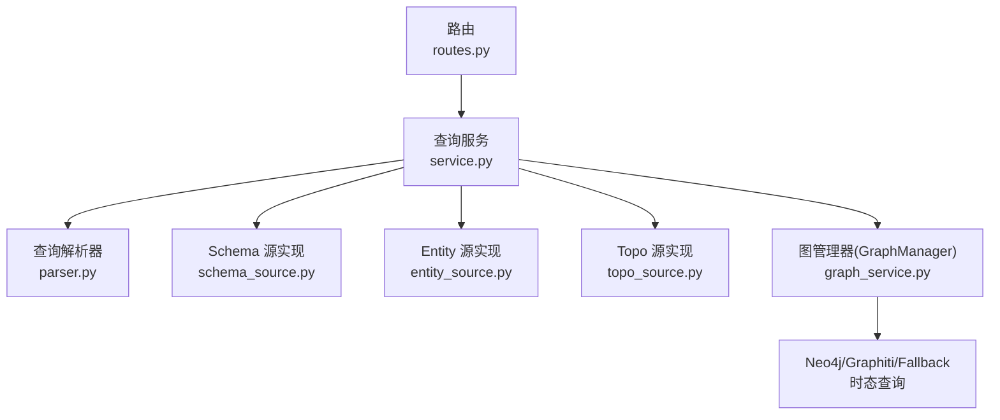
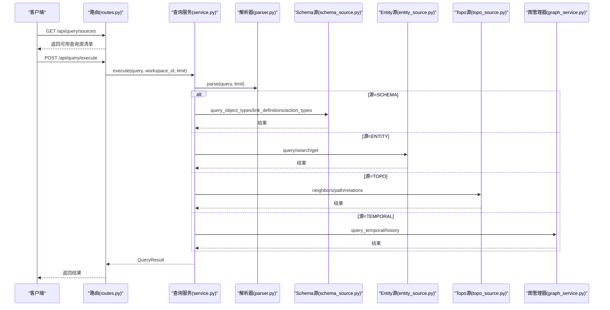
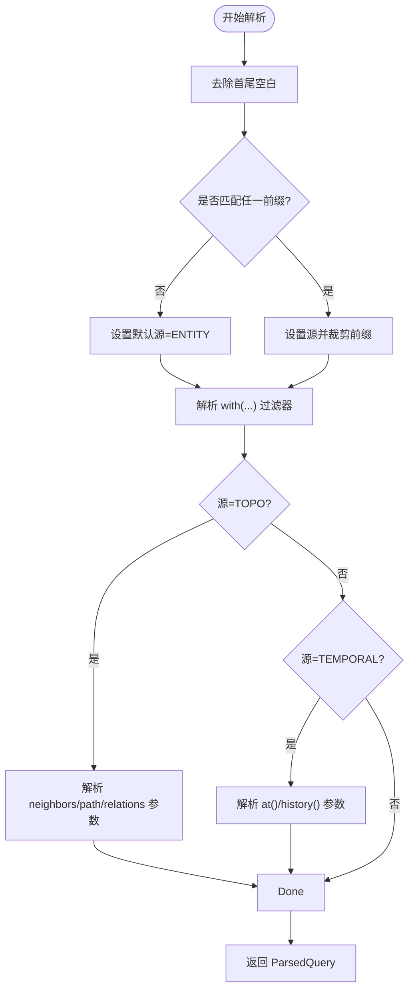
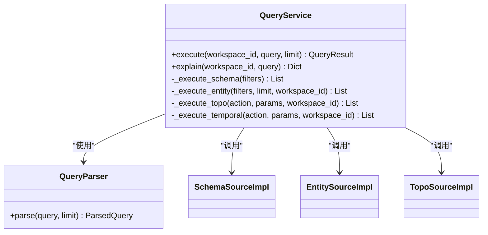
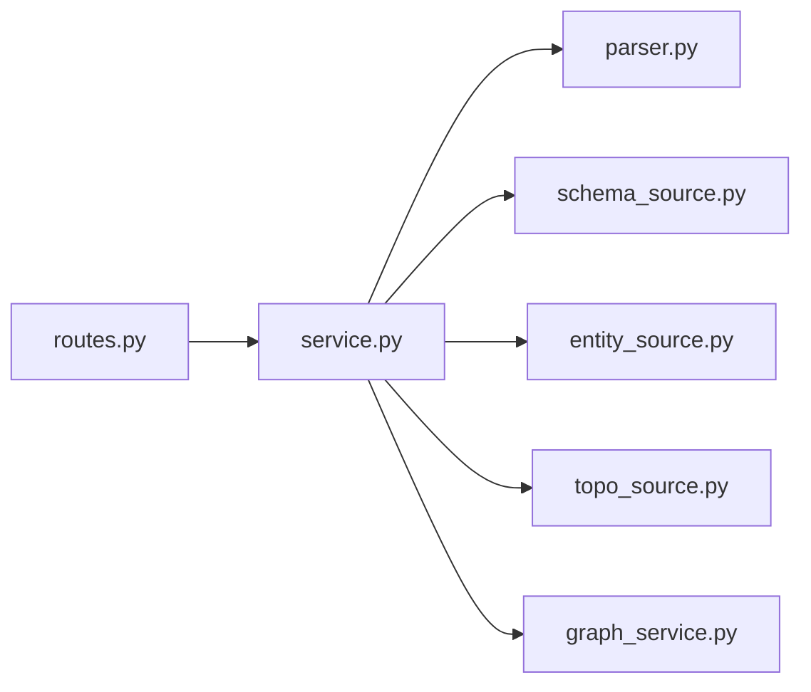

# 查询源管理API

<cite>
**本文引用的文件**
- [odap/infra/query/routes.py](file://odap/infra/query/routes.py)
- [odap/infra/query/service.py](file://odap/infra/query/service.py)
- [odap/infra/query/parser.py](file://odap/infra/query/parser.py)
- [odap/infra/query/protocols.py](file://odap/infra/query/protocols.py)
- [odap/infra/query/sources/schema_source.py](file://odap/infra/query/sources/schema_source.py)
- [odap/infra/query/sources/entity_source.py](file://odap/infra/query/sources/entity_source.py)
- [odap/infra/query/sources/topo_source.py](file://odap/infra/query/sources/topo_source.py)
- [odap/infra/graph/graph_service.py](file://odap/infra/graph/graph_service.py)
</cite>

## 目录
1. [简介](#简介)
2. [项目结构](#项目结构)
3. [核心组件](#核心组件)
4. [架构总览](#架构总览)
5. [详细组件分析](#详细组件分析)
6. [依赖分析](#依赖分析)
7. [性能考虑](#性能考虑)
8. [故障排查指南](#故障排查指南)
9. [结论](#结论)
10. [附录](#附录)

## 简介
本文件为“查询源管理API”的权威参考文档，重点围绕 list_sources 端点，系统化说明四种查询源（schema、entity、topo、temporal）的命名、前缀、描述与典型查询示例，并给出各源的适用场景、选择原则与最佳实践。同时，文档阐述了查询解析与执行流程、扩展机制与自定义查询源的接入方式，帮助系统管理员与开发者准确理解与高效使用该API。

## 项目结构
查询源管理API位于后端基础设施层，核心由路由、解析器、服务与多个查询源实现组成；时态查询进一步依赖图谱管理模块以实现双时态能力。

**图表来源**
- [odap/infra/query/routes.py:1-101](file://odap/infra/query/routes.py#L1-L101)
- [odap/infra/query/service.py:1-126](file://odap/infra/query/service.py#L1-L126)
- [odap/infra/query/parser.py:1-113](file://odap/infra/query/parser.py#L1-L113)
- [odap/infra/query/sources/schema_source.py:1-172](file://odap/infra/query/sources/schema_source.py#L1-L172)
- [odap/infra/query/sources/entity_source.py:1-34](file://odap/infra/query/sources/entity_source.py#L1-L34)
- [odap/infra/query/sources/topo_source.py:1-28](file://odap/infra/query/sources/topo_source.py#L1-L28)
- [odap/infra/graph/graph_service.py:1-800](file://odap/infra/graph/graph_service.py#L1-L800)

**章节来源**
- [odap/infra/query/routes.py:1-101](file://odap/infra/query/routes.py#L1-L101)
- [odap/infra/query/service.py:1-126](file://odap/infra/query/service.py#L1-L126)
- [odap/infra/query/parser.py:1-113](file://odap/infra/query/parser.py#L1-L113)
- [odap/infra/query/sources/schema_source.py:1-172](file://odap/infra/query/sources/schema_source.py#L1-L172)
- [odap/infra/query/sources/entity_source.py:1-34](file://odap/infra/query/sources/entity_source.py#L1-L34)
- [odap/infra/query/sources/topo_source.py:1-28](file://odap/infra/query/sources/topo_source.py#L1-L28)
- [odap/infra/graph/graph_service.py:1-800](file://odap/infra/graph/graph_service.py#L1-L800)

## 核心组件
- 路由与端点
  - list_sources：返回可用查询源清单，包含名称、前缀、描述与示例。
  - /api/query/execute：统一执行查询，支持四种源与参数。
  - /api/query/explain：解释查询表达式但不执行。
- 查询服务
  - 统一编排解析、路由与执行，负责按源类型调用对应实现。
- 查询解析器
  - 识别前缀、解析 filters、识别 topo/temporal 动作与参数。
- 查询源实现
  - SchemaSourceImpl：本体类型定义查询。
  - EntitySourceImpl：运行时实体查询与搜索。
  - TopoSourceImpl：拓扑关系与图遍历。
  - Temporal：通过 GraphManager 提供时态查询能力。

**章节来源**
- [odap/infra/query/routes.py:53-101](file://odap/infra/query/routes.py#L53-L101)
- [odap/infra/query/service.py:11-126](file://odap/infra/query/service.py#L11-L126)
- [odap/infra/query/parser.py:23-113](file://odap/infra/query/parser.py#L23-L113)
- [odap/infra/query/protocols.py:7-40](file://odap/infra/query/protocols.py#L7-L40)

## 架构总览
统一查询入口将请求解析为源类型与参数，再路由到对应源实现；时态查询通过图管理器访问底层存储（Graphiti/Neo4j/fallback）。

**图表来源**
- [odap/infra/query/routes.py:18-51](file://odap/infra/query/routes.py#L18-L51)
- [odap/infra/query/service.py:33-125](file://odap/infra/query/service.py#L33-L125)
- [odap/infra/query/parser.py:31-81](file://odap/infra/query/parser.py#L31-L81)
- [odap/infra/query/sources/schema_source.py:14-68](file://odap/infra/query/sources/schema_source.py#L14-L68)
- [odap/infra/query/sources/entity_source.py:14-33](file://odap/infra/query/sources/entity_source.py#L14-L33)
- [odap/infra/query/sources/topo_source.py:14-27](file://odap/infra/query/sources/topo_source.py#L14-L27)
- [odap/infra/graph/graph_service.py:1405-1454](file://odap/infra/graph/graph_service.py#L1405-L1454)

## 详细组件分析

### list_sources 端点
- 功能：返回可用查询源的元数据与示例。
- 输出字段：
  - name：源名称（schema、entity、topo、temporal）
  - prefix：查询前缀（.schema、.entity、.topo、.temporal）
  - description：简要描述
  - examples：典型查询示例数组
- 示例响应结构（简化示意）
  - sources: [
    { name, prefix, description, examples[] },
    ...
  ]

**章节来源**
- [odap/infra/query/routes.py:53-101](file://odap/infra/query/routes.py#L53-L101)

### 统一查询执行与解释
- /api/query/execute
  - 参数：query（带前缀与with/动作）、workspace_id、limit
  - 行为：解析后按源类型执行，返回标准化结果与可选解释
- /api/query/explain
  - 参数：query、workspace_id
  - 行为：仅返回解析后的结构（source、filters、action、action_params、limit）

**章节来源**
- [odap/infra/query/routes.py:18-51](file://odap/infra/query/routes.py#L18-L51)
- [odap/infra/query/service.py:61-70](file://odap/infra/query/service.py#L61-L70)

### 查询解析器（QueryParser）
- 识别前缀映射：.schema → SCHEMA，.entity → ENTITY，.topo → TOPO，.temporal → TEMPORAL
- 解析 filters：from with(...)，键值对形式
- 解析动作与参数：
  - topo：neighbors(id, direction, depth)、path(from, to, max_hops)、relations(id, type)
  - temporal：at('YYYY-MM-DD')、history(id)
- 限制：limit 透传至解析结果

**图表来源**
- [odap/infra/query/parser.py:31-81](file://odap/infra/query/parser.py#L31-L81)

**章节来源**
- [odap/infra/query/parser.py:23-113](file://odap/infra/query/parser.py#L23-L113)

### 查询服务（QueryService）
- 单例模式，延迟注入各源实现
- 执行流程：
  - 解析 → 分派 → 调用源实现 → 截断 limit → 包装为 QueryResult
  - explain：仅返回解析结构
- 源分派：
  - SCHEMA：按 kind 决定 object_types/link_definitions/action_types
  - ENTITY：按 search/id 进行搜索/获取/查询
  - TOPO：按 neighbors/path/relations 或默认邻居
  - TEMPORAL：at/at 时间点查询或 history 历史查询

**图表来源**
- [odap/infra/query/service.py:11-126](file://odap/infra/query/service.py#L11-L126)

**章节来源**
- [odap/infra/query/service.py:11-126](file://odap/infra/query/service.py#L11-L126)

### 查询源详解

#### schema（本体类型）
- 前缀：.schema
- 功能：查询本体类型定义，包括对象类型、链接定义、动作类型
- 常用 filters：
  - type_id/name/is_active（对象类型）
  - source_type/target_type/name（链接定义）
  - action_type_id/target_object_type/name（动作类型）
- 示例：
  - .schema with(type='Unit')
  - .schema with(kind='link_definitions')
  - .schema with(kind='action_types')

适用场景
- 需要了解系统支持的实体类型、关系与动作定义
- 构建实体属性校验规则与关系基数控制的基础

**章节来源**
- [odap/infra/query/routes.py:58-69](file://odap/infra/query/routes.py#L58-L69)
- [odap/infra/query/sources/schema_source.py:14-68](file://odap/infra/query/sources/schema_source.py#L14-L68)

#### entity（运行时实体）
- 前缀：.entity
- 功能：查询运行时实体、按 ID 获取、按文本搜索
- 常用 filters：
  - type/entity_type、area、id、search
- 示例：
  - .entity with(type='MilitaryUnit')
  - .entity with(search='装甲部队')
  - .entity with(id='entity-mil-abc123')

适用场景
- 快速定位实体、跨类型聚合查询、全文/向量混合搜索

**章节来源**
- [odap/infra/query/routes.py:70-79](file://odap/infra/query/routes.py#L70-L79)
- [odap/infra/query/sources/entity_source.py:14-33](file://odap/infra/query/sources/entity_source.py#L14-L33)

#### topo（拓扑关系）
- 前缀：.topo
- 功能：图遍历与关系查询
- 常用动作与参数：
  - neighbors(id, direction='both'|'in'|'out', depth=1)
  - relations(id, type)
  - path(from, to, max_hops|max_depth)
- 示例：
  - .topo neighbors(id='entity-mil-abc123', depth=2)
  - .topo relations(id='entity-mil-abc123', type='located_at')
  - .topo path(from='id1', to='id2', max_hops=5)

适用场景
- 关系探索、路径发现、邻域扩散分析

**章节来源**
- [odap/infra/query/routes.py:80-89](file://odap/infra/query/routes.py#L80-L89)
- [odap/infra/query/sources/topo_source.py:14-27](file://odap/infra/query/sources/topo_source.py#L14-L27)

#### temporal（时态数据）
- 前缀：.temporal
- 功能：时态查询（有效时间/事务时间）与实体历史
- 常用动作与参数：
  - at('YYYY-MM-DD'[,'type'='...'])
  - history(id)
- 示例：
  - .temporal at('2025-01-01')
  - .temporal history(id='entity-mil-abc123')

适用场景
- 历史快照查询、实体演化追踪、双时态推理

**章节来源**
- [odap/infra/query/routes.py:90-99](file://odap/infra/query/routes.py#L90-L99)
- [odap/infra/query/service.py:115-125](file://odap/infra/query/service.py#L115-L125)
- [odap/infra/graph/graph_service.py:1405-1454](file://odap/infra/graph/graph_service.py#L1405-L1454)

### 查询源选择与最佳实践
- 选择原则
  - 明确目标：若需类型定义，优先 schema；若需实体内容，优先 entity；若需关系/路径，优先 topo；若需历史/快照，优先 temporal
  - 参数最小化：先用 with(...) 过滤，再用 topo/temporal 动作限定范围
  - 限制输出：合理设置 limit，避免大范围扫描
- 最佳实践
  - 使用 explain() 预检查询结构，确认解析结果
  - 对高频查询开启缓存（如图/向量搜索层）
  - 在多工作空间场景，始终携带 workspace_id
  - topo 查询建议先 neighbors 再 path，减少图扫描范围

[本节为通用指导，不直接分析具体文件]

## 依赖分析
- 路由依赖查询服务；查询服务依赖解析器与各源实现；时态查询依赖图管理器。
- 源实现之间低耦合，通过协议抽象隔离具体存储（GraphManager 支持多模式降级）。

**图表来源**
- [odap/infra/query/routes.py:1-101](file://odap/infra/query/routes.py#L1-L101)
- [odap/infra/query/service.py:1-126](file://odap/infra/query/service.py#L1-L126)
- [odap/infra/query/parser.py:1-113](file://odap/infra/query/parser.py#L1-L113)
- [odap/infra/query/sources/schema_source.py:1-172](file://odap/infra/query/sources/schema_source.py#L1-L172)
- [odap/infra/query/sources/entity_source.py:1-34](file://odap/infra/query/sources/entity_source.py#L1-L34)
- [odap/infra/query/sources/topo_source.py:1-28](file://odap/infra/query/sources/topo_source.py#L1-L28)
- [odap/infra/graph/graph_service.py:1-800](file://odap/infra/graph/graph_service.py#L1-L800)

**章节来源**
- [odap/infra/query/service.py:11-31](file://odap/infra/query/service.py#L11-L31)

## 性能考虑
- 解析阶段：正则匹配与字符串裁剪，复杂度与查询长度线性相关
- 执行阶段：
  - schema：全量类型/链接/动作枚举后过滤，注意 filters 设计
  - entity：优先向量化搜索，回退到全文/图查询
  - topo：深度与方向控制邻域规模，path 严格限制 max_hops
  - temporal：Graphiti 模式下利用索引与约束，fallback 模式仅支持全量
- 连接与降级：GraphManager 支持三层降级（Graphiti → Neo4j Driver → Fallback），具备断路器与连接池优化

[本节为通用指导，不直接分析具体文件]

## 故障排查指南
- 常见错误
  - 解析失败：检查前缀与括号匹配、逗号分隔符、引号包裹
  - 无结果：确认 filters 条件是否过于严格；检查 workspace_id 与类型是否存在
  - 时态查询异常：确认 Graphiti/Neo4j 可用；fallback 模式不支持时态
- 排查步骤
  - 使用 /api/query/explain 确认解析结构
  - 缩小 filters 与 limit，逐步定位问题
  - 检查图管理器模式与连接状态
- 日志与监控
  - 服务端会记录执行错误与查询耗时，结合性能指标定位瓶颈

**章节来源**
- [odap/infra/query/service.py:52-59](file://odap/infra/query/service.py#L52-L59)
- [odap/infra/graph/graph_service.py:140-185](file://odap/infra/graph/graph_service.py#L140-L185)

## 结论
查询源管理API以统一的前缀语法与解析机制，将 schema、entity、topo、temporal 四类查询抽象为一致的执行模型。通过 list_sources 端点，用户可快速了解各源的能力边界与示例；借助 explain 与合理的参数设计，可在保证性能的同时获得高精度的结果。对于扩展需求，可通过新增源实现与协议扩展，平滑接入新的数据源或计算能力。

[本节为总结，不直接分析具体文件]

## 附录

### API 定义概览
- GET /api/query/sources
  - 返回：sources[]（name、prefix、description、examples）
- POST /api/query/execute
  - 参数：query（含前缀与with/动作）、workspace_id、limit
  - 返回：QueryResult（source、rows、total、explain）
- POST /api/query/explain
  - 参数：query、workspace_id
  - 返回：解析结构（source、filters、action、action_params、limit）

**章节来源**
- [odap/infra/query/routes.py:18-51](file://odap/infra/query/routes.py#L18-L51)
- [odap/infra/query/protocols.py:14-18](file://odap/infra/query/protocols.py#L14-L18)

### 扩展机制与自定义查询源
- 协议与抽象
  - 通过 Protocols（SchemaSource、EntitySource、TopoSource）定义可插拔接口
  - QueryService 通过构造函数注入实现，便于替换与测试
- 自定义步骤
  - 实现对应 Protocol 接口
  - 在 QueryService 构造时注入自定义实现
  - 在 QueryParser 的 SOURCE_MAP 中注册新前缀
  - 在路由层补充 list_sources 的示例与描述
- 注意事项
  - 保持与现有 QueryResult 结构一致
  - 合理处理 workspace_id 与权限过滤
  - 对外暴露 explain 能力，便于调试与审计

**章节来源**
- [odap/infra/query/protocols.py:21-39](file://odap/infra/query/protocols.py#L21-L39)
- [odap/infra/query/service.py:19-31](file://odap/infra/query/service.py#L19-L31)
- [odap/infra/query/parser.py:24-29](file://odap/infra/query/parser.py#L24-L29)
- [odap/infra/query/routes.py:58-69](file://odap/infra/query/routes.py#L58-L69)