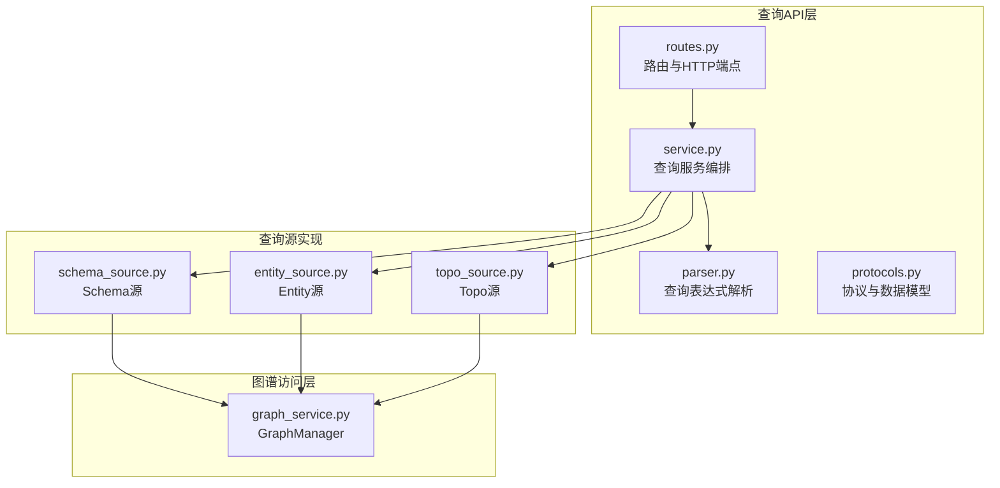
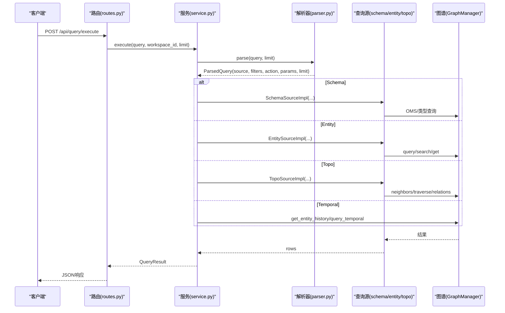
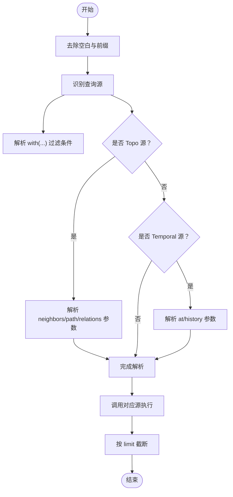
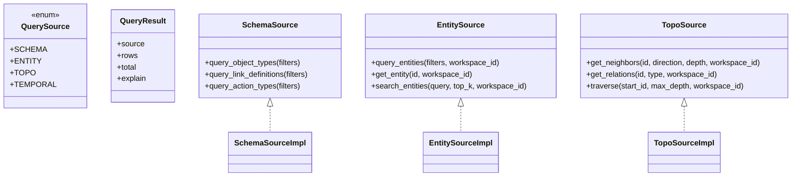
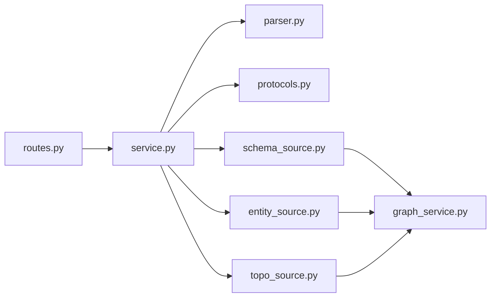

# 统一查询服务API

<cite>
**本文引用的文件**
- [odap/infra/query/routes.py](file://odap/infra/query/routes.py)
- [odap/infra/query/service.py](file://odap/infra/query/service.py)
- [odap/infra/query/parser.py](file://odap/infra/query/parser.py)
- [odap/infra/query/protocols.py](file://odap/infra/query/protocols.py)
- [odap/infra/query/sources/schema_source.py](file://odap/infra/query/sources/schema_source.py)
- [odap/infra/query/sources/entity_source.py](file://odap/infra/query/sources/entity_source.py)
- [odap/infra/query/sources/topo_source.py](file://odap/infra/query/sources/topo_source.py)
- [odap/infra/graph/graph_service.py](file://odap/infra/graph/graph_service.py)
</cite>

## 目录
1. [简介](#简介)
2. [项目结构](#项目结构)
3. [核心组件](#核心组件)
4. [架构总览](#架构总览)
5. [详细组件分析](#详细组件分析)
6. [依赖分析](#依赖分析)
7. [性能考虑](#性能考虑)
8. [故障排查指南](#故障排查指南)
9. [结论](#结论)
10. [附录](#附录)

## 简介
本文件为 ODAP 平台“统一查询服务API”的权威参考文档，覆盖四种查询源的完整接口：Schema 查询、Entity 查询、Topo 查询、Temporal 查询；详述查询表达式的语法规范与参数定义；文档化查询执行 API（execute 与 explain）；介绍查询源枚举 API；说明查询限制参数（limit、workspace_id）；提供丰富示例（本体类型查询、实体搜索、图遍历、时态查询等）；并给出性能优化建议与最佳实践，帮助数据分析师与开发者高效、准确地使用统一查询能力。

## 项目结构
统一查询服务位于 odap/infra/query 目录，包含路由、服务、解析器、协议与查询源实现；底层图谱访问由 GraphManager 提供，支持多模式降级（Graphiti → Neo4j Driver → NetworkX Fallback）。

**图表来源**
- [odap/infra/query/routes.py:1-101](file://odap/infra/query/routes.py#L1-L101)
- [odap/infra/query/service.py:1-126](file://odap/infra/query/service.py#L1-L126)
- [odap/infra/query/parser.py:1-113](file://odap/infra/query/parser.py#L1-L113)
- [odap/infra/query/protocols.py:1-40](file://odap/infra/query/protocols.py#L1-L40)
- [odap/infra/query/sources/schema_source.py:1-172](file://odap/infra/query/sources/schema_source.py#L1-L172)
- [odap/infra/query/sources/entity_source.py:1-34](file://odap/infra/query/sources/entity_source.py#L1-L34)
- [odap/infra/query/sources/topo_source.py:1-28](file://odap/infra/query/sources/topo_source.py#L1-L28)
- [odap/infra/graph/graph_service.py:1-2256](file://odap/infra/graph/graph_service.py#L1-L2256)

**章节来源**
- [odap/infra/query/routes.py:1-101](file://odap/infra/query/routes.py#L1-L101)
- [odap/infra/query/service.py:1-126](file://odap/infra/query/service.py#L1-L126)
- [odap/infra/query/parser.py:1-113](file://odap/infra/query/parser.py#L1-L113)
- [odap/infra/query/protocols.py:1-40](file://odap/infra/query/protocols.py#L1-L40)
- [odap/infra/query/sources/schema_source.py:1-172](file://odap/infra/query/sources/schema_source.py#L1-L172)
- [odap/infra/query/sources/entity_source.py:1-34](file://odap/infra/query/sources/entity_source.py#L1-L34)
- [odap/infra/query/sources/topo_source.py:1-28](file://odap/infra/query/sources/topo_source.py#L1-L28)
- [odap/infra/graph/graph_service.py:1-2256](file://odap/infra/graph/graph_service.py#L1-L2256)

## 核心组件
- 路由与端点
  - /api/query/execute：执行统一查询，支持四种查询源与限制参数
  - /api/query/explain：解释查询表达式（不执行）
  - /api/query/sources：列举可用查询源及其示例
- 查询服务
  - 解析查询表达式，调度到对应查询源，聚合结果并返回
- 解析器
  - 识别查询源前缀、with 过滤条件、Topo/Temporal 动作与参数
- 协议与数据模型
  - 定义查询源枚举、结果模型与各源协议
- 查询源实现
  - Schema 源：本体类型、链接定义、动作类型查询与校验
  - Entity 源：实体查询、实体检索、按ID获取
  - Topo 源：邻居查询、关系查询、路径/子图遍历
- 图谱访问
  - GraphManager：多模式降级、实体查询、搜索、遍历、时态查询等

**章节来源**
- [odap/infra/query/routes.py:18-101](file://odap/infra/query/routes.py#L18-L101)
- [odap/infra/query/service.py:33-126](file://odap/infra/query/service.py#L33-L126)
- [odap/infra/query/parser.py:31-113](file://odap/infra/query/parser.py#L31-L113)
- [odap/infra/query/protocols.py:7-40](file://odap/infra/query/protocols.py#L7-L40)
- [odap/infra/query/sources/schema_source.py:14-172](file://odap/infra/query/sources/schema_source.py#L14-L172)
- [odap/infra/query/sources/entity_source.py:14-34](file://odap/infra/query/sources/entity_source.py#L14-L34)
- [odap/infra/query/sources/topo_source.py:14-28](file://odap/infra/query/sources/topo_source.py#L14-L28)
- [odap/infra/graph/graph_service.py:650-1200](file://odap/infra/graph/graph_service.py#L650-L1200)

## 架构总览
统一查询服务采用“路由 → 服务 → 解析器 → 查询源 → 图谱访问”的分层架构，支持四种查询源的统一表达式语法，并在执行阶段进行参数解析与动作分发。

**图表来源**
- [odap/infra/query/routes.py:18-50](file://odap/infra/query/routes.py#L18-L50)
- [odap/infra/query/service.py:33-126](file://odap/infra/query/service.py#L33-L126)
- [odap/infra/query/parser.py:31-81](file://odap/infra/query/parser.py#L31-L81)
- [odap/infra/query/sources/schema_source.py:14-68](file://odap/infra/query/sources/schema_source.py#L14-L68)
- [odap/infra/query/sources/entity_source.py:14-34](file://odap/infra/query/sources/entity_source.py#L14-L34)
- [odap/infra/query/sources/topo_source.py:14-28](file://odap/infra/query/sources/topo_source.py#L14-L28)
- [odap/infra/graph/graph_service.py:649-1200](file://odap/infra/graph/graph_service.py#L649-L1200)

## 详细组件分析

### 路由与端点
- /api/query/execute
  - 参数
    - query: 查询表达式（必填）
    - workspace_id: 工作空间ID（默认 default）
    - limit: 返回数量限制（默认 20，范围 1-100）
  - 行为：调用查询服务执行并返回 QueryResult
- /api/query/explain
  - 参数
    - query: 查询表达式（必填）
    - workspace_id: 工作空间ID（默认 default）
  - 行为：仅解析并返回解析结果（不含执行）
- /api/query/sources
  - 行为：返回四个查询源的名称、前缀、描述与示例

**章节来源**
- [odap/infra/query/routes.py:18-101](file://odap/infra/query/routes.py#L18-L101)

### 查询服务与解析器
- 解析规则
  - 识别查询源前缀：.schema、.entity、.topo、.temporal
  - with(...) 过滤条件解析为键值对
  - Topo 动作：neighbors、path、relations
  - Temporal 动作：at('YYYY-MM-DD')、history(...)
  - 参数解析：支持字符串与整数类型
- 执行流程
  - 根据解析结果选择对应源执行
  - Schema：根据 kind 决定对象类型/链接定义/动作类型
  - Entity：支持按搜索、ID、过滤条件查询
  - Topo：支持邻居、关系、路径/子图遍历
  - Temporal：支持 at 时点查询与历史查询
  - 结果裁剪：按 limit 截断

**图表来源**
- [odap/infra/query/parser.py:31-113](file://odap/infra/query/parser.py#L31-L113)
- [odap/infra/query/service.py:33-126](file://odap/infra/query/service.py#L33-L126)

**章节来源**
- [odap/infra/query/parser.py:31-113](file://odap/infra/query/parser.py#L31-L113)
- [odap/infra/query/service.py:33-126](file://odap/infra/query/service.py#L33-L126)

### 查询源与协议
- 查询源枚举
  - SCHEMA、ENTITY、TOPO、TEMPORAL
- Schema 源
  - 查询对象类型、链接定义、动作类型
  - 校验实体类型、属性类型与基数约束
- Entity 源
  - 实体查询、按ID获取、混合检索（hybrid search）
- Topo 源
  - 邻居查询、关系查询、子图遍历
- 协议
  - 定义各源的接口契约，便于替换实现

**图表来源**
- [odap/infra/query/protocols.py:7-40](file://odap/infra/query/protocols.py#L7-L40)
- [odap/infra/query/sources/schema_source.py:4-172](file://odap/infra/query/sources/schema_source.py#L4-L172)
- [odap/infra/query/sources/entity_source.py:4-34](file://odap/infra/query/sources/entity_source.py#L4-L34)
- [odap/infra/query/sources/topo_source.py:4-28](file://odap/infra/query/sources/topo_source.py#L4-L28)

**章节来源**
- [odap/infra/query/protocols.py:7-40](file://odap/infra/query/protocols.py#L7-L40)
- [odap/infra/query/sources/schema_source.py:4-172](file://odap/infra/query/sources/schema_source.py#L4-L172)
- [odap/infra/query/sources/entity_source.py:4-34](file://odap/infra/query/sources/entity_source.py#L4-L34)
- [odap/infra/query/sources/topo_source.py:4-28](file://odap/infra/query/sources/topo_source.py#L4-L28)

### 图谱访问层（GraphManager）
- 多模式降级
  - Graphiti（双时态知识图谱，核心）
  - Neo4j Driver（直连，Cypher）
  - NetworkX Fallback（纯内存）
- 关键能力
  - 实体查询、搜索、更新、统计
  - 遍历、关系查询、路径查找
  - 时态查询：at 时点、历史版本
- 性能与可靠性
  - 连接池、断路器、性能监控、自动重连

**章节来源**
- [odap/infra/graph/graph_service.py:71-2256](file://odap/infra/graph/graph_service.py#L71-L2256)

## 依赖分析
- 路由依赖服务，服务依赖解析器与查询源实现
- 查询源实现依赖 GraphManager 进行底层数据访问
- 协议定义为松耦合接口，便于替换实现

**图表来源**
- [odap/infra/query/routes.py:14-15](file://odap/infra/query/routes.py#L14-L15)
- [odap/infra/query/service.py:27-31](file://odap/infra/query/service.py#L27-L31)
- [odap/infra/query/parser.py:4-6](file://odap/infra/query/parser.py#L4-L6)
- [odap/infra/query/protocols.py:4-5](file://odap/infra/query/protocols.py#L4-L5)
- [odap/infra/query/sources/schema_source.py:8-12](file://odap/infra/query/sources/schema_source.py#L8-L12)
- [odap/infra/query/sources/entity_source.py:8-12](file://odap/infra/query/sources/entity_source.py#L8-L12)
- [odap/infra/query/sources/topo_source.py:8-12](file://odap/infra/query/sources/topo_source.py#L8-L12)
- [odap/infra/graph/graph_service.py:1-20](file://odap/infra/graph/graph_service.py#L1-L20)

**章节来源**
- [odap/infra/query/routes.py:14-15](file://odap/infra/query/routes.py#L14-L15)
- [odap/infra/query/service.py:27-31](file://odap/infra/query/service.py#L27-L31)
- [odap/infra/query/parser.py:4-6](file://odap/infra/query/parser.py#L4-L6)
- [odap/infra/query/protocols.py:4-5](file://odap/infra/query/protocols.py#L4-L5)
- [odap/infra/query/sources/schema_source.py:8-12](file://odap/infra/query/sources/schema_source.py#L8-L12)
- [odap/infra/query/sources/entity_source.py:8-12](file://odap/infra/query/sources/entity_source.py#L8-L12)
- [odap/infra/query/sources/topo_source.py:8-12](file://odap/infra/query/sources/topo_source.py#L8-L12)
- [odap/infra/graph/graph_service.py:1-20](file://odap/infra/graph/graph_service.py#L1-L20)

## 性能考虑
- 限制参数
  - limit 控制返回条目上限，默认 20，最大 100，避免大结果集导致延迟与资源消耗
- 工作空间隔离
  - workspace_id 用于多租户过滤，建议在查询中显式传入，减少无关扫描
- 搜索与过滤
  - Entity 源支持 hybrid search（若图库可用），否则回退到关键词检索
  - Topo 源的深度与路径长度应合理设置，避免大规模遍历
- 模式降级
  - GraphManager 自动在 Graphiti、Neo4j Driver、Fallback 间降级，注意不同模式下的性能差异
- 连接与断路器
  - 使用连接池与断路器降低抖动，提升稳定性

[本节为通用性能建议，不直接分析具体文件]

## 故障排查指南
- 常见错误
  - 查询解析失败：确认查询表达式格式（前缀、with、动作与参数）
  - 未知查询源：确保使用 .schema/.entity/.topo/.temporal 前缀之一
  - 时态查询异常：确认 at('YYYY-MM-DD') 格式与时点有效性
  - Topo 路径为空：检查起点/终点是否在遍历范围内
- 日志与诊断
  - 服务端会记录执行错误与解析错误日志，便于定位问题
  - 使用 /api/query/explain 获取解析后的结构，核对 filters/action/action_params
- 降级与可用性
  - 若 Graphiti 不可用，系统自动降级至 Neo4j Driver 或 Fallback
  - 在 Fallback 模式下，查询能力受限，建议尽快修复上游依赖

**章节来源**
- [odap/infra/query/routes.py:34-38](file://odap/infra/query/routes.py#L34-L38)
- [odap/infra/query/service.py:52-59](file://odap/infra/query/service.py#L52-L59)
- [odap/infra/graph/graph_service.py:145-185](file://odap/infra/graph/graph_service.py#L145-L185)

## 结论
统一查询服务通过一致的表达式语法与清晰的分层架构，将本体、实体、拓扑与时态四类查询统一起来。配合解析器、查询源与图谱访问层，既满足灵活的查询需求，又具备良好的可扩展性与可靠性。建议在实际使用中充分利用 explain 接口进行调试，合理设置 limit 与 workspace_id，并结合查询源特性选择合适的查询方式。

[本节为总结性内容，不直接分析具体文件]

## 附录

### 查询表达式语法规范
- 查询源前缀
  - .schema：查询本体类型定义（对象类型、链接定义、动作类型）
  - .entity：查询运行时实体（支持过滤、搜索、按ID获取）
  - .topo：查询拓扑关系与图遍历（neighbors、relations、path）
  - .temporal：查询时态数据（at、history）
- 过滤条件 with(...)
  - 键值对形式，如 type='MilitaryUnit'、name='...'、area='...' 等
  - 字符串值需去除外层引号
- Topo 动作与参数
  - neighbors(id='...', direction='both'|'in'|'out', depth=1..N)
  - relations(id='...', type='RelationType')
  - path(from='id1', to='id2', max_hops=1..N) → max_hops 映射为 max_depth
- Temporal 动作与参数
  - at('YYYY-MM-DD')：查询指定有效时间点的数据
  - history(id='...')：查询实体历史版本

**章节来源**
- [odap/infra/query/routes.py:27-32](file://odap/infra/query/routes.py#L27-L32)
- [odap/infra/query/parser.py:31-81](file://odap/infra/query/parser.py#L31-L81)

### 查询限制参数
- limit
  - 默认 20，最大 100
  - 影响最终返回条目数量，服务端会在结果生成后截断
- workspace_id
  - 默认 "default"
  - 用于多租户隔离与过滤，影响实体查询与搜索

**章节来源**
- [odap/infra/query/routes.py:21-22](file://odap/infra/query/routes.py#L21-L22)
- [odap/infra/query/service.py:33](file://odap/infra/query/service.py#L33)

### 查询源枚举与示例
- .schema
  - 示例：.schema with(type='Unit')、.schema with(kind='link_definitions')、.schema with(kind='action_types')
- .entity
  - 示例：.entity with(type='MilitaryUnit')、.entity with(search='装甲部队')、.entity with(id='entity-mil-abc123')
- .topo
  - 示例：.topo neighbors(id='entity-mil-abc123', depth=2)、.topo relations(id='entity-mil-abc123', type='located_at')、.topo path(from='id1', to='id2', max_hops=5)
- .temporal
  - 示例：.temporal at('2025-01-01')、.temporal history(id='entity-mil-abc123')

**章节来源**
- [odap/infra/query/routes.py:53-100](file://odap/infra/query/routes.py#L53-L100)

### API 定义与行为
- /api/query/execute
  - 方法：POST
  - 请求体字段：query、workspace_id、limit
  - 响应：QueryResult（包含 source、rows、total、explain）
- /api/query/explain
  - 方法：POST
  - 请求体字段：query、workspace_id
  - 响应：解析后的结构（source、filters、action、action_params、limit、workspace_id）
- /api/query/sources
  - 方法：GET
  - 响应：sources 数组（name、prefix、description、examples）

**章节来源**
- [odap/infra/query/routes.py:18-101](file://odap/infra/query/routes.py#L18-L101)
- [odap/infra/query/protocols.py:14-18](file://odap/infra/query/protocols.py#L14-L18)

### 查询示例（场景与用法）
- 本体类型查询
  - .schema with(kind='object_types', type_id='...') 或 .schema with(kind='link_definitions', source_type='...')
- 实体搜索
  - .entity with(search='目标关键字', type='...')，结合 limit 控制返回数量
- 图遍历
  - .topo neighbors(id='entity-id', depth=2) 查看邻接节点
  - .topo relations(id='entity-id', type='relation-type') 过滤关系类型
  - .topo path(from='id1', to='id2', max_hops=5) 查找两点间路径
- 时态查询
  - .temporal at('2025-01-01') 查询某一时点快照
  - .temporal history(id='entity-id') 获取实体历史版本

**章节来源**
- [odap/infra/query/routes.py:27-32](file://odap/infra/query/routes.py#L27-L32)
- [odap/infra/query/service.py:72-125](file://odap/infra/query/service.py#L72-L125)