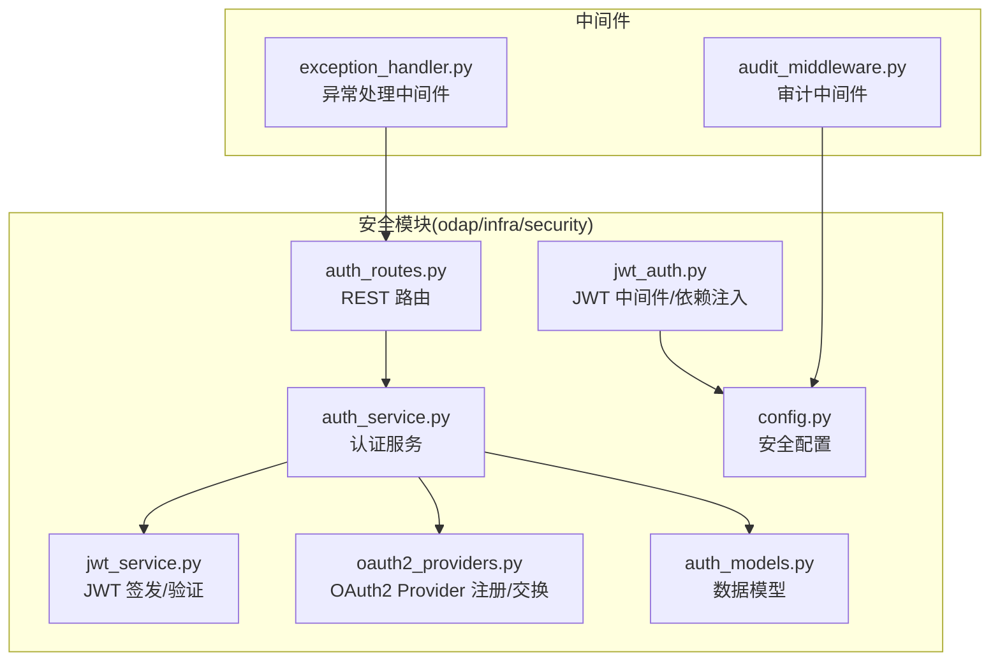
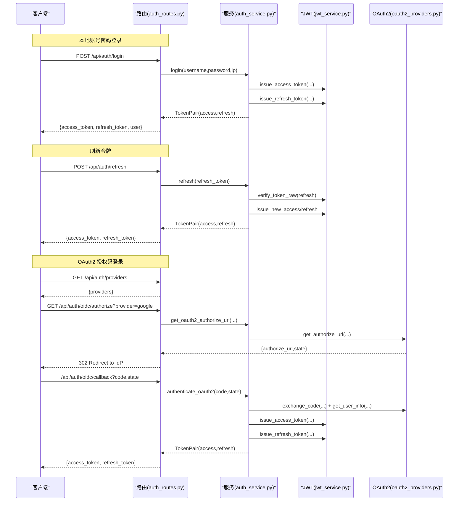
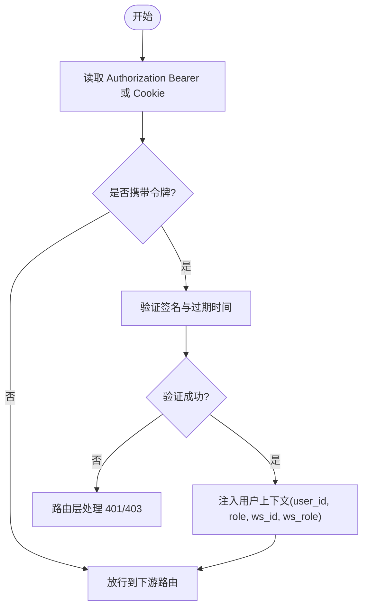
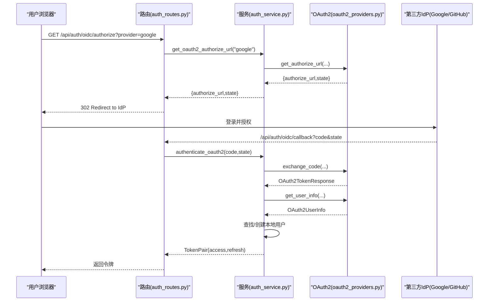
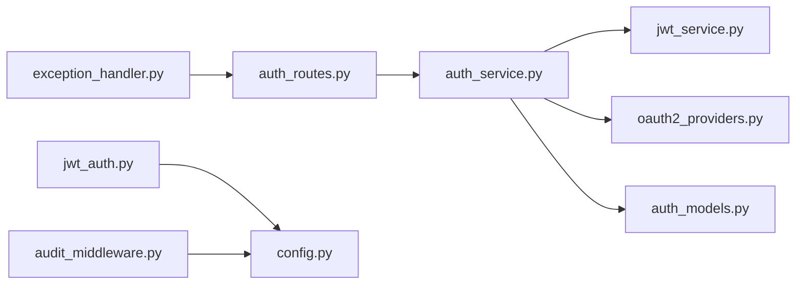

# 认证授权API

<cite>
**本文引用的文件**
- [auth_routes.py](file://odap/infra/security/auth_routes.py)
- [auth_service.py](file://odap/infra/security/auth_service.py)
- [jwt_auth.py](file://odap/infra/security/jwt_auth.py)
- [oauth2_providers.py](file://odap/infra/security/oauth2_providers.py)
- [jwt_service.py](file://odap/infra/security/jwt_service.py)
- [auth_models.py](file://odap/infra/security/auth_models.py)
- [config.py](file://odap/infra/security/config.py)
- [audit_middleware.py](file://odap/infra/middleware/audit_middleware.py)
- [exception_handler.py](file://odap/infra/middleware/exception_handler.py)
- [DESIGN.md](file://docs/03-modules/auth/DESIGN.md)
- [test_oauth2.py](file://tests/unit/test_oauth2.py)
</cite>

## 目录
1. [简介](#简介)
2. [项目结构](#项目结构)
3. [核心组件](#核心组件)
4. [架构总览](#架构总览)
5. [详细组件分析](#详细组件分析)
6. [依赖分析](#依赖分析)
7. [性能考虑](#性能考虑)
8. [故障排查指南](#故障排查指南)
9. [结论](#结论)
10. [附录](#附录)

## 简介
本文件为 ODAP 平台认证授权子系统的权威参考文档，覆盖以下主题：
- JWT 令牌获取、刷新、验证的完整流程
- OAuth2/OIDC 第三方登录（Google、GitHub 等）集成接口
- 用户注册、登录、登出的 RESTful 端点定义（请求参数、响应格式、错误码）
- 权限验证中间件的工作原理与使用方法
- 安全最佳实践（令牌过期处理、CSRF 防护、密码加密存储等）
- 完整的 API 调用示例（含 curl 与多语言 SDK 使用指引）

## 项目结构
认证授权相关代码主要位于 odap/infra/security 下，配合中间件与测试用例共同构成完整的认证授权能力。

**图示来源**
- [auth_routes.py:1-143](file://odap/infra/security/auth_routes.py#L1-L143)
- [auth_service.py:1-439](file://odap/infra/security/auth_service.py#L1-L439)
- [jwt_auth.py:1-63](file://odap/infra/security/jwt_auth.py#L1-L63)
- [jwt_service.py:1-72](file://odap/infra/security/jwt_service.py#L1-L72)
- [oauth2_providers.py:1-264](file://odap/infra/security/oauth2_providers.py#L1-L264)
- [auth_models.py:1-128](file://odap/infra/security/auth_models.py#L1-L128)
- [config.py:1-80](file://odap/infra/security/config.py#L1-L80)
- [audit_middleware.py:1-112](file://odap/infra/middleware/audit_middleware.py#L1-L112)
- [exception_handler.py:1-137](file://odap/infra/middleware/exception_handler.py#L1-L137)

**章节来源**
- [auth_routes.py:1-143](file://odap/infra/security/auth_routes.py#L1-L143)
- [auth_service.py:1-439](file://odap/infra/security/auth_service.py#L1-L439)
- [jwt_auth.py:1-63](file://odap/infra/security/jwt_auth.py#L1-L63)
- [oauth2_providers.py:1-264](file://odap/infra/security/oauth2_providers.py#L1-L264)
- [jwt_service.py:1-72](file://odap/infra/security/jwt_service.py#L1-L72)
- [auth_models.py:1-128](file://odap/infra/security/auth_models.py#L1-L128)
- [config.py:1-80](file://odap/infra/security/config.py#L1-L80)
- [audit_middleware.py:1-112](file://odap/infra/middleware/audit_middleware.py#L1-L112)
- [exception_handler.py:1-137](file://odap/infra/middleware/exception_handler.py#L1-L137)

## 核心组件
- REST 路由层：提供 /api/auth 下的认证相关端点，包括登录、刷新、用户管理等。
- 认证服务层：封装本地认证、OAuth2 交换、令牌签发与刷新、API Key 管理、登录限流等。
- JWT 层：负责 access/refresh 令牌的签发、验证与载荷结构。
- OAuth2 Provider 层：内置 Google/GitHub 等 Provider 的配置与 PKCE 授权码流程。
- 中间件层：JWT 依赖注入、可选用户解析、异常统一处理、审计日志记录。
- 配置层：JWT 密钥、算法、CORS 等安全配置。

**章节来源**
- [auth_routes.py:1-143](file://odap/infra/security/auth_routes.py#L1-L143)
- [auth_service.py:1-439](file://odap/infra/security/auth_service.py#L1-L439)
- [jwt_service.py:1-72](file://odap/infra/security/jwt_service.py#L1-L72)
- [oauth2_providers.py:1-264](file://odap/infra/security/oauth2_providers.py#L1-L264)
- [jwt_auth.py:1-63](file://odap/infra/security/jwt_auth.py#L1-L63)
- [audit_middleware.py:1-112](file://odap/infra/middleware/audit_middleware.py#L1-L112)
- [exception_handler.py:1-137](file://odap/infra/middleware/exception_handler.py#L1-L137)
- [config.py:1-80](file://odap/infra/security/config.py#L1-L80)

## 架构总览
认证授权的整体交互如下：

**图示来源**
- [auth_routes.py:40-143](file://odap/infra/security/auth_routes.py#L40-L143)
- [auth_service.py:118-404](file://odap/infra/security/auth_service.py#L118-L404)
- [oauth2_providers.py:138-257](file://odap/infra/security/oauth2_providers.py#L138-L257)
- [jwt_service.py:29-54](file://odap/infra/security/jwt_service.py#L29-L54)

**章节来源**
- [auth_routes.py:1-143](file://odap/infra/security/auth_routes.py#L1-L143)
- [auth_service.py:1-439](file://odap/infra/security/auth_service.py#L1-L439)
- [oauth2_providers.py:1-264](file://odap/infra/security/oauth2_providers.py#L1-L264)
- [jwt_service.py:1-72](file://odap/infra/security/jwt_service.py#L1-L72)

## 详细组件分析

### REST 端点与数据模型
- 命名空间：/api/auth
- 主要端点：
  - POST /login：本地账号密码登录，返回 TokenPair 与用户基本信息
  - GET /me：获取当前用户信息（依赖 JWT 中间件）
  - POST /refresh：使用 refresh_token 刷新 access_token
  - GET /users：管理员列出用户（需管理员权限）
  - POST /users：管理员创建用户（需管理员权限）
  - PUT /users/{user_id}：管理员更新用户（需管理员权限）
  - DELETE /users/{user_id}：管理员删除用户（需管理员权限）
- 关键数据模型：
  - LoginRequest：username, password
  - TokenPair：access_token, refresh_token, token_type, expires_in
  - UserInfo：id, username, email, global_role, workspaces
  - JWTPayload：iss, sub, exp, iat, role, ws_id, ws_role
  - RefreshTokenRecord：用于内存中维护 refresh_token 的哈希、过期时间、撤销状态等

**章节来源**
- [auth_routes.py:22-143](file://odap/infra/security/auth_routes.py#L22-L143)
- [auth_models.py:54-128](file://odap/infra/security/auth_models.py#L54-L128)

### JWT 令牌设计与流程
- 令牌类型与有效期：
  - access_token：15 分钟
  - refresh_token：7 天（内存存储，支持撤销）
- 签发与验证：
  - HS256 算法（可通过环境变量配置）
  - 载荷包含 iss、sub、exp、iat、role、ws_id、ws_role 等
- 刷新流程：
  - 使用 refresh_token 交换新的 access/refresh 令牌
  - 旧 refresh_token 立即撤销，新 refresh_token 存储
- 中间件：
  - 从 Authorization Bearer 或 Cookie 中提取 JWT
  - 解析失败或过期时，允许路由层进一步处理（401/403）

**图示来源**
- [jwt_auth.py:37-63](file://odap/infra/security/jwt_auth.py#L37-L63)
- [jwt_service.py:56-72](file://odap/infra/security/jwt_service.py#L56-L72)

**章节来源**
- [jwt_service.py:1-72](file://odap/infra/security/jwt_service.py#L1-L72)
- [jwt_auth.py:1-63](file://odap/infra/security/jwt_auth.py#L1-L63)
- [DESIGN.md:105-174](file://docs/03-modules/auth/DESIGN.md#L105-L174)

### OAuth2/OIDC 第三方登录
- 支持 Provider：
  - 内置：Google、GitHub
  - 可通过环境变量扩展自定义 Provider
- 授权流程（PKCE/S256）：
  - 获取授权 URL（带 state/code_verifier）
  - 用户在 IdP 登录后回调 /api/auth/oidc/callback
  - 交换 access_token/id_token，获取用户信息
  - 若用户首次登录，自动创建本地用户；否则更新邮箱等信息
- Provider 注册与配置：
  - 通过环境变量注入 client_id/client_secret
  - 支持自定义 scopes、redirect_uri、issuer

**图示来源**
- [auth_routes.py:1-143](file://odap/infra/security/auth_routes.py#L1-L143)
- [auth_service.py:346-404](file://odap/infra/security/auth_service.py#L346-L404)
- [oauth2_providers.py:138-257](file://odap/infra/security/oauth2_providers.py#L138-L257)

**章节来源**
- [oauth2_providers.py:1-264](file://odap/infra/security/oauth2_providers.py#L1-L264)
- [auth_service.py:346-439](file://odap/infra/security/auth_service.py#L346-L439)
- [test_oauth2.py:32-283](file://tests/unit/test_oauth2.py#L32-L283)

### 用户管理与权限控制
- 用户管理端点（管理员）：
  - GET /users：列出用户并转换为 role_id
  - POST /users：创建用户（校验角色枚举）
  - PUT /users/{user_id}：更新用户（可更新邮箱、角色、激活状态、密码）
  - DELETE /users/{user_id}：删除用户（禁止删除自身）
- 权限中间件：
  - get_current_user：依赖 HTTP Bearer，返回 JWT 载荷
  - optional_current_user：可选获取当前用户
  - verify_admin：校验管理员角色
- 审计与异常：
  - 审计中间件仅记录写操作（POST/PUT/DELETE/PATCH）
  - 全局异常处理器统一返回标准化错误格式

**章节来源**
- [auth_routes.py:83-143](file://odap/infra/security/auth_routes.py#L83-L143)
- [jwt_auth.py:37-63](file://odap/infra/security/jwt_auth.py#L37-L63)
- [audit_middleware.py:51-112](file://odap/infra/middleware/audit_middleware.py#L51-L112)
- [exception_handler.py:14-137](file://odap/infra/middleware/exception_handler.py#L14-L137)

## 依赖分析
- 组件耦合与职责：
  - auth_routes 依赖 auth_service 提供业务逻辑
  - auth_service 依赖 jwt_service 进行令牌操作，依赖 oauth2_providers 进行第三方登录
  - jwt_auth 依赖 config 提供密钥与算法
  - 审计与异常中间件独立于认证核心，提供横切关注点
- 外部依赖：
  - httpx 用于异步 HTTP 请求（OAuth2 交换与用户信息获取）
  - bcrypt（可选）用于密码哈希
  - pydantic 用于数据模型与校验

**图示来源**
- [auth_routes.py:1-143](file://odap/infra/security/auth_routes.py#L1-L143)
- [auth_service.py:1-439](file://odap/infra/security/auth_service.py#L1-L439)
- [jwt_service.py:1-72](file://odap/infra/security/jwt_service.py#L1-L72)
- [oauth2_providers.py:1-264](file://odap/infra/security/oauth2_providers.py#L1-L264)
- [auth_models.py:1-128](file://odap/infra/security/auth_models.py#L1-L128)
- [jwt_auth.py:1-63](file://odap/infra/security/jwt_auth.py#L1-L63)
- [config.py:1-80](file://odap/infra/security/config.py#L1-L80)
- [audit_middleware.py:1-112](file://odap/infra/middleware/audit_middleware.py#L1-L112)
- [exception_handler.py:1-137](file://odap/infra/middleware/exception_handler.py#L1-L137)

**章节来源**
- [auth_routes.py:1-143](file://odap/infra/security/auth_routes.py#L1-L143)
- [auth_service.py:1-439](file://odap/infra/security/auth_service.py#L1-L439)
- [oauth2_providers.py:1-264](file://odap/infra/security/oauth2_providers.py#L1-L264)
- [jwt_service.py:1-72](file://odap/infra/security/jwt_service.py#L1-L72)
- [jwt_auth.py:1-63](file://odap/infra/security/jwt_auth.py#L1-L63)
- [config.py:1-80](file://odap/infra/security/config.py#L1-L80)
- [audit_middleware.py:1-112](file://odap/infra/middleware/audit_middleware.py#L1-L112)
- [exception_handler.py:1-137](file://odap/infra/middleware/exception_handler.py#L1-L137)

## 性能考虑
- 令牌有效期短（access_token 15 分钟），降低泄露风险；refresh_token 7 天，支持撤销与轮换
- 登录限流（15 分钟最多 5 次失败），防止暴力破解
- OAuth2 交换与用户信息获取使用异步 httpx，减少阻塞
- 审计中间件仅记录写操作，避免读放大带来的日志压力

[本节为通用指导，无需特定文件引用]

## 故障排查指南
- 常见错误与处理：
  - 401 未认证：Authorization Bearer 缺失或无效；检查令牌格式与签名
  - 403 权限不足：管理员端点需要 verify_admin 校验
  - 409 用户名冲突：注册时用户名已存在
  - 404 用户不存在：更新/删除用户时目标用户不存在
  - 400 参数错误：角色枚举非法、缺少必填字段
- 审计与日志：
  - 审计中间件会记录写操作的请求路径、状态码、耗时、客户端 IP、追踪 ID
  - 全局异常处理器统一捕获未处理异常，输出标准化错误响应
- OAuth2 排错要点：
  - 确认 Provider 的 client_id/client_secret 已正确注入
  - 回调地址与授权时 redirect_uri 一致
  - state 未过期且匹配；code_verifier 正确

**章节来源**
- [auth_routes.py:40-143](file://odap/infra/security/auth_routes.py#L40-L143)
- [exception_handler.py:29-67](file://odap/infra/middleware/exception_handler.py#L29-L67)
- [audit_middleware.py:51-112](file://odap/infra/middleware/audit_middleware.py#L51-L112)
- [test_oauth2.py:135-283](file://tests/unit/test_oauth2.py#L135-L283)

## 结论
本认证授权子系统以 JWT 为核心，结合 OAuth2/OIDC 与本地认证，提供了完整的令牌生命周期管理、用户管理与权限控制能力。通过中间件与配置模块，系统实现了安全、可观测与可扩展的认证授权基础设施。建议在生产环境中：
- 修改默认 JWT_SECRET，启用 HTTPS 与 HSTS
- 启用 CSRF 防护（如 SameSite Cookie、CSRF Token）
- 定期轮换密钥，监控审计日志
- 对敏感端点启用管理员鉴权与最小权限原则

[本节为总结，无需特定文件引用]

## 附录

### API 端点一览与示例

- 登录（本地账号密码）
  - 方法与路径：POST /api/auth/login
  - 请求体：LoginRequest(username, password)
  - 成功响应：TokenPair + user 基本信息
  - 错误码：401 无效凭据
  - 示例 curl：
    - curl -X POST "$BASE_URL/api/auth/login" -H "Content-Type: application/json" -d '{"username":"admin","password":"admin123"}'

- 获取当前用户
  - 方法与路径：GET /api/auth/me
  - 认证：Authorization: Bearer <access_token>
  - 成功响应：用户信息（含角色与工作空间角色）
  - 示例 curl：
    - curl -H "Authorization: Bearer $ACCESS_TOKEN" "$BASE_URL/api/auth/me"

- 刷新令牌
  - 方法与路径：POST /api/auth/refresh
  - 请求体：RefreshRequest(refresh_token)
  - 成功响应：新的 TokenPair
  - 错误码：401 无效 refresh_token
  - 示例 curl：
    - curl -X POST "$BASE_URL/api/auth/refresh" -H "Content-Type: application/json" -d '{"refresh_token":"$REFRESH_TOKEN"}'

- 列出用户（管理员）
  - 方法与路径：GET /api/auth/users
  - 认证：Authorization: Bearer <admin_token>
  - 成功响应：用户列表与总数
  - 示例 curl：
    - curl -H "Authorization: Bearer $ADMIN_ACCESS" "$BASE_URL/api/auth/users"

- 创建用户（管理员）
  - 方法与路径：POST /api/auth/users
  - 请求体：CreateUserRequest(username, password, email, global_role)
  - 成功响应：用户信息（含 role_id）
  - 错误码：400 角色非法；409 用户名冲突
  - 示例 curl：
    - curl -X POST "$BASE_URL/api/auth/users" -H "Authorization: Bearer $ADMIN_ACCESS" -H "Content-Type: application/json" -d '{"username":"test","password":"Passw0rd!","global_role":"observer"}'

- 更新用户（管理员）
  - 方法与路径：PUT /api/auth/users/{user_id}
  - 请求体：UpdateUserRequest（可选 email, global_role, is_active, password）
  - 成功响应：更新后的用户信息
  - 错误码：404 用户不存在；400 角色非法
  - 示例 curl：
    - curl -X PUT "$BASE_URL/api/auth/users/$USER_ID" -H "Authorization: Bearer $ADMIN_ACCESS" -H "Content-Type: application/json" -d '{"email":"new@example.com","global_role":"analyst"}'

- 删除用户（管理员）
  - 方法与路径：DELETE /api/auth/users/{user_id}
  - 成功响应：{"status":"ok","message":"User deleted"}
  - 错误码：400 不可删除自己；404 用户不存在
  - 示例 curl：
    - curl -X DELETE "$BASE_URL/api/auth/users/$USER_ID" -H "Authorization: Bearer $ADMIN_ACCESS"

- OAuth2 授权与回调
  - 列出 Provider：GET /api/auth/providers
  - 获取授权 URL：GET /api/auth/oidc/authorize?provider=google
  - 回调处理：/api/auth/oidc/callback?code&state
  - 成功后返回 TokenPair

**章节来源**
- [auth_routes.py:40-143](file://odap/infra/security/auth_routes.py#L40-L143)
- [auth_service.py:346-404](file://odap/infra/security/auth_service.py#L346-L404)
- [oauth2_providers.py:138-257](file://odap/infra/security/oauth2_providers.py#L138-L257)

### 安全最佳实践
- 令牌过期处理：access_token 短有效期，refresh_token 支持撤销与轮换
- CSRF 防护：建议使用 SameSite Cookie、CSRF Token、HTTPS 强制
- 密码加密存储：bcrypt（若可用）或 SHA-256（降级）
- 登录限流：15 分钟最多 5 次失败，超过锁定 30 分钟
- 审计与日志：仅记录写操作，统一异常处理，保留追踪 ID

**章节来源**
- [DESIGN.md:412-422](file://docs/03-modules/auth/DESIGN.md#L412-L422)
- [auth_service.py:39-80](file://odap/infra/security/auth_service.py#L39-L80)
- [audit_middleware.py:51-112](file://odap/infra/middleware/audit_middleware.py#L51-L112)
- [exception_handler.py:14-137](file://odap/infra/middleware/exception_handler.py#L14-L137)