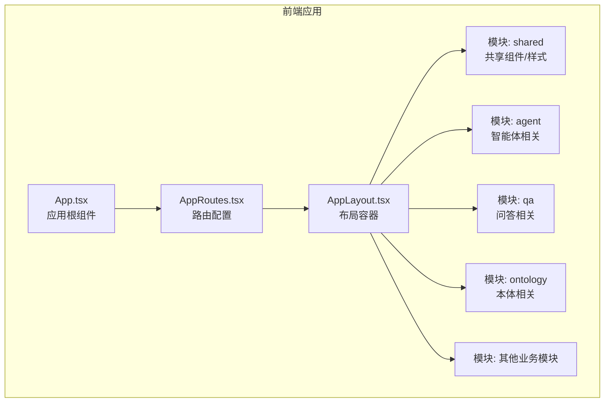
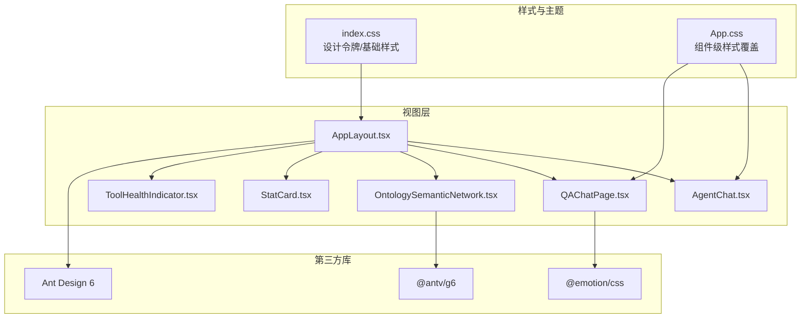
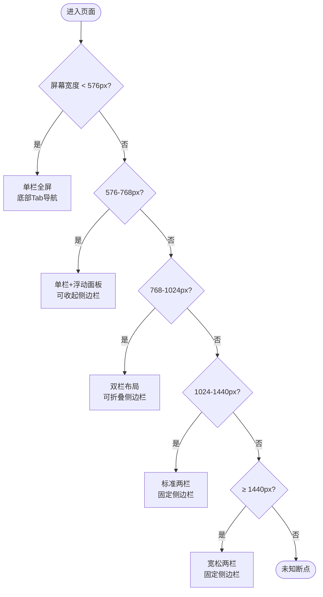
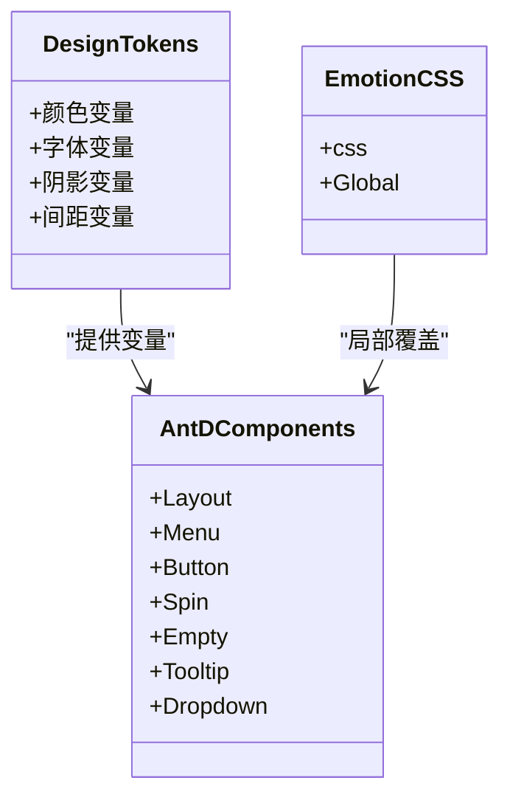
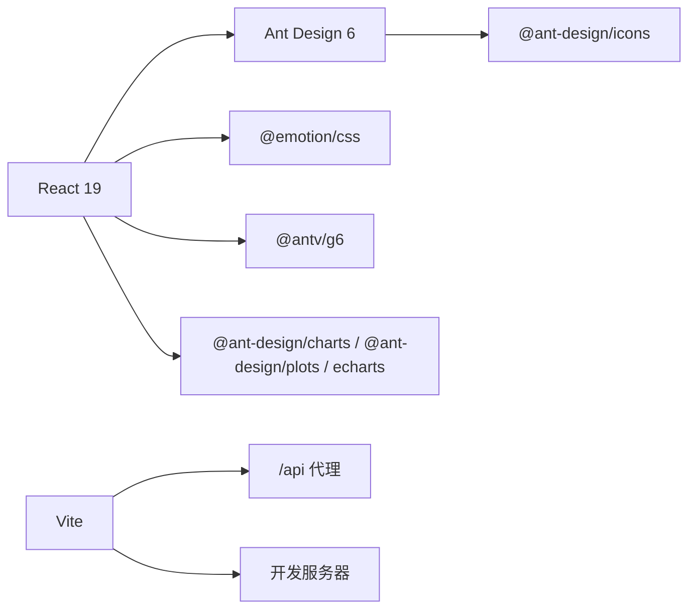

# UI设计系统

<cite>
**本文引用的文件**
- [MOBILE_FIRST_DESIGN.md](file://docs/04-ui/MOBILE_FIRST_DESIGN.md)
- [FRONTEND_COMPONENT_DESIGN.md](file://docs/04-ui/FRONTEND_COMPONENT_DESIGN.md)
- [COMPONENT_SPEC.md](file://docs/04-ui/COMPONENT_SPEC.md)
- [README.md](file://docs/04-ui/README.md)
- [index.css](file://frontend/src/index.css)
- [App.css](file://frontend/src/App.css)
- [AppLayout.tsx](file://frontend/src/modules/shared/components/AppLayout.tsx)
- [QAChatPage.tsx](file://frontend/src/modules/qa/pages/QAChatPage.tsx)
- [AgentChat.tsx](file://frontend/src/modules/agent/pages/AgentChat.tsx)
- [OntologySemanticNetwork.tsx](file://frontend/src/modules/ontology/components/OntologySemanticNetwork.tsx)
- [SessionDrawer.tsx](file://frontend/src/modules/qa/components/SessionDrawer.tsx)
- [StatCard.tsx](file://frontend/src/modules/shared/components/StatCard.tsx)
- [ToolHealthIndicator.tsx](file://frontend/src/modules/shared/components/ToolHealthIndicator.tsx)
- [package.json](file://frontend/package.json)
- [vite.config.ts](file://frontend/vite.config.ts)
</cite>

## 目录
1. [简介](#简介)
2. [项目结构](#项目结构)
3. [核心组件](#核心组件)
4. [架构总览](#架构总览)
5. [详细组件分析](#详细组件分析)
6. [依赖分析](#依赖分析)
7. [性能考虑](#性能考虑)
8. [故障排查指南](#故障排查指南)
9. [结论](#结论)
10. [附录](#附录)

## 简介
本文件面向ODAP前端UI设计系统，围绕“移动优先”理念，系统性阐述响应式布局策略、断点设计与移动端适配；介绍Ant Design组件库的使用规范、主题与样式覆盖策略；明确颜色系统、字体规范、间距与动画效果；解释图标系统、图片资源管理与本地化支持；给出设计令牌（Design Tokens）的使用与维护方法；并提供UI组件的视觉规范、交互行为与无障碍设计指南，以及设计系统的扩展与定制路径。

## 项目结构
前端采用模块化组织，围绕业务域划分模块，共享组件与样式集中于shared目录，页面组件按路由组织，整体遵循“模块-页面-组件”的层次化结构。Ant Design作为基础UI库，结合@emotion/css进行样式覆盖与主题化。

**图表来源**
- [FRONTEND_COMPONENT_DESIGN.md:26-53](file://docs/04-ui/FRONTEND_COMPONENT_DESIGN.md#L26-L53)
- [AppLayout.tsx:1-63](file://frontend/src/modules/shared/components/AppLayout.tsx#L1-L63)

**章节来源**
- [FRONTEND_COMPONENT_DESIGN.md:26-53](file://docs/04-ui/FRONTEND_COMPONENT_DESIGN.md#L26-L53)

## 核心组件
- 布局容器：AppLayout负责Header/Sider/Content的整体布局，承载导航、工作空间切换与内容区域。
- 页面组件：如AgentChat、QAChatPage等，承担具体业务交互与数据展示。
- 可视化组件：OntologySemanticNetwork集成AntV G6用于本体语义网络可视化。
- 通用组件：StatCard、ToolHealthIndicator等用于状态与健康度展示。

**章节来源**
- [AppLayout.tsx:1-63](file://frontend/src/modules/shared/components/AppLayout.tsx#L1-L63)
- [QAChatPage.tsx:1-44](file://frontend/src/modules/qa/pages/QAChatPage.tsx#L1-L44)
- [AgentChat.tsx:1-39](file://frontend/src/modules/agent/pages/AgentChat.tsx#L1-L39)
- [OntologySemanticNetwork.tsx:1-54](file://frontend/src/modules/ontology/components/OntologySemanticNetwork.tsx#L1-L54)
- [StatCard.tsx:1-48](file://frontend/src/modules/shared/components/StatCard.tsx#L1-L48)
- [ToolHealthIndicator.tsx:1-50](file://frontend/src/modules/shared/components/ToolHealthIndicator.tsx#L1-L50)

## 架构总览
ODAP前端采用“布局容器 + 模块化页面 + 通用组件 + 可视化库”的分层架构。Ant Design提供基础UI能力，AntV G6提供图谱可视化，@emotion/css用于样式覆盖与主题化，React Router负责路由编排。

**图表来源**
- [AppLayout.tsx:1-63](file://frontend/src/modules/shared/components/AppLayout.tsx#L1-L63)
- [AgentChat.tsx:1-39](file://frontend/src/modules/agent/pages/AgentChat.tsx#L1-L39)
- [QAChatPage.tsx:1-44](file://frontend/src/modules/qa/pages/QAChatPage.tsx#L1-L44)
- [OntologySemanticNetwork.tsx:1-54](file://frontend/src/modules/ontology/components/OntologySemanticNetwork.tsx#L1-L54)
- [StatCard.tsx:1-48](file://frontend/src/modules/shared/components/StatCard.tsx#L1-L48)
- [ToolHealthIndicator.tsx:1-50](file://frontend/src/modules/shared/components/ToolHealthIndicator.tsx#L1-L50)
- [index.css:1-112](file://frontend/src/index.css#L1-L112)
- [App.css:1-185](file://frontend/src/App.css#L1-L185)

## 详细组件分析

### 响应式布局与断点设计
- 移动优先策略：以手机端为核心，逐步在平板、桌面端增强布局与交互复杂度。
- 断点与布局：
  - 手机：< 576px，单栏全屏，底部Tab导航
  - 平板竖屏：576-768px，单栏+浮动面板，可收起侧边栏
  - 平板横屏：768-1024px，双栏布局，可折叠侧边栏
  - 桌面：1024-1440px，标准两栏，固定侧边栏
  - 大屏：≥ 1440px，宽松两栏，固定侧边栏
- 布局变化：Header固定，Sider可折叠，Content区域随断点调整列数与面板布局。

**图表来源**
- [MOBILE_FIRST_DESIGN.md:18-27](file://docs/04-ui/MOBILE_FIRST_DESIGN.md#L18-L27)

**章节来源**
- [MOBILE_FIRST_DESIGN.md:18-27](file://docs/04-ui/MOBILE_FIRST_DESIGN.md#L18-L27)

### Ant Design使用规范与主题配置
- 组件库：Ant Design 6作为基础UI库，广泛使用Layout、Menu、Select、Button、Spin、Empty、Tooltip、Dropdown等组件。
- 主题与样式覆盖：
  - 使用CSS变量作为设计令牌，集中于:root与@media块，支持明暗主题切换。
  - 通过@emotion/css在组件内进行局部样式覆盖，避免全局污染。
  - 建议在共享样式中统一定义变量，页面组件仅消费变量，减少重复覆盖。
- 图标系统：统一使用@ant-design/icons，按需引入，保证图标风格一致。

**图表来源**
- [index.css:1-112](file://frontend/src/index.css#L1-L112)
- [App.css:1-185](file://frontend/src/App.css#L1-L185)
- [AppLayout.tsx:1-63](file://frontend/src/modules/shared/components/AppLayout.tsx#L1-L63)

**章节来源**
- [AppLayout.tsx:1-63](file://frontend/src/modules/shared/components/AppLayout.tsx#L1-L63)
- [index.css:1-112](file://frontend/src/index.css#L1-L112)
- [App.css:1-185](file://frontend/src/App.css#L1-L185)

### 颜色系统与设计令牌
- 设计令牌（Design Tokens）：
  - 文本色、背景色、边框色、强调色、代码背景、阴影等均通过CSS变量集中管理。
  - 明暗主题：在prefers-color-scheme: dark下自动切换深色变量集，确保对比度与可读性。
- 建议：
  - 将tokens抽取至独立文件，页面组件仅消费变量，避免硬编码颜色。
  - 在Ant Design主题配置中同步tokens，确保组件状态色与业务色一致。

**章节来源**
- [index.css:1-112](file://frontend/src/index.css#L1-L112)

### 字体规范与间距标准
- 字体族：系统字体栈，支持粗细与字号在不同断点下的自适应。
- 间距：采用紧凑的栅格与内边距，配合媒体查询在小屏上减小间距，提升可读性。
- 建议：
  - 统一使用rem/em进行相对单位，确保缩放一致性。
  - 在组件中通过变量控制内外边距，避免散落的像素值。

**章节来源**
- [index.css:14-31](file://frontend/src/index.css#L14-L31)
- [App.css:59-96](file://frontend/src/App.css#L59-L96)

### 动画与交互反馈
- 骨架屏：使用渐变动画模拟加载，提升感知性能。
- 交互反馈：Hover、Focus、Active状态通过过渡与阴影增强反馈。
- 建议：
  - 为关键交互设置统一的过渡时长与缓动函数，保持流畅一致。
  - 在移动端启用触摸反馈，在桌面端保留鼠标悬停与键盘可达性。

**章节来源**
- [COMPONENT_SPEC.md:438-451](file://docs/04-ui/COMPONENT_SPEC.md#L438-L451)
- [App.css:1-18](file://frontend/src/App.css#L1-L18)

### 图标系统与图片资源管理
- 图标：统一使用@ant-design/icons，按业务语义引入，避免混用第三方图标库。
- 图片：通过静态资源目录管理，建议使用矢量图标与响应式图片，降低带宽与渲染压力。
- 建议：
  - 图标尺寸与主题色保持一致，必要时通过CSS变量覆盖。
  - 图片资源按需懒加载，移动端优先使用WebP格式。

**章节来源**
- [package.json:15-33](file://frontend/package.json#L15-L33)

### 本地化支持
- 文本：界面文本统一通过i18n键值管理，避免硬编码字符串。
- 数字/日期/货币：根据语言环境格式化，确保跨地域一致性。
- RTL预留：使用logical properties（如margin-inline-start/padding-inline-end）为RTL布局预留兼容。

**章节来源**
- [MOBILE_FIRST_DESIGN.md:156-187](file://docs/04-ui/MOBILE_FIRST_DESIGN.md#L156-L187)

### 设计系统扩展与定制
- 组件扩展：在shared/components中沉淀通用组件，形成“页面组件 → 通用组件 → AntD基础组件”的复用链路。
- 主题扩展：在index.css中新增tokens，并在暗色模式下同步更新；必要时通过AntD主题变量覆盖。
- 可视化扩展：在OntologySemanticNetwork等组件中抽象配置，支持多布局与交互模式切换。

**章节来源**
- [FRONTEND_COMPONENT_DESIGN.md:551-596](file://docs/04-ui/FRONTEND_COMPONENT_DESIGN.md#L551-L596)

## 依赖分析
- 技术栈：React 19、Ant Design 6、AntV G6、@emotion/css、Vite、Zustand等。
- 构建与代理：Vite配置代理/api与/health，支持开发期跨域访问后端服务。
- 包体积：当前同时引入多个图表库，建议统一为单一图表库以降低体积。

**图表来源**
- [package.json:15-33](file://frontend/package.json#L15-L33)
- [vite.config.ts:10-45](file://frontend/vite.config.ts#L10-L45)

**章节来源**
- [package.json:15-33](file://frontend/package.json#L15-L33)
- [vite.config.ts:10-45](file://frontend/vite.config.ts#L10-L45)

## 性能考虑
- 首屏加载：移动端3G环境下<3s，桌面端<1.5s；交互响应<100ms（移动端）/<50ms（桌面端）；帧率≥30fps（移动端）/60fps。
- 包体积：建议合并图表库，移除未使用组件，启用Tree Shaking与按需加载。
- 渲染优化：合理使用虚拟列表、懒加载与骨架屏，减少主线程阻塞。

**章节来源**
- [MOBILE_FIRST_DESIGN.md:191-198](file://docs/04-ui/MOBILE_FIRST_DESIGN.md#L191-L198)

## 故障排查指南
- 代理与环境变量：
  - 检查VITE_API_BASE与PROXY_TARGET是否一致，确认代理配置正确。
  - 开发时观察代理日志，定位跨域与转发异常。
- 样式覆盖：
  - 若AntD组件样式被覆盖，检查@emotion/css注入顺序与选择器优先级。
  - 优先使用tokens变量，避免直接修改组件内部样式。
- 组件交互：
  - 对话类组件（如AgentChat、QAChatPage）注意键盘可达性与焦点管理。
  - 图谱组件（如OntologySemanticNetwork）关注缩放与拖拽的性能与反馈。

**章节来源**
- [vite.config.ts:5-44](file://frontend/vite.config.ts#L5-L44)
- [AgentChat.tsx:1-39](file://frontend/src/modules/agent/pages/AgentChat.tsx#L1-L39)
- [QAChatPage.tsx:1-44](file://frontend/src/modules/qa/pages/QAChatPage.tsx#L1-L44)
- [OntologySemanticNetwork.tsx:1-54](file://frontend/src/modules/ontology/components/OntologySemanticNetwork.tsx#L1-L54)

## 结论
ODAP前端UI设计系统以移动优先为核心，结合Ant Design与AntV G6构建了可扩展的可视化界面。通过设计令牌与主题变量统一风格，借助@emotion/css实现局部覆盖，辅以清晰的模块化结构与组件层级，满足多终端与多业务场景需求。后续可在包体积优化、组件拆分与测试完善方面持续改进。

## 附录
- 相关文档索引与设计系统概览见UI设计文档清单与README。

**章节来源**
- [README.md:8-23](file://docs/04-ui/README.md#L8-L23)