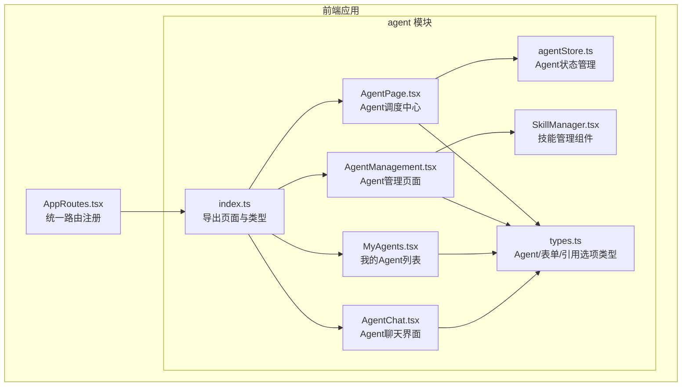
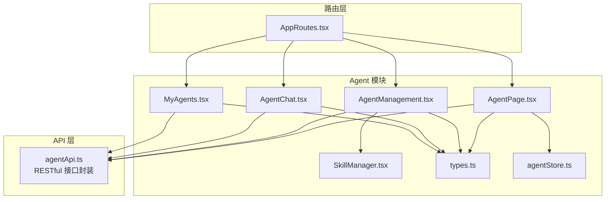
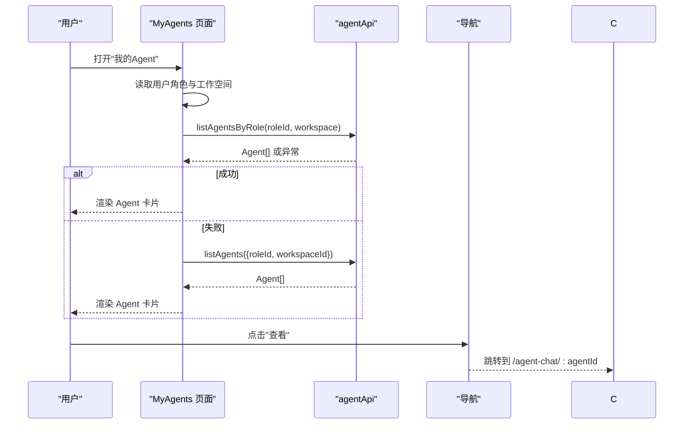
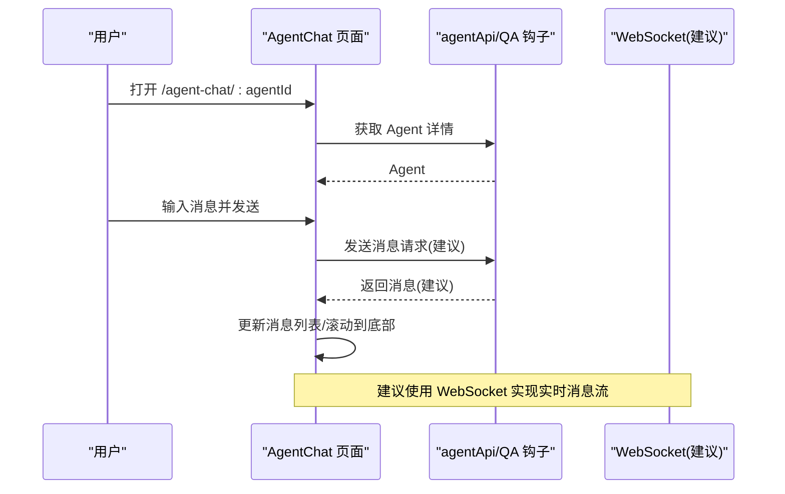
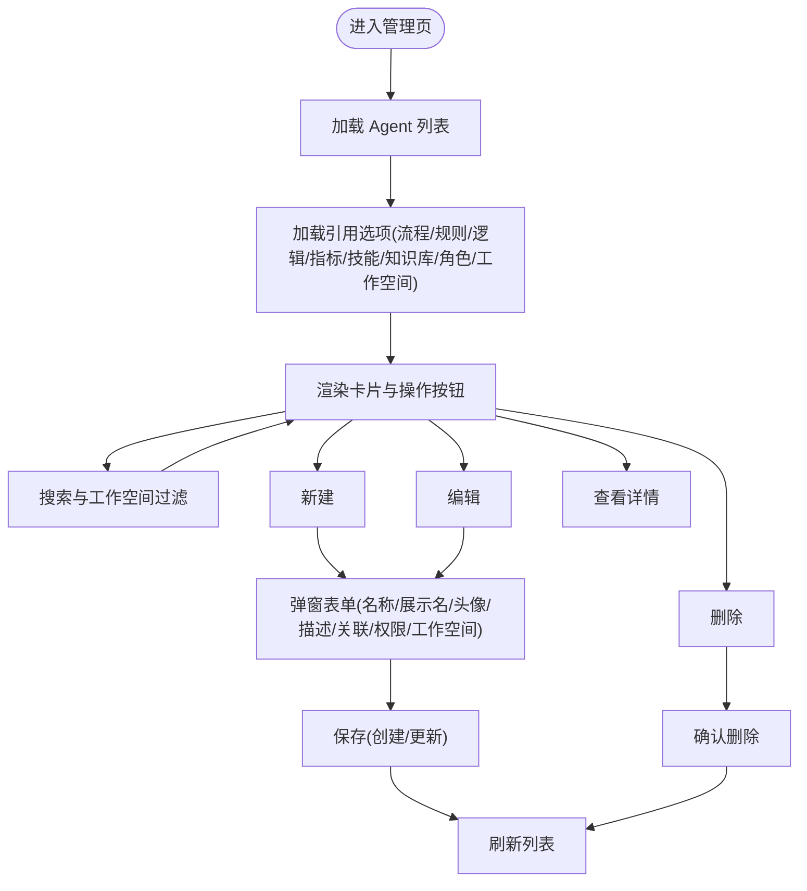
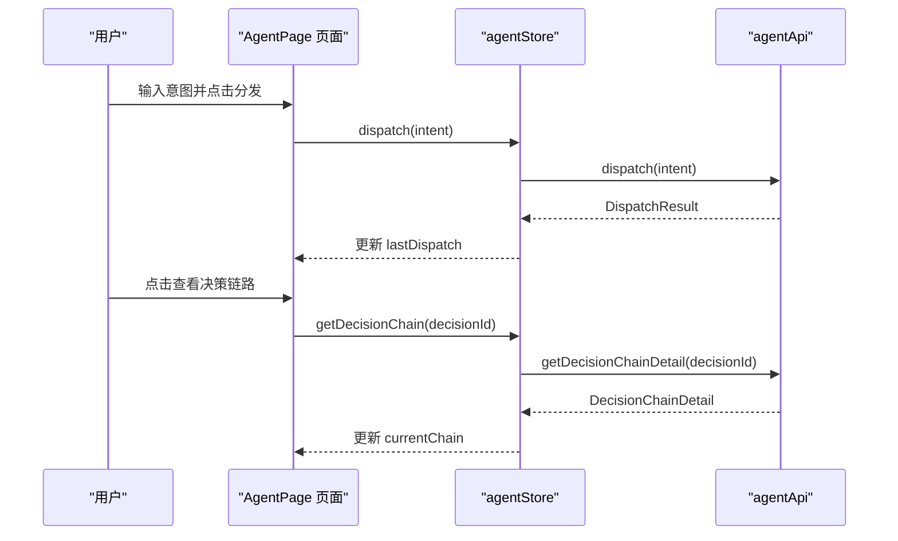
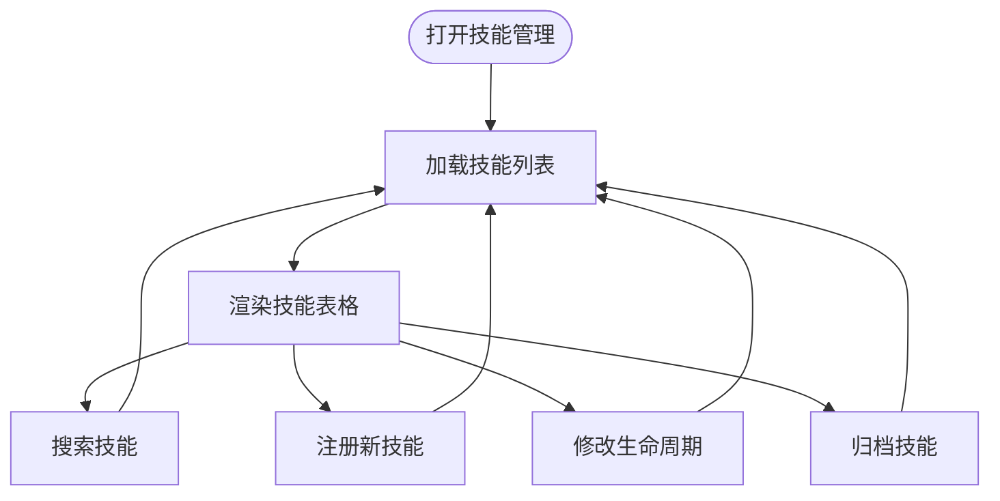
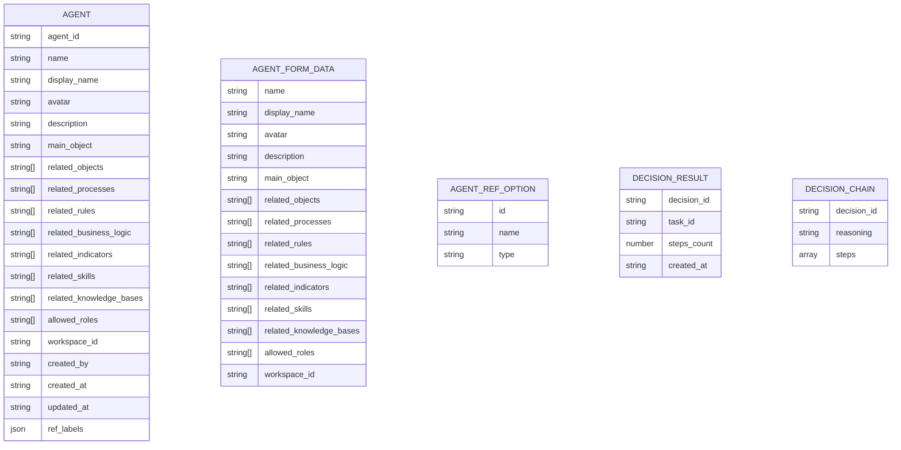
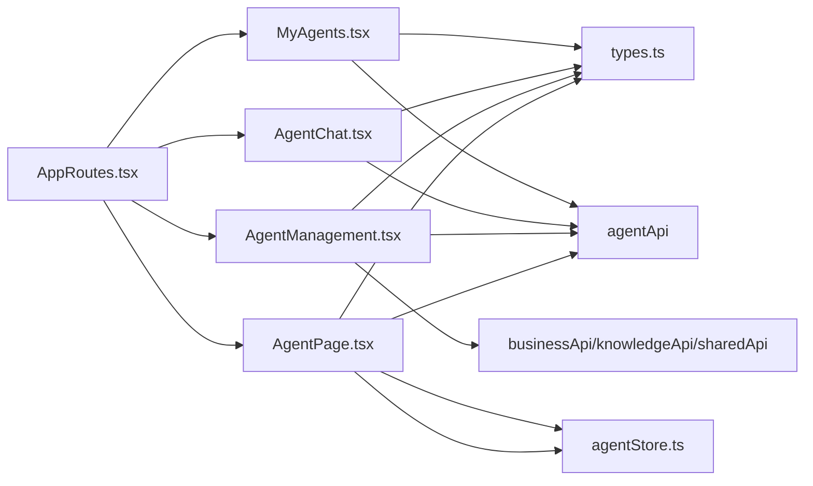

# Agent模块

<cite>
**本文引用的文件**
- [AppRoutes.tsx](file://frontend/src/AppRoutes.tsx)
- [index.ts](file://frontend/src/modules/agent/index.ts)
- [types.ts](file://frontend/src/modules/agent/types.ts)
- [MyAgents.tsx](file://frontend/src/modules/agent/pages/MyAgents.tsx)
- [AgentChat.tsx](file://frontend/src/modules/agent/pages/AgentChat.tsx)
- [AgentManagement.tsx](file://frontend/src/modules/agent/pages/AgentManagement.tsx)
- [AgentPage.tsx](file://frontend/src/modules/agent/pages/AgentPage.tsx)
- [SkillManager.tsx](file://frontend/src/modules/agent/components/SkillManager.tsx)
- [agentStore.ts](file://frontend/src/modules/agent/stores/agentStore.ts)
- [FRONTEND_COMPONENT_DESIGN.md](file://docs/04-ui/FRONTEND_COMPONENT_DESIGN.md)
</cite>

## 目录
1. [简介](#简介)
2. [项目结构](#项目结构)
3. [核心组件](#核心组件)
4. [架构总览](#架构总览)
5. [详细组件分析](#详细组件分析)
6. [依赖关系分析](#依赖关系分析)
7. [性能考虑](#性能考虑)
8. [故障排查指南](#故障排查指南)
9. [结论](#结论)
10. [附录](#附录)

## 简介
本文件面向前端开发者与产品人员，系统性梳理 Agent 模块在前端的实现，覆盖以下方面：
- Agent 聊天界面、Agent 管理页面、我的 Agent 页面、Agent调度中心页面的实现与交互
- Agent 通信机制、消息处理与状态管理思路
- Agent API 服务的设计与实现要点（RESTful 接口调用与 WebSocket 连接建议）
- Agent 类型定义与数据模型
- 页面组件结构、路由配置与用户交互流程
- 实际聊天界面实现示例与 API 调用示例（以路径标注形式呈现）

## 项目结构
Agent 模块位于前端工程的模块化目录中，采用"按页面组织"的结构，配合统一的路由注册与类型导出。

**图表来源**
- [AppRoutes.tsx:1-61](file://frontend/src/AppRoutes.tsx#L1-L61)
- [index.ts:1-6](file://frontend/src/modules/agent/index.ts#L1-L6)
- [types.ts:1-45](file://frontend/src/modules/agent/types.ts#L1-L45)
- [MyAgents.tsx:1-117](file://frontend/src/modules/agent/pages/MyAgents.tsx#L1-L117)
- [AgentChat.tsx:1-1216](file://frontend/src/modules/agent/pages/AgentChat.tsx#L1-L1216)
- [AgentManagement.tsx:1-617](file://frontend/src/modules/agent/pages/AgentManagement.tsx#L1-L617)
- [AgentPage.tsx:1-152](file://frontend/src/modules/agent/pages/AgentPage.tsx#L1-L152)
- [SkillManager.tsx:1-216](file://frontend/src/modules/agent/components/SkillManager.tsx#L1-L216)
- [agentStore.ts:1-72](file://frontend/src/modules/agent/stores/agentStore.ts#L1-L72)

**章节来源**
- [AppRoutes.tsx:1-61](file://frontend/src/AppRoutes.tsx#L1-L61)
- [index.ts:1-6](file://frontend/src/modules/agent/index.ts#L1-L6)
- [types.ts:1-45](file://frontend/src/modules/agent/types.ts#L1-L45)

## 核心组件
- Agent 类型与表单类型：定义了 Agent 的字段集合、表单提交所需字段以及引用选项类型，用于管理与渲染。
- 我的 Agent 页面：按当前角色与工作空间过滤，展示可用 Agent 列表，并跳转到聊天页。
- Agent 聊天页面：提供侧边会话列表、消息展示区、输入与发送、会话清理等能力。
- Agent 管理页面：提供 Agent 的增删改查、关联业务对象与权限配置、工作空间绑定等。
- Agent 调度中心页面：提供意图分发、决策记录、决策链路查看等功能。
- 技能管理组件：提供技能注册、发现、生命周期管理等能力。
- Agent 状态管理：使用 Zustand 管理 Agent 调度状态、决策链路等。

**章节来源**
- [types.ts:1-45](file://frontend/src/modules/agent/types.ts#L1-L45)
- [MyAgents.tsx:12-117](file://frontend/src/modules/agent/pages/MyAgents.tsx#L12-L117)
- [AgentChat.tsx:1049-1216](file://frontend/src/modules/agent/pages/AgentChat.tsx#L1049-L1216)
- [AgentManagement.tsx:36-617](file://frontend/src/modules/agent/pages/AgentManagement.tsx#L36-L617)
- [AgentPage.tsx:16-152](file://frontend/src/modules/agent/pages/AgentPage.tsx#L16-L152)
- [SkillManager.tsx:35-216](file://frontend/src/modules/agent/components/SkillManager.tsx#L35-L216)
- [agentStore.ts:19-72](file://frontend/src/modules/agent/stores/agentStore.ts#L19-L72)

## 架构总览
Agent 模块的前端架构遵循"页面组件 + 类型定义 + 统一路由"的组织方式。页面组件通过统一的 API 服务访问后端 Agent 能力；聊天页面复用 QA 模块的会话与消息钩子，形成统一的消息处理与渲染。

**图表来源**
- [AppRoutes.tsx:16-58](file://frontend/src/AppRoutes.tsx#L16-L58)
- [MyAgents.tsx:5](file://frontend/src/modules/agent/pages/MyAgents.tsx#L5)
- [AgentChat.tsx:5](file://frontend/src/modules/agent/pages/AgentChat.tsx#L5)
- [AgentManagement.tsx:4](file://frontend/src/modules/agent/pages/AgentManagement.tsx#L4)
- [AgentPage.tsx:4](file://frontend/src/modules/agent/pages/AgentPage.tsx#L4)
- [SkillManager.tsx:4](file://frontend/src/modules/agent/components/SkillManager.tsx#L4)
- [types.ts:1-45](file://frontend/src/modules/agent/types.ts#L1-L45)
- [agentStore.ts:1](file://frontend/src/modules/agent/stores/agentStore.ts#L1)

## 详细组件分析

### 我的 Agent 页面（MyAgents）
- 功能：根据当前用户角色与工作空间获取可用 Agent 列表，支持降级加载（无角色时回退到全量列表）。
- 交互：点击卡片或"查看"按钮跳转至聊天页。
- 状态管理：本地 useState 管理 agents、loading、搜索词等。
- API 调用：通过 agentApi.listAgentsByRole 或 agentApi.listAgents。

**图表来源**
- [MyAgents.tsx:19-40](file://frontend/src/modules/agent/pages/MyAgents.tsx#L19-L40)
- [AppRoutes.tsx:32-33](file://frontend/src/AppRoutes.tsx#L32-L33)

**章节来源**
- [MyAgents.tsx:12-117](file://frontend/src/modules/agent/pages/MyAgents.tsx#L12-L117)
- [AppRoutes.tsx:32-33](file://frontend/src/AppRoutes.tsx#L32-L33)

### Agent 聊天页面（AgentChat）
- 功能：侧边会话列表、消息展示区、输入与发送、会话清理、欢迎引导与建议问题。
- 通信与消息处理：复用 QA 钩子与会话管理，支持消息滚动、加载指示、参考来源展示。
- 状态管理：本地 useState 管理 agent、messages、inputText、loading 等。
- API 调用：通过 agentApi 获取 Agent 信息；聊天发送逻辑预留（当前示例中使用延时模拟）。

**图表来源**
- [AgentChat.tsx:1049-1216](file://frontend/src/modules/agent/pages/AgentChat.tsx#L1049-L1216)
- [AgentChat.tsx:630-782](file://frontend/src/modules/agent/pages/AgentChat.tsx#L630-L782)

**章节来源**
- [AgentChat.tsx:1-800](file://frontend/src/modules/agent/pages/AgentChat.tsx#L1-L800)
- [AgentChat.tsx:1049-1216](file://frontend/src/modules/agent/pages/AgentChat.tsx#L1049-L1216)

### Agent 管理页面（AgentManagement）
- 功能：Agent 的增删改查、关联业务对象（实体、流程、规则、逻辑、指标）、技能、知识库、角色、工作空间等配置。
- 交互：搜索与工作空间过滤、弹窗表单、详情查看、批量操作。
- 状态管理：本地 useState 管理 agents、loading、搜索词、表单、各引用选项等。
- API 调用：agentApi.listAgents/createAgent/updateAgent/deleteAgent；业务与共享 API 提供引用选项。

**图表来源**
- [AgentManagement.tsx:60-160](file://frontend/src/modules/agent/pages/AgentManagement.tsx#L60-L160)
- [AgentManagement.tsx:162-230](file://frontend/src/modules/agent/pages/AgentManagement.tsx#L162-L230)

**章节来源**
- [AgentManagement.tsx:1-617](file://frontend/src/modules/agent/pages/AgentManagement.tsx#L1-L617)

### Agent 调度中心页面（AgentPage）
- 功能：提供意图分发、决策记录查看、决策链路追踪等功能。
- 状态管理：使用 Zustand 管理任务、决策、当前链路等状态。
- API 调用：通过 agentApi.dispatch、agentApi.listDecisions、agentApi.getDecisionChainDetail 等接口。

**图表来源**
- [AgentPage.tsx:21-35](file://frontend/src/modules/agent/pages/AgentPage.tsx#L21-L35)
- [agentStore.ts:27-58](file://frontend/src/modules/agent/stores/agentStore.ts#L27-L58)

**章节来源**
- [AgentPage.tsx:16-152](file://frontend/src/modules/agent/pages/AgentPage.tsx#L16-L152)
- [agentStore.ts:19-72](file://frontend/src/modules/agent/stores/agentStore.ts#L19-L72)

### 技能管理组件（SkillManager）
- 功能：技能注册、发现、生命周期管理、版本控制等。
- 交互：搜索技能、注册新技能、修改技能状态、归档技能。
- 状态管理：本地 useState 管理技能列表、搜索条件、表单状态等。
- API 调用：通过 fetchJson 调用技能管理 API。

**图表来源**
- [SkillManager.tsx:42-56](file://frontend/src/modules/agent/components/SkillManager.tsx#L42-L56)
- [SkillManager.tsx:117-153](file://frontend/src/modules/agent/components/SkillManager.tsx#L117-L153)

**章节来源**
- [SkillManager.tsx:35-216](file://frontend/src/modules/agent/components/SkillManager.tsx#L35-L216)

### 类型定义与数据模型
- Agent：包含标识、名称、展示名、头像、描述、主对象、关联对象、关联业务、关联技能、关联知识库、允许角色、工作空间、创建者与时间戳、引用标签映射等。
- AgentFormData：用于表单提交的 Agent 字段集合。
- AgentRefOption：引用选项的通用结构，支持多种类型。
- 决策相关类型：包含决策列表、决策链路详情、任务状态等。

**图表来源**
- [types.ts:1-45](file://frontend/src/modules/agent/types.ts#L1-L45)

**章节来源**
- [types.ts:1-45](file://frontend/src/modules/agent/types.ts#L1-L45)

## 依赖关系分析
- 路由依赖：AppRoutes 将 agent 模块的四个页面注册到统一路由树，支持默认页与受保护路由。
- 组件依赖：页面组件依赖 agentApi 与共享 API，聊天页额外依赖 QA 钩子与会话管理。
- 状态管理依赖：AgentPage 依赖 agentStore 进行状态管理。
- 类型依赖：页面组件与类型文件强耦合，确保数据结构一致。

**图表来源**
- [AppRoutes.tsx:16-58](file://frontend/src/AppRoutes.tsx#L16-L58)
- [MyAgents.tsx:5](file://frontend/src/modules/agent/pages/MyAgents.tsx#L5)
- [AgentChat.tsx:5](file://frontend/src/modules/agent/pages/AgentChat.tsx#L5)
- [AgentManagement.tsx:4-8](file://frontend/src/modules/agent/pages/AgentManagement.tsx#L4-L8)
- [AgentPage.tsx:4](file://frontend/src/modules/agent/pages/AgentPage.tsx#L4)
- [agentStore.ts:1](file://frontend/src/modules/agent/stores/agentStore.ts#L1)
- [types.ts:1-45](file://frontend/src/modules/agent/types.ts#L1-L45)

**章节来源**
- [AppRoutes.tsx:16-58](file://frontend/src/AppRoutes.tsx#L16-L58)
- [AgentManagement.tsx:4-8](file://frontend/src/modules/agent/pages/AgentManagement.tsx#L4-L8)

## 性能考虑
- 列表渲染：使用分页与虚拟滚动（建议）减少 DOM 节点数量。
- 图片与头像：懒加载与尺寸控制，避免阻塞主线程。
- 请求合并：管理页加载引用选项时使用并发 Promise，降低等待时间。
- 缓存策略：聊天输入历史本地持久化，提升交互体验。
- 渲染优化：消息列表自动滚动至底部，避免重复计算高度。
- 状态管理：使用 Zustand 进行局部状态管理，避免全局状态污染。

[本节为通用指导，无需特定文件引用]

## 故障排查指南
- 路由无法访问：检查 AppRoutes 中是否正确导入与注册 agent 页面。
- 无 Agent 数据：确认 MyAgents 是否正确传入角色与工作空间参数；若无角色，检查降级逻辑。
- 表单保存失败：查看 AgentManagement 的错误提示与控制台输出，确认字段校验与 API 返回。
- 聊天发送无响应：当前示例使用延时模拟，需对接真实 API 或 WebSocket。
- 调度中心无数据：检查 agentStore 的状态更新和 API 调用是否正常。
- 技能管理异常：确认技能 API 可用性和网络请求状态。

**章节来源**
- [AppRoutes.tsx:19-25](file://frontend/src/AppRoutes.tsx#L19-L25)
- [MyAgents.tsx:23-40](file://frontend/src/modules/agent/pages/MyAgents.tsx#L23-L40)
- [AgentManagement.tsx:214-230](file://frontend/src/modules/agent/pages/AgentManagement.tsx#L214-L230)
- [AgentChat.tsx:1200-1216](file://frontend/src/modules/agent/pages/AgentChat.tsx#L1200-L1216)
- [AgentPage.tsx:21-35](file://frontend/src/modules/agent/pages/AgentPage.tsx#L21-L35)

## 结论
Agent 模块前端实现采用清晰的页面分层与类型约束，结合统一路由与 API 服务，实现了从"My Agents"到"Agent Chat"再到"Agent Management"和"Agent Page"的完整闭环。新增的 AgentPage 和 SkillManager 组件进一步完善了 Agent 的管理能力，建议后续接入 WebSocket 以实现真正的实时消息流；管理页面提供了完善的配置能力，便于与业务图谱与权限体系对齐。

[本节为总结性内容，无需特定文件引用]

## 附录

### 路由配置与页面映射
- 默认页与我的 Agent：/ 与 /my-agents
- Agent 聊天：/agent-chat/:agentId
- Agent 管理（后台）：/admin/agents
- Agent 调度中心：/agent-page

**章节来源**
- [AppRoutes.tsx:31-54](file://frontend/src/AppRoutes.tsx#L31-L54)
- [FRONTEND_COMPONENT_DESIGN.md:57-81](file://docs/04-ui/FRONTEND_COMPONENT_DESIGN.md#L57-L81)

### 组件导出与入口
- agent 模块通过 index.ts 导出页面与类型，供路由与业务模块使用。

**章节来源**
- [index.ts:1-6](file://frontend/src/modules/agent/index.ts#L1-L6)

### 实际实现示例与 API 调用示例（路径标注）
- 我的 Agent 列表加载与跳转
  - [MyAgents.tsx:23-40](file://frontend/src/modules/agent/pages/MyAgents.tsx#L23-L40)
  - [MyAgents.tsx:42-44](file://frontend/src/modules/agent/pages/MyAgents.tsx#L42-L44)
- Agent 聊天页面（消息渲染、输入与发送）
  - [AgentChat.tsx:676-782](file://frontend/src/modules/agent/pages/AgentChat.tsx#L676-L782)
  - [AgentChat.tsx:784-800](file://frontend/src/modules/agent/pages/AgentChat.tsx#L784-L800)
  - [AgentChat.tsx:1049-1216](file://frontend/src/modules/agent/pages/AgentChat.tsx#L1049-L1216)
- Agent 管理页面（CRUD 与表单）
  - [AgentManagement.tsx:71-81](file://frontend/src/modules/agent/pages/AgentManagement.tsx#L71-L81)
  - [AgentManagement.tsx:214-230](file://frontend/src/modules/agent/pages/AgentManagement.tsx#L214-L230)
  - [AgentManagement.tsx:351-533](file://frontend/src/modules/agent/pages/AgentManagement.tsx#L351-L533)
- Agent 调度中心（意图分发与决策查看）
  - [AgentPage.tsx:21-35](file://frontend/src/modules/agent/pages/AgentPage.tsx#L21-L35)
  - [AgentPage.tsx:103-116](file://frontend/src/modules/agent/pages/AgentPage.tsx#L103-L116)
- 技能管理组件（技能注册与生命周期管理）
  - [SkillManager.tsx:46-56](file://frontend/src/modules/agent/components/SkillManager.tsx#L46-L56)
  - [SkillManager.tsx:105-115](file://frontend/src/modules/agent/components/SkillManager.tsx#L105-L115)