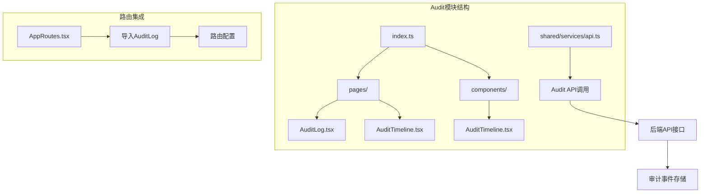
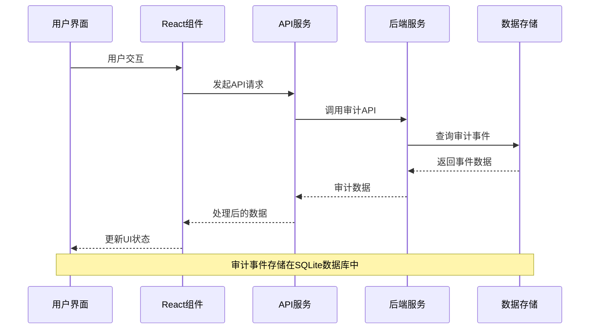
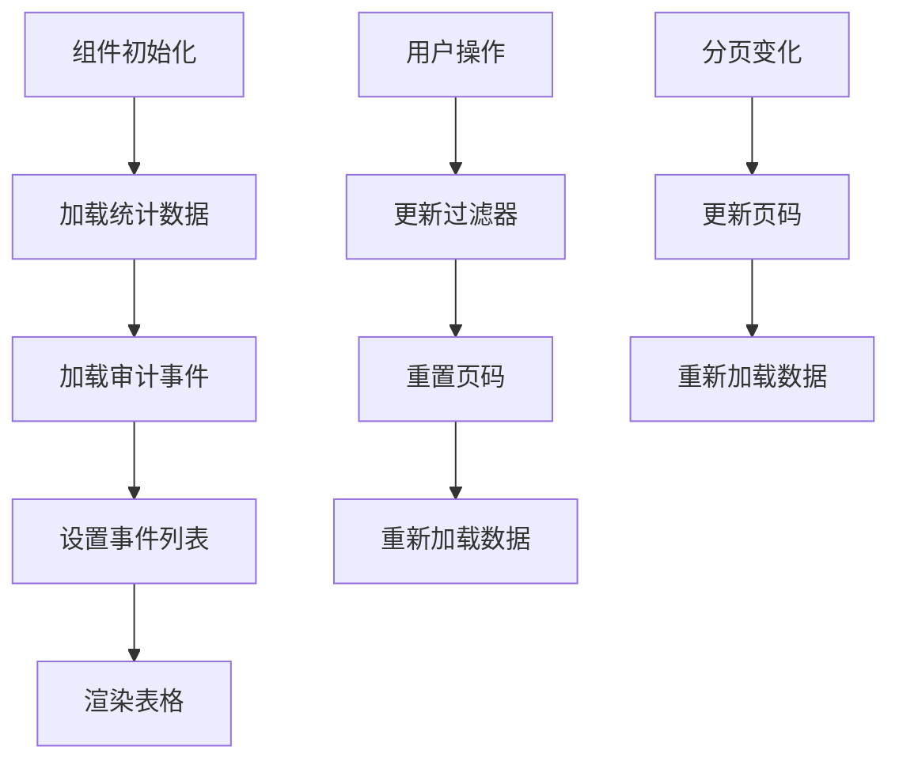
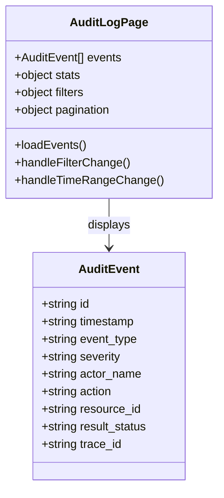
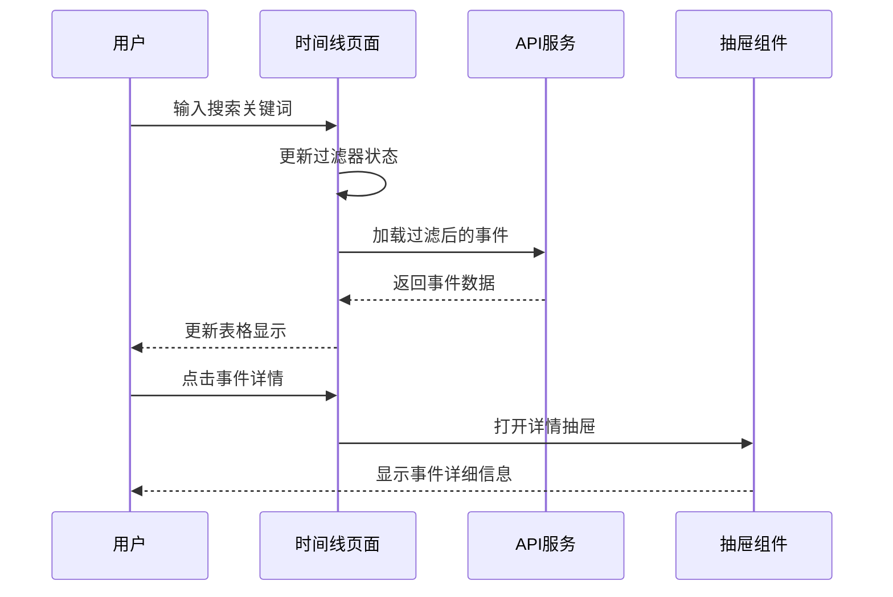
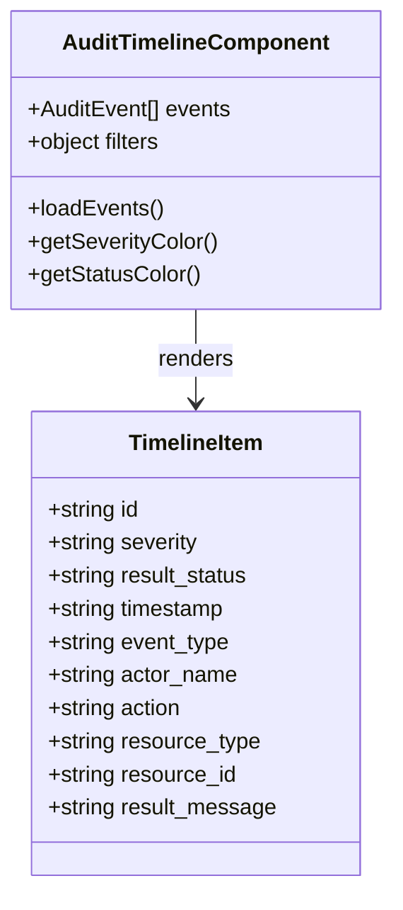
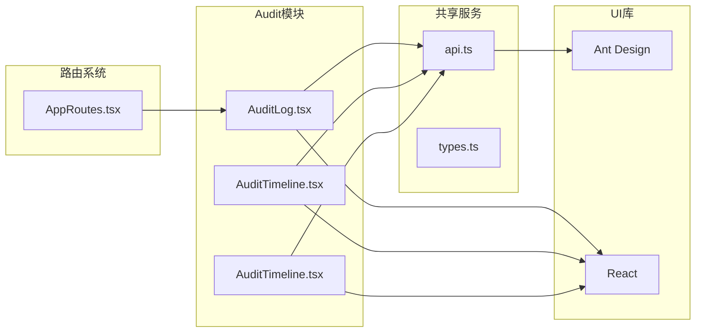
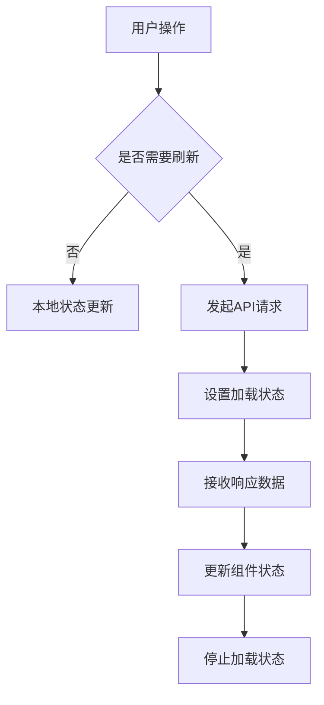

# Audit模块

<cite>
**本文档引用的文件**
- [frontend/src/modules/audit/pages/AuditLog.tsx](file://frontend/src/modules/audit/pages/AuditLog.tsx)
- [frontend/src/modules/audit/pages/AuditTimeline.tsx](file://frontend/src/modules/audit/pages/AuditTimeline.tsx)
- [frontend/src/modules/audit/components/AuditTimeline.tsx](file://frontend/src/modules/audit/components/AuditTimeline.tsx)
- [frontend/src/modules/audit/index.ts](file://frontend/src/modules/audit/index.ts)
- [frontend/src/AppRoutes.tsx](file://frontend/src/AppRoutes.tsx)
- [odap/biz/integration/frontend_compat/api/routes.py](file://odap/biz/integration/frontend_compat/api/routes.py)
- [odap/biz/core/ontology/interfaces/audit.py](file://odap/biz/core/ontology/interfaces/audit.py)
- [docs/03-modules/audit_log/DESIGN.md](file://docs/03-modules/audit_log/DESIGN.md)
- [docs/04-ui/FRONTEND_COMPONENT_DESIGN.md](file://docs/04-ui/FRONTEND_COMPONENT_DESIGN.md)
- [tests/integration/test_api_integration.py](file://tests/integration/test_api_integration.py)
</cite>

## 目录
1. [简介](#简介)
2. [项目结构](#项目结构)
3. [核心组件](#核心组件)
4. [架构概览](#架构概览)
5. [详细组件分析](#详细组件分析)
6. [依赖关系分析](#依赖关系分析)
7. [性能考虑](#性能考虑)
8. [故障排除指南](#故障排除指南)
9. [结论](#结论)
10. [附录](#附录)

## 简介

Audit模块是Ontology Graphiti平台中的审计管理系统，负责记录、展示和分析系统中的所有关键操作事件。该模块提供了两种主要的审计视图：详细的审计日志页面和时间线视图，支持多种过滤条件和统计分析功能。

该模块的设计遵循了现代化的前端架构原则，采用了React Hooks模式、Ant Design组件库和TypeScript类型安全，确保了代码的可维护性和用户体验的友好性。

## 项目结构

Audit模块位于前端项目的模块化架构中，采用按功能划分的组织方式：

**图表来源**
- [frontend/src/modules/audit/index.ts:1-2](file://frontend/src/modules/audit/index.ts#L1-L2)
- [frontend/src/modules/audit/pages/AuditLog.tsx:1-325](file://frontend/src/modules/audit/pages/AuditLog.tsx#L1-L325)
- [frontend/src/modules/audit/pages/AuditTimeline.tsx:1-313](file://frontend/src/modules/audit/pages/AuditTimeline.tsx#L1-L313)

**章节来源**
- [frontend/src/modules/audit/index.ts:1-2](file://frontend/src/modules/audit/index.ts#L1-L2)
- [frontend/src/modules/audit/pages/AuditLog.tsx:1-325](file://frontend/src/modules/audit/pages/AuditLog.tsx#L1-L325)
- [frontend/src/modules/audit/pages/AuditTimeline.tsx:1-313](file://frontend/src/modules/audit/pages/AuditTimeline.tsx#L1-L313)

## 核心组件

Audit模块包含三个核心组件，每个组件都有特定的功能和用途：

### 1. 审计日志页面 (AuditLog)
- **功能**: 提供完整的审计事件列表，支持复杂的过滤和分页
- **特性**: 实时统计、详细表格、高级筛选、分页导航
- **数据展示**: 使用Ant Design Table组件展示审计事件的完整信息

### 2. 时间线视图 (AuditTimeline - 页面版)
- **功能**: 以时间顺序展示审计事件，提供更直观的时间维度视图
- **特性**: 统计卡片、搜索功能、严重级别筛选、事件详情抽屉
- **数据展示**: 使用Ant Design Table组件的展开行功能展示详细信息

### 3. 时间线组件 (AuditTimeline - 组件版)
- **功能**: 可复用的时间线展示组件，基于Ant Design Timeline组件
- **特性**: 简化的事件展示、基本过滤功能、响应式设计
- **数据展示**: 使用Timeline.Item组件逐条展示审计事件

**章节来源**
- [frontend/src/modules/audit/pages/AuditLog.tsx:11-325](file://frontend/src/modules/audit/pages/AuditLog.tsx#L11-L325)
- [frontend/src/modules/audit/pages/AuditTimeline.tsx:7-313](file://frontend/src/modules/audit/pages/AuditTimeline.tsx#L7-L313)
- [frontend/src/modules/audit/components/AuditTimeline.tsx:7-138](file://frontend/src/modules/audit/components/AuditTimeline.tsx#L7-L138)

## 架构概览

Audit模块采用分层架构设计，从前端组件到后端API形成了清晰的数据流：

**图表来源**
- [frontend/src/modules/audit/pages/AuditLog.tsx:52-68](file://frontend/src/modules/audit/pages/AuditLog.tsx#L52-L68)
- [frontend/src/modules/audit/pages/AuditTimeline.tsx:28-45](file://frontend/src/modules/audit/pages/AuditTimeline.tsx#L28-L45)

**章节来源**
- [odap/biz/integration/frontend_compat/api/routes.py:428-450](file://odap/biz/integration/frontend_compat/api/routes.py#L428-L450)
- [odap/biz/core/ontology/interfaces/audit.py:90-104](file://odap/biz/core/ontology/interfaces/audit.py#L90-L104)

## 详细组件分析

### 审计日志页面组件分析

AuditLog组件是整个审计模块的核心，提供了最全面的审计事件展示功能：

#### 数据结构和状态管理

组件使用多个useState钩子来管理不同的状态：

**图表来源**
- [frontend/src/modules/audit/pages/AuditLog.tsx:34-41](file://frontend/src/modules/audit/pages/AuditLog.tsx#L34-L41)
- [frontend/src/modules/audit/pages/AuditLog.tsx:29-33](file://frontend/src/modules/audit/pages/AuditLog.tsx#L29-L33)

#### 过滤功能实现

组件支持多种过滤条件，包括事件类型、严重程度和时间范围：

| 过滤类型 | 控制器 | 数据源 | 作用域 |
|---------|--------|--------|--------|
| 事件类型 | Select组件 | eventTypeOptions | 全部事件列表 |
| 严重程度 | Select组件 | severityOptions | 全部事件列表 |
| 时间范围 | RangePicker组件 | dayjs库 | 当前页事件 |
| 分页 | Table组件 | pagination状态 | 事件列表 |

#### 数据展示设计

使用Ant Design Table组件实现响应式数据展示：

**图表来源**
- [frontend/src/modules/audit/pages/AuditLog.tsx:117-178](file://frontend/src/modules/audit/pages/AuditLog.tsx#L117-L178)

**章节来源**
- [frontend/src/modules/audit/pages/AuditLog.tsx:11-68](file://frontend/src/modules/audit/pages/AuditLog.tsx#L11-L68)
- [frontend/src/modules/audit/pages/AuditLog.tsx:117-178](file://frontend/src/modules/audit/pages/AuditLog.tsx#L117-L178)

### 时间线视图组件分析

AuditTimeline页面提供了基于时间顺序的审计事件展示：

#### 统计面板设计

组件包含四个统计卡片，提供实时的审计指标：

| 统计指标 | 组件 | 颜色方案 | 用途 |
|---------|------|----------|------|
| 总事件数 | Statistic | 默认 | 整体审计量 |
| 成功事件 | Statistic | 绿色 | 正常操作数量 |
| 失败事件 | Statistic | 红色 | 异常操作数量 |
| 严重事件 | Statistic | 红色 | 关键问题识别 |

#### 交互流程

**图表来源**
- [frontend/src/modules/audit/pages/AuditTimeline.tsx:56-59](file://frontend/src/modules/audit/pages/AuditTimeline.tsx#L56-L59)
- [frontend/src/modules/audit/pages/AuditTimeline.tsx:277-310](file://frontend/src/modules/audit/pages/AuditTimeline.tsx#L277-L310)

**章节来源**
- [frontend/src/modules/audit/pages/AuditTimeline.tsx:7-54](file://frontend/src/modules/audit/pages/AuditTimeline.tsx#L7-L54)
- [frontend/src/modules/audit/pages/AuditTimeline.tsx:96-173](file://frontend/src/modules/audit/pages/AuditTimeline.tsx#L96-L173)

### 可复用时间线组件分析

AuditTimeline组件是模块化的可复用组件：

#### 组件设计模式

**图表来源**
- [frontend/src/modules/audit/components/AuditTimeline.tsx:7-138](file://frontend/src/modules/audit/components/AuditTimeline.tsx#L7-L138)

#### 配置选项

| 属性名 | 类型 | 默认值 | 描述 |
|--------|------|--------|------|
| eventType | string | 'all' | 事件类型过滤器 |
| severity | string | 'all' | 严重程度过滤器 |
| limit | number | 50 | 最大事件数量 |
| className | string | '' | CSS类名 |

**章节来源**
- [frontend/src/modules/audit/components/AuditTimeline.tsx:7-30](file://frontend/src/modules/audit/components/AuditTimeline.tsx#L7-L30)
- [frontend/src/modules/audit/components/AuditTimeline.tsx:51-69](file://frontend/src/modules/audit/components/AuditTimeline.tsx#L51-L69)

## 依赖关系分析

Audit模块的依赖关系相对简单，主要依赖于共享的服务层和Ant Design组件库：

**图表来源**
- [frontend/src/modules/audit/pages/AuditLog.tsx:4](file://frontend/src/modules/audit/pages/AuditLog.tsx#L4)
- [frontend/src/modules/audit/pages/AuditTimeline.tsx:4](file://frontend/src/modules/audit/pages/AuditTimeline.tsx#L4)
- [frontend/src/modules/audit/components/AuditTimeline.tsx:4](file://frontend/src/modules/audit/components/AuditTimeline.tsx#L4)

**章节来源**
- [frontend/src/AppRoutes.tsx:3](file://frontend/src/AppRoutes.tsx#L3)
- [frontend/src/modules/audit/index.ts:1](file://frontend/src/modules/audit/index.ts#L1)

## 性能考虑

### 数据加载优化

1. **分页加载**: 审计日志页面使用分页机制，避免一次性加载大量数据
2. **缓存策略**: 统计数据和事件列表具有适当的缓存机制
3. **防抖处理**: 时间范围选择器具有防抖功能，减少不必要的API调用

### 渲染性能

1. **虚拟滚动**: 大数据集使用虚拟滚动技术提升渲染性能
2. **条件渲染**: 仅在需要时渲染复杂的展开行内容
3. **状态最小化**: 使用精确的状态更新，避免不必要的重新渲染

### API调用优化

**图表来源**
- [frontend/src/modules/audit/pages/AuditLog.tsx:92-95](file://frontend/src/modules/audit/pages/AuditLog.tsx#L92-L95)
- [frontend/src/modules/audit/pages/AuditTimeline.tsx:61-67](file://frontend/src/modules/audit/pages/AuditTimeline.tsx#L61-L67)

## 故障排除指南

### 常见问题及解决方案

#### API调用失败

**症状**: 审计数据无法加载，控制台出现错误信息

**可能原因**:
1. 后端服务不可用
2. 网络连接问题
3. 认证令牌过期

**解决步骤**:
1. 检查后端服务状态
2. 验证网络连接
3. 重新登录系统获取新令牌
4. 查看浏览器开发者工具的Network标签

#### 数据格式错误

**症状**: 事件数据显示异常或组件渲染失败

**可能原因**:
1. API响应格式不符合预期
2. 缺少必要的字段
3. 时间戳格式不正确

**解决步骤**:
1. 检查API响应结构
2. 验证数据类型转换
3. 添加适当的错误边界处理

#### 性能问题

**症状**: 页面加载缓慢或响应迟钝

**可能原因**:
1. 数据量过大
2. 组件渲染复杂度过高
3. 重复的API调用

**解决步骤**:
1. 实施分页加载
2. 优化组件渲染逻辑
3. 添加请求去重机制

**章节来源**
- [frontend/src/modules/audit/pages/AuditLog.tsx:47-67](file://frontend/src/modules/audit/pages/AuditLog.tsx#L47-L67)
- [frontend/src/modules/audit/pages/AuditTimeline.tsx:39-44](file://frontend/src/modules/audit/pages/AuditTimeline.tsx#L39-L44)

## 结论

Audit模块成功实现了企业级审计系统的前端需求，提供了灵活的审计事件展示和分析功能。模块设计具有以下优势：

1. **模块化架构**: 清晰的组件分离和职责划分
2. **用户体验**: 直观的界面设计和流畅的交互体验
3. **可扩展性**: 支持多种过滤条件和自定义配置
4. **性能优化**: 有效的数据加载和渲染优化策略

未来可以考虑的改进方向包括：
- 添加更多高级过滤选项
- 实现审计事件的导出功能
- 增强实时审计监控能力
- 优化移动端用户体验

## 附录

### API接口规范

| 接口名称 | 方法 | 路径 | 功能描述 |
|---------|------|------|----------|
| 获取审计统计 | GET | /api/audit/stats | 获取审计事件统计信息 |
| 获取审计时间线 | GET | /api/audit/timeline | 获取审计事件时间线数据 |
| 列出审计事件 | GET | /api/audit/events | 获取审计事件列表 |

### 审计事件类型

| 事件类型 | 描述 | 严重程度 |
|---------|------|----------|
| user.login | 用户登录 | info |
| user.logout | 用户登出 | info |
| workspace.create | 创建工作空间 | info |
| data.ingest | 数据摄入 | info |
| query.execute | 查询执行 | info |
| system.health | 系统健康 | info |
| system.error | 系统错误 | error |
| skill.execute | 技能执行 | info |
| agent.execute | Agent执行 | info |

### 配置选项参考

| 选项名称 | 类型 | 默认值 | 描述 |
|---------|------|--------|------|
| pageSize | number | 20 | 每页显示的事件数量 |
| severityFilter | string | undefined | 严重程度过滤器 |
| eventTypeFilter | string | undefined | 事件类型过滤器 |
| timeRange | object | undefined | 时间范围过滤器 |