# 审计模块

<cite>
**本文档引用的文件**
- [frontend/src/modules/audit/pages/AuditLog.tsx](file://frontend/src/modules/audit/pages/AuditLog.tsx)
- [frontend/src/modules/audit/pages/AuditTimeline.tsx](file://frontend/src/modules/audit/pages/AuditTimeline.tsx)
- [frontend/src/modules/audit/components/AuditTimeline.tsx](file://frontend/src/modules/audit/components/AuditTimeline.tsx)
- [frontend/src/modules/audit/pages/PolicyPage.tsx](file://frontend/src/modules/audit/pages/PolicyPage.tsx)
- [frontend/src/modules/config/pages/PolicyManagement.tsx](file://frontend/src/modules/config/pages/PolicyManagement.tsx)
- [frontend/src/modules/audit/stores/auditStore.ts](file://frontend/src/modules/audit/stores/auditStore.ts)
- [frontend/src/modules/audit/index.ts](file://frontend/src/modules/audit/index.ts)
- [frontend/src/AppRoutes.tsx](file://frontend/src/AppRoutes.tsx)
- [odap/biz/integration/frontend_compat/api/routes.py](file://odap/biz/integration/frontend_compat/api/routes.py)
- [odap/biz/core/ontology/interfaces/audit.py](file://odap/biz/core/ontology/interfaces/audit.py)
- [docs/03-modules/audit_log/DESIGN.md](file://docs/03-modules/audit_log/DESIGN.md)
- [docs/04-ui/FRONTEND_COMPONENT_DESIGN.md](file://docs/04-ui/FRONTEND_COMPONENT_DESIGN.md)
- [tests/integration/test_api_integration.py](file://tests/integration/test_api_integration.py)
</cite>

## 更新摘要
**所做更改**
- 新增PolicyPage页面的详细文档说明
- 新增Config模块中的PolicyManagement页面文档
- 更新策略管理功能的架构说明
- 增加策略编译、热更新和版本管理功能说明
- 更新路由集成和模块结构

## 目录
1. [简介](#简介)
2. [项目结构](#项目结构)
3. [核心组件](#核心组件)
4. [架构概览](#架构概览)
5. [详细组件分析](#详细组件分析)
6. [策略管理功能](#策略管理功能)
7. [依赖关系分析](#依赖关系分析)
8. [性能考虑](#性能考虑)
9. [故障排除指南](#故障排除指南)
10. [结论](#结论)
11. [附录](#附录)

## 简介

Audit模块是Ontology Graphiti平台中的审计管理系统，负责记录、展示和分析系统中的所有关键操作事件。该模块提供了两种主要的审计视图：详细的审计日志页面和时间线视图，支持多种过滤条件和统计分析功能。

**更新** 新增了策略管理功能，包括PolicyPage和PolicyManagement两个页面，支持策略的创建、编译、热更新和版本管理。

该模块的设计遵循了现代化的前端架构原则，采用了React Hooks模式、Ant Design组件库和TypeScript类型安全，确保了代码的可维护性和用户体验的友好性。

## 项目结构

Audit模块位于前端项目的模块化架构中，采用按功能划分的组织方式：

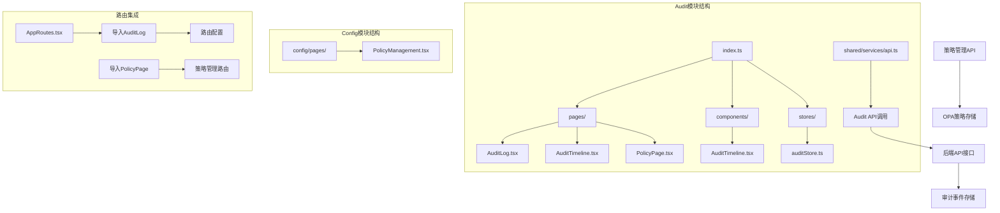

**图表来源**
- [frontend/src/modules/audit/index.ts:1-2](file://frontend/src/modules/audit/index.ts#L1-L2)
- [frontend/src/modules/audit/pages/AuditLog.tsx:1-325](file://frontend/src/modules/audit/pages/AuditLog.tsx#L1-L325)
- [frontend/src/modules/audit/pages/AuditTimeline.tsx:1-313](file://frontend/src/modules/audit/pages/AuditTimeline.tsx#L1-L313)
- [frontend/src/modules/audit/pages/PolicyPage.tsx:1-407](file://frontend/src/modules/audit/pages/PolicyPage.tsx#L1-L407)
- [frontend/src/modules/config/pages/PolicyManagement.tsx:1-471](file://frontend/src/modules/config/pages/PolicyManagement.tsx#L1-L471)

**章节来源**
- [frontend/src/modules/audit/index.ts:1-2](file://frontend/src/modules/audit/index.ts#L1-L2)
- [frontend/src/modules/audit/pages/AuditLog.tsx:1-325](file://frontend/src/modules/audit/pages/AuditLog.tsx#L1-L325)
- [frontend/src/modules/audit/pages/AuditTimeline.tsx:1-313](file://frontend/src/modules/audit/pages/AuditTimeline.tsx#L1-L313)
- [frontend/src/modules/audit/pages/PolicyPage.tsx:1-407](file://frontend/src/modules/audit/pages/PolicyPage.tsx#L1-L407)
- [frontend/src/modules/config/pages/PolicyManagement.tsx:1-471](file://frontend/src/modules/config/pages/PolicyManagement.tsx#L1-L471)

## 核心组件

Audit模块包含四个核心组件，每个组件都有特定的功能和用途：

### 1. 审计日志页面 (AuditLog)
- **功能**: 提供完整的审计事件列表，支持复杂的过滤和分页
- **特性**: 实时统计、详细表格、高级筛选、分页导航
- **数据展示**: 使用Ant Design Table组件展示审计事件的完整信息

### 2. 时间线视图 (AuditTimeline - 页面版)
- **功能**: 以时间顺序展示审计事件，提供更直观的时间维度视图
- **特性**: 统计卡片、搜索功能、严重级别筛选、事件详情抽屉
- **数据展示**: 使用Ant Design Table组件的展开行功能展示详细信息

### 3. 时间线组件 (AuditTimeline - 组件版)
- **功能**: 可复用的时间线展示组件，基于Ant Design Timeline组件
- **特性**: 简化的事件展示、基本过滤功能、响应式设计
- **数据展示**: 使用Timeline.Item组件逐条展示审计事件

### 4. 策略管理页面 (PolicyPage)
- **功能**: 集成的策略管理和审计日志查看页面
- **特性**: 策略创建、编译、热更新、版本历史、审计日志查看
- **数据展示**: 使用Ant Design Tabs组件切换不同功能区域

### 5. 独立策略管理页面 (PolicyManagement)
- **功能**: 专门的OPA策略管理页面
- **特性**: 策略列表管理、详情查看、编辑更新、状态切换
- **数据展示**: 使用Ant Design Table和Modal组件进行策略管理

**章节来源**
- [frontend/src/modules/audit/pages/AuditLog.tsx:11-325](file://frontend/src/modules/audit/pages/AuditLog.tsx#L11-L325)
- [frontend/src/modules/audit/pages/AuditTimeline.tsx:7-313](file://frontend/src/modules/audit/pages/AuditTimeline.tsx#L7-L313)
- [frontend/src/modules/audit/components/AuditTimeline.tsx:7-138](file://frontend/src/modules/audit/components/AuditTimeline.tsx#L7-L138)
- [frontend/src/modules/audit/pages/PolicyPage.tsx:74-407](file://frontend/src/modules/audit/pages/PolicyPage.tsx#L74-L407)
- [frontend/src/modules/config/pages/PolicyManagement.tsx:71-471](file://frontend/src/modules/config/pages/PolicyManagement.tsx#L71-L471)

## 架构概览

Audit模块采用分层架构设计，从前端组件到后端API形成了清晰的数据流：

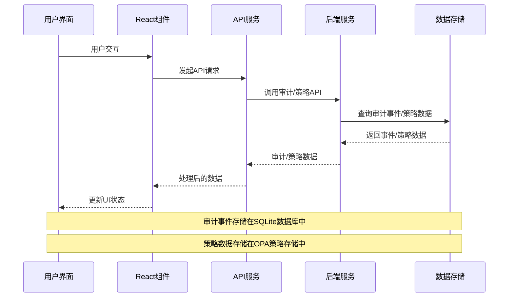

**图表来源**
- [frontend/src/modules/audit/pages/AuditLog.tsx:52-68](file://frontend/src/modules/audit/pages/AuditLog.tsx#L52-L68)
- [frontend/src/modules/audit/pages/AuditTimeline.tsx:28-45](file://frontend/src/modules/audit/pages/AuditTimeline.tsx#L28-L45)
- [frontend/src/modules/audit/stores/auditStore.ts:65-164](file://frontend/src/modules/audit/stores/auditStore.ts#L65-L164)

**章节来源**
- [odap/biz/integration/frontend_compat/api/routes.py:428-450](file://odap/biz/integration/frontend_compat/api/routes.py#L428-L450)
- [odap/biz/core/ontology/interfaces/audit.py:90-104](file://odap/biz/core/ontology/interfaces/audit.py#L90-L104)

## 详细组件分析

### 审计日志页面组件分析

AuditLog组件是整个审计模块的核心，提供了最全面的审计事件展示功能：

#### 数据结构和状态管理

组件使用多个useState钩子来管理不同的状态：

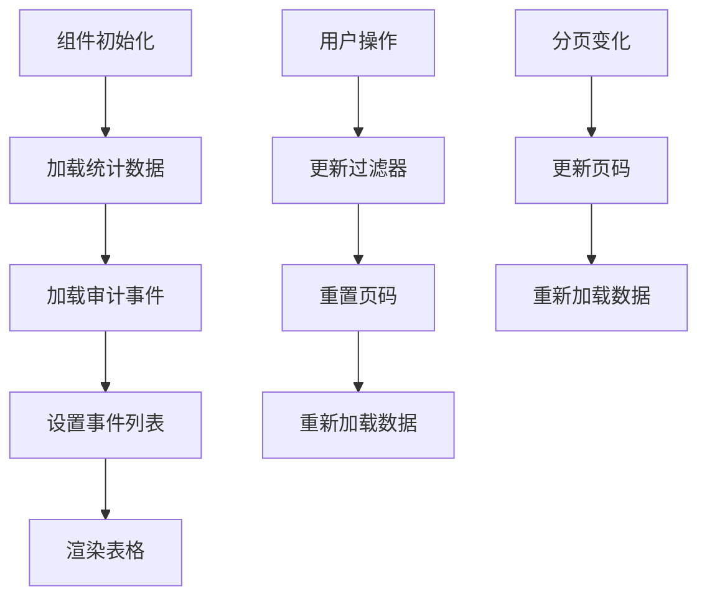

**图表来源**
- [frontend/src/modules/audit/pages/AuditLog.tsx:34-41](file://frontend/src/modules/audit/pages/AuditLog.tsx#L34-L41)
- [frontend/src/modules/audit/pages/AuditLog.tsx:29-33](file://frontend/src/modules/audit/pages/AuditLog.tsx#L29-L33)

#### 过滤功能实现

组件支持多种过滤条件，包括事件类型、严重程度和时间范围：

| 过滤类型 | 控制器 | 数据源 | 作用域 |
|---------|--------|--------|--------|
| 事件类型 | Select组件 | eventTypeOptions | 全部事件列表 |
| 严重程度 | Select组件 | severityOptions | 全部事件列表 |
| 时间范围 | RangePicker组件 | dayjs库 | 当前页事件 |
| 分页 | Table组件 | pagination状态 | 事件列表 |

#### 数据展示设计

使用Ant Design Table组件实现响应式数据展示：

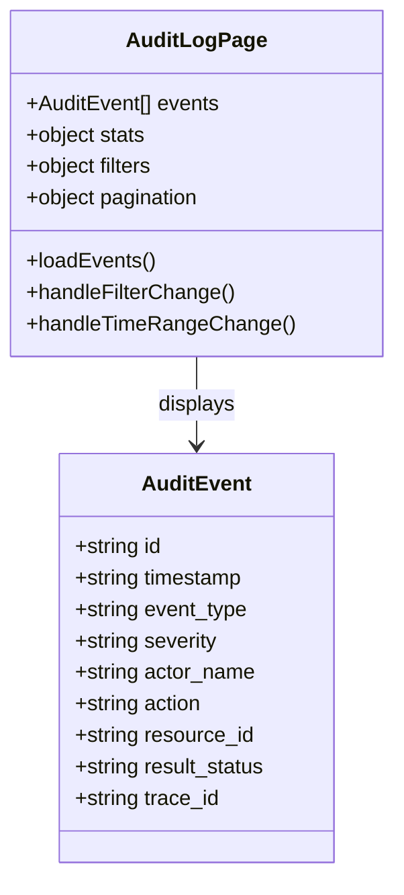

**图表来源**
- [frontend/src/modules/audit/pages/AuditLog.tsx:117-178](file://frontend/src/modules/audit/pages/AuditLog.tsx#L117-L178)

**章节来源**
- [frontend/src/modules/audit/pages/AuditLog.tsx:11-68](file://frontend/src/modules/audit/pages/AuditLog.tsx#L11-L68)
- [frontend/src/modules/audit/pages/AuditLog.tsx:117-178](file://frontend/src/modules/audit/pages/AuditLog.tsx#L117-L178)

### 时间线视图组件分析

AuditTimeline页面提供了基于时间顺序的审计事件展示：

#### 统计面板设计

组件包含四个统计卡片，提供实时的审计指标：

| 统计指标 | 组件 | 颜色方案 | 用途 |
|---------|------|----------|------|
| 总事件数 | Statistic | 默认 | 整体审计量 |
| 成功事件 | Statistic | 绿色 | 正常操作数量 |
| 失败事件 | Statistic | 红色 | 异常操作数量 |
| 严重事件 | Statistic | 红色 | 关键问题识别 |

#### 交互流程

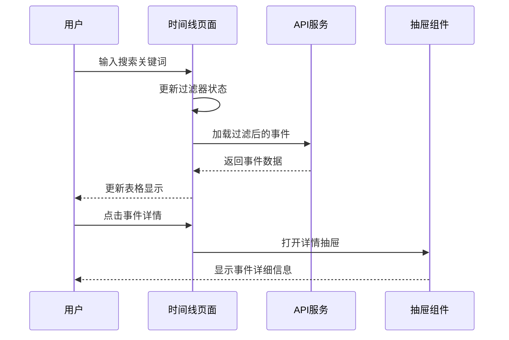

**图表来源**
- [frontend/src/modules/audit/pages/AuditTimeline.tsx:56-59](file://frontend/src/modules/audit/pages/AuditTimeline.tsx#L56-L59)
- [frontend/src/modules/audit/pages/AuditTimeline.tsx:277-310](file://frontend/src/modules/audit/pages/AuditTimeline.tsx#L277-L310)

**章节来源**
- [frontend/src/modules/audit/pages/AuditTimeline.tsx:7-54](file://frontend/src/modules/audit/pages/AuditTimeline.tsx#L7-L54)
- [frontend/src/modules/audit/pages/AuditTimeline.tsx:96-173](file://frontend/src/modules/audit/pages/AuditTimeline.tsx#L96-L173)

### 可复用时间线组件分析

AuditTimeline组件是模块化的可复用组件：

#### 组件设计模式

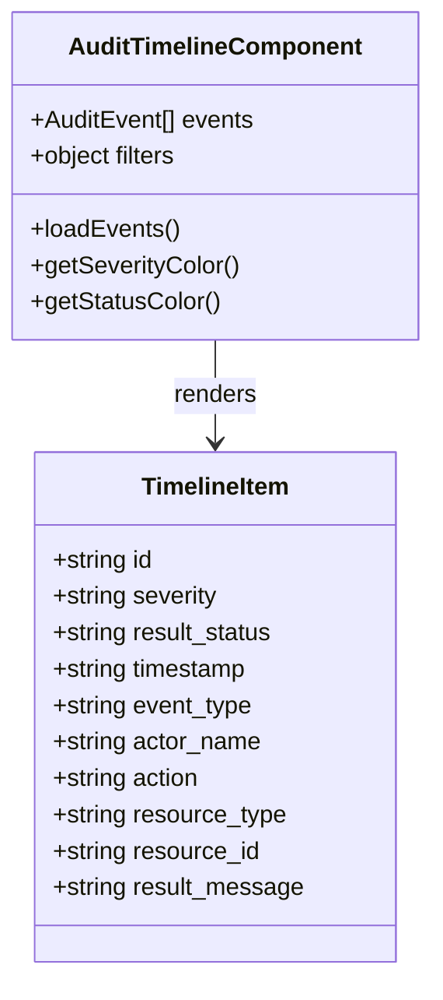

**图表来源**
- [frontend/src/modules/audit/components/AuditTimeline.tsx:7-138](file://frontend/src/modules/audit/components/AuditTimeline.tsx#L7-L138)

#### 配置选项

| 属性名 | 类型 | 默认值 | 描述 |
|--------|------|--------|------|
| eventType | string | 'all' | 事件类型过滤器 |
| severity | string | 'all' | 严重程度过滤器 |
| limit | number | 50 | 最大事件数量 |
| className | string | '' | CSS类名 |

**章节来源**
- [frontend/src/modules/audit/components/AuditTimeline.tsx:7-30](file://frontend/src/modules/audit/components/AuditTimeline.tsx#L7-L30)
- [frontend/src/modules/audit/components/AuditTimeline.tsx:51-69](file://frontend/src/modules/audit/components/AuditTimeline.tsx#L51-L69)

## 策略管理功能

### PolicyPage页面功能分析

PolicyPage是集成的策略管理和审计日志查看页面，提供了完整的策略生命周期管理：

#### 主要功能模块

1. **策略管理区域**
   - 策略列表展示和操作
   - 策略创建和编辑
   - 策略编译和热更新
   - 版本历史查看

2. **审计日志区域**
   - 实时审计日志查看
   - 审计事件过滤和搜索
   - 详细事件信息展示

#### 策略管理流程

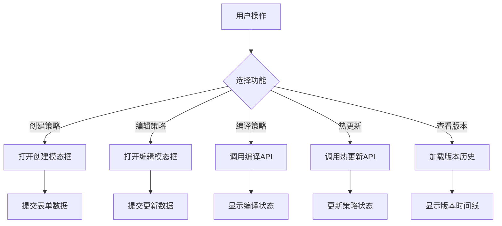

**图表来源**
- [frontend/src/modules/audit/pages/PolicyPage.tsx:109-136](file://frontend/src/modules/audit/pages/PolicyPage.tsx#L109-L136)
- [frontend/src/modules/audit/pages/PolicyPage.tsx:138-142](file://frontend/src/modules/audit/pages/PolicyPage.tsx#L138-L142)

#### 策略状态管理

使用Zustand状态管理库实现全局状态：

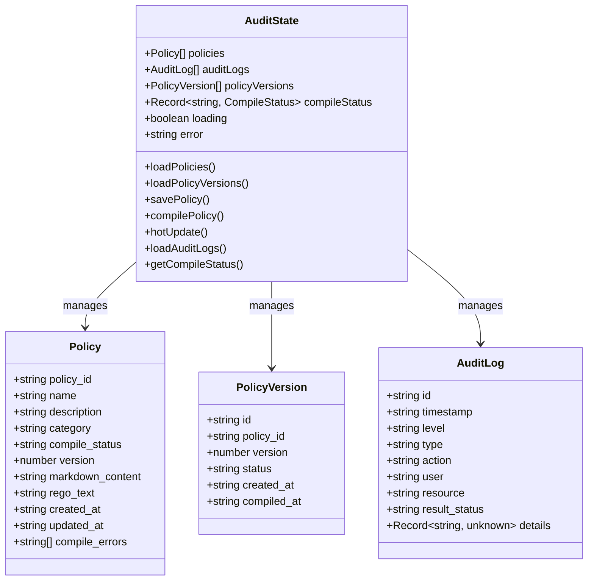

**图表来源**
- [frontend/src/modules/audit/stores/auditStore.ts:40-55](file://frontend/src/modules/audit/stores/auditStore.ts#L40-L55)
- [frontend/src/modules/audit/stores/auditStore.ts:5-26](file://frontend/src/modules/audit/stores/auditStore.ts#L5-L26)

#### 策略分类和状态

| 分类类型 | 中文名称 | 用途描述 |
|---------|---------|----------|
| access_control | 访问控制 | 用户权限和资源访问控制 |
| data_privacy | 数据隐私 | 数据保护和隐私合规 |
| compliance | 合规审计 | 法律法规和内部政策遵循 |
| security | 安全策略 | 系统安全和威胁防护 |
| workflow | 工作流控制 | 业务流程和审批控制 |
| custom | 自定义 | 用户自定义策略规则 |

**章节来源**
- [frontend/src/modules/audit/pages/PolicyPage.tsx:53-72](file://frontend/src/modules/audit/pages/PolicyPage.tsx#L53-L72)
- [frontend/src/modules/audit/pages/PolicyPage.tsx:161-229](file://frontend/src/modules/audit/pages/PolicyPage.tsx#L161-L229)
- [frontend/src/modules/audit/stores/auditStore.ts:40-55](file://frontend/src/modules/audit/stores/auditStore.ts#L40-L55)

### 独立策略管理页面分析

PolicyManagement页面提供了专门的OPA策略管理功能：

#### 功能特性

1. **策略列表管理**
   - 策略状态切换（启用/禁用）
   - 策略详情查看
   - 策略编辑更新

2. **策略创建流程**
   - 表单验证和数据校验
   - Markdown策略内容输入
   - 自动转换为Rego代码

3. **策略详情展示**
   - Markdown策略内容展示
   - 生成的Rego代码查看
   - 策略元数据信息

#### 交互流程

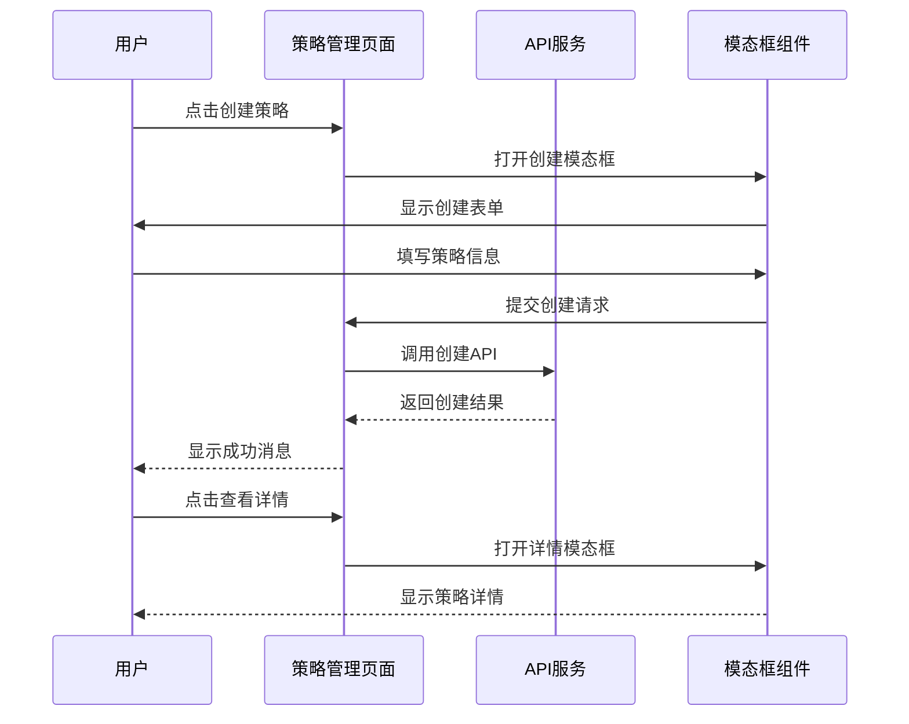

**图表来源**
- [frontend/src/modules/config/pages/PolicyManagement.tsx:100-115](file://frontend/src/modules/config/pages/PolicyManagement.tsx#L100-L115)
- [frontend/src/modules/config/pages/PolicyManagement.tsx:145-157](file://frontend/src/modules/config/pages/PolicyManagement.tsx#L145-L157)

**章节来源**
- [frontend/src/modules/config/pages/PolicyManagement.tsx:71-471](file://frontend/src/modules/config/pages/PolicyManagement.tsx#L71-L471)

## 依赖关系分析

Audit模块的依赖关系相对简单，主要依赖于共享的服务层和Ant Design组件库：

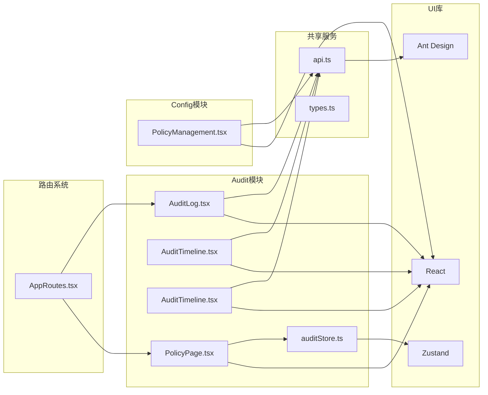

**图表来源**
- [frontend/src/modules/audit/pages/AuditLog.tsx:4](file://frontend/src/modules/audit/pages/AuditLog.tsx#L4)
- [frontend/src/modules/audit/pages/AuditTimeline.tsx:4](file://frontend/src/modules/audit/pages/AuditTimeline.tsx#L4)
- [frontend/src/modules/audit/components/AuditTimeline.tsx:4](file://frontend/src/modules/audit/components/AuditTimeline.tsx#L4)
- [frontend/src/modules/audit/pages/PolicyPage.tsx:36](file://frontend/src/modules/audit/pages/PolicyPage.tsx#L36)
- [frontend/src/modules/audit/stores/auditStore.ts:1](file://frontend/src/modules/audit/stores/auditStore.ts#L1)

**章节来源**
- [frontend/src/AppRoutes.tsx:3](file://frontend/src/AppRoutes.tsx#L3)
- [frontend/src/modules/audit/index.ts:1](file://frontend/src/modules/audit/index.ts#L1)

## 性能考虑

### 数据加载优化

1. **分页加载**: 审计日志页面使用分页机制，避免一次性加载大量数据
2. **缓存策略**: 统计数据和事件列表具有适当的缓存机制
3. **防抖处理**: 时间范围选择器具有防抖功能，减少不必要的API调用
4. **状态管理优化**: 使用Zustand实现高效的状态管理，避免不必要的组件重渲染

### 渲染性能

1. **虚拟滚动**: 大数据集使用虚拟滚动技术提升渲染性能
2. **条件渲染**: 仅在需要时渲染复杂的展开行内容
3. **状态最小化**: 使用精确的状态更新，避免不必要的重新渲染
4. **组件复用**: 可复用组件减少重复渲染开销

### API调用优化

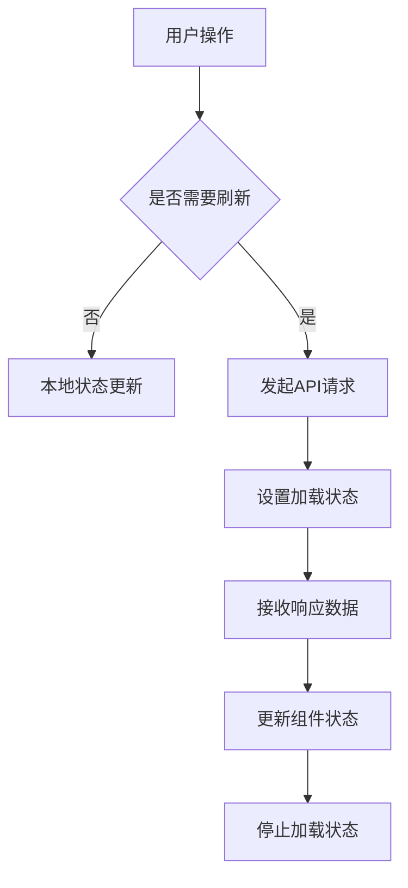

**图表来源**
- [frontend/src/modules/audit/pages/AuditLog.tsx:92-95](file://frontend/src/modules/audit/pages/AuditLog.tsx#L92-L95)
- [frontend/src/modules/audit/pages/AuditTimeline.tsx:61-67](file://frontend/src/modules/audit/pages/AuditTimeline.tsx#L61-L67)
- [frontend/src/modules/audit/stores/auditStore.ts:65-164](file://frontend/src/modules/audit/stores/auditStore.ts#L65-L164)

## 故障排除指南

### 常见问题及解决方案

#### API调用失败

**症状**: 审计数据或策略数据无法加载，控制台出现错误信息

**可能原因**:
1. 后端服务不可用
2. 网络连接问题
3. 认证令牌过期
4. API接口路径错误

**解决步骤**:
1. 检查后端服务状态
2. 验证网络连接
3. 重新登录系统获取新令牌
4. 查看浏览器开发者工具的Network标签
5. 检查API接口URL和参数

#### 数据格式错误

**症状**: 事件数据显示异常或组件渲染失败

**可能原因**:
1. API响应格式不符合预期
2. 缺少必要的字段
3. 时间戳格式不正确
4. 策略内容格式错误

**解决步骤**:
1. 检查API响应结构
2. 验证数据类型转换
3. 添加适当的错误边界处理
4. 验证策略Markdown格式

#### 性能问题

**症状**: 页面加载缓慢或响应迟钝

**可能原因**:
1. 数据量过大
2. 组件渲染复杂度过高
3. 重复的API调用
4. 状态更新过于频繁

**解决步骤**:
1. 实施分页加载
2. 优化组件渲染逻辑
3. 添加请求去重机制
4. 使用Zustand优化状态管理

#### 策略编译失败

**症状**: 策略编译报错或热更新失败

**可能原因**:
1. Markdown策略语法错误
2. 编译器服务异常
3. 策略内容格式不正确
4. 权限不足

**解决步骤**:
1. 检查策略Markdown语法
2. 查看编译错误详情
3. 验证策略内容格式
4. 确认用户权限

**章节来源**
- [frontend/src/modules/audit/pages/AuditLog.tsx:47-67](file://frontend/src/modules/audit/pages/AuditLog.tsx#L47-L67)
- [frontend/src/modules/audit/pages/AuditTimeline.tsx:39-44](file://frontend/src/modules/audit/pages/AuditTimeline.tsx#L39-L44)
- [frontend/src/modules/audit/pages/PolicyPage.tsx:123-131](file://frontend/src/modules/audit/pages/PolicyPage.tsx#L123-L131)

## 结论

Audit模块成功实现了企业级审计系统的前端需求，提供了灵活的审计事件展示和分析功能。**更新** 新增的策略管理功能进一步增强了系统的安全管控能力。

模块设计具有以下优势：

1. **模块化架构**: 清晰的组件分离和职责划分
2. **用户体验**: 直观的界面设计和流畅的交互体验
3. **可扩展性**: 支持多种过滤条件和自定义配置
4. **性能优化**: 有效的数据加载和渲染优化策略
5. **策略管理**: 完整的策略生命周期管理功能

**更新** 新增的PolicyPage和PolicyManagement页面提供了：
- 集成的策略管理和审计查看功能
- 完整的策略编译、热更新和版本管理
- 用户友好的策略编辑和部署界面
- 实时的策略状态监控和审计追踪

未来可以考虑的改进方向包括：
- 添加更多高级过滤选项
- 实现审计事件的导出功能
- 增强实时审计监控能力
- 优化移动端用户体验
- 扩展策略管理的自动化功能

## 附录

### API接口规范

| 接口名称 | 方法 | 路径 | 功能描述 |
|---------|------|------|----------|
| 获取审计统计 | GET | /api/audit/stats | 获取审计事件统计信息 |
| 获取审计时间线 | GET | /api/audit/timeline | 获取审计事件时间线数据 |
| 列出审计事件 | GET | /api/audit/events | 获取审计事件列表 |
| 获取策略列表 | GET | /api/policies | 获取策略列表 |
| 创建策略 | POST | /api/policy/markdown | 创建新的策略 |
| 编译策略 | POST | /api/policy/markdown/{id}/compile | 编译策略为Rego代码 |
| 热更新策略 | PUT | /api/policy/markdown/{id} | 热更新策略内容 |
| 获取策略状态 | GET | /api/policy/markdown/{id}/status | 获取策略编译状态 |
| 获取版本历史 | GET | /api/policy/markdown/{id}/versions | 获取策略版本历史 |

### 审计事件类型

| 事件类型 | 描述 | 严重程度 |
|---------|------|----------|
| user.login | 用户登录 | info |
| user.logout | 用户登出 | info |
| workspace.create | 创建工作空间 | info |
| data.ingest | 数据摄入 | info |
| query.execute | 查询执行 | info |
| system.health | 系统健康 | info |
| system.error | 系统错误 | error |
| skill.execute | 技能执行 | info |
| agent.execute | Agent执行 | info |
| policy.create | 策略创建 | info |
| policy.update | 策略更新 | info |
| policy.compile | 策略编译 | info |
| policy.hot_update | 策略热更新 | info |

### 策略管理配置

| 配置项 | 类型 | 默认值 | 描述 |
|--------|------|--------|------|
| pageSize | number | 10 | 每页显示的策略数量 |
| policyCategories | string[] | 6种分类 | 策略分类选项 |
| maxContentLength | number | 10000 | 策略内容最大长度 |
| compileTimeout | number | 30000 | 编译超时时间(ms) |
| refreshInterval | number | 30000 | 自动刷新间隔(ms) |

### 状态管理配置

| 状态属性 | 类型 | 描述 | 默认值 |
|----------|------|------|--------|
| policies | Policy[] | 策略列表 | [] |
| auditLogs | AuditLog[] | 审计日志 | [] |
| policyVersions | PolicyVersion[] | 策略版本 | [] |
| compileStatus | Record | 编译状态映射 | {} |
| loading | boolean | 加载状态 | false |
| error | string | 错误信息 | null |