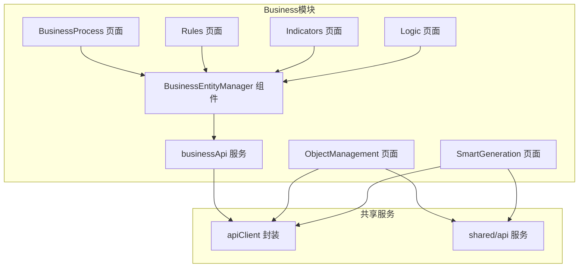
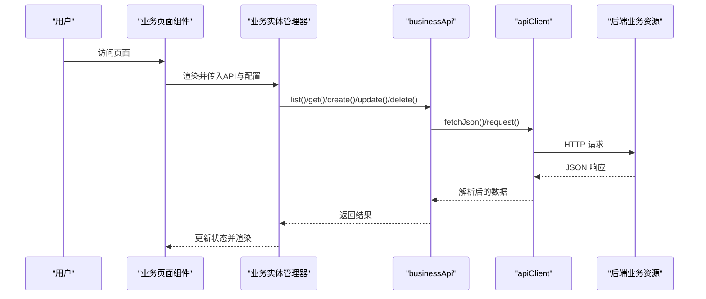
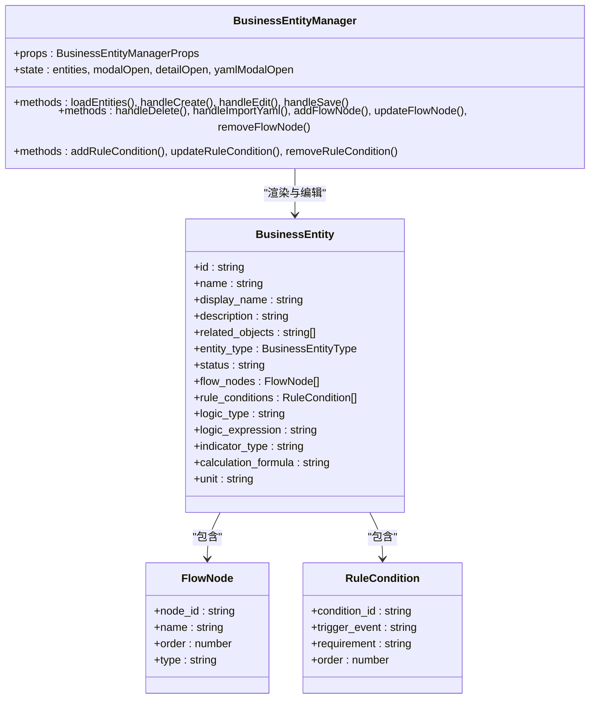
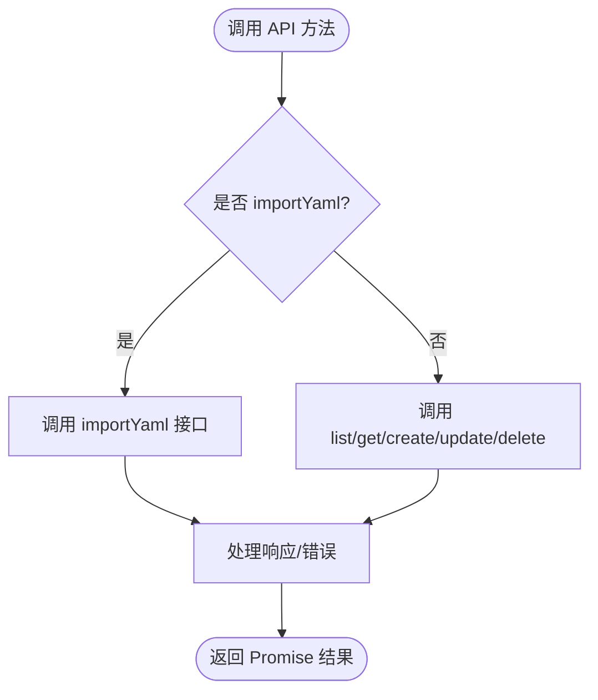
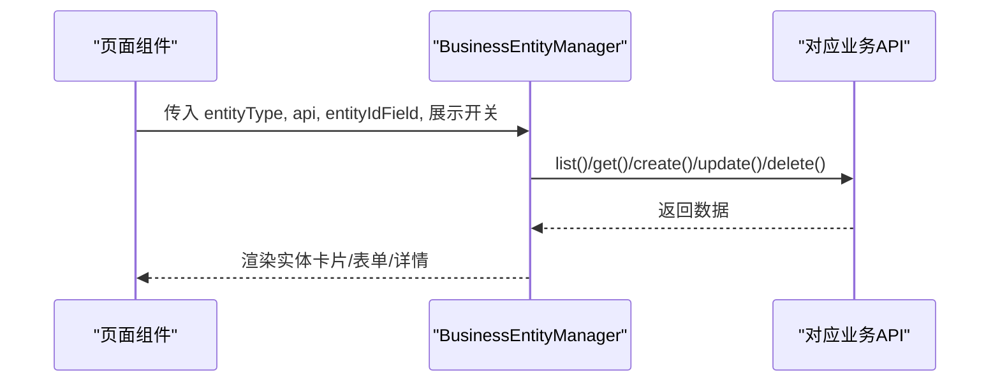
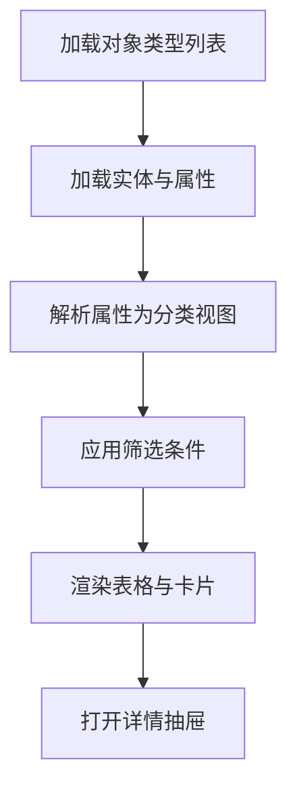
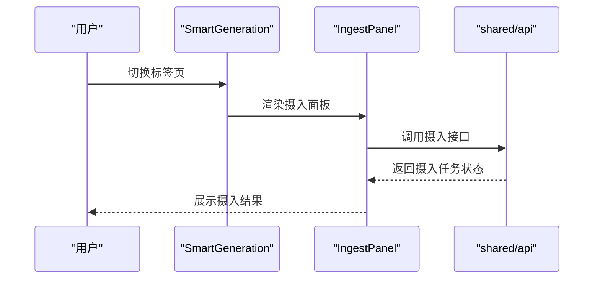
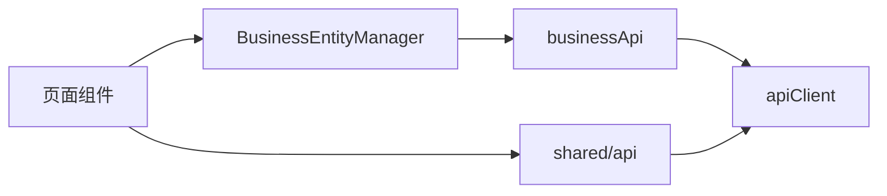

# Business模块

<cite>
**本文引用的文件**
- [frontend/src/modules/business/index.ts](file://frontend/src/modules/business/index.ts)
- [frontend/src/modules/business/types.ts](file://frontend/src/modules/business/types.ts)
- [frontend/src/modules/business/services/businessApi.ts](file://frontend/src/modules/business/services/businessApi.ts)
- [frontend/src/modules/business/pages/BusinessProcess.tsx](file://frontend/src/modules/business/pages/BusinessProcess.tsx)
- [frontend/src/modules/business/pages/Rules.tsx](file://frontend/src/modules/business/pages/Rules.tsx)
- [frontend/src/modules/business/pages/Indicators.tsx](file://frontend/src/modules/business/pages/Indicators.tsx)
- [frontend/src/modules/business/pages/Logic.tsx](file://frontend/src/modules/business/pages/Logic.tsx)
- [frontend/src/modules/business/pages/ObjectManagement.tsx](file://frontend/src/modules/business/pages/ObjectManagement.tsx)
- [frontend/src/modules/business/pages/SmartGeneration.tsx](file://frontend/src/modules/business/pages/SmartGeneration.tsx)
- [frontend/src/modules/business/components/BusinessEntityManager.tsx](file://frontend/src/modules/business/components/BusinessEntityManager.tsx)
- [frontend/src/modules/shared/services/apiClient.ts](file://frontend/src/modules/shared/services/apiClient.ts)
- [frontend/src/modules/shared/services/api.ts](file://frontend/src/modules/shared/services/api.ts)
</cite>

## 目录
1. [简介](#简介)
2. [项目结构](#项目结构)
3. [核心组件](#核心组件)
4. [架构总览](#架构总览)
5. [详细组件分析](#详细组件分析)
6. [依赖分析](#依赖分析)
7. [性能考虑](#性能考虑)
8. [故障排查指南](#故障排查指南)
9. [结论](#结论)
10. [附录](#附录)

## 简介
本文件面向Business模块的前端实现，系统性梳理业务实体管理器、业务流程、指标管理、逻辑规则、对象管理和智能生成等页面的实现方式。重点说明业务数据的CRUD操作、实体关系管理、规则引擎集成、业务API服务设计与实现（含数据校验与错误处理）、组件状态管理与表单处理、UI设计与交互逻辑，并提供业务实体管理示例与智能生成功能实现说明。

## 项目结构
Business模块位于前端工程的模块化目录中，采用“按页面/组件/服务”分层组织，核心入口通过index导出各页面组件；页面组件复用统一的业务实体管理器组件，配合独立的业务API服务完成对后端业务资源的增删改查与批量导入。

**图表来源**
- [frontend/src/modules/business/index.ts:1-6](file://frontend/src/modules/business/index.ts#L1-L6)
- [frontend/src/modules/business/pages/BusinessProcess.tsx:1-19](file://frontend/src/modules/business/pages/BusinessProcess.tsx#L1-L19)
- [frontend/src/modules/business/pages/Rules.tsx:1-19](file://frontend/src/modules/business/pages/Rules.tsx#L1-L19)
- [frontend/src/modules/business/pages/Indicators.tsx:1-19](file://frontend/src/modules/business/pages/Indicators.tsx#L1-L19)
- [frontend/src/modules/business/pages/Logic.tsx:1-19](file://frontend/src/modules/business/pages/Logic.tsx#L1-L19)
- [frontend/src/modules/business/pages/ObjectManagement.tsx:1-1277](file://frontend/src/modules/business/pages/ObjectManagement.tsx#L1-L1277)
- [frontend/src/modules/business/pages/SmartGeneration.tsx:1-76](file://frontend/src/modules/business/pages/SmartGeneration.tsx#L1-L76)
- [frontend/src/modules/business/components/BusinessEntityManager.tsx:1-753](file://frontend/src/modules/business/components/BusinessEntityManager.tsx#L1-L753)
- [frontend/src/modules/business/services/businessApi.ts:1-82](file://frontend/src/modules/business/services/businessApi.ts#L1-L82)
- [frontend/src/modules/shared/services/apiClient.ts:1-113](file://frontend/src/modules/shared/services/apiClient.ts#L1-L113)
- [frontend/src/modules/shared/services/api.ts:1-2061](file://frontend/src/modules/shared/services/api.ts#L1-L2061)

**章节来源**
- [frontend/src/modules/business/index.ts:1-6](file://frontend/src/modules/business/index.ts#L1-L6)
- [frontend/src/modules/business/pages/BusinessProcess.tsx:1-19](file://frontend/src/modules/business/pages/BusinessProcess.tsx#L1-L19)
- [frontend/src/modules/business/pages/Rules.tsx:1-19](file://frontend/src/modules/business/pages/Rules.tsx#L1-L19)
- [frontend/src/modules/business/pages/Indicators.tsx:1-19](file://frontend/src/modules/business/pages/Indicators.tsx#L1-L19)
- [frontend/src/modules/business/pages/Logic.tsx:1-19](file://frontend/src/modules/business/pages/Logic.tsx#L1-L19)
- [frontend/src/modules/business/pages/ObjectManagement.tsx:1-1277](file://frontend/src/modules/business/pages/ObjectManagement.tsx#L1-L1277)
- [frontend/src/modules/business/pages/SmartGeneration.tsx:1-76](file://frontend/src/modules/business/pages/SmartGeneration.tsx#L1-L76)
- [frontend/src/modules/business/components/BusinessEntityManager.tsx:1-753](file://frontend/src/modules/business/components/BusinessEntityManager.tsx#L1-L753)
- [frontend/src/modules/business/services/businessApi.ts:1-82](file://frontend/src/modules/business/services/businessApi.ts#L1-L82)
- [frontend/src/modules/shared/services/apiClient.ts:1-113](file://frontend/src/modules/shared/services/apiClient.ts#L1-L113)
- [frontend/src/modules/shared/services/api.ts:1-2061](file://frontend/src/modules/shared/services/api.ts#L1-L2061)

## 核心组件
- 业务实体管理器（BusinessEntityManager）：统一的业务实体CRUD与详情展示组件，支持流程节点、规则条件、逻辑表达式、指标配置等扩展字段编辑，内置YAML批量导入能力。
- 业务API服务（businessApi）：封装业务资源（流程、规则、逻辑、指标）的REST接口调用，支持分页查询、详情、创建、更新、删除、YAML导入。
- 类型定义（types）：定义业务实体、流程节点、规则条件、逻辑类型、指标类型等数据模型与表单数据结构。
- 页面组件：分别针对流程、规则、逻辑、指标、对象管理、智能生成六个页面，复用业务实体管理器或共享API服务。

**章节来源**
- [frontend/src/modules/business/components/BusinessEntityManager.tsx:1-753](file://frontend/src/modules/business/components/BusinessEntityManager.tsx#L1-L753)
- [frontend/src/modules/business/services/businessApi.ts:1-82](file://frontend/src/modules/business/services/businessApi.ts#L1-L82)
- [frontend/src/modules/business/types.ts:1-167](file://frontend/src/modules/business/types.ts#L1-L167)

## 架构总览
前端通过共享API客户端封装fetch请求，统一处理鉴权头与认证异常跳转；业务页面通过业务API服务访问后端业务资源；对象管理与智能生成页面通过共享API服务访问本体摄入与查询能力。

**图表来源**
- [frontend/src/modules/business/components/BusinessEntityManager.tsx:176-186](file://frontend/src/modules/business/components/BusinessEntityManager.tsx#L176-L186)
- [frontend/src/modules/business/services/businessApi.ts:18-81](file://frontend/src/modules/business/services/businessApi.ts#L18-L81)
- [frontend/src/modules/shared/services/apiClient.ts:31-54](file://frontend/src/modules/shared/services/apiClient.ts#L31-L54)

## 详细组件分析

### 业务实体管理器（BusinessEntityManager）
- 职责与特性
  - 统一的业务实体CRUD：支持搜索、新建、编辑、删除、详情查看。
  - 扩展字段编辑：流程节点、规则条件、逻辑表达式、指标配置等按需展示与编辑。
  - 关联选项缓存：缓存对象类型、流程、规则、逻辑、指标等选项，避免重复请求。
  - YAML批量导入：通过弹窗输入YAML并调用对应API导入。
  - 详情抽屉：集中展示实体的关联关系与扩展字段。
- 状态管理
  - 使用useState与useEffect管理实体列表、表单、详情抽屉、YAML导入弹窗、搜索关键词等。
  - 选项缓存通过全局变量与Promise控制，确保并发请求时只加载一次。
- 表单处理
  - 使用Ant Design Form进行字段校验与联动，支持多选关联对象与多选关联其他业务实体。
  - 流程节点与规则条件支持动态增删与排序重排。
- 错误处理
  - 统一的消息提示与错误回退，删除与导入失败时提示用户并保持界面稳定。
- 性能优化
  - 列表过滤在前端完成，避免不必要的网络请求。
  - 选项缓存减少重复查询，提升切换版本时的响应速度。

**图表来源**
- [frontend/src/modules/business/components/BusinessEntityManager.tsx:111-142](file://frontend/src/modules/business/components/BusinessEntityManager.tsx#L111-L142)
- [frontend/src/modules/business/types.ts:1-167](file://frontend/src/modules/business/types.ts#L1-L167)

**章节来源**
- [frontend/src/modules/business/components/BusinessEntityManager.tsx:1-753](file://frontend/src/modules/business/components/BusinessEntityManager.tsx#L1-L753)
- [frontend/src/modules/business/types.ts:1-167](file://frontend/src/modules/business/types.ts#L1-L167)

### 业务API服务（businessApi）
- 设计要点
  - 面向资源的API封装：processApi、ruleApi、logicApi、indicatorApi、entityApi分别对应不同业务资源。
  - 版本参数：通过buildVersionQuery拼接ontology_id与version_id，支持按本体版本查询。
  - 统一错误处理：基于fetch返回值判断ok状态，失败时抛出异常交由调用方处理。
  - YAML导入：提供importYaml接口，支持批量定义导入。
- 数据验证与错误处理
  - 调用方负责表单级校验（如必填字段），API层负责HTTP状态与响应解析。
  - 删除与导入失败时通过message提示，保证用户体验。

**图表来源**
- [frontend/src/modules/business/services/businessApi.ts:11-82](file://frontend/src/modules/business/services/businessApi.ts#L11-L82)

**章节来源**
- [frontend/src/modules/business/services/businessApi.ts:1-82](file://frontend/src/modules/business/services/businessApi.ts#L1-L82)

### 页面组件（流程、规则、逻辑、指标）
- 统一模式
  - 每个页面仅注入对应的API与实体类型配置，其余均由BusinessEntityManager接管。
  - 通过entityIdField指定实体主键字段，确保CRUD与详情展示正确映射。
- 功能差异
  - 流程页面：展示流程节点步骤，支持节点增删改。
  - 规则页面：展示规则条件，支持条件增删改。
  - 逻辑页面：展示逻辑类型与表达式，支持表达式编辑。
  - 指标页面：展示指标类型、计算公式与单位，支持配置编辑。

**图表来源**
- [frontend/src/modules/business/pages/BusinessProcess.tsx:5-18](file://frontend/src/modules/business/pages/BusinessProcess.tsx#L5-L18)
- [frontend/src/modules/business/pages/Rules.tsx:5-18](file://frontend/src/modules/business/pages/Rules.tsx#L5-L18)
- [frontend/src/modules/business/pages/Logic.tsx:5-18](file://frontend/src/modules/business/pages/Logic.tsx#L5-L18)
- [frontend/src/modules/business/pages/Indicators.tsx:5-18](file://frontend/src/modules/business/pages/Indicators.tsx#L5-L18)

**章节来源**
- [frontend/src/modules/business/pages/BusinessProcess.tsx:1-19](file://frontend/src/modules/business/pages/BusinessProcess.tsx#L1-L19)
- [frontend/src/modules/business/pages/Rules.tsx:1-19](file://frontend/src/modules/business/pages/Rules.tsx#L1-L19)
- [frontend/src/modules/business/pages/Logic.tsx:1-19](file://frontend/src/modules/business/pages/Logic.tsx#L1-L19)
- [frontend/src/modules/business/pages/Indicators.tsx:1-19](file://frontend/src/modules/business/pages/Indicators.tsx#L1-L19)

### 对象管理（ObjectManagement）
- 职责与特性
  - 展示本体版本下的实体与属性，支持按类型、来源、关键词筛选。
  - 属性分类与来源标注：基础属性、统计属性、能力属性、约束、元信息、向量存储等。
  - 属性类型检测：自动识别字符串、数值、布尔、日期、数组、JSON、向量等类型。
  - 抽取来源展示：列出本体文档及其抽取置信度与来源类型。
  - 实体详情：支持展开嵌套属性、查看向量标识、查看置信度等。
- 状态与交互
  - 使用多个useState维护标签页、类型列表、实体列表、筛选条件、详情抽屉等。
  - 提供创建/编辑/删除对象类型的表单与弹窗。
- 数据来源
  - 优先使用queryEntities接口，回退到getEntities兼容接口。
  - 从getOntologyDocuments获取抽取文档与置信度信息，映射到实体详情。

**图表来源**
- [frontend/src/modules/business/pages/ObjectManagement.tsx:298-525](file://frontend/src/modules/business/pages/ObjectManagement.tsx#L298-L525)

**章节来源**
- [frontend/src/modules/business/pages/ObjectManagement.tsx:1-1277](file://frontend/src/modules/business/pages/ObjectManagement.tsx#L1-L1277)

### 智能生成（SmartGeneration）
- 组成
  - 数据摄入面板：集成共享的IngestPanel，支持新闻、手动、JSON、自然语言、随机等多种摄入方式。
  - 抽取记录：展示当前本体版本定义的自动抽取过程与每步输入输出。
- 交互
  - 使用Ant Design Tabs组织两个子面板，便于切换查看。

**图表来源**
- [frontend/src/modules/business/pages/SmartGeneration.tsx:1-76](file://frontend/src/modules/business/pages/SmartGeneration.tsx#L1-L76)
- [frontend/src/modules/shared/services/api.ts:233-377](file://frontend/src/modules/shared/services/api.ts#L233-L377)

**章节来源**
- [frontend/src/modules/business/pages/SmartGeneration.tsx:1-76](file://frontend/src/modules/business/pages/SmartGeneration.tsx#L1-L76)
- [frontend/src/modules/shared/services/api.ts:233-377](file://frontend/src/modules/shared/services/api.ts#L233-L377)

## 依赖分析
- 组件耦合
  - 页面组件与业务实体管理器松耦合：通过props注入API与配置，便于复用。
  - 业务实体管理器与业务API服务松耦合：通过函数签名约定接口，便于替换实现。
- 外部依赖
  - Ant Design UI库：提供表单、弹窗、抽屉、步骤条、标签等组件。
  - 共享API客户端：统一封装fetch请求与鉴权头处理。
- 潜在循环依赖
  - 未发现模块间循环依赖，页面组件均通过index导出，避免直接相互引用。

**图表来源**
- [frontend/src/modules/business/index.ts:1-6](file://frontend/src/modules/business/index.ts#L1-L6)
- [frontend/src/modules/business/components/BusinessEntityManager.tsx:1-753](file://frontend/src/modules/business/components/BusinessEntityManager.tsx#L1-L753)
- [frontend/src/modules/business/services/businessApi.ts:1-82](file://frontend/src/modules/business/services/businessApi.ts#L1-L82)
- [frontend/src/modules/shared/services/apiClient.ts:1-113](file://frontend/src/modules/shared/services/apiClient.ts#L1-L113)
- [frontend/src/modules/shared/services/api.ts:1-2061](file://frontend/src/modules/shared/services/api.ts#L1-L2061)

**章节来源**
- [frontend/src/modules/business/index.ts:1-6](file://frontend/src/modules/business/index.ts#L1-L6)
- [frontend/src/modules/business/components/BusinessEntityManager.tsx:1-753](file://frontend/src/modules/business/components/BusinessEntityManager.tsx#L1-L753)
- [frontend/src/modules/business/services/businessApi.ts:1-82](file://frontend/src/modules/business/services/businessApi.ts#L1-L82)
- [frontend/src/modules/shared/services/apiClient.ts:1-113](file://frontend/src/modules/shared/services/apiClient.ts#L1-L113)
- [frontend/src/modules/shared/services/api.ts:1-2061](file://frontend/src/modules/shared/services/api.ts#L1-L2061)

## 性能考虑
- 列表渲染优化
  - 使用网格布局与卡片渲染，避免大型表格导致的重排压力。
  - 过滤在前端完成，建议在数据量大时引入服务端分页与搜索。
- 请求优化
  - 业务实体管理器缓存选项，避免重复查询；删除与导入后清理缓存，保证数据一致性。
  - 共享API客户端统一处理鉴权头，减少重复代码与错误。
- 渲染优化
  - 详情抽屉按需打开，避免一次性渲染过多DOM。
  - 属性卡片按分类折叠，支持展开嵌套属性，降低首屏渲染压力。

## 故障排查指南
- 登录过期
  - 当API返回401/403时，客户端会清除本地令牌并跳转至登录页，需重新登录后再试。
- 请求失败
  - 统一通过message提示错误，检查网络与后端服务状态；必要时查看浏览器开发者工具Network面板。
- 删除/导入失败
  - 确认权限与资源存在性；若失败，刷新页面后重试。
- 选项不显示
  - 检查版本切换是否成功；删除/导入后清理缓存，重新加载页面。

**章节来源**
- [frontend/src/modules/shared/services/apiClient.ts:16-22](file://frontend/src/modules/shared/services/apiClient.ts#L16-L22)
- [frontend/src/modules/business/components/BusinessEntityManager.tsx:224-233](file://frontend/src/modules/business/components/BusinessEntityManager.tsx#L224-L233)
- [frontend/src/modules/business/services/businessApi.ts:23-28](file://frontend/src/modules/business/services/businessApi.ts#L23-L28)

## 结论
Business模块通过统一的业务实体管理器与业务API服务，实现了流程、规则、逻辑、指标等业务资源的标准化管理；对象管理与智能生成页面则充分利用共享API服务，提供本体构建与抽取过程的可视化与交互体验。整体架构清晰、职责分离明确，具备良好的扩展性与可维护性。

## 附录
- 业务实体管理示例
  - 在流程页面中，可通过“添加节点”逐步构建流程步骤；在规则页面中，通过“添加条件”配置触发事件与要求条件；在逻辑页面中，选择逻辑类型并编写表达式；在指标页面中，配置指标类型、计算公式与单位。
- 智能生成功能
  - 通过智能生成页面的“数据摄入”面板，选择不同摄入方式并提交；随后在“抽取记录”中查看每一步的输入输出与处理状态。