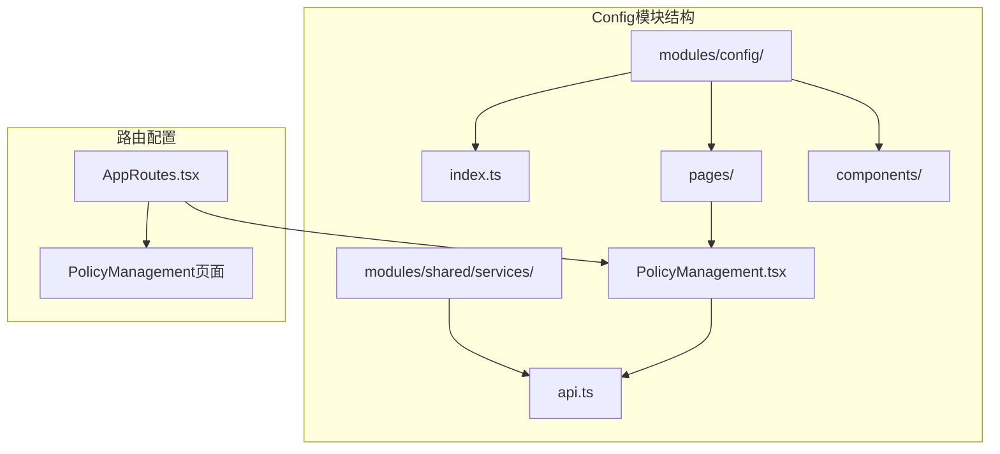
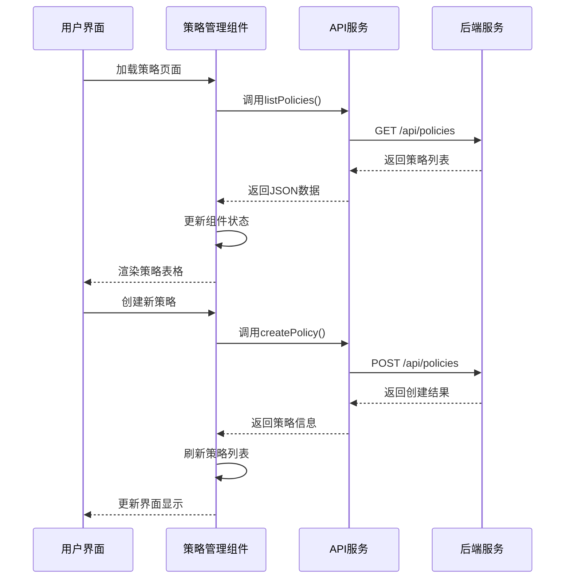
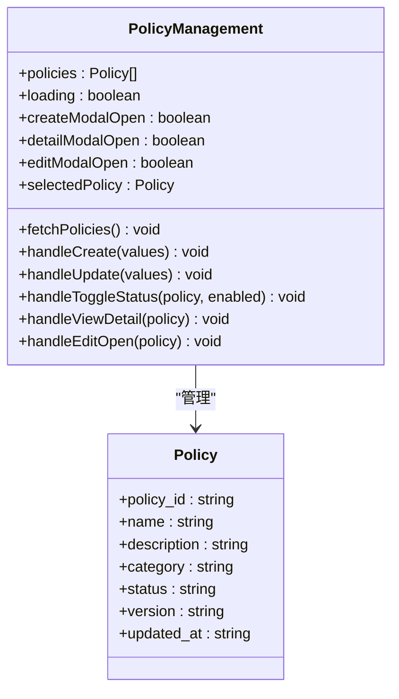
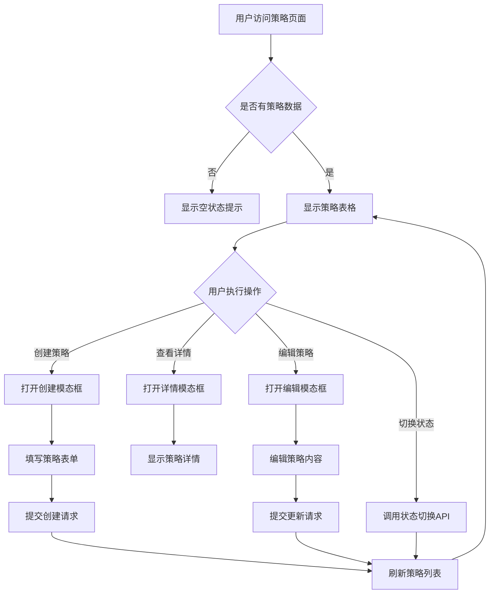
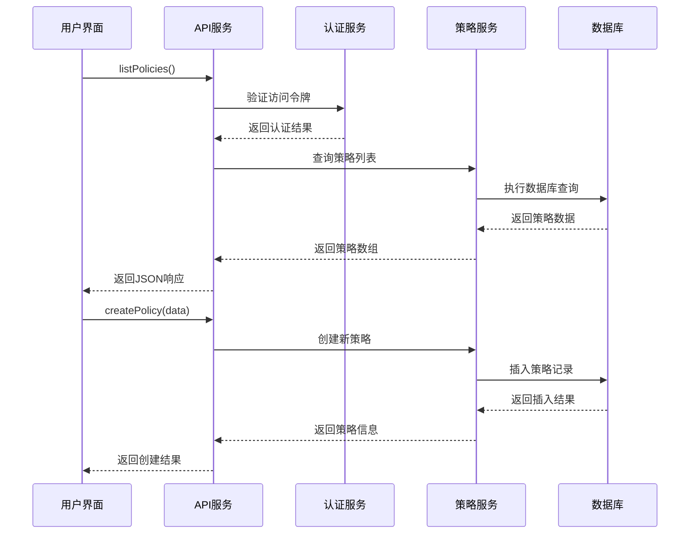
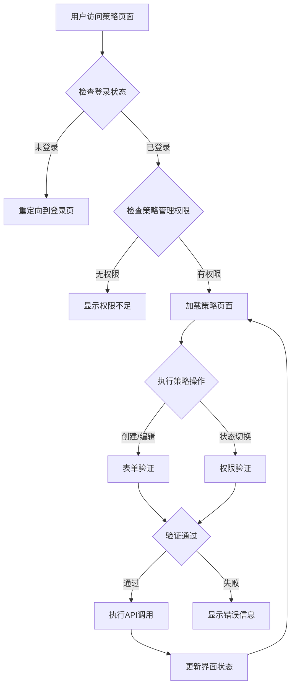
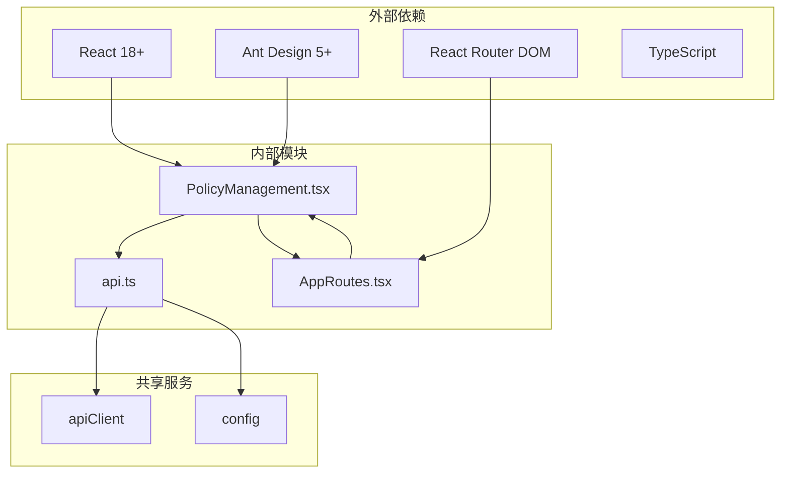

# Config模块

<cite>
**本文档引用的文件**
- [PolicyManagement.tsx](file://frontend/src/modules/config/pages/PolicyManagement.tsx)
- [AppRoutes.tsx](file://frontend/src/AppRoutes.tsx)
- [api.ts](file://frontend/src/modules/shared/services/api.ts)
- [api_integration.test.ts](file://frontend/src/test/api_integration.test.ts)
</cite>

## 目录
1. [简介](#简介)
2. [项目结构](#项目结构)
3. [核心组件](#核心组件)
4. [架构概览](#架构概览)
5. [详细组件分析](#详细组件分析)
6. [依赖关系分析](#依赖关系分析)
7. [性能考虑](#性能考虑)
8. [故障排除指南](#故障排除指南)
9. [结论](#结论)
10. [附录](#附录)

## 简介

Config模块是Graphiti平台中的策略管理系统，专门负责OPA（Open Policy Agent）策略的全生命周期管理。该模块提供了完整的策略配置、编辑、验证和部署功能，支持多种策略分类和状态管理。

策略管理页面作为Config模块的核心组件，采用了现代化的React开发模式，集成了Ant Design UI框架，提供了直观易用的策略管理界面。系统支持策略的创建、编辑、删除、启用/禁用等完整操作，并具备实时的状态切换和详情展示功能。

## 项目结构

Config模块在前端项目中的组织结构如下：



**图表来源**
- [PolicyManagement.tsx:1-50](file://frontend/src/modules/config/pages/PolicyManagement.tsx#L1-L50)
- [AppRoutes.tsx:1-61](file://frontend/src/AppRoutes.tsx#L1-L61)

**章节来源**
- [PolicyManagement.tsx:1-50](file://frontend/src/modules/config/pages/PolicyManagement.tsx#L1-L50)
- [AppRoutes.tsx:1-61](file://frontend/src/AppRoutes.tsx#L1-L61)

## 核心组件

### 策略管理主组件

策略管理页面采用函数式组件设计，使用React Hooks进行状态管理。主要组件包括：

- **策略列表显示**：基于Ant Design Table组件，支持分页、排序和筛选
- **策略表单**：包含创建和编辑两种模式的表单界面
- **模态框组件**：用于详情展示、创建和编辑操作
- **状态管理**：使用useState和useEffect处理异步数据加载

### 数据模型

策略数据结构采用TypeScript接口定义：

```typescript
interface Policy {
  policy_id: string;
  name: string;
  description: string;
  category: string;
  status: string;
  version: string;
  updated_at: string;
}
```

**章节来源**
- [PolicyManagement.tsx:40-48](file://frontend/src/modules/config/pages/PolicyManagement.tsx#L40-L48)
- [PolicyManagement.tsx:71-98](file://frontend/src/modules/config/pages/PolicyManagement.tsx#L71-L98)

## 架构概览

策略管理系统的整体架构采用前后端分离设计，前端通过API服务与后端进行数据交互。



**图表来源**
- [PolicyManagement.tsx:84-94](file://frontend/src/modules/config/pages/PolicyManagement.tsx#L84-L94)
- [api.ts:1359-1381](file://frontend/src/modules/shared/services/api.ts#L1359-L1381)

**章节来源**
- [PolicyManagement.tsx:84-143](file://frontend/src/modules/config/pages/PolicyManagement.tsx#L84-L143)
- [api.ts:1357-1439](file://frontend/src/modules/shared/services/api.ts#L1357-L1439)

## 详细组件分析

### 策略管理页面组件

策略管理页面是一个完整的CRUD应用，包含以下核心功能：

#### 表格列定义



**图表来源**
- [PolicyManagement.tsx:40-48](file://frontend/src/modules/config/pages/PolicyManagement.tsx#L40-L48)
- [PolicyManagement.tsx:71-98](file://frontend/src/modules/config/pages/PolicyManagement.tsx#L71-L98)

#### 策略分类系统

系统支持六种策略分类，每种分类都有对应的中文标签：

| 分类代码 | 中文标签 | 用途说明 |
|---------|---------|----------|
| access_control | 访问控制 | 用户权限和资源访问管理 |
| data_privacy | 数据隐私 | 数据保护和隐私合规策略 |
| compliance | 合规审计 | 法律法规遵循和审计要求 |
| security | 安全策略 | 系统安全和威胁防护 |
| workflow | 工作流控制 | 业务流程和工作流管理 |
| custom | 自定义 | 用户自定义策略 |

#### 用户交互流程



**图表来源**
- [PolicyManagement.tsx:169-242](file://frontend/src/modules/config/pages/PolicyManagement.tsx#L169-L242)
- [PolicyManagement.tsx:100-133](file://frontend/src/modules/config/pages/PolicyManagement.tsx#L100-L133)

**章节来源**
- [PolicyManagement.tsx:169-242](file://frontend/src/modules/config/pages/PolicyManagement.tsx#L169-L242)
- [PolicyManagement.tsx:100-133](file://frontend/src/modules/config/pages/PolicyManagement.tsx#L100-L133)

### API集成与数据流

策略管理页面通过统一的API服务与后端进行通信，支持完整的RESTful操作：

#### API调用序列



**图表来源**
- [api.ts:1359-1381](file://frontend/src/modules/shared/services/api.ts#L1359-L1381)
- [api.ts:1383-1398](file://frontend/src/modules/shared/services/api.ts#L1383-L1398)

**章节来源**
- [api.ts:1357-1439](file://frontend/src/modules/shared/services/api.ts#L1357-L1439)
- [api_integration.test.ts:307-320](file://frontend/src/test/api_integration.test.ts#L307-L320)

### 权限控制与验证逻辑

策略管理页面实现了多层次的权限控制和数据验证机制：

#### 权限控制流程



**图表来源**
- [AppRoutes.tsx:19-25](file://frontend/src/AppRoutes.tsx#L19-L25)
- [PolicyManagement.tsx:100-133](file://frontend/src/modules/config/pages/PolicyManagement.tsx#L100-L133)

#### 表单验证规则

策略管理表单实现了严格的前端验证机制：

| 字段 | 验证规则 | 错误提示 |
|------|----------|----------|
| 策略名称 | 必填，长度2-100字符 | 请输入策略名称 |
| 策略分类 | 必选项，从预定义列表选择 | 请选择分类 |
| 策略描述 | 必填，长度不超过500字符 | 请输入描述 |
| Markdown内容 | 必填，支持多行文本 | 请输入策略内容 |

**章节来源**
- [PolicyManagement.tsx:294-354](file://frontend/src/modules/config/pages/PolicyManagement.tsx#L294-L354)
- [AppRoutes.tsx:19-25](file://frontend/src/AppRoutes.tsx#L19-L25)

## 依赖关系分析

策略管理模块的依赖关系清晰明确，遵循单一职责原则：



**图表来源**
- [PolicyManagement.tsx:1-38](file://frontend/src/modules/config/pages/PolicyManagement.tsx#L1-L38)
- [AppRoutes.tsx:1-17](file://frontend/src/AppRoutes.tsx#L1-L17)

**章节来源**
- [PolicyManagement.tsx:1-38](file://frontend/src/modules/config/pages/PolicyManagement.tsx#L1-L38)
- [AppRoutes.tsx:1-17](file://frontend/src/AppRoutes.tsx#L1-L17)

## 性能考虑

策略管理页面在设计时充分考虑了性能优化：

### 数据加载优化
- 使用分页机制限制单次加载数据量
- 实现缓存策略避免重复请求
- 采用异步加载减少首屏渲染时间

### 用户体验优化
- 实时状态更新避免页面刷新
- 加载状态指示提升用户体验
- 错误处理机制确保界面稳定性

### 内存管理
- 合理的组件卸载清理
- 防抖处理避免频繁API调用
- 优化的渲染策略减少DOM操作

## 故障排除指南

### 常见问题及解决方案

#### 策略列表加载失败
**症状**：页面显示空白或加载指示器持续旋转
**原因**：网络连接问题或API服务不可用
**解决方案**：
1. 检查网络连接状态
2. 验证API服务可用性
3. 查看浏览器开发者工具中的错误信息

#### 策略创建失败
**症状**：创建表单提交后无响应或显示错误消息
**原因**：表单验证失败或后端服务异常
**解决方案**：
1. 检查必填字段是否完整
2. 验证策略内容格式正确
3. 查看后端错误日志

#### 权限访问被拒绝
**症状**：访问策略页面显示权限不足
**原因**：用户权限不足或会话过期
**解决方案**：
1. 检查用户角色权限
2. 重新登录系统
3. 联系系统管理员

**章节来源**
- [PolicyManagement.tsx:89-93](file://frontend/src/modules/config/pages/PolicyManagement.tsx#L89-L93)
- [PolicyManagement.tsx:112-115](file://frontend/src/modules/config/pages/PolicyManagement.tsx#L112-L115)

## 结论

Config模块的策略管理页面是一个功能完整、设计合理的前端应用。它成功地将复杂的策略管理需求转化为直观易用的用户界面，同时保持了良好的性能和可维护性。

该模块的主要优势包括：
- **完整的CRUD功能**：支持策略的全生命周期管理
- **直观的用户界面**：基于Ant Design的设计系统
- **强大的权限控制**：多层次的安全保障机制
- **优秀的用户体验**：流畅的交互和及时的反馈
- **可靠的错误处理**：完善的异常情况处理机制

通过模块化的架构设计和清晰的组件职责划分，该策略管理页面为Graphiti平台提供了稳定可靠的基础功能支撑。

## 附录

### API接口规范

#### 策略管理API

| 方法 | 端点 | 功能 | 请求参数 | 响应数据 |
|------|------|------|----------|----------|
| GET | /api/policies | 获取策略列表 | status, category, limit | policies[], total |
| POST | /api/policies | 创建新策略 | name, description, markdown_content, category | policy_id, name, status, rego_content |
| GET | /api/policies/{id} | 获取策略详情 | - | policy详情 |
| PUT | /api/policies/{id} | 更新策略 | name, description, markdown_content, status | policy_id, name, status, version |
| POST | /api/policies/{id}/toggle | 切换策略状态 | enabled | policy_id, status |

### 用户操作指南

#### 创建策略步骤
1. 点击"创建策略"按钮
2. 填写策略基本信息（名称、分类、描述）
3. 编写策略内容（支持Markdown语法）
4. 点击"创建"按钮提交
5. 查看创建结果并确认

#### 编辑策略步骤
1. 在策略列表中点击"编辑"按钮
2. 修改策略相关信息
3. 点击"保存"按钮
4. 确认修改结果

#### 策略状态管理
- **启用**：策略对系统生效
- **禁用**：策略暂时失效
- **草稿**：策略未完成，不参与执行

**章节来源**
- [api.ts:1359-1439](file://frontend/src/modules/shared/services/api.ts#L1359-L1439)
- [PolicyManagement.tsx:294-466](file://frontend/src/modules/config/pages/PolicyManagement.tsx#L294-L466)