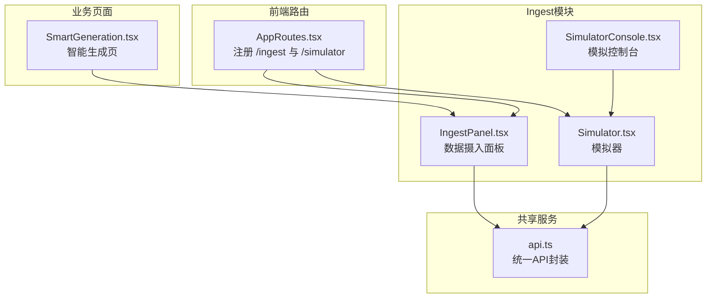
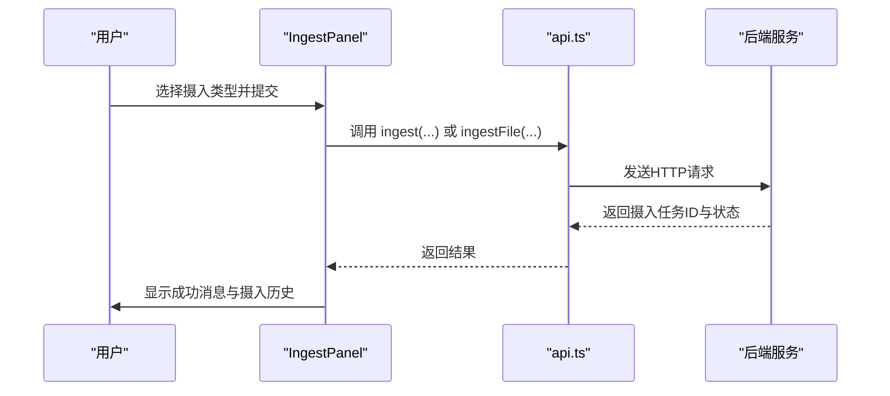
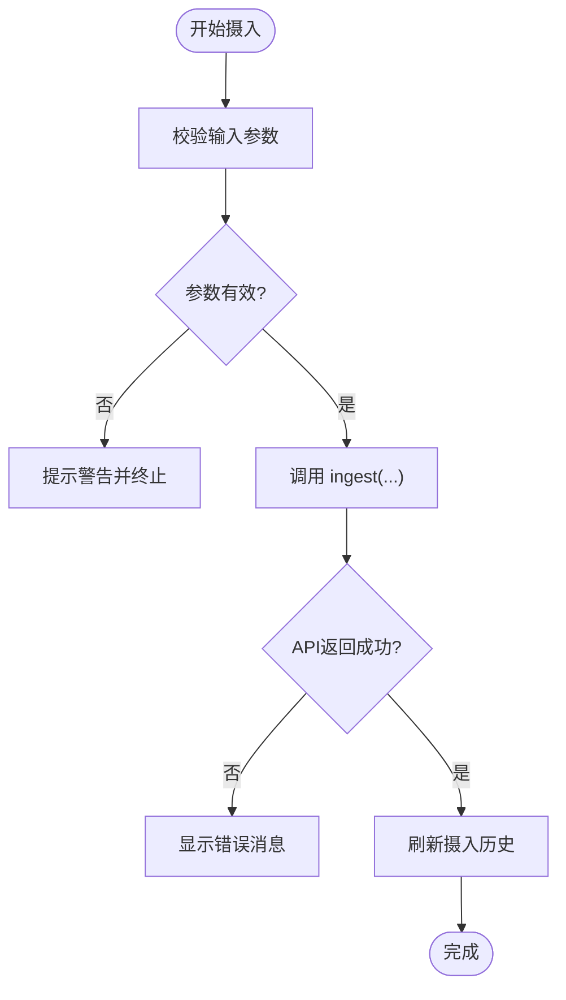
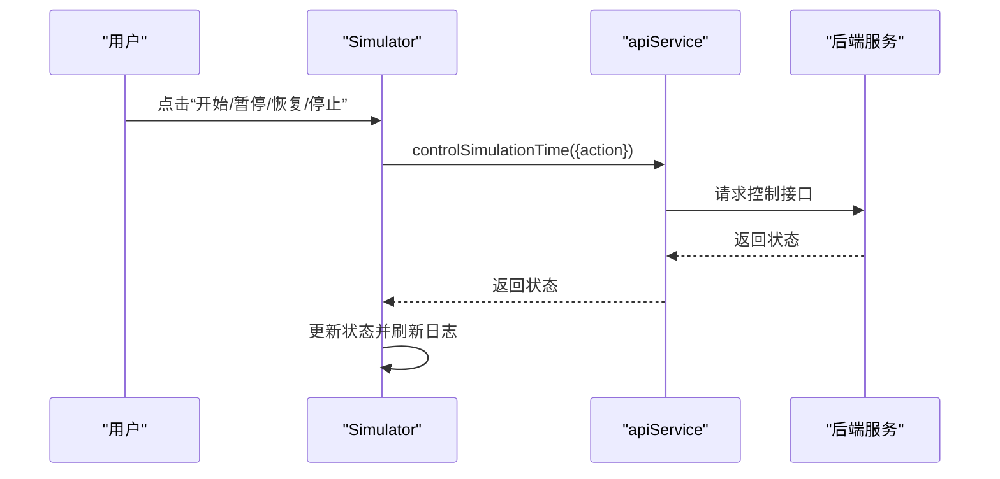
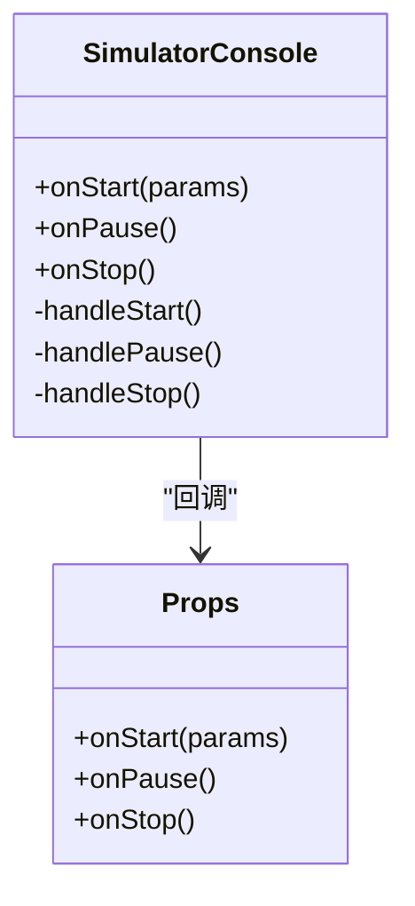
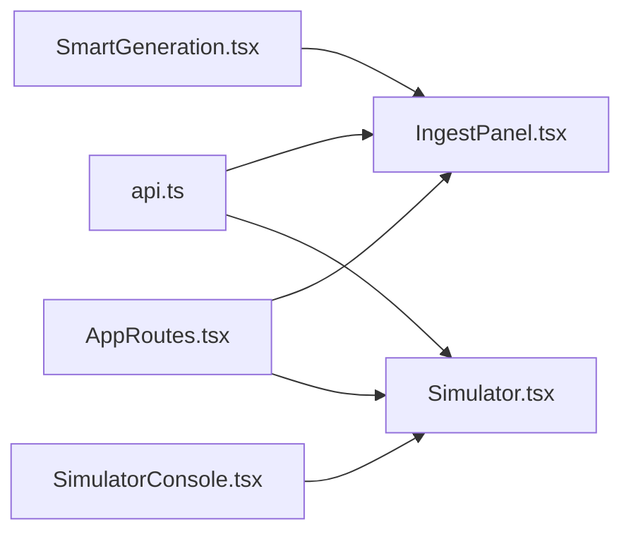

# Ingest模块

<cite>
**本文档引用的文件**
- [AppRoutes.tsx](file://frontend/src/AppRoutes.tsx)
- [IngestPanel.tsx](file://frontend/src/modules/ingest/pages/IngestPanel.tsx)
- [Simulator.tsx](file://frontend/src/modules/ingest/pages/Simulator.tsx)
- [SimulatorConsole.tsx](file://frontend/src/modules/ingest/components/SimulatorConsole.tsx)
- [api.ts](file://frontend/src/modules/shared/services/api.ts)
- [SmartGeneration.tsx](file://frontend/src/modules/business/pages/SmartGeneration.tsx)
</cite>

## 目录
1. [简介](#简介)
2. [项目结构](#项目结构)
3. [核心组件](#核心组件)
4. [架构总览](#架构总览)
5. [详细组件分析](#详细组件分析)
6. [依赖分析](#依赖分析)
7. [性能考虑](#性能考虑)
8. [故障排查指南](#故障排查指南)
9. [结论](#结论)
10. [附录](#附录)

## 简介
本文件面向前端开发者与产品使用者，系统性梳理 Ingest 模块的前端实现，覆盖数据摄入面板、模拟器与模拟控制台三大核心功能。文档重点解释：
- 数据摄入面板的用户界面设计、进度展示与错误处理
- 模拟器的实时监控与控制功能
- 摄入 API 的调用与数据传输机制
- 数据摄入页面的用户操作流程与界面交互
- 实际的模拟控制台实现示例与数据摄入进度展示

## 项目结构
Ingest 模块位于前端工程的 modules/ingest 目录下，主要由以下文件构成：
- 页面组件：IngestPanel（数据摄入面板）、Simulator（模拟器）
- 通用组件：SimulatorConsole（模拟控制台）
- 路由配置：AppRoutes（注册 /ingest 与 /simulator 路由）
- 业务页面：SmartGeneration（将 IngestPanel 嵌入业务页）

**图表来源**
- [AppRoutes.tsx:44-47](file://frontend/src/AppRoutes.tsx#L44-L47)
- [IngestPanel.tsx:105-1182](file://frontend/src/modules/ingest/pages/IngestPanel.tsx#L105-L1182)
- [Simulator.tsx:88-755](file://frontend/src/modules/ingest/pages/Simulator.tsx#L88-L755)
- [SimulatorConsole.tsx:30-225](file://frontend/src/modules/ingest/components/SimulatorConsole.tsx#L30-L225)
- [api.ts:77-508](file://frontend/src/modules/shared/services/api.ts#L77-L508)
- [SmartGeneration.tsx:1-35](file://frontend/src/modules/business/pages/SmartGeneration.tsx#L1-L35)

**章节来源**
- [AppRoutes.tsx:44-47](file://frontend/src/AppRoutes.tsx#L44-L47)
- [IngestPanel.tsx:105-1182](file://frontend/src/modules/ingest/pages/IngestPanel.tsx#L105-L1182)
- [Simulator.tsx:88-755](file://frontend/src/modules/ingest/pages/Simulator.tsx#L88-L755)
- [SimulatorConsole.tsx:30-225](file://frontend/src/modules/ingest/components/SimulatorConsole.tsx#L30-L225)
- [api.ts:77-508](file://frontend/src/modules/shared/services/api.ts#L77-L508)
- [SmartGeneration.tsx:1-35](file://frontend/src/modules/business/pages/SmartGeneration.tsx#L1-L35)

## 核心组件
- 数据摄入面板（IngestPanel）
  - 支持多种摄入类型：文本、新闻、JSON、自然语言、随机事件、手动录入、文件上传
  - 展示摄入历史、状态与版本切换
  - 内嵌“本体构建详情”抽屉，展示构建进度、处理日志与结果统计
- 模拟器（Simulator）
  - 实时展示模拟状态、速度、事件生成与待采纳数量
  - 控制模拟时间（开始/暂停/恢复/停止）、速度调节、批量采纳事件
  - 提供事件模板管理与模拟日志
- 模拟控制台（SimulatorConsole）
  - 参数配置卡：基础参数与作战参数
  - 实时监控卡：双方战力、伤亡与折线图
  - 控制按钮：开始/暂停/停止/重置
- API 服务（api.ts）
  - 统一封装摄入、构建、版本、查询等接口
  - 提供 ingest、buildOntology、getFullIngestRecord 等关键方法

**章节来源**
- [IngestPanel.tsx:105-1182](file://frontend/src/modules/ingest/pages/IngestPanel.tsx#L105-L1182)
- [Simulator.tsx:88-755](file://frontend/src/modules/ingest/pages/Simulator.tsx#L88-L755)
- [SimulatorConsole.tsx:30-225](file://frontend/src/modules/ingest/components/SimulatorConsole.tsx#L30-L225)
- [api.ts:77-508](file://frontend/src/modules/shared/services/api.ts#L77-L508)

## 架构总览
前端通过 api.ts 对后端 API 进行统一调用，IngestPanel 与 Simulator 分别负责数据摄入与模拟控制；SmartGeneration 将 IngestPanel 嵌入业务流程。

**图表来源**
- [IngestPanel.tsx:418-546](file://frontend/src/modules/ingest/pages/IngestPanel.tsx#L418-L546)
- [api.ts:233-367](file://frontend/src/modules/shared/services/api.ts#L233-L367)

**章节来源**
- [IngestPanel.tsx:418-546](file://frontend/src/modules/ingest/pages/IngestPanel.tsx#L418-L546)
- [api.ts:233-367](file://frontend/src/modules/shared/services/api.ts#L233-L367)

## 详细组件分析

### 数据摄入面板（IngestPanel）
- 功能概览
  - 多标签摄入入口：文本、新闻、JSON、自然语言、随机事件、手动录入、文件上传
  - 历史记录表格：展示摄入时间、来源、状态、版本与操作
  - 构建详情抽屉：基于 API 日志重建构建进度、阶段状态与审计信息
  - 版本切换：点击版本号触发切换动作
- 关键流程
  - 摄入提交：根据标签类型调用对应 ingest 方法，成功后刷新历史
  - 构建启动：runBuildPipeline 启动构建并轮询 getFullIngestRecord 获取最新日志，重建构建详情
  - 查看构建：handleViewBuild 优先使用保存的完整构建过程，否则回退到简化版本
- 错误处理
  - 表单校验：必填项为空时提示警告
  - API 异常：捕获错误并弹出错误消息
  - 加载状态：使用 Spin 与 loading 字段避免重复提交
- 进度展示
  - 步骤条：PIPELINE_STAGES 定义阶段，结合日志状态渲染 wait/process/finish
  - 时间轴：Timeline 展示各阶段操作、状态与耗时
  - 结果统计：实体/关系/事件数量卡片

**图表来源**
- [IngestPanel.tsx:418-546](file://frontend/src/modules/ingest/pages/IngestPanel.tsx#L418-L546)

**章节来源**
- [IngestPanel.tsx:105-1182](file://frontend/src/modules/ingest/pages/IngestPanel.tsx#L105-L1182)
- [api.ts:233-367](file://frontend/src/modules/shared/services/api.ts#L233-L367)

### 模拟器（Simulator）
- 功能概览
  - 实时状态：状态、速度、生成事件数、待采纳数
  - 控制面板：开始/暂停/恢复/停止、速度选择、批量采纳
  - 事件列表：全部/待采纳/已采纳三类标签页
  - 事件模板：新建模板与模板列表
  - 模拟日志：时间轴展示操作与结果
- 关键流程
  - 状态轮询：useEffect 每3秒拉取一次模拟状态
  - 时间控制：controlSimulationTime 接收 start/pause/resume/stop 并刷新状态
  - 事件生成：generateEvents 支持模板、数量、类型筛选、区域与场景ID
  - 模板管理：createEventTemplate 创建模板并刷新列表
  - 批量采纳：adoptEventsBulk 一次性采纳所有待采纳事件
- 错误处理
  - 每个操作均包裹 try/catch，失败时弹出错误消息并记录日志
  - 滚动至日志末尾，确保用户能及时看到最新日志

**图表来源**
- [Simulator.tsx:145-158](file://frontend/src/modules/ingest/pages/Simulator.tsx#L145-L158)

**章节来源**
- [Simulator.tsx:88-755](file://frontend/src/modules/ingest/pages/Simulator.tsx#L88-L755)

### 模拟控制台（SimulatorConsole）
- 功能概览
  - 参数配置：基础参数（红/蓝方初始兵力、推演速度）与作战参数（开火距离、增援响应时间、补给效率）
  - 实时监控：双方战力百分比、伤亡统计、伤亡比与折线图
  - 控制按钮：开始/暂停/停止/重置，并回调父组件传入的 onStart/onPause/onStop
- 折线图
  - 使用 ECharts 初始化并渲染双方战力曲线，随状态变化更新

**图表来源**
- [SimulatorConsole.tsx:30-112](file://frontend/src/modules/ingest/components/SimulatorConsole.tsx#L30-L112)

**章节来源**
- [SimulatorConsole.tsx:30-225](file://frontend/src/modules/ingest/components/SimulatorConsole.tsx#L30-L225)

### API 调用与数据传输机制
- 统一入口
  - api.ts 提供 ingest、ingestFile、buildOntology、getFullIngestRecord 等方法
  - ingest 方法根据 type 分发到具体摄入接口（news/manual/json/natural_language/random）
- 数据传输
  - 文本/新闻/JSON/自然语言：POST JSON 请求体
  - 文件上传：FormData，multipart/form-data
  - 构建：POST 启动构建，随后轮询获取完整记录与日志
- 错误处理
  - 所有 API 调用均通过 try/catch 包裹，失败时弹出错误消息并记录日志

**章节来源**
- [api.ts:233-367](file://frontend/src/modules/shared/services/api.ts#L233-L367)
- [api.ts:598-606](file://frontend/src/modules/shared/services/api.ts#L598-L606)
- [api.ts:491-508](file://frontend/src/modules/shared/services/api.ts#L491-L508)
- [api.ts:458-489](file://frontend/src/modules/shared/services/api.ts#L458-L489)

### 用户操作流程与界面交互
- 数据摄入页面
  - 选择标签页 → 填写输入 → 点击“开始摄入” → 成功后历史表格刷新 → 可查看详情/构建/版本切换
- 模拟器页面
  - 查看状态与统计 → 控制模拟时间/速度 → 生成事件/创建模板 → 查看事件列表与日志 → 批量采纳

**章节来源**
- [IngestPanel.tsx:827-987](file://frontend/src/modules/ingest/pages/IngestPanel.tsx#L827-L987)
- [Simulator.tsx:386-755](file://frontend/src/modules/ingest/pages/Simulator.tsx#L386-L755)

## 依赖分析
- 组件耦合
  - IngestPanel 与 Simulator 均依赖 api.ts 提供的统一接口
  - SimulatorConsole 作为 Simulator 的子组件，通过回调与父组件通信
  - SmartGeneration 将 IngestPanel 嵌入业务页
- 外部依赖
  - Ant Design UI 组件库
  - ECharts 图表库（用于模拟控制台折线图）
- 路由集成
  - AppRoutes 注册 /ingest 与 /simulator 路由，受登录保护

**图表来源**
- [api.ts:77-508](file://frontend/src/modules/shared/services/api.ts#L77-L508)
- [IngestPanel.tsx:105-1182](file://frontend/src/modules/ingest/pages/IngestPanel.tsx#L105-L1182)
- [Simulator.tsx:88-755](file://frontend/src/modules/ingest/pages/Simulator.tsx#L88-L755)
- [SimulatorConsole.tsx:30-225](file://frontend/src/modules/ingest/components/SimulatorConsole.tsx#L30-L225)
- [SmartGeneration.tsx:1-35](file://frontend/src/modules/business/pages/SmartGeneration.tsx#L1-L35)
- [AppRoutes.tsx:44-47](file://frontend/src/AppRoutes.tsx#L44-L47)

**章节来源**
- [AppRoutes.tsx:44-47](file://frontend/src/AppRoutes.tsx#L44-L47)
- [api.ts:77-508](file://frontend/src/modules/shared/services/api.ts#L77-L508)

## 性能考虑
- 轮询策略
  - IngestPanel 构建轮询间隔为 0.5 秒，最多轮询 60 次，避免过度请求
  - Simulator 状态轮询间隔为 3 秒，减少对后端压力
- UI 渲染优化
  - 使用分页表格与抽屉组件，避免一次性渲染大量数据
  - ECharts 在状态变更时初始化，避免重复实例化
- 错误与加载状态
  - 使用 loading 字段与 Spin 组件提升用户体验，防止重复提交

[本节为通用指导，无需特定文件引用]

## 故障排查指南
- 摄入失败
  - 检查输入参数是否为空（文本/新闻/JSON/自然语言/手动录入）
  - 查看消息提示与浏览器控制台错误
  - 确认后端 API 可用（健康检查接口）
- 构建无进度
  - 确认已成功调用构建接口并处于轮询中
  - 检查 getFullIngestRecord 是否返回最新日志
- 模拟控制异常
  - 确认控制接口返回状态正常
  - 检查日志是否正确追加与滚动
- 图表不显示
  - 确认 ECharts 已正确初始化且容器存在
  - 检查状态变更逻辑是否触发图表更新

**章节来源**
- [IngestPanel.tsx:166-295](file://frontend/src/modules/ingest/pages/IngestPanel.tsx#L166-L295)
- [Simulator.tsx:145-158](file://frontend/src/modules/ingest/pages/Simulator.tsx#L145-L158)
- [SimulatorConsole.tsx:42-87](file://frontend/src/modules/ingest/components/SimulatorConsole.tsx#L42-L87)

## 结论
Ingest 模块前端通过清晰的组件划分与统一的 API 封装，实现了数据摄入与模拟控制的完整闭环。数据摄入面板提供多样的摄入入口与详尽的构建进度展示；模拟器具备实时监控与便捷控制能力；模拟控制台则提供了直观的参数配置与可视化监控。整体设计兼顾可用性与可维护性，适合在复杂业务场景中持续演进。

[本节为总结性内容，无需特定文件引用]

## 附录
- 路由与页面映射
  - /ingest → IngestPanel
  - /simulator → Simulator
- 相关页面
  - SmartGeneration 将 IngestPanel 嵌入业务流程

**章节来源**
- [AppRoutes.tsx:44-47](file://frontend/src/AppRoutes.tsx#L44-L47)
- [SmartGeneration.tsx:1-35](file://frontend/src/modules/business/pages/SmartGeneration.tsx#L1-L35)